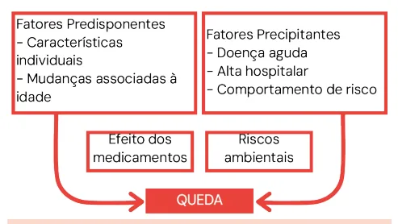
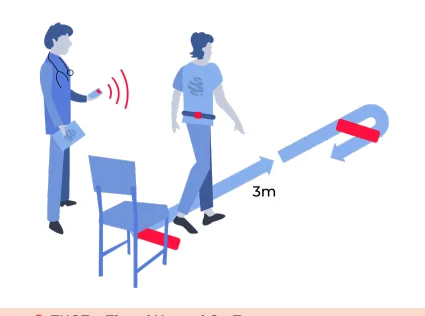
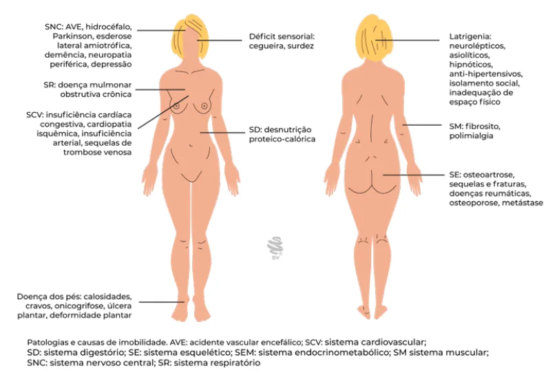
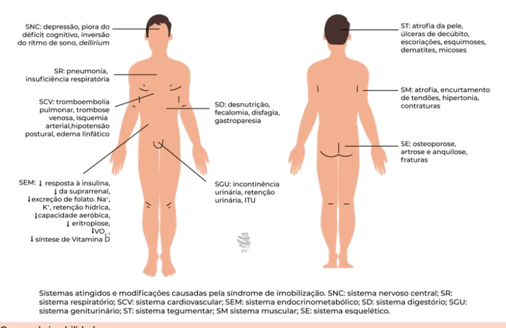

# Instabilidade Postural, Quedas e Imobilidade

<!-- page:1 -->

## Instabilidade Postural, Quedas e Imobilidade

Instabilidade Postural, Quedas e Imobilidade (CM).

### Instabilidade Postural e Quedas

- A instabilidade postural resulta em quedas, que aumentam a morbimortalidade no paciente idoso.

> ⚠️ Tabela reconstruída a partir de OCR — confira contra a fonte original.

**Fatores de risco principais para quedas**

| Categoria | Fatores |
|---|---|
| Queda prévia | — |
| Sexo feminino | — |
| Déficit visual | — |
| Distúrbio de marcha | — |
| Perda de equilíbrio e força | — |
| Medicações | Benzodiazepínicos, drogas Z (zolpidem), antidepressivos, anti-hipertensivos, antipsicóticos, anti-histamínicos |
| Comorbidades | Epilepsia, doença de Parkinson, miopatias, hidrocefalia de pressão normal (HPN), demências |

### Quedas

- A instabilidade postural muitas vezes resulta nas quedas, que podem ser definidas por: "Evento descrito por vítima ou testemunha em que a pessoa inadvertidamente vai de encontro ao solo ou a outro local em nível mais baixo que o anteriormente ocupado, consciente ou inconsciente, com lesão ou não."
  - O "tropeço", portanto, é também considerado uma queda!
- Consequências das quedas:
  - Aumenta fragilidade;
  - Aumenta mortalidade;
  - Aumenta o grau de dependência;
  - Aumenta a taxa de institucionalização;
  - Favorece o declínio funcional.
- Na investigação das quedas, devemos excluir: causas violentas; síncope; convulsão; trauma esportivo.

### Classificação da Queda

- **Baixa energia**: queda da própria altura; queda de assento;
- **Alta energia**: queda em rampa; queda em escada com altura maior que 3 degraus; presença de trauma cranioencefálico (TCE) ou ferimento corto-contuso (FCC) em face; ferimento grave.

> ⚠️ Este trecho ("alta energia") estava embaralhado no OCR com os critérios da síndrome do imobilismo — confira contra a fonte original.

### Avaliação de Risco

- Escala de Dalton: mais sensível;
- Escala Mobility: mais específica;
- TUGT (*Timed Up and Go Test*): mais utilizado.

### Profilaxia de Quedas

- Reposição de vitamina D (se deficiência);
- Correção de distúrbios da força, marcha e equilíbrio;
- Correção de problemas auditivos;
- Revisão dos medicamentos;
- Medidas para aumentar a segurança da casa;
- Avaliação podiátrica.

## Síndrome do Imobilismo

- Especialmente doenças degenerativas e disfunções orgânicas em fase terminal;
- Diagnóstico: 2 critérios maiores + 2 critérios menores.

**Critérios maiores**

- Déficit cognitivo moderado a grave;
- Múltiplas contraturas.

**Critérios menores**

- Lesão por pressão;
- Disfagia;
- Dupla incontinência — fecal e urinária;
- Afasia.

**Síndrome do caidor crônico**: ≥ 2 quedas no último ano.

## Fatores de Risco para Quedas

- Verificar Tabela 1 na próxima página.

## Investigação da Queda

- Através da história clínica, espera-se identificar os fatores de risco, classicamente também divididos em fatores predisponentes e precipitantes.

**Anamnese**

- Perda de consciência: cardiogênica/neurogênica;
- Ambiente (fator externo);
- Tontura;
- Fraqueza súbita.

**Exame físico**

- Neurogênica;
- Arritmia;
- Pressão arterial (3 medidas): em pé e deitado (hipotensão ortostática);
- Exame dos pés;
- Marcha.

---

<!-- page:2 -->

> ⚠️ Tabela reconstruída a partir de OCR — confira contra a fonte original.

**Tabela 1: Fatores de risco para quedas**

| Principais | Comorbidades | Ambientais |
|---|---|---|
| Queda prévia | Epilepsia | Tapetes |
| Distúrbio de marcha e/ou uso de dispositivos de marcha | Doença de Parkinson | Degrau |
| Perda de equilíbrio e força muscular | Miopatia/neuropatia periférica | Calçado inadequado |
| Medicamentos: benzodiazepínicos, antidepressivos, anti-hipertensivos, antipsicóticos, anti-histamínicos | Síncope cardiogênica | Falta de barra de apoio |
| Idade | Hidrocefalia de pressão normal (HPN) | Difícil acesso a objetos |
| Maior dependência funcional | Demência | Ambiente hospitalar ou asilar |
| Impulsividade | Hipotensão postural | — |
| Visão prejudicada | Osteoartrite de joelhos | — |
| Mulheres, viúvos, solteiros ou desquitados | > 2 comorbidades | — |

**Fatores predisponentes e precipitantes**

- O fator predisponente equivale às características já "prévias" do paciente;
- O fator precipitante é o que motivou a queda naquele momento.

*Figura 1: Fluxograma de fatores predisponentes e precipitantes.*

## Avaliação do Risco

- Existem diversas escalas:
  - Dalton: mais sensível;
  - Mobility: mais específica;
  - POMA/Tinetti: também cobrada em algumas provas;
  - TUGT (*Timed Up and Go Test*): principal escala.

**TUGT (*Timed Up and Go Test*)**

- Com o paciente sentado na cadeira, inicia-se a contagem do tempo para uma caminhada de 3 metros e retorno à posição original (sentado na cadeira);
- Consegue trazer uma avaliação para: força em quadríceps; marcha; equilíbrio dinâmico;
- Interpretação: **> 14 segundos**: tendência à queda, de acordo com a maioria das literaturas; **< 10 segundos**: não caidores; **> 32,6 segundos**: caidores.

*Figura 2: TUGT — Timed Up and Go Test.*

## Profilaxia para Quedas

**Reposição de vitamina D**

- Em casos de deficiência (< 30 ng/mL);
- Associa-se com o risco de perda de força e massa muscular;
- Associa-se com a redução da performance física e imobilidade.

**Correção de distúrbios da força, marcha e equilíbrio**

- Pode ser sugerido o uso de órteses e meios de suporte como andadores e bengalas.

**Correção de problemas auditivos**

- Tais déficits podem estar associados às alterações vestibulares e, consequentemente, à perda do equilíbrio.

**Revisão dos medicamentos**

- Avaliar os efeitos colaterais que aumentam a probabilidade de quedas, seja por alteração do sensório, seja por provocarem desequilíbrio, disautonomia ou hipotensão postural;
- Benzodiazepínicos, alfa-agonistas e anti-histamínicos de primeira geração.

**Medidas para aumentar a segurança da casa**

- Instalação de barras em ambientes escorregadios, como banheiro;

---

<!-- page:3 -->

- Retirada de móveis baixos e tapetes reduz substancialmente o risco desses pacientes caírem.

**Avaliação podiátrica**

- Refere-se à avaliação do paciente no intuito de identificar as alterações cutâneas, calosidades e contraturas que podem aumentar a chance de que ele caia.

## Causas de Imobilidade

- Especialmente doenças degenerativas e disfunções orgânicas em fase terminal;
- "Conjunto de sinais e sintomas resultantes da supressão de todos os movimentos articulares que, por conseguinte, prejudica a mudança postural, compromete a independência e leva à incapacidade, à fragilidade e à morte."
- Conferem critério absoluto para cuidados paliativos.

*Figura 3: Causas de imobilidade.*

- Verificar Figura 3.

## Diagnóstico

- São necessários 2 critérios maiores E 2 critérios menores.

**Critérios maiores**

- Déficit cognitivo moderado a grave;
- Múltiplas contraturas.

**Critérios menores**

- Lesão por pressão;
- Disfagia;
- Dupla incontinência (fecal e urinária);
- Afasia.

