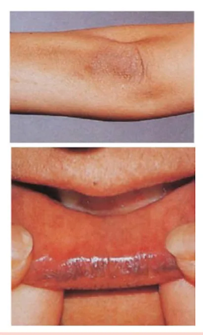

# Insuficiência Adrenal

<!-- page:1 -->

Insuficiência Adrenal (CM) INSUFICIÊNCIA ADRENAL CRÔNICA

- Primária (40%): doença de Addison, infecciosa

(tuberculose), fármacos, metástases

- Secundária (60%): doenças da hipófise/hipotálamo e retirada abrupta de corticoide em uso crônico

(> 3 semanas)

- Quadro clínico (IA primária e secundária) Deficiência glicocorticoide (hipotensão, tontura, perda ponderal, hipoglicemia, sintomas gastrointestinais) Deficiência androgênica (redução da pilificação e libido)

- Quadro clínico (IA primária) Deficiência mineralocorticoide: hipercalemia, hiponatremia, acidose metabólica, hipotensão pronunciada Hiperpigmentação cutânea (lembrar POMC)

## CRÔNICA

- Comprometimento da produção de hormônios da córtex adrenal (cortisol, androgênios, e, nas causas primárias, aldosterona).

## ETIOLOGIAS

- Verificar Tabela 1

QUADRO CLÍNICO Deficiência de glicocorticoide (IA primária e secundária)

- Astenia;

- Mal-estar;

- Anorexia;

- Distúrbios gastrointestinais;

- Perda de peso;

- Hipotensão;

- Hipoglicemia;

Tabela 1: Etiologias de insuficiência adrenal (IA) crônica Primária (40%) Doença de Addison (70-90%)

Tuberculose (10 Infecciosas Paracoco, histoplasmos HIV Antifúngicos, anticon Fármacos etomidato Metástases (pulmão e mama)

Adrenoleucodistrofia - Diagnóstico: | Teste do cortisol basal às 08h | Teste de estímulo com ACTH (Cortrosina)

| Teste da hipoglicemia induzida por insulina (ITT)

- Tratamento Crônica: prednisona/prednisolona/hidrocortisona Orientação com relação a aumento de dose em situações estressoras Aguda: hidratação SF 0,9% + hidrocortisona EV + tratar evento precipitante

± fludrocortisona (IA primária) Deficiência de andrógenos – SDHEA (IA primária e secundária)

- Redução da libido;

- Redução da pilificação Perda de pêlos em áreas andrógeno-dependentes:

virilha, axila e barba; Deficiência de mineralocorticoide (IA primária)

- Aumento da renina e queda da aldosterona;

- Avidez por sal;

- Hipovolemia;

- Hipotensão;

- Acidose metabólica leve;

- Hiponatremia;

- Hipercalemia;

Hiperpigmentação cutânea

- Em pacientes com IA primária ocorre aumento na secreção de ACTH devido a feedback positivo à queda do cortisol sérico.

- Ao formar o ACTH, ocorre a formação do MSH provenientes da POMC.

(ativação de melanócitos), visto que ambos são

- Verificar Figura 1 se, criptococose nvulsivantes, o Retirada abrupta de corticoide em uso crônico

Secundária (60%) 0-20%) Doenças da hipófise e hipotálamo (> 3 semanas)

---

<!-- page:2 -->

## RASTREAMENTO

Teste da hipoglicemia Teste da Cortrosina

- Sinais ou sintomas sugestivos; induzida por insulina (ITT)

- Portadores de doenças autoimunes Vitiligo, DM1 e Tireoidite de Hashimoto ATCH sintético 250 µg

Insulina Regular 0,05 UI/kg

- Portadores de doenças infecciosas pela manhâ

- Portadores de doenças infecciosas Tuberculose, AIDS, citomegalovirose e histoplasmose

## INVESTIGAÇÃO

- T

- - Figura 1: Hiperpigmentação mucocutânea

- Cortisol basal às 08 horas insuficiência adrenal pela manhâ hipoglicemia induzida por insulina

< 3 - 5 µg/dL 3 - 5 A 18 µg/dL >18 µg/dL Teste da Confirma IA Exclui IA Cortrosina Ou ITT ACTH >100 Normal ou Reduzida Primária Secundária Figura 2: Teste do cortisol basal para investigação de Cortisol <18 µg/dL Cortisol Glicemia Capilar < 40 >18 µg/dL mg/dL Afasta IA >18 µg/dL Afasta IA Figura 3: Teste de estímulo com ACTH (Cortrosin) e da

- Após confirmarmos a insuficiência adrenal e separarmos entre primária e secundária, precisamos investigar a etiologia

- Verificar Figura 4 na próxima página

## TRATAMENTO

- Reposição de corticoides, alguns com potencial mineralocorticoide mais acentuado

- Na IA primária (que cursa com deficiência de mineralocorticoide), pode ser feita a fludrocortisona para “substituir” a produção de aldosterona;

- Melhor parâmetro para avaliação da eficácia do tratamento é a resposta clínica Hipotensão postural; Níveis de sódio e potássio; Perda de peso; Sintomas gastrointestinais;

- Os pacientes que têm IA crônica, em situações de estresse metabólico (doença, cirurgia), precisam duplicar a dose de glicocorticoide no período estressor; Uso de bracelete ou cartão de identificação pelo doente.

Tabela 2: Tratamento da insuficiência adrenal crônica Insuficiência adrenal Insuficiência adrenal primária secundária Prednisona ou prednisolona 3 a 5mg/d VO Hidrocortisona 10 a 20mg às 8h, 12h e 17h VO Fludrocortisona 0,05 a 0,2mg às 8h VO

---

<!-- page:3 -->

Insuficiência Adrenal (IA) IA Primária IA Secundária (IAS) IA Primária Dosar Ac210H T4 Livre E horm (+) (-)

Normais DA TC Adrenal Autoimune Deficiênc isolada d Adrenais Lesões ACTH normais ou Bilaterais atrofiadas

- Doenças cadeia muito longa - Hemorragia

Dosar ácido graxo de granulomatosas

- Metástases

- Linfoma etc.

(+) Adrenoleucodistrofia Figura 4: Fluxograma de investigação etiológica da insuficiência a

## INSUFICIÊNCIA ADRENAL AGUDA

## ETIOLOGIA

- A principal causa é um paciente que tem IA crônica + exposição a estresse (infecções, cirurgia, desidratação) e não dobra a dose do glicocorticoide;

- Suspensão abrupta de glicocorticoides de uso crônico;

- Reposição de hormônio tireoidiano em indivíduos com hipotireoidismo e hipocortisolismo Hipotireoidismo mascarando a insuficiência adrenal:

acontece em insuficiência adrenal secundária a tumores hipofisários;

- Uso de inibidores da esteroidogênese adrenal em pacientes com reserva funcional das adrenais reduzida Portadores de HIV que já têm acometimento adrenal (reserva adrenal comprometida).

## QUADRO CLÍNICO

- Gerais Fadiga; Náusea; Vômito; Dor abdominal; Hipotensão; Choque hipovolêmico; Coma. IA Secundária (IAS) e, PRL IGF-1, LH, FSH RM da sela túrcica mônios gonadais s Baixos Normal Massa Selar cia Pan-hipopituitarismo - IAS - Adenoma de idiopática hipofisário

Dosar TSH

- Hipofisite - Germinoma

- Craniofaringloma

- Hiposifite

- Doenças infiltrativas ou infecciosas etc.

adrenal

- Deficiência de mineralocorticoides Hiponatremia; Hipercalemia.

- Crianças: hipoglicemia refratárias

TRATAMENTO ;

- Medidas gerais

- Laboratoriais: hemograma, bioquímica, cortisol e ACTH

- Expansão volêmica - solução glicofisiológica

:

- Corrigir distúrbios eletrolíticos e hipoglicemia;

- Tratar infecção/fatores precipitantes;

- Reposição de glicocorticóides Hidrocortisona, 100 mg IV (ataque) + 50 mg de 6/6 a h IV (manutenção) – glicocorticoide com maior efeito mineral corticoide; Redução de dose em 50% no 2º dia; Quando o paciente estiver em dieta oral, adicionar glicocorticoide oral associado a fludrocortisona (se insuficiência mineralocorticóide).

## REFERÊNCIAS

Figura 1:: Endocrinologia clínica (Vilar et.al. Endocrinologia Clínica. 7 ed. Guanabara Koogan, 2021)
