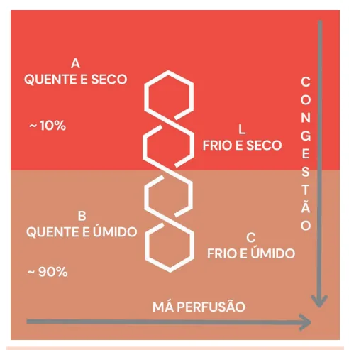

# Insuficiência Cardíaca Descompensações Agudas

<!-- page:1 -->

INSUFICIÊNCIA CARDÍACA DESCOMPENSAÇÕES AGUDAS Descompensações Agudas da Insuficência Cardíaca (CM)

- Assim como na IC ambulatorial, a IC descompensada se manifesta com a instalação de sintomas de má perfusão e/ou de congestão, mas de maneira mais aguda;

- Exames complementares importantes: ECG, radiografia de tórax, POCUS, BNP (BNP ≥ 100 pg/mL; NT-pro-Bnp ; <450 pg/mL <50 anos ; <900 pg/mL se entre 50-75 anos ; < 1800 pg/mL se > 75 anos .

NT-proBNP ≥ 300 pg/mL):

- Buscar ativamente sintomas de congestão e de má perfusão para classificar o paciente em um dos perfis hemodinâmicos da descompensação da IC.

Perfis Hemodinâmicos Perfil A (quente e seco): investigar outras causas de dispneia; ajustar medicações.

Perfil B (quente e úmido + comum) : furosemida 0,5 – 1 mg/kg – preferencialmente EV; vasodilatador VO (ex: captopril 25 mg – REDUÇÃO DA PÓS e PRÉ CARGA) ou EV - avaliação clínica.

Perfil C (Frio e úmido – choque cardiogênico):

- Inotrópicos – dobutamina EV em BIC (Se PAS

< 85 mmHg – iniciar noradrenalina antes!);

- Furosemida 0,5 – 1 mg/kg;

## CONSIDERAÇÕES INICIAIS

- É um marcador de pior prognóstico! A mortalidade ou reinternação, em um ano, para os pacientes internados por IC (insuficiência cardíaca) varia entre 25 e 65%.

- Causas de descompensação: Primeira descompensação - primodiagnóstico de IC; Má aderência ao tratamento; Isquemia; Arritmias; Infecções; TEP – tromboembolismo pulmonar; Anemias; Tireoidopatias; Progressão da doença.

ATENÇÃO! No pronto-socorro, investigar as causas de descompensação e no ambulatório, complementar com a etiologia da insuficiência cardíaca.

## ABORDAGEM INICIAL

- Anamnese e exame físico: pesquisar por sinais e sintomas de IC; Pacientes com risco imediato de vida: insuficiência respiratória, infarto agudo do miocárdio, choque

- Vasodilatadores EV se PA permitir – ex:

o nitroprussiato se nível pressórico for adequado e ausência de sinais de sepse! (PA sistólica > 85 e PA média > 65). NÃO indicar nitroprussiato se você indicou noradrenalina inicialmente.

Perfil L:

- Hidratação cautelosa (250 ml EV);

Importante: apenas a redução da diurese e o aumento da creatinina não são suficientes para diagnosticar má perfusão. Pode haver redução da diurese e aumento da creatinina apenas por congestão.

- Avaliação da diurese após furosemida: alvo de

1,5-2ml/kg/h ou 200 ml em 2 horas;

- Após a alta, deve ser agendado um retorno precoce, preferencialmente em 7 dias, para reduzir a chance de reinternação nos primeiros 30 dias

(“período vulnerável”);

- Iniciar as medicações prognósticas (Bbloq, IECA, e progredir doses precocemente cardiogênico, edema agudo de pulmão, arritmias tromboembolismo pulmonar.

ARM, iSGLT-1 se FEVE reduzida) ainda na internação (até a 6ª semana pós alta). → taqui ou bradiarritmias, causa mecânica aguda (ruptura de cordoalha, trombose de prótese),

- Exames complementares iniciais: ECG – eletrocardiograma, radiografia de tórax, ultrassonografia point-of-care (POCUS);

- Exames laboratoriais: BNP: BNP ≥ 100 pg/ml; NT-proBNP ≥ 300 pg/mL; Ureia e creatinina; eletrólitos; troponina; TSH;

transaminases; gasometria com lactato → avaliar dessaturação em cenários de desconforto respiratório grave;

| Outros: procalcitonina – pode ser considerada em quadros infecciosos; Dímero-D – útil na suspeita de TEP.

- Exames de imagem: Ecocardiograma - útil para identificar possível causa de descompensação, bem como avaliação da fração de ejeção.

- Classificação – modelo clínico-hemodinâmico: avaliar duas principais características: congestão e perfusão: POCUS (USG point of care): avaliação cardíaca (pelo tamanho e função das câmaras) e avaliação volêmica estágios iniciais antes da alteração na ausculta);

(principalmente com alterações pulmonares, em

---

<!-- page:2 -->

| Sintomas:

- Perfil B: é o perfil mais comum; furosemida Avaliação da congestão: ortopneia; DPN – 0,5-1 mg/kg –preferencialmente por via EV, dispneia paroxística noturna, taquipneia e vasodilatador VO (ex: captopril 25 mg):

esforço respiratório, turgência jugular e refluxo | Vasodilatador EV pode ser considerado a depender hepatojugular, B3, edema de membros inferiores, da gravidade da apresentação.

hepatojugular, B3, edema de membros inferiores, ascite, derrame pleural; | Avaliação da perfusão: PAS < 90 mmHg, extremidades frias com perfusão lentificada, sudorese fria, pressão “pinçada” – níveis de PAS e PAD muito próximos, desorientação, aumento do lactato.

## CONDUTA

- Figura 1: Perfis clínicos da IC descompensadas.

- Perfil A: avaliar outras causas de dispneia, alta hospitalar, seguimento ambulatorial, otimizar medicações;

- Perfil L: hidratação cautelosa (250 ml e reavaliar);

da gravidade da apresentação.

- Perfil C: inotrópicos – dobutamina EV, em BIC (se furosemida 0,5-1 mg/kg: Considerar vasodilatadores EV – se nível pressórico for adequado e ausência de sinais de sepse; Ex.: nitroprussiato se PA sistólica > 85/90 e PA média > 65; gera melhora da perfusão periférica;

PAS < 85/90 mmHg – iniciar noradrenalina ANTES) + leva a redução da pós-carga para o ventrículo esquerdo e assim aumenta o débito cardíaco:

| NÃO indicar nitroprussiato se você indicou noradrenalina inicialmente (ou a PA está baixa e precisa de noradrenalina, ou está normal e o paciente vai se beneficiar de um vasodilatador).

| Suporte circulatório mecânico se sinais de má perfusão mesmo em vigência de inotrópicos otimizados → balão intraórtico, IMPELLA.

- Congestão – considerações importantes: Furosemida: 1 mg/kg EV ou, no mínimo, a dose crônica sob via EV: Alvos clínicos: diurese: 1L em 6 horas + esforço respiratório em 24 horas. Avaliação da função renal no tratamento: piora da função renal: Bom prognóstico se transitória e associada à melhora da congestão; Mau prognóstico se associada à congestão persistente ou piora clínica.

1,5-2 ml/kg/hora; evolução sem ortopneia e Obs.: Período vulnerável é o espaço de tempo de até 30 dias após a alta. Neste intervalo, até 30% dos pacientes são readmitidos, com cerca de 10% de taxa de mortalidade. Sendo assim, o retorno após uma internação deve ser precoce, em até 7 dias.

