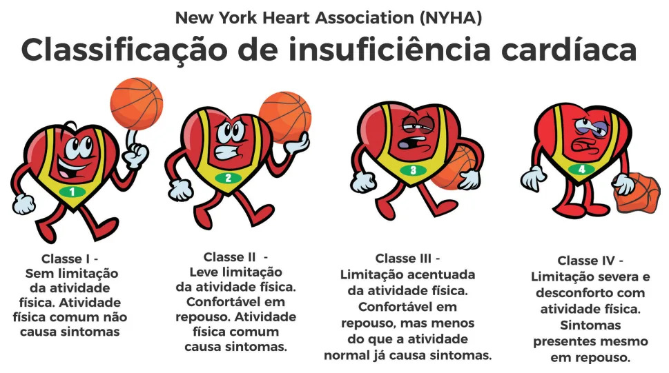
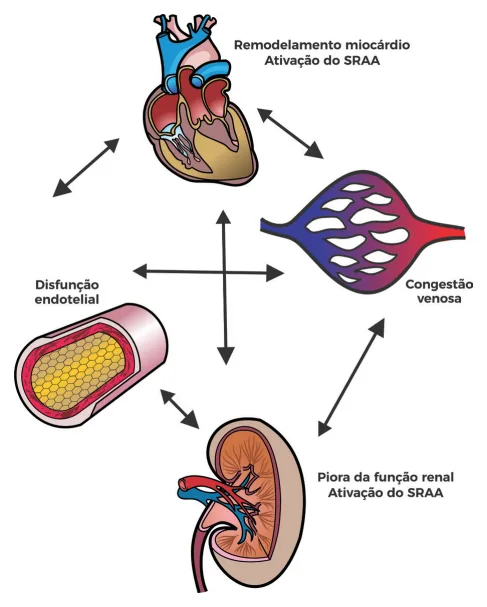
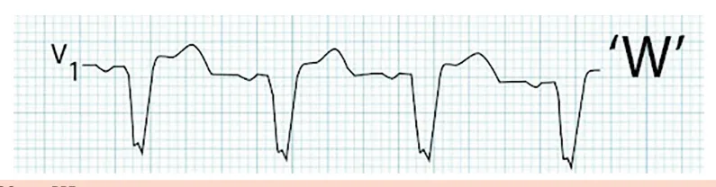

# Insuficiência Cardíaca - Manejo Ambulatorial

<!-- page:1 -->

## Insuficiência Cardíaca — Manejo Ambulatorial

ICC Ambulatorial (CM)

A fração de ejeção do ventrículo esquerdo pode estar preservada (≥ 50%), levemente reduzida (40-49%) ou reduzida (≤ 40%).

### Manifestação Clínica

- Sintomas de má perfusão e/ou de congestão.

### Classificação

- **Classificação NYHA**: baseada em sintomas (aplica-se aos estágios C e D da classificação do ACC):
  - I. Sem sintomas;
  - II. Limitação leve;
  - III. Limitação importante aos pequenos esforços;
  - IV. Sintomas no repouso.

### ICFEp

- Diagnóstico na ICFEp é clínico! Usar os escores (ex.: H2FPEF) se dúvida.

> ⚠️ Tabela reconstruída a partir de OCR — confira contra a fonte original.

**Escore H2FPEF:**

| Variável clínica | Pontos |
|---|---|
| Obesidade — Heavy (IMC > 30 kg/m²) | 2 |
| Hipertensão — 2 ou mais anti-hipertensivos | 1 |
| Fibrilação atrial — paroxística ou persistente | 3 |
| Hipertensão pulmonar — PSAP > 35 mmHg (ecocardiograma) | 1 |
| Idade avançada — Elderly (> 60 anos) | 1 |
| Pressões de enchimento — Filling pressures (E/e' > 9) | 1 |

Pontuação 2-5 = intermediário; ≥ 6 → ICFEp!

## Tratamento

**Tratamento da ICFE reduzida com redução de mortalidade:**

- Betabloqueador (apenas carvedilol, succinato de metoprolol, bisoprolol), IECA/BRA, espironolactona e iSGLT2;
- Se com essa terapia o paciente permanecer sintomático, trocar IECA/BRA por sacubitril-valsartana (necessário washout de 36 horas se em uso de IECA);
- Se mesmo em terapia quádrupla o paciente permanecer sintomático (CF ≥ 2), considerar terapias adicionais a depender do perfil do paciente:
  - Hidralazina + nitrato (paciente negro, ou contraindicação a IECA/BRA);
  - Ivabradina (FC > 70 bpm, ritmo sinusal);
  - Terapia de ressincronização cardíaca (BRE);
  - Digoxina (fibrilação atrial com FC ainda não controlada);
  - CDI: IC com FE ≤ 35%. Se etiologia isquêmica, benefício maior (mais fibrose, mais substrato para arritmias malignas).

**Tratamento da ICFE preservada:**

- Diuréticos para congestão;
- Tratamento da etiologia e das comorbidades;
- iSGLT2;
- 2024: finerenona e tirzepatida?

### Critérios de Framingham

Para a utilização dos critérios menores é necessária a ausência de qualquer condição que possa justificar a presença de um dos critérios.

**Critérios maiores:**

- Dispneia paroxística noturna;
- Turgência jugular a 45°;
- Refluxo hepatojugular;
- Estertores pulmonares crepitantes;
- Cardiomegalia ao raio X de tórax;
- Edema pulmonar agudo;
- Galope de terceira bulha (B3).

**Critérios menores:**

- Edema de tornozelo bilateral;
- Tosse noturna;
- Dispneia aos mínimos esforços;
- Derrame pleural;
- Taquicardia;
- Hepatomegalia, redução da CVF.

Diagnóstico: **2 critérios maiores e 1 menor, ou 1 maior e 2 menores.**

---

<!-- page:2 -->

## Considerações Iniciais

## Manifestações Clínicas e Diagnóstico

### Definição

- **Clássica**: incapacidade cardíaca em bombear sangue suficiente para atender às demandas metabólicas do tecido ou, o faz às custas de elevadas pressões de enchimento.
- **Moderna**: sinais e sintomas resultantes dos prejuízos no enchimento ventricular ou na ejeção de sangue.
- **Fração de ejeção**:
  - ICFE reduzida: ≤ 40%;
  - ICFE levemente reduzida: 40-49%;
  - ICFE preservada: ≥ 50%.
- **Obs**: ICFE melhorada é definida como o quadro com FE acima de 40% após o tratamento, com elevação de pelo menos 10% em relação aos níveis iniciais (≤ 40%). Nesses casos, deve-se manter o tratamento medicamentoso.

### Causas

- Isquêmica; HAS;
- Doença de Chagas;
- Valvopatias;
- Cardiomiopatias (dilatada, hipertrófica, restritiva);
- Congênitas, cardiotoxicidade, alcoólica, taquicardiomiopatia, miocardites, periparto.

### Classificação do ACC

Enfatiza o desenvolvimento e progressão da doença → correlaciona fatores de risco, alterações estruturais/funcionais e presença de sintomas.

**Critérios:**

- **A**: presença de fatores de risco para o desenvolvimento de IC — HAS, DAC, uso de cardiotóxicos, história familiar de cardiomiopatias;
- **B**: presença de alterações estruturais e/ou aumento das pressões de enchimento e/ou aumento de BNP/troponina, sem sintomatologia;
- **C**: sinais e sintomas de IC;
- **D**: IC refratária ("avançada").

### Expressão Clínica

- A expressão clínica vem da limitação do coração em atender as demandas teciduais, levando a sinais e sintomas de baixo débito;
- Temos também altas pressões de enchimento, com congestão pulmonar e sistêmica.

### Sinais e Sintomas

- Critérios de Framingham → diagnóstico se 2 critérios maiores e 1 menor OU 1 critério maior e 2 critérios menores.

> ⚠️ Tabela reconstruída a partir de OCR — confira contra a fonte original.

**Tabela 1: Critérios de Framingham**

| Critérios maiores | Critérios menores |
|---|---|
| Dispneia paroxística noturna | Edema do tornozelo bilateral |
| Turgência jugular a 45° | Tosse noturna |
| Refluxo hepatojugular | Dispneia aos mínimos esforços |
| Estertores pulmonares crepitantes | Derrame pleural |
| Cardiomegalia ao raio-X de tórax | Taquicardia |
| Edema pulmonar agudo | Hepatomegalia |
| B3 | |

### Classificação NYHA

- Baseada nos sintomas → aplica-se aos pacientes do estágio C e D da classificação do ACC (sintomáticos), dividindo os pacientes em classes funcionais I, II, III e IV.

### BNP/NT-proBNP

- BNP < 100 ou NT-proBNP < 300 excluem IC;
- Anemia, DRC, idade avançada e uso de sacubitril-valsartana (só BNP) podem elevar os marcadores;
- Obesidade pode diminuir o BNP.

### Fisiopatologia

- Danos estruturais cardíacos levam à ativação de mecanismos neuro-hormonais. Em longo prazo há perpetuação dos danos estruturais cardíacos, favorecendo a ativação contínua dos mecanismos neuro-hormonais → assim, em última instância, ocorre remodelamento do ventrículo esquerdo.

---

<!-- page:3 -->

*Figura 1: Esquema representativo da classificação NYHA.*

*Figura 2: Fisiopatologia da insuficiência cardíaca.*

## Tratamento

- Vacinação — influenza e pneumococo → reduz a frequência de descompensações.

### ICFE Reduzida

**Não farmacológico:**

- Evitar sal > 7 g/dia;
- Reabilitação cardiopulmonar para ICFEr em classes funcionais II e III (NYHA);
- Exercício aeróbico → útil para melhorar a qualidade de vida e capacidade funcional.

**Farmacológico:**

- Até pouco tempo atrás, era marcado pela tríade: IECA/BRA, betabloqueadores e espironolactona.

---

<!-- page:4 -->

*Figura 3: Terapia quádrupla na insuficiência cardíaca de fração de ejeção reduzida:*

1. **IECA/BRA** — ex.: enalapril;
2. **Betabloqueador** — bisoprolol, carvedilol, succinato de metoprolol;
3. **Antagonista dos receptores mineralocorticoides** — espironolactona;
4. **iSGLT2** — empagliflozina e dapagliflozina.

*(INRA — inibidor do receptor da angiotensina e neprilisina — sacubitril-valsartana/Entresto, substitui o IECA/BRA nos pacientes que permanecem sintomáticos.)*

**IECA/BRA ou INRA** (inibidor do receptor da angiotensina e neprilisina):

- Contraindicações: angioedema prévio induzido por IECA ou BRA, estenose bilateral de artéria renal ou estenose em rim único funcional, hipercalemia grave (> 5,3-5,5) refratária ao tratamento, gravidez;
- INRA nos pacientes que se mantiveram sintomáticos apesar do uso de IECA/BRA (substituir), sem necessidade de washout de 36h ao contrário (categoria D), uso concomitante a sacubitril requer washout de 36h ao trocar de IECA.

**Betabloqueador:**

- Na IC FE reduzida, apenas três reduzem mortalidade: carvedilol, bisoprolol e succinato de metoprolol;
- Seletivos (B1): bisoprolol, succinato de metoprolol, atenolol, nebivolol;
- Não seletivos: carvedilol, pindolol, propranolol;
- Contraindicações: BAV 1º grau com intervalo PR > 240 ms, BAV 2º ou 3º grau, choque, hipotensão grave, asma/DPOC grave (especialmente para os medicamentos não cardiosseletivos), DAOP crítica (especialmente para os medicamentos não cardiosseletivos);
- Efeitos colaterais: broncoespasmo (especialmente para os medicamentos não cardiosseletivos), hipotensão, bradicardia, fraqueza, sonolência (nos primeiros dias), piora da DAOP.

**Antagonista dos receptores mineralocorticoides — espironolactona:**

- Estudo Emperor-Reduced/DAPA-HF demonstrou redução da mortalidade na ICFEr CF ≥ II;
- Contraindicações: hipercalemia (< 5-5,5);
- O ideal é suspender em pacientes compensados, euvolêmicos, CF I-II e BNP reduzido;
- Alguns pacientes necessitam de dose mínima indefinidamente.

**Furosemida:**

- Resistência à furosemida: dada pela hiperplasia de alça de Henle;
- Deve-se associar diurético tiazídico e aumentar a dose de espironolactona.

**O paciente ainda continua sintomático (CF ≥ II)** — avaliação/prova de residência → avaliar o perfil do paciente e indicar conduta adicional:

- **Hidralazina + nitrato**: contraindicação à IECA/BRA mesmo em uso de terapia quádrupla, ou indivíduo autodeclarado negro;
- **Ivabradina**: ritmo sinusal e FC > 70 bpm;
- **Terapia de ressincronização cardíaca (TRC)**: ritmo sinusal e BRE (QRS > 120 ms). Reduz o tempo de estimulação para o ventrículo esquerdo, diminuindo possíveis assincronias. Altera o eixo do ECG — a mudança no eixo do ECG é uma das formas de ver se o paciente tem ressincronizador;
- **Digoxina**: fibrilação atrial e FC ainda não controlada.

*Figura 4: ECG com BRE.*

---

<!-- page:5 -->

**Atenção:** cardiodesfibrilador implantável (CDI) — indicado nos casos de FEVE < 35%, independente das outras terapias! Maior benefício na etiologia isquêmica (Ia) do que na não isquêmica (IIa). Tal instrumento demonstrou redução de mortalidade, mesmo em cenários em que nunca houve arritmias graves.

**Obs.:** lembre-se, a ivabradina inibe a corrente If do nó sinusal. Logo, não tem efeito em pacientes com fibrilação atrial.

*Figura 5: Radiografia de tórax de paciente com terapia de ressincronização cardíaca.*

> ⚠️ Fluxograma reconstruído a partir de OCR — confira contra a fonte original.

*Figura 6: Fluxograma de tratamento da ICFEr (Estágio C, NYHA II-IV) — sequência geral:*

- **IECA/BRA** + **Betabloqueador** + **INRA*** (*em substituição ao IECA/BRA) + **Antagonista mineralocorticoide** + **SGLT2** (Classe I, NYHA > II; Classe IIa em outros perfis);
- Reavaliação clínica em 3-6 meses:
  - **Assintomático**: manter tratamento;
  - **NYHA > II** (sintomático): estratégias terapêuticas adicionais, conforme o perfil:
    - FEVE < 35% + afrodescendente autodeclarado → hidralazina + nitrato;
    - FEVE ≤ 35% + ritmo sinusal + BRE + QRS ≥ 150 ms → TRC;
    - FEVE < 35-45% + ritmo sinusal + QRS 120-149 ms → TRC (Classe IIa);
    - Ritmo sinusal + FC > 70 bpm → ivabradina;
    - FEVE < 30-35% → CDI (isquêmico: Classe I; não isquêmico: Classe IIa);
    - Fibrilação atrial → digoxina;
  - NYHA III/IV → encaminhamento para centro especializado (IC avançada).

*Vide texto para diferenças entre agentes da mesma classe.*

### Sistematização no Paciente que Continua Sintomático

- Avaliar: FC, PA, volemia, ECG;
- O ritmo é sinusal?
  - **Sim**: FC > 70 bpm ou BRE? → definir ivabradina e encaminhar para TRC;
  - **Não**: considerar digoxina ou cardioversão elétrica/amiodarona/ablação;
- Paciente autodeclarado negro e PAM ainda > 65 mmHg: introduzir hidralazina e nitrato;
- Congestão presente? Otimizar diuréticos;
- **Sacubitril-valsartana** → na troca de IECA para INRA, é necessário um período de 36 horas entre a última dose do IECA e a primeira do sacubitril-valsartana ("washout") — a recomendação é pelo risco de angioedema causado pela interação IECA-BRA.

---

<!-- page:6 -->

**Reposição de ferro:**

- ICFEr com ferritina < 100 ou entre 100-299 com saturação de transferrina < 20%;
- Melhora de sintomas, qualidade de vida, capacidade de exercício, redução de hospitalizações;
- Realizar EV.

## ICFE Preservada

- Sinais e sintomas indistinguíveis daqueles de ICFEr;
- **Avaliação inicial**: é semelhante! Abordar com história clínica, exame físico, ECG, radiografia de tórax, BNP e ECO;
- **Atenção!** ICFEp se: avaliação inicial com alteração estrutural cardíaca (segmentar ou hipertrofia) ou disfunção diastólica, FEVE ≥ 50% + congestão inequívoca. Caso a dúvida ainda persista, aplicar escore H2FPEF:
  - Intermediário — pontuação entre 2-5;
  - ICFEp — pontuação ≥ 6.

> ⚠️ Tabela reconstruída a partir de OCR — confira contra a fonte original.

**Tabela 2: Escore H2FPEF**

| Variável clínica | Pontos |
|---|---|
| Obesidade — Heavy (IMC > 30 kg/m²) | 2 |
| Hipertensão — 2 ou mais anti-hipertensivos | 1 |
| Fibrilação atrial (F) — paroxística ou persistente | 3 |
| Hipertensão pulmonar (P) — PSAP > 35 mmHg (ecocardiograma) | 1 |
| Idade avançada — Elderly (> 60 anos) | 1 |
| Pressões de enchimento (Filling pressure) — E/e' > 9 | 1 |

- **iSGLT2**: estudos Emperor-Preserved, Deliver (NEJM, 2021, 2022). Foi observada a redução de morte e hospitalizações por IC (desfecho composto), contudo apenas às custas das hospitalizações.
- **Controle de sintomas**: diuréticos para congestão; tratamento das causas de ICFEp (DAC; HAS; fibrilação atrial; amiloidose); 2024: finerenona e tirzepatida?
- Desfecho composto de diminuição de sintomas e diminuição de morte cardiovascular, com redução do desfecho às custas de piora dos sintomas.

> ⚠️ Fluxograma reconstruído a partir de OCR — confira contra a fonte original.

*Figura 7: Fluxograma de condutas para ICFEp*

- Dispneia ou fadiga → sinais clínicos, ECG, Rx de tórax, ecocardiograma e peptídeos natriuréticos;
- FEVE ≥ 50%, remodelamento cardíaco, disfunção diastólica e sinais inequívocos de congestão?
  - **Sim** → diagnóstico de ICFEp confirmado;
  - **Não** → considerar outras causas;
  - **Possível** → aplicar escore H2FPEF ou HFA-PEFF:
    - Baixa probabilidade (H2FPEF: 0-1 ou HFA-PEFF: 0-1) → diagnóstico de ICFEp improvável;
    - Probabilidade intermediária (H2FPEF: 2-5 ou HFA-PEFF: 2-4) → considerar ecocardiograma de estresse diastólico ou teste hemodinâmico invasivo;
    - Alta probabilidade (H2FPEF: 6-9 ou HFA-PEFF: 5-6) → diagnóstico de ICFEp confirmado.

## Referências

Figura 4: ECG com BRE. LITFL. Life in the Fast Lane. Disponível em: https://litfl.com.

Figura 5: Radiografia de tórax de paciente com terapia de ressincronização cardíaca. MEDICINANET. Marca-passo. Disponível em: https://www.medicinanet.com.br/conteudos/casos/6539/marca_passo.htm.

Figura 7: Fluxograma da abordagem e diagnóstico da ICFEP. SOCIEDADE BRASILEIRA DE CARDIOLOGIA. Diretriz Brasileira de Insuficiência Cardíaca 2021: atualização de tópicos emergentes.
