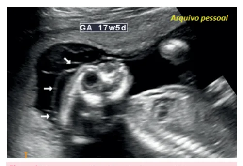

# Interrupção Legal da Gestação

<!-- page:1 -->

Aborto no Brasil

## ABORTAMENTO “LEGAL”

- Abortamento necessário ou terapêutico;

- Gestação decorrente de violência sexual:

notificação compulsória imediata;

- Interrupção da gestação de fetos anencéfalos;

- Dispensável: Boletim de Ocorrência; Autorização Judicial; Laudo do Instituto Médico Legal (IML).

- Todos esses casos podem ser realizados em qualquer idade gestacional.

## RECOMENDAÇÃO CFM (RESOLUÇÃO

## N. 1989/2012) – ANENCEFALIA

- USG a partir da 12ª semana de gestação que deve conter: Duas fotos, identificadas e datadas, ausência da calota craniana e de parênquima cerebral identificável; Laudo assinado por dois médicos capacitados para o diagnóstico.

## DEFINIÇÕES

## OBSTÉTRICA

- Toda interrupção voluntária ou não da gravidez antes de 20-22 semanas de gestação ou diante de um peso fetal inferior a 500g: Aborto é o produto conceptual que evoluiu ao óbito.

## JURÍDICA

- Qualquer interrupção da gravidez, com morte do produto conceptual, independentemente da idade gestacional.

- No Brasil, o abortamento é considerado crime e está previsto no código penal no título I (“Dos crimes contra a pessoa”). Capítulo I (“Dos crimes contra a vida”), porém há 3 formas de aborto legal: Necessário ou terapêutico (única forma de salvar a vida da gestante); Gravidez decorrente de estupro; Fetos anencéfalos;

## CONSIDERAÇÕES GERAIS

- É um ato médico e pode ser feito em qualquer idade gestacional;

- Todas as justificativas devem ser registradas em prontuário médico;

- Consentimento expresso da gestante (ou responsável legal): ≥18 anos: consente sozinha; ÉTICA MÉDICA

- Objeção de consciência é limitada, tendo como exceções: Risco de vida para a mulher; Só você pode fazer o procedimento; Urgência e emergência.

## MALFORMAÇÕES FETAIS

- Necessidade de autorização judicial;

- Termo de Consentimento Livre e Esclarecido;

- Livre manifestação da gestante;

- Laudo médico evidenciando letalidade extrauterina;

- Avaliação psicológica da gestante. 16 a <18 anos: consentimento da paciente + representante; <16 anos: consentimento do representante.

- Garantia do acompanhamento por equipe multiprofissional;

- Não são necessários: boletim de ocorrência (BO), autorização judicial e/ou laudo do Instituto Médico

Legal (IML). ABORTAMENTO TERAPÊUTICO

- Gestante sob risco de vida.

Considerações Específicas

- Avaliação por 2 médicos: desejável que um deles seja especialista na área da doença que motiva a interrupção da gestação.

ABORTAMENTO NO CENÁRIO DE VIOLÊNCIA a SEXUAL Considerações específicas

- É obrigatória a comunicação à autoridade policial;

- Evento de notificação compulsória imediata (SINAN).

“Stealthing” se refere à prática de retirada do preservativo durante ato sexual sem a autorização da parceria, também sendo considerada violência.

INTERRUPÇÃO DA GESTAÇÃO DE FETOS ANENCÉFALOS Anencefalia

- Neurulação anormal entre o 23º e 28º dias de gestação resultando na ausência de fusão das pregas neurais e da formação do tubo neural na região do encéfalo;

---

<!-- page:2 -->

- Acomete cerca de 20 casos / 10.000 nascidos vivos; | No atendimento de complicações derivadas do

- Malformação fetal letal mais comum do sistema abortamento inseguro, por se tratarem de quadro nervoso central (SNC). de urgência.

Recomendação CFM (Resolução n. 1989/2012)

## CASOS ESPECIAIS

- Ultrassonografia a partir da 12ª semana de gestação

- Ultrassonografia a partir da 12ª semana de gestação C que deve conter: Duas fotos, identificadas e datadas, evidenciando A ausência de calota craniana e de parênquima cerebral identificável; Laudo assinado por dois médicos capacitados para o diagnóstico. R

- - - M

- - - Figura 1: Ultrassonografia evidenciando anencefalia em corte sagital.

## ASPECTOS ÉTICOS

- OBJEÇÃO DE CONSCIÊNCIA

- Capítulo II, inciso IX, do Código de Ética Médica:

permite ao médico “recusar-se a realizar atos médicos que, embora permitidos por lei, sejam contrários aos ditames de sua consciência”:

| Nessa situação a mulher deve ser encaminhada a outro profissional que concorde.

- Exceções à Objeção de Consciência: Risco de vida para a mulher; Quando não houver outro médico que o faça e a A mulher puder sofrer danos ou agravos à saúde em razão da omissão desse profissional; CASOS ESPECIAIS

## ABORTAMENTO POR ANOMALIA FETAL

- Com exceção da anencefalia, outras anomalias fetais judicial para interrupção da gravidez.

“incompatíveis com a vida” necessitam de autorização Recomendações CFM

- Livre manifestação da gestante: solicitação escrita pela gestante ou pelo casal à autoridade judicial;

- Um ou mais exames de USG morfológica, assinados por dois médicos, comprovando os achados referentes à anomalia fetal;

- Avaliação psicológica da gestante;

- Relatório do médico assistente esclarecendo à autoridade judicial que o feto não terá sobrevida ao nascer.

Malformações fetais incompatíveis com a vida

- Anencefalia;

- Trissomia do cromossomo 13 e do 18;

- Holoprosencefalia;

- Encefalocele com exteriorização de grande parte do encéfalo;

- Pentalogia de Cantrell;

- Extenso defeito de parede abdominal com exteriorização de órgãos vitais;

- Body stalk (síndrome do cordão umbilical curto);

- Anidramnia/hipoplasia pulmonar precoce;

- Displasia esquelética letal;

- Gemelaridade imperfeita com compartilhamento de órgãos nobres.

## REFERÊNCIAS

Figura 1: Ultrassonografia evidenciando anencefalia em corte sagital. Arquivo Medcof

