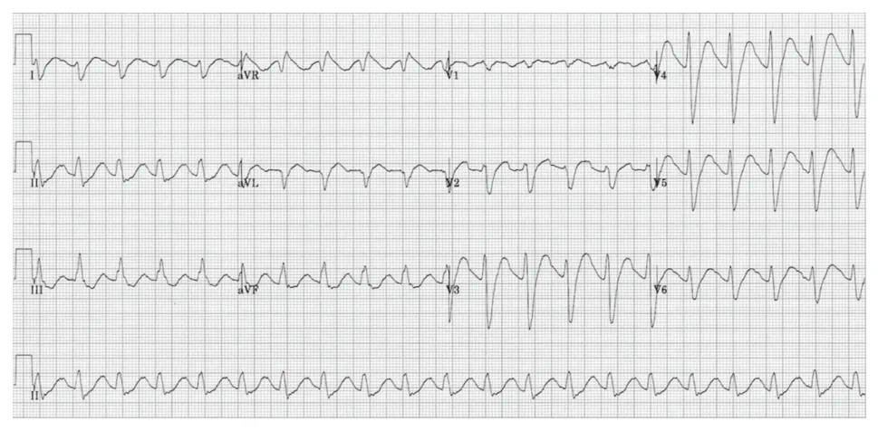
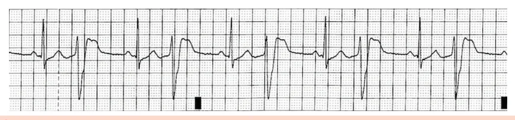
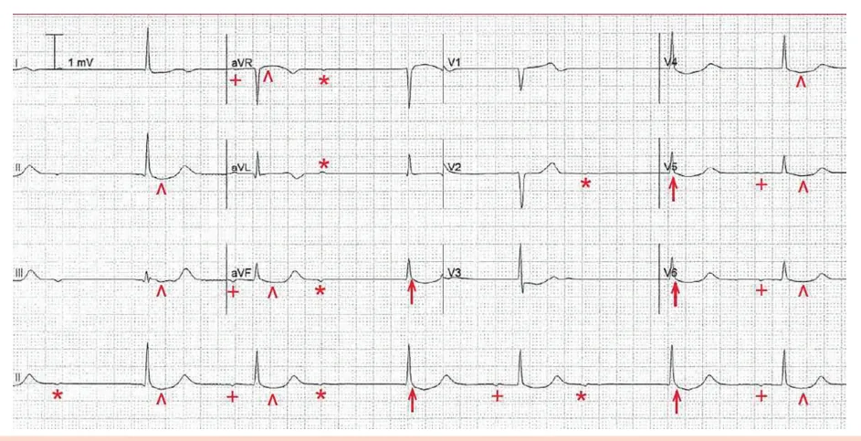
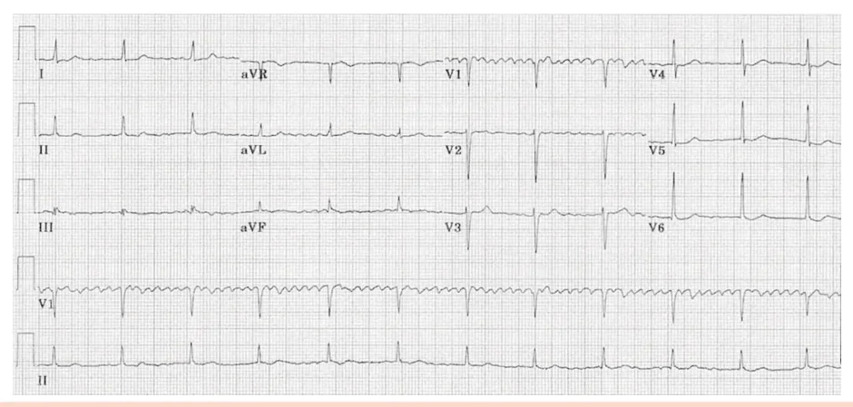

# Intoxicações Exógenas

<!-- page:1 -->

## Intoxicações

- Histórico clínico é essencial + identificação de toxíndromes (sinais vitais + nível de consciência + alterações pupilares);
- **Descontaminação:** lavagem gástrica (até 1h) / carvão ativado (até 2h) / lavagem intestinal (até 4h) / descontaminação cutânea.

### Toxíndromes (resumo)

- **Hipnótica-sedativa:** benzodiazepínicos (BZD)/opioides; bradicardia, bradipneia, rebaixamento do nível de consciência (RNC), hipotensão, miose; manejo: naloxona (opioides) e flumazenil (BZD).
- **Colinérgica:** carbamatos (chumbinho)/organofosforados (pesticidas e herbicidas); síndrome do homem molhado — broncorreia, lacrimejamento, sudorese, vômitos, diarreia, miose, RNC; manejo: atropina e pralidoxima de sódio.
- **Anticolinérgica:** anti-histamínicos/atropina/tricíclicos; hipertermia, retenção urinária e fecal, confusão mental, taquicardia, taquipneia, midríase, mucosas secas; manejo: piridostigmina (colinérgico), bicarbonato e lidocaína (tricíclicos — atenção ao ECG).
- **Simpatomimética:** cocaína, anfetaminas, cafeína; agitação, tremores, midríase, hipertermia, taquicardia, taquipneia, alucinações etc.; manejo: benzodiazepínicos, vasodilatadores.
- **Paracetamol:** 7,5-10 g; insuficiência hepática aguda → pode evoluir para necessidade de transplante hepático; manejo: N-acetilcisteína (via EV ou VO).
- **Metahemoglobinemia:** baixa SatO2 com PO2 normal → não responde ao O2! Cianótico que não responde a O2 e na gasometria o PO2 está normal/alto; grave → acima de 20%; causadores: dapsona, anestésicos tópicos e locais, sulfas; manejo: azul de metileno.
- **Metanol e etilenoglicol:** acidose metabólica (gap osmolar > 10), ataxia, alterações pupilares, LRA, alterações visuais, hipotensão, taquicardia, choque; manejo: etanol e diálise (inibição da álcool desidrogenase).
- **Lítio:** sintomas TGI, cardiovasculares, SNC e renais; manejo: irrigação com PEG, hidratação (hipervolemia), diálise (conforme a litemia); sem antídotos.
- **Cianeto:** fontes variáveis → muito tóxico; diagnóstico por histórico clínico + sintomas + exames laboratoriais; manejo: descontaminação, hidroxocobalamina, nitrito de sódio, nitrito de amilo, tiossulfato (para os organofosforados).
- **Betabloqueadores:** bradicardia, hipotensão, síncope, choque, broncoespasmo, hipoglicemia, hipercalemia; manejo: glucagon (antídoto) + fluidos e DVA + insulina + atropina + sais de cálcio + ECMO VA.
- **Monóxido de carbono:** múltiplas fontes; cefaleia, tontura, náuseas, vômitos, coma, óbito; manejo: O2 100% / câmara hiperbárica → cuidado com intoxicação por cianeto associada.
- **Digoxina:** taquicardia supraventricular com baixa resposta, além de bradicardia sinusal, FA de baixa resposta, "FA regular", bloqueios e taquicardia ventricular; manejo: anticorpo anti-digoxina.
- **Serotoninérgica:** rigidez, hipertermia, hiperreflexia, midríase, clônus; ISRS (principais nas provas); manejo: BZD + ciproeptadina (antídoto) + resfriamento.
- **Cáusticos:** não induzir êmese, não neutralizar! EDA em 6h-24h; suporte clínico.

## Introdução

- Pode ter ocorrido de forma intencional ou acidental (suicídio ou idosos que erram dosagem);
- Usualmente são pacientes jovens sem comorbidades que sofrem tais intoxicações;
- Os sintomas são decorrentes do contato com a substância ou da ingestão;
- Histórico clínico muitas vezes pobre → basear-se em um bom exame clínico e em um diagnóstico sindrômico: sinais vitais, nível de consciência e alterações pupilares são pontos fundamentais.

---

<!-- page:2 -->

## Avaliação Inicial

- O primeiro passo é monitorização em sala de emergência!
- Segundo passo consiste na descontaminação:
  - **Lavagem gástrica:** avaliar risco/benefício (cada vez menos utilizada - risco de broncoaspiração); realizar idealmente em até 1h; contraindicações: procedimento doloroso, distende estômago, com chances de causar vômitos e broncoaspiração ("empurrar" o conteúdo ao intestino delgado);
  - **Carvão ativado:** avaliar risco/benefício: realizar em até 2h (avaliar risco/benefício de realizar após 2h); contraindicações: RNC e agitação, vômitos, broncoaspiração, toxinas não absorvíveis como metais;
  - **Irrigação intestinal:** realizada com polietilenoglicol (PEG);
  - **Descontaminação cutânea.**

## Síndrome Colinérgica ("Síndrome do Homem Molhado")

- **Agentes:** organofosforados, carbamatos e nicotina; chumbinho é a principal substância que causa esta síndrome (carbamato).
- **Sinais e sintomas:**
  - Sinais vitais: hipotermia, bradicardia, hipotensão e bradipneia;
  - Pupilas com miose;
  - SNC: confusão mental, convulsões, coma;
  - Outros sistemas: sialorreia, sudorese, lacrimejamento, náuseas, vômitos, dispneia, broncoconstrição, fasciculações.
- **Tratamento:**
  - **Atropina:** bloqueador dos receptores muscarínicos em todos os casos de intoxicação colinérgica: 1-4 mg EV em bolus, podendo ser repetido após 2 minutos;
  - Em casos graves, podem ser necessárias grandes quantidades; pode ser aplicada em bomba de infusão contínua;
  - **Oximas:** pralidoxima é utilizada nas intoxicações graves por organofosforados → reativação da acetilcolinesterase (difícil acesso no Brasil);
  - Não utilizar bloqueador neuromuscular (principalmente succinilcolina) pelo risco de agravo;
  - Utilizar EPI e realizar descontaminação cutânea em caso de atendimento a intoxicação por organofosforado.

## Síndromes Tóxicas

### Hipnótica Sedativa - Narcótica

- **Agentes:** barbitúricos e, principalmente, benzodiazepínicos e opioides;
- **Sinais e sintomas:**
  - Miose: cuidado com os benzodiazepínicos, já que usualmente não produzem miose;
  - Bradicardia, bradipneia e hipotensão (FR < 12 irpm é um ótimo preditor de intoxicação por opioide);
  - Depressão do SNC e respiratória.
- **Antídotos:**
  - **Opioides:** naloxona — capaz de reverter a depressão respiratória: a administração pode ser IV, SC, intranasal e endotraqueal; 0,4-2 mg IV, podendo ser repetida a cada 2-3 min, pois o tempo de ação dela é menor que o tempo de ação do opioide.

> Atenção! Fentanil pode levar ao tórax rígido → a naloxona não é o antídoto para isso; o que resolverá essa situação é a utilização de bloqueador neuromuscular!

  - **Benzodiazepínicos:** flumazenil: 0,1-0,2 mg IV em 15-30 segundos, repetindo de acordo com necessidade até 1 mg; não tem papel nas PCR por benzodiazepínicos; cuidado com convulsões — no caso de pacientes que utilizaram múltiplas drogas, o flumazenil pode diminuir o limiar convulsivo e o paciente pode apresentar crise epiléptica refratária.

### Síndrome Anticolinérgica / Bloqueadores de Canais de Sódio

- **Agentes:** atropina, anti-histamínicos e antidepressivos tricíclicos;
- **Sinais e sintomas:**
  - Sinais vitais: hipertermia, taquicardia, hipertensão e taquipneia;
  - Pupilas com midríase;
  - SNC: agitação, alucinações, delírio e convulsões;
  - Outros sistemas: retenção urinária, mioclonias, retenção fecal e mucosas secas.
- **Antídotos:**
  - Colinérgicos → piridostigmina e fisostigmina são antídotos possíveis. Cuidado! Piridostigmina pode piorar o quadro de intoxicação por tricíclicos (evitar);
  - Bicarbonato de sódio (principalmente para tricíclicos) — 1-3 mEq/kg IV em bolus, repetir se necessário;
  - Lidocaína é segunda opção de tratamento;
  - Manter pH entre 7,44 e 7,55.

**Achados eletrocardiográficos sugestivos de intoxicação por tricíclicos:**

- Atraso da condução intraventricular (QRS aumentado);
- Onda R em aVR alta (> 3 mm) com relação R/S > 0,7 em aVR;
- Desvio do eixo para direita;
- Taquicardia sinusal.

---

<!-- page:3 -->

Figura 1: Síndrome Anticolinérgica.

Figura 2: ECG típico de intoxicação por tricíclicos.

## Síndrome Simpatomimética

- Agentes: cocaína, anfetaminas, cafeína;
- **Sinais e sintomas:** agitação, tremores, midríase, hipertermia, taquicardia, taquipneia, alucinações etc.;
- Ecstasy e MDMA podem levar a alteração no mecanismo da sede, agindo como SIADH → hiponatremia aguda;
- **Tratamento** → benzodiazepínicos, betabloqueadores e/ou vasodilatadores:
  - Intoxicação grave por cocaína com QRS largo → usar bicarbonato de sódio (como tricíclicos), pois cocaína também é um bloqueador do canal de sódio.

Verificar Figura 3 na próxima página.

## Intoxicação por Acetaminofeno (Paracetamol)

- **Dose tóxica:** 7,5-10 g;
- Não é aguda, demora dias até se desenvolver.

**Fases da intoxicação e suas características clínicas:**

- **Fase 1 (até 24h):** paciente assintomático ou com sintomas gastrointestinais;
- **Fase 2 (24-72h):** paciente assintomático com elevação de transaminases e função hepática (ALT, AST, INR);
- **Fase 3 (72-96h):** paciente pode apresentar necrose hepática, icterícia, náuseas, vômitos, distúrbios de coagulação, IRA, miocardiopatia, encefalopatia, confusão mental, coma e óbito;
- **Fase 4 (4 dias-2 semanas):** recuperação hepática com fibrose residual nos pacientes que sobreviveram.

---

<!-- page:4 -->

Figura 3: Síndrome simpatomimética — agentes e sinais vitais.

> ⚠️ Figura/tabela reconstruída a partir de OCR — confira contra a fonte original. Agentes: cocaína, anfetamina, teofilina, efedrina, cafeína. Sinais vitais: hipertermia, taquicardia, hipertensão, taquipneia. Outros achados: agitação, midríase, diaforese, alucinação, tremores, hiperreflexia, paranoia, convulsões.

> ⚠️ Tabela reconstruída a partir de OCR — confira contra a fonte original.

**Tabela 1: Antídoto N-acetilcisteína (NAC) — via EV**

| Etapa | Dose | Volume diluente | Forma de aplicação |
|---|---|---|---|
| Dose de ataque | 150 mg/kg | 200 mL de SG 5% | IV em 60 minutos |
| Dose de manutenção I | 50 mg/kg | 500 mL de SG 5% | IV em 4 horas |
| Dose de manutenção II | 100 mg/kg | 1000 mL de SG 5% | IV em 16 horas |

**Tabela 2: Antídoto N-acetilcisteína (NAC) — via VO**

| Etapa | Dose | Diluente | Forma de aplicação |
|---|---|---|---|
| Dose de ataque | 140 mg/kg | Suco ou água | 1 dose |
| Dose de manutenção | 70 mg/kg | Suco ou água | A cada 4 horas, em um total de 17 doses |

## Metahemoglobinemia

- É caracterizada pela oxidação da hemoglobina, modificando a configuração do ferro do grupo heme de Fe2+ para Fe3+ e impedindo a ligação com o oxigênio;
- **Sintomas:** baixa SatO2 com PaO2 normal na gasometria arterial, cianose e dispneia; a saturação não sobe apesar da oferta de oxigênio;
- **Diagnóstico:** metaHb ≥ 5%; casos graves: metaHb > 30%;
- **Agentes causadores:** dapsona (comumente usado no tratamento da hanseníase);
- **Tratamento:** azul de metileno: 1-2 mg/kg de solução a 1% EV em 5 minutos.

## Intoxicação por Metanol e Etilenoglicol

- **Agentes:** metanol e etilenoglicol → metabólitos tóxicos como formaldeído e ácido fórmico;
- **Sintomas:**
  - Iniciais: intoxicação alcoólica (ataxia, sedação, desinibição);
  - Tardios: acidose metabólica com gap osmolar aumentado (> 10 mOsm/kg), hipotensão, taquicardia, arritmias, alterações visuais, parkinsonismo (tremor, rigidez, bradicinesia), lesão renal aguda (NTA).
- **Diagnóstico e manejo:**
  - Laboratoriais, incluindo se possível dosagem de etilenoglicol e metanol;
  - Calcular gap osmolar (> 10): Osmolalidade = 2×Na + Glicose/18 + Ureia/6;
  - Inibição da álcool desidrogenase.

---

<!-- page:5 -->

**Tratamento:**

- Antídoto fomepizol → não disponível no Brasil;
- **Etanol:** diluir em SG 5% para uma solução de 10% de etanol:
  - Ataque: 0,8 g/kg de etanol absoluto (100%) EV em 1 hora;
  - Manutenção: 130 mg/kg/h de etanol absoluto (100%) EV em BIC.
- **Indicações:** paciente com sintomas neurológicos ou arritmias; concentração > 2,5 mmol/L para pacientes com intoxicação crônica; concentração > 4,0 mmol/L para pacientes com intoxicação aguda;
- Diálise é usada em casos com nível sérico de metanol > 50 mg/dl.

## Intoxicação por Lítio

- A dose tóxica é muito próxima da dose terapêutica;
- **Sintomas:**
  - Intoxicações agudas cursam com sintomas de leves a moderados, com predomínio de manifestações gastrointestinais;
  - Intoxicações crônicas cursam com fotofobia, desidratação, distúrbios hidroeletrolíticos, disfunção tireoidiana, hipertermia, convulsões, coma, rigidez, mioclonias e síndrome serotoninérgica, hipertensão, bradicardia, ritmo juncional, bloqueios de ramo, aumento de QT e anormalidades em onda T no ECG.
- **Suporte** → polietilenoglicol, volume ou diálise: é possível fazer descontaminação gástrica somente em casos agudos; irrigação intestinal com PEG; correção da hipovolemia objetivando a euvolemia;
- **Hemodiálise:** objetiva aumentar o clearance de lítio e diminuir o tempo de meia-vida.
- Antídoto: não há.

Verificar Tabela 3.

> ⚠️ Tabela reconstruída a partir de OCR — confira contra a fonte original.

**Tabela 3: Intoxicação por lítio**

| Nível terapêutico | Reações leves a moderadas | Efeitos graves em SNC | Efeitos mais graves e risco de morte |
|---|---|---|---|
| 0,6 a 1,2 mEq/L | 1,2 a 2,5 mEq/L | 2,5 a 4 mEq/L | Acima de 4 mEq/L |

## Intoxicação por Betabloqueadores

- **Sintomas:** bradicardia, hipotensão, síncope, choque cardiogênico, arritmias, tontura, confusão mental, broncoespasmo, hipoglicemia, hipercalemia (com função renal alterada ou pacientes em overdose aguda);
- **Manejo:** ABCDE do doente crítico; coleta de exames laboratoriais; manejo da bradicardia conforme ACLS; glucagon (antídoto) + fluidos e DVA + insulina + atropina + sais de cálcio + ECMO VA.

Verificar Tabela 4.

> ⚠️ Tabela reconstruída a partir de OCR — confira contra a fonte original.

**Tabela 4: Intoxicação por betabloqueadores — sintomas e manejo**

| Sintomas | Manejo inicial | Tratamento específico |
|---|---|---|
| Bradicardia, hipotensão, síncope, choque cardiogênico, arritmias, tontura, confusão mental, broncoespasmo, hipoglicemia, hipercalemia | ABCDE do doente crítico; coleta de exames laboratoriais por até 1 hora; RCP deve ocorrer se necessário | Glucagon; GIK; fluidoterapia e DVA; atropina e sais de cálcio (podem ser utilizados, mas provavelmente sem grande efeito); diálise (sotalol e atenolol); diazepam (se convulsões); ECMO |

## Intoxicação por Digoxina

- Clássico é taquicardia supraventricular com baixa resposta ventricular, além de bradicardia sinusal, FA de baixa resposta, "FA regular", bloqueios e taquicardia ventricular;
- **Manejo:** suporte + anticorpo anti-digoxina.

Verificar Figura 4.

---

<!-- page:6 -->

Figura 5: Fibrilação atrial com ritmo regular na intoxicação por digoxina.

Figura 6: Ritmo atrial com bloqueio AV 2:1 com escape juncional em possível toxicidade por digoxina.

Figura 7: "Colher de pedreiro" na intoxicação por digoxina — sinal clássico das intoxicações por digoxina.

## Intoxicação por Monóxido de Carbono

- **Fontes comuns:** incêndios, sistemas de aquecimento, veículos em áreas mal ventiladas, cabeamento elétrico, inalação ou consumo de diclorometano; o CO tem uma afinidade 100x maior que o O2 pela hemoglobina;
- **Sinais e sintomas:** dor de cabeça, tontura, mal-estar, náuseas, confusão ou dificuldade de concentração, alterações visuais;
- **Diagnóstico:** baseado na história clínica e na mensuração de CO; lembrar que os oxímetros convencionais não detectam o CO;
- **Manejo:** oxigenioterapia em alto fluxo e com FiO2 alta; terapia hiperbárica em pacientes muito graves.

---

<!-- page:7 -->

## Intoxicação por Cianeto

- Substância extremamente tóxica que leva a bloqueio da cadeia respiratória e hipóxia tecidual — leva à acidose grave;
- Fonte muito variável (plásticos, plantas, drogas, combustíveis etc.);
- Lembrar da possibilidade de cointoxicação com monóxido de carbono;
- **Diagnóstico:** história clínica + sintomatologia + exames; não há diagnóstico próprio;
- **Tratamento:**
  - Descontaminação — retirada de roupas, objetos, carvão ativado;
  - **Antídotos:** hidroxocobalamina 5 g (adultos) ou 70 mg/kg (pediátrico); tiossulfato de sódio (idealmente, associar à hidroxocobalamina); nitrito de sódio (contraindicado se intoxicação por CO); nitrito de amilo;
  - Manter paciente em FiO2 100%;
- **RCP:** não realizar ventilação boca a boca → risco de contaminação ao operador.

## Síndrome Serotoninérgica

- Relacionada principalmente com antidepressivos; outras medicações também podem causar essa síndrome;
- **Sinais e sintomas:** rigidez, hiperreflexia, taquicardia e anormalidades neuromusculares:
  - Leve: midríase, tremores, sudorese, taquicardia;
  - Moderada: alterações de nível de consciência, hiperatividade autonômica, anormalidades neuromusculares;
  - Grave (risco de vida): delirium, hipertensão, hipertermia, rigidez muscular, taquicardia.
- **Manejo:** observação por pelo menos 6h; benzodiazepínicos; antídoto: ciproeptadina (iniciar principalmente em casos moderados); casos graves: internação em UTI, esmolol ou nitroprussiato, medidas de resfriamento, sedação e ventilação.

Verificar Tabela 5.

> ⚠️ Tabela reconstruída a partir de OCR — confira contra a fonte original.

**Tabela 5: Comparação e diferenciação da síndrome serotoninérgica e da síndrome neuroléptica maligna**

| Característica | Síndrome Serotoninérgica | Síndrome Neuroléptica Maligna |
|---|---|---|
| Início | Mais agudo (horas) | Mais gradual (dias-semanas) |
| Etiologia | ISRSs, IRSNs, IMAOs, antidepressivos tricíclicos, opioides sintéticos, drogas ilícitas | Antipsicóticos, cessação súbita de agentes dopaminérgicos, por exemplo, levodopa |
| Apresentação | Taquicardia, pressão arterial elevada, hipertermia, diaforese, rigidez, estado mental alterado | Taquicardia, pressão arterial elevada, hipertermia, diaforese, rigidez, estado mental alterado, delírio |
| Sinais neurológicos | Hiperreflexia, clônus, tremor | Hiporreflexia, rigidez em "roda denteada" |
| Pupilas | Dilatadas | Normais |
| Gastrointestinais | Diarreia, RHA aumentados | Normais |
| Creatina quinase (CK) | Pode ser elevada, mas geralmente menos que na síndrome neuroléptica maligna | Elevada; pode causar lesão renal aguda |
| Manejo | Interromper drogas serotoninérgicas, fluidos intravenosos e resfriamento, benzodiazepinas, ciproeptadina | Interromper antipsicóticos, fluidos intravenosos, dantrolene, bromocriptina |

---

<!-- page:8 -->

## Intoxicação por Salicilatos

- **Ácido salicílico** → a overdose aumenta dramaticamente a absorção devido à acidose;
- **Diagnóstico:** baseado em história clínica; dosagem de salicilatos pode ser feita;
- **Sinais e sintomas:** vômitos, zumbidos, taquipneia, taquicardia, hipertermia, diaforese, distúrbios HE e ácido-base, EAP, alterações de nível de consciência, edema cerebral, morte;
- **Progressão clássica:** alcalose respiratória → acidose metabólica → acidose respiratória.
- **Manejo:**
  - Suporte;
  - Evitar IOT → tratar acidose antes;
  - Carvão ativado;
  - Reposição de eletrólitos e correção de distúrbios ácido-base;
  - Dosar salicilatos a cada 2h;
  - Casos graves → alcalinização da urina;
  - Hemodiálise se: alteração do estado mental; acidose (pH < 7,2 ou < 7,3 com ressuscitação agressiva); EAP/edema cerebral; hipervolemia; lesão renal aguda ou crônica; deterioração do estado clínico.

## Intoxicação por Canabinoides Sintéticos

- Drogas recreacionais: K2, K9, Spicy, Crazy Monkey;
- **Sinais e sintomas:** taquicardia, injeção conjuntival, vômitos, nistagmo, ataxia, agitação psicomotora, psicose grave, convulsões, coma; também há relatos de AVC, rabdomiólise, IAM, HSA e óbito;
- **Manejo:** casos leves — levar paciente para local calmo, escuro, e lançar mão de benzodiazepínicos; casos graves — BZD, resfriamento, antipsicóticos, hidratação vigorosa; fenobarbital pode ser usado como segunda opção em caso de convulsões.

## Referências

Figura 2: ECG típico de intoxicação por tricíclicos. Life in the fast lane (LITFL). ECG Library. Disponível em: https://litfl.com/ecg-library/.

Figura 4: Presença de bigeminismo na intoxicação por digoxina. Life in the fast lane (LITFL). ECG Library. Disponível em: https://litfl.com/ecg-library/.

Figura 5: Fibrilação atrial com ritmo regular na intoxicação por digoxina. Life in the fast lane (LITFL). ECG Library. Disponível em: https://litfl.com/ecg-library/.

Figura 6: Ritmo atrial com bloqueio AV 2:1 com escape juncional em possível toxicidade por digoxina. Life in the fast lane (LITFL). ECG Library. Disponível em: https://litfl.com/ecg-library/.

Figura 7: "Colher de pedreiro" na intoxicação por digoxina. MY-EKG. Digoxina no ECG. Disponível em: https://pt.my-ekg.com/metabolicas-drogas/digoxina-ecg.html.
