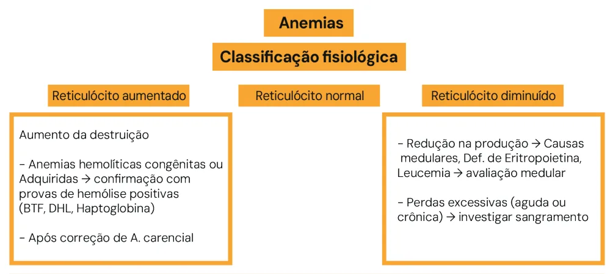

# Introdução às Anemias e Hemocomponentes

<!-- page:1 -->

## Introdução às Anemias e Hemocomponentes

### Introdução às Anemias (G6PD, Esferocitose, Hemolítica) e Transfusões (Pediatria)

> ⚠️ Página reconstruída a partir de OCR de duas colunas intercaladas — confira contra a fonte original.

**Hemograma**

- VCM: volume corpuscular médio (tamanho médio da hemácia);
- HCM: hemoglobina corpuscular média (concentração de hemoglobina dentro da hemácia);
- RDW: variação dos tamanhos das hemácias (anisocitose).

**Reticulócitos** — precursores medulares dos glóbulos vermelhos

- Quantidade no sangue periférico reflete a intensidade da produção medular;
- Aumentado: anemias hemolíticas, perda sanguínea, correção de anemias carenciais;
- Diminuído: carência de ferro, B12, ácido fólico, doenças linfoproliferativas e falências medulares.

**Anemias Hemolíticas** (resumo)

- Esferocitose: icterícia precoce, anemia, esplenomegalia, aumento de CHCM;
- Deficiência de G6PD: hemólise desencadeada por agentes oxidantes;
- Hemolítica Autoimune: TAD/Coombs direto positivo; tratamento: corticoide;
- Anemia Megaloblástica: deficiência de vitamina B12 (cobalamina) e/ou folatos; anemia macrocítica; pode evoluir para bi ou pancitopenia, neutrófilos hipersegmentados, atraso/regressão de desenvolvimento neuropsicomotor; tratamento: reposição de B12 ou ácido fólico.

**Hemocomponentes** (resumo)

- **Irradiado**: prevenção de Doença do Enxerto Contra Hospedeiro Transfusional;
- **Filtrado**: prevenção de CMV, reação transfusional febril não hemolítica (politransfundidos) e profilaxia de aloimunização HLA (risco de transplante);
- **Lavado**: prevenção de reação alérgica (anafilaxia prévia e deficiência de IgA);
- Reações transfusionais: sempre interromper a transfusão. Imediata: < 24h / Tardia: > 24h.

| | TRALI | TACO |
|---|---|---|
| Tipo | Reação transfusional imediata (< 24h) | Reação transfusional imediata (< 24h) |
| Sintomas | Respiratórios (tosse, dispneia, dessaturação, febre) | Respiratórios e cardíacos (PA elevada, cardiomegalia, B3) |
| Edema pulmonar | Não cardiogênico | Cardiogênico |
| p-BNP | Normal | Elevado |
| Tratamento | Suspender transfusão, suporte | Suspender transfusão, suporte, diurético |

## Anemias

### Conceitos

- **Definição OMS**: concentração sanguínea de hemoglobina abaixo dos valores esperados (< -2 desvios-padrão), insuficiente para atender às necessidades fisiológicas de acordo com idade, sexo, gestação e altitude.
- **Definição US National Health and Nutrition Examination Survey**: concentração sanguínea de hemoglobina inferior a 11,0 g/dL para crianças de ambos os sexos, entre 12 e 35 meses.

---

<!-- page:2 -->

## Classificação Morfológica de Acordo com o VCM

> ⚠️ Tabela/figura reconstruída a partir de OCR (texto de três colunas intercalado) — confira contra a fonte original.

Figura 1: Classificação da anemia de acordo com o VCM.

| Macrocítica (VCM aumentado) | Normocítica (VCM normal) | Microcítica (VCM diminuído) |
|---|---|---|
| Deficiência de B12 ou ácido fólico | Hemolíticas congênitas (Hb ou membrana) | Ferropriva |
| Anemia aplásica | Hemolíticas adquiridas (autoimune, MAT) | Talassemia |
| Hipotireoidismo | Perda de sangue aguda | Intoxicação por chumbo |
| Doença hepática | Sequestro esplênico | Anemia sideroblástica |
| Infiltração medular | DRC | — |

Figura 2: Classificação das anemias de acordo com o valor do reticulócito.

## Classificação Morfológica de Acordo com os Reticulócitos

O reticulócito é o precursor da hemácia, avaliando a função da medula.

**Reticulócito normal**

- Produção normal de hemoglobina;
- Valor de referência: 0,5–1,5%.

**Reticulócito aumentado**

- Aumento da produção na medula para compensar a anemia;
- Medula com boa função: etiologia da anemia envolve aumento da destruição de hemácias. Confirmação com provas de hemólise positivas (aumento da bilirrubina, do DHL e diminuição da haptoglobina);
- Principais causas: anemias hemolíticas congênitas ou adquiridas; perda excessiva de sangue aguda ou crônica (investigar sangramento).

**Reticulócito diminuído**

- Medula incapaz de compensar a perda: etiologia da anemia envolve redução na produção;
- Principais causas: deficiência de eritropoietina; leucemia; falta de substrato para a produção (carenciais).

Verificar Figura 2.

### Anemia Fisiológica do Lactente

Ocorre entre 2 e 6 meses.

- RNT: Hb 9–12 g/dL;
- RNPT: Hb 8–10 g/dL.

## Anemia Hemolítica

### Definição

Anemia secundária ao processo de hemólise (destruição prematura dos eritrócitos).

### Exames Laboratoriais

- Aumento de reticulócitos;
- DHL elevado;
- Bilirrubina indireta elevada;
- Consumo de haptoglobina.

---

<!-- page:3 -->

> ⚠️ Trecho reconstruído a partir de OCR (texto de duas colunas intercalado) — confira contra a fonte original.

### Etiologias

- **Congênitas**: hemoglobinopatias (anemia falciforme, talassemias); deficiências enzimáticas (deficiência de G6PD, deficiência de piruvato quinase); alterações de membrana eritrocitária (esferocitose).
- **Adquiridas**: autoimune; microangiopatias (púrpura trombocitopênica trombótica — PTT; síndrome hemolítico-urêmica — SHU).

### Quadro Clínico

- Assintomática;
- Hemólise intravascular e abrupta decorrente de processos infecciosos ou substâncias oxidantes: icterícia, palidez, hemoglobinúria.

## Esferocitose

- Segunda causa mais frequente de anemia hemolítica hereditária;
- Herança autossômica dominante com expressão variável (casos raros: autossômica recessiva).

### Fisiopatologia

- Defeito em proteínas estruturais que ligam o citoesqueleto à camada lipídica (anquirina, banda 3, β-espectrina, α-espectrina e proteína 4.2);
- Perda de membrana à medida que circulam no baço e sistema reticuloendotelial (SRE);
- Formato esférico e diminuição da relação superfície/volume levam à incapacidade de passar pela microcirculação esplênica, levando à hemólise.

### Quadro Clínico

- Icterícia neonatal precoce;
- Icterícia flutuante (pior em períodos de inflamação);
- Anemia: pior durante o período da anemia fisiológica (2–4 meses), pois não apresenta mecanismos de compensação;
- Esplenomegalia;
- Litíase biliar.

### Diagnóstico

- Anemia normocítica normocrômica (grau variado);
- Aumento do CHCM;
- Aumento do reticulócito;
- Aumento de bilirrubina e DHL;
- Teste de Antiglobulina Direto (TAD/Coombs) negativo;
- Lâmina: presença de esferócitos;
- Aumento da fragilidade osmótica (curva desviada).

### Tratamento

- Suporte;
- Vigiar hemólise em quadros infecciosos;
- Vigiar sequestro esplênico;
- Vigiar colelitíase;
- Esplenectomia: apenas em casos selecionados, maior risco de infecção por encapsulados e de trombose.

## Deficiência de G6PD

### Fisiopatologia

- A enzima G6PD reduz NADP/NADPH e oxida glicose-6-fosfato. NADPH protege a célula de processos oxidantes;
- Deficiência de G6PD leva a prejuízo na redução da glutationa;
- Herança ligada ao cromossomo X (acomete mais o sexo masculino);
- Quadro clínico: icterícia, palidez, hemoglobinúria; icterícia neonatal pode ocorrer.

### Diagnóstico

- Triagem neonatal;
- Diminuição na atividade enzimática nos eritrócitos. Não realizar durante o período agudo de hemólise;
- Lâmina: "bite cells" e "blister cells";
- Teste genético.

### Tratamento

- Suporte;
- Interromper o uso do agente oxidante. Evitar agentes oxidantes, sendo o mais reconhecido o feijão fava. Há divergências sobre quais medicações evitar;
- Manter alto fluxo urinário.

Tabela 1: Lista de medicamentos que devem ser evitados na deficiência de G6PD.

> ⚠️ Tabela reconstruída a partir de OCR — confira contra a fonte original.

| Categoria | Medicamentos |
|---|---|
| Antimaláricos | Primaquina, Pamaquina, Cloroquina, Mepacrina (Quinacrina), Tafenoquina, Pentaquina |
| Sulfonamidas e sulfonas | Sulfanilamida, Sulfapiridina, Sulfadimidina, Sulfacetamida, Sulfafurazol, Salicilazossulfapiridina, Dapsona, Sulfoxona, Glucosulfona, Septrin, Sulfametoxazol, Tiazolsulfona, Sulfassalazina |
| Antibacterianos | Nitrofurantoína, Furazolidona, Nitrofurazona, Ácido nalidíxico, Cloranfenicol, Doxorrubicina |
| Analgésicos | Ácido acetilsalicílico, Acetofenetidina, Acetanilida, Fenacetina, Ácido paraminossalicílico |
| Anti-helmínticos | Stibofeno, Niridazol |
| Outros | Análogos da vitamina K, Naftalina, Dimercaprol, Azul de metileno, Arsina, Acetilfenilhidrazina, Azul de toluidina, Mepacrina, Hena, Vinho tinto, Fava, Água tônica, Betanaftol, Urato oxidase, Probenecida, Isobutil nitrito |

## Anemia Hemolítica Autoimune (AHAI)

### Fisiopatologia

- Produção de anticorpos contra os próprios eritrócitos;
- Na criança, o principal desencadeante é viral; outras causas: doença autoimune, imunodeficiências, malignidade, medicamentos;
- Classificação: de acordo com a temperatura na qual o anticorpo reage melhor com o eritrócito:
  - Quente (37 °C): normalmente IgG;
  - Fria (4 °C): normalmente IgM ou C3d;
  - Mista: presença de anticorpos frios e quentes.

---

<!-- page:4 -->

> ⚠️ Trecho reconstruído a partir de OCR (texto de duas colunas intercalado) — confira contra a fonte original.

### Quadro Clínico (AHAI)

- Início súbito, desencadeado por quadro viral, medicamento ou doença linfoproliferativa ou imune;
- Anemia importante e muito sintomática;
- Esplenomegalia, icterícia;
- Provas de hemólise positivas;
- Tendência de remissões e recaídas;
- Pode ocorrer em associação com outras doenças: síndrome de Evans, quando AHAI associada à púrpura trombocitopênica imune (PTI).

### Diagnóstico

- Anemia hemolítica (normocítica e normocrômica);
- Provas de hemólise positivas;
- TAD/Coombs positivo.

### Tratamento

- Sempre afastar e tratar a causa;
- Transfusão de hemácias: indicada se instabilidade clínica. Deve ser a menos incompatível possível e com a menor quantidade possível.

**Quente**

- Primeira linha: corticoide;
- Segunda linha: esplenectomia, imunossupressão (azatioprina, ciclofosfamida, ciclosporina), imunoglobulina humana, rituximabe (casos refratários).

**Fria**

- Aquecer o paciente;
- Tratar causa de base.

## Anemia Megaloblástica

### Fisiopatologia

- Anemia carencial por deficiência de vitamina B12 (cobalamina) e/ou folatos;
- Etiologia: ingestão reduzida (dieta vegetariana ou má nutrição); distúrbios na absorção, transporte ou metabolização;
- Em crianças menores, investigar valores baixos de B12 maternos.

### Quadro Clínico

- Início insidioso;
- Adinamia, fadiga, palidez;
- Déficit de crescimento;
- Glossite;
- Atraso ou regressão do desenvolvimento neuropsicomotor;
- Se leucopenia: maior suscetibilidade a infecções;
- Se plaquetopenia: sangramentos.

### Diagnóstico

- Anemia macrocítica (nem sempre o VCM está muito aumentado);
- Pode evoluir para bi ou pancitopenia;
- Neutrófilos hipersegmentados;
- Reticulócitos normais ou diminuídos;
- B12 ou ácido fólico baixos;
- Mielograma: hipercelularidade das 3 séries, anormalidades na hematopoiese com elementos megaloblastoides.

### Tratamento

Reposição de vitamina B12 ou ácido fólico até correção das anormalidades hematológicas e correção da causa.

- Cobalamina IM ou SC;
- Ácido fólico VO.

## Tipos de Hemocomponentes

- Concentrado de hemácias;
- Concentrado de plaquetas: pool — junção de plaquetas doadas por vários pacientes; aférese — bolsa de plaquetas feita de apenas um doador;
- Plasma (possui principalmente fatores de coagulação);
- Crioprecipitado (possui principalmente fibrinogênio);
- Concentrado de granulócitos.

### Transfusão de Hemácias — Indicações

- Perda sanguínea aguda ≥ 15% da volemia total;
- Hb < 8 g/dL com sintomas de anemia;
- Anemia pré-operatória significativa sem outras terapêuticas corretivas disponíveis;
- Hb < 13 g/dL e paciente com doença pulmonar grave, oxigenação de membrana extracorpórea (ECMO);
- Pacientes com cardiopatias isquêmicas agudas parecem se beneficiar com níveis de Hb acima de 9 a 10 g/dL.

### Transfusão de Plaquetas

- Contagens de plaquetas entre 5.000 e 10.000/mm³ com falha de produção, ou < 20.000/mm³ e quadro infeccioso ou sangramento;
- Contagens de plaquetas < 30.000/mm³ em RN com falha de produção;
- Contagens de plaquetas < 50.000/mm³ em RNPT estáveis, com sangramento ativo, submetidos a procedimentos invasivos e com falha de produção;
- Contagens de plaquetas < 100.000/mm³ em RNPT doentes, com sangramento ativo, submetidos a procedimentos invasivos e com CIVD;
- Sangramento ativo em associação com defeito qualitativo das plaquetas;
- Sangramento excessivo e inexplicável em paciente a ser submetido ao bypass cardiopulmonar;
- Paciente em ECMO com plaquetas < 100.000/mm³.

### Transfusão de Plasma Fresco Congelado (PFC)

- Terapia de reposição em pacientes com sangramento ou que serão submetidos a procedimento invasivo;
- Quando fatores específicos da coagulação não são disponíveis (antitrombina III, deficiência de proteína C ou S, FII, FV, FX e FXI);

---

<!-- page:5 -->

> ⚠️ Trecho reconstruído a partir de OCR (texto de duas colunas intercalado) — confira contra a fonte original.

- Tempo de Protrombina (PT) e/ou Tempo de Tromboplastina Parcial Ativado (TTPa) ≥ 1,5x o valor do controle para a idade, em pacientes com sangramento ou que serão submetidos a procedimento invasivo;
- Durante a plasmaférese terapêutica;
- Reversão da anticoagulação por warfarina em situações de emergência, tais como antes de procedimentos invasivos com sangramento ativo.

Na doença hepática e na CIVD, não há indicação de transfusão de PFC na ausência de sangramento ou se o paciente não será submetido a procedimento invasivo.

### Transfusão de Crioprecipitado

- Hipofibrinogenemia e disfibrinogenemia com sangramento ativo ou na realização de procedimentos invasivos;
- Deficiência de FXIII com sangramento ou em procedimentos invasivos na indisponibilidade do concentrado de FXIII;
- Doença de von Willebrand com sangramento ativo ou antes de procedimento invasivo, apenas se a vasopressina é contraindicada e o concentrado de FvW não está disponível.

### Transfusão de Granulócitos

- Paciente com neutropenia (< 500 neutrófilos/mm³) e infecção documentada e não responsiva à terapia por pelo menos 24h a 48 horas, num cenário de hipoplasia mieloide reversível.

## Modificações dos Hemocomponentes

**Filtrado / Desleucocitado**

- Remoção de leucócitos. Utilizado principalmente para:
  - Prevenção de infecção por CMV;
  - Prevenção de reação transfusional febril não hemolítica (RFNH) → politransfundidos;
  - Profilaxia de aloimunização HLA → risco de transplante.

**Irradiado**

- Irradiação gama, impossibilitando a multiplicação dos linfócitos;
- Utilizado para prevenção de DECH (Doença do Enxerto Contra o Hospedeiro);
- Indicada para pacientes com risco de TMO.

**Lavado**

- Lavagens com solução isotônica de cloreto de sódio estéril = eliminar maior quantidade de plasma;
- Utilizado na prevenção de reações alérgicas.

## Conduta Clínica nas Reações Transfusionais

- Interromper imediatamente a transfusão e comunicar o médico responsável;
- Manter acesso venoso com solução salina a 0,9%;
- Verificar sinais vitais e observar o estado cardiorrespiratório;
- Verificar todos os registros, formulários e identificação do receptor;
- Verificar se o hemocomponente foi corretamente administrado ao paciente desejado;
- Manter o equipo e a bolsa intactos e encaminhar esse material à hemoterapia;
- Avaliar a possibilidade de reação hemolítica, TRALI, anafilaxia e sepse relacionada à transfusão, situações nas quais são necessárias condutas de urgência;
- Coletar e enviar uma amostra pós-transfusional, junto com a bolsa e os equipos, ao serviço de hemoterapia.

### TRALI (Transfusion Related Lung Injury)

Lesão pulmonar aguda relacionada à transfusão.

- Sinais e sintomas: insuficiência respiratória aguda até 6 horas após a transfusão, associada a febre.

**Conduta**

- Laboratorial: afastar reação hemolítica e contaminação bacteriana; solicitar RX de tórax, ecocardiograma, pesquisa de anticorpo antileucocitário do doador e/ou receptor;
- Clínica: suporte respiratório, afastar sobrecarga circulatória.
- Prevenção (não há unanimidade): evitar uso de plasma feminino e de doadores relacionados com eventos anteriores de TRALI.

### TACO (Transfusion Associated Circulatory Overload)

Sobrecarga circulatória associada à transfusão.

- Sinais e sintomas: PA elevada, cardiomegalia, B3, insuficiência respiratória por edema pulmonar cardiogênico;
- Ocorre mais em idosos, crianças e indivíduos com disfunção cardíaca.

**Conduta**

- Laboratorial: RX de tórax e ecocardiograma; BNP elevado;
- Clínica: suporte respiratório, colocar o paciente em posição sentada, diurético.

**Outras causas de insuficiência respiratória/instabilidade a considerar**: hipotensão por inibidor de iECA; hemólise não imune; hipocalcemia; hipotermia; embolia aérea.

## Reações Transfusionais Imediatas

Ocorrem até 24 horas da infusão.

**Imune**

- Reação febril não hemolítica;
- Reação hemolítica aguda;
- Reação alérgica (leve, moderada e grave);
- TRALI (Transfusion Related Lung Injury).

**Não imune**

- Sobrecarga volêmica;
- Contaminação bacteriana.

## Reações Transfusionais Tardias

Ocorrem após 24 horas da infusão.

**Imune**

- Aloimunização eritrocitária;
- Aloimunização HLA;
- Reação enxerto x hospedeiro;
- Púrpura pós-transfusional;
- Imunomodulação.

**Não imune**

- Hemossiderose;
- Doenças infecciosas.
