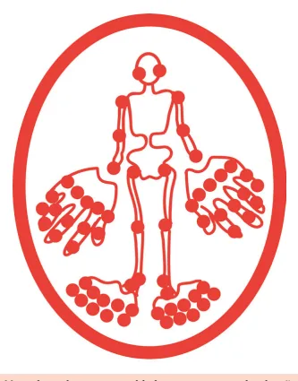
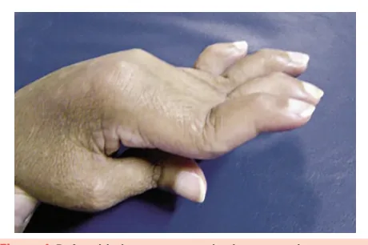
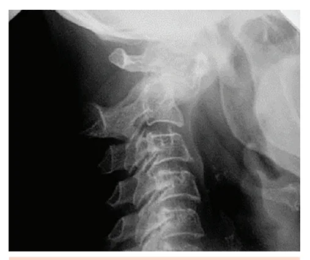
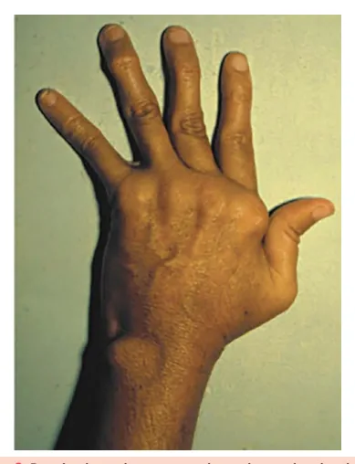
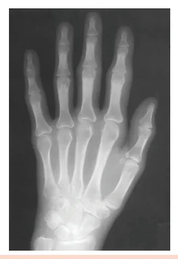
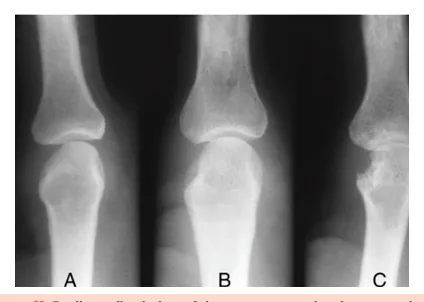
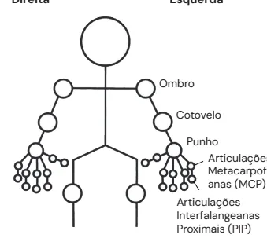

# Introdução às Artrites e Artrite Reumatoide (AR)

<!-- page:1 -->

## INTRODUÇÃO ÀS ARTRITES E

## ARTRITE REUMATOIDE

ARTRITE REUMATO Reumatologia (CM) Artrite Reumatoide (CM) INTRODUÇÃO ÀS ARTRITES

- Lembrar sempre do “NSTOP” para auxiliar no diagnóstico diferencial:

- N: número de articulações acometidas (monoartrite, oligoartrite e poliartrite);

- S: simetria;

- T: tempo de evolução, se maior ou menor de 6 semanas;

- O: outras manifestações associadas como rigidez prolongada, sintomas sistêmicos, uveíte e entesites;

- P: padrão de progressão, principalmente se aditivo ou migratório.

- Artropatia crônica inflamatória mais comum (1% da população);

- Predomínio feminimo (3:1);

- Aumento da incidência a partir dos 35 anos;

- Poliartrite simétrica de pequenas e grandes articulações (lembrar que poupa interfalangeana distal e que adora punhos e metacarpofalangeanas);

INTRODUÇÃO ÀS ARTRITES A A fim de facilitar o diagnóstico diferencial das doenças articulares reumatológicas, podemos seguir duas leis:

identificar o local de acometimento e determinar o seu padrão.

## A PRIMEIRA LEI É IDENTIFICAR O LOCAL DE

## ACOMETIMENTO

- Cartilagem articular: recobre o osso e protege do impacto;

- Membrana sinovial: tecido fibroelástico/ fibrocartilaginoso rico em vasos;

- Cápsula articular: recobre toda a articulação;

- Osso subcondral: assim como a membrana e a cápsula, também possui receptores de dor.

- A

Figura 1: Estrutura articular. OIDE

- Manifestações extra-musculoesqueléticas: nódulos reumatoides, vasculite, derrame pleural, pneumonia intersticial usual;

- Erosão marginal à radiografia é achado mais tardio;

- Ultrassonografia mostra achados mais precoces de inflamação e erosões;

- Fator reumatoide e anti-CCP tem sensibilidades semelhantes (70 a 80%);

- Anti-CCP é mais específico (95%);

- Tratamento: DMARDs sintéticos inicialmente, sendo o metotrexato a droga âncora, buscando sempre o alvo terapêutico de baixa atividade/remissão em 3 a 6 meses. Quando há falha de dois DMARDs sintéticos, associa-se bDMARD ou inibidor da JAK

(droga alvo específico). A SEGUNDA LEI É DETERMINAR O PADRÃO DE

- Número de articulações: Poliarticular: ≥ 5; Oligoarticular: 2-4; Monoarticular: 1.

- Simetria: Simétrico; Assimétrico.

- Tempo: Agudo: < 6 semanas; Crônico: > 6 semanas.

- Outros sintomas associados: Rigidez prolongada: >1 hora; Lombalgia; Sistêmicos (ex.: fadiga, emagrecimento e febre).

- Progressão: Aditiva: novas articulações são afetadas, sem melhora das anteriores; Migratória: desaparece de uma articulação e surge em outra.

## ALGUNS PADRÕES CLÁSSICOS

| Poliartrite é vista na artrite reumatoide, lúpus eritematoso sistêmico, artrite psoriásica e artrite viral;

| Monoartrite é observada na osteoartrite, gota, doença por depósito de pirofosfato de cálcio e artrite séptica;

---

<!-- page:2 -->

| Padrão migratório é observado na artrite reativa e QUADRO CLÍNICO na febre reumática; Manifestações musculoesqueléticas | Oligoarticular assimétrica: A artrite reumatoide se manifesta com artrite e/ou espondiloartrites e osteoartrite.

Juntas, estas letras formam o mnemônico “NSTOP”! Figura 2: Homúnculo reumatológico com as articulações a serem avaliadas no exame físico.

## INTRODUÇÃO

- Artropatia inflamatória crônica mais comum;

- Em torno de 1% da população;

- Predomínio em mulheres (3:1);

- Mais comum dos 35 aos 75 anos;

- Geralmente há um início tardio no sexo masculino.

## FATORES DE RISCO

- Genéticos: HLA-DR4; HLA-DRB1.

- Ambientais: Tabagismo; Microbioma oral (periodontite); Exposição à sílica; Poluição do ar; Infecções virais.

- Hormonal: Gestação (associada a melhora da artrite); Puerpério (associada a piora da artrite e ao início da doença).

## FISIOPATOLOGIA

- Há inflamação na membrana sinovial (sinovite), evoluindo com o tempo para o pannus.

Pannus é um tecido hipertrófico, composto de infiltrado inflamatório com neutrófilos, mastócitos e linfócitos, irreversível e com capacidade de invadir e erodir osso.

artralgia. Ao aplicar o mnemônico NSTOP na artrite reumatoide, observa-se:

- Número: Poliartrite; Grandes e pequenas articulações periféricas; Predomínio nas articulações de mãos e pés; Pode acometer coluna à nível de C1-C2 e levar a subluxação atlantoaxial; Poupa interfalangianas distais, 1ª carpometacárpica e 1ª metatarsofalangeana.

- Simetria: Simétrica; Bilateral.

- Tempo: > 6 semanas.

- Outros sintomas associados: Associado à rigidez matinal > 1h (em geral mais).

- Progressão: Aditiva.

Quanto mais articulações acometidas, m pior o prognóstico! Figura 3: Articulações em vermelho são as poupadas na artrite reumatoide.

Figura 4: Deformidade em pescoço de cisne na artrite reumatoide. Interfalangeana proximal hiperestendida e interfalangeana distal flexionada.

---

<!-- page:3 -->

## MANIFESTAÇÕES EXTRAMUSCULOESQUELÉTICAS

- Até 50% dos pacientes podem ter sintomas

- Figura 5: Deformidade em botoeira na artrite reumatoide.

Flexão da interfalangeana proximal e extensão da interfalangeana distal. Figura 6: Desvio ulnar, alargamento de punhos e sinovite das metacarpofalangeanas.

Figura 7: Acometimento axial em C1 e C2 com subluxação atlantoaxial. A manifestação clínica inclui cervicalgia até paralisia dos quatro membros.

constitucionais (fadiga, febre baixa, perda de peso);

- Demais sintomas extra-articulares estão presentes em 40%: Nódulos reumatoides subcutâneos são a manifestação mais comum; Os nódulos reumatoides também ocorrem no pulmão; A vasculite reumatoide pode ser grave e se manifestar com úlceras cutâneas; A ceratoconjuntivite sicca é o quadro ocular mais comum; A síndrome de Felty é rara e caracteriza-se por esplenomegalia e neutropenia; O padrão de intersticiopatia mais comum é a pneumonia intersticial usual (PIU); Derrame pleural relacionado à artrite reumatoide possui padrão de exsudato.

A análise do líquido do derrame pleural na artrite reumatoide revela pH baixo, glicose baixa, LDH alto e positividade do fator reumatoide. Portanto, é um exsudato que pode simular um empiema, mas com culturas e Gram negativos!

Figura 8: Vasculite reumatoide cutânea em artrite reumatoide de longa data. Figura 9: Pneumonia intersticial usual em paciente com artrite reumatoide.

---

<!-- page:4 -->

EXAMES COMPLEMENTARES Observe o aumento de partes moles (A) e (B), a Exames laboratoriais redução do espaço articular (B) e erosão bem definida

- Anemia, leucocitose e trombocitose; marginal com maior osteopenia articular e redução do

- PCR e VHS podem estar elevados e refletem atividade de doença;

- Autoanticorpos: Fator reumatoide (FR): sensibilidade de 70 a 80%. Anti-CCP: alta especificidade (até 95%). Mesma sensibilidade do fator reumatoide.

Inespecífico, pode surgir em infecções, neoplasias e é comum em idosos saudáveis;

## EXAMES DE IMAGEM

Radiografia

- Aumento de partes moles (sinovite);

- Osteopenia justarticular;

- Redução do espaço articular;

- Erosões marginais.

Ultrassonografia com power doppler

- Erosões marginais (mais sensível que a radiografia);

- Sinovite;

- Power doppler “positivo”, mostrando neovasos sinoviais e indicando inflamação ativa.

Figura 10: Radiografia de mão em paciente com artrite reumatoide. Observe o aumento de partes moles, principalmente em interfalangeanas proximais, indicativo de sinovite, e a osteopenia periarticular.

Figura 11: Radiografia de interfalangeanas proximais em paciente com artrite reumatoide. espaço articular (C).

e Figura 12: Ultrassonografia de metacarpofalangeana em paciente com artrite reumatoide. Observe a sinovite (área hipoecoica) ocupando o espaço articular e a positividade no power doppler (pontos em vermelho e laranja).

## DIAGNÓSTICO

Critérios classificatórios

- Devem ser aplicados quando: Pelo menos 1 articulação com sinovite; Sinovite não explicada por outra doença.

- Verificar Tabela 1 na próxima página

## MÉTRICAS

Inclui o DAS28 (VHS ou PCR), CDAI e SDAI. O CDAI é uma métrica clínica, não avalia provas de fase aguda. Já o SDAI é uma métrica “simplificada”, que inclui também a avaliação global do médico.

## DAS28

- Avalia: Contagem de articulações edemaciadas; Contagem de articulações dolorosas; Provas de fase aguda (PCR ou VHS); Avaliação global do paciente (0-100mm).

- Interpretações: Remissão: <2,6; Baixa: 2,6 e 3,2; Moderada: >3,2 e <5,1; Alta: >5,1.

- Verificar Figura 13 na próxima página

---

<!-- page:5 -->

Tabela 1: Critérios classificatórios para a artrite reumatoide do ACR 2010. Domínio Critérios Pontos Domínio C Envolvimento articular 1 articu 2–10 artic 1–3 articu (com ou 4–10 articu (com ou >10 articulações Sorologia FR e anti FR+ ou anti-C FR+ ou anti-C Provas de fase aguda VHS e VHS ou Duração dos sintomas < 6 ≥ 6 * Alto título: > 3x o limite superior da normalidade.

Diagnóstico definitivo de artrite reumatoide se D ≥ 6 pontos!

- Direita Esquerda

- Ombro

Cotovelo

- Punho anas (MCP)

Articulações Metacarpofalange- D

- Articulações

Interfalangeanas

- Proximais (PIP)

Figura 13: DAS 28 mostrando as 28 articulações avaliadas.

## TRATAMENTO

Alvo do tratamento

- O alvo do tratamento deve ser a remissão ou baixa atividade de doença determinada pelas métricas

(DAS28, CDAI ou SDAI). Controle sintomático

- AINEs;

- Glicocorticoides;

Critérios Pontos ulação grande; 0 culações grandes; 1 ulações pequenas u sem grandes); ulações pequenas u sem grandes);

s (incluindo ≥1 pequena). 5 i-CCP negativos; 0 CCP+ em baixo título; 2 CCP+ em alto título*. 3 e PCR normais; 0 u PCR alterado. 1 6 semanas; 0 6 semanas. 1 DMARDs sintéticos

- Drogas antirreumáticas modificadoras da doença sintéticas;

- Metotrexato, leflunomida, sulfassalazina e hidroxicloroquina;

- Primeira linha: metotrexato (associado ao ácido fólico no dia seguinte)!

- Se falha em 3 a 6 meses ou intolerância: associar ou trocar o DMARD sintético;

- Se nova falha em 3 a 6 meses após a primeira falha:

manter DMARD sintético + iniciar DMARD biológico ou droga alvo específico. DMARDs biológicos (bDMARD) e droga alvo específico

- Indicados na falha a dois DMARDs sintéticos;

- Em caso de falha 3 a 6 meses após um primeiro bDMARD ou droga alvo específico: manter sDMARD + trocar o bDMARD ou droga alvo específico;

- No caso do rituximabe, está indicado após falha de dois bDMARD ou droga alvo específico;

- bDMARD: Anti-TNF: adalimumabe, infliximabe, etanercepte, golimumabe, certolizumabe; Anti-receptor de IL-6: tocilizumabe; Inibidor da coestimulação de linfócitos T: abatacepte; Anti-CD20: rituximabe;

- Drogas alvo específico: Inibidores da JAK: tofacitinibe, baricitinibe e upadacitinibe.

---

<!-- page:6 -->

Cuidados com bDMARD e droga alvo específico Figura 8: Vasculite reumatoide cutânea em artrite reumatoide

- Anti-TNF: de longa data. Sempre realizar rastreio para tuberculose com PPD ARTHROPATHY in dermatology: a comprehensive review – Scientific figure. Contraindicado se doenças desmielinizantes, insuficiência cardíaca NYHA III e IV, infecção ativa, neoplasia recente (nos últimos 5 anos).

In: RESEARCHGATE. Disponível em: https://www.researchgate.net/figure/aou IGRA;

- Tocilizumabe: aumenta risco de diverticulite e perfuração gastrointestinal;

- Rituximabe: Sempre realizar rastreio para hepatite B; Profilaxia para evitar reativação se antiHBc reagente.

- Abatacepte: pode exacerbar DPOC e asma;

- Drogas alvo específico: maior risco cardiovascular e risco de trombose.

## REFERÊNCIAS

Figura 3: Articulações em vermelho são as poupadas na artrite reumatoide. Acervo Medcof. Figura 4: Deformidade em pescoço de cisne na artrite reumatoide.

Acervo Medcof. Figura 5: Deformidade em botoeira na artrite reumatoide. BOUTONNIERE deformity. In: ORTHOBULLETS. [S.l.]: Orthobullets, [s.d.].

Disponível em: https://www.orthobullets.com/hand/6012/boutonnieredeformity. Acesso em: 4 jun. 2025. Figura 6: Desvio ulnar, alargamento de punhos e sinovite das metacarpofalangeanas.

Acervo Medcof. Figura 7: Acometimento axial em C1 e C2 com subluxação atlantoaxial. PANG, Sze Wing Angel. Atlanto-axial subluxation – Down syndrome. Case study, Radiopaedia.org. Disponível em: https://radiopaedia.org/cases/ atlanto-axial-subluxation-down-syndrome?lang=us. Acesso em: 4 jun.

2025. In: RESEARCHGATE. Disponível em: https://www.researchgate.net/figure/aLeg-ulceration-in-a-patient-with-rheumatoid-vasculitis-rheumatoidarthritis-and_fig2_315326011. Acesso em: 17 nov. 2023.

Figura 9: Pneumonia intersticial usual em paciente com artrite reumatoide. RHEUMATOID arthritis. In: RADIOPAEDIA. [S.l.]: Radiopaedia.org, [s.d.]. Disponível em: https://radiopaedia.org/articles/rheumatoidarthritis?lang=us. Acesso em: 4 jun. 2025.

Figura 10: Radiografia de mão em paciente com artrite reumatoide. RHEUMATOID arthritis. In: RADIOPAEDIA. [S.l.]: Radiopaedia.org, [s.d.]. Disponível em: https://radiopaedia.org/articles/rheumatoidarthritis?lang=us. Acesso em: 4 jun. 2025.

Figura 11: Radiografia de interfalangeanas proximais em paciente com artrite reumatoide. RHEUMATOID arthritis: symptoms. In: HOPKINS ARTHRITIS CENTER.

[S.l.]: Johns Hopkins University, [s.d.]. Disponível em: https://www. hopkinsarthritis.org/arthritis-info/rheumatoid-arthritis/ra-symptoms/.

Acesso em: 4 jun. 2025. Figura 12: Ultrassonografia de metacarpofalangeana em paciente com artrite reumatoide.

MCP synovitis with power Doppler signal. In: RESEARCHGATE. Disponível em: https://www.researchgate.net/figure/MCP-synovitis-with-powerDoppler-signal_fig2_221923971. Acesso em: 4 jun. 2025.

Tabela 1: Critérios classificatórios para a artrite reumatoide do ACR 2010. Adaptado de FULLER, R. 2010 ACR-EULAR classification criteria for rheumatoid arthritis. Braz J Rheumatol, São Paulo, v. 50, n. 5, p.

481–486, Sept./Oct. 2010. Disponível em: https://www.scielo.br/j/rbr/a/ YKVSp7wTJttJmrBG4MHhRLL/?lang=en. Acesso em: 3 jun. 2025.

Figura 13: DAS 28 mostrando as 28 articulações avaliadas. Acervo Medcof.
