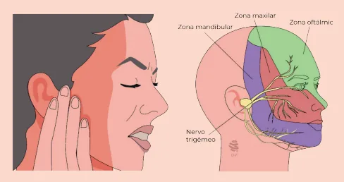
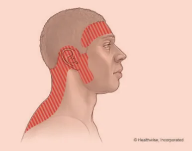
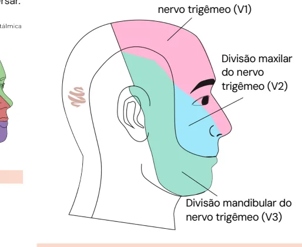
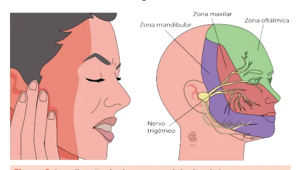

# Introdução às Cefaleias Primárias

<!-- page:1 -->

## Sinais de Alarme para Cefaleias — "SNOOP6"

- **S**istêmica: imunossupressão (ex.: HIV+, neoplasias, quimioterapia);
- **N**eurológica: início súbito (ex.: hemorragia subaracnóidea);
- **O**nset (início) abrupto: despertar durante o sono;
- **O**lder onset: início após os 50 anos;
- **P**adrão: deflagrada por exercício físico ou durante intercurso sexual;
- **P**osicional/precipitada: precipitada ou agravada pela manobra de Valsalva.

## Neuralgia do Trigêmeo

- Nervo trigêmeo (V nervo craniano): sensibilidade da face; ramos V1, V2 e V3;
- Dor unilateral, "em choque", de forte intensidade;
- Curta duração (segundos);
- Paciente assintomático entre as crises;
- Gatilhos: mastigar, escovar os dentes ou barbear-se;
- **NÃO confundir** com cefaleias trigêmino-autonômicas (ex.: cefaleia em salvas);
- Tratamento de 1ª linha: **carbamazepina**.

## Cefaleia Tensional

- Cefaleia primária **mais comum** de todas!
- É a cefaleia do "NÃO" — antagônica da enxaqueca:
  - **NÃO** é unilateral (é bilateral);
  - **NÃO** é pulsátil (é em aperto);
  - **NÃO** é de forte intensidade (leve a moderada);
  - **NÃO** possui fotofobia E fonofobia (juntas);
  - **NÃO** dura apenas até 72 horas (dura de 30 min até 7 dias).
- Tratamento na crise: analgésicos e AINEs;
- Tratamento profilático: amitriptilina, venlafaxina.

## Abordagem Inicial às Cefaleias

- Cefaleia é uma das principais queixas de pacientes que vão ao pronto-socorro e principal causa de procura ao neurologista;
- Dividimos as cefaleias em dois grandes grupos:
  - **Cefaleia primária** (grande maioria dos casos): ela é a própria doença; não há nenhuma outra causa para ela. Exemplo: enxaqueca ou cefaleia tensional.
  - **Cefaleia secundária**: o sintoma é apenas a "ponta do iceberg" de uma doença muito mais grave. Exemplo: AVC, meningite, encefalite, neoplasias, etc.

## Anamnese e Exame Físico

Deve constar de algumas perguntas para nos ajudar nessa diferenciação:

- **Tipo (caráter)**: em peso? Pulsátil? Latejante?
- **Localização**: unilateral? Periorbitária? Temporal? Frontal? Holocraniana?
- **Intensidade**;
- **Irradiação**;
- **Duração**;
- **Fatores desencadeantes**;
- **Fatores de melhora ou piora**;
- **Sintomas associados**: alterações visuais, náuseas, vômitos, sensibilidade ao som ou à luz.

---

<!-- page:2 -->

- No exame físico devemos pesquisar: sinais vitais, rigidez de nuca e sinais meníngeos, fundoscopia e déficit neurológico focal.

**Tabela 1: Mnemônico SNOOP6 — sinais de alarme para cefaleia**

> ⚠️ Tabela reconstruída a partir de OCR — confira contra a fonte original.

| Letra | Significado | Descrição |
|---|---|---|
| S | Sintomas/doença sistêmica | Febre, sudorese, perda ponderal, imunossupressão |
| N | Sinais/sintomas neurológicos | Alteração do nível de consciência, diplopia, paralisia de nervos cranianos, paresia, ataxia, crises convulsivas |
| O | Início súbito (sudden onset) | Lembrar da cefaleia em trovoada (thunderclap) — se a dor atingir seu pico em menos de 1 minuto, ou pior dor da vida |
| O | Início tardio (older onset) | Início após os 50 anos de idade |
| P | Mudança do padrão / posicional | Cefaleia progressiva, que mudou de padrão ou que muda conforme a posição; papiledema (hipotensão liquórica); precipitada por Valsalva |
| P | Prenhez (gestação) / puerpério | — |

## Cefaleia Tensional

- É a cefaleia primária mais comum de todas (**32-79%**);
- Geralmente relacionada ao estresse emocional ou físico, podendo haver síndrome miofascial concomitante;
- Pode ser classificada em relação à frequência dos episódios de dor, em episódica ou crônica;

**Dica de prova**: a cefaleia tensional é "o oposto" da enxaqueca: dor leve a moderada, bilateral, com caráter "em aperto", sem fotofobia e fonofobia juntas.

- **Cefaleia tensional episódica**:
  - Infrequente: < 1 dia/mês;
  - Frequente: 1-14 dias/mês.
- **Cefaleia tensional crônica**: 15 ou mais dias/mês por mais de 3 meses.

*Figura 1: Localização da dor na cefaleia tensional.*

**Critérios diagnósticos**

- A. Ao menos 10 episódios de cefaleia ocorrendo em < 1 dia/mês em média (< 12 dias/ano) e preenchendo os critérios B-D;
- B. Duração de 30 minutos a 7 dias;
- C. Ao menos 2 das 4 seguintes características:
  1. Localização bilateral;
  2. Qualidade em pressão ou aperto (não pulsátil);
  3. Intensidade fraca ou moderada;
  4. Não agravada por atividade física rotineira, como caminhar ou subir escadas.
- D. Ambos os seguintes:
  1. Ausência de náusea ou vômitos;
  2. Fotofobia ou fonofobia (apenas uma delas pode estar presente).
- E. Não melhor explicada por outro diagnóstico da ICHD-3.

**Tratamento**

- Tratamento nas crises:
  - Anti-inflamatórios não esteroidais (nível A): ibuprofeno, cetoprofeno, naproxeno, diclofenaco — sem evidências relevantes de diferenças entre um e outro;
  - Analgésicos simples (nível A): paracetamol e dipirona;
  - Analgésicos combinados com cafeína são a segunda linha de tratamento.
- Tratamento profilático: feito majoritariamente com antidepressivos:
  - Amitriptilina 30-75 mg (nível A);
  - Venlafaxina 150 mg (nível B) / mirtazapina 30 mg (nível B).
  - Triptanos **não funcionam** para cefaleia tensional.
- Obs.: toxina botulínica, relaxantes musculares e opioides não têm indicação estabelecida.

## Neuralgia do Trigêmeo

- O nervo trigêmeo é o 5º nervo craniano e é responsável pela sensibilidade da face, mucosa oral e nasal e dos dois terços anteriores da língua.

---

<!-- page:3 -->

- A neuralgia é caracterizada por episódios curtos, mas intensos, de dor unilateral em 1 ou mais ramos do nervo trigêmeo, especialmente V2 (maxilar) e V3 (mandibular):
  - A dor é descrita como "choque";
  - Pode haver até 70 episódios em um dia;
  - Entre as crises, o paciente permanece assintomático.
- É comum haver na história "gatilhos" para a dor, como escovar os dentes, mastigar, fazer a barba ou conversar.

*Figura 2: Localização da dor na neuralgia do trigêmeo.*

## Tratamento

**Preventivo**

- **Carbamazepina** 200-2.400 mg/dia;
- **Oxcarbazepina**: 300-1.200 mg/dia:
  - Carbamazepina demora para começar a agir.
- **Gabapentina**: 1.800-3.600 mg/dia;
- **Lamotrigina**: 200-400 mg/dia;
- Outras opções: baclofeno e ácido valproico.

**Crises**

- **Fenitoína** 250-1000 mg EV lento;
- **Lidocaína** intranasal ou endovenosa;
- **Sumatriptano** 3 mg SC.

*Figura 3: Divisão anatômica do nervo trigêmeo (V nervo craniano) — divisão oftálmica (V1), divisão maxilar (V2), divisão mandibular (V3).*

