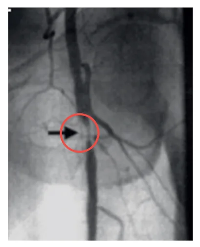
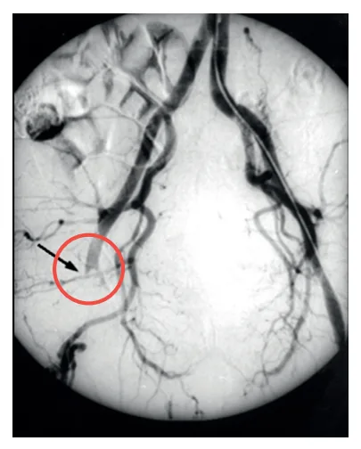

# Isquemia de Membros Inferiores - Oaa (oclusão Arterial Aguda)

<!-- page:1 -->

## Isquemia de membros inferiores

## OAA CARDIOEMBÓLICA

- Fonte cardíaca de embolização: flutter, FA, aneurisma ventricular, IAM;

- Diagnóstico: sem exame de imagem;

- Quadro agudo;

- Membros assimétricos;

## CARDIOEMBOLISMO

## DEFINIÇÃO

- Embolização de trombos cardíacos atriais

(mais comum) ou ventriculares. CAUSAS

- Fibrilação atrial, flutter atrial, infarto ventricular com área de hipocinesia, aneurisma ventricular.

## FISIOPATOLOGIA

- Não associado à aterosclerose;

- Impactação de trombo em áreas de bifurcação

(mudança de calibre);

- Localização mais comum: bifurcação da artéria femoral comum.

## QUADRO CLÍNICO

- Dor hiperaguda;

- Sem claudicação prévia;

- Paciente não tem circulação colateral

(isquemia progride rápido);

- Assimetria grosseira de pulsos nos membros inferiores

(o outro membro é saudável). DIAGNÓSTICO

- Clínico!!!

- Não necessita de exames de imagem; Exame de imagem atrasa o tratamento.

## OAA- TEMPO DE ISQUEMIA

- Inviabilidade em: Músculo: 4-8 horas. Nervo: 4-8 horas. Gordura: 12 horas. Pele: 24 horas. Osso: 4 dias.

## CLASSIFICAÇÃO DE RUTHERFORD

- Classificação de VIABILIDADE → Define se, mesmo com a revascularização bem sucedida, o membro pode ser salvo); - Aplicar classificação de Rutherford para viabilidade: Se viável: embolectomia com cateter de Se inviável: amputação primária (Rutherford III), avaliar necessidade de revascularizar algum segmento para amputação.

Fogarty + fasciotomia se necessário;

- Anticoagulação plena (doença de base).

- Critérios clínicos → Não necessita de exame de imagem: Avalia Déficit sensitivo e motor.

- Cianose NÃO é um parâmetro da classificação!

- Rutherford IIB - ameaça iminente - revascularizar o mais rápido possível!

- Rutherford III - amputação - membro inviável.

Tabela 1: Classificação de Rutherford: Sensibilidade Motricidade Prognóstico I Preservada Preservada Viável IIA Diminuída Preservada Viável IIB Diminuída Diminuída Ameaça iminente III Anestesia Paralisia Inviável TRATAMENTO

- Anticoagulação plena imediata;

- Embolectomia com cateter de fogarty: Inguinotomia; Acesso e controle da artéria femoral; Embolectomia retrógrada e anterógrada; Heparinização local; Fechamento primário da arteriotomia.

s | Arteriotomia transversa; SÍNDROME DE REPERFUSÃO

- Muito importante principalmente > 6h;

- Acidose, hipercalemia, mioglobinúria;

- Para membros com isquemia irreversível, considerar amputação antes da revascularização*.

## SÍNDROME COMPARTIMENTAL

- Edema muscular secundário a reperfusão;

- Compressão de estruturas do compartimento: nervo, artéria e veia;

- Dor à movimentação passiva → sinal mais precoce;

- Raramente evolui com tromboses arteriais e venosas.

m

- Conduta: Fasciotomia.

- Fazer em toda isquemia com mais de 6 horas → embolia aguda ou trauma.

- Na dúvida entre fazer ou não, faça a fasciotomia!

---

<!-- page:2 -->

## TIRANDO DÚVIDAS

Tabela 2: OAA(oclusão arterial aguda embólica) x OAC (oclusão arterial crônica descompensada (trombótica).

OAC descompensada OAA embólica (OAA trombótica) Fonte emboligênica be Fatores de risco FA, flutter, IAM, aneurism forame oval pa Hiper agudo - duração Tempo!

horas Assimetria entre os Exame físico Muito sintomático (a circulação cola Talvez não seja necessá Exame de imagem de pulsos é sufi Cálice inverti Anticoagulação Imediata e perm Sempre!

Cirurgia Embolectomia com Fogarty® e/ou am OAA Taça invertida Figura 1: Arteriografia oclusão arterial aguda. Diferença de imagem en descompensada (trombótica).

## REFERÊNCIAS

Figura 1: Arteriografia oclusão arterial aguda. Diferença de imagem entre oclusão arterial aguda embólica e oclusão arterial crônica descompensada (trombótica).

Adaptado de RADIOPAEDIA. Radiopaedia.org. 2025. Disponível em: https:// www.radiopaedia.org. Acesso em: 06 jun. 2025. (OAA trombótica)

em definida HAS, DM, Dislipidemia, Aterosclerose em ma ventricular, outros territórios, Tabagismo atente de minutos ou Claudicação prévia Sub agudo - dias, semanas s membros Membro contralateral também ausência de isquêmico ateral)

Obrigatório realizar imagem! ário - palpação USG doppler ou angioTC para ficiente planejamento (GLASS)

ido* Ponta do lápis* manente Imediata, até a revascularização cateter de Nem sempre - WIfI e GLASS mputação OAC descompensada Ponta de lápis ntre oclusão arterial aguda embólica e oclusão arterial crônica

