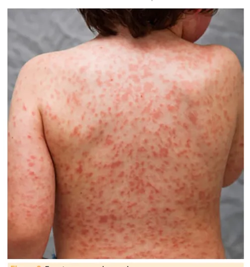
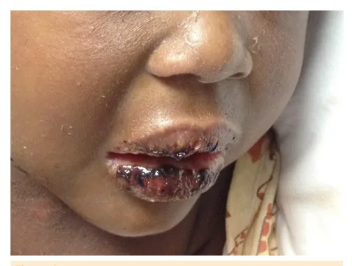
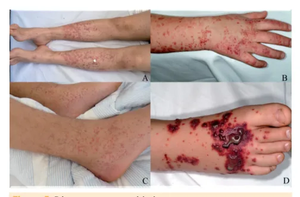
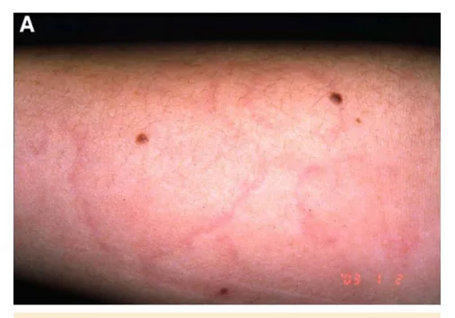
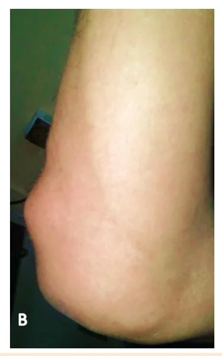

# Kawasaki, Vasculite por Iga e Febre Reumática

<!-- page:1 -->

## KAWASAKI, VASCULITE POR IGA E

## FEBRE REUMÁTICA

Kawasaki Vasculite por IgA Febre reumática (PED) Doença Clínica Febre ≥ 5 dias + 4:

- Exantema polimorfo;

Doença de

- Alteração extremidades;

Kawasaki

- Alteração lábios/cavidade oral;

- Linfadenopatia cervical;

- Conjuntivite não supurativa.

Púrpura palpável (na ausência de trombocitopenia) e ≥ 1: Vasculite por

- Dor abdominal;

IgA

- Artrite/artralgia;

- Nefrite;

- Histopatológico.

Critérios maiores:

- Cardite;

- Artrite;

- Sydenham;

- Eritema marginado;

Febre

- Nódulos subcutâneos.

reumática Critérios menores:

- Febre;

- Artralgia,

- Prolongamento do intervalo PR;

- Aumento de VHS e PCR.

- Comprovação de infecção por EGA

## PROFILAXIA SECUNDÁRIA – FEBRE REUMÁTICA (FR

Categoria FR sem cardite FR com cardite (insuficiência mitral leve residual ou resolução da lesão valvar)

FR com cardite (lesão valvar residual moderada a severa) FR com cardite, após cirurgia valvar

## DOENÇA DE KAWASAKI

## CONCEITO

- Doença febril aguda;

- Vasculite de artérias médias: segunda mais comum: Preferência pelas artérias coronárias.

- Provável etiologia infecciosa e de predisposição genética.

Atenção ao desenvolvimento de aneurisma coronário! Diagnóstico Tratamento AGUDO: CLÍNICO! IGEV + AAS; antiECO → Aneurisma de aa; inflamatório.

coronárias. CONVALESCENÇA: AAS; anti-trombótico. Suporte: CLÍNICO! corticoide em quadros graves. 2 maiores OU Penicilina 1 maior E 2 menores Profilaxia secundária:

+ Comprovação de envolvimento valvar. infecção estreptocócica Situações especiais R) Duração 5 anos após o último episódio ou até 21 anos de idade.

10 anos após o último episódio ou até fase adulta (25 anos de idade). Até 40 anos de idade ou por toda a vida*.

Por toda a vida.

## EPIDEMIOLOGIA

- Acomete principalmente indivíduos na infância, geralmente < 5 anos;

- Pico 9-12 meses;

- Sexo masculino;

- Há prevalência em pacientes de origem asiática/ilhas do pacífico: Descendentes de japoneses.

MANIFESTAÇÕES CLÍNICAS Fase aguda (arterite necrotizante neutrofílica)

- Duração: 1- 2 semanas;

- Caracteriza-se pelo surgimento de febre e sinais clínicos da doença aguda.

---

<!-- page:2 -->

Fase subaguda (linfócitos, eosinófilos)

- 7-10 dias após início da febre;

- Caracteriza-se pelo surgimento de: Descamação de extremidades – perineal, periungueal; Trombocitose – com valores expressivos de plaquetas; Aneurisma de artéria coronária (AAC); Há elevado risco de morte súbita naqueles que desenvolvem AAC (até 25% em pacientes não tratados).

Fase de convalescença

- Ocorre de 6-8 semanas após o início da doença;

- Sinais clínicos desaparecem;

- Regressão da maioria dos aneurismas;

- Perdura até que VHS retorne ao normal.

Manifestações clínicas

- Febre ≥ 5 dias**- sinal cardinal e obrigatório. Discretas disparidades de acordo com a fonte avaliada: Tratado Brasileiro de Pediatria (SBP, 2025): febre UpToDate (2024): febre ≥ 5 dias; AHA (2024): diagnóstico pode ser feito com 4 dias de febre; médicos experientes podem diagnosticar com 3 dias; Nelson (2025): febre ≥ 5 dias + ≥ 4 critérios principais. Diagnóstico possível no 4.º dia se sinais típicos em extremidades estiverem presentes;

≥ 5 dias; Figura 2: Exantema maculopapular. clínicos experientes podem diagnosticar antes do 4.º dia em casos raros;

| SBP, Documento Científico (2020): diagnóstico possível com ≥ 4 critérios típicos no 4.º dia de febre.

1. Alteração em membros (70%)

- Eritema/edema;

- Descamação periungueal na fase subaguda: Pode ocorrer descamação perineal. Figura 3: Fissura labial.

Figura 1: Eritema e edema de extremidades.

2. Erupção cutânea polimórfica (80%–90%)

- Eritema maculopapular, escarlatiniforme

(exceto vesicular); Figura 4: Hiperemia conjuntival sem exsudato.

- Predomínio em tronco e região inguinal.

- Verificar Figura 2. 4. Linfadenopatia cervical

- Unilateral e ≥ 1,5 cm.

3. Alteração em lábios e cavidade oral (90%)

- Fissura e eritema labiais; 5. Hiperemia conjuntival, bilateral, sem exsudato.

- Língua em framboesa/morango; Outras manifestações clínicas

- Hiperemia oral e faríngea;

- Dor abdominal, diarreia e vômitos;

- Sem aftas, úlceras ou exsudato.

- Fenômeno de Raynaud;

- Artralgia/artrite;

---

<!-- page:3 -->

- Disfunção hepática; TRATAMENTO

- Hidropsia de vesícula biliar; Doença aguda

- Irritabilidade importante; Objetivo: evitar a complicação coronariana (ocorre

- Meningite asséptica; em 20%-25% dos não tratados e em menos de 5%

- Perda auditiva neurossensorial; dos tratados).

- Perda auditiva neurossensorial;

- Uretrite;

- BCGíte.

DIAGNÓSTICO Clínico!

- Febre ≥ 5 dias: critério cardinal;

- 4-5 dos seguintes: Alterações em membros; Exantema polimorfo; Hiperemia conjuntival sem exsudato; Alterações nos lábios e cavidade oral; Linfadenopatia cervical.

Forma atípica ou incompleta

- Febre ≥ 5 dias;

- 2/3 critérios clínicos;

- PCR e/ ou VHS elevados;

- ≥ 3 das alterações propedêuticas: Albumina ≤ 3,0 g/dL; Anemia; Elevação da ALT; Plaquetas após 7 dias ≥ 450.000/mm3; Leucócitos ≥ 15.000/mm3; Leucocitúria ≥ 10/campo; Hiponatremia; Escore Z coronárias > 2,5.

## COMPLICAÇÃO

- Aneurisma coronário.

Fatores de risco para desenvolvimento de aneurisma coronário

- < 6 meses ou > 5/8 anos;

- Sexo masculino;

- Febre persistente;

- Má resposta à imunoglobulina endovenosa (IGEV);

- Neutrofilia e/ou trombocitopenia;

- Hiponatremia e/ou hipoalbuminemia;

- Elevação de PCR, BNP e/ou transaminases;

- Etnias asiáticas e hispânicas;

- Síndrome do choque do Kawasaki.

Ecocardiograma

- Quando realizar? Ao diagnóstico (basal, posterior comparação); 1 a 2-3 semanas do início da doença; 6-8 semanas do início da doença.

- Ecocardiograma anormal/manutenção de febre/recorrência dos sintomas: fazê-lo com maior frequência! Competência do cardiopediatra ditar a gravidade da alteração e frequência de repetição dos ecocardiogramas alterados. dos tratados).

- 2 g/kg de IGEV;

- Ácido acetilsalicílico (AAS) em altas doses (50-80/100 mg/kg/dia) ou doses moderadas (30-50 mg/kg/dia);

- Deve ser realizado o mais rapidamente possível após o diagnóstico;

- Idealmente, nos primeiros 10 dias do início da doença.

ATENÇÃO: febre persistente e/ou sinais de inflamação sistêmica mesmo se > 10 dias de febre, considerar a administração da IGEV.

Convalescença

- AAS: transição de doses anti-inflamatórias para doses antitrombóticas (3-5 mg/kg/dia);

- Transicionar a dose após o paciente ter permanecido afebril durante 48 horas;

- Manter até 6 a 8 semanas após o início da doença;

- Interromper se: ecocardiograma normal após

6-8 semanas. Considerações

- Considerar metilprednisolona se alto risco de AAC;

- Resistente: manutenção de febre 36 horas após IGEV: Repetir mesma dose de IGEV; Se resistente: pulsoterapia com metilprednisolona.

- Opções se houver refratariedade: anti-TNF alfa, ciclosporina, ciclofosfamida, plasmaférese.

## PROGNÓSTICO

- Depende da gravidade da alteração coronariana;

- Disfunção endotelial persistente: atenção

FR cardiovasculares!

## VASCULITE POR IGA

- Também conhecida como púrpura de

Henoch-Schönlein;

- Vasculite primária mais comum na infância;

- Vasculite de pequenos vasos;

- Vasculite leucocitoclástica + deposição de IgA;

- Acomete principalmente pele, articulações, trato gastrointestinal e glomérulos.

- Acomete qualquer faixa etária: 90% dos casos: 3–10 anos.

- Prevalência no sexo masculino;

- Populações brancas e asiáticas;

- A maioria dos casos seguem infecções de vias aéreas superiores (IVAS) documentada: S. pyogenes (principalmente); S. aureus; Adenovírus; Mycoplasma.

---

<!-- page:4 -->

## MANIFESTAÇÕES CLÍNICAS DIAGNÓSTICO

Dermatológico: púrpura palpável

- É uma manifestação característica: Tabela 1: Critérios de classificação do EULAR/PRINTO/PRES para Predomínio em regiões de ação da gravidade: vasculite por IgA.

membros inferiores, topografia glútea e sacral. membros inferiores, topografia glútea e sacral.

- Eventualmente surge edema subcutâneo.

Figura 5: Púrpura em extremidades. Musculoesquelético

- Artrite/artralgias;

- Ocorre em 70%–90% dos casos;

- É de caráter oligoarticular → principalmente em membros inferiores;

- Autolimitada, não deixando sequelas;

- Pode preceder lesão dermatológica.

- Trato gastrointestinal (TGI)

- Dor abdominal, vômitos, diarreia, íleo paralítico e T melena → pode mimetizar um abdome agudo cirúrgico: S Ocorre em até 70%–80% dos casos.

- Intussuscepção e perfuração podem ocorrer: < 5% dos casos.

- Renal C

- Ocorre em 10%–50% dos casos;

- Mais grave, determinante de pior prognóstico.

- Acometimentos que sugerem envolvimento renal: Hematúria microscópica; Proteinúria; Hipertensão; Nefrite franca; Síndrome nefrótica; Injúria renal aguda ou crônica.

- É rara a progressão para doença renal terminal: 1%–2% de todos os pacientes com vasculite por IgA; Até 8% daqueles que manifestaram nefrite.

Sistema nervoso central (SNC)

- É uma forma rara; P

- Dá-se por hemorragia intracerebral, cuja manifestação pode ocorrer por: Convulsões; Cefaleias; Alterações de comportamento.

Outras

- Orquite/orquiepididimite → 20% dos casos.

- Púrpura palpável (na ausência de trombocitopenia) e ≥ 1 dos seguintes obrigatório critérios devem estar presentes:

Critério Aguda, cólica, difusa, intussuscepção, Dor abdominal sangramento no TGI. Biópsia do tecido afetado Histopatologia demonstrando deposição predominante de IgA.

Aguda, com edema, dor e/ou Artrite/artralgia limitação articular. Proteinúria, hematúria, cilindros Nefrite hemáticos.

Achados laboratoriais que corroboram o diagnóstico

- Leucocitose moderada;

- Plaquetas normais ou levemente aumentadas;

- Hematúria, cilindrúria, dismorfismo eritrocitário, leucocitúria, proteinúria;

- Elevação de ureia e creatinina;

- VHS e PCR normais ou discretamente elevados;

- ANA, ANCA e fator reumatoide são negativos.

TRATAMENTO Suporte

- Se ausência de manifestações renais ou gastrointestinais graves (maioria);

- Foco em hidratação, nutrição e analgesia.

Corticoterapia

- Orquite.

- Envolvimento do TGI: Dor abdominal intensa; Hemorragia digestiva; Intussuscepção.

- Ulcerações ou necrose de pele;

- Hemorragia pulmonar;

- Vasculite cerebral;

- NÃO previne o desenvolvimento da nefrite!

- Feito com prednisona/prednisolona 1 mg/kg/dia por 1 a 2 semanas: Retirada paulatina para evitar rebote dos sintomas.

- A maioria dos casos tem evolução favorável: Doença monocíclica; Duração média: 4 semanas.

- Há recorrência em 1/3 dos quadros: Quando ocorrem, são quadros mais leves e com menor duração.

- Progressão para doença renal crônica: 1%–2% de todos os pacientes com vasculite por IgA; Até 8% daqueles que manifestaram nefrite; Acompanhar pressão arterial e urina 1 desses pacientes.

---

<!-- page:5 -->

Episódio inicial

- Comprovação de infecção estreptocócica E;

## CONCEITOS

- 2 maiores OU 1 maior + 2 menores.

- É uma complicação não supurativa de Recorrência uma faringotonsilite:

- Sem cardite: 2 maiores OU 1 maior + 2 menores uma faringotonsilite: Streptococcus pyogenes → estreptococo beta-hemolítico do grupo A (EGA).

- Cepa reumatogênica (1, 3, 5, 6, 18, 26) + susceptibilidade genética + tratamento inadequado;

- Patogênese: mimetismo molecular.

- Doença reumática mais comum em crianças brasileiras;

- É a causa de cardiopatia adquirida mais comum em países em desenvolvimento;

- Idade escolar e adolescência: Raro antes dos 5 anos e após 15 anos de idade.

- Fatores de risco: nível socioeconômico, aglomeração;

acesso precário aos serviços de saúde. CLÍNICA E DIAGNÓSTICO

- Período de latência de 2–4 semanas;

- Doença heterogênea.

Critérios de Jones (1944)

- Sinais maiores, sinais menores e evidência de infecção estreptocócica prévia;

- Atualização: AHA, 2015.

Tabela 2: Critérios de Jones para febre reumática. Comprovação Critérios Critérios maiores da infecção menores estreptocócica Artralgia Cultura de Cardite (clínica BR: POLIartralgia orofaringe ou subclínica)* AR: positiva para MONOartralgia EGA Artrite* Febre BR: POLIartrite Teste antigênico BR: > 38,5 °C AR: MONOartrite rápido para EGA AR: > 38 °C ou POLIartralgia Elevação de reagentes de Aumento dos Eritema fase aguda: títulos de marginado VHS e PCR anticorpos antiBR: > 60 mm/h EGA AR: > 30 mm/h

## ECG

Nódulos prolongamento subcutâneos do intervalo PR Coreia de

- Sydenham baixo risco para febre reumática;

*BR: característica a ser considerada para populações de *AR: característica a ser considerada para populações de alto risco para febre reumática. - Sem cardite: 2 maiores OU 1 maior + 2 menores OU 3 menores;

- Doença cardíaca reumática: 2 menores;

- Evidência de infecção estreptocócica anterior.

Situações especiais

- Coreia de Sydenham: manifestação única;

- Cardite reumática de início insidioso.

MANIFESTAÇÕES CLÍNICAS Artrite

- > 70% dos pacientes — forma mais frequente e precoce de apresentação;

- Poliartrite migratória: acomete grandes articulações;

- Resposta importante a salicilatos;

- Sem sequelas.

Coreia de Sydenham

- Acomete 5%–36% dos pacientes;

- Longo período de latência: até 6 a 12 meses;

- Labilidade emocional, piora do desempenho escolar, movimentos involuntários/ caretas que pioram ao estresse e melhoram no sono;

- Sem sequelas.

Cardite

- Acomete 50%–60% dos pacientes;

- Manifestação de maior gravidade;

- Pancardite;

- Valvulite: manifestação primordial;

- Insuficiência mitral > dupla lesão (mitral e aórtica) > insuficiência aórtica;

- Doença prolongada pode cursar com estenose valvar e necessidade de substituição da valva.

Eritema marginado

- Manifestação rara;

- Lesão macular eritematosa e serpiginosa, de centro pálido não pruriginoso;

- Não pruriginoso;

- Poupa face.

Figura 6: Eritema marginado.

---

<!-- page:6 -->

Nódulos subcutâneos

- Penicilina G benzatina:

- Rara (2%–5%); | 600.000 UI, IM, nos < 20 kg;

- Superfícies extensoras; | 1.200.000 UI, IM, nos > 20 kg;

- Surgimento tardio; | A aplicação deve ser repetida a cada 21 dias

- Correlação com gravidade e cardite. (3 semanas);

- Correlação com gravidade e cardite.

d Figura 7: Nódulo subcutâneo. TRATAMENTO d Erradicação do estreptococo

- Até 9 dias após o início do quadro → para S prevenção primária; d

- Para todas as formas de apresentação da febre reumática. S

Terapia anti-inflamatória d

- Artrite: anti-inflamatórios não esteroidais (AINEs):

primeira linha pelo melhor perfil de segurança em H relação aos salicilatos; L

- Cardite moderada-grave: glicocorticoide. Discutível em casos leves.

Tratamento da Coreia: quadros moderado-grave W

- Haloperidol, ácido valproico, carbamazepina p ou fenobarbital;

- Corticoterapia – casos graves.

PROFILAXIA SECUNDÁRIA c

- É recomendada para todo paciente com diagnóstico de FR;

- O objetivo é evitar um novo surto com cardite ou piora da lesão prévia; (3 semanas); Se alergia: eritromicina, azitromicina, clindamicina.

Tabela 3: Profilaxia secundária na febre reumática. Duração Categoria (o que durar mais) 5 anos após o último FR sem cardite episódio ou até 21 anos de idade.

FR com cardite 10 anos após o último (insuficiência mitral leve episódio ou até fase adulta residual ou resolução da (25 anos de idade).

lesão valvar) FR com cardite Até 40 anos de idade ou (lesão valvar residual por toda a vida (depende moderada a severa) da fonte)*.

FR com cardite, após Por toda a vida. cirurgia valvar

## REFERÊNCIAS

Figura 1: Eritema e edema de extremidades. Saguil A, Fargo M, Grogan S. Diagnosis and management of kawasaki disease. Am Fam Physician. 2015 Mar 15;91(6):365-71. PMID: 25822554.

Figura 2: Exantema maculopapular. Saguil A, Fargo M, Grogan S. Diagnosis and management of kawasaki disease. Am Fam Physician. 2015 Mar 15;91(6):365-71. PMID: 25822554.

Figura 3: Fissura labial. Saguil A, Fargo M, Grogan S. Diagnosis and management of kawasaki disease. Am Fam Physician. 2015 Mar 15;91(6):365-71. PMID: 25822554.

Figura 4: Hiperemia conjuntival sem exsudato. Saguil A, Fargo M, Grogan S. Diagnosis and management of kawasaki disease. Am Fam Physician. 2015 Mar 15;91(6):365-71. PMID: 25822554.

Figura 5: Púrpura em extremidades. HetlandLE, Susrud KS, Lindahl KH, Bygum A. Henoch-Schönlein Purpura: A Literature Review. Acta Derm Venereol. 2017 Nov 15;97(10):1160-1166. doi:

10.2340/00015555-2733. PMID: 28654132.. Figura 6: Eritema marginado. Wang CR, Lee NY, Tsai HW, Yang CC, Lee CH. Acute rheumatic fever in adult patients. Medicine (Baltimore). 2022 Jul 1;101(26):e29833. doi: 10.1097/ MD.0000000000029833. PMID: 35777053; PMCID: PMC9239616..

Figura 7: Nódulo subcutâneo. Case courtesy of Dr Abdallah El-Sayed Allam, https://radiopaedia.org/ cases/39753?lang=us

