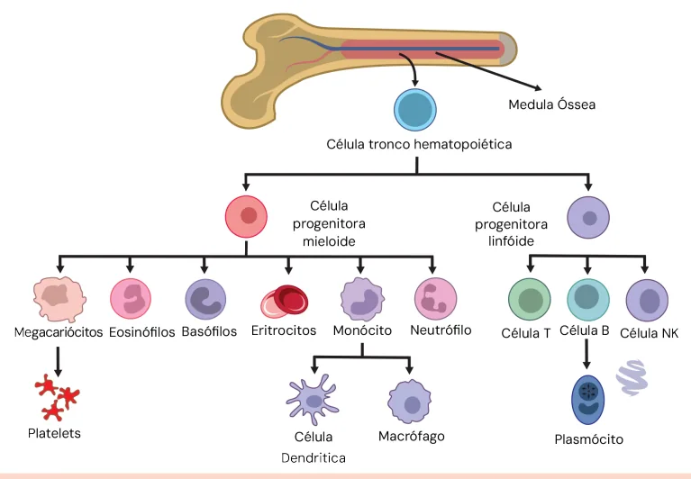
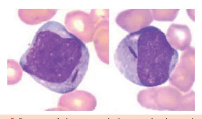
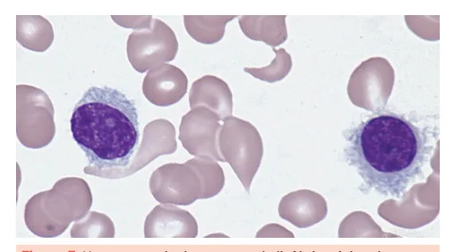

# Leucemias

<!-- page:1 -->

## Leucemias (Clínica Médica)

> ⚠️ Página reconstruída a partir de OCR de duas colunas intercaladas — confira contra a fonte original.

### Leucemias Agudas

- Parada de maturação celular → blastos;
- Diagnóstico: > 20% de blastos na medula óssea ou no sangue periférico.

**LMA (leucemia mieloide aguda)**

- Marcadores mieloides: MPO, CD13, CD33;
- Mais comum em idosos;
- Bastonete de Auer (patognomônico de LMA).

**LLA (leucemia linfoide aguda)**

- Marcadores linfoides B: CD19, CD20 e CD79a;
- Marcadores linfoides T: CD3 e CD7;
- Neoplasia mais comum da infância.

**Alterações importantes**

- Leucemia promielocítica: t(15;17) — PML/RARA;
- Ph+: t(9;22) — Philadelphia.

### Leucemias Crônicas

**LMC (leucemia mieloide crônica)**

- Neoplasia mieloproliferativa crônica.

**LLC (leucemia linfoide crônica)**

- Linfocitose > 5.000/mm³ monoclonal;
- Idosos;
- Não precisa de medula óssea para o diagnóstico;
- Muito associada com anemia hemolítica autoimune (AHAI) e púrpura trombocitopênica idiopática (PTI).

## Maturação Celular

- Inicia na medula óssea a partir de células-tronco hematopoiéticas, que podem dar origem a qualquer célula;
- Inicialmente ela se compromete com alguma linhagem: mieloide ou linfoide.

**Progenitor mieloide**

- Megacariócito → plaquetas;
- Eosinófilo;
- Basófilo;
- Eritrócito;
- Monócitos → células dendríticas / macrófagos;
- Neutrófilos.

**Progenitor linfoide**

- Linfócito T;
- Linfócito B → plasmócito;
- Linfócito NK.

Verificar Figura 1.

**Leucemias agudas**

- Parada de maturação: ficam incapazes de seguir a maturação e param de produzir as demais células;
- Produção clonal de células jovens;
- Redução da hematopoiese normal.

Figura 1: Estágio de maturação das células hematopoéticas.

---

<!-- page:2 -->

Figura 2: Sangue normal e com leucemia aguda. À esquerda, a figura representa a diversidade de um sangue normal; à direita, demonstra a monotonia celular, com presença de uma célula que predomina sobre as outras, característica das leucemias agudas.

## Leucemia Mieloide Aguda (LMA)

- Mutação que desencadeia bloqueio de maturação;
- Produção clonal de precursor mieloide → mieloblasto;
- 90% das leucemias agudas em adultos;
- Incidência aumenta com a idade pelo acúmulo de mutações → > 60 anos;
- Maioria dos casos: LMA de novo, sem causa ou fator de risco;
- Secundária: quimioterapia (agentes alquilantes como ciclofosfamida, inibidores de topoisomerase II como etoposídeo e teniposídeo); radioterapia que engloba grandes campos medulares;
- Sinais e sintomas: febre; palidez; astenia; sangramentos; hepatoesplenomegalia.

### Diagnóstico

- 20% de blastos em sangue periférico ou medula óssea (MO);
- Bastonetes de Auer → patognomônico, porém não estão presentes em 100% dos casos;
- Para definir se a leucemia é mieloide ou linfoide, precisamos realizar a imunofenotipagem → expressam mieloperoxidase (MPO), CD13 e CD33.

Figura 3: Presença de bastonete de Auer no citoplasma de um mieloblasto. A sua presença é patognomônica de leucemia aguda de linhagem mieloide.

Verificar Tabela 1 na próxima página.

### Imunofenotipagem

- Ajudam a identificar que célula é aquela a partir dos marcadores de superfície CD (cluster designation): célula T → CD3/TCR; célula B → CD19/CD20; mieloide → MPO/CD13/CD33;
- Citogenética e biologia molecular definem o subtipo da LMA;
- Marcadores mieloides: mieloperoxidase (MPO), CD13, CD33.

### Classificação Morfológica

- Classificação FAB (French-American-British classification):
  - M0 → LMA com mínima diferenciação mieloide;
  - M1 → LMA sem maturação;
  - M2 → LMA com maturação;
  - M3 → LMA promielocítica aguda;
  - M4 → LMA mielomonocítica aguda;
  - M5 → LMA monoblástica;
  - M6 → eritroleucemia;
  - M7 → megacarioblástica.

Pela última edição da OMS, a valorização da classificação morfológica é cada vez menor. Hoje, entendemos a leucemia como uma doença molecular, e sempre procuramos classificar as leucemias a partir de sua mutação, e não a partir de sua morfologia na avaliação medular.

## Leucemia Promielocítica Aguda (LPA)

- É um subtipo da LMA (M3): translocação balanceada entre o cromossomo 15 (PML) e o 17 (RARA); gene de fusão PML-RARA → relacionado principalmente com coagulação.

**Epidemiologia**

- Representa entre 5–20% dos casos de LMA;
- Mais comum em adultos jovens;
- LMA com melhor prognóstico.

---

<!-- page:3 -->

Tabela 1: Categoria de risco de leucemia mieloide aguda baseada no European LeukemiaNet 2022.

> ⚠️ Tabela reconstruída a partir de OCR — confira contra a fonte original.

| Categoria de risco | Anomalias genéticas |
|---|---|
| Favorável | t(8;21)(q22;q22.1) / RUNX1::RUNX1T1; inv(16)(p13.1q22) ou t(16;16)(p13.1;q22) / CBFB::MYH11; mutação no NPM1, sem FLT3-ITD; mutação in-frame na região bZIP do gene CEBPA |
| Intermediário | Mutação no NPM1 com FLT3-ITD; NPM1 selvagem (wild-type) com FLT3-ITD; t(9;11)(p21.3;q23.3) / MLLT3::KMT2A; anomalias citogenéticas e/ou moleculares não classificadas como favoráveis ou adversas |
| Adverso (Grave) | t(6;9)(p23;q34.1) / DEK::NUP214; t(v;11q23.3) / rearranjo de KMT2A; t(9;22)(q34.1;q11.2) / BCR::ABL1; t(8;16)(p11;p13) / KAT6A::CREBBP; inv(3)(q21.3q26.2) ou t(3;3)(q21.3;q26.2) / GATA2–MECOM (EVI1); t(3q26.2;v) / rearranjo de MECOM (EVI1); monossomia do 5 ou deleção do 5q; monossomia do 7; monossomia do 17 ou anormalidade no 17p; cariótipo complexo ou cariótipo monossômico; mutação em genes de alto risco (ASXL1, BCOR, EZH2, RUNX1, SF3B1, SRSF2, STAG2, U2AF1 ou ZRSR2); mutação no TP53 |

### Tratamento (LPA)

- Subtipo de LMA com maior taxa de cura;
- A combinação de ATRA (ácido transretinoico) com quimioterapia promove cura em 80% dos pacientes;
- O uso de ATRA e ATO (trióxido de arsênico) sem quimioterapia nos pacientes de baixo risco, ou quimioterapia mínima nos pacientes de alto risco;
- Lembrar sempre que LPA é igual a ATRA (ácido transretinoico).

### Coagulopatia (LPA)

- É considerada uma emergência médica: plaquetopenia; hiperfibrinólise; CIVD (coagulação intravascular disseminada) → difícil controle;
- Cerca de 20% dos pacientes não vão conseguir iniciar o tratamento;
- PML-RARA ativa o promotor do fator tecidual (FT); aumenta sua expressão nas células leucêmicas; gera um estado pró-coagulante;
- A hiperfibrinólise é resultado da hiperexpressão de anexina II, que se liga ao plasminogênio; há um aumento da expressão de anexina II nas células leucêmicas que se ligam ao plasminogênio e funcionam como um ativador; aumenta a formação de plasmina em até 60x.

Verificar Figura 4 na próxima página.

**Diagnóstico**

- Citogenética → t(15;17);
- FISH PML-RARA.

## Leucemia Linfoblástica Aguda (LLA)

- Câncer mais comum da infância → ¾ ocorrem antes dos 6 anos.

### Sinais e Sintomas

- Fadiga;
- Infecções;
- Sangramentos/hematomas;
- Dor óssea;
- Artralgia;
- Hepatoesplenomegalia pode estar presente;
- Sintomas constitucionais.

### Diagnóstico

- Sangue periférico ou MO com > 20% de linfoblastos;
- Imunofenotipagem;
- Citogenética e biologia molecular.

**Marcadores linfoides**

- Linhagem B → CD19 e CD20;
- Linhagem T → CD3.

### Prognóstico

- Possui alto índice de cura em crianças → 90%; > 20 anos, somente 40% serão curados;
- **LLA de baixo risco**:
  - Leucócitos < 50.000 ao diagnóstico e idade entre 1–10 anos;
  - Alterações citogenéticas de baixo risco: trissomia dos cromossomos 4 e 10, cariótipo hiperdiploide;
  - Resposta rápida ao tratamento iniciado.

---

<!-- page:4 -->

> ⚠️ Página reconstruída a partir de OCR de duas colunas intercaladas, incluindo diagrama de coagulopatia da LPA (Figura 4) e tópicos de prognóstico da LLA (Figura 5) — confira contra a fonte original.

Figura 4: Representa as múltiplas vias envolvidas na coagulopatia clássica da leucemia promielocítica aguda (LPA) — aumento do fator tecidual, aumento de citocinas (IL-1β, TNF-α), redução da trombomodulina, aumento da trombina, e a via da hiperfibrinólise (aumento de anexina II, tPA, uPA/uPAR, aumento de plasmina, redução dos inibidores de plasmina — α2-antiplasmina, PAI-1), culminando em coagulação intravascular disseminada, falência de medula óssea, e citopenias (1ª e 2ª hiperfibrinólise).

## Classificação de Risco da LLA — ELN (European LeukemiaNet)

- Lembrar que alteração relacionada ao cromossomo 7 tem mau prognóstico.

**LLA-B**

- Idade;
- Apresentação clínica;
- Achados genéticos/citogenéticos → hiperdiploidia é baixo risco;
- t(9;22): cromossomo Philadelphia → alto risco;
- Leucocitose intensa ao diagnóstico (> 50 mil): risco aumentado de infiltração no SNC e de síndrome de lise tumoral.

**LLA-T**

- Todas são consideradas alto risco → muito mais rara que a LLA-B.

Figura 5: Pontos mais relevantes sobre a classificação prognóstica da LLA.

Verificar Figura 5.

---

<!-- page:5 -->

## Leucemia Linfocítica Crônica (LLC)

Figura 6: Características importantes relacionadas à LLC — leucemia mais comum nos adultos/idosos (~30%); mais comum em homens idosos; associação com AHAI, PTI e outros fenômenos autoimunes.

- A maioria dos pacientes se encontra assintomática ao diagnóstico;
- É considerada uma doença crônica;
- Leucemia mais comum nos adultos/idosos (cerca de 30%);
- Mais prevalente em homens;
- A maioria não terá indicação de realizar tratamento para a doença.

### Sinais e Sintomas

- Linfocitose: > 5.000/mm³, monoclonal; linfonodomegalias discretas;
- Infecções recorrentes: principalmente de vias aéreas → sinusite de repetição;
- Fenômenos autoimunes: AHAI (anemia hemolítica autoimune); PTI (púrpura trombocitopênica imune) — tratar com corticoide, caso não haja resposta, avaliar o tratamento da LLC; APSV (aplasia pura de série vermelha);
- Não precisa de avaliação medular;
- Imunofenotipagem de sangue periférico.

Verificar Figura 6.

### Tratamento

Segundo o iwCLL, são critérios que indicam o tratamento:

- Sintomas B;
- Esplenomegalia maciça/progressiva;
- Linfocitose recorrente: duplicação linfocitária em 6 meses, ou de 50% em 2 meses;
- Citopenias autoimunes sem resposta ao tratamento com corticoide;
- Massa bulky ou rápido crescimento linfonodal ou sintomático;
- Piora progressiva de citopenias por infiltração medular.

## Leucemia de Células Pilosas (Tricoleucemia / Hairy Cell)

- Neoplasia hematológica;
- Incomum;
- Indolente;
- Homens com cerca de 50 anos.

**Composta por**

- Pancitopenia (lembrar da monocitopenia como marca dessa doença);
- Esplenomegalia → geralmente volumosa;
- Aspirado medular seco.

- Biópsia de medula óssea + imunofenotipagem;
- Aumenta o risco de infecção por micobactérias.

Figura 7: Hematoscopia demonstrando linfócito típico da tricoleucemia. Há a presença das projeções do citoplasma que se assemelham a cabelos.

---

<!-- page:6 -->

## Suspeita de Leucemia Quando

- 20% de blastos (na medula óssea ou sangue periférico):
  - MPO / CD13 / CD33 → LMA;
  - CD19 / CD20 / CD79a → LLA-B;
  - CD3 / TdT → LLA-T.
- \> 5000 linfócitos B maduros: CD19 / CD5 / CD23 → LLC.

## Referências

Tabela 1: Categoria de risco de leucemia mieloide aguda baseada no European LeukemiaNet 2022. Adaptado de DÖHNER, Hartmut et al. Diagnosis and management of AML in adults: 2022 recommendations from an international expert panel on behalf of the European LeukemiaNet. **Blood**, [S. l.], v. 140, n. 12, p. 1345–1377, 22 set. 2022. DOI: https://doi.org/10.1182/blood.2022016867. Disponível em: https://ashpublications.org/blood/article/140/12/1345/485817/. Acesso em: 16 jul. 2025.

Figura 3: Presença de bastonete de Auer no citoplasma de um mieloblasto. PORTAL LAB CURSOS. Bastonetes de Auer na AREB-t: no sangue periférico da anemia refratária com excesso de blastos, além da pancitopenia, contagem de blastos > 5% e presença de bastonetes de Auer em alguns blastos [página do Facebook]. **Facebook**, s. l., data não informada. Disponível em: https://www.facebook.com/portallabcursos/posts/bastonetes-de-auer-na-areb-tno-sangue-perif%C3%A9rico-da-anemiarefrat%C3%A1rtia-com-exces/1008525059576259/. Acesso em: 16 jul. 2025.

Figura 7: Hematoscopia demonstrando linfócito típico da tricoleucemia. KOHLI, Vinay Kumar; KOHLI, Chitra; SINGH, Akanksha. Hematopathology of Red Blood Cells and White Blood Cells. In: KOHLI, Vinay Kumar; KOHLI, Chitra; SINGH, Akanksha (coords.). **Comprehensive Multiple-Choice Questions in Pathology: A Study Guide**. [S. l.]: Springer, 2022. p. 53–67. Capítulo publicado online em 23 ago. 2022. DOI: 10.1007/978-3-031-08767-7_8. Disponível em: https://link.springer.com/chapter/10.1007/978-3-031-08767-7_8. Acesso em: 16 jul. 2025.
