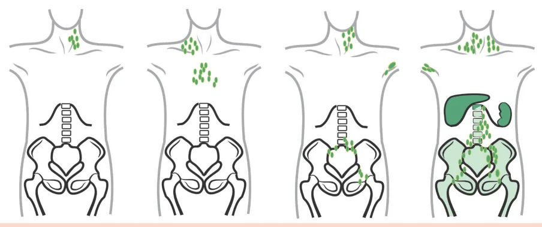

# Linfomas

<!-- page:1 -->

Linfomas (CM) Quando investigar linfonodomegalia? | > 1cm, especialmente se > 4 semanas. | Avaliar tamanho; localização; número;

mobilidade; consistência; sintomas B; quadros infecciosos associados; viagens recentes. Linfoma de Hodgkin

- Diagnóstico é com a biópsia EXCISIONAL do gânglio suspeito.

- Estadiamento Ann-Arbor/Lugano

- Anatomopatológico: Célula de Reed-Sternberg

(“olhos de coruja”)

- Clássico e não clássico.

- Acomete mais cadeias cervicais, supraclaviculares e axilares

- Pico bimodal (20 e 70 anos).

## PRINCIPAIS DIFERENÇAS ENTRE LH E LNH

Linfoma de Hodgkin Epidemiologia Incidência em pico bimodal Menos sintomas B Quadro Clínico Raramente desenvolvem Síndrome de Lise Tumoral Disseminação por contiguidad Início e com início de linfonodomegali disseminação supradiafragmática e/ou de mediastino Acometimento Acometimento extranodal é rar extranodal < 5% Baixa incidência de hepatoesplenomegalia Acometimento Acometimento raro de tecido nodal secundário linfóide associado a Mucosas e anel de Waldeyer Fatores de risco Associação frequente com HIV

## SISTEMA LINFÁTICO

- Responsável pela nossa defesa

## ÓRGÃOS LINFOIDES PRIMÁRIOS

- Timo

- Medula óssea - Fatores de risco: infecções virais (HIV, EBV, etc), imunossupressão crônica e doenças autoimunes

Linfoma Não Hodgkin

- É o subtipo mais comum dos linfomas!

- É dividido em células B (mais comum) e células T |

Agressivos e indolentes.

- Linfomas B: Agressivos: Linfoma difuso de grandes células B Linfoma de Burkitt Indolentes: Linfoma Folicular | Linfoma da Zona

Marginal | Linfoma Linfocítico

- Linfoma da zona do manto: pode ser indolente ou agressivo. Sua marca é a presença da t(11;14).

Linfomas Não Hodgkin Prevalência em indivíduos idosos (Mediana de idade ~55 anos) Sintomas B mais comuns, sobretudo em LNH Agressivos Se agressivos frequentemente desenvolvem Síndrome de Lise Tumoral, inclusive espontânea de, ia Disseminação hematogênica, sem predileção para acometimento nodal inicial ro Acometimento extranodal é frequente ~ 30% Maior incidência de hepatoesplenomegalia o Acometimento mais comum de tecido linfóide e associado a mucosas e anel de Waldeyer Associam-se com HIV:

V Linfoma Difuso de Células B, Linfoma Primário do Sist. Nervoso Central, Burkitt e outros tipos raros

## ÓRGÃOS LINFOIDES SECUNDÁRIOS

- Linfonodos

- Baço

- Tecido linfoide associado às mucosas Tonsilas palatinas Apêndice

---

<!-- page:2 -->

## INVESTIGAÇÃO DE

Neoplasias LINFONODOMEGALIA

- Metástases de neoplasias de órgãos sólidos

QUANDO: Outras

- Palpáveis (> 1cm)

- Doença Relacionada à IgG4 (DR-IgG4)

- Palpáveis (> 1cm)

- Sem causa óbvia aparente

- Devem SEMPRE ser investigados! Especialmente se excederem 3 semanas

- ANAMNESE

- Tamanho

- Volume

- Localização

- Número

- Associação com sintomas B

- Quadros infecciosos

- Viagens recentes

- ETIOLOGIAS

Infecções

- Bacterianas Estreptococose Doença da arranhadura do gato Difteria Doença de Lyme

- Viral HIV EBV (Epstein-Barr Vírus) HSV (Herpes simples vírus) CMV (citomegalovírus) HBV (vírus da hepatite B) Dengue

- Outras Micobacterioses Fungos (Histoplasmose, coccidioidomicose, criptococose) Protozoários (toxoplasma e leishmania)

amofniL Disseminação sequencial Hodgkin Cél. Reed-Sternberg Mais co Célula B Agress Não Hodgkin indol Célula T Figura 1: Fluxograma básico relacionado a classificação dos linfomas. - Doença Relacionada à IgG4 (DR-IgG4)

- Sarcoidose

- Amiloidose

- Histiocitose

- doença de Castleman

- LES, AR, doença de Still

## EPSTEIN-BARR VÍRUS (EBV)

- Vírus da família Herpesvírus

- Maioria das infecções primárias são subclínicas

- Cerca de 90 - 95% dos adultos no Brasil são soropositivos para EBV

- Mononucleose infecciosa (“Doença do Beijo”) Mal estar Cefaleia Febre Esplenomegalia Pode ocorrer ruptura esplênica Amigdalite Linfonodomegalia cervical dolorosa Linfocitose atípica

- Pode persistir assintomático durante toda a vida

- Oncovírus que aumenta risco de neoplasias devido inflamação crônica Linfoma de Burkitt Linfoma não Hodgkin em pacientes HIV+ Linfoma de Hodgkin Linfoma em pacientes pós transplante Carcinoma Nasofaríngeo Carcinoma gástrico Linfoma de células T células B omum! sivo vs lente

Difuso de grandes Agressivos Burkitt Linfoma de células Manto Folicular Linfoma Zona Indolentes Marginal Linfoma Linfocítico Linfoma de células Manto .

---

<!-- page:3 -->

## DIAGNÓSTICO

- Biópsia EXCISIONAL do gânglio

## ESTADIAMENTO

- Realizado através da classificação de AnnFigura 2: Células de Reed-Sternberg (olhos de coruja), que são patognomônicas de LH.Linfoma Não-Hodgkin (LNH)

## LINFOMA DE HODGKIN (LH)

- Representa cerca de 10% de todos os linfomas

- Geralmente se apresentam como linfonodomegalias dolorosas cervicais

- Sintomas B e prurido são frequentes Pode ocorrer também dor em região de linfonodo com ingestão de álcool (não tão frequente na prática clínica)

- Maioria dos pacientes são curados com quimioterapia (QT)

- Distribuição bimodal 1º pico: em torno dos 20 anos 2º pico: em torno dos 70 anos

- Neoplasia derivada de linfócitos B

- Célula maligna: Reed-Sternberg (olhos de coruja) Expressam CD30, CD15 e PAX-5

- Dividido em: Clássico (90% dos casos) Não clássico

- Verificar Figura 2

## FATORES DE RISCO CONHECIDOS

- Infecções virais HIV EBV

- Imunossupressão crônica

- Doenças autoimunes Essa classificação é utilizada para quase todos os linfomas Estágio I: 1 cadeia linfonodal acometida Estágio II: > 1 cadeia linfonodal acometida, mas ambas do mesmo lado do diafragma Estágio III: > 1 cadeia linfonodal acometida em lados diferentes do diafragma Estágio IV: Linfonodos e acometimento extra-nodal Fígado, Rim, pele, medula óssea

Figura 3: Estadiamento de Ann-Arbor/Lugano utilizado para Linfo - Realizado através da classificação de AnnArbor/Lugano

- Verificar Figura 3

## DIFUSO DE GRANDES CÉLULAS B (LNH DGCB)

- Forma mais comum (40% dos casos)

- Linfoma agressivo

- Idade média ao diagnóstico de 60 anos

- Tratamento com QT (R-CHOP em 6 ciclos) Rituximab Ciclofosfamida Doxorrubicina Vincristina Prednisona

- Escore prognóstico (IPI) Estádio ECOG DHL Idade Extranodal

## LINFOMA DE BURKITT

- Altamente agressivo

- Altíssimo turnover celular Muito associada com Síndrome de Lise tumoral espontânea

- Anatomopatológico descreve padrão de

“céu estrelado”

- Verificar Figura 4 na próxima página omas

---

<!-- page:4 -->

| Hb < 12 | LNM > 6 cm | B2 micro > LSN

- Tratamento apenas se sintomático (Watch and Wait)

- - - Figura 4: Anatomopatológico em aspecto de “céu estrelado” que representa a elevada taxa de replicação celular descrita no

Linfoma de Burkitt.

- Classicamente é dividido em 3 subtipos: Associado ao HIV Africana endêmica Esporádico

- Verificar Figura 5

## LINFOMA FOLICULAR

- Linfoma indolente L

- 2º subtipo de LNH mais comum

- Idade média ao diagnóstico de 65 anos

- Geralmente LNM indolores e massas abdominais Diagnóstico somente quando há alguma compressão

- 15% dos casos podem se transformar em linfomas agressivos

- Escore prognóstico é o FLIPI Idade > 60 anos Envolvimento MO ttikruB ed amofniL

Associado ao Dividido em 3 subtipos Africana endê Esporádic Figura 5: Classificação do Linfoma de Burkitt LINFOMA DE CÉLULAS DO MANTO

- Indolente ou agressivo

- Corresponde a cerca de 7% dos LNH

- Mais frequente em idosos e no sexo masculino

- Os pacientes geralmente apresentam doença em estágio avançado (70-80% dos casos)

- Forma leucêmica Linfocitose em sangue periférico Linfócitos pequenos expressando marcadores B com expressão de CD5+ Semelhante a leucemia linfocítica crônica (LLC)

- Marca da doença: t(11;14)

- Envolve o rearranjo de uma cadeia pesada de imunoglobulina e CCND1 (gene que codifica a ciclina D1)

- Superexpressão da ciclina D1 que gera a doença

## LNH DE ZONA MARGINAL

- Linfoma raro (< 1% dos linfomas indolentes)

- Esplenomegalia + Linfocitose

- MALT gástrico é o mais comum

- Geralmente relacionado com: H. pylori Hepatite C Tireoidite de Hashimoto Pneumopatia Intersticial

- Não tem marcadores específicos CD20 é expresso em todos os linfomas de células B o HIV 25% relacionado ao EBV êmica Mais comum em crianças co t(8;14)

100% associado ao EBV Massas na região da face 15 - 20% relacionados ao EBV Linfoma mais comum em crianças Massas abdominais

---

<!-- page:5 -->

## IMUNOHISTOQUÍMICA PARA LINFOPROLIFERAÇÕES B

Leucemia Linfocítica Crônica (LLC) Linfoma linfocítico de pequenas células CD5+ Linfoproliferação B (CD19, CD20, CD22, CD79a)

CD5Definição Anatomopatológica Linfoma Difuso de Grandes Células B Linfoma de Hodgkin Linfoma de Burkitt Figura 6.

## PRINCIPAIS EFEITOS COLATERAIS

## EM QUIMIOTERAPIA ANTRACÍCLICOS

- Doxorubicina, Daunorubicina e Idarubicina

- Cardiotoxicidade aguda ou crônica (>550mg/m2)

- Prevenção: Carvedilol e iECA em indivíduos de risco

- Tratamento: Manejo de insuficiência cardíaca

## AGENTES ALQUILANTES

- Mostardas nitrogenadas (“fosfamidas”)

- Hematotoxicidade

- Cistite hemorrágica

- Encefalopatia induzida por ifosfamida

## ALCALOIDES DA VINCA

- Vincristina, Vimblastina e Vinorelbina

- Neuropatia periférica

## CITARABINA

- Ceratite

- Neuropatia óptica

## BLEOMICINA

- Pneumotoxicidade (BOOP e pneumopatia intersticial) Linfoma de Células do Manto (LCM)

CD10+ Linfoma Folicular CD10- Linfomas Esplênicos

## CISPLATINA E OXALIPLATINA

- Ototoxicidade

## ANTI HER 2 (TRASTUZUMABE)

- Toxicidade cardíaca

- Reações infusionais

## ANTI CD20 (RITUXIMABE)

- Reações infusionais

- Hipogamaglobulinemia

## ASPARGINASE

- Manifestações hemorrágicas e trombóticas

## REFERÊNCIAS

Figura 2: Histopatologia de um paciente com Linfoma de Hodgkin (LH) em que foi evidenciada a presença das células de Reed-Sternberg, que são patognomônicas de LH.

Case courtesy of Henry Knipe, Radiopaedia.org, rID: 40775 Figura 4: Anatomopatológico em aspecto de “céu estrelado” que representa a elevada taxa de replicação celular descrita no Linfoma de Burkitt.

https://www.scielo.br/j/rbhh/a/rjg3xjn4Q9b4hcbgGnVpWhG
