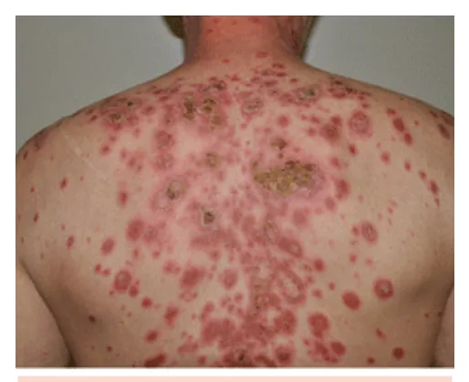
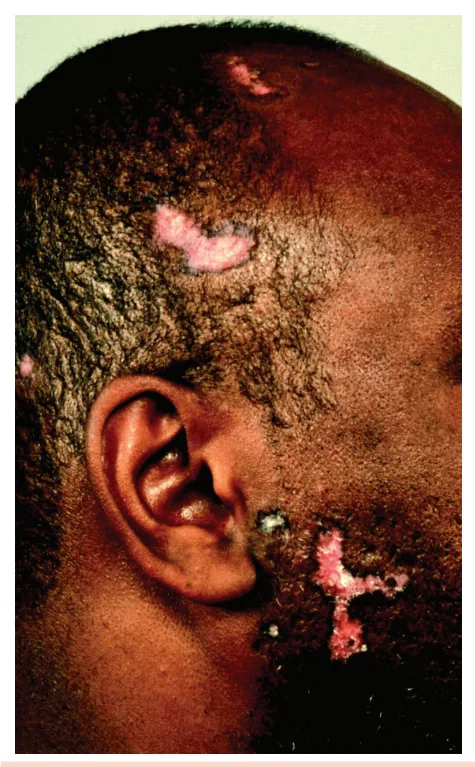
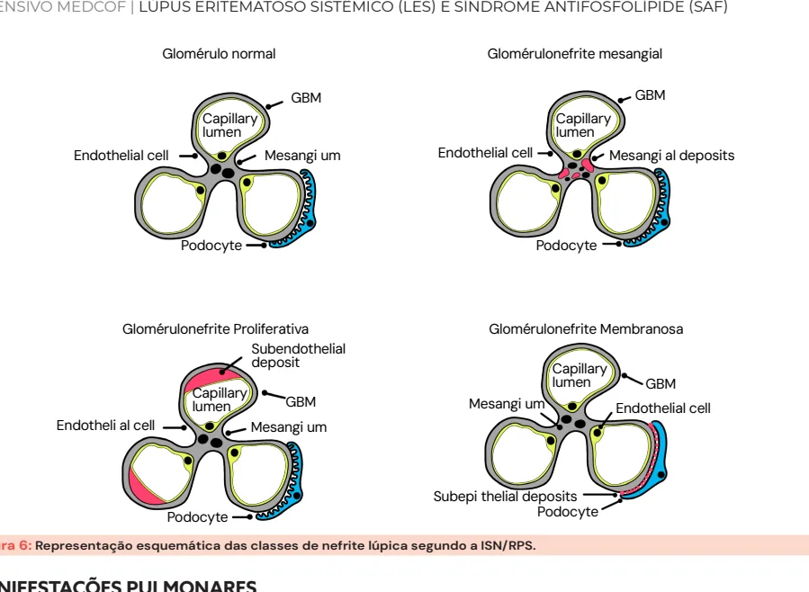

# Lúpus Eritematoso Sistêmico

<!-- page:1 -->

## LÚPUS ERITEMATOSO

## SISTÊMICO (LES) E SÍNDROME

## ANTIFOSFOLÍPIDE (SAF)

Lúpus (CM) LÚPUS ERITEMATOSO SISTÊMICO (LES) | Complemento (C3/C4) baixo: doença ativa;

- Protótipo de doença autoimune sistêmica | PCR elevado: infecção.

por imunocomplexos;

- Tratamento:

- Mulher (9:1), idade fértil; | Base: Fotoproteção, hidroxicloroquina (para

- Fatores genéticos (ex: TREX1, deficiência do todos, reduz recaídas e mortalidade);

complemento), hormonais (estrogênio), ambientais | Corticoide: fase ativa (reduzir dose (UV, tabaco, vírus); progressivamente e associar a poupadores);

- Cutâneo: | Metotrexato/azatioprina (formas Agudo: rash malar ou placas difusas (mais leves/moderadas); Subagudo: anular ou psoriasiforme (anti-Ro+); neurológicas, pulmonares); Crônicos/discóide: cicatricial, menos associado a | Biológicos: belimumabe, rituximabe, anifrolumabe

associado ao LES sistêmico); | Micofenolato/ciclofosfamida (renais, LES sistêmico. (casos refratários).

- Articular: poliartrite sem erosões e com

- LES induzido por drogas: anti-histona deformidades redutíveis (artropatia de Jaccoud); positivo e anti-dsDNA geralmente negativo.

- Hematológico: anemia (múltiplas causas, mais Medicações clássicas: procainamida, hidralazina, comum por doença crônica), leucopenia, linfopenia, isoniazida, anti-TNF.

plaquetopenia (pode preceder o LES); SÍNDROME ANTIFOSFOLÍPIDE (SAF)

- Renal:

- Trombofilia adquirida imunomediada, comum Nefrite lúpica; em jovens; Classes III e IV são graves, com risco

- Pode ser primária ou associada ao LES;

de injúria renal aguda (IRA) e exigem

- Trombose venosa, arterial ou microvascular e imunossupressão intensa. complicações gestacionais;

- Neuropsiquiátrico: psicose, convulsões, sempre

- Autoanticorpos: anticoagulante lúpico, excluir infecção/desordem metabólica antes; anticardiolipina, anti- 2GPI. Devem ser dosados 2

- Cardiopulmonar: pericardite e pleurite são as vezes com intervalo de ≥12 semanas;

β mais comuns;

- Tratamento: anticoagulação com varfarina (RNI 2–3

- Exames: ou 2,5–3,5). Evitar DOACs. FAN reagente em 99% (padrão nuclear é o

- Apenas evento gestacional: AAS + enoxaparina mais comum); profilática durante a gestação e puerpério. Anti-dsDNA e anti-Sm: específicos; Anti-Ro: cutâneo/subagudo e neonatal;

## (LES)

## INTRODUÇÃO

- Doença autoimune inflamatória crônica, multissistêmica, de curso flutuante;

- Caracteriza-se por fases de atividade e remissão;

- Maior protótipo de doença mediada por imunocomplexos;

- Ativação do sistema imune inato e adaptativo;

- Os autoanticorpos se ligam a antígenos próprios, formando imunocomplexos que se depositam nos tecidos (pele, rins, articulações, sistema nervoso central, etc.), levando à inflamação e dano orgânico;

- Pode mimetizar outras doenças, o que reforça a Figura 1: Imunocomplexos formados por autoanticorpos ligados importância do raciocínio clínico. a autoantígenos.

---

<!-- page:2 -->

## EPIDEMIOLOGIA

- Predomínio em mulheres jovens (9:1), em idade fértil;

- Maior gravidade em homens, afrodescendentes e hispânicos;

- Fatores de risco familiares: história de LES ou outras doenças autoimunes.

## FISIOPATOLOGIA

- Fatores genéticos: mutação do gene TREX1, deficiência de C1q e C4;

- A disfunção na depuração de restos apoptóticos pela via do complemento gera um excesso de autoantígenos, o que pode levar ao desenvolvimento de autoimunidade em pacientes Figura 2: Lúpus cutâneo agudo.

geneticamente predispostos;

- Fatores ambientais: radiação UV (pode deflagrar Rash malar poupando o sulco nasolabial.

atividade da doença), tabagismo, infecções Lúpus cutâneo subagudo (EBV, tuberculose);

- Associado ao LES em 30 a 40% dos casos;

- Fatores hormonais: estrogênio (justificando

- Fortemente relacionado ao autoanticorpo antimaior incidência na idade fértil e redução Ro (SSA);

após a menopausa).

- Fotossensível, com lesões predominando em áreas expostas ao sol;

## MANIFESTAÇÕES CLÍNICAS

- Principais apresentações:

Pode acometer qualquer sistema orgânico, com | Lesões papuloescamosas (semelhantes à apresentações variadas: psoríase, psoriasiforme);

- Sistêmicas (gerais): febre, fadiga, perda de peso, | Lesões anulares com bordas elevadas e centro adinamia, adenomegalia; claro (policíclico).

- Cutâneo-mucosas;

- Articulares;

- Hematológicas;

- Serosas;

- Renais;

- Neurológicas;

- Cardíacas;

- Pulmonares.

## MANIFESTAÇÕES CUTÂNEAS

- O acometimento cutâneo pode ocorrer de forma: Isolada, sem envolvimento de outros órgãos, sendo chamado de lúpus cutâneo, que pode ser: Agudo; Subagudo; Crônico (discoide). Associada a manifestações sistêmicas (articular, hematológica, renal, etc.), caracterizando quadro de Figura 3: Lúpus cutâneo subagudo.

lúpus eritematoso sistêmico (LES);

- As manifestações cutâneas ocorrem em 70 a 80% dos Padrão anular (policíclico) em tronco e pacientes com LES. membros superiores.

Lúpus cutâneo agudo Lúpus cutâneo crônico (discóide)

- Forma cutânea mais associada ao LES;

- Forma mais comum do lúpus cutâneo isolado;

- O envolvimento sistêmico ocorre em cerca de 90%

- Associado ao LES em apenas 5 a 18% dos casos;

dos pacientes;

- Pode deixar lesões cicatriciais irreversíveis;

- Principais apresentações:

- Acometimento típico da região suboccipital, Eritema malar: fotossensível, avermelhado, face e orelhas;

simétrico, poupa o sulco nasolabial;

- Características: Placas eritematosas: fotossensíveis, podem | Geralmente tem formato de disco (discóide);

apresentar descamação e prurido; podem | Placas eritemato-hipocrômicas, com envolver todo o corpo, especialmente em descamação aderente;

áreas fotoexpostas. | Destruição do folículo piloso e alopecia cicatricial.

---

<!-- page:3 -->

## MANIFESTAÇÕES NEUROPSIQUIÁTRICAS

- As manifestações neuropsiquiátricas do LES são variadas e complexas, podendo acometer o sistema nervoso central (SNC) e periférico;

Figura 4: Lúpus cutâneo discoide. Lesão discoide evoluindo com atrofia, hipocromia e alopecia. A hiperemia no fundo da lesão indica atividade inflamatória persistente.

## MANIFESTAÇÕES ARTICULARES

- Frequentes no LES (até 90% dos casos);

- Mnemônico NSTOP: N: poliartrite; S: simétrica; T: >6 semanas; O: com rigidez matinal prolongada; P: aditiva.

- Principal diagnóstico diferencial é com artrite reumatoide: No LES, não há erosões à radiografia; No LES, o desvio ulnar é redutível, por frouxidão ligamentar, e não por destruição articular (artropatia de Jaccoud).

Em casos raros, pode haver sobreposição entre LES e artrite reumatoide, com quadro erosivo típico da artrite reumatoide. A essa forma mista dá-se o nome de rhupus. Antes de atribuir os sintomas neurológicos ao LES, especialmente em quadros de SNC, é fundamental excluir causas infecciosas e metabólicas, especialmente em pacientes imunossuprimidos.

- Sistema nervoso central: Cefaleia; Convulsões; Distúrbios comportamentais (inclusive catatonia); Psicose (ocorre em até 10% dos casos).

- Sistema nervoso periférico: Polineuropatias sensitivo e/ou motora; Mononeurite múltipla; Neuropatia de fibras finas.

## MANIFESTAÇÕES HEMATOLÓGICAS

- Comuns no LES e podem, em alguns casos, anteceder o diagnóstico em anos

(especialmente a plaquetopenia);

- Principais achados: Leucopenia; Linfopenia; Plaquetopenia; Anemia hemolítica autoimune; Anemia de doença crônica.

A anemia no LES pode ter múltiplas causas, sendo a anemia da doença crônica a mais prevalente!

- Na investigação de anemia hemolítica encontramos: Bilirrubina indireta aumentada; LDH (ou DHL) aumentada; Haptoglobina diminuída ou indetectável;

- Para investigar se a anemia hemolítica é autoimune devemos solicitar o teste de Coombs direto: Identifica anticorpos ligados às hemácias; Se for positivo, o diagnóstico é de anemia hemolítica autoimune.

- Verificar Figura 5 na próxima página

## MANIFESTAÇÕES RENAIS

- A nefrite lúpica é a manifestação renal mais comum e ocorre em até 60% dos pacientes com LES;

a

- A biópsia renal é indicada se suspeita de nefrite lúpica;

- No entanto, não devemos esperar a biópsia renal para iniciar o tratamento se a suspeita for de nefrite lúpica;

- A classificação segue a ISN/RPS (Sociedade

Internacional de Nefrologia / Sociedade de Patologia Renal) e depende de biópsia renal:

---

<!-- page:4 -->

Teste positivo Soro de Coombs é adicionado (anti-lg humana) Amostra de sangue de um paciente com anemia hemolítica autoimune enterócitos sensibilizados.

Figura 5: Teste de Coombs direto. Tabela 1: Classificação da nefrite lúpica pela ISN/RPS. Classe Histologia Depósitos de imunocomplexos I Mesangial mínima sem hipercelularidad Mesangial Depósitos de imunocomplexos II proliferativa com hipercelularidad Focal (< 50% dos glomérulos) c III Proliferativa focal de imunocomplexos suben Difusa (> 50% dos glomérulos), IV Proliferativa difusa imunocomplexos subend V Membranosa Depósitos de imunocomplexos Esclerose VI Esclerose avançada (>90% dos glomerular

- Classes III e IV são as mais agressivas, com maior risco M de evolução para insuficiência renal e indicação de tratamento imunossupressor intensivo;

- Os depósitos imunes localizam-se em diferentes compartimentos glomerulares conforme a classe:

mesangial (classes I e II), subendotelial (classes III e IV) e subepitelial (classe V);

- A localização dos depósitos determina a apresentação clínica e a gravidade da lesão renal.

- Verificar Figura 6 na próxima página

- Antígenos na membrana de célula complexo antígeno-anticorpo) s mesangiais Assintomática ou hematúria de microscópica leve s mesangiais Proteinúria leve, hematúria, função renal de preservada com depósitos Hematúria, leucocitúria, proteinúria ndoteliais moderada, elevação de creatinina depósitos de nefrótica, síndrome nefrítica, injúria renal doteliais aguda s subepiteliais geralmente preservada no início s glomérulos) Insuficiência renal crônica irreversível

Antieritrócitos Anti-Ig humana Soro de Coombs Aglutinação (anti -|g + Achados laboratoriais Quadro grave: hematúria, proteinúria Proteinúria nefrótica, com função renal MANIFESTAÇÕES CARDÍACAS

- Pericardite: Mais comum das manifestações cardíacas no LES; Pode ser assintomática ou cursar com dor torácica pleurítica, atrito pericárdico e derrame pericárdico.

- Endocardite de Libman-Sacks: Endocardite não infecciosa, geralmente em valva mitral; Associada à presença de anticorpos antifosfolípides (SAF).

- Doença arterial coronariana precoce (por inflamação crônica e uso prolongado de corticoide).

---

<!-- page:5 -->

Glomérulo normal Glomérulonefrite mesangial GBM GBM Capillary Capillary lumen lumen lumen Endothelial cell Mesangi um Podocyte Glomérulonefrite Proliferativa Subendothelial deposit Capillary lumen GBM Endotheli al cell Mesangi um Podocyte Figura 6: Representação esquemática das classes de nefrite lúpi

## MANIFESTAÇÕES PULMONARES

- Pleurite: Manifestação pulmonar mais comum no LES; Dor torácica ventilatório-dependente e derrame pleural (geralmente exsudato bilateral).

- Hemorragia alveolar difusa Rara, mas potencialmente fatal; Pensar se houver queda de hemoglobina + dispneia

+ hemoptise + infiltrado alveolar bilateral. EXAMES LABORATORIAIS Autoanticorpos

- FAN (fator antinuclear): O padrão nuclear é o mais comum; Alta sensibilidade, 99% têm FAN positivo: ótimo valor preditivo negativo; FAN negativo praticamente exclui LES.

- Anti-dsDNA (dupla hélice): Alta especificidade; Correlação com atividade da doença, especialmente atividade renal (nefrite lúpica).

- Anti-Sm (anti-Smith): Alta especificidade; Não se correlaciona com atividade.

- Anti-P ribossomal: Associado à psicose lúpica.

- Anti-Ro (SSA) e anti-La (SSB): Associados à síndrome de Sjögren sobreposta, lúpus neonatal, bloqueio atrioventricular congênito e lúpus cutâneo subagudo.

Marcadores de atividade da doença

- Anti-dsDNA: aumentado em atividade;

- C3 e C4 (complemento): reduzidos na atividade (consumo); lumen lumen GBM ica segundo a ISN/RPS.

Endothelial cell Mesangi al deposits Podocyte Glomérulonefrite Membranosa Capillary Mesangi um Endothelial cell Subepi thelial deposits Podocyte

- VHS: pode elevar na atividade. Se valores muito elevados, pensar em infecção;

- PCR: não costuma elevar na atividade. Se elevado, pensar em infecção;

- P/C (relação proteína/creatinina em amostra de urina isolada): Estima a proteinúria em 24 horas; Útil para monitorar atividade renal; Se P/C alterada, recomenda-se confirmar com proteinúria de 24 horas.

CRITÉRIOS DE CLASSIFICAÇÃO Critérios classificatórios são diferentes de diagnósticos. Os critérios classificatórios são usados para incluir pacientes em estudos clínicos, com foco em alta especificidade.

- Critérios do ACR (Colégio Americano de

Reumatologia)/EULAR (Liga Europeia contra o Reumatismo) de 2019;

- Critério de entrada obrigatório: FAN ≥ 1:80;

- Adicionalmente, soma-se a pontuação obtida a partir de domínios clínicos e imunológicos;

- Só o critério de maior peso em cada domínio conta (evita somar múltiplos achados de um mesmo sistema).

- Verificar Tabela 2 na próxima página

---

<!-- page:6 -->

Tabela 2: Critérios de classificação para o LES ACR/EULAR 2019. Domínio clínico Critério Pontos Constitucional Feb Leu Hematológico Plaqu Anem Neuropsiquiátrico Mucocutâneo Lúpus cu Lúpus cu Derra Serosas Musculoesquelético Artrite com ≥2 art Proteinúria > 0,5g/2 Renal B Domínio imunológico Anticorpos antifosfolípides Anticardiolipina ou Complemento Anticorpos específicos An ≥10 pontos classificam como LES!

## TRATAMENTO

- Não farmacológico

- Fotoproteção (uso diário de filtro solar, com reaplicação ao longo do dia);

- Educação e adesão ao tratamento;

- Atividade física regular; bre inexplicada (>38,3°C) 2 ucopenia (<4000/mm³) 3 uetopenia (<100.000/mm³) 4 mia hemolítica autoimune 4 utâneo subagudo ou discoide 4 utâneo agudo (ex.: rash malar) 6 ame pleural ou pericárdico 5 ticulações dolorosas ou edemaciadas 6 u anti- 2GP1 ou anticoagulante lúpico 2 β nti-dsDNA ou anti-Sm 6

Delirium 2 Psicose 3 Convulsões 5 Alopecia não cicatricial 2 Úlceras orais 2 Pericardite aguda 6 24h ou relação P/C em urina isolada > 0,5 4 Biópsia classe II ou V 8 Biópsia classe III ou IV 10 Critério Pontos C3 ou C4 baixo 3 C3 e C4 baixos 4

- Cessar tabagismo;

- Avaliação e prevenção de osteoporose;

- Suporte multiprofissional (psicologia, nutrição, fisioterapia, etc.).

---

<!-- page:7 -->

Farmacológico

- Principais fármacos implicados:

- Hidroxicloroquina: | Procainamida; Indicação universal (todos os pacientes com LES); | Hidralazina; Reduz atividade da doença, número de | Isoniazida; Reduz risco de lúpus neonatal e de bloqueio | Anti-TNF (pode causar formas mais graves, com atrioventricular congênito em pacientes anti-Ro anti-dsDNA positivo e acometimento renal).

recaídas e mortalidade; | Metildopa; (SSA) positivo;

## SÍNDROME ANTIFOSFOLÍPIDE

| Melhora perfil glicêmico, lipídico e reduz

## risco trombótico. (SAF)

- Glicocorticóides: Usados nas fases agudas (doença ativa); INTRODUÇÃO Rápido controle da atividade de doença;

- Trombofilia adquirida imunomediada; Deve ser reduzido progressivamente;

- Predomínio dos 20 a 50 anos; Imunossupressores poupadores de corticoide

- Pode ser:

devem ser associados. | Primária: sem outra doença autoimune associada;

- Imunossupressores poupadores de corticoide: | Secundária: associa-se especialmente ao LES. Metotrexato: articular leve/moderado,

- Caracteriza-se por: Azatioprina: terapia de manutenção para diversos | Morbidade obstétrica (perdas fetais, pré-eclâmpsia acometimentos, permitido na gravidez; grave, etc.). Leflunomida: alternativa, mas menos usada no LES; Micofenolato de mofetila: primeira escolha SAF é uma importante causa de eventos trombóticos em nefrite lúpica e manutenção para diversos em jovens. E é uma das principais causas autoimunes acometimentos, especialmente se graves. de aborto recorrente! Ciclofosfamida: Uso na indução de quadros graves e com risco MANIFESTAÇÕES CLÍNICAS de vida (renal classe III/IV, neuropsiquiátrico,

quadro cutâneo; | Trombose (arterial e/ou venosa e/ou microvascular);

- Macrovasculares: Não usar na manutenção. miocárdio, trombose de outras artérias);

pulmonar grave); | Trombose arterial (ex.: AVC, AIT, infarto agudo do

- Imunobiológicos | Trombose venosa (ex.: trombose venosa profunda, Belimumabe: refratários, com recaídas frequentes trombose venosa cerebral).

e dificuldade de reduzir o corticoide. Utilizado na

- Microvasculares: Rituximabe: casos refratários, especialmente com | Hemorragia alveolar;

nefrite lúpica; | Nefropatia da SAF (microangiopatia renal); acometimento renal ou hematológico grave; | Hemorragia adrenal;

| Anifrolumabe: casos cutâneos refratários. | Livedo reticular e racemoso;

- Outros: | Vasculopatia livedoide; Talidomida: útil para lesões cutâneas | Doença miocárdica microvascular.

refratárias, utiliza-se com cautela por ter alto

- Valvopatia cardíaca: Endocardite de Libman-Sacks, diferencial com

potencial teratogênico. | Espessamento ou vegetação;

## LES INDUZIDO POR DROGAS

febre reumática.

- Hematológico:

- Ocorre quando uma medicação atua como | Plaquetopenia leve/moderada (20.000 a gatilho autoimune; 130.000/mm³).

- Quadro clínico geralmente leve, com predomínio de

- Obstétricas:

manifestações cutâneas, articulares e serosites; | >= 3 perdas embrionárias consecutivas com <

- Marcadores sorológicos típicos: 10 semanas; Anti-histona: presente em até 95% dos casos; | Perda fetal com ≥ 10 semanas; Anti-dsDNA geralmente negativo (exceto em casos | Pré-eclâmpsia grave <34 semanas, com ou sem induzidos por anti-TNF); morte fetal;

- Tratamento é a suspensão da medicação causadora | Insuficiência placentária grave <34 semanas, com

(geralmente leva à remissão completa); ou sem morte fetal.

- Verificar Figura 7 na próxima página

---

<!-- page:8 -->

Alargamento do TTPa (tempo de tromboplastina parcial ativado) é uma pista para a presença de anticorpos antifosfolípides!

## CRITÉRIOS DE CLASSIFICAÇÃO

- - - T

- Figura 7: Livedo reticular em paciente com SAF.

- P

- Figura 8: Livedo racemoso em paciente com SAF. H

- Diferentemente do livedo reticular, que costuma ser simétrico, em “rede” contínua fechada, o livedo racemoso é mais irregular e apresenta linhas em padrão de “rede” descontinuadas, com falhas e ramificações assimétricas. P

- EXAMES LABORATORIAIS

- Os autoanticorpos devem ser pesquisados 2 vezes, com intervalo ≥ 12 semanas entre as dosagens: Anticoagulante lúpico (mais relacionado à trombose); Anticardiolipina IgG/IgM; Anti- 2 glicoproteína I IgG/IgM.

- Critérios do ACR/EULAR de 2023;

- Critério de entrada obrigatório: apresentar ≥1 critério clínico e ≥1 critério laboratorial;

- O critério laboratorial deve ocorrer em até 3 anos após o evento clínico.

- Verificar Tabela 3 na próxima página

Paciente com evento trombótico

- Iniciar anticoagulação com heparina (não fracionada ou de baixo peso molecular);

- Após estabilização, fazer ponte para varfarina e manter a longo prazo: Manter RNI entre 2,0 – 3,0 para eventos venosos; Manter RNI entre 2,5 – 3,5 para eventos arteriais; Em casos de eventos recorrentes com RNI no alvo, pode-se aumentar o alvo de RNI (se o prévio for 2,0 a 3,0), associar AAS ou trocar a varfarina por enoxaparina.

- Evitar anticoagulantes orais diretos (DOACs) como rivaroxabana, apixabana, etc.; Associados a maior risco de recorrência trombótica, principalmente em pacientes de alto risco (tripla positividade e eventos arteriais).

Paciente sem evento trombótico

- Caso sem trombose prévia, mas com positividade persistente dos anticorpos: Avaliar o risco individual; Considerar AAS 100 mg/dia em pacientes com perfil de anticorpos de alto risco (ex.: anticoagulante lúpico positivo, tripla positividade) ou com elevado risco cardiovascular.

Hidroxicloroquina

- Indicação nos pacientes com LES associado;

- Pode ter efeito antitrombótico adicional;

- Pode ser associada à anticoagulação em casos refratários.

Pacientes com evento gestacional

- Mulheres que apresentaram apenas eventos gestacionais, sem eventos trombóticos prévios: AAS 100 mg/dia; Iniciar enoxaparina profilática (ex.:40 mg/dia) durante toda a gestação e manter até 6 semanas após o parto.

---

<!-- page:9 -->

Tabela 3: Critérios de classificação para a SAF ACR/EULAR 2023. Critério Clínico Pontuação Critério Laboratorial Pontuação Anticoagulante lúpico positivo uma Macrovascular arterial 4 pontos Macrovascular venoso 3 pontos Microvascular 5 pontos Obstétrico 4 pontos Acometimento valvar 4 pontos Hematológico (plaquetopenia) 2 pontos Classifica-se como SAF se ≥3 pontos nos domínios clínicos e ≥3 pontos nos domínios laboratoriais!

## REFERÊNCIAS

Figura 1: Imunocomplexos formados por autoanticorpos ligados a autoantígenos. Acervo Medcof. Figura 2: Lúpus cutâneo agudo.

PRIMARY CARE DIABETES SOCIETY – PCDS. Lupus erythematosus. London: PCDS, [2025?]. Disponível em: https://www.pcds.org.uk/clinical-guidance/ lupus-erythematosus. Acesso em: 17 jun. 2025.

Figura 3: Lúpus cutâneo subagudo. RESEARCHGATE. Typical lesions of subacute cutaneous lupus erythematosus with annular and polycyclic plaques. Disponível em: https:// www.researchgate.net/figure/Typical-lesions-of-subacute-cutaneouslupus-erythematosus-with-annular-and-polycyclic_fig11_318730703.

Acesso em: 17 jun. 2025. Figura 4: Lúpus cutâneo discoide. PANJWANI, Suresh. Early diagnosis and treatment of discoid lupus erythematosus. The Journal of the American Board of Family Medicine, [S.l.], v. 22, n. 2, p. 206–213, mar. 2009. DOI: https://doi.org/10.3122/ jabfm.2009.02.080075. Disponível em: https://www.jabfm.org/ content/22/2/206. Acesso em: 17 jun. 2025.

Figura 5: Teste de Coombs direto. Acervo Medcof. Tabela 1: Classificação da nefrite lúpica pela ISN/RPS.

Adaptado de SOARES, Maria Fernanda; TELLES, José Ederaldo Queiroz; MOURA, Luiz Antonio. Classificações da nefrite lúpica: metanálise e proposta atual da Sociedade Internacional de Nefrologia e da Sociedade de Patologia Renal. Brazilian Journal of Nephrology, São Paulo, v. 27, n. 3, p. 157–162, set. 2005. Disponível em: https://bjnephrology.org/wp-content/ uploads/2019/11/jbn_v27n3a09.pdf. Acesso em: 17 jun. 2025. Anticoagulante lúpico positivo uma 1 ponto única vez Anticoagulante lúpico persistente (2 ou mais dosagens com intervalo ≥ 12 5 pontos semanas)

Anticardiolipina IgM ou IgG (2 ou mais dosagens com intervalo ≥ 12 3 pontos semanas) Anti- 2-glicoproteína-1 IgG ou IgM (2 ou mais dosagens com intervalo ≥ 12 7 pontos β semanas)

Figura 6: Representação esquemática das classes de nefrite lúpica segundo a ISN/RPS. Acervo Medcof. Tabela 2: Critérios de classificação para o LES ACR/EULAR 2019.

Adaptado de ARINGER, Martin; COSTENBADER, Karen; DAIKH, David; BRINKS, Ralph; MOSCA, Marta; RAMSEY-GOLDMAN, Rosalind; SMOLEN, Josef S. 2019 European League Against Rheumatism/American College of Rheumatology classification criteria for systemic lupus erythematosus.

Arthritis & Rheumatology, [S.l.], v. 71, n. 9, p. 1400–1412, 6 ago. 2019. DOI: https://doi.org/10.1002/art.40930. Disponível em: https://acrjournals.

onlinelibrary.wiley.com/doi/10.1002/art.40930. Acesso em: 17 jun. 2025. Figura 7: Livedo reticular em paciente com SAF.

RESEARCHGATE. Clinical features of livedo reticularis in a patient with APS. Disponível em: https://www.researchgate.net/figure/Clinical-features-oflivedo-reticularis-in-a-patient-with-APS_fig1_257888754. Acesso em: 17 jun. 2025.

Figura 8: Livedo racemoso em paciente com SAF. / BILGIC, Asli; OZCOBANOGLOU, Salih; BOZCA, Burcin Cansu; ALPSOY, Erkan.

Livedoid vasculopathy: a multidisciplinary clinical approach to diagnosis and management. International Journal of Women’s Dermatology, [S.l.], v.

7, n. 5, p. 588–599, dez. 2021. Disponível em: https://www.sciencedirect. com/science/article/pii/S2352647521001064?via%3Dihub. Acesso em: 17 jun. 2025.

Tabela 3: Critérios de classificação para a SAF ACR/EULAR 2023. Adaptado de BARBHAIYA, Medha; ZUILY, Stéphane; NADEN, Ray; HENDRY, Alison; MANNEVILLE, Florian; AMIGO, Mary-Carmen; AMOURA, Zahir;

ANDRADE, Danieli; ANDREOLI, Laura; ARTIM-ESEN, Bahar; ATSUMI, Tatsuya; et al. 2023 ACR/EULAR antiphospholipid syndrome classification criteria.

Annals of the Rheumatic Diseases, [S.l.], v. 82, n. 10, p. 1258–1270, ago. 2023. DOI: https://doi.org/10.1002/art.42624. Disponível em: https://acrjournals.

onlinelibrary.wiley.com/doi/10.1002/art.42624. Acesso em: 17 jun. 2025. /
