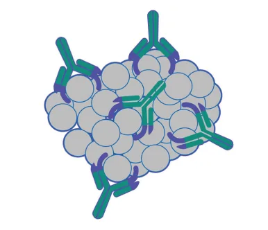
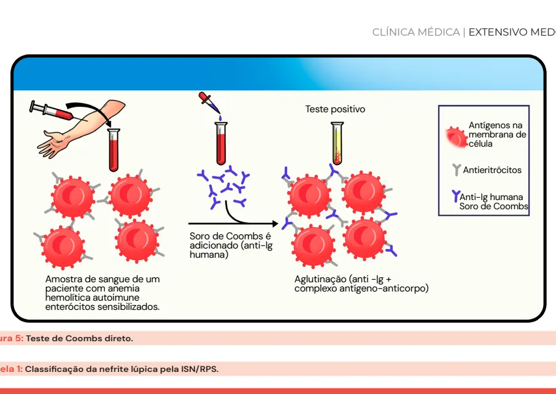
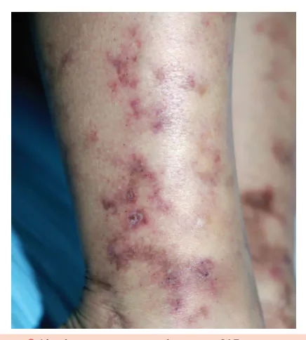

# Lúpus Eritematoso Sistêmico (LES) e Síndrome Antifosfolípide (SAF)

<!-- page:1 -->

## Lúpus Eritematoso Sistêmico (LES)

### Introdução

- **Protótipo de doença autoimune sistêmica** mediada por imunocomplexos
- **Doença autoimune inflamatória crônica**, multissistêmica, de curso flutuante
- Caracteriza-se por **fases de atividade e remissão**
- **Ativação do sistema imune inato e adaptativo**
- Os autoanticorpos se ligam a antígenos próprios, formando **imunocomplexos** que se depositam nos tecidos (pele, rins, articulações, sistema nervoso central, etc.), levando à inflamação e dano orgânico
- Pode mimetizar outras doenças, reforçando a importância do raciocínio clínico

Figura 1: Imunocomplexos formados por autoanticorpos ligados a autoantígenos.

### Epidemiologia

- **Predomínio em mulheres jovens**: 9:1
- **Idade fértil**
- **Maior gravidade** em homens, afrodescendentes e hispânicos
- **Fatores de risco familiares**: história de LES ou outras doenças autoimunes

### Fisiopatologia

- **Fatores genéticos**: mutação do gene **TREX1**, **deficiência de C1q e C4**
- A disfunção na depuração de restos apoptóticos pela via do complemento gera um **excesso de autoantígenos**, podendo levar ao desenvolvimento de autoimunidade em pacientes geneticamente predispostos
- **Fatores ambientais**: **radiação UV** (pode deflagrar atividade da doença), tabagismo, infecções (EBV, tuberculose)
- **Fatores hormonais**: estrogênio (justificando maior incidência na idade fértil e redução após a menopausa)

---

<!-- page:2 -->

## Manifestações Clínicas

Pode acometer qualquer sistema orgânico, com apresentações variadas:

### Sistêmicas (Gerais)

- Febre
- Fadiga
- Perda de peso
- Adinamia
- Adenomegalia

### Manifestações Cutâneas

**O acometimento cutâneo ocorre em 70-80% dos pacientes com LES.**

#### Lúpus Cutâneo Agudo

- Forma cutânea mais associada ao LES
- O envolvimento sistêmico ocorre em cerca de 90% dos pacientes
- **Principais apresentações**:
  - **Eritema malar**: fotossensível, avermelhado, simétrico, poupa o sulco nasolabial
  - **Placas eritematosas**: fotossensíveis, podem apresentar descamação e prurido; podem envolver todo o corpo, especialmente em áreas fotoexpostas

Figura 2: Lúpus cutâneo agudo. Rash malar poupando o sulco nasolabial.

#### Lúpus Cutâneo Subagudo

- Associado ao LES em 30-40% dos casos
- Fortemente relacionado ao autoanticorpo **anti-Ro (SSA)**
- Fotossensível, com lesões predominando em áreas expostas ao sol
- **Principais apresentações**:
  - Lesões papuloescamosas (semelhantes à psoríase)
  - Lesões anulares com bordas elevadas e centro claro (policíclico)

Figura 3: Lúpus cutâneo subagudo. Padrão anular (policíclico) em tronco e membros superiores.

#### Lúpus Cutâneo Crônico (Discóide)

- Forma mais comum do lúpus cutâneo isolado
- Associado ao LES em apenas 5-18% dos casos
- Pode deixar lesões cicatriciais irreversíveis
- **Acometimento típico**: região suboccipital, face e orelhas
- **Características**:
  - Placas eritemato-hipocrômicas, com descamação aderente
  - Destruição do folículo piloso e alopecia cicatricial
  - Formato de disco (discóide)

Figura 4: Lúpus cutâneo discoide. Lesão discoide evoluindo com atrofia, hipocromia e alopecia. A hiperemia no fundo da lesão indica atividade inflamatória persistente.

### Manifestações Articulares

- **Frequentes no LES**: até 90% dos casos
- **Mnemônico NSTOP**:
  - **N**: poliartrite
  - **S**: simétrica
  - **T**: > 6 semanas
  - **O**: com rigidez matinal prolongada
  - **P**: aditiva

- **Diagnóstico diferencial com artrite reumatoide**:
  - No LES: **não há erosões** à radiografia
  - No LES: o **desvio ulnar é redutível** (por frouxidão ligamentar), não por destruição articular — chamada **artropatia de Jaccoud**
  - Em casos raros: sobreposição entre LES e artrite reumatoide, com quadro erosivo típico da AR — denominado **"rhupus"**

### Manifestações Hematológicas

- **Comuns** no LES e podem, em alguns casos, **anteceder o diagnóstico em anos** (especialmente a plaquetopenia)
- **Principais achados**:
  - Leucopenia
  - Linfopenia
  - Plaquetopenia
  - Anemia hemolítica autoimune
  - Anemia de doença crônica

> Nota: A anemia no LES pode ter múltiplas causas, sendo a **anemia da doença crônica** a mais prevalente!

**Investigação de anemia hemolítica**:
- Bilirrubina indireta aumentada
- LDH (ou DHL) aumentada
- Haptoglobina diminuída ou indetectável
- **Teste de Coombs direto**: identifica anticorpos ligados às hemácias
  - Se positivo: diagnóstico de **anemia hemolítica autoimune**

Figura 5: Teste de Coombs direto.

### Manifestações Renais

- **Nefrite lúpica**: manifestação renal mais comum, ocorre em até 60% dos pacientes
- **Biópsia renal**: indicada se suspeita de nefrite lúpica
- **Não esperar a biópsia para iniciar tratamento** se a suspeita for de nefrite lúpica
- **Classificação ISN/RPS** (Sociedade Internacional de Nefrologia/Sociedade de Patologia Renal):

| Classe | Histologia | Depósitos de Imunocomplexos | Achados Clínicos |
|---|---|---|---|
| **I** | Mesangial mínima | Mesangiais | Assintomática ou hematúria microscópica leve |
| **II** | Mesangial proliferativa | Mesangiais | Proteinúria leve, hematúria, função renal preservada |
| **III** | Proliferativa focal (< 50% glomérulos) | Subendoteliais | Hematúria, leucocitúria, proteinúria moderada, elevação creatinina |
| **IV** | Proliferativa difusa (> 50% glomérulos) | Subendoteliais | Síndrome nefrítica, injúria renal aguda |
| **V** | Membranosa | Subepiteliais | Síndrome nefrótica, função renal geralmente preservada no início |
| **VI** | Esclerose glomerular avançada (> 90%) | — | Insuficiência renal crônica irreversível |

> Nota: **Classes III e IV são as mais agressivas**, com maior risco de evolução para insuficiência renal e indicação de tratamento imunossupressor intensivo.

Figura 6: Representação esquemática das classes de nefrite lúpica segundo a ISN/RPS.

### Manifestações Neuropsiquiátricas

Antes de atribuir sintomas neurológicos ao LES, especialmente em quadros de SNC, é fundamental **excluir causas infecciosas e metabólicas**, especialmente em pacientes imunossuprimidos.

**Sistema nervoso central**:
- Cefaleia
- Convulsões
- Distúrbios comportamentais (inclusive catatonia)
- Psicose (ocorre em até 10% dos casos)

**Sistema nervoso periférico**:
- Polineuropatias (sensitiva e/ou motora)
- Mononeurite múltipla
- Neuropatia de fibras finas

### Manifestações Cardíacas

- **Pericardite**: mais comum das manifestações cardíacas
  - Pode ser assintomática ou cursar com dor torácica pleurítica, atrito pericárdico e derrame pericárdico
- **Endocardite de Libman-Sacks**: endocardite não infecciosa, geralmente em valva mitral
  - Associada à presença de anticorpos antifosfolípides (SAF)
- **Doença arterial coronariana precoce**: por inflamação crônica e uso prolongado de corticoide

### Manifestações Pulmonares

- **Pleurite**: manifestação pulmonar mais comum no LES
  - Dor torácica ventilatório-dependente e derrame pleural (geralmente exsudato bilateral)
- **Hemorragia alveolar difusa**: rara, mas potencialmente fatal
  - Pensar se houver: queda de hemoglobina + dispneia + hemoptise + infiltrado alveolar bilateral

---

<!-- page:3 -->

## Exames Laboratoriais

### Autoanticorpos

- **FAN** (fator antinuclear):
  - **Padrão nuclear** é o mais comum
  - **Alta sensibilidade**: 99% têm FAN positivo — ótimo valor preditivo negativo
  - **FAN negativo** praticamente exclui LES

- **Anti-dsDNA** (dupla hélice):
  - **Alta especificidade**
  - **Correlação com atividade da doença**, especialmente atividade renal (nefrite lúpica)

- **Anti-Sm** (anti-Smith):
  - **Alta especificidade**
  - Não se correlaciona com atividade

- **Anti-P ribossomal**:
  - Associado à **psicose lúpica**

- **Anti-Ro (SSA) e anti-La (SSB)**:
  - Associados a síndrome de Sjögren sobreposta
  - **Lúpus neonatal**
  - **Bloqueio atrioventricular congênito**
  - **Lúpus cutâneo subagudo**

### Marcadores de Atividade da Doença

- **Anti-dsDNA**: aumentado em atividade
- **C3 e C4** (complemento): reduzidos na atividade (consumo)
- **VHS**: pode elevar na atividade; se muito elevado, pensar em infecção
- **PCR**: não costuma elevar na atividade; se elevado, pensar em infecção
- **P/C** (relação proteína/creatinina em amostra de urina isolada): estima a proteinúria em 24 horas
  - Útil para monitorar atividade renal
  - Se alterada, recomenda-se confirmar com proteinúria de 24 horas

---

## Critérios de Classificação (ACR/EULAR 2019)

> Critérios classificatórios são diferentes de diagnósticos. Os critérios classificatórios são usados para incluir pacientes em estudos clínicos, com foco em alta especificidade.

**Critério de entrada obrigatório**: **FAN ≥ 1:80**

**≥ 10 pontos classificam como LES!**

**Regra importante**: Só o critério de maior peso em cada domínio conta (evita somar múltiplos achados de um mesmo sistema).

| Domínio Clínico | Critério | Pontos |
|---|---|---|
| **Constitucional** | Febre > 38,3°C | 2 |
| **Hematológico** | Leucopenia (< 4.000/mm³) | 3 |
| | Plaquetopenia (< 100.000/mm³) | 4 |
| | Anemia hemolítica autoimune | 4 |
| **Neuropsiquiátrico** | Delirium | 2 |
| | Psicose | 3 |
| | Convulsões | 5 |
| **Mucocutâneo** | Lúpus cutâneo subagudo ou discoide | 4 |
| | Lúpus cutâneo agudo (ex.: rash malar) | 6 |
| | Alopecia não cicatricial | 2 |
| | Úlceras orais | 2 |
| **Serosas** | Derrame pleural ou pericárdico | 5 |
| | Pericardite aguda | 6 |
| **Musculoesquelético** | Artrite com ≥ 2 articulações dolorosas/edemaciadas | 6 |
| **Renal** | Proteinúria > 0,5g/24h ou P/C > 0,5 em urina isolada | 4 |
| | Biópsia classe II ou V | 8 |
| | Biópsia classe III ou IV | 10 |

| Domínio Imunológico | Critério | Pontos |
|---|---|---|
| **Anticorpos antifosfolípides** | Anticardiolipina ou anti-β2GP1 ou anticoagulante lúpico | 2 |
| **Anticorpos específicos** | Anti-dsDNA ou anti-Sm | 6 |
| **Complemento** | C3 ou C4 baixo | 3 |
| | C3 e C4 baixos | 4 |

---

## Tratamento

### Não Farmacológico

- **Fotoproteção**: uso diário de filtro solar, com reaplicação ao longo do dia
- **Educação e adesão** ao tratamento
- **Atividade física** regular
- **Cessar tabagismo**
- **Avaliação e prevenção** de osteoporose
- **Suporte multiprofissional**: psicologia, nutrição, fisioterapia, etc.

### Farmacológico

#### Base do Tratamento

- **Hidroxicloroquina**:
  - **Indicação universal** (todos os pacientes com LES)
  - Reduz atividade da doença, número de recaídas e mortalidade
  - Reduz risco de **lúpus neonatal** e **bloqueio atrioventricular congênito** (em pacientes anti-Ro positivo)
  - Melhora perfil glicêmico, lipídico e reduz risco trombótico

#### Glicocorticóides

- Usados **nas fases agudas** (doença ativa)
- Rápido controle da atividade de doença
- **Deve ser reduzido progressivamente**
- Imunossupressores poupadores de corticoide devem ser associados

#### Imunossupressores Poupadores de Corticoide

- **Metotrexato**: articular leve/moderado
- **Azatioprina**: terapia de manutenção para diversos acometimentos; permitido na gravidez
- **Leflunomida**: alternativa, menos usada no LES
- **Micofenolato de mofetila**: primeira escolha em nefrite lúpica e manutenção para diversos acometimentos (especialmente graves)
- **Ciclofosfamida**: indução em quadros graves e com risco de vida (renal classe III/IV, neuropsiquiátrico, pulmonar grave); não usar na manutenção

#### Imunobiológicos

- **Belimumabe**: casos refratários, com recaídas frequentes e dificuldade de reduzir corticoide
- **Rituximabe**: casos refratários, especialmente com acometimento renal ou hematológico grave
- **Anifrolumabe**: casos cutâneos refratários

#### Outros

- **Talidomida**: útil para lesões cutâneas refratárias; usar com cautela por alto potencial teratogênico

#### LES Induzido por Drogas

- Ocorre quando uma medicação atua como gatilho autoimune
- Quadro clínico geralmente leve, predomínio de manifestações cutâneas, articulares e serosites
- **Marcadores sorológicos típicos**:
  - **Anti-histona**: presente em até 95% dos casos
  - **Anti-dsDNA**: geralmente negativo (exceto em casos induzidos por anti-TNF)
- **Tratamento**: suspensão da medicação causadora (geralmente leva à remissão completa)

**Medicações clássicas**:
- Procainamida
- Hidralazina
- Isoniazida
- Anti-TNF

---

<!-- page:4 -->

## Síndrome Antifosfolípide (SAF)

### Introdução

- **Trombofilia adquirida imunomediada**
- **Predomínio**: 20-50 anos
- **Pode ser**:
  - **Primária**: sem outra doença autoimune associada
  - **Secundária**: associa-se especialmente ao LES
- Caracteriza-se por **morbidade obstétrica** (perdas fetais, pré-eclâmpsia grave, etc.)

> Importante: SAF é uma **importante causa de eventos trombóticos em jovens** e uma das **principais causas autoimunes de aborto recorrente**!

### Manifestações Clínicas

#### Macrovasculares

- **Trombose arterial**: AVC, AIT, infarto agudo do miocárdio, trombose de outras artérias
- **Trombose venosa**: trombose venosa profunda, trombose venosa cerebral

#### Microvasculares

- Hemorragia alveolar
- Nefropatia da SAF (microangiopatia renal)
- Hemorragia adrenal
- Livedo reticular e racemoso
- Vasculopatia livedoide
- Doença miocárdica microvascular

#### Valvopatia Cardíaca

- Endocardite de Libman-Sacks (espessamento ou vegetação)
- Diferencial com febre reumática

#### Hematológico

- Plaquetopenia leve/moderada (20.000-130.000/mm³)

#### Obstétricas

- ≥ 3 perdas embrionárias consecutivas com < 10 semanas
- Perda fetal com ≥ 10 semanas
- Pré-eclâmpsia grave < 34 semanas, com ou sem morte fetal
- Insuficiência placentária grave < 34 semanas, com ou sem morte fetal

### Exames Laboratoriais

Os autoanticorpos devem ser pesquisados **2 vezes, com intervalo ≥ 12 semanas** entre as dosagens:

- **Anticoagulante lúpico** (mais relacionado à trombose)
- **Anticardiolipina** IgG/IgM
- **Anti-β2 glicoproteína I** IgG/IgM

> Nota: **Alargamento do TTPa** (tempo de tromboplastina parcial ativado) é uma pista para a presença de anticorpos antifosfolípides!

Figura 7: Livedo reticular em paciente com SAF.

Figura 8: Livedo racemoso em paciente com SAF. Diferentemente do livedo reticular (simétrico, em "rede" contínua fechada), o livedo racemoso é mais irregular com linhas em padrão de "rede" descontinuadas, falhas e ramificações assimétricas.

### Critérios de Classificação (ACR/EULAR 2023)

**Critério de entrada obrigatório**: apresentar **≥ 1 critério clínico e ≥ 1 critério laboratorial**

O critério laboratorial deve ocorrer em até **3 anos após o evento clínico**.

**≥ 3 pontos clínicos E ≥ 3 pontos laboratoriais classificam como SAF!**

| Critério Clínico | Pontuação |
|---|---|
| Macrovascular arterial | 4 |
| Macrovascular venoso | 3 |
| Microvascular | 5 |
| Obstétrico | 4 |
| Acometimento valvar | 4 |
| Hematológico (plaquetopenia) | 2 |

| Critério Laboratorial | Pontuação |
|---|---|
| Anticoagulante lúpico positivo (única vez) | 1 |
| Anticoagulante lúpico persistente (2+ dosagens com intervalo ≥ 12 semanas) | 5 |
| Anticardiolipina IgM ou IgG (2+ dosagens com intervalo ≥ 12 semanas) | 3 |
| Anti-β2 glicoproteína I IgG ou IgM (2+ dosagens com intervalo ≥ 12 semanas) | 7 |

### Tratamento

#### Paciente com Evento Trombótico

1. **Iniciar anticoagulação** com heparina (não fracionada ou de baixo peso molecular)
2. **Após estabilização**, fazer ponte para varfarina e manter a longo prazo:
   - RNI 2,0-3,0 para eventos venosos
   - RNI 2,5-3,5 para eventos arteriais
3. Em casos de **eventos recorrentes com RNI no alvo**:
   - Aumentar o alvo de RNI (se prévio for 2,0-3,0)
   - Ou associar AAS
   - Ou trocar varfarina por enoxaparina
4. **Evitar DOACs** (rivaroxabana, apixabana, etc.)
   - Associados a maior risco de recorrência trombótica, principalmente em pacientes de alto risco (tripla positividade e eventos arteriais)

#### Paciente Sem Evento Trombótico

- Caso sem trombose prévia, mas com positividade persistente dos anticorpos:
  - **Avaliar o risco individual**
  - **Considerar AAS 100 mg/dia** em pacientes com:
    - Perfil de anticorpos de alto risco (ex.: anticoagulante lúpico positivo, tripla positividade)
    - Ou elevado risco cardiovascular

#### Hidroxicloroquina

- **Indicação** em pacientes com LES associado
- Pode ter **efeito antitrombótico adicional**
- Pode ser associada à anticoagulação em casos refratários

#### Pacientes com Evento Gestacional Apenas

- Mulheres que apresentaram apenas eventos gestacionais, sem eventos trombóticos prévios:
  - **AAS 100 mg/dia**
  - **Enoxaparina profilática** (ex.: 40 mg/dia) durante toda a gestação e manter até 6 semanas após parto

---

## Referências

[Referências as constam no original, mantidas para rastreabilidade]

