# Mecanismo e Assistência Ao Parto

<!-- page:1 -->

## MECANISMO E ASSISTÊNCIA

## AO PARTO

Assistência ao parto Mecanismos de parto MECANISMO DE PARTO

- Taquitócico:

- Insinuação: passagem do maior diâmetro da | Tempo total entre dilatação e o parto de até 4h.

apresentação pelo estreito superior da bacia

- 2º Período (Expulsivo):

(ponto de referência ósseo atinge o plano 0 | Posição de conforto; de DeLee); | Puxos espontâneos;

- Descida: passagem da apresentação fetal do | Compressas mornas;

estreito superior para o estreito inferior da | BCF 15/15’ ou 5/5’. bacia obstétrica;

- Expulsivo Prolongado:

- Rotação Interna: a apresentação fetal vai girar | >2h em nulípara / >1h em multípara (a analgesia com intuito de se adaptar ao formato da pelve, permite aumentar 1h esse tempo).

facilitando a passagem:

- Parada 2ª Descida: Em apresentações cefálicas fletidas, a cabeça | Mesma altura após 2 toques com intervalo de 1h.

tende a girar para occípto-púbico (OP).

- 3º Período (Dequitação):

- Desprendimento cefálico: a cabeça do feto se | Ocitocina 10UI IM;

flexiona e se fixa à região subpúbica e, depois, sofre | Tração cordão controlada; a deflexão a fim de se desprender; | Clampeamento oportuno.

- Rotação Externa (Restituição): a cabeça retorna à

- 4º Período (Greenberg):

posição que estava dentro da barriga; | Sinais vitais;

- Desprendimento do ovoide córmico: ombros e | Avaliação perineal;

restante do corpo saem pelo canal vaginal. | Observação ativa da equipe. Assistência ao Parto e Distócias FÓRCEPS

- 1º Período (Dilatação):

- Critérios de Aplicabilidade: Partograma (ativa); | Feto vivo; BCF 30/30’ ou 15/15’; | Bolsa rota; Dinâmica Uterina 1/1h; | Dilatação completa; Toque vaginal até de 4/4h. | Ausência de desproporção cefalopélvica;

- Fase Ativa Prolongada: | Saber variedade de posição; Dilatação progressiva <1cm/h. | Ideal +2/+3 de DeLee.

- Parada 2ª Dilatação: Mesma dilatação ≥ 2h e fase ativa do TP.

Distócia de Ombros: A Ajuda: Avisar paciente e chamar equipe L Levantar perna: McRoberts E Externa: Rubin I E Episiotomia: Considerar episiotomia R Remover: braço posterior Jacquemier Toque: para manobras internas: Rubin II, Woods, Woods reverso A Alterar posição: Gaskin

---

<!-- page:2 -->

## ESTUDO DO MOTOR

Tipo B (Braxton Hicks)

- Início após 28 semanas;

## CONTRATILIDADE UTERINA

- 10 a 20 mmHg;

- O útero apresenta vários tipos de contrações, que vão

- Difusão parcial ou total pelo útero;

variando em frequência e intensidade no decorrer da

- Mais frequentes perto do parto.

gestação, parto e puerpério. Trabalho de Parto (TP) Tipo A z ≥2 contrações em 10 minutos;

- Alta frequência e baixa amplitude;

- 20 a 50mmHg.

- 2 a 4mmHg; Puerpério

- Localizadas;

- Dequitação;

- Frequência de 1 contração/min.

- Contrações mais fracas e irregulares.

Figura 1: Tipos de contração uterina ao longo da gestação, parto e puerpério. TÔNUS UTERINO Tríplice Gradiente Descendente Normal

- Contrações se iniciam no fundo uterino e se propagam

- Até 10 mmHg é indolor e pouco perceptível ao toque. para o colo uterino.

Hipertonia

- >30mmHg é doloroso; Taquissistolia: ≥6 contrações em 10min.

- Pode mascarar as contrações;

- Causas: descolamento prematuro de placenta (DPP),

- Verificar Figura 2 na próxima página.

uso de uterotônicos (ex: ocitocina) etc.

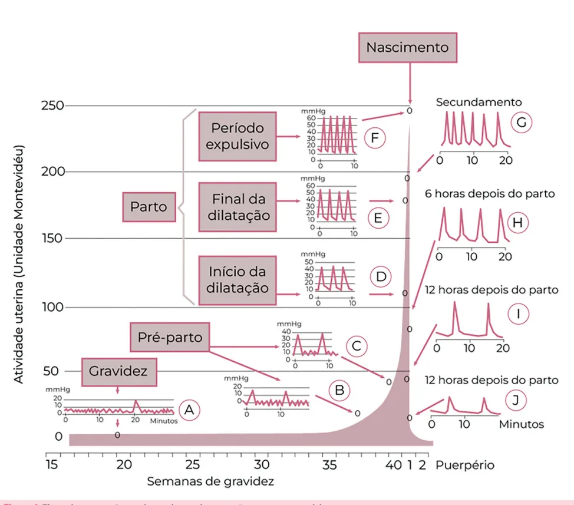

---

<!-- page:3 -->

Figura 2: Difusão completa das contrações uterinas.

## MECANISMO DE PARTO

- O estudo do mecanismo de parto tem por objetivo avaliar a evolução (dinâmica) fisiológica de um TP;

- Os passos do mecanismo de parto vão ocorrendo de forma simultânea, tendo sua divisão meramente didática.

Insinuação

- Ocorre quando há a passagem do maior diâmetro da apresentação (polo cefálico ou pélvico) pelo estreito superior da bacia: Apresentação cefálica: diâmetro biparietal; Apresentação pélvica: diâmetro bitrocantérico.

- Diagnosticado pelo toque vaginal: ponto de referência Figura 3: Rotação interna com mudança da variedade de ósseo fetal atingiu o plano 0 de De Lee (ou terceiro posição, durante o trabalho de parto. A: variedade occípitoplano de Hodge). direita-posterior (ODP); B: variedade occípito-direita-transverso

Descida (ODT); C: variedade occípito-direita-anterior (ODA); D: variedade

- É entendido como a passagem da apresentação occípito-púbica (OP).

fetal do estreito superior para o estreito inferior da bacia obstétrica; Desprendimento Cefálico

- Nesse momento pode haver assinclitismo anterior,

- A cabeça do feto se flexiona e se fixa à região posterior ou sinclitismo. subpúbica (hipomóclio) para, depois, sofrer a deflexão

Rotação Interna a fim de se desprender.

- A apresentação fetal vai girar com intuito de se Rotação Externa (Restituição) adaptar ao formato da pelve, facilitando a passagem;

- A cabeça (porção occipital) retorna à sua posição

- Em apresentações cefálicas fletidas (as mais comuns), que estava dentro da barriga, enquanto os ombros se o feto tende a girar para alcançar a variedade preparam para sair. Em alguns casos, o feto pode girar até atingir a

occípito-púbica (OP), girando até 135º: Desprendimento do Ovoide Córmico

- Ombros e restante do corpo saem pelo canal vaginal;

variedade occípito-sacro (OS), porém são eventos

- Verificar Figura 4 na próxima página.

mais raros.

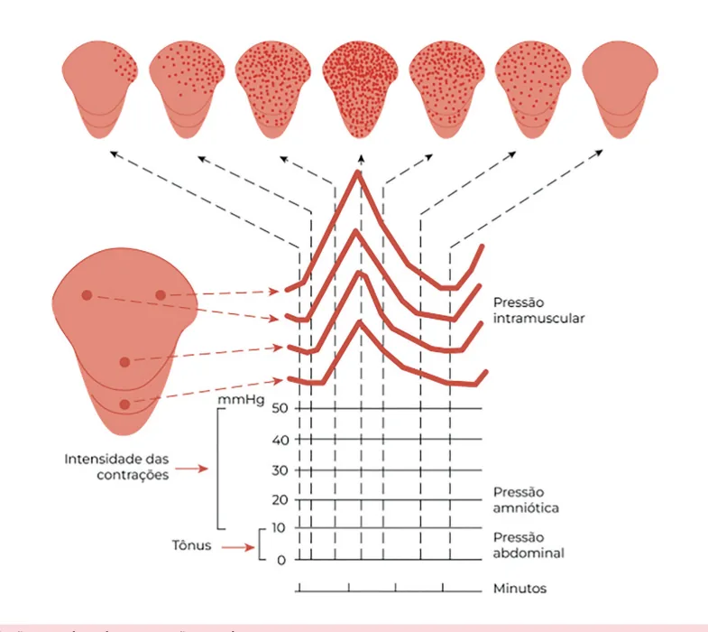

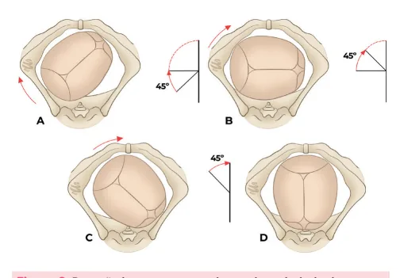

---

<!-- page:4 -->

Figura 4: Etapas do mecanismo de parto.

## FASES CLÍNICAS DO PARTO (E DA

## GESTAÇÃO)

- O trabalho de parto corresponde ao momento de dilatação cervical para expulsão do feto. Os processos envolvidos nesse momento podem ser divididos em 04 fases: quiescência, ativação, estimulação e involução;

- Verificar Figura 5 .

## PERÍODOS DO PARTO

## 1º PERÍODO – DILATAÇÃO

- Marca o início do trabalho de parto e finaliza com os

10cm de dilatação;

- Primíparas: colo esvaece e depois dilata;

- Multíparas: esvaecimento e dilatação do colo ocorrem de maneira concomitante.

Fase Latente

- Poucas contrações dolorosas;

- Dilatação de até 4cm.

Fase Ativa (TP estabelecido)

- Contrações regulares: 3-4 em 10 min;

- Dilatação estável, aproximadamente, 1cm/h; 3

- Primíparas → duração média de 8h / Multíparas → duração média de 5h.

## 2º PERÍODO - EXPULSIVO 4

- Dilatação total até saída do bebê;

- 3-5 contrações em 10 min;

• Fase 2 • Ativação • Preparação para o TP Fase 1 Braxton-Hicks 6 a 8 Quiescência semanas antes do parto Útero pouco responsivo Contrações tipos A e B Figura 5: Características das fases clínicas da gestação e do parto.

Figura 6: Modificações do colo uterino durante o trabalho de parto. A: nulípara; B: multípara.

- Primíparas: tempo médio de 0,5–2,5 horas sem peridural e 1–3 horas com peridural;

- Multíparas: tempo médio de até 1 hora sem peridural e

2 horas com peridural. 3º PERÍODO - DEQUITAÇÃO

- Finaliza com a saída da placenta;

- Tempo fisiológico de 30 min.

## 4º PERÍODO - GREENBERG

- Expulsão da placenta até 1h após o parto;

- Observação de hemorragia pós-parto.

Fase 4 Involução Retorno do útero ao Fase 3 estadopré-gravídico Estimulação Trabalho de Parto

- Dilatação

- Expulsão

- Dequitação

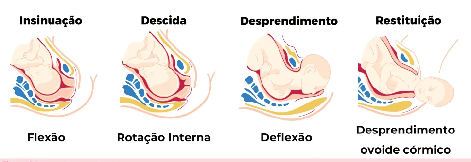

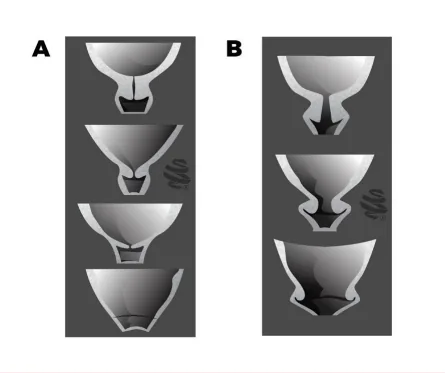

---

<!-- page:5 -->

## ASSISTÊNCIA AO TRABALHO DE COMO PREENCHER PARTO

- Na parte da dilatação, pode-se marcar com um triângulo (ou um “X”) a dilatação correspondente;

- Traça-se uma linha de alerta na hora imediatamente

Fazer seguinte à dilatação assinalada e uma linha de ação

- Abrir o partograma: abrir na fase ativa; 04h após a linha de alerta;

- Livre deambulação;

- Desenha-se um círculo no quadrado correspondente à

- Dieta leve; altura de apresentação observada;

- Analgesia sob demanda;

- Ausculta cardíaca fetal 30/30’ (pacientes de risco

## DISTÓCIAS E CORREÇÕES

habitual) ou 15/15’ (pacientes de alto risco);

- Dinâmica uterina 1/1h;

- Toque vaginal até de 4/4h. FASE ATIVA PROLONGADA (DISTÓCIA

Não Fazer FUNCIONAL)

- Depilação de rotina;

- Dilatação ocorre lentamente, com velocidade <1cm/h;

- Enema;

- A principal causa são contrações uterinas ineficazes.

- Pelvimetria clínica (esperar prova de TP); Condutas possíveis

- Cardiotocografia (CTB) contínua.

- Ocitocina;

- Rotura de membranas;

## 2º PERÍODO – EXPULSIVO

- Deambulação;

Fazer

- Analgesia.

- Posição de conforto;

- Verificar Figura 8 na próxima página.

- Puxos espontâneos;

- Compressas mornas; Se após 4h do início da ocitocina, não houver ≥2cm

- Ausculta cardíaca fetal 15/15’ (risco habitual) ou de dilatação, deve-se considerar mudança de via

5/5’ (alto risco). de parto. Não Fazer

- Ocitocina de rotina;

- Puxos dirigidos;

- Kristeller;

- Massagem perineal.

A ausculta dos batimentos cardíacos fetais deve ser realizada antes, durante e depois de uma contração uterina.

## 3º PERÍODO – DEQUITAÇÃO

Fazer

- Ocitocina 10UI IM;

- Tração controlada do cordão;

- Clampeamento oportuno (1-3min).

Não Fazer:

- Tração exagerada;

- Expressão de coágulos.

Fazer

- Sinais vitais;

- Avaliação perineal;

- Observação ativa pela equipe.

## PARTOGRAMA

- Representação gráfica da evolução do trabalho de parto, para diagnóstico de normalidade e de seus Figura 7: Modelo de ficha com partograma com registros de desvios (distócias). interesse no acompanhamento do trabalho de parto.

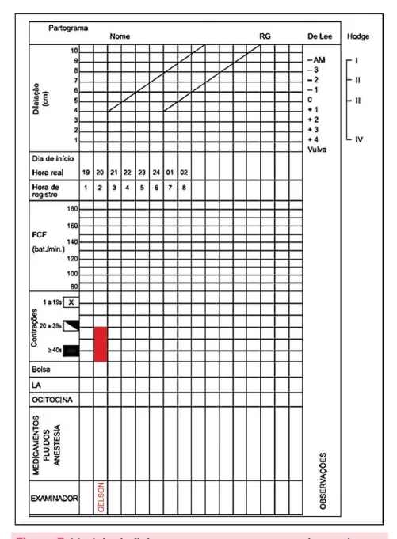

---

<!-- page:6 -->

A DCP absoluta é sempre indicação de parto cesáreo; porém, na relativa, podem ser tomadas medidas clínicas e, na refratariedade, a cesárea está indicada.

## PARTO TAQUITÓCICO (PRECIPITADO)

- C

- - Figura 8: Partograma representativo de fase ativa prolongada.

## PARADA SECUNDÁRIA DE DILATAÇÃO

- Mesma dilatação ≥ 2h e fase ativa do TP;

- A principal causa é desproporção cefalopélvica

(DCP) relativa ou absoluta. Condutas possíveis

- Analgesia;

- Rotura de Membranas;

- Deambulação;

- Mudança de decúbito.

- C

- - - Figura 9: Partograma representativo de parada secundária de dilatação.

- O tempo entre o período de dilatação até o parto é de até 4h;

- Pode ocorrer espontaneamente (multíparas) ou de forma iatrogênica (ocitocina).

Condutas possíveis

- Suspender ocitocina;

- Hidratação;

- Revisão cuidadosa do canal de parto pelo risco de laceração perineal.

Figura 10: Partograma representativo de parto taquitócico.

## PERÍODO EXPULSIVO PROLONGADO

- Descida ocorre lentamente, após dilatação total: 2h em nulíparas; >1h em multíparas.

Se paciente sob analgesia, pode-se prolongar em 01h.

- A principal causa é atividade uterina ineficiente.

Condutas possíveis

- Ocitocina;

- Rotura de Membranas;

- Mudança de decúbito;

- Fórceps.

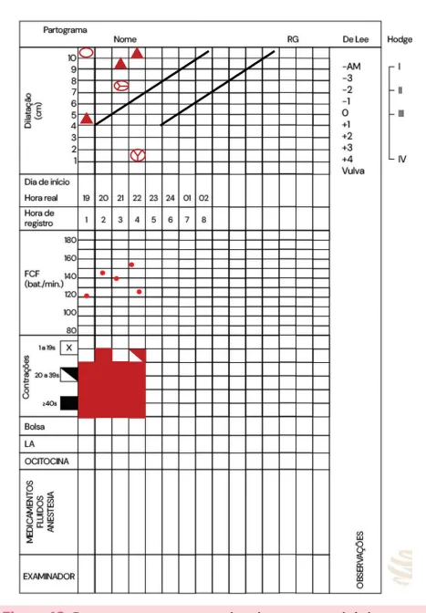

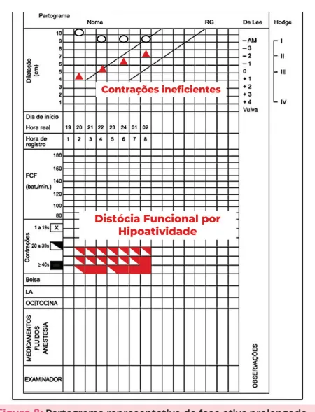

---

<!-- page:7 -->

## FÓRCEPS

## INDICAÇÕES

- Abreviação do período expulsivo (exaustão materna, sofrimento fetal, morbidade materna);

Figura 11: Partograma representativo de período expulsivo prolongado.

## PARADA SECUNDÁRIA DA DESCIDA

- Mesma altura, após 2 toques com intervalo mínimo de 1h;

- A causa mais comum é a DCP (relativa ou absoluta).

Condutas possíveis

- Ocitocina;

- Rotura de membranas;

- Analgesia;

- Fórceps se houver DCP relativa.

Figura 12: Partograma representativo de parada secundária da descida. sofrimento fetal, morbidade materna);

- Distócia de rotação;

- Cabeça derradeira.

## CRITÉRIOS DE APLICABILIDADE

- Feto vivo;

- Bolsa rota;

- Dilatação cervical completa;

- Ausência de DCP absoluta;

- Saber variedade de posição;

- Ideal entre +2/+3 de DeLee.

## TIPOS DE FÓRCEPS

Simpson

- Mais usado;

- Rotação de até 45º;

- Não corrige assinclitismo.

Kielland

- Rotação >45º;

- Corrige assinclitismo.

Piper

- Cabeça derradeira nos partos pélvicos.

Figura 13: Tipos de Fórceps mais utilizados na prática obstétrica. A: fórceps de Simpson; B: fórceps de Kielland; C: fórceps de Piper.

A pega ideal quando da aplicação do fórceps é a biparietomalomentoniana. Veja a figura 16. Figura 14: Pega adequada do fórceps no polo cefálico.

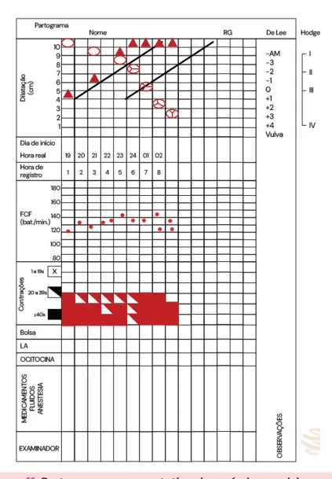

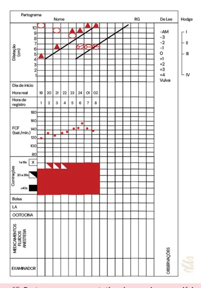

---

<!-- page:8 -->

## COMPLICAÇÕES

- Lesões craniofaciais;

- Lacerações cervicais e vaginais;

- Prolapso genital (em longo prazo).

## VÁCUO-EXTRATOR

- Os critérios de aplicabilidade e as contraindicações semelhantes ao fórceps.

## TÉCNICA

- Identifica-se o ponto de flexão o qual está situado na sutura sagital, 3 cm à frente da fontanela posterior (lambda);

- O centro da cúpula deve ficar localizado por cima do ponto de flexão com a sutura sagital na linha central, sem que as bordas da cúpula fiquem por cima Figura 15: PONTO DE FLEXÃO PARA COLOCAÇÃO DO VÁCUO da fontanela; EXTRATOR.

- Deve-se certificar que não há tecido materno ou fetal preso entre a cúpula e o couro cabeludo;

- Cria-se o vácuo, seguindo a pressão recomendada pelo fabricante;

- A tração deverá seguir a curvatura pélvica até a visualização do mento (hipomóclio).

Se houver desprendimento do vácuo ≥3 vezes, deve-se considerar como falha do método e partir para outra abordagem, pelo risco aumentado de tocotrauma.

- Verificar Figuras 15 e 16 .

## LACERAÇÕES DE CANAL DE PARTO

## 1º GRAU

- Atinge pele e mucosa;

- Conduta: suturar se sangrante ou para correção anatômica.

## 2º GRAU

- Atinge músculos sem esfíncter;

- A episiotomia é uma laceração iatrogênica de 2º grau: Incisão feita nos músculos bulbocavernoso e transverso superficial do períneo; Indicada em situações de risco iminente de laceração perineal grave (3º ou 4º graus) ou instrumentalização.

## 3º GRAU

- 3A: <50% do esfíncter externo;

- 3B: >50% do esfíncter externo;

- 3C: esfincter anal interno.

## 4º GRAU

- Esfíncter Anal + Mucosa Anal;

- Verificar Figura 17 na próxima página.

Figura 16: TÉCNICA DE USO DO VÁCUO EXTRATOR.

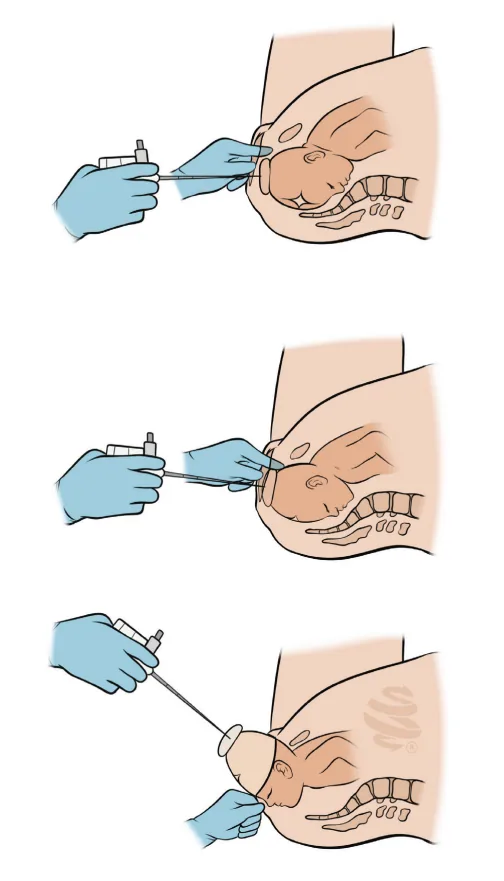

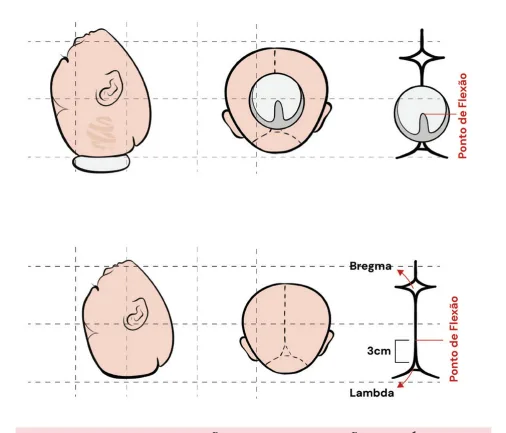

---

<!-- page:9 -->

## DISTÓCIA DE OMBROS

- Para manejo da distócia de ombros, pode-se lançar mão do mnemônico ALEERTA.

Figura 17: Lacerações perineais. A Ajuda: Avisar paciente e cha L Levantar perna: McRoberts E Externa: Rubin I E Episiotomia: Considerar episi R Remover: braço posterior Ja Toque: para manobras intern Woods, Woods reverso A Alterar posição: Gaskin Figura 18: Mnemônico para correção de distócia de ombros.

## MANOBRAS PARA CORREÇÃO DE DISTÓCIA DE

## OMBROS

- McRoberts: hiperflexão das coxas da mãe sobre o abdome com abdução da pelve;

- Rubin I: pressão suprapúbica sobre a face posterior do ombro anterior do feto para desimpactar da sínfise púbica;

- Jacquemier: introduz-se a mão no canal vaginal, flete-se o antebraço sobre o braço para retirada do braço posterior;

- Rubin II: pressão direta sobre a face posterior do ombro anterior do feto, fazendo movimento de rotação;

- Woods: pressão direta sobre a face anterior do ombro posterior do feto, fazendo movimento de rotação;

- Woods reverso: pressão direta sobre a face posterior do ombro posterior do feto, fazendo movimento de rotação;

- Gaskin: colocação da parturiente em posição de quatro apoios para ultimação do parto;

- Verificar Figura 18 .

amar equipe siotomia acquemier nas: Rubin II,

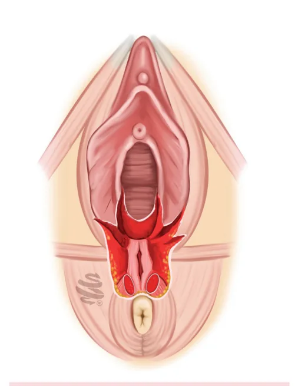

---

<!-- page:10 -->

Tabela 1: Avaliação cervical e pontuação do Índice de Bishop Pontos 0 1 2 3 Altura -3 -2 -1 ou 0 > 0 Dilatação 0 1 – 2 cm 3 – 4 cm > 4 cm Esvaecimento 0 – 30% 40 – 50% 60 – 70% ≥ 80% Consistência Firme Médio Amolecido -Posição Posterior Medianizado Anterior -INDUÇÃO DO PARTO

- Bishop ≥6 → colo favorável: Poderá receber ocitocina direto.

- Para avaliação prognóstica da resposta cervical ao uso

- Verificar Tabela 1 .

de ocitocina, deve-se lançar mão do Índice de Bishop.

## REFERÊNCIAS

## ÍNDICE DE BISHOP

- Bishop <6 → colo desfavorável: Figuras 7 a 11 Colo deverá ser amadurecido por via Adaptado de Ministério da Saúde, Brasil medicamentosa ou mecânica.
