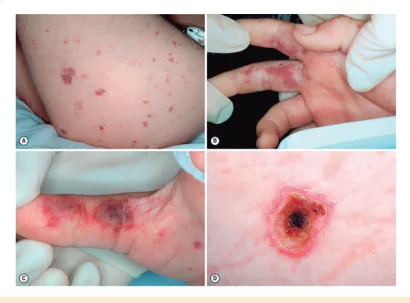

# Meningite e Encefalite

<!-- page:1 -->

## Meningite e Encefalite (Pediatria)

**Meningite:** inflamação das leptomeninges.

**Meningoencefalite:** acometimento associado do parênquima cerebral.

**Transmissão:** gotículas/via aérea (tosse, espirros)/contato próximo.

**Etiologia:**

- < 3 meses: enterobactérias, Listeria, EGB (Streptococcus grupo B);
- > 3 meses: meningococo, pneumococo e Haemophilus.

**Quadro clínico:** febre, alteração de nível de consciência, rigidez de nuca, sinais meníngeos, irritabilidade, abaulamento de fontanelas, recusa alimentar, prostração, náuseas e vômitos, taquicardia, cefaleia, mialgia, fotofobia. Pode haver convulsões.

**Waterhouse-Friderichsen:** insuficiência adrenal → choque na meningococcemia.

**Diagnóstico:**

- Suspeita clínica → líquor com celularidade, bioquímica e cultura;
- Bacteriano: pleocitose polimorfonuclear + hiperproteinorraquia + hipoglicorraquia.

**Tratamento:**

- Suporte clínico, sempre;
- Viral → se herpética, iniciar aciclovir;
- Bacteriana (ATB empírico até resultado de cultura) → neonatal: ampicilina + cefotaxima; pós-natal: cefalosporina de 3ª geração + vancomicina.

## Definição

- As meningites são caracterizadas pela inflamação das leptomeninges;
- Se houver acometimento também do parênquima cerebral, denominamos meningoencefalites;
- A doença é transmitida por via aérea, por meio de gotículas, através de tosse, espirros, e contato próximo.

## Agentes Etiológicos

- Os agentes etiológicos mais comuns são os vírus, e, dentre eles, os principais são os enterovírus (Coxsackievirus, Echovirus);
- Outros: herpesvírus; arbovírus; influenza; adenovírus; parainfluenza; SARS-CoV-2; sarampo, etc.;
- Além dos vírus, devemos nos atentar para os agentes bacterianos!
- No Brasil, o Mycobacterium tuberculosis está entre os agentes etiológicos comuns, pela epidemiologia importante no país.

**Profilaxia:**

- **Imunização:** Meningo C / Meningo ACWY / MenC: 3 e 5 meses + MenACWY aos 12 meses como reforço; HiB / Pneumocócica 10v;
- Precaução de gotículas por 24 horas;
- **ATB profilático:** rifampicina (R) até 24 horas do início dos sintomas → se meningococo, R por 2 dias; se Hemófilos, R por 4 dias.

**Definição de contato próximo (MS – Nota Técnica 154/2024 – outubro/2024):**

1. Compartilhamento de ambiente doméstico;
2. Exposição próxima por pelo menos 5 dias (em dias contínuos ou não). Ex.: turma de creche e instituição de ensino infantil (< 5 anos) ou ambientes de trabalho;
3. Exposição próxima e contínua de pelo menos 4 horas E até 1 metro de distância, em ambiente fechado (SBP: voo > 8 horas de duração);
4. Profissional que realizou intubação sem Equipamento de Proteção Individual;
5. Exposição direta às secreções nasofaríngeas (saliva).

**Momento do contato:**

- 10 dias antes do início dos sinais e sintomas;
- Até 24 horas do início do tratamento com ceftriaxona ou uso de rifampicina.

## Para Pediatria

- Para conseguir saber qual agente etiológico é mais provável, é preciso investigar o status vacinal da criança e relacionar com a faixa etária de exposição. Vacina HiB conjugada — administrada desde 1999; Meningocócica e Pneumocócica 10v — desde 2010.

**Quando a causa for bacteriana:**

- **Principais etiologias bacterianas:** Streptococcus pneumoniae; Neisseria meningitidis; Haemophilus influenzae;
- **Investigar status vacinal:** Hib (Haemophilus influenzae B) conjugada (disponibilizada desde 1999); contra meningococo (disponível desde 2010); pneumocócica 10-valente (disponível desde 2010);
- **Relacionar com a faixa etária.**

Verificar Tabela 1 na próxima página.

> *Streptococcus agalactiae (Estreptococo do grupo B — GBS/EGB) coloniza o trato genital da gestante, levando à sepse e meningite neonatais.

---

<!-- page:2 -->

> ⚠️ Tabela reconstruída a partir de OCR — confira contra a fonte original.

**Tabela 1: Bactérias que causam meningite em pediatria, distribuídas conforme a faixa etária**

| Faixa Etária | Agentes |
|---|---|
| Neonatal | Enterobactérias (E. coli, Klebsiella sp., Proteus sp., Serratia marcescens), Streptococcus do grupo B*, Listeria monocytogenes |
| 1 a 3 meses | Enterobactérias, L. monocytogenes, Streptococcus do grupo B, Pneumococo, Meningococo e Haemophilus influenzae tipo B |
| 3 meses a 5 anos | Streptococcus pneumoniae, Neisseria meningitidis, Haemophilus influenzae |
| > 5 anos | Neisseria meningitidis, Streptococcus pneumoniae |

## Agentes Incomuns

- Fungos;
- Bactérias como Bartonella spp, Brucella spp, Mycoplasma pneumoniae;
- Parasitas (Taenia solium, Toxoplasma gondii).

**Há ainda causas não infecciosas como:**

- Doenças imunomediadas;
- Toxicidade por drogas;
- Doenças neoplásicas.

## Fisiopatologia

Existem 3 mecanismos principais que envolvem fatores de virulência e capacidade de resposta do hospedeiro:

- Colonização dos epitélios de mucosas, especialmente nasofaringe, de maneira não patogênica;
- Disseminação hematogênica;
- Invasão direta por contiguidade, decorrente de focos infecciosos próximos, traumas, derivação, implante coclear, focos infecciosos a distância, entre outros.

### Especificidades com Relação às Defesas

- Em pessoas com HIV, asplenia, quebra de barreira liquórica, pensar em pneumococo e outros germes gram-positivos de pele;
- Em casos de deficiência do sistema complemento, pensar em meningococo;
- Para casos de imunodeficiências humorais, pensar em Hemófilos não tipável.

## Quadro Clínico

- As manifestações variam com a faixa etária da criança, mas, de maneira geral, a tríade clássica é febre, alteração de nível de consciência e rigidez de nuca;
- Essas manifestações são consequência da inflamação no cérebro.

**Em lactentes:**

- Quanto menor a criança, mais inespecíficos os sinais, podendo se apresentar como um quadro de sepse: irritabilidade, abaulamento de fontanelas (hipertensão intracraniana), recusa alimentar, prostração, náuseas e vômitos, taquicardia e febre etc.

**Em escolares:**

- Apresentam sintomas mais definidos como cefaleia, vômitos, mialgia, fotofobia, confusão ou desorientação, podendo haver convulsões.

**Sinais meníngeos (mais comuns > 12-18 meses):**

- **Brudzinski:** coloca-se o paciente em decúbito dorsal e flexiona-se passivamente a cabeça em direção ao tórax. O teste será positivo quando houver flexão dos joelhos e quadris do paciente;
- **Kernig:** coloca-se o paciente em decúbito dorsal com o quadril flexionado a 90 graus, e tenta-se estender a perna na altura do joelho. O teste é positivo quando há resistência à extensão do joelho > 135 graus ou dor na região lombar ou posterior da coxa.

### Especificidades

- Rash petequial/purpúrico e/ou choque estão associados à sepse por meningococo, mas podem estar presentes quando for HiB ou pneumococo;
- **Waterhouse-Friderichsen:** infarto adrenal que leva à insuficiência adrenal → choque na meningococcemia.

Figura 1: Evolução do rash purpúrico em meningococcemia, desde o início (A) até necrose tecidual (D). Observa-se a progressão das lesões cutâneas associadas à infecção por Neisseria meningitidis.

---

<!-- page:3 -->

> ⚠️ Tabela reconstruída a partir de OCR — confira contra a fonte original.

**Tabela 2: Comparação dos parâmetros de quimiocitológico do LCR nas diferentes etiologias de meningite**

| Parâmetro do LCR | Viral | Bacteriana | Fúngica | TB |
|---|---|---|---|---|
| Leucócitos/mm³ | < 1000 | > 1000 | < 500 | < 300 |
| Neutrófilos | 20-40% | > 85-90% | < 10-20% | < 10-20% |
| Proteína (mg/dL) | Normal ou < 100 | > 100-150 | > 100-200 | > 200-300 |
| Glicose (mg/dL) | Normal | < 40 | < 40 | Normal, demora a normalizar |
| Cultura | Negativa/raro | Positiva > 95% | Positiva > 30% | Positiva < 30% |
| Outros métodos | PCR para enterovírus, herpesvírus | Gram/cultura para bactérias | Tinta da China e PCR para Cryptococcus, Histoplasma | PCR para Mycobacterium tuberculosis |

### Meningo-Tuberculose

- Responsável por 3% dos casos de tuberculose (TB) em pacientes não infectados por HIV e até 10% das pessoas que vivem com HIV (PVHIV);
- Apresentação mais comum em < 6 anos: meningite basal exsudativa;
- Pode ser subaguda ou crônica;
- Existe a forma localizada — tuberculoma.

**Forma subaguda (> 2 semanas):**

- Cefaleia, irritabilidade, alteração comportamental, sonolência, anorexia, vômitos, dor abdominal, febre, fotofobia, rigidez de nuca;
- Eventualmente, sinais focais relacionados à isquemia local ou envolvimento de pares cranianos (II, III, IV, VI e VII);
- Sinais de hipertensão intracraniana (HIC).

**Forma crônica (> 4 semanas):**

- Várias semanas com cefaleia, evoluindo com acometimento dos pares cranianos;
- 59% dos casos têm acometimento pulmonar concomitante.

**Tuberculoma:**

- Quadro clínico de um processo expansivo intracraniano de crescimento lento;
- Sinais e sintomas de HIC;
- Febre pode não estar presente;
- Exames de imagem auxiliam no diagnóstico precoce: TC ou RNM → hidrocefalia, espessamento meníngeo basal e infarto do parênquima cerebral.

## Diagnóstico

Verificar Tabela 2.

- Imaturidade da barreira hemato-encefálica leva a maiores níveis proteicos e de celularidade: proteinorraquia em prematuros: até 150 mg/dL; proteinorraquia em termos: até 100 mg/dL; celularidade em termos: até 25 células/mm³.
- **Como identificar bactérias através da coloração de Gram no líquor?**
  - Cocos gram-positivos: Streptococcus spp;
  - Diplococos gram-negativos: Neisseria spp;
  - Cocobacilos gram-negativos: Haemophilus spp.

### Indicações de Neuroimagem

**Quando solicitar exame de imagem:**

- Em casos de crises convulsivas, déficits neurológicos focais, papiledema, rebaixamento do nível de consciência moderado a grave, portadores de lesões estruturais de SNC previamente conhecidas, distúrbios de coagulação ou trombocitopenias → fazer tomografia computadorizada;
- Em neonatos: se houver aumento do perímetro cefálico (hidrocefalia, hipertensão intracraniana) e ao fim da antibioticoterapia, para assegurar ausência de complicações;
- Germes que mais comumente causam abscessos cerebrais: Citrobacter, Serratia, Proteus e Cronobacter.

## Tratamento

### Meningites Virais

- Para todos os casos, é necessário estabilização clínica (hemodinâmica, ventilatória e neurológica);
- **Meningoencefalite herpética:** iniciar aciclovir por 14-21 dias → o ideal é tratar até PCR negativo;
- Para RNs: o tempo de prescrição pode se estender até um ano como manutenção, a depender da evolução clínica e gravidade.

### Meningites Bacterianas Não TB

- Para todos os casos, primeiramente estabilização clínica (hemodinâmica, ventilatória e neurológica);
- **Escolha empírica para período neonatal:** aminoglicosídeo (amicacina ou gentamicina) + ampicilina OU cefotaxima + ampicilina (se suspeita de resistência). Obs.: ampicilina tem ação contra Listeria monocytogenes;
- **Escolha empírica para período pós-neonatal:** cefalosporina de 3ª geração (ceftriaxona ou cefotaxima) OU cefalosporina de 3ª geração + vancomicina (para regiões com risco de pneumococo resistente).

---

<!-- page:4 -->

- O tempo de tratamento varia conforme o agente isolado, mas, se necessário escolher empiricamente, consideramos a faixa etária: 14 dias para neonatos e 10 dias para as demais faixas etárias.

Verificar Tabela 3.

> ⚠️ Tabela reconstruída a partir de OCR — confira contra a fonte original.

**Tabela 3: Duração da antibioticoterapia preconizada conforme a bactéria isolada no LCR**

| Microrganismo | Duração da terapia |
|---|---|
| Neisseria meningitidis | 5-7 dias |
| Haemophilus influenzae | 7-10 dias |
| Streptococcus agalactiae (grupo B) | 14-21 dias |
| Streptococcus pneumoniae | 10-14 dias |
| Bacilos Gram-negativos | 21 dias |
| Listeria monocytogenes | 21 dias |

### Desfechos

- Mortalidade em crianças pelos 3 principais patógenos varia entre 5 e 30%, sendo a maior letalidade e as sequelas neurológicas atribuídas ao pneumococo.

### Meningite Tuberculosa

- **Esquema via oral:**
  - > 10 anos: RIPE por 2 meses + RI por 10 meses (manutenção) → 12 meses;
  - < 10 anos: RIP por 2 meses + RI por 10 meses (manutenção) → 12 meses;
- Associar corticoide (prednisona). Se casos graves, preferir dexametasona.

### Corticoterapia — Dexametasona

- Modular resposta inflamatória e prevenir complicações neurológicas, especialmente perda auditiva (HiB), mas não reduz mortalidade;
- Administrar antes ou conjuntamente à primeira dose do antibiótico;
- Na meningite pneumocócica, não há extensa avaliação sobre o uso, mas 2 metanálises mostram que seu uso melhora os resultados;
- Meningite meningocócica é a de melhor prognóstico, sem estudos para essa avaliação.

> Atenção! A febre na meningite dura aproximadamente 4 a 6 dias após a introdução do antimicrobiano.

- Se há retorno da febre ou persistência por > 8 dias, requer uma avaliação adicional para sua causa:
  - Descontinuação da dexametasona pode ser uma causa de febre;
  - Deve-se investigar complicações supurativas como empiema ou abscesso;
  - Repetir o LCR de forma individualizada;
  - Febre medicamentosa: diagnóstico de exclusão.

## Controle de Tratamento

- A coleta de líquor não está indicada rotineiramente. Deve ser realizada:
  - Paciente sem resposta adequada após 48h de antibioticoterapia adequada;
  - Lactentes menores de 2 meses;
  - Pacientes com meningite por Gram-negativos;
  - Em infecções causadas por pneumococos resistentes aos beta-lactâmicos.
- A sequela mais comum é a perda auditiva. Por isso, recomenda-se testes de acuidade auditiva (PEATE ou BERA);
- A perda definitiva costuma ocorrer após 4 a 6 meses da alta, sendo importante manter o acompanhamento ambulatorial;
- Outras complicações possíveis são paresias, epilepsias, hidrocefalia, diabetes insipidus e ataxia.

## Profilaxia Pós-Exposição

### Medidas de Prevenção de Transmissão

- Precaução respiratória para gotículas até completar 24 horas de antibioticoterapia adequada;
- Para contatos, indica-se antibioticoterapia até 24 horas após início dos sintomas, se infecção por meningococo ou Hemófilos tipo B. Em situações de surto, recomenda-se a realização da quimioprofilaxia ampliada — todos os contatos diretos nos 10 dias anteriores ao início dos sintomas e durante a manifestação dos sintomas. No caso de doença invasiva por HiB: quimioprofilaxia pode ser feita até 30 dias após exposição ao caso-índice;
- Imunização.

**Definição de contato próximo (MS – Nota Técnica 154/2024 – outubro/2024):**

- Compartilhamento de ambiente doméstico;
- Exposição próxima por pelo menos 5 dias (em dias contínuos ou não). Exemplo: turmas de creches e instituições de ensino infantil (< 5 anos) ou ambiente de trabalho;
- Exposição próxima e contínua de pelo menos 4 horas E até 1 metro de distância, em ambiente fechado (SBP: voo > 8 horas de duração);
- Profissional que realizou intubação orotraqueal sem uso de Equipamento de Proteção Individual (EPI);
- Exposição direta às secreções nasofaríngeas (saliva).

**Momento do contato:**

- 10 dias antes do início dos sinais e sintomas;
- Até 24 horas do início do tratamento com ceftriaxona ou uso de rifampicina.

### Profilaxia para Meningococo

- Todas as situações descritas em "Contato Próximo"; não se faz quimioprofilaxia em contato casual/indireto/profissionais sem exposição direta à secreção oral do paciente índice;
- Rifampicina por 2 dias;
- Como alternativas: ceftriaxona (dose única) / ciprofloxacino (dose única).

---

<!-- page:5 -->

## Profilaxia para Haemophilus Influenzae Tipo B

- Administrar doses preconizadas conforme PNI;
- Após 30 dias da doença invasiva por HiB, em crianças no domicílio: atualizar esquema vacinal, se ausente ou incompleto; entre 6 meses e 2 anos de vida, com esquema completo, administrar dose adicional, respeitando intervalo de 2 meses (60 dias) após a última dose.

**Todos os contatos domiciliares do caso, se houver no domicílio:**

- Crianças < 4 anos não vacinados ou parcialmente vacinados;
- Criança < 2 anos independente da vacinação;
- Imunodeprimidos.

**Todos os contatos próximos, entre os familiares:**

- Criança < 4 anos não vacinado ou parcialmente vacinado;
- Criança < 2 anos independente da vacinação;
- Imunodeprimido;
- Quimioprofilaxia apenas no contato direto do caso-índice.

- Todos os contatos de creche/instituição, com 2 ou mais casos de doença invasiva por HiB, nos 60 dias prévios, independente de status vacinal ou idade;
- Rifampicina por 4 dias.

## Imunização

- Todos os contatos domiciliares do caso.

## Referências

Figura 1: Evolução do rash purpúrico em meningococcemia, desde o início (A) até necrose tecidual (D). Observa-se a progressão das lesões cutâneas associadas à infecção por Neisseria meningitidis. LONG, Sarah S.; PROBER, Charles G.; PICKERING, Larry K. (Ed.). Principles and practice of pediatric infectious diseases. 6. ed. Philadelphia: Elsevier, 2022.
