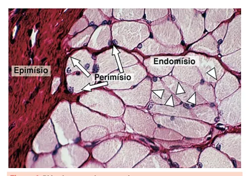
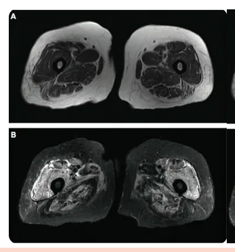
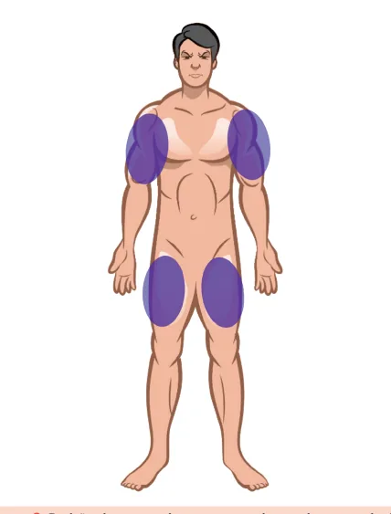
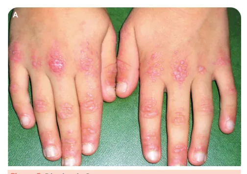
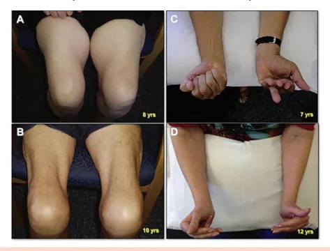
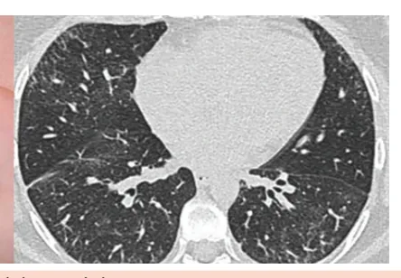
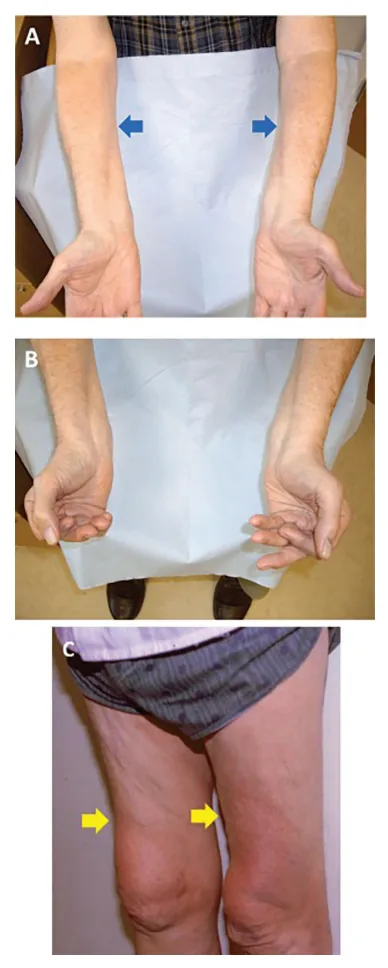

# Miopatias Autoimunes Sistêmicas

<!-- page:1 -->

Miopatias Autoimunes Sistêmicas - Dermatomiosite Polimiosite e Anti-sintetase (CM) Grupo de doenças caracterizadas pela lesão imune às

- Polimiosite: é a dermatomiosite sem pele e que diferentes partes do miócito que inclui: acomete o endomísio;

- Dermatomiosite: acometimento perimisial e

- Miopatia necrosante autoimune: fraqueza de perivascular. Caracterizada pelo acometimento rápida evolução, maiores níveis de CPK, associação proximal, leve predomínio feminimo, presença de com estatinas;

Gottron e heliótropo. Apresenta a maior associação

- Miosite por corpos de inclusão: predomina em com neoplasias; homens, mais velhos, possui lenta evolução e a

- Síndrome antissintetase: lembrar dos 5 sintomas fraqueza pode ser distal e assimétrica.

cardinais: artrite, miosite, febre, doença intersticial e “mãos de mecânico”. Associação com o Anti-Jo-1;

## MIOPATIAS AUTOIMUNES

- CPK: aumentada, secundariamente à destruição

## SISTÊMICAS de miócitos

- TGO, TGP e LDH: aumentadas, secundariamente à

Incluem as miopatias inflamatórias autoimunes: destruição de miócitos;

- Dermatomiosite;

- Eletroneuromiografia: padrão miopático;

- Síndrome antissintetase;

- Ressonância magnética: inflamação ativa com edema

- Polimiosite; e áreas de fibrose e lipossubstituição sequelares.

- Miopatia necrosante imunomediada;

- Miosite por corpos de inclusão;

## MIOPATIAS INFLAMATÓRIAS

## AUTOIMUNES

- Grupo heterogêneo;

- Fraqueza muscular de predomínio proximal e simétrica

(exceto na miosite por corpos de inclusão);

- Raras (incidência até 8 por milhão/ano).

- Verificar Figura 1

## EXAMES COMPLEMENTARES

Os exames a seguir podem estar alterados em todos os subtipos de miopatias inflamatórias autoimunes: Figura 1: Biópsia muscular normal.

Figura 2: Ressonância magnética de coxas - Sequência ponderada em T1 evidencia lipossubstituição (ventres musculares hipotróficos com estrias de gordura de permeio) e a sequência ponderada em T2 evidencia edema muscular (hipersinal), principalmente no ventre muscular do quadríceps.

---

<!-- page:2 -->

## DERMATOMIOSITE

- Predomínio em mulheres (2:1);

- Picos de incidência entre 10 a 15 e 40 a 55 anos;

- Acometimento perimisial e perivascular

(linfócitos T CD4+);

- Possui autoanticorpos específicos.

Associação com neoplasias

- É a miopatia inflamatória autoimune com maior associação a neoplasias;

- Primeiros 5 anos de doença;

- Aumentam o risco de neoplasia: Início >40 anos; Disfagia importante; Má resposta ao corticoide; Lesões de pele necróticas; Figura 4: Heliótropo. Autoanticorpos: anti-NXP-2 e anti-TIF-1-gama.

Quadro clínico Caracteriza-se por fraqueza muscular:

- Insidiosa (2-6 meses);

- Predomínio proximal e simétrico;

- MMSS e MMII;

- Dificuldade para levantar da cadeira, subir escadas, pentear o cabelo.

Figura 5: Pápulas de Gottron. Figura 6: Sinal do “V do decote”. Figura 3: Padrão de acometimento muscular na dermatomiosite.

Além disso, apresenta-se com lesões de pele típicas:

- Heliótropo;

- Gottron;

- Sinal do “V do decote”;

- Sinal do “xale”;

- Sinal do “coldre”.

Alguns pacientes com dermatomiosite não apresentam fraqueza muscular ou elevação de CPK, apenas lesões de pele!

Figura 7: Sinal do “xale”.

---

<!-- page:3 -->

## POLIMIOSITE

- Predomínio em mulheres (2:1);

- Predomínio dos 40 aos 55 anos;

- Quadro clínico semelhante à dermatomiosite, mas sem lesões de pele;

Figura 8: Sinal do “coldre”. Exames complementares na dermatomiosite

- Autoanticorpos: Anti-Mi-2: “bonzinho”, quadro cutâneo clássico; Anti-NXP-2 e anti-TIF-1-gama: associação com neoplasia; Anti-MDA5: lesões de pele ulceradas e intersticiopatia pulmonar;

- Biópsia: infiltrado perivascular e perimisial de linfócitos T CD4+;

- Tomografia de tórax: dermatomiosite também pode ter intersticiopatia associada.

## SÍNDROME ANTISSINTETASE

- Predomínio em mulheres (2:1);

- Predomínio dos 40 a 55 anos;

- Caracteriza-se clinicamente por: Miosite; Doença pulmonar intersticial; Artrite; Fenômeno de Raynaud; “Mãos de mecânico”.

- Os exames complementares na síndrome antissintetase incluem: Autoanticorpo anti-Jo-1 positivo; Tomografia de tórax com intersticiopatia.

- Verificar Figura 9

Figura 9: Mãos de mecânico e intersticiopatia em paciente com s lesões de pele;

- Biópsia mostra infiltrado de linfócitos T CD8+ em endomísio;

- Não há autoanticorpos específicos.

## MIOPATIA NECROSANTE IMUNOMEDIADA

- Predomínio em mulheres;

- Predomínio dos 40 aos 50 anos;

- Apresenta os maiores níveis de CPK (podem chegar a

>10.000 U/L);

- Fraqueza proximal, simétrica e de rápida evolução, sendo mais intensa em membros inferiores;

- Biópsia mostra miócitos necróticos com pouca ou nenhuma inflamação;

- Autoanticorpos anti-HMGCR ou anti-SRP podem ser positivos;

- Associa-se ao uso de estatinas, principalmente em idosos.

## MIOSITE POR CORPOS DE INCLUSÃO

- Predomínio em homens (2:1);

- Predomínio após os 50 anos de idade;

- Evolução lenta da fraqueza;

- Pode cursar com fraqueza distal e assimétrica;

r

- Classicamente associa-se a atrofia do antebraço e do quadríceps femoral;

- Pouca resposta ao tratamento imunossupressor.

Figura 10: Atrofia dos quadríceps femorais e do antebraço.

---

<!-- page:4 -->

## REFERÊNCIAS

Figura 1: Biópsia muscular normal. AMERICAN COLLEGE OF RHEUMATOLOGY. Biblioteca de Imagens da Reumatologia. Atlanta, GA: ACR, c2025. Disponível em: https:// d r h d r d r d r p j a p p j a p d r a Figura 11: Atrofia da musculatura flexora dos antebraços e do quadríceps femoral. D c TRATAMENTO DAS MIOPATIAS INFLAMATÓRIAS AUTOIMUNES

- Corticoterapia (em pulsoterapia nos quadros graves); B

- Imunoglobulina intravenosa (nos quadros graves i t ou refratários); 1

- Associar corticoide a um segundo imunossupressor, h que pode ser: metotrexato, azatioprina, micofenolato de mofetila ou ciclosporina;

- Reabilitação física, sendo os exercícios físicos indicados em todas as fases da doença. da Reumatologia. Atlanta, GA: ACR, c2025. Disponível em: https:// rheumatology.org/image-library. Acesso em: 02 junho 2025.

Figura 2: Ressonância magnética de coxas. QUIZLET. Miopatias inflamatórias. [S.l.]: Quizlet, [202–]. Disponível em:

https://quizlet.com/br/788487206/miopatias-inflamatorias-flash-cards/. Acesso em: 2 jun. 2025. Figura 4: Heliótropo.

AMERICAN COLLEGE OF RHEUMATOLOGY. Biblioteca de Imagens da Reumatologia. Atlanta, GA: ACR, c2025. Disponível em: https:// rheumatology.org/image-library. Acesso em: 02 junho 2025.

Figura 5: Pápulas de Gottron. AMERICAN COLLEGE OF RHEUMATOLOGY. Biblioteca de Imagens da Reumatologia. Atlanta, GA: ACR, c2025. Disponível em: https:// rheumatology.org/image-library. Acesso em: 02 junho 2025.

Figura 6: Sinal do “V do decote”. AMERICAN COLLEGE OF RHEUMATOLOGY. Biblioteca de Imagens da Reumatologia. Atlanta, GA: ACR, c2025. Disponível em: https:// rheumatology.org/image-library. Acesso em: 02 junho 2025.

Figura 7: Sinal do “xale”. CIUDAD-BLANCO, C. et al. Dermatomiositis: estudio y seguimiento de 20 pacientes. Actas Dermo-Sifiliográficas, Madrid, v. 102, n. 6, p. 448–455, jul./ago. 2011. DOI: 10.1016/j.ad.2010.10.017. Disponível em: https://www.

actasdermo.org/es-dermatomyositis-assessment-follow-up-20patients-articulo-S1578219011000060. Acesso em: 2 jun. 2025.

Figura 8: Sinal do “coldre”. CIUDAD-BLANCO, C. et al. Dermatomiositis: estudio y seguimiento de 20 pacientes. Actas Dermo-Sifiliográficas, Madrid, v. 102, n. 6, p. 448–455, jul./ago. 2011. DOI: 10.1016/j.ad.2010.10.017. Disponível em: https://www.

actasdermo.org/es-dermatomyositis-assessment-follow-up-20patients-articulo-S1578219011000060. Acesso em: 2 jun. 2025.

Figura 9: Mãos de mecânico e intersticiopatia em paciente com síndrome antissintetase. AMERICAN COLLEGE OF RHEUMATOLOGY. Biblioteca de Imagens da Reumatologia. Atlanta, GA: ACR, c2025. Disponível em: https:// rheumatology.org/image-library. Acesso em: 02 junho 2025.

Figura 10: Atrofia dos quadríceps femorais e do antebraço. MASTAGLIA, F. L.; NEEDHAM, M. Inclusion body myositis: A review of clinical and genetic aspects, diagnostic criteria and therapeutic approaches.

Journal of Clinical Neuroscience, Amsterdam, v. 22, n. 1, p. 6–13, jan. 2015. DOI: 10.1016/j.jocn.2014.09.012. Disponível em: https://www.jocn-journal.

com/article/S0967-5868(14)00619-5/fulltext. Acesso em: 2 jun. 2025. Figura 11: Atrofia da musculatura flexora dos antebraços e do quadríceps femoral.

BRADY, S.; POULTON, J.; MULLER, S. Inclusion body myositis: Correcting impaired mitochondrial and lysosomal autophagy as a potential therapeutic strategy. Autoimmunity Reviews, Amsterdam, v. 23, n. 11, p.

103644, nov. 2024. DOI: 10.1016/j.autrev.2024.103644. Disponível em: https://www.sciencedirect.com/science/article/pii/S1568997224001356.

Acesso em: 2 jun. 2025.

