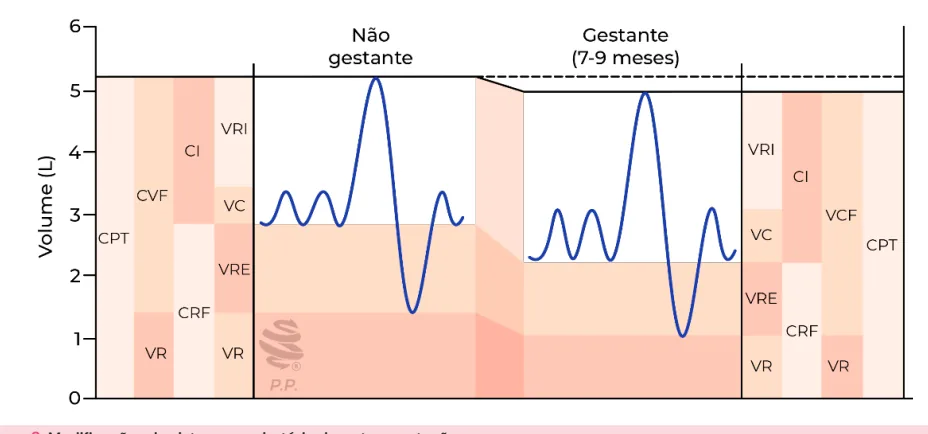
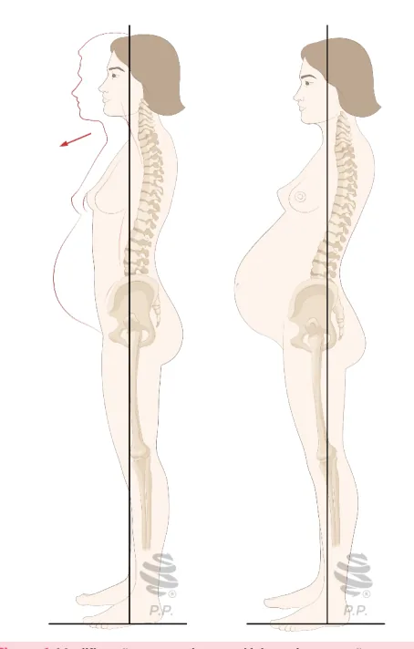
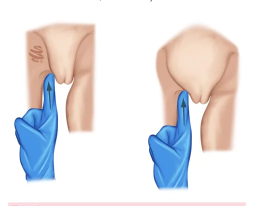

# Modificações do Organismo Materno

<!-- page:1 -->

## MODIFICAÇÕES DO

## ORGANISMO MATERNO

ORGANISMO MATER Modificações do organismo materno CARDIOVASCULAR E

- ↑ Volume sistólico;

- ↑ Frequência cardíaca basal (15 a 20 bpm);

- ↑ Débito Cardíaco (volume sistólico x frequência cardíaca).

- HEMATOLÓGICO R

- ↑ Volume eritrocitário absoluto com ↑ Maior do volume sanguíneo → hemodiluição;

- ↑ Leucócitos; D

- ↑ Fibrinogênio e fatores pró-coagulantes com ↓

- Sistema fibrinolítico;

- ↓ Plaquetas.

- SISTEMA ENDÓCRINO M

- Concepto é consumidor de glicose e gestante tem permanente demanda de glicose;

- Hormônios contrainsulínicos da placenta: hormônio lactogênio placentário humano, hormônio do crescimento placentário humano e adipocinas.

## RESPIRATÓRIO

- ↑ Volume corrente e ↑ Capacidade inspiratória

(Vc + VRI);

- ↓ Volume residual, ↓ Capacidade residual funcional

(Vr + VRE) e ↓ CPT (CI + CRF).

## ADAPTAÇÕES DO ORGANISMO

## MATERNO À GRAVIDEZ

- O organismo feminino sofre mudanças anatômicas e funcionais durante a gravidez, adaptando-se para a presença do feto em desenvolvimento; H

- Já no início da gestação, a presença de células trofoblásticas no ambiente intrauterino altera a homeostase local;

- Através da produção celular de hormônios e outras substâncias, o funcionamento de quase todos os sistemas maternos se adapta à nova condição;

- Consideram-se alterações essenciais as que A ocorrem nos sistemas circulatório (cardiovascular e hematológico) e endócrino (metabolismo);

- Placenta: assume função endócrina e resposta vascular.

## SISTEMA CIRCULATÓRIO

- As adaptações circulatórias se iniciam com 6 semanas R de gestação e estão completamente instaladas entre o fim do primeiro trimestre e o início do segundo.

## ALTERAÇÕES DO VOLUME E DA

## CONSTITUIÇÃO DO SANGUE

- Aumento da volemia: atingindo valores 30 a 50% maiores do que os níveis pré-gestacionais:

## RNO ESQUELÉTICO

- Maior elasticidade das articulações da bacia óssea;

- Desvio do centro de gravidade materno → hiperlordose e hipercifose;

- Marcha Anserina.

## RENAL

- ↑ Ritmo de filtração glomerular;

- ↓ Ureia e Creatinina.

## DIGESTÓRIO

- Pirose, constipação e hemorroidas;

- Hipertrofia e hipervascularização gengival;

- Alteração na motilidade da vesícula biliar → litíase.

## MODIFICAÇÕES LOCAIS

- Mamas: ↑ Vascularização (rede de Haller), mastalgia, sinal de Hunter e tubérculos de Montgomery;

- Útero: hipertrofia e hiperplasia, sinal de Hegar, sinal de Piskacek e sinal de Nobile-Budin;

- Vulva e Vagina: sinal de Kluge, sinal de Osiander, sinal de Jacquemier-Chadwick e pH vaginal mais ácido. Esse aumento ocorre por conta das necessidades de suprimento sanguíneo nos órgãos genitais, especialmente em território uterino, cuja vascularização apresenta-se maior na gestação, além da perda sanguínea do parto.

Hemodiluição

- Aumento do volume eritrocitário menor do que o aumento do volume plasmático: 30% de aumento do volume das células vermelhas do sangue; 45 a 50% de aumento do volume plasmático.

- Aumento dos níveis plasmáticos de eritropoetina.

Aumento dos leucócitos

- Gravidez normal, com valores de leucócitos totais entre 5.000 e 14.000/mm3;

- Durante o parto e o puerpério imediato, os valores de leucócitos se elevam de modo significativo, podendo chegar a 29.000/mm3;

- Achado possivelmente relacionado à atividade das adrenais no momento de estresse.

Redução de plaquetas

- Como consequência da hemodiluição + coagulação intravascular no leito útero-placentário + presença do tromboxano A2;

- Plaquetopenia na gestação: quando níveis inferiores a

100 mil/mm3.

---

<!-- page:2 -->

Estado de hipercoagulabilidade da gestação TIREOIDE

- Aumento de fibrinogênio e de fatores pró-coagulantes;

- Sobrecarga funcional:

- Redução do sistema fibrinolítico (a atividade fibrinolítica | Redução dos níveis séricos de iodo pelo parece estar reduzida na gestação à custa da elevação de inibidores dos ativadores de plasminogênio).

## AUMENTO DO VOLUME SISTÓLICO

- Ocorre aumento do volume sistólico e da frequência cardíaca basal (15 a 20 bpm);

- Aumento do débito cardíaco (volume sistólico x frequência cardíaca);

- O processo se inicia por volta da quinta semana de gravidez, estabiliza-se por volta de 24 semanas e atinge seu ápice no pós-parto imediato, com incremento de 80% no débito cardíaco.

## AUMENTO DA PROSTACICLINA

- Mantém a vasodilatação sistêmica da gestante;

- Aumento da progesterona: Produção endotelial de óxido nítrico; Circulação útero-placentária de baixa resistência.

- Redução da resistência vascular periférica.

Pressão arterial sistêmica↓ → resistência vascular periférica↓↓ X Débito cardíaco ↑

## CORAÇÃO

- Desviado para cima e para esquerda;

- Aumento de Volume (hipertrofia de miócitos);

- Ritmo cardíaco: extrassístoles ventriculares esporádicas, taquicardias paroxísticas supraventriculares;

- Sopro cardíaco sistólico (fisiológico na gestante) → débito cardíaco.

Redução da viscosidade sanguínea + aumento do

## SISTEMA ENDÓCRINO

## METABOLISMO DA GESTANTE

- Apresenta duas fases distintas: Anabolismo materno; Catabolismo materno e anabolismo fetal.

- Metabolismo energético na 1ª metade: armazenamento de gordura, glicogênese hepática;

- 2ª metade da gravidez: período catabólico, com lipólise, neoglicogênese e resistência periférica à insulina → ação do hormônio lactogênico placentário.

Necessidade calórica total durante a gravidez

- É de 80.000 kcal, sendo: 1º trimestre: acréscimo de 85 kcal/dia; 2º trimestre: 285 kcal/dia; 3º trimestre: 475 kcal/dia.

## HIPÓFISE

- Hipertrofia e hiperplasia da adenohipófise;

- Lactotrofos → produção de prolactina (preparar as glândulas mamárias para a produção de leite no pós-parto);

- Tireotrofos → redução da produção de TSH (fração alfa hcg). Estimulação direta dos receptores de TSH pelo hCG.

aumento da taxa de filtração glomerular e pelo consumo periférico;

## PARATIREOIDE

- Aumento da demanda de cálcio porque o feto consome, em média, cerca de 300 mg/dia de cálcio na gravidez, concentrados no terceiro trimestre;

- Redução do nível sérico de cálcio total;

- Aumento do calcitriol → aumento da absorção de cálcio pelo sistema digestório.

## PELE E ANEXOS

- Aumento da progesterona → aumento da produção e secreção do hormônio melanotrófico na hipófise.

Hiperpigmentação

- Cloasma ou melasma: a ação hormonal sobre moléculas de tirosina da pele, induz a produção excessiva de melanina, o que provoca máculas hipercrômicas;

- Linha Nigra → pigmentação na região abdominal;

- Podem piorar com a exposição solar e costumam desaparecer após a gravidez;

- Sinal de Hunter: pigmentação periareolar que determina o surgimento da aréola secundária.

## SISTEMA ESQUELÉTICO

- Embebição gravídica;

- Maior elasticidade das articulações da bacia óssea (sínfise púbica, sacrococcígea e sinostosis sacroilíacas);

- Desvio do centro de gravidade materno: Hiperlordose; Hipercifose.

- Marcha Anserina: afastamento dos pés e diminuição da amplitude dos passos durante a deambulação;

- Verificar Figura 1 na próxima página.

o

## SISTEMA PULMONAR

- ↑ Volume Corrente;

- ↑ Capacidade inspiratória (Vc + VRI);

- ↓ Volume residual;

- ↓ Capacidade residual funcional (Vr + VRE);

- ↓ CPT (CI + CRF).

Obs.: Volume corrente (Vc); Volume de reserva inspiratório (VRI); Volume de reserva expiratório (VRE);

Volume residual (Vr); Capacidade residual funcional (CRF).

- A elevação do volume corrente pretende suprir as demandas de oxigênio, que sofrem aumento por conta da maior massa eritrocitária e da quantidade total de hemoglobina circulante;

---

<!-- page:3 -->

## SISTEMA RENAL

- Aumento da taxa de filtração glomerular e, com isso,

- S

- - M

- - Figura 1: Modificações musculoesqueléticas da gestação.

- A capacidade pulmonar total (CPT) está reduzida na Ú gravidez em aproximadamente 200 mL, em razão da elevação do diafragma à custa da redução do volume residual;

- A frequência respiratória sofre pouca ou nenhuma modificação durante a gravidez;

- Hiperemia e edema da mucosa das vias aéreas superiores com: Congestão nasal; Epistaxe; Alterações da voz.

- Verificar Figura 2 .

Figura 2: Modificações do sistema respiratório durante a gestação. queda da ureia e creatinina;

- O aumento da volemia em associação com a redução da resistência vascular periférica provoca: elevação do fluxo plasmático glomerular filtração glomerular.

→ consequente aceleração do ritmo de

## SISTEMA DIGESTÓRIO

A progesterona é um potente relaxante de fibras musculares lisas.

- Pirose, constipação e surgimento de hemorroidas;

- Hipertrofia e hipervascularização gengival;

- Alteração na motilidade da vesícula biliar → litíase.

## MAMAS

- Mastalgia;

- Aréolas primárias hiperpigmentadas (sinal de Hunter);

- Hipertrofia de glândulas sebáceas do mamilo

(tubérculos de Montgomery);

- Aumento da vascularização → rede de Haller.

## ÚTERO

- Crescimento → hipertrofia e hiperplasia;

- Sinal de Hegar → flexão do corpo uterino sobre o colo decorrente de amolecimento do útero, sobretudo na região do istmo;

- Sinal de Piskacek → assimetria uterina decorrente da nidação (abaulamento e amolecimento do local);

- Sinal de Nobile-Budin → preenchimento do fundo de saco pelo útero gravídico;

- Verificar Figura 3 na próxima página.

---

<!-- page:4 -->

## VAGINA E VULVA

- Sinal de Kluge → arroxeamento da mucosa vaginal;

- Sinal de Osiander → pulsação da artéria vaginal;

- Sinal de Jacquemier-Chadwick → arroxeamento da mucosa vulvar;

- Hipertrofia de células musculares e papilas da mucosa;

- pH vaginal mais ácido.

## REFERÊNCIAS

Figura 1: Modificações musculoesqueléticas da gestação. Adaptado de ZUGAIB, Marcelo; PULCINELI VIEIRA, Rossana Francisco (orgs.). Zugaib obstetrícia. 5. ed. São Paulo: Manole, [2023].

Figura 2: Modificações do sistema respiratório durante a gestação. Figura 3: Sinal de Nobile Budin. Adaptado de ZUGAIB, Marcelo; PULCINELI VIEIRA, Rossana Francisco (orgs.). Zugaib obstetrícia. 5. ed. São Paulo: Manole, [2023].

