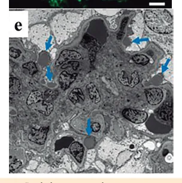
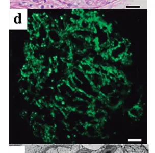

# Nefrologia Pediátrica

<!-- page:1 -->

## Síndrome Nefrítica, Nefrótica e Síndrome Hemolítico-Urêmica (SHU)

> ⚠️ Tabela/resumo comparativo reconstruído a partir de OCR de colunas intercaladas — confira contra a fonte original.

**Quadro-resumo comparativo: GNPE (Sd. Nefrítica) x Sd. Nefrótica x SHU**

| | GNPE - Sd. Nefrítica | Sd. Nefrótica | SHU |
|---|---|---|---|
| **Fisiopatologia** | Imunocomplexos glomerulares por *S. pyogenes*; 1-2 semanas após infecção (amigdalite, impetigo) | Disfunção da barreira de filtração glomerular — perda proteica | Lesão endotelial microvascular — ativação plaquetária (consumo de plaquetas) — trombos — lesão mecânica de hemácias (anemia) |
| **Clínica/Laboratório** | Oligúria + edema + hipertensão + hematúria; laboratório: padrão glomerular + ↓C3 | Edema + hipoalbuminemia + proteinúria nefrótica + dislipidemia | Anemia hemolítica microangiopática + plaquetopenia + lesão renal aguda |
| **Manejo** | Repouso, restrição hídrica/salina, penicilina, diurético de alça (furosemida) | Corticoide; restrição salina; albumina se hemoconcentração/choque, edema genital, oligúria | Suporte: transfusão de hemácias e plaquetas; controle da volemia; distúrbios hidroeletrolíticos e ácido-base; terapia substitutiva renal; antibiótico se etiologia pneumocócica |
| **Complicações** | Lesão renal aguda, insuficiência cardíaca congestiva, edema agudo de pulmão, encefalopatia hipertensiva | Infecção (perda de Ig): peritonite por pneumococo; distúrbios hidroeletrolíticos e ácido-base; sobrecarga de volume; trombose; complicações hematológicas, gastrointestinais e neurológicas | Lesão renal aguda; distúrbios hidroeletrolíticos e ácido-base |
| **Indicação de biópsia** | Função renal alterada, hematúria macro ou HAS > 4 semanas; C3 reduzido > 8 semanas; glomerulonefrite rapidamente progressiva; proteinúria > 4-6 semanas | Idade < 1 ano ou > 10 anos; hematúria macro ou micro persistente; HAS; disfunção renal; redução de complemento; sintomas extrarrenais; corticorresistência | Pouco papel neste contexto clássico. Importância em suspeita de quadro sistêmico. |

## Síndrome Nefrítica

- Decorre da inflamação dos glomérulos.

### Classificação

- **Temporal**: aguda ou crônica;
- **Etiologia**: primária ou secundária.
- Verificar Tabela 1 na próxima página.
- **Causa mais comum na infância**: glomerulonefrite aguda pós-infecciosa. Protótipo: **glomerulonefrite difusa aguda pós-estreptocócica (GNDA-PE)**.

### Clínica e Propedêutica

**Apresentação típica do quadro agudo**:
- Hematúria;
- Oligúria;
- Edema;
- Hipertensão arterial;
- Proteinúria de grau variável;
- Azotemia.

**Exames laboratoriais**:
- **Urina**: dismorfismo eritrocitário; cilindros hemáticos;
- Relação proteína/creatinina em amostra de urina;
- Creatinina, ureia ou cistatina C (pesquisar lesão renal aguda — LRA); se LRA: eletrólitos e gasometria venosa;
- Hemograma, PCR, VHS: infecção e quadros reumatológicos;
- Complemento total e frações (CH50, C3 e C4): GNPE e nefrite lúpica;

---

<!-- page:2 -->

> ⚠️ Tabela reconstruída a partir de OCR — confira contra a fonte original.

**Tabela 1: Etiologias primárias e secundárias de síndrome nefrítica**

| Primária | Secundária |
|---|---|
| Doença antimembrana basal glomerular | Glomerulopatia do C3 |
| Nefropatia por IgA | Glomerulopatia membranosa |
| Glomerulonefrite crescêntica idiopática | Glomerulonefrite pós-estreptocócica / glomerulonefrites pós-infecciosas |
| | Vasculite por IgA, nefrite lúpica, outras doenças reumáticas |
| | Neoplasias |
| | Wegener e Churg-Strauss |

- ASLO, anti-DNASE-B, antiestreptoquinase, anti-hialuronidase: quadro pós-estreptocócico.
  - Faringite: ASLO, anti-DNase B, anti-NAD, anti-hialuronidase.
  - Piodermite: anti-DNase B e anti-hialuronidase.
- **FAN, anticorpos antinucleares, anti-DNA**: lúpus eritematoso sistêmico (LES);
- **ANCA-c, ANCA-p**: vasculites;
- **Sorologias**: outras etiologias infecciosas;
- **Biópsia renal** (em casos selecionados).

## GNDA-PE (Glomerulonefrite Difusa Aguda Pós-Estreptocócica)

- Complicação não supurativa — cepas nefritogênicas:
  - Estreptococos β-hemolíticos do grupo A;
- Ocorre após infecção da orofaringe ou pele;
- Países subdesenvolvidos;
- 5-15 anos, sendo rara antes dos 2-3 anos;
- Predomínio em meninos: 2:1.

### Etiofisiopatogenia

- Não é completamente elucidada.
- **Caráter imunológico**: antígenos estreptocócicos nefritogênicos:
  - **NAPlr**: receptor de plasmina estreptocócica associado à nefrite;
  - **SpeB**: exotoxina B pirogênica estreptocócica;
  - Imunocomplexos *in situ*;
  - Ativação do sistema complemento: via alternativa, com C3 reduzido e C4 geralmente normal.
- Verificar Figura 1.

### Clínica

- **Incubação da glomerulonefrite**:
  - Após faringite: 1-2 semanas;
  - Após piodermite: 3-6 semanas.
- **Espectro de manifestação**: hematúria microscópica assintomática a hematúria macroscópica e complicações graves.
- **Síndrome nefrítica clássica**:
  - Edema;
  - Hematúria micro ou macroscópica;
  - Oligúria;
  - Hipertensão.

- Verificar Figura 2 na próxima página.
  - **Figura 1**: Formação de imunocomplexos — glomérulo ingurgitado com presença de leucócitos; imunofluorescência com depósitos de C3; microscopia eletrônica com depósitos de C3.

---

<!-- page:3 -->

- Diagnóstico clínico-laboratorial.
- Processo inflamatório glomerular muito provável em criança com:
  - Síndrome nefrítica aguda;
  - Evidência de infecção estreptocócica prévia;
  - C3 baixo.

**Figura 2: Cadeia de eventos na glomerulonefrite aguda pós-estreptocócica**

- Redução da TFG → manutenção da reabsorção tubular de Na/H2O → manutenção da ingestão hidrossalina → balanço positivo → expansão do volume circulante efetivo → congestão cardiocirculatória e HAS → ICC, EAP, crise hipertensiva, LRA.

### Complicações

- **Renal**: lesão renal aguda; distúrbios hidroeletrolíticos (DHE) e ácido-básicos (DAB); congestão; necessidade de terapia de substituição renal.
- **Cardiopulmonar**: insuficiência cardíaca congestiva (ICC), edema agudo de pulmão (EAP); dispneia, ortopneia, tosse, alteração de ausculta pulmonar, hepatomegalia.
- **Neurológicas**: encefalopatia hipertensiva, *posterior reversible encephalopathy syndrome* (PRES); cefaleia, alteração visual, alteração do sensório, convulsão; PRES: RNM de crânio com lesão da substância branca.

### Evolução Natural da Doença

- Fase aguda → regride em 6-8 semanas;
- Edema: duração de 7-15 dias;
- Normalização da pressão arterial: 2-3 dias após melhora do edema;
- Status basal da criança retorna ao normal com 3-4 semanas do início do quadro;
- Hematúria macroscópica: regride em até 4 semanas;
- Hematúria microscópica pode durar 1-2 anos; C3 baixo.

### Diagnóstico

- Atentar aos diagnósticos diferenciais que podem justificar C3 baixo.

**Indicações de biópsia renal**:
- Quadros de glomerulonefrite rapidamente progressiva (GNRP);
- Hipertensão arterial sistêmica (HAS), hematúria macroscópica e alteração da função renal persistentes por mais de 3-4 semanas;
- Proteinúria significativa por mais de 6 semanas, ou de caráter nefrótico por mais de 4 semanas;
- Hipocomplementemia persistente por mais de 8 semanas.

### Tratamento

- Suporte. Não há tratamento específico; foco em monitorar, prevenir e manejar complicações;
- Repouso relativo;
- Restrição hídrica 20 mL/kg/dia ou 300-400 mL/m²/dia + perdas (até melhora do edema);
- Dieta assódica/hipossódica;
- Manejo da HAS quando não controlada pelas medidas anteriores:
  - Preferência VO: diuréticos de alça, tiazídicos, bloqueadores de canal de cálcio;
  - Se emergência: via parenteral (nitroprussiato de sódio);
  - Cuidado com inibidores de enzima conversora de angiotensina (IECA) e bloqueadores de receptor de angiotensina (BRA), pois podem piorar a função renal.
- Avaliar a necessidade de diálise mediante refratariedade às medidas clínicas.
- **Antibioticoterapia**: não afeta a história natural da GNDA-PE; objetivo: limitar a disseminação de cepas nefritogênicas; opções terapêuticas: penicilina e seus derivados (eritromicina, se alergia).

### Prognóstico

- Recuperação completa em 95% das crianças;
- Doença renal crônica (em menos de 2-5% dos afetados);
- Mortalidade: por complicações e ausência de disponibilidade do suporte necessário;
- Recidiva é rara.

## Síndrome Nefrótica

### Definição

Doença glomerular associada à proteinúria maciça, caracterizada por:
- Urina 24h: ≥ 50 mg/kg/dia ou ≥ 40 mg/m²/h;

---

<!-- page:4 -->

- Amostra isolada de urina: relação proteína/creatinina (P/C) > 2 mg/mg;
- Hipoalbuminemia < 2,5 mg/dL.

### Epidemiologia

- Primárias ou idiopáticas: 80-90% na pediatria;
- Maior acometimento dos pré-escolares;
- Sexo masculino (2-3:1).

### Etiologias

- **SN primária ou idiopática**: expressiva maioria.
  - Lesão histológica mínima (LHM) — mais comum;
  - Glomeruloesclerose segmentar e focal (GESF);
  - Glomerulonefrite proliferativa mesangial;
  - Glomerulonefrite membranoproliferativa (tipos I, II e III);
  - Glomerulopatia membranosa;
  - Glomerulonefrite crescêntica;
  - Esclerose mesangial difusa.
- Verificar Tabela 2.

### Etiofisiopatogenia

- Aumento de permeabilidade da barreira de filtração glomerular, levando à proteinúria maciça.
- **O que gera a disfunção de barreira?**
  - **Disfunção imune e fatores circulantes**: fator circulante secretado pelos linfócitos T dos pacientes com LHM → proteinúria maciça e fusão dos processos podais; CD80: possível biomarcador de diagnóstico e atividade da doença na LHM.
  - **Genético**: 20-30% das crianças com síndrome nefrótica corticorresistente (SNCR); pesquisar mutação para SNCR; SN monogênica — início precoce, uso de corticoide ou imunomoduladores não é efetivo; alternativa: transplante renal.
  - **Podocitopatia**: apagamento de prolongamentos podocitários na fenda diafragmática (lesão ou mutação de proteínas: nefrina, podocina).

### Clínica

**Tríade de achados clínico-laboratoriais**:
- Edema;
- Hiperlipidemia;
- Hipoalbuminemia.

**Edema**
- Sintoma de apresentação mais comum;
- Instalação insidiosa, depressível, fria, sujeita à ação da gravidade;
- Pode evoluir para derrames cavitários e anasarca (anasarca: lembrar de ascite e edema genital);
- Taquipneia por afecção pulmonar ou limitação da expansão torácica por ascite.

**2 teorias para sua ocorrência**:
- "Hipofluxo" ou "enchimento deficiente" — verificar Figura 3 na próxima página;
- "Hiperfluxo" ou "transbordamento" — verificar Figura 4 na próxima página.

**Urina**
- Espumosa (decorre da proteinúria).

**Pressão arterial**
- LHM: normal ou hipertensão transitória;
- GESF: hipertensão mais importante (pode ser necessário controle pressórico com medicação).

> ⚠️ Tabela reconstruída a partir de OCR — confira contra a fonte original.

**Tabela 2: Outras etiologias a serem investigadas frente à criança com síndrome nefrótica**

| Categoria | Representantes |
|---|---|
| Genéticas/hereditárias | Tipo finlandês (ausência de nefrina); Alport (biossíntese de colágeno); > 60 genes conhecidos (NPHS1, NPHS2, WT1) |
| Pós-infecciosas | Sífilis, malária, tuberculose, varicela, hepatite B e C, HIV, endocardite infecciosa, Epstein-Barr vírus, citomegalovírus, toxoplasmose, *Streptococcus* beta-hemolítico do grupo A, esquistossomose, etc. |
| Reumatológicas | Lúpus eritematoso sistêmico (LES), púrpura de Henoch-Schönlein (PHS), artrite reumatoide, poliarterite nodosa, poliangiite granulomatosa (Wegener) |
| Neoplásicas | Linfoma de Hodgkin, linfoma não Hodgkin, leucemias, tumor de Wilms, carcinoma de cólon, carcinoma broncogênico |
| Drogas | Anti-inflamatórios não esteroidais (AINEs), ampicilina, ouro, lítio, mercúrio, heroína, pamidronato, trimetadiona, mesalamina, interferon, penicilamina, captopril |

---

<!-- page:5 -->

**Figura 3: Teoria do hipofluxo na geração de edema na síndrome nefrótica**

- Proteinúria maciça → hipoalbuminemia → ↓ pressão oncótica → retenção de líquido para o interstício → ativação do SRAA (sistema renina-angiotensina-aldosterona) → retenção secundária de Na.

**Figura 4: Teoria do hiperfluxo na geração de edema na síndrome nefrótica**

- Proteinúria maciça → hipoalbuminemia → ↓ pressão oncótica → retenção de líquido para o interstício.

## Laboratório

> ⚠️ Tabela reconstruída a partir de OCR — confira contra a fonte original.

**Tabela 3: Exames e alterações esperadas na síndrome nefrótica**

| Exame | Alterações |
|---|---|
| Urina (amostra ou urina 24h) | Proteinúria nefrótica ou > 3+ na fita reagente. 25% com hematúria, geralmente microscópica. Cilindrúria relacionada às perdas proteicas e lipidúria. Fitas reagentes — alternativa útil no acompanhamento ambulatorial. |
| Eletroforese de proteínas plasmáticas | Hipoalbuminemia e aumento da fração alfa-2. IgG e IgA muito baixas na LHM; IgM elevada; IgE pode estar aumentada. Hipogamaglobulinemia na SN idiopática. Hipergamaglobulinemia pode indicar patologia secundária subjacente. |
| Lipidograma | Colesterol total, triglicérides e lipoproteínas elevados. |
| Complemento | Normal na LHM e na GESF; hipocomplementenemia indica biópsia renal (presente no LES, na glomerulonefrite membranoproliferativa, na glomerulonefrite crescêntica e na nefrite do shunt). |
| Busca de causas secundárias | Sorologias e outros exames guiados por suspeição diagnóstica (anamnese, epidemiologia). |
| Outros | Hemograma, função renal, ionograma, exames de imagem, paracentese, culturas. |

## Diagnóstico

- Em crianças de 1-10 anos, com síndrome nefrótica clássica e complemento normal, o diagnóstico está estabelecido. Estas devem ser consideradas e tratadas como portadoras de LHM, mesmo sem a biópsia renal.

> ⚠️ Tabela reconstruída a partir de OCR — confira contra a fonte original.

**Tabela 4: Indicações de biópsia renal na síndrome nefrótica idiopática**

- Idade < 1 ano ou > 10 anos (alguns recomendam > 16 anos);
- Hematúria macroscópica ou hematúria microscópica persistente;
- Hipertensão grave;
- Hipocomplementenemia;
- Disfunção renal;
- Sintomas extrarrenais (exantema, púrpura);
- Síndrome nefrótica corticorresistente;
- Avaliação de potencial nefrotoxicidade dos inibidores de calcineurina.

---

<!-- page:6 -->

## Tratamento

### De Acordo com Volemia e PA

**Edema e/ou PA elevada**
- Considerar dieta assódica/hipossódica.

**Hipovolemia**
- Taquicardia, hipotensão, hemoconcentração, redução da fração de excreção de sódio — FeNa — (< 0,2-0,5%);
- Cateter Venoso Central (CVC);
- Alíquota de 10-20 mL/kg de soro fisiológico 0,9%;
- Considerar a administração de albumina.

**Ausência de hipovolemia + edema grave/refratário**
- Administração de diuréticos com cautela;
- Na prática, mesmo sem sinais de hipovolemia, há redução da volemia arterial efetiva, de forma que devemos evitar diuréticos quando possível.

**Anasarca ou edema volumoso persistente**
- Considerar a administração de albumina.

### Corticoterapia: Tratamento Específico

- **Indução de remissão**: prednisona ou prednisolona diária (60 mg/m² ou 2 mg/kg/dia; máximo de 60 mg/dia dose única) por 4-6 semanas;
- Prolongar o uso de corticoide > 8-12 semanas não traz benefícios em médio e longo prazo;
- 80-90% das crianças com síndrome nefrótica idiopática respondem;
- **Após a remissão**: 40 mg/m² ou 1,5 mg/kg em dias alternados em dose única pela manhã (máximo de 40 mg/dia) por 2-5 meses, com redução gradual da dose;
- **Recidiva nos 6 meses iniciais do tratamento**: pesquisar falha de adesão e voltar a usar o esquema diário de corticosteroide (CE) até obter 3 dias consecutivos de nova remissão; a seguir, reintroduzir o CE em dias alternados;
- **Resistência**: pulsoterapia com metilprednisolona, especialmente em caso de dúvida quanto à adesão terapêutica.

### Situações Especiais

- **SN recidivantes frequentes ou corticodependentes**: ciclofosfamida, ciclosporina, tacrolimo, micofenolato, levamisole (imunomodulador);
- **SN corticorresistentes**: inibidores da calcineurina (primeira linha); alternativas: micofenolato e rituximabe (carece de mais evidências);
- **SN monogênica**: não se beneficia de imunossupressores; considerar transplante renal.

### Complicações

**Infecciosas**
- Risco aumentado por: hipogamaglobulinemia, perda urinária de IgG, hipoalbuminemia, redução da transferrina, déficit de opsonização, uso de medicação imunossupressora.
- **Destaque: peritonite bacteriana espontânea!**
  - Desejável: paracentese com celularidade, gram e cultura; diagnóstico: ≥ 250 polimorfonucleares/mm³;
  - Agentes: pneumococo e gram-negativos;
  - Tratamento: cefalosporina de terceira geração (ex.: ceftriaxona) EV.

**Hipercoagulabilidade**
- Perda urinária de antitrombina III, proteína S e plasminogênio;
- Trombocitose;
- Aumento dos fatores V, VII, VIII, X, XIII;
- Hemoconcentração; imobilização.

**Renais**
- Lesão renal aguda e até falência crônica em alguns casos;
- Atentar para DHE e DAB.

**Neurológicas**
- Tromboembolismo cerebral e do seio venoso cerebral;
- Cefaleia, vômitos, letargia, crise convulsiva, alteração do nível de consciência, hemiparesia, papiledema e paralisia do sexto par craniano.

**Miscelânea**
- Anemia refratária;
- Hipotireoidismo;
- Hipovitaminose D;
- Decorrentes do tratamento: obesidade, alteração do crescimento.

### Classificação

**Etiopatogenia**
- Primária ou idiopática;
- Hereditária/monogênica;
- Secundária.

**Idade de início**
- Congênita: início < 3m;
- Infantil: início 3-12m;
- Na infância: início > 12m.

**Histopatologia**
- LHM (mais relevante);
- GESF;
- Outras.

**Recidivas**
- Infrequente: 1 recidiva a cada 6 meses ou 1-3 recidivas em 12 meses;
- Frequente: ≥ 2 recidivas a cada 6 meses ou ≥ 4 recidivas em 12 meses.

**Resposta ao corticoide**
- **Corticossensível**: remissão completa da doença após 4-8 semanas do uso do corticoide em dose padronizada;
- **Corticorresistência**: ausência de remissão da doença após ≥ 4-8 semanas do uso do corticoide em dose padronizada;
- **Corticodependência**: 2 recidivas consecutivas durante a corticoterapia ou nos primeiros 14 dias da suspensão do corticoide.

**Evolução**
- **Remissão completa**: P/C < 0,2 (ou < 0,5 se < 2 anos) ou proteinúria menor que uma cruz em fita reagente por 3 dias consecutivos;
- **Remissão parcial**: redução da proteinúria em ≥ 50% do valor basal ou P/C 0,2-2;
- **Ausência de remissão**: falha em redução da proteinúria em ≥ 50% do valor basal ou P/C > 2 de forma persistente;

---

<!-- page:7 -->

- **Recidiva/recaída**: P/C > 2 ou proteinúria igual ou maior a 3 cruzes por 3 dias consecutivos após remissão completa ou parcial.

**A classificação se correlaciona com o prognóstico!** Nos casos de SNCR e/ou GESF, há maior chance de evolução para falência renal crônica e necessidade de terapia renal substitutiva (diálise ou transplante).

### Evolução Esperada do Paciente

**Prognóstico depende de**:
- Tempo para remissão da doença;
- Resposta ao corticoide;
- Frequência de recidivas.

**Recidivas**
- 80% dos casos apresentam recidiva, principalmente nos primeiros 12 meses após o quadro inicial;
- As recidivas diminuem com o passar do tempo.

**Mortalidade**
- Quando ocorre, é decorrente de processos infecciosos, na maioria das vezes.

## Síndrome Hemolítico-Urêmica (SHU)

### Conceitos

- Microangiopatia trombótica;
- Causa importante de lesão renal aguda em crianças menores de 3 anos.
- **Tríade**: anemia hemolítica microangiopática, trombocitopenia e lesão renal aguda.

### Etiologia

- Infecção;
- Genética (SHU atípica);
- Induzida por medicação;
- Associada a doenças sistêmicas.

**SHU em pediatria**
- 85-90% decorre da **STEC-SHU** (SHU causada por *Escherichia coli* produtora da toxina Shiga); sorotipo de maior importância no nosso meio é o O157:H7;
- 5-10% são SHU atípica;
- 5% são SHU associada à infecção pelo *Streptococcus pneumoniae* produtor de neuraminidase; ocorre durante a infecção aguda, tipicamente na forma de pneumonia com empiema.

### Patogênese

- Lesão microvascular com danos das células endoteliais (em todas as formas de SHU);
- **SHU associada à diarreia**: *E. coli* produtora de toxina Shiga causa danos diretos às células endoteliais e ativação plaquetária, formando microtrombos; diminuição da taxa de filtração glomerular (TFG) nos glomérulos;
- **Trombocitopenia**: consumo por agregação plaquetária progressiva na área de lesão microvascular;
- **Anemia hemolítica microangiopática**: lesão mecânica dos eritrócitos ao passarem pela microvasculatura lesada e trombótica;
- Coombs direto negativo, pois não é imunomediada (exceto na SHU associada à infecção por pneumococo, quando o Coombs é positivo).

### Clínica e Laboratório

- Maior ocorrência em pré-escolar e escolar;
- **SHU associada à diarreia** ocorre 2-13 dias após a gastroenterite (podem se sobrepor); maior parte ocorre como disenteria (sangue, muco, pus); pródromo de gastroenterite seguido por quadro abrupto de palidez, astenia, letargia, irritabilidade e oligúria;
- **SHU associada à infecção por pneumococo**: SHU + pneumonia, empiema e bacteremia;
- **Status volêmico**: SHU sobreposta à diarreia — hipovolemia; SHU com predomínio de lesão renal aguda — sobrecarga de volume;
- **Espectro de gravidade**: oligossintomática a multissistêmica grave e fatal. Sugere-se má evolução quando há: leucocitose; enterite prodrômica grave; hiponatremia; uso de antibiótico.

> ⚠️ Tabela reconstruída a partir de OCR — confira contra a fonte original.

**Tabela 5: Alterações laboratoriais esperadas na SHU**

| Exame | Alterações |
|---|---|
| Hemograma | Anemia e plaquetopenia (ou queda > 25% do número de plaquetas em relação ao basal) |
| Esfregaço de sangue | Esquizócitos |
| Reticulócitos | Aumentados (achado mais tardio) |
| Coombs direto | Negativo (exceto se SHU por infecção pneumocócica) |
| Bilirrubinas | BI e BD podem estar elevadas |
| Coprocultura ou PCR de shigatoxina nas fezes | Positivo (não é critério obrigatório) |
| DHL | > 2 vezes o valor de referência e presença de cilindros |
| Haptoglobina | Abaixo do valor de referência |
| Função renal | Elevação de ureia e creatinina |
| Urina | Hematúria, leucocitúria, proteinúria |
| ADAMTS 13 | Atividade normal na SHU. Baixa na púrpura trombocitopênica trombótica |

---

<!-- page:8 -->

### Complicações

- **Renais**:
  - Hipertensão e LRA;
  - DHE (destaque para hipercalemia);
  - DAB;
  - Sobrecarga hídrica;
  - Uremia.
- **Cardiovasculares**:
  - Sobrecarga de volume, hipertensão;
  - Arritmias.
- **SNC**: gravidade em ≤ 20% dos casos.
  - Irritabilidade;
  - Letargia;
  - Amaurose;
  - Trombose microvascular cursando com encefalopatia e convulsão.
- **Trato gastrointestinal**:
  - Colite;
  - Enterite isquêmica, perfuração;
  - Intussuscepção;
  - Pancreatite.
- **Hematológicas**:
  - Anemia grave;
  - Plaquetopenia intensa (sangramentos graves são raros).

### Diagnóstico

- Realizado a partir da detecção da tríade clássica;
- Pródromo de gastroenterite ou infecção pneumocócica. Se ausente, considerar a investigação genética (SHU atípica), pelo risco de recidiva e prognóstico desfavorável;
- Biópsia renal tem papel reduzido na SHU; na prática, é feita quando há suspeita de doença sistêmica associada.

**Diagnóstico diferencial**
- **Coagulação intravascular disseminada (CIVD)**: anormalidades de coagulograma presentes; elevação de D-dímero e produtos de degradação da fibrina;
- **Púrpura trombocitopênica trombótica (PTT)**: redução da atividade de ADAMTS-13;
- **Vasculites sistêmicas**: sintomas sistêmicos presentes, como artralgia e exantema; tipicamente não têm pródromo diarreico.

### Tratamento

- Suporte; controle e estabilização das complicações da SHU;
- A resolução natural do quadro ocorre entre 2-5 semanas;
- **SHU associada à infecção por pneumococo**: início precoce reduz a mortalidade — suporte + antibioticoterapia.

**Transfusão de concentrado de hemácias**
- Indicada quando Hb < 6 g/dL ou hematócrito < 18%, para evitar sobrecarga cardiopulmonar;
- Requerida pela maioria dos pacientes;
- Não restaurar o nível de Hb normal (risco de hipertensão e sobrecarga cardiopulmonar).

**Transfusão de plaquetas**
- Se sangramento ativo;
- Antes de procedimentos invasivos quando plaquetas < 30.000/mm³.

**Volemia**
- **Expansão hídrica**: pacientes hipovolêmicos; tentativa de corrigir hipoperfusão renal;
- **Pacientes hipervolêmicos** em virtude de oligúria ou anúria: restringir líquidos; furosemida (raramente reverte a anúria ou oligúria progressiva); diálise.
- Manejar também DHE e DAB.

**TSR (terapia de substituição renal)** — Indicações:
- Sinais e sintomas de uremia (náuseas, vômitos, sonolência, adinamia);
- Ureia > 80 mg/dL, se aumento progressivo;
- Sobrecarga hídrica não responsiva à furosemida;
- Distúrbios eletrolíticos importantes (hipercalemia e acidose metabólica não controladas com terapia medicamentosa).

### Prognóstico

**STEC-SHU**
- Favorável: 60-70% dos casos têm recuperação completa da fase aguda;
- Demais apresentam sequelas decorrentes da LRA: HAS, proteinúria, doença renal crônica; sequelas neurológicas são raras;
- Seguimento com nefropediatria.

**SHU associada à infecção por pneumococo**
- Mortalidade: 11-13%.

## Referências

- Figura 1: Formação de imunocomplexos. Inoue D, Oda T, Iwama S, Hoshino T, Mukae M, Sakai T, Kojima A, Uchida T, Kojima T, Sugisaki K, Tomiyasu T, Yoshikawa N, Yamada M. Thrombotic microangiopathy with transiently positive direct Coombs test in an adult with poststreptococcal acute glomerulonephritis: a case report. *BMC Nephrol*. 2022 Feb 5;23(1):56. doi: 10.1186/s12882-022-02684-z. PMID: 35123445; PMCID: PMC8818228.
- Figura 2: Cadeia de eventos na glomerulonefrite aguda pós-estreptocócica. Fonte: Autoral MedCof.
- Figura 3: Teoria do hipofluxo na geração de edema na síndrome nefrótica. Fonte: Autoral MedCof.
- Figura 4: Teoria do hiperfluxo na geração de edema na síndrome nefrótica. Fonte: Autoral MedCof.
