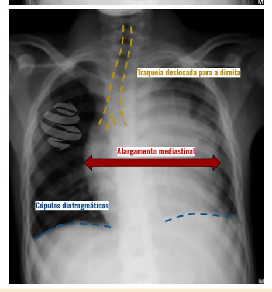
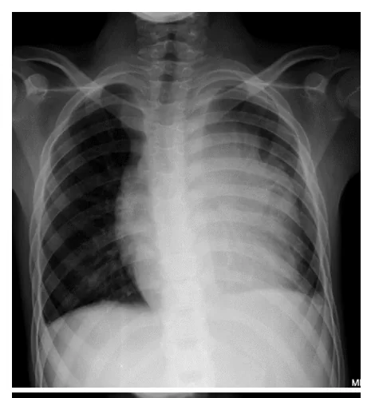
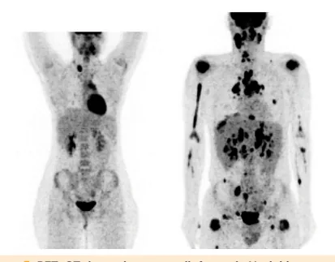
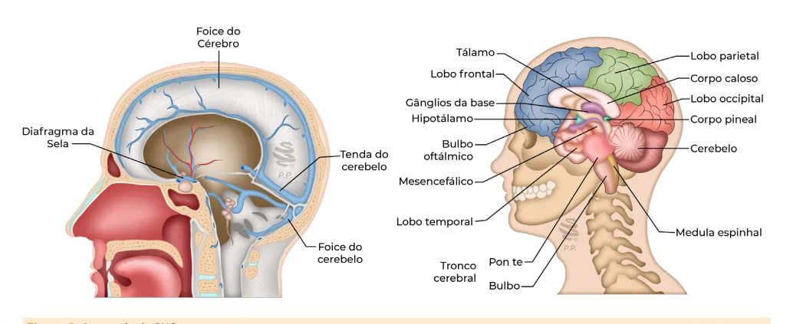
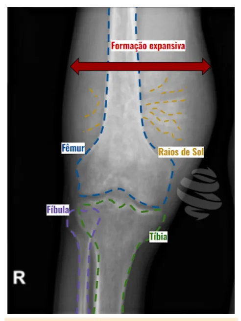
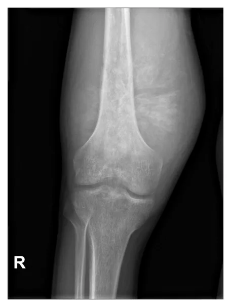

# Neoplasias Pediátricas

<!-- page:1 -->

Neoplasias (PED) LEUCEMIAS

- Sinais e sintomas: febre, perda de peso, sangramento, dor óssea, palidez hepatoesplenomegalia, linfonodomegalia;

- Hemograma: Anemia/plaquetopenia + Leucopenia ou Leucocitose;

- Diagnóstico: mielograma com >25% de blastos;

- Imunofenotipagem: identifica o tipo.

Leucemia Linfoide Aguda

- Mais comum;

- Cura >80% dos casos;

- Fatores de pior prognóstico: idade (<1a e >10a), leucometria inicial (>50/100.000), quantidade de blastos no D8, mutações e translocação t (9;22),

LLA-T, má resposta ao tratamento;

- Tratamento: quimioterapia.

Leucemia Mieloide Aguda

- Mais grave;

- Mais frequente a presença de tumorações ou cloromas: infiltração extramedular de blastos.

LINFOMAS Linfoma de Hodgkin

- Ocorre principalmente em adolescentes;

- Massa tumoral de crescimento progressivo, em geral por contiguidade (principalmente linfonodos cervicais e supraclaviculares);

- Sintomas B: febre, perda de peso e sudorese noturna;

- Diagnóstico: biópsia excisional e PET-CT;

- Tratamento: quimioterapia.

Linfoma Não-Hodgkin

- Pico de incidência: 8 a 10 anos;

- Grupo heterogêneo de doenças com diferença acentuada do ponto de vista histológico, quadro clínico, tipo de tratamento, prognóstico;

- Linfoma de Burkitt, Grandes células / Anaplásico,

Linfoma linfoblástico, PTLD;

- Crescimento rápido e sinais de falência medular;

- Tratamento: quimioterapia.

## TUMORES DE SISTEMA NERVOSO CENTRAL (SNC)

Telencéfalo e Diencéfalo

- Supratentoriais: astrocitomas, ependimomas, oligodendrogliomas, plexo coroide, suprasselar e quiasma óptico;

- Hidrocefalia e hipertensão intracraniana (HIC);

- Crises epilépticas;

- Alteração comportamental e involução do DNPM;

- Diminuição da acuidade visual, nistagmo, estrabismo, olhar do sol poente;

- Diabetes insipidus e retardo puberal;

Fossa posterior, cerebelo e IV ventrículo

- Infratentoriais: meduloblastoma, ependimomas, astrocitomas; Hidrocefalia obstrutiva; | Cefaleia crônica e progressiva ou mudança do padrão; Papiledema; Vômitos matinais; Disfunção cerebelar: ataxia; Lactentes: aumento de perímetro cefálico (PC) e abaulamento de fontanela.

- Tronco: gliomas, astrocitomas, PNET, oligodendroglioma, ganglioglioma Hidrocefalia e hipertensão intracraniana (HIC); Disfunção cerebelar; Déficits motores e de nervos cranianos Alterações comportamentais; Déficit sensitivo.

(estrabismo, perda auditiva); MASSAS ABDOMINAIS Tabela 1: Comparação - neuroblastoma e nefroblastoma.

## NEUROBLASTOMA TUMOR DE WILMS

Crianças < 2 anos Crianças de 3-4 anos Aumento de Hipertensão arterial e catecolaminas urinárias hematúria Não ultrapassa linha Ultrapassa linha média média Sintomas metastáticos Sintomas metastáticos frequentes raros Calcificações frequentes Calcificações raras Distorce cálice Deslocam o rim, envolve pielocalicinal, desloca vasos vasos e pode invadi-los Raro ter malformações Malformações congênitas congênitas associadas Pior prognóstico Melhor prognóstico TUMORES ÓSSEOS Tabela 2: Comparação - osteossarcoma e sarcoma de Ewing.

## OSTEOSSARCOMA

## SARCOMA DE EWING

## (OSTEOGÊNICO)

) Predomínio na 2ª Predomínio na 2ª década década Sintomas localizados Sintomas sistêmicos Dor localizada, Dor localizada, persistente persistente e piora e piora progressiva progressiva Emagrecimento, febre, Sinais flogísticos locais anemia RX: raios de sol RX: casca de cebola Tratamento: Cirurgia + Tratamento: Cirurgia + quimioterapia quimioterapia

---

<!-- page:2 -->

## INTRODUÇÃO À ONCOLOGIA

- Cefaleia e vômitos: tumores de SNC, RMS,

## PEDIÁTRICA neuroblastoma, retinoblastoma

- Massa abdominal: nefroblastoma, hepatoblastoma,

- Oncologia pediátrica representa 2,5% dos casos de neuroblastoma, linfomas, tumor de células câncer no Brasil; germinativas (TCG).

- Sobrevida aumentou significativamente nos últimos 30

- Verificar Figura 1 anos; em centros desenvolvidos, ultrapassa 70%; LLA: leucemia linfoide aguda. SNC: sistema nervoso

- No Brasil, há grandes desigualdades regionais, central. LMA: leucemia mieloide aguda. RMS:

mantendo a média nacional de sobrevida abaixo rabdomiossarcomas. Não-RMS: não rabdomiossarcomas. da esperada; DH: doença de Hodgkin. DNH: doença não Hodgkin.

- Suspeita precoce e encaminhamento rápido são

## NEOPLASIAS HEMATOLÓGICAS

fundamentais para melhorar os resultados.

- Retardo diagnóstico pode trazer diversas complicações: LEUCEMIA LINFOIDE AGUDA (LLA) Maior morbimortalidade, tratamento mais agressivo Epidemiologia e maior dificuldade cirúrgica;

- Neoplasia mais comum na infância: 30% dos cânceres Distúrbios metabólicos e hidroeletrolíticos; em < 15 anos; Compressão mecânica de estruturas vitais

- Pico de incidência: 3 a 5 anos;

(compressão medular, síndrome da veia

- Pode estar associada a outras síndromes: Anemia de cava superior); Fanconi, síndrome de Bloom, de Down, de Kostmann e Metástases; de Blackfan-Diamond. Anemia; Fisiopatologia Dor óssea.

- Susceptibilidade genética + fatores ambientais;

Sinais e sintomas inespecíficos que podem ser de

- Proliferação clonal de células progenitoras linfoides;

neoplasias

- Substituição do parênquima medular e disseminação

- Febre: leucemias, linfomas, neuroblastoma, sarcoma destas células.

de Ewing; Quadro clínico

- Perda de peso: linfomas, neuroblastoma;

- Agudo, de dias a semanas;

- Palidez e fadiga: leucemias, linfomas, neuroblastoma,

- Palidez, astenia, sangramentos mucocutâneos, febre;

sarcoma de Ewing, rabdomiossarcomas (RMS), Wilms;

- Dores ósseas e artralgias (por infiltração medular);

- Linfadenopatia ou massa cervical que não melhora

- Adenomegalias e hepatoesplenomegalia;

com antibioticoterapia;

- Aumento testicular indolor;

- Sangramentos anormais: leucemias e tumores sólidos

- Sintomas neurológicos pela invasão de SNC que infiltram medula óssea (MO); | Exemplos: paralisia facial e sinais de HIC;

- Dor óssea: leucemias, neuroblastoma, tumores ósseos;

- Síndrome da veia cava superior.

Distribuição das neoplasias Distribuição das Neoplasias na faixa etária Pediátrica < 15 anos 15 - 19 anos LLA LMA DH DNH SNC Neuroblastoma Retinoblastoma T. Willms Hepatoblastoma Osteossarcoma T. Ewing RMS Não-RMS Células germinativas Tireóide Melanoma 0 10 20 30 Figura 1: Distribuição de Neoplasias na faixa etária pediátrica.

---

<!-- page:3 -->

Diagnóstico Hemograma (HMG)

- Anemia, trombocitopenia e neutropenia

(muito frequentes);

- Leucometria: 50% dos pacientes apresentam leucometria > 10 mil; 20% apresentam leucometria > 50 mil; Presença de blastos (ausentes em aproximadamente 20% dos casos, e visíveis apenas na medula); Diferenciar blastos de linfócitos atípicos.

Atenção! Em alguns casos o hemograma pode estar normal. Mielograma

- Necessário para confirmação diagnóstica;

Figura 2: Linfonodomegalia cervical. z ≥ 25% de linfoblastos → confirmação de leucemia. Imunofenotipagem

- Determinação da linhagem (B ou T);

- Diferenciação linfoide ou mieloide;

- Útil no controle de doença residual mínima (DRM);

- Citogenética e biologia molecular: possibilita o tratamento direcionado.

Figura 4: Blastos em Medula Óssea. Diagnóstico diferencial da LLA

- Infecções: Vírus (EBV, Citomegalovírus, Toxoplasmose, Dengue, Bactéria no lactente; Leishmaniose e Malária.

HIV, Parvovírus);

- Doenças imunológicas: Púrpura trombocitopênica idiopática (PTI); Artrite Idiopática Juvenil (AIJ) ou Lúpus Eritematoso

Sistêmico (LES).

- Desordens dos macrófagos: Osteopetrose; Linfohistiocitose hemofagocítica (HLH).

- Doenças da Medula Óssea: Aplasia de série vermelha; Neutropenia congênita; Anemia megaloblástica (sempre colher B12 e ácido fólico para a investigação).

- Falência medular:

Figura 3: Radiografia de paciente com LLA com alargamento | Anemia Aplástica Adquirida. de mediastino.

- Tumores sólidos:

---

<!-- page:4 -->

| Neuroblastoma; | A depender da classificação e evolução, pode | Rabdomiossarcoma; ser necessário. | Meduloblastoma;

| Tumor neuroectodérmico primitivo. LINFOMA DE HODGKIN (LH) Tratamento Epidemiologia

- Quimioterapia

- 6ª causa de câncer em crianças (30% dos linfomas Dura aproximadamente 2 anos e é dividida em 3 na infância);

fases: indução, consolidação e manutenção;

- Pico de incidência: na 3ª e 6ª décadas; Determinada de acordo com a classificação

- Países em desenvolvimento: pico antes da de risco. adolescência (raramente < 5 anos);

- Transplante de Medula Óssea (TMO)

- Associado à infecção pelo EBV, Casos refratários e recaídas. HIV e imunodeficiências;

- Fatores de pior prognóstico:

- Um dos tipos do LH é o Post-Transplantation Idade (<1a e >10a); Lymphoproliferative Disease (PTLD). Leucometria inicial (>50.000); Fisiopatologia Quantidade de blastos no D8 Mutações e

- Origem nos sistemas linfático e reticuloendotelial. LLA-T;

translocação t (9;22); Quadro Clínico

- Massa tumoral de crescimento lento e progressivo, Resposta ao tratamento (avaliação após 8 dias). em geral por contiguidade;

- 60% dos casos com acometimento cervical células resistentes e piora o prognóstico. | Indolores, fixos, endurecidos, aderidos; 2/3 dos pacientes com alargamento do mediastino;

Uso prévio de corticoide: mascara o quadro, seleciona ou supraclavicular; LEUCEMIA MIELOIDE AGUDA (LMA) | Também pode acometer de pulmão, fígado, ossos e Epidemiologia medula óssea.

- 15 a 20% das leucemias em menores de 15 anos;

- Sintomas não específicos: fraqueza, anorexia, dor

- Picos de incidência: aos 2 anos, menor pico aos 9 óssea, dor abdominal, prurido;

anos, voltando a subir na adolescência e permanece

- Sintomas B: febre, perda de peso > 10% em 6 meses, estável até 55 anos; sudorese noturna.

- Aumento da incidência de LMA secundária ao Diagnóstico tratamento quimioterápico de outra neoplasia;

- TC de tórax e abdômen;

- Associada à síndrome de Down, anemia de Fanconi,

- Biópsia excisional: confirmação;

Blackfan-Diamond, disceratose congênita e

- Estadiamento:

Li-Fraumeni. | PET-CT; Fisiopatologia | Mielograma;

- Relação com predisposição genética e | Cintilografia com tecnécio (se dor óssea).

exposições ambientais;

- Proliferação clonal de células progenitoras mieloides.

Quadro clínico

- Febre, manifestações hemorrágicas, dor óssea, infecções e palidez;

- Hepatoesplenomegalia e linfonodomegalia;

- Cloroma; Acúmulo extramedular de blastos; Mais frequente em face, órbita, crânio.

- Complicações: sangramentos, leucostasia, lise tumoral, infecções, AVC e priapismo; Subtipo M3 cursa com fenômenos hemorrágicos importantes (CIVD).

Diagnóstico Figura 5: PET-CT de paciente com linfoma de Hodgkin.

- ≥25% de blastos mieloides no sangue periférico ou medula óssea; Tratamento

- Imunofenotipagem para diferenciação do subtipo;

- Quimioterapia;

- Biologia molecular e cariótipo → direcionar

- Transplante Autólogo de Células Tronco → para tratamento específico. possibilitar o uso de quimioterapia mais forte;

Tratamento

- Radioterapia.

- Quimioterapia Mais intensa e mais curta que LLA, mas com menor LINFOMA NÃO-HODGKIN (LNH) chance de cura. Epidemiologia

- TMO

- 3ª neoplasia mais frequente em criança;

---

<!-- page:5 -->

- 5 a 10% das neoplasias pediátricas;

- Supratentorial:

- Pico de incidência 8 a 10 anos; | Telencéfalo (formado pelos ventrículos laterais,

- Imunodeficiências favorecem o seu desenvolvimento. córtex cerebral e corpo caloso);

Fisiopatologia | Diencéfalo (formado pelo tálamo, núcleos da

- Grupo heterogêneo de doenças com diferença base, hipotálamo, glândula pineal, hipófise, nervo histológica e clínica, com diferentes tipos de óptico etc).

tratamento e prognóstico;

- Infratentorial

- Origem nos gânglios linfáticos, a partir de células | Fossa posterior;

precursoras ou maduras. | Cerebelo; Classificação | IV ventrículo.

- Linfoma de Burkitt (relação com EBV);

- Verificar Figura 6

- Linfoma de Grandes células / anaplásico;

- Linfoma linfoblástico (B ou T). QUADRO CLÍNICO

Quadro clínico Os sintomas dependem da região acometida.

- Varia de acordo com sítio acometido; Supratentoriais

- Crescimento rápido e sinais de falência medular. Principais tumores: astrocitomas, ependimomas,

Diagnóstico oligodendrogliomas, do plexo coroide, suprasselar e do

- Biópsia da massa; quiasma óptico;

- Estadiamento

- Hidrocefalia e Hipertensão Intracraniana (HIC); PET / TC tórax, abdome e pelve;

- Sinais localizatórios, como crises epilépticas (início Mielograma e líquor (pesquisar infiltração da abrupto), alteração comportamental, déficit motor medula e SNC). ou sensitivo, involução ou atraso do desenvolvimento

Tratamento neuropsicomotor (DNPM);

- Quimioterapia.

- Redução da acuidade visual, nistagmo, estrabismo, sinal do olhar do sol poente;

## TUMORES DE SNC

- Retardo do crescimento pondero-estatural, diabetes insipidus, atraso puberal.

EPIDEMIOLOGIA Infratentoriais

- 20% das neoplasias na faixa etária pediátrica; Principais tumores: meduloblastoma,

- Principal neoplasia sólida; ependimomas, astrocitomas;

- Localização:

- Hidrocefalia obstrutiva: cefaleia crônica e progressiva 50 a 60% localizados na fossa posterior (10 a 25% ou mudança do padrão, despertar noturno, vômitos, de tronco); irritabilidade e papiledema; 40 a 60% são supratentoriais.

- Disfunção cerebelar (ataxia);

- Não é comum ter metástase.

- Lactentes: aumento do perímetro cefálico (PC) +

Anatomia do SNC abaulamento de fontanela. A tenda do cerebelo divide os tumores em | Sintomas de hidrocefalia menos frequentes.

supra e infratentoriais. Figura 6: Anatomia do SNC.

---

<!-- page:6 -->

Tumores de tronco NEUROBLASTOMA Principais tumores: gliomas, astrocitomas, PNET, Epidemiologia oligodendroglioma, ganglioglioma.

- Neoplasia extracraniana mais frequente na infância

- Déficits motores e de nervos cranianos (estrabismo, (10% das neoplasias);

perda auditiva); | 15% dos óbitos por doença neoplásica. perda auditiva);

- Hidrocefalia e HIC;

- Disfunção cerebelar;

- Alterações comportamentais e déficit sensitivo. F

- DIAGNÓSTICO

- TC ou ressonância magnética (RNM) de crânio;

- Biópsia/Retirada da massa: confirma o diagnóstico e diferencia o tipo de tumor; Q

- Estadiamento: Líquor; RNM de neuroeixo.

## TRATAMENTO

- Urgência: na presença de HIC, fazer derivação ventriculoperitoneal (DVP);

- Cirurgia;

- Radioterapia ou quimioterapia (pode ser feita com transplante autólogo).

## TUMORES ABDOMINAIS

- QUADRO CLÍNICO D

- Maioria assintomática;

- Casos mais avançados: dor associada a crescimento rápido ou obstrução (trato geniturinário - TGU - ou trato gastro intestinal - TGI);

- Sinais de alarme

- Hematúria e HAS;

- Virilização;

- Síndrome de Cushing;

- Aumento do volume testicular;

- Palidez, hematomas;

- Febre, perda de peso, linfonodomegalia e dor generalizada. T

- DIAGNÓSTICO

- USG, TC ou RNM de abdome;

- Mielograma ou biópsia de medula se suspeita de invasão.

## EPIDEMIOLOGIA

- RN 20% das massas são tumores (maioria massa T benigna e retroperitoneal). T

- 1 mês a 1 ano E 40% são alteração do TGU; 40% são tumores (maioria neuroblastoma).

- Acima de 1 ano Predomínio de tumores.

- Incidência dos tumores intra abdominais (mais F comuns em ordem decrescente): Neuroblastoma >

- Nefroblastoma > Hepatoblastoma.

- | 15% dos óbitos por doença neoplásica.

- Maioria abaixo dos 5 anos (30% em <1 ano); Idade média de incidência de 22 meses.

Fisiopatologia

- Migração de células multipotentes para formar sistema nervoso simpático;

- Origem a partir de tecido simpático ou de células neuroendócrinas da adrenal.

Quadro clínico

- Sistêmico! Perda de peso; Hipertensão, irritabilidade, taquicardia; Febre;

- Massa abdominal, distensão abdominal (hepatomegalia);

- Proptose e equimose periorbitária;

- Dor óssea, fratura patológica, dor generalizada;

- Pancitopenia, febre;

- Paralisia facial;

- Mioclonias;

- Nódulos subcutâneos (blueberry muffins);

- Diarreia aquosa prolongada.

Diagnóstico

- Catecolaminas urinárias: ácido vanil-mandélico (VMA) e ácido homovanílico;

- USG/TC de tórax, abdômen e crânio;

- Biópsia da lesão;

- Estadiamento: Cintilografia com MIBG e tecnécio; Mielograma, biópsia de medula óssea.

- Fatores de pior prognóstico: Idade (>18 meses); Estadio 4; Localização abdominal.

Tratamento

- Prognóstico ruim;

- Quimioterapia;

- Outros tratamentos: MIBG terapêutico, Transplante resolução espontânea.

Autólogo, Radioterapia, Isotretinoína, Vacina dendrítica. Em menores de 18 meses pode ocorrer TUMOR DE WILMS Também chamado de Nefroblastoma.

Epidemiologia

- 80% dos casos de massa abdominal antes do 5 anos Maioria entre 3 e 4 anos; Apresentação em menores de 1 ano é rara;

- Associação com malformações genitourinárias e algumas síndromes;

Fisiopatologia

- Parada de diferenciação e proliferação de células mesenquimais renais pluripotentes.

Quadro clínico

- Localizado!

---

<!-- page:7 -->

- Massa abdominal geralmente assintomática;

- Aumento do volume abdominal, com massa palpável,

- Sintomas associados: dor abdominal, astenia, perda de peso, palidez e astenia;

vômitos, febre;

- Apresenta crescimento rápido e normalmente cursa com sinais de falência medular.

Tríade do nefroblastoma: Hematúria (25%); HAS (25%);

## TUMORES ÓSSEOS

Massa abdominal.

- Complicações: trombos tumorais e distúrbios OSTEOSSARCOMA de coagulação. Também chamado de sarcoma osteogênico.

Diagnóstico Epidemiologia

- USG Doppler de abdômen e TC de abdome;

- 8% das neoplasias em crianças e adolescentes;

- Biópsia nem sempre é necessária;

- 60% dos tumores ósseos malignos; Realizar quando não houver resposta à QT inicial, se

- Predomínio na 2ª década, durante estirão paciente < 6 meses ou > 6 anos. da puberdade;

- Estadiamento:

- Associada a outras síndromes genéticas. TC de tórax (investigação de metástases); Fisiopatologia Ecocardiograma.

- Derivado do tecido mesenquimal primitivo, com

Tratamento produção de tecido osteoide e osso imaturo.

- Quimioterapia neoadjuvante, seguida de cirurgia para Quadro clínico retirada da massa, e quimioterapia novamente;

- Dor localizada, persistente e piora progressiva;

- Raramente radioterapia.

- Aumento do volume de local acometido;

- Acomete metáfise de ossos longos (principalmente de

HEPATOBLASTOMA fêmur distal e tíbia proximal); Epidemiologia

- Pode gerar sinais flogísticos locais (calor e eritema) e

- De 6 meses a 3 anos; limitação ao movimento.

- Predomínio no sexo masculino; Diagnóstico

- 80% das neoplasias malignas de fígado na infância;

- RX ósseo: raios de sol;

- 3ª neoplasia abdominal mais frequente na infância;

- TC / RNM óssea (complementam a investigação);

- Associação com prematuridade, baixo peso ao nascer

- Biópsia: confirmar diagnóstico;

e algumas síndromes.

- Estadiamento:

Fisiopatologia | TC de tórax (pulmão é o principal sítio

- Tumor embrionário com origem em células de metástase);

pluripotentes do fígado fetal. | Cintilografia óssea (em busca de outros Quadro clínico ossos acometidos).

- Massa abdominal ou hepatomegalia identificada

- Verificar Figura 7 na próxima página.

ao acaso;

- Massa grande e multinodular, mas pode haver Tratamento lesões multifocais;

- Quimioterapia neoadjuvante, seguida de cirurgia local

- Anorexia, perda de peso, desconforto e nova quimioterapia;

abdominal e anemia;

- Metastasectomia, quando necessário.

- Raramente: icterícia e disfunção hepática, alterações de coagulação e trombocitose; SARCOMA DE EWING

- Complicação: rotura e sangramento intraperitoneal, Epidemiologia com abdome agudo e choque hipovolêmico.

- Tumor raro (1,2% das neoplasias em menores de

Diagnóstico 18 anos);

- Elevação de alfafetoproteína;

- Maioria dos casos na 2ª década de vida;

- USG de abdome: caracterização da massa, localização

- 50% em esqueleto axial e 50% em extremidades.

e acometimento vascular; Fisiopatologia

- RNM de abdome;

- Origem a partir de mesoblasto.

- Biópsia hepática: fecha o diagnóstico; Quadro clínico

- Estadiamento: TC de tórax (metástases pulmonares

- Quadro sistêmico! em até 20% dos casos). | Emagrecimento, febre e anemia.

Tratamento

- Dor localizada, persistente e piora progressiva;

- Quimioterapia neoadjuvante, seguida de

- Aumento do volume de local acometido;

cirurgia de ressecção ou transplante hepático, e

- Limitação ao movimento ou sintomas de nova quimioterapia. compressão neurológica;

Diagnóstico LINFOMA NÃO HODGKIN

- RX ósseo: achado típico de casca de cebola;

Diagnóstico diferencial das massas abdominais

- TC / RNM óssea para maior detalhamento;

- Relacionado a transplantes de órgãos sólidos;

- Biópsia para confirmação diagnóstica;

---

<!-- page:8 -->

Figura 8: Sinal da casca de cebola, presente no sarcoma de Ewing. Tratamento

- Quimioterapia neoadjuvante, seguida de cirurgia ou radioterapia, e nova quimioterapia.

## REFERÊNCIAS

Figura 1: Distribuição de Neoplasias na faixa etária pediátrica. Adaptado de inca.gov.br Figura 2: Linfonodomegalia cervical.

Acervo Pessoal. Figura 3: Radiografia de paciente com LLA com alargamento de mediastino. Acervo Pessoal.

Figura 4:: Blastos em Medula Óssea. Acervo Pessoal Figura 5: PET-CT de paciente com linfoma de Hodgkin.

Acervo Pessoal. Figura 7: Sinal de raios de sol, presente no osteossarcoma. Figura 7: Sinal de raios de sol, presente no osteossarcoma. Qureshi P, Osteosarcoma. Case study, Radiopaedia.org (Accessed on 02 Jun 2025) https://doi.org/10.53347/rID-69332

- Estadiamento: Figura 8: Sinal da casca de cebola, presente TC de tórax; no sarcoma de Ewing. Cintilografia óssea com tecnécio; Gaillard F, Ewing sarcoma - distal femur. Case study, Radiopaedia.org Mielograma/biópsia de medula óssea. (Accessed on 02 Jun 2025) https://doi.org/10.53347/rID-7844

