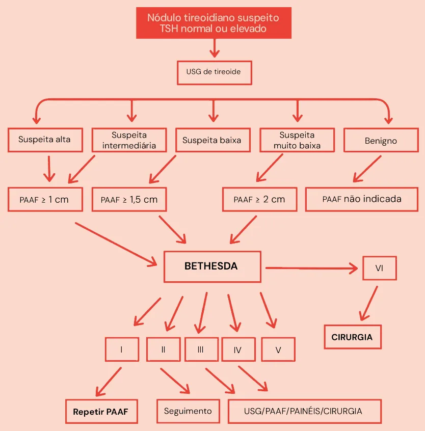

# Nódulos e Câncer de Tireoide

<!-- page:1 -->

## Nódulos Tireoidianos

### Epidemiologia

- **Prevalência**: 3-7% na população;
- **Comum em**: mulheres, idosos, exposição à radiação e deficiência de iodo;
- **Maioria**: assintomáticos e incidentalomas.

### Etiologias

- **Cistos coloides e tireoidites**: 80%;
- **Neoplasias foliculares benignas**: 15%;
- **Carcinomas**: 5-10%.

### Investigação Inicial

- **USG de tireoide**: SEMPRE;
- **TSH e T4 livre**: SEMPRE;
- **Nódulo funcionante** → Cintilografia;
- **Nódulo frio** → avaliar PAAF (Punção Aspirativa por Agulha Fina).

### Preditores de Malignidade (Clínicos)

- **Sexo masculino**;
- **Extremos de idade**;
- **Crescimento rápido**;
- **Sintomas compressivos**;
- **Portadores de doença autoimune da tireoide**;
- **História familiar de malignidade**;
- **Síndromes genéticas**.

### Preditores de Malignidade ao USG

- **Hipoecogênico**;
- **Microcalcificações**;
- **Mais alto que largo**;
- **Contornos irregulares**;
- **Extensão extratireoidiana** ou invasão de cápsula;
- **Linfonodo suspeito**.

---

<!-- page:2 -->

## Sistema TI-RADS (Thyroid Imaging Reporting and Data System)

- Avalia o nódulo de acordo com:
  - Composição
  - Ecogenicidade
  - Forma
  - Margem
  - Focos ecogênicos

### Tabela 1: Classificação TI-RADS

| Critério | 0 pontos | 1 ponto | 2 pontos | 3 pontos |
|---|---|---|---|---|
| **Composição** | Totalmente cístico | Espongiforme | Misto (cístico-sólido) | Totalmente sólido |
| **Ecogenicidade** | Anecogênico | Hipereclóico ou isoeclóico | - | Muito hipoeclóico |
| **Forma** | - | Mais largo que alto | - | Mais alto que largo |
| **Margem** | Regular | - | Mal definida | Lobulada ou irregular |
| **Focos ecogênicos** | Nenhum ou grandes artefatos em cauda de cometa | - | Calcificações periféricas | Microcalcificações pontiformes |

**Interpretação e Conduta:**

| Pontuação | Classificação | Risco de Malignidade | Conduta |
|---|---|---|---|
| 0 ponto | TI-RADS 1 | 0-3% | Seguimento clínico |
| 2 pontos | TI-RADS 2 | 0-3% | PAAF não é necessária |
| 4-6 pontos | TI-RADS 3 | 5-15% | ≥ 1,5 cm: aspiração ou acompanhamento |
| 4-6 pontos | TI-RADS 4 | 15-30% | ≥ 1,0 cm: aspiração; painel molecular ou cirurgia |
| ≥ 7 pontos | TI-RADS 5 | 97-99% | ≥ 1,0 cm: aspiração; ≥ 0,5 cm: cirurgia |

### Indicações de PAAF pelo USG

- Quanto maior o risco, menor o corte de tamanho do nódulo para indicar a PAAF:
  - **Nódulos de alta suspeita** (se ≥ 1 cm): risco de > 70-90%; puncionar independente do tamanho se várias características abaixo:
    - Hipoecogênico;
    - Microcalcificações;
    - Mais alto que largo;
    - Contornos irregulares;
    - Extensão extratireoidiana ou invasão de cápsula;
    - Linfonodo suspeito.
  - **Nódulos de suspeita intermediária** (se ≥ 1 cm): risco entre 10-20%;
    - Nódulo sólido hipoecoico;
    - Sem microcalcificações;
    - Sem ser mais alto que largo;
    - Sem extensão extratireoidiana.
  - **Nódulos de baixa suspeita** (se ≥ 1,5 cm): risco entre 5-10%;
    - Hiper ou isoecogênico;
    - Margens regulares;
    - Misto (cístico-sólido).
  - **Nódulos de suspeita muito baixa** (se ≥ 2 cm): risco < 3%;
    - Cisto coloide (não puncionar): risco < 1%;
    - Espongiforme, parcialmente cístico;
    - Benigno.

## Sistema Bethesda

- Útil para classificação do nódulo e direcionamento para conduta após a punção.

### Tabela 2: Classificação de Bethesda

| Categoria | Achados | Risco de Malignidade | Conduta |
|---|---|---|---|
| **I** | Amostra insatisfatória; não diagnóstica | - | Repetir punção |
| **II** | Benigno | 0-3% | Seguimento clínico |
| **III** | Atipia ou lesão folicular de significado indeterminado | 5-15% | Repetir PAAF; painel molecular |
| **IV** | Suspeita ou neoplasia folicular | 15-30% | Painel molecular ou cirurgia |
| **V** | Suspeito de malignidade | 60-75% | Cirurgia |
| **VI** | Maligno | 97-99% | Cirurgia |

---

<!-- page:3 -->

## Câncer de Tireoide

### Classificação Geral

**Derivados de células foliculares (90%):**
- Bem diferenciado: papilífero, folicular e de células de Hürthle;
- Indiferenciado: anaplásico.

**Derivados de células parafoliculares (3-4%):**
- Carcinoma medular.

**Outras células (≈ 5%):**
- Linfomas, sarcomas, metástases, teratomas e hemangioendoteliomas.

### Tabela 3: Comparação de Tipos de Câncer de Tireoide

| Características | Papilífero | Folicular | Medular | Anaplásico |
|---|---|---|---|---|
| **Idade típica** | Todas | > 40 anos | Todas | Idosos |
| **Crescimento** | Lento | Lento | Moderado | Rápido |
| **Perfil hormonal** | Eutireoideo | Eutireoideo | Pode elevar calcitonina | Eutireoideo |
| **Metástases linfonodal** | 25% cervicais | Raramente | Frequentes | Frequentes |
| **Metástases a distância** | 5% | Distância (pulmonar, óssea) | Presente | Presente (pulmões) |
| **Invasão extratireoidiana** | 20% | Possível | Possível | Precoce |
| **Prognóstico** | Bom | Bom | 20-90% de sobrevida em 10 anos | Péssimo (> 90% de letalidade) |

### Carcinoma Papilífero

- **Representa**: 80% dos casos;
- **Idade típica**: entre 3ª-5ª década de vida;
- **Características**: crescimento lento e baixo grau de progressão;
- **Prognóstico**: bom;
- **Metástases**:
  - 25% cervicais;
  - 5% metástases a distância;
  - 20% invasão extratireoidiana.

### Carcinoma Folicular

- **Representa**: 10% dos casos;
- **Idade típica**: em geral, na 5ª década de vida;
- **Características**: bom prognóstico, história natural: achado casual de nódulo único na tireoide de longa duração;
- **Apresentação**: nódulo sólido hipoecóico sem microcalcificações, sem ser mais alto que largo, sem extensão extratireoidiana;
- **Metástases**: à distância (pulmonar ou óssea).

### Carcinoma Medular (CMT)

**Esporádico (75-80% dos casos):**
- 5ª-6ª década de vida;
- Mais indolente e solitário;
- Crescimento recente de um nódulo.

**Familiar (20-25% dos casos):**
- **NEM2A** (55-80%):
  - Demonstra associação com feocromocitoma e hiperparatireoidismo primário.
- **NEM2B** (5%):
  - Tem associação com feocromocitoma, ganglioneuromatose, hábito marfanoide e anormalidades oculares (< 10 anos).

**CMT familiar isolado (15-35%):**
- Medular isolado em duas ou mais gerações da família (3ª década).

**Características gerais:**
- Cursa com **metástases linfonodais, fígado, pulmão e ossos**;
- Tumor agressivo.

### Carcinoma Anaplásico

- **Tipo mais grave**: muito agressivo e menos comum;
- **Epidemiologia**: frequente em idosos;
- **Crescimento**: rápido e invasão local precoce — frequentemente requer traqueostomia;
- **Metástases**: para linfonodos cervicais e à distância (pulmões);
- **Prognóstico**: péssimo.

