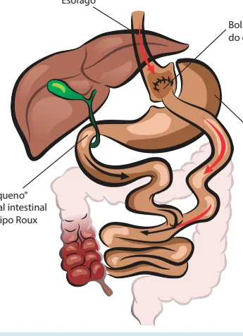
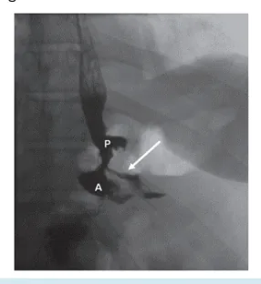
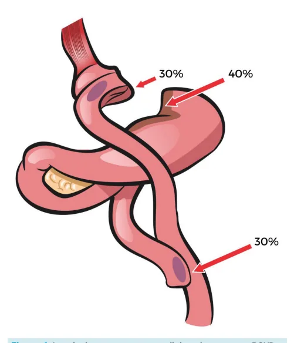
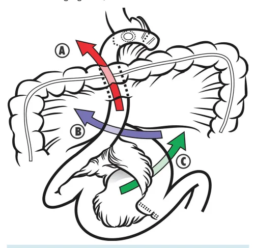
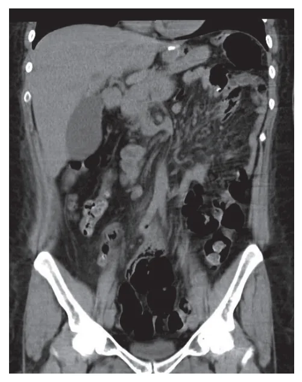
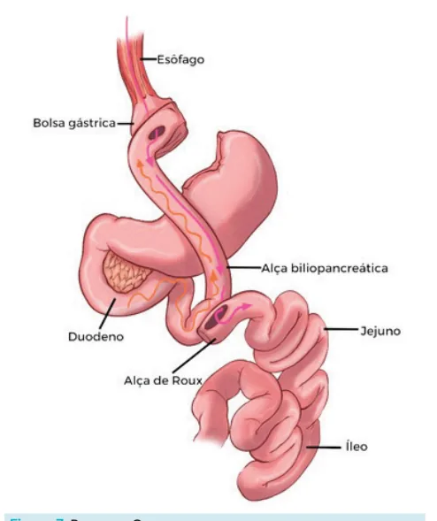
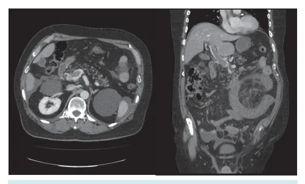

# Obesidade: Complicações Pós-Bariátrica

<!-- page:1 -->

## Resumo — Complicações Pós-Bariátrica

**Bypass (BGYR)**

- Fístula pós-bypass gástrico;
- Sangramento do TGI;
- Obstrução do TGI: hérnia interna; brida;
- Reconstrução incorreta da alça em Y de Roux.

**Sleeve**

- Fístula pós-gastrectomia vertical;
- Estenose da incisura angular;
- Sangramento da linha de grampo;
- Trombose de veia porta.

## Complicações Pós-Bypass Gástrico em Y de Roux (BGYR)

*Figura 1: Bypass gástrico em Y de Roux — esôfago, bolsa proximal do estômago, estômago excluso, "pequeno" canal intestinal do tipo Roux.*

## Fístula/Deiscência

- Abertura da linha de grampo/sutura com extravasamento de conteúdo do TGI para outro local (cavidade abdominal/meio externo);
- Mais comum após o 5º pós-operatório (PO);
- **Localização**:
  - Gastrojejunostomia – 67,8%;
  - Bolsa gástrica – 10,2%;
  - Estômago excluso – 3,4%;
  - Anastomose jejunojejunal – 5%;
  - Gastrojejunostomia e na bolsa – 3,4%;
  - Bolsa mais estômago excluído – 3,4%;
  - Local indeterminado – 6,8%.
- **Sinais e sintomas**:
  - Taquicardia (mais precoce);
  - Exame físico não é confiável, devido ao panículo adiposo;
  - Suspeita na prova: derrame pleural + distensão abdominal;
  - Alteração do dreno.
- **Exames**:
  - Tomografia de abdome e pelve com contraste EV e azul de metileno VO;
  - Estudo esofagogastroduodenal (EED) com contraste iodado VO.
- **Tratamento**:
  - Paciente estável: jejum + nutrição parenteral total (NPT); antibioticoterapia; hidratação; drenagem (através do dreno, se contempla a coleção, ou drenagem percutânea por radiologia intervencionista); papel importante do vácuo endoscópico.
  - Paciente com piora hemodinâmica: todas as etapas clínicas acima + cirurgia (de preferência por laparoscopia) para drenagem e lavagem da cavidade.

*Figura 2: Fístula entre pouch e cavidade, com contraste indo para a cavidade.*

---

<!-- page:2 -->

## Hérnia Interna

- **Definição**: protrusão do intestino através de um defeito dentro da cavidade abdominal;
- Tardia — passagem de conteúdo de alça por algum espaço que não existiria normalmente.

*Figura 3: EDA com visualização de cavidade (A) e após vácuo endoscópico (B).*

- A suspeita é clínica — na suspeita de hérnia interna e tomografia sem alterações, devemos proceder com uma laparoscopia para checar as brechas;
- **Principais locais de ocorrência**:
  - A. Hérnia pela alça alimentar e a brecha no mesocólon transverso (atualmente sobe-se a alça alimentar pré-mesocólon);
  - B. Hérnia de Petersen, entre o mesocólon transverso e o mesentério da alça alimentar;
  - C. Hérnia entre o mesentério da alça biliopancreática e o da alça alimentar.
- **Sintomas obstrutivos intermitentes**: o intestino delgado pode intermitentemente tornar-se preso e, em seguida, voltar para o local habitual (sintomas sutis de obstrução intestinal);
  - Náuseas e vômitos;
  - Dor abdominal pós-prandial (geralmente no quadrante superior esquerdo).
- **Diagnóstico tomográfico**: mesmo com TC normal, pode ser necessária a videolaparoscopia;
- **Achados tomográficos**:
  - Twist no mesentério;
  - Distensão no delgado;
  - Alças em fossa ilíaca esquerda e mais próximas da parede abdominal;
  - Distensão do estômago excluso;
  - Anastomose entero-entero à direita;
  - Linfadenite mesentérica (aumento dos linfonodos + meso ingurgitado).

*Figura 5: Hérnias internas no BGYR.*

## Sangramento Após BGYR

- **Locais**: estômago excluso; bolsa gástrica; gastrojejunoanastomose; jejunojejunoanastomose;
- **Intraluminal x intraperitoneal**:
  - Intraluminal: o paciente vai ter sintomas de HDA — hematêmese ou melena;
  - Intraperitoneal: sangue no dreno, instabilidade hemodinâmica.
- Normalmente autolimitado, principalmente os tardios;
- Se intraperitoneal + piora hemodinâmica: cirurgia — preferência videolaparoscópica; retirar coágulos, lavagem e hemostasia;
- Se intraluminal + piora hemodinâmica ou hematêmese/sangramento abundante: endoscopia — coagulação térmica; injeção de vasoconstritores; clipagem.

*Figura 4: Locais de sangramento nas linhas de sutura no BGYR.*

---

<!-- page:3 -->

*Figura 6: BGYR com hérnia interna.*

## Reconstrução Incorreta do Y de Roux (Roux-em-O)

- Anastomose inadvertida da alça biliopancreática proximal do jejuno para a bolsa gástrica, em conjunto com a jejunojejunoanastomose deslocada;
- Difícil diagnóstico pós-operatório.

*Figura 7: Roux-en-O.*

## Complicações Pós-Gastrectomia Vertical

*Figura 8: Gastrectomia vertical.*

## Fístula Após Gastrectomia Vertical

- **Ângulo de Hiss**: mais comum — associado a estenose do antro;
- **Antro** (mais espesso): na linha de grampo.
- **Tratamento**:
  - Prótese endoscópica;
  - Vácuo endoscópico;
  - Se distal (antro): bypass ou mini gastric bypass.

---

<!-- page:4 -->

## Estômago em Ampulheta — Estenose na Incisura Angular

- Relacionado ao rápido emagrecimento.
- **Tratamento**:
  - Dilatação endoscópica;
  - Prótese autoexpansível metálica recoberta;
  - Bypass gástrico;
  - G-POEM (Gastric Peroral Endoscopic Myotomy);
  - Mini Gastric Bypass.

## Sangramento da Linha de Grampo

- Intraluminal x intraperitoneal;
- Mesmo princípio de tratamento do sangramento pós-bypass;
- Muitos cirurgiões defendem sobressutura da linha de grampeamento.

## Trombose da Veia Porta

- Mais correlacionada com gastrectomia vertical;
- Possível alteração do fluxo portal pela gastrectomia (desidratação pós-operatória);
- Lesão térmica da veia esplênica.

*Figura 9: Trombose de veia porta.*

## Outras Complicações

- **TEP**: risco aumentado até 90 dias de pós-operatório.
- **Rabdomiólise (IRA)**: relacionada ao tempo cirúrgico e ao peso do paciente.
- **Carência de vitaminas e ferro** (mais comum no BGYR): disabsortivos; repor:
  - Vitamina B12;
  - Vitaminas A e D;
  - Carbonato de cálcio;
  - Sulfato ferroso;
  - Ácido fólico.
- **Litíase renal** (mais comum no BGYR): alteração da absorção do oxalato de cálcio, devido ao desvio do trânsito.
- **Colelitíase**: relacionada ao rápido emagrecimento.
  - Coledocolitíase: em pacientes que realizaram BGYR, o tratamento deve ser via CPRE transgástrico, preferencialmente por VLP;
  - Se colangite: DTPH (dreno transparieto-hepático).
- **Dumping** (mais comum no BGYR): sintomas vasovagais — náuseas, diarreia, flushing, sudorese, irritabilidade, tremores; associados a alimentos ricos em açúcar e gorduras; passagem rápida do alimento do estômago para o intestino delgado.
  - **Dumping precoce**: ocorre até 30 minutos após a alimentação; manifestações gastrointestinais + vasomotoras, devido à distensão + reflexo vasovagal.
  - **Dumping tardio**: ocorre após 3 horas da alimentação → alta liberação de insulina → hipoglicemia; predomínio de manifestações vasomotoras; tratamento: dieta fracionada, diminuir dose de carboidratos, acarbose ou octreotide.

## Referências

Figura 2: Fístula entre pouch e cavidade com contraste indo para a cavidade. MARTIN, M. Acute care surgery emergencies in the bariatric patient: syllabus. 2015. Disponível em: https://www.east.org/content/documents/43_bariatric_syllabus.pdf. Acesso em: 15 jul. 2025.

Figura 3: EDA com visualização de cavidade (A) e após vácuo endoscópico (B). PÉRISSÉ, L. G. S.; PÉRISSÉ, P. C. M.; BERNARDO JÚNIOR, C. Endoscopic treatment of the fistulas after laparoscopic sleeve gastrectomy and Roux-en-Y gastric bypass. Revista do Colégio Brasileiro de Cirurgiões [Internet], v. 42, n. 3, p. 159–164, jun. 2015. Disponível em: http://dx.doi.org/10.1590/0100-69912015003006. Acesso em: 15 jul. 2025.

Figura 6: BGYR com hérnia interna. DI MUZIO, B.; CAMPOS, A.; KOGAN, J.; et al. Petersen hernia. Radiopaedia [Internet], 15 jun. 2011. Disponível em: https://doi.org/10.53347/rID-14014. Acesso em: 16 jul. 2025.

Figura 9: Trombose de veia porta. HUDSON, S. Mesenteric venous thrombosis and small bowel ischemia. Radiopaedia [Internet]. Caso clínico publicado em: 2 set. 2017. Disponível em: https://doi.org/10.53347/rID-55326. Acesso em: 16 jul. 2025.

