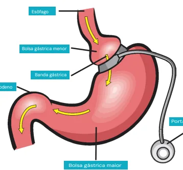
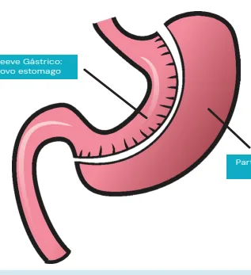
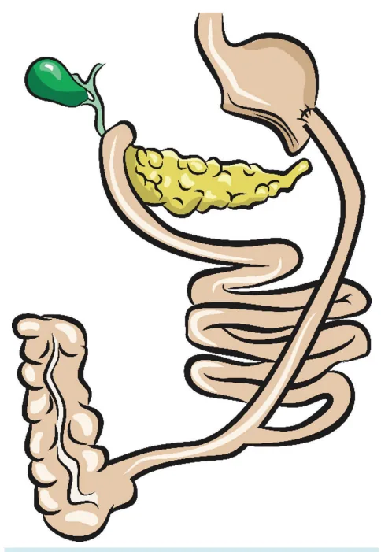
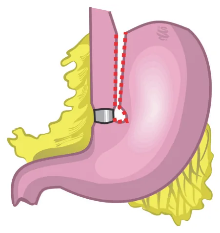

# Obesidade Procedimentos Cirúrgicos

<!-- page:1 -->

## OBESIDADE: PROCEDIMENTOS

## CIRÚRGICOS

Obesidade (CIR) Bypass Diabetes Tipo 2 Síndrome Metabólica DRGE Superobesos → Cirurgia mais realizada no BR (está mudando)

## PROCEDIMENTOS RESTRITIVOS

- Diminuem a capacidade do estômago por restrição mecânica à passagem de alimentos;

- Exemplos: balão gástrico, banda gástrica, gastrectomia vertical, gastroplastia tipo Mason.

BALÃO GÁSTRICO Figura 1: Balão gástrico Balão de água: Por endoscopia;

- Máximo 6 meses;

- Ponte para outra cirurgia;

- Pontos negativos: paciente fica bastante sintomático, com sensação de empachamento, náuseas e vômitos.

Além disso, no momento da retirada do balão o risco de broncoaspiração é significativo, com necessidade de proteção de via aérea.

## BANDA GÁSTRICA

- Anel para restringir a passagem do alimento;

- Muito utilizada no passado, atualmente não mais utilizada, pois os pacientes cursam com disfagia e complicações da banda;

- Dispositivo subcutâneo (portal para ajuste da banda);

- Obstrução crônica desencadeia complicações: Extrusão da banda gástrica; pseudoacalásia;

- Pouco realizada no mundo. Gastrectomia Vertical intensa, DII)

Extremos de Idade (jovens e Idosos) Hérnia Incisional Gigante Osteoporose Esteatose pós Transplante hepático Uso de Anticoagulantes Comorbidades Graves (Hepatopatia, DRC, Anemia SuperSuperobesos (procedimento ponte)

→ Cirurgia mais realizada nos EUA. Esôfago Bolsa gástrica menor

Duodeno Portal de acesso Bolsa gástrica maior Figura 2: Banda gástrica

## GASTRECTOMIA VERTICAL OU SLEEVE

Sleeve Gástrico: Novo estomago Parte do Estômago Removida Figura 3: Gastrectomia vertical ou Sleeve Mais realizada no mundo;

- Confecciona um tubo gástrico;

---

<!-- page:2 -->

- Efeito êntero-hormonal importante: Aumenta GLP 1; Aumenta peptídeo Y; Diminui Grelina.

## GASTROPLASTIA VERTICAL TIPO MASON

- Não é mais realizada.

Figura 4: Gastroplastia vertical tipo Mason PROCEDIMENTOS P

## PREDOMINANTEMENTE

## DISABSORTIVOS – DERIVAÇÕES

## BILIOPANCREÁTICAS

- - Diminuem a absorção de nutrientes por meio da alteração da absorção de nutrientes no intestino delgado;

- Exemplos: derivações biliopancreáticas - duodenal switch, Scopinaro.

## CIRURGIA DE SCOPINARO

- Gastrectomia distal + anastomose em Y de Roux, com alça comum pequena (íleo distal), geralmente de 50 cm;

- Complicações: Diarreia crônica; Supercrescimento bacteriano; Desnutrição.

## DUODENAL SWITCH

- Gastrectomia vertical + grampeamento da primeira porção do duodeno;

- Menos disabsortiva que a cirurgia de Scopinaro, mas ainda traz complicações importantes como supercrescimento bacteriano, desnutrição e diarreia crônica;

- Anastomose da primeira porção duodenal com o jejuno (alça alimentar de 150 cm);

- Enteroenteroanastomose entre a alça alimentar e a biliopancreática a 100 cm da válvula ileocecal. Figura 5: Cirurgia de Scopinaro

## PROCEDIMENTOS MISTOS

## BYPASS GÁSTRICO Y DE ROUX (FOBI –

## CAPELLA)

- Pouch gástrico pequeno – Aproximadamente 40 ml;

- Anastomose Y de Roux;

- Alça alimentar com aproximadamente 100 cm;

- Alça biliopancreática com aproximadamente 100cm.

Figura 6: Bypass gástrico em Y de Roux Esôfago Bolsa proximal do estôomago Parte excluída do estômago Alça biliopancreática Figura 7: Bypass gástrico em Y de Roux

---

<!-- page:3 -->

## MINI GASTRIC BYPASS INDICAÇÕES, VANTAGENS

- Pouch gástrico de aproximadamente 30 ml; E DESVANTAGENS ENTRE

- Anastomose pouch-jejunal a 100 cm do ângulo AS PRINCIPAIS TÉCNICAS:

de Treitz;

## GASTRECTOMIA VERTICAL E O

- Não há enteroenteroanastomose;

- Não há enteroenteroanastomose;

- Pode ter refluxo bilioso e desencadear úlcera.

Novo estômago Parte do estômago Bypasseado Parte do intestino Bypasseado Figura 8: Mini gastric bypass

## CIRURGIA DE SANTORO

- Gastrectomia vertical com bipartição do trânsito intestinal;

- Reduz o risco de deficiência de vitaminas.

## TRANSPOSIÇÃO ILEAL + GASTRECTOMIA

## VERTICAL

- Promove aumento de hormônios hiporexígenos e GLP-1;

- Bom controle DM;

- Não é tão comum.

Tabela 2: Vantagens e desvantagens entre a gastrectomia vertica

## Bypass

Vantagens: Controle de DM; Controle do Refluxo; Maior perda de peso sustentada. Desvantagens: Duas anastomoses;

Risco de hérnia interna; Risco de deiscência e fístulas; Desabsorção (hipovitaminose e anemia); Maior curva de aprendizado. GASTRECTOMIA VERTICAL E O

Tabela 1: Indicações, vantagens e desvantagens entre a gastrectomia vertical e o bypass Bypass Gastrectomia Vertical Extremos de Idade Diabetes Tipo 2 (jovens e Idosos)

Síndrome Metabólica Hérnia Incisional Gigante DRGE Osteoporose Esteatose pós Transplante Superobesos hepático → Cirurgia mais realizada Uso de Anticoagulantes no BR (está mudando)

Comorbidades Graves (Hepatopatia, DRC, Anemia intensa, DII) Super Superobesos (procedimento ponte) → Cirurgia mais realizada nos EUA.

- Verificar Tabela2 al e o bypass

Gastrectomia Vertical Vantagens: Cirurgia mais rápida; Menos Complicações; Não há risco de hérnia interna;

Menos disabsortiva; Facilidade técnica. Desvantagens: Menor perda de peso / Reganho; Menor controle do DM;

DRGE.
