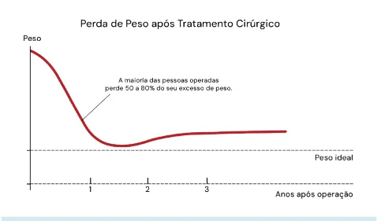
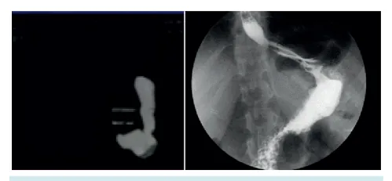

# Obesidade Reganho de peso

<!-- page:1 -->

Obesidade

## Reganho maciço

| Ganho de 50% do excesso de peso perdido.

## Investigação

| EDA; | EED; | TC com volumetria gástrica; | Cintilografia de esvaziamento gástrico.

## SUCESSO DA CIRURGIA

## BARIÁTRICA

- Perda de 50% do excesso de peso e manutenção por 2 anos;

- Nadir do peso ocorre entre 18 – 24 meses da cirurgia;

- Tendência fisiológica de reganho de 10% do peso após a cirurgia;

Figura 1: Curva normal do paciente pós bariátrico. Perda de peso grande no início, nadir em 18-24 meses, após paciente ganha um pouco de peso (diminuição do efeito enterohormonal) com ganho de cerca de 10% do peso

## REGANHO DE PESO

- Ganho de 50% do excesso de peso perdido, devemos investigar causas funcionais e causas anatômicas.

## CAUSAS FUNCIONAIS

- Comportamento alimentar (Beliscador);

- Perda tardia do estímulo entero-hormonal Metabolismo hormonal prejudicado → Análogo de Comportamento alimentar de compulsão →

(Menor metabolismo): GLP-1 – LIRAGLUTIDA; Tratamento da compulsão alimentar – TOPIRAMATO. CAUSAS ANATÔMICAS

- Tubo gástrico com excesso de fundo e antro após gastrectomia vertical.

- Fístula gastro-gástrica (Pouch gástrico e estômago excluso);

- Remanescente gástrico grande: Esvaziamento do estômago lentificado;

- Alça comum longa: menor efeito disabsortivo do bypass. - Causas anatômicas Remanescente gástrico grande; Fístula gastro-gástrica (estômago excluso no trânsito); Alça comum longa - difícil diagnóstico.

- EDA;

- EED;

- TC com volumetria gástrica;

- Cintilografia de esvaziamento gástrico.

Figura 2: Excesso de fundo e antro após gastrectomia vertical. Diminuição do efeito enterohormonal. Investigação com EDA +/EED, TC com volumetria gástrica ou cintilografia de esvaziamento gástrico (com retenção de alimento). Para prevenir tal complicação, na cirurgia se passa sonda de Fouchet para guiar linha de grampeamento Figura 3: Remanescente gástrico grande (esvaziamento do estômago lentificado).

## TRATAMENTO - CAUSAS ANATÔMICAS

- Tubo gástrico com excesso de fundo: Reconfecção do tubo gástrico; Bypass.

O.

- Fístula gastro-gástrica (pouch gástrico e estômago excluso): Cirurgia, com secção e rafia da fístula;

- Remanescente gástrico grande: Bypass; Repouch;

- Alça comum longa: Investigação: TC com contraste ou Enteroscopia; Recontagem da alça e enteroenteroanastomose distal.

---

<!-- page:2 -->

## REFERÊNCIAS

Figura 2: Excesso de fundo e antro após gastrectomia vertical. Diminuição do efeito enterohormonal. Investigação com EDA +/EED, TC com volumetria gástrica ou cintilografia de esvaziamento gástrico (com retenção de alimento). Para prevenir tal complicação, na cirurgia se passa sonda de Fouchet para guiar linha de grampeamento Mercedes Sánchez Sánchez (1), Tina Sanai (1); João Maia Teixeira (1)

Figura 3: Remanescente gástrico grande (esvaziamento do estômago lentificado) Mercedes et. al. Revisional surgery for high suspicion of late gastro-gastric fistula.
