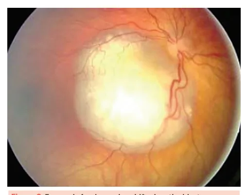
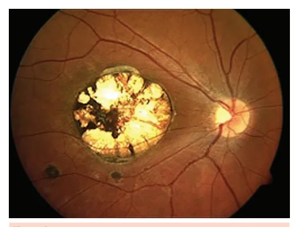
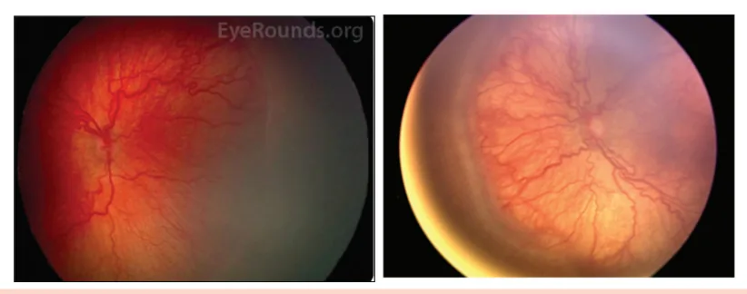
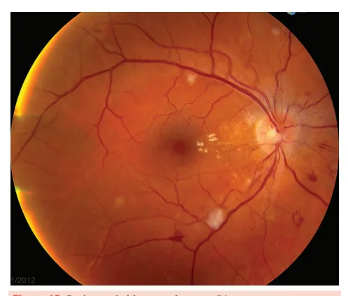
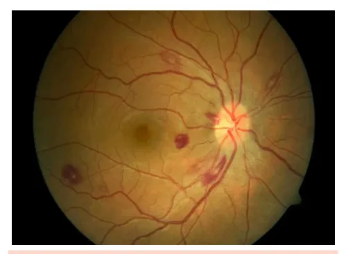
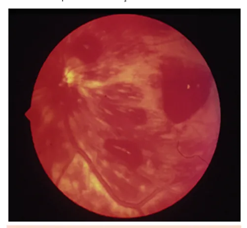
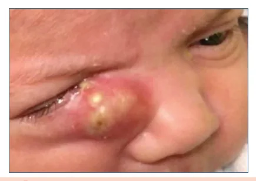
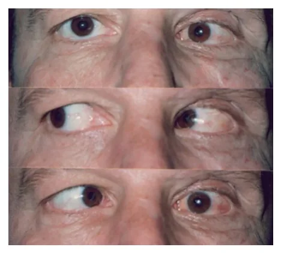
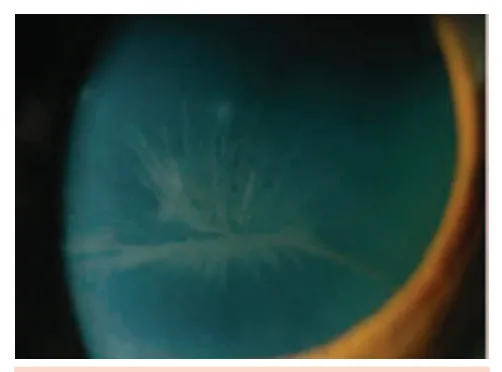

# Oftalmologia em Doenças Clínicas Parte II

<!-- page:1 -->

## Pediatria

### Teste do Olhinho (Reflexo Vermelho)

- **Teste do olhinho (reflexo vermelho):** obrigatório nas primeiras **72 horas** de vida;
- **Exame obrigatório** no berçário (antes da alta);
- Repetido pelo menos **3 vezes** nos 3 primeiros anos de vida;
- É realizado pelo pediatra, a **30 cm** do recém-nascido, em sala escura, um olho por vez, utilizando oftalmoscópio direto;
- **Objetivo:** triagem para diversas patologias oculares;
- Se houver perda da transparência em qualquer estrutura ocular, o reflexo normal, vermelho e simétrico irá alterar, tornando-se branco (**leucocoria**);
- Se o reflexo for alterado (leucocoria) ou houver dúvida, deve-se encaminhar o recém-nascido ao oftalmologista.

**Leucocoria indica patologia ocular grave.**

### Etiologias da Leucocoria

- **Catarata congênita**;
- **Glaucoma congênito**;
- **Alterações retinianas**;
- Opacidades corneanas;
- **Retinoblastoma** (mais comum);
- Erro refrativo;
- Estrabismo.

*Figura 1: Leucocoria à esquerda.*

### Retinoblastoma

- **Tumor intraocular maligno mais frequente da infância**;
- Cursa com **leucocoria (60%)**, **estrabismo (20%)**, inflamação orbitária mimetizando celulite pós ou pré-septal;
- **Tratamento inclui:** enucleação, quimioterapia, laser, fotocoagulação, crioterapia.

*Figura 2: Exame de fundoscopia evidenciando retinoblastoma próximo ao nervo óptico.*

### Toxoplasmose Congênita

- **80%** da população brasileira possui sorologia IgG positiva para toxoplasmose;
- **Triagem materna trimestral** na gestação;
- Quanto menor a idade gestacional, mais grave;
- Quanto maior a idade gestacional, maior a chance de transmissão.

**Quadro clínico — Tétrade de Sabin** (presente em menos de **10%** dos casos):

- **Retinocoroidite em "roda de carroça":** macular em **70%** e bilateral em **85%**;
- **Calcificações**;
- **Micro/hidrocefalia**;
- **Atraso no desenvolvimento neuropsicomotor**.

*Figura 3: Fundo de olho com lesão cicatricial da toxoplasmose em "roda de carroça".*

### Retinopatia de Prematuridade

- **Recém-nascidos prematuros** podem apresentar vascularização retiniana incompleta, ocasionando formação de **neovasos**;
- Observam-se **dilatação e tortuosidade vascular**, neovascularização e descolamento de retina.

**Fatores de risco:**

- **Baixa idade gestacional** ao nascimento (**≤32 semanas**);
- **Baixo peso** (**< 1500 g**);
- **Intercorrências neonatais:** síndrome do desconforto respiratório, sepse, transfusões sanguíneas, gestação múltipla e/ou hemorragia intraventricular.

*Figura 4: Retinopatia da prematuridade. Aumento da tortuosidade vascular e descolamento da retina.*

---

<!-- page:2 -->

### Conjuntivites Neonatais

> ⚠️ Dados de tabela ambíguos no OCR original — não foi possível reconstruir com segurança; conteúdo listado em texto corrido a seguir.

**Principais etiologias por tempo de evolução:**

- **Química (nitrato de prata):** < **24 horas**; autolimitada;
- **Neisseria gonorrheae:** < **1 semana**; grave — internação, tratamento com ceftriaxona parenteral, coleta de secreção (gram e cultura), tratar os pais;
- **Chlamydia trachomatis:** 1 a 2 semanas; secreção mucoide — eritromicina oral, coleta de secreção, tratar os pais, atentar para pneumonia afebril do lactente.

> A conjuntivite gonocócica purulenta grave pode ter perfuração ocular; conjuntivite leve/moderada melhora em 48 horas com observação.

### Celulites Pré e Pós-Septal

> ⚠️ Dados de tabela ambíguos no OCR original — não foi possível reconstruir com total segurança; conteúdo listado em texto corrido a seguir.

**Celulite pré-septal (periorbitária):**

- **Etiologia:** S. aureus / S. pyogenes;
- **Fatores de risco:** infecções cutâneas;
- **Faixa etária:** pico 0 a 10 anos e 50 a 60 anos;
- **Quadro clínico:** dor, calor, edema e hiperemia em pele;
- **Conduta:** casos leves — antibiótico oral com cobertura para gram positivo (amoxicilina/clavulanato ou cefalexina) por 7-10 dias; casos graves — antibiótico parenteral.

**Celulite pós-septal (orbitária):**

- **Etiologia:** S. pneumoniae / H. influenza / Moraxella, S. aureus, anaeróbios;
- **Fatores de risco:** rinossinusite, trauma, infecção dentária;
- **Principal causa** de órbita aguda em crianças;
- **Quadro clínico:** proptose, dor e restrição da motilidade ocular, diplopia, quemose, baixa acuidade visual;
- **Conduta:** internação; antibiótico parenteral por no mínimo 2-3 semanas (ceftriaxone + oxacilina); se suspeita de origem odontogênica ou acometimento intracraniano, cobrir anaeróbios com metronidazol; abscesso — drenagem cirúrgica; tomografia de órbita, hemograma, hemocultura, VHS, PCR, punção lombar (se suspeita de meningite).

### Obstrução Congênita da Via Lacrimal

- **Lacrimejamento** uni ou bilateral, menisco lacrimal aumentado e refluxo à expressão do saco lacrimal;
- **Maior parte dos casos** se resolve até um ano de vida;
- **Tratamento inicial:** conservador (massagem do saco lacrimal);
- **Sondagem de via lacrimal:** se ausência de resolução em um ano ou na presença de complicações, como dacriocistite aguda, celulite ou dificuldade de amamentação.

### Dacriocistite Aguda

- **Tratamento:** igual ao da celulite pré-septal — compressas mornas e antibioticoterapia tópica (colírios);
- **Corticoides** são contraindicados;
- **Após resolução do quadro agudo:** deve-se sondar a via lacrimal.

*Figura 5: Dacriocistite aguda.*

> Faz diferencial com celulite pré-septal.

### Estrabismo

- **Estrabismo** é qualquer desalinhamento ocular, ou seja, uma perda do paralelismo entre os olhos. Pode ocorrer em diferentes eixos:
  - **Horizontal:** esotropia (olho desviado para dentro) ou exotropia (para fora);
  - **Vertical:** hipertropia ou hipotropia (olho desviado para cima ou para baixo);
  - **Torcional:** rotação anormal do globo ocular em torno de seu eixo visual.

**Consequências se não tratado:** O cérebro passa a ignorar a imagem do olho desalinhado para evitar diplopia (visão dupla), o que leva à **ambliopia** (perda de visão funcional no olho "preguiçoso"), especialmente em crianças.

**Estrabismo verdadeiro causa ambliopia.**

### Pseudoestrabismo

- É a **falsa impressão de estrabismo** em crianças pequenas, embora os olhos estejam perfeitamente alinhados;
- Lactentes possuem **ponte nasal larga e pregas epicânticas proeminentes** (dobras de pele na parte interna dos olhos), que cobrem parcialmente a esclera nasal;
- Isso gera a ilusão de **esotropia** (olho desviado para dentro), especialmente em fotos.

**Causas principais:**

- Epicanto medial proeminente;
- Ponte nasal larga;
- Distância interpupilar aumentada ou diminuída.

**Testes para diferenciar:**

- **Teste do reflexo luminoso corneano** (teste de Hirschberg);
- **Teste da cobertura** (*cover test*).

- Com o crescimento da criança e o desenvolvimento facial, o **pseudoestrabismo tende a desaparecer espontaneamente**.

*Figura 6: Pseudoestrabismo secundário a epicanto.*

### Síndrome do Bebê Sacudido

- **Shaken baby syndrome** (síndrome do bebê sacudido) ocorre quando um bebê é sacudido repetidamente;
- A cabeça de um bebê é desproporcionalmente grande e seus vasos sanguíneos são frágeis, o que torna o cérebro e os olhos mais suscetíveis a sangrar devido a uma lesão por desaceleração.
- Apresenta **hemorragias retinianas multicamadas**.

*Figura 7: Fundoscopia na síndrome do bebê sacudido. O sangramento pode estar sobre, dentro ou sob a retina.*

### Doença de Kawasaki

- **Febre > 5 dias**, sem outra explicação, combinada por pelo menos **4 dos 5 critérios clínicos** abaixo:
  - **Conjuntivite bilateral não purulenta**;
  - **Alteração na membrana mucosa oral:** edema ou fissura labial e língua em framboesa;
  - **Alteração nas extremidades:** eritema palmar ou plantar, edema de mãos e pés (fase aguda) e descamação periungueal (fase convalescente);
  - **Rash cutâneo polimórfico**;
  - **Linfadenopatia cervical** (pelo menos 1 linfonodo **> 1,5 cm** de diâmetro).

*Figura 8: Conjuntivite bilateral não purulenta.*

---

<!-- page:3 -->

## Clínica Médica

### Endocardite

- **Manchas de Roth** — critério menor de Duke (fenômeno imunológico);
- Compõem um dos fenômenos imunológicos, juntamente a fator reumatóide positivo, nódulos de Osler e glomerulonefrite.

*Figura 9: Fundo de olho com manchas de Roth.*

### Retinopatia Hipertensiva

- **Grau IV** possui papiledema (**emergência hipertensiva**).

| Grau | Características | Lateralidade |
|---|---|---|
| I | Estreitamento leve das artérias; redução da relação artéria:veia | Bilateral |
| II | Cruzamentos arteriovenosos anormais; reflexo arteriolar em "fio de cobre" | Bilateral |
| III | Hemorragias, exsudatos duros e algodonosos; retinose pigmentar | Bilateral |
| IV | Papiledema (edema de papila); emergência hipertensiva | Bilateral |

**Características do grau IV:** edema de disco óptico, exsudatos duros e algodonosos, hemorragias em chama, cruzamentos arteriovenosos anormais e redução do calibre das artérias, com aumento do reflexo (em "fio de cobre" ou "prata").

*Figura 10: Retinopatia hipertensiva grau IV.*

### Retinopatia Diabética

**Fatores de risco para o desenvolvimento:**

- **Tempo de doença**;
- **Mal controle glicêmico**;
- **DM tipo 1** com risco maior que DM tipo 2;
- Insulina — associa-se a maior prevalência de retinopatia;
- **Glitazonas** — associam-se ao edema macular diabético;
- **Coexistência** de hipertensão arterial sistêmica, tabagismo, gestação, nefropatia diabética.

**Classificação:**

- **Não proliferativa:** sem neovasos. Dividida em 4 estágios;
  - Microaneurismas, micro-hemorragias, exsudatos duros e algodonosos;
- **Proliferativa:** há neovasos. Há oclusão capilar, levando à isquemia retiniana e liberação de **VEGF**. O VEGF estimula a neovascularização.

*Figura 11: Fisiopatologia das alterações retinianas secundárias à hiperglicemia crônica.*

*Figura 12: Retinopatia diabética não proliferativa.*

*Figura 13: Retinopatia diabética proliferativa (neovasos).*

> ⚠️ Dados de tabela ambíguos no OCR original — não foi possível reconstruir com total segurança a classificação completa e risco de progressão; conteúdo sobre estratificação de risco baseado em estádios (leve, moderada, grave, muito grave) disponível na literatura, mas recomenda-se consulta a referências específicas.

**Tratamento:**

- **Controle rigoroso** do diabetes;
- **Injeção intravítrea de anti-VEGF**;
- **Panfotocoagulação:** tratamento a laser que sacrifica a retina periférica em prol da diminuição da produção de VEGF e preservação da mácula;
- **Vitrectomia:** hemorragia vítrea, pré-retiniana, descolamento de retina.

**Encaminhamento ao oftalmologista:**

- **Se DM tipo 1:** encaminhar até **5 anos** do diagnóstico;
- **Se DM tipo 2:** encaminhar no momento do diagnóstico;
- **Se DM e gestação:** encaminhar já no primeiro trimestre.

---

<!-- page:4 -->

## Endocrinologia

### Doença Ocular Tireoidiana — Oftalmopatia de Graves

- **Mais comum** em homens jovens;
- Acomete cerca de **50%** dos pacientes com doença de Graves;
- **Autoanticorpos** atacam fibroblastos orbitários, o que leva ao aumento da gordura e espessamento dos músculos extraoculares;

**Fatores de risco e curso clínico:**

- Mais comum em **mulheres jovens**;
- Forma mais grave em **homens idosos**;
- **Tabagismo** é o **principal fator de risco**;
- **Curso ocular independe da atividade da doença tireoidiana sistêmica**.

**Quadro clínico:**

- **Retração palpebral (90% dos casos)**;
- **Proptose ou exoftalmia (60%)**;
- **Miopatia restritiva:** diplopia, estrabismo;
- **Neuropatia óptica compressiva**;
- **Ptose, proptose, diplopia** — curso independe do hipertireoidismo;
- **Tabagismo piora** a doença.

---

<!-- page:5 -->

## Reumatologia

### Uveíte Anterior Associada às Espondiloartrites

- **A uveíte** é a manifestação extra-musculoesquelética mais comum das espondiloartrites;
- **Mais comum** nas espondiloartrites axiais;
- **Associada à positividade do HLA-B27**;
- Apresenta-se **aguda, unilateral e recidivante**;
- **Não granulomatosa** (precipitados ceráticos finos);
- Pode apresentar **hipópio fixo** (acúmulo estático de pus na câmara anterior);
- **Dor, fotofobia e baixa acuidade visual** leve;
- **Não há relação** entre o quadro ocular e atividade sistêmica;
- **Complicações são frequentes:** sinéquias posteriores, catarata, glaucoma secundário, edema macular cistoide.

**Tratamento:**

- **Corticoides tópicos + midriáticos/ciclopléjicos**;
- Romper sinéquias posteriores.

### Artrite Reativa

- **Oligoartrite + uretrite + conjuntivite**;
- Inicia-se cerca de **1 a 4 semanas** após infecção geniturinária ou gastrointestinal (principal agente: **Chlamydia trachomatis**).

**Manifestações musculoesqueléticas:**

- **Oligoartrite assimétrica**, predominante em membros inferiores;
- **Dactilite** ("dedo em salsicha");
- **Entesite** (inflamação em inserções tendíneas);
- **Sacroileíte** (menos frequente).

**Manifestações geniturinárias:**

- **Uretrite**;
- **Balanite circinada**.

**Manifestações mucocutâneas:**

- **Ceratoderma blenorrágico** (lesões palmoplantares);
- **Úlceras orais indolores**.

**Manifestações oculares:**

- **Conjuntivite (30–60% dos casos)** — manifestação ocular mais comum;
- **Uveíte anterior aguda** pode ocorrer, mas é menos frequente que a conjuntivite.

**Diagnóstico — confirmado com 2 de 3 critérios:**

- Achados clínicos típicos;
- Exames laboratoriais compatíveis;
- Imagem sugestiva (ex.: tomografia ou ressonância de órbita).

### Vogt-Koyanagi-Harada

- **Doença sistêmica, granulomatosa e autoimune**;
- **Alvo:** melanócitos dos olhos, ouvido interno, pele, sistema nervoso central;
- **Mais comum** em mulheres, de **20 a 50 anos**;
- **Principal causa de uveíte não infecciosa** no Brasil, junto a Behçet.

**Critérios diagnósticos:**

- Ausência de trauma ocular/cirurgia prévia;
- Ausência de evidência de outras doenças oculares;
- **Envolvimento ocular bilateral**;
- **Alterações neurológicas/auditivas:** zumbido, meningismo, pleocitose no líquor;
- **Alterações dermatológicas:** alopécia, poliose, vitiligo.

**Apresentação em fases:**

- **Fase aguda:**
  - **Coroidite difusa**;
  - **Descolamento de retina seroso**;
  - **Uveíte anterior**;
  - **Inflamação vítrea**.
- **Fase crônica:**
  - **Despigmentação ocular:** fundo de olho em **"pôr do sol"**, sinal de Sugiura;
  - **Catarata, glaucoma**;
  - **Uveíte anterior recorrente / crônica**.

*Figura 14: Fundo de olho em "pôr do sol" no Vogt-Koyanagi-Harada.*

**Quadro clínico:** fundo de olho em **"pôr do sol"**, uveíte bilateral + sintomas neurológicos e despigmentação pele e fâneros (poliose).

### Efeitos Adversos dos Antimaláricos

- Os **antimaláricos** (cloroquina e hidroxicloroquina) associam-se a ceratopatia verticillata e maculopatia.

**Ceratopatia verticillata:**

- **Opacificação discreta da córnea** que não provoca baixa acuidade nem necessita suspensão da droga.

*Figura 15: Ceratopatia verticillata.*

**Maculopatia ("bull's eye"):**

- Pode causar **baixa acuidade visual grave e irreversível**;
- **Hidroxicloroquina** é opção terapêutica com menor toxicidade;
- **Dose dependente** (ex.: risco maior quando hidroxicloroquina **> 5 mg/kg/dia**);
- **Recomenda-se** um exame de fundo de olho **antes do início** do uso de cloroquina/hidroxicloroquina;
- **Na ausência de fatores de risco adicionais,** deve-se rastrear a ocorrência de maculopatia com **tomografia de coerência óptica** e campimetria digital **anualmente após 5 anos de uso** da hidroxicloroquina.

*Figura 16: Maculopatia por antimaláricos mostrando o "bull's eye" — lesão retiniana em forma de alvo causada pela degeneração central do epitélio pigmentado da retina.*

---

<!-- page:6 -->

## Neurologia

### Paralisias da Musculatura Ocular Extrínseca

#### Paralisia do VI Nervo Craniano (Abducente)

**Etiologias:**

- Congênito;
- Trauma;
- Infecção;
- Hipertensão intracraniana.

**Quadro clínico:**

- **Não abduz** — **estrabismo convergente**;
- **Inclinação compensatória da cabeça**.

*Figura 17: Paresia ou paralisia do VI nervo (abducente) à esquerda. Esotropia esquerda com grande limitação de abdução, aumentando a levoversão.*

#### Paralisia do IV Nervo Craniano (Troclear)

**Etiologias:**

- Congênito;
- Trauma;
- Vasculopatia;
- Idiopático.

**Quadro clínico:**

- **Paciente costuma adotar posição compensatória da cabeça**.

*Figura 18: Paralisia do IV par.*

#### Paralisia do III Nervo Craniano (Oculomotor)

**Etiologias:**

- **Principal causa:** vascular, mas pode ter diversas origens — congênita, trauma, infecção, infiltração, tumoral, pós-cirúrgica;
- **Fatores de risco associados:** hipertensão arterial, diabetes mellitus, arteriosclerose (aumenta risco de aneurisma), idade avançada.

**Quadro clínico típico:**

- **Ptose palpebral**;
- **Estrabismo com desvio do olho para fora** (exotropia);
- **Olho "para fora e para baixo"**;
- **Limitação de movimentos oculares:** não consegue elevar, deprimir ou aduzir o olho afetado;
- **Reflexo fotomotor alterado** se houver comprometimento pupilar — indica causa compressiva, como aneurisma.

> **Obs.:** Nos casos traumáticos ou compressivos, é comum o acometimento da pupila, pois as fibras pupilares são mais periféricas e, portanto, mais vulneráveis à compressão. **A principal etiologia é a vascular.**

*Figura 19: (Edema de papila referenciado nas figuras)*

---

<!-- page:7 -->

### Distúrbios das Vias Ópticas

> ⚠️ Dados de tabela ambíguos no OCR original — não foi possível reconstruir com total segurança o pareamento entre localização da lesão, alteração no campo visual e lateralidade; conteúdo listado em texto corrido a seguir com base em princípios clínicos gerais.

**Alterações esperadas por localização da lesão:**

- **Nervo óptico:** cegueira unilateral total;
- **Quiasma óptico** (por compressão, ex.: adenoma de hipófise): **hemianopsia bitemporal** (perda das hemirretinas nasais) — bilateral assimétrica;
- **Trato óptico:** **hemianopsia homônima contralateral** — bilateral;
- **Corpo geniculado lateral:** hemianopsia homônima contralateral — bilateral;
- **Radiações ópticas parietais** (lobo parietal): **hemianopsia homônima inferior** (quadrantopsia inferior) — bilateral;
- **Radiações ópticas temporais** (lobo temporal): **hemianopsia homônima superior** (quadrantopsia superior) — bilateral;
- **Córtex visual primária** (lobo occipital): hemianopsia homônima contralateral, muitas vezes com **preservação macular** — bilateral simétrica.

*Figura 20: Distúrbios das vias ópticas.*

### Edema de Papila

- **Causas:** neurite, neuropatia óptica isquêmica aguda (NOIA), emergência hipertensiva, oclusão de veia central da retina.

> **Nota importante:** Edema de papila e papiledema são termos diferentes! Edema de papila é secundário a qualquer causa, pode ser uni ou bilateral. O papiledema é específico da hipertensão intracraniana, é sempre bilateral.

*Figura 19: Edema de papila à esquerda. Disco óptico de limites nítidos no olho direito e borramento dos seus bordos no olho esquerdo.*

---

<!-- page:8 -->

### Miastenia Gravis

- **Doença autoimune** caracterizada pela produção de autoanticorpos contra os **receptores nicotínicos de acetilcolina** na junção neuromuscular, levando à falha na transmissão do impulso nervoso para o músculo;
- **Mais comum** em mulheres entre **20 e 40 anos**;
- **Acometimento ocular** é frequente, sendo a apresentação inicial em **30–50%** dos casos;
- **Possui apresentação clínica muito variável**.

**Manifestações clínicas principais:**

- **Flutuação dos sintomas e fatigabilidade muscular**;
- **Ptose palpebral** (blefaroptose) — manifestação mais comum, geralmente assimétrica, podendo ser unilateral ou bilateral;
- **Alterações da motilidade ocular extrínseca:** não seguem padrão específico, mas frequentemente iniciam com limitação da supraversão (movimento para cima);
- **Pupilas poupadas** — não há alteração pupilar, pois o esfíncter da pupila utiliza receptores muscarínicos, que não são afetados pela doença.

---

<!-- page:9 -->

## Infectologia

### Sífilis Ocular

- **Forma de manifestação da sífilis adquirida**, geralmente nas fases secundária ou latente da doença;
- **Manifestações clínicas principais:**
  - **Cancro palpebral** (na fase primária);
  - **Uveíte anterior** (mais comum em pacientes com HIV);
  - **Uveíte posterior** (forma mais comum);
  - **Neurite óptica**;
  - **Coriorretinite**;
  - **Vasculite retiniana**;
  - **Padrão de retinose pigmentar** (forma pseudoinflamatória).
- **Há predomínio do acometimento posterior** em relação ao anterior.

> **Importante:** Sempre que houver sintomas oculares, deve-se realizar **punção lombar** para análise do líquor (investigar neurossífilis).

**Tratamento:**

- **Penicilina cristalina** — **4 milhões UI intravenosa** a cada **4 horas**, por **14 dias** (mesmo esquema da neurossífilis).

### Toxoplasmose Ocular

- **A forma adquirida da doença ocular ocorre em 2% a 30%** dos infectados;
- Pode surgir junto ao quadro sistêmico ou de forma tardia;
- **É a principal causa de uveíte posterior** em pacientes jovens imunocompetentes;
- **Geralmente unilateral** em pacientes imunocompetentes;
- Pode ser **uni ou bilateral** em pacientes imunossuprimidos.

**Quadro clínico:**

- **Retinocoroidite unilateral** em imunocompetentes.

**Tratamento:**

- **Antiparasitários:** **sulfadiazina + pirimetamina + ácido folínico** (para reduzir toxicidade hematológica);
- **Anti-inflamatórios:** corticoide tópico (com cicloplégico associado);
- **Corticoide oral:** usado em casos selecionados, sempre após início da terapia antiparasitária.

> **Obs.:** Tratar com pirimetamina + sulfadiazina + ácido folínico; a toxoplasmose ocular é a **principal causa de uveíte posterior em jovens**.

### Tuberculose Ocular

- **Aproximadamente 60%** dos casos de tuberculose ocular ocorrem **sem sinais de doença pulmonar** ou em outros sítios.

**Manifestações oculares** (quadro pleomórfico):

- **Tuberculoma palpebral**;
- **Uveíte anterior granulomatosa**;
- **Tubérculo coroideano**;
- **Vasculite retiniana** (frequentemente oclusiva);
- **Neurite óptica**;
- Pode ocorrer sem doença pulmonar.

---

<!-- page:10 -->

### Formas Clínicas da Uveíte

| Forma Clínica | Localização Primária da Inflamação |
|---|---|
| **Uveíte anterior** | Câmara anterior |
| **Uveíte intermediária** | Vítreo |
| **Uveíte posterior** | Retina ou coroide |
| **Panuveíte** | Todas as partes da úvea |

*Figura 5: Dacriocistite aguda.*

## Referências

**Figura 1:** Leucocoria à esquerda. Acervo Medcof.

**Figura 2:** Exame de fundoscopia evidenciando retinoblastoma próximo ao nervo óptico. AERTS, L.; LUMBROSO-LE ROUIC, L.; GAUTHIER-VILLARS, M. et al. Retinoblastoma. Orphanet Journal of Rare Diseases, v. 1, n. 31, 2006. Disponível em: https://doi.org/10.1186/1750-1.31. Acesso em: 4 jul. 2025.

**Figura 3:** Fundo de olho com lesão cicatricial da toxoplasmose em "roda de carroça". PRETI, Rony C. O que é a toxoplasmose ocular? Instituto de Retina. Disponível em: https://www.institutoderetina.com.br/home/toxoplasmoseocular/. Acesso em: 04 jul. 2025.

**Figura 4:** Retinopatia da prematuridade. AMERICAN SOCIETY OF RETINA SPECIALISTS. Retinopathy of Prematurity. Disponível em: https://www.asrs.org/patients/retinal-diseases/17/retinopathy-of-prematurity. Acesso em: 04 jul. 2025.

**Figura 6:** Pseudoestrabismo secundário a epicanto. CEO PORTO ALEGRE. Pseudoestrabismo. Porto Alegre: Centro de Excelência em Oftalmologia, jan. 2011. Disponível em: http://ceoportoalegre.com.br/2011/01/pseudoestrabismo/. Acesso em: 04 jul. 2025.

**Figura 7:** Fundoscopia na síndrome do bebê sacudido. STELTON, Christopher R. et al. Shaken Baby Syndrome. EyeWiki, American Academy of Ophthalmology, 25 jan. 2025. Disponível em: https://eyewiki.aao.org/Shaken_Baby_Syndrome. Acesso em: 04 jul. 2025.

**Figura 8:** Conjuntivite bilateral não purulenta. SILVEIRA, Jéssica de Oliveira; PEGORARO, Mariana Grando; FERRANTI, Juliana Ferreira; BOUSSO, Albert; RENATTINI, Tadeu Silveira Martins. Infecção por Influenza B e doença de Kawasaki em adolescente durante a pandemia da COVID-19: relato de caso. Revista Brasileira de Terapia Intensiva, v. 33, n. 2, p. 320–324, abr.–jun. 2021. Disponível em: https://doi.org/10.5935/0103-507X.20210041. Acesso em: 04 jul. 2025.

**Figura 9:** Fundo de olho com manchas de Roth. HEALTHLINE. Roth Spots in Eye: What Do They Mean? Healthline. Disponível em: https://www.healthline.com/health/roth-spots. Acesso em: 04 jul. 2025.

**Figura 10:** Retinopatia hipertensiva grau IV. HAUGSDAL, Jaci; RISMA, Justin. Hypertensive Retinopathy. EyeRounds.org — The University of Iowa, [s.d.]. Disponível em: https://eyerounds.org/atlas/pages/hypertensive-retinopathy.html. Acesso em: 04 jul. 2025.

**Figura 11:** Fisiopatologia das alterações retinianas secundárias à hiperglicemia crônica. Acervo Medcof.

**Figura 12:** Retinopatia diabética não proliferativa. RETINA-SPECIALIST.COM. Clinical trial lessons for managing diabetic retinopathy. Retina-Specialist.com, [s.d.]. Disponível em: https://www.retina-specialist.com/article/clinical-trial-lessons-for-managing-diabetic-retinopathy. Acesso em: 04 jul. 2025.

**Figura 13:** Retinopatia diabética proliferativa (neovasos). VISLISEL, Jesse; OETTING, Thomas, MS, MD. Diabetic Retinopathy: From One Medical Student to Another. The University of Iowa, Department of Ophthalmology and Visual Sciences. Disponível em: https://eyerounds.org/tutorials/diabetic-retinopathy-med-students/. Acesso em: 04 jul. 2025.

**Figura 14:** Fundo de olho em "pôr do sol" no Vogt-Koyanagi-Harada. ACCORINTI, Massimo; SATURNO, Maria Carmela; IANNETTI, Ludovico; MANNI, Priscilla; MASTROMARINO, Davide; PIRRAGLIA, Maria Pia. Treatment and prognosis of Vogt–Koyanagi–Harada disease: real-life experience in long-term follow-up. Journal of Clinical Medicine, v. 11, n. 13, p. 3632, 2022. Disponível em: https://doi.org/10.3390/jcm11133632. Acesso em: 04 jul. 2025.

**Figura 15:** Ceratopatia verticillata. VISLISEL, Jesse, MD. Cornea Verticillata. EyeAtlas – University of Iowa, Department of Ophthalmology and Visual Sciences. Disponível em: https://webeye.ophth.uiowa.edu/eyeforum/atlas/pages/Verticillata/index.htm. Acesso em: 04 jul. 2025.

**Figura 16:** Maculopatia por antimaláricos mostrando o "bull's eye". KIRKPATRICK, Christopher; KARAKAS, Stefani. Bull's-eye maculopathy due to hydroxychloroquine toxicity. EyeRounds – University of Iowa, 29 jun. 2015. Disponível em: https://webeye.ophth.uiowa.edu/eyeforum/atlas/pages/Hydroxychloroquine-toxicity/index.htm. Acesso em: 04 jul. 2025.

**Figura 17:** Paresia ou paralisia do VI nervo (abducente) à esquerda. Acervo Medcof. CURI, R. L. N. von. Paralisia do VI nervo (abducente). Revista Brasileira de Oftalmologia, 2013. Disponível em: https://www.scielo.br/scielo.php?script=sci_arttext&pid=S0004-27492013000300018. Acesso em: 04 jul. 2025.

**Figura 18:** Paralisia do IV par. Acervo Medcof.

**Figura 19:** Edema de papila à esquerda. NUNES, Carlos; BERTAN, Andrés; BRESSAN, Ricardo; et al. Unilateral papilledema as an atypical presenting sign of idiopathic intracranial hypertension. Revista Brasileira de Oftalmologia, v. 68, n. 3, p. 193-196, jun. 2009. Disponível em: https://doi.org/10.1590/S0034-72802009000300009. Acesso em: 04 jul. 2025.

**Figura 20:** Distúrbios das vias ópticas. Acervo Medcof.

**Tabela 1:** Conjuntivites neonatais. Acervo Medcof.

**Tabela 2:** Celulites pré e pós-septal. Acervo Medcof.

**Tabela 5:** Formas clínicas da uveíte. Acervo Medcof.

**Tabela 6:** Distúrbios das vias ópticas. Acervo Medcof.

**Referência adicional:** SANTOS, Guilherme Henrique dos; OLIVEIRA, João Vitor Araújo de; SOUZA, Amanda Cristina de et al. Bilateral congenital dacryocystocele complicated with acute dacryocystitis / Dacriocistocele congênita bilateral complicada com dacriocistite aguda. Revista Brasileira de Oftalmologia, v. 82, 2023. Disponível em: https://doi.org/10.37039/1982.8551. Acesso em: 04 jul. 2025.
