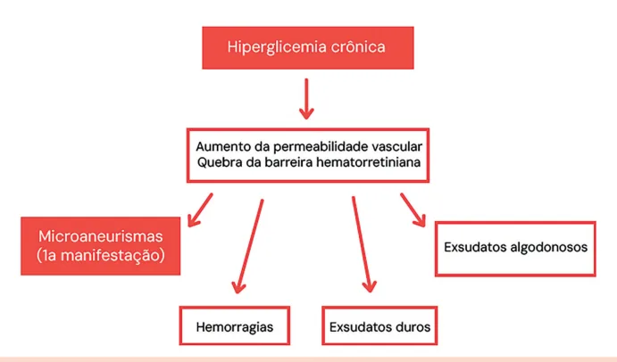
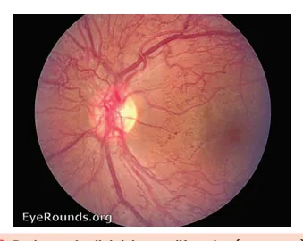
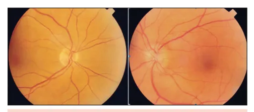
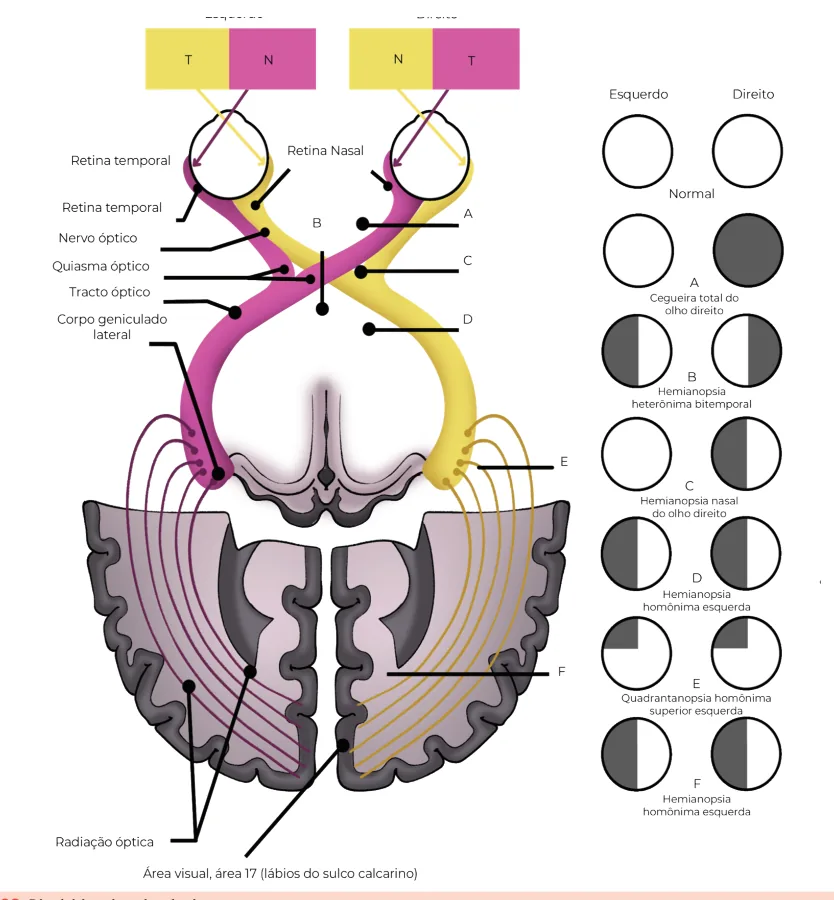

# Oftalmologia em Doenças Clínicas Parte II

<!-- page:1 -->

## OFTALMOLOGIA EM DOENÇAS

## CLÍNICAS: PARTE II

Oftalmo (CM) PEDIATRIA

- Oftalmopatia de Graves: ptose, proptose,

- Teste do olhinho (reflexo vermelho): obrigatório nas diplopia; curso independe do hipertireoidismo;

primeiras 72h de vida; leucocoria indica patologia tabagismo piora; ocular grave;

- Espondiloartrites: uveíte anterior aguda unilateral e

- Leucocoria: catarata congênita, glaucoma recidivante; HLA-B27+;

congênito, retinoblastoma (mais comum),

- Artrite reativa: oligoartrite + uretrite + conjuntivite;

toxoplasmose, alterações retinianas;

- Vogt-Koyanagi-Harada: fundo de olho em “pôr

- Retinoblastoma: tumor intraocular maligno da do sol”, uveíte bilateral + sintomas neurológicos e infância; leucocoria + estrabismo; tratamento inclui despigmentação pele e fâneros (poliose);

enucleação, quimioterapia, laser;

- Antimaláricos:

- Toxoplasmose congênita: retina em “roda de | Cloroquina/hidroxicloroquina;

carroça”, bilateral e macular; parte da tétrade de | Ceratopatia verticillata (inócua); Sabin; pode cursar com microcefalia; | Maculopatia (bull ‘s eye) com uso prolongado

- Retinopatia da prematuridade: neovasos + risco de (>5 anos) com doses mais altas (dose limite de 5 descolamento de retina; risco maior se ≤ 32 sem ou mg/kg/dia para a hidroxicloroquina);

peso < 1500g; | Fundo de olho inicial;

- Conjuntivite neonatal: | Tomografia de coerência óptica anual a partir de <24h: química (nitrato prata) – autolimitada; 5 anos de uso. <7 dias: gonocócica – grave, internar e tratar

- Paralisias oculares: 1-2 semanas: clamídia – eritromicina oral. | IV par: diplopia em leitura; inclinação

com ceftriaxona; | VI par: não abduz, estrabismo convergente;

- Celulite pré-septal: edema sem proptose; compensatória da cabeça;

antibiótico oral se leve; | III par: ptose + olho “para fora e para baixo” +

- Celulite pós-septal: proptose + limitação motilidade pupila comprometida = aneurisma. Principal ocular + dor; internar e iniciar antibiótico parenteral; etiologia é a vascular.

- Obstrução da via lacrimal: resolve

- Papiledema: sempre bilateral, por espontaneamente até 1 ano; se não, sondagem; hipertensão intracraniana;

- Dacriocistite: tratar como celulite pré-septal;

- Edema de papila: qualquer causa; pode posteriormente, sondagem. ser unilateral.

- Estrabismo verdadeiro causa ambliopia;

- Distúrbios da via óptica:

pseudoestrabismo é comum em recém- | Quiasma: hemianopsia bitemporal; nascidos (epicanto); | Trato óptico ou lobo occipital: hemianopsia

- Shaken baby syndrome: hemorragias homônima contralateral.

retinianas multicamadas;

- Miastenia gravis: ptose e paresia ocular flutuantes,

- Doença de Kawasaki: conjuntivite bilateral não pupilas poupadas;

purulenta + febre > 5 dias.

- Sífilis ocular: uveíte posterior + sintomas

CLÍNICA MÉDICA neurológicos. Tratar como neurossífilis com

- Endocardite: manchas de Roth são critério menor penicilina cristalina intravenosa 14 dias;

(fenômeno imunológico);

- Toxoplasmose ocular: principal causa de uveíte

- Retinopatia hipertensiva: grau IV possui papiledema posterior em jovens; retinocoroidite unilateral em

(emergência hipertensiva); imunocompetentes; tratar com pirimetamina +

- Retinopatia diabética: sulfadiazina + ácido folínico; Não proliferativa: microaneurismas,

- Tuberculose ocular: pode ocorrer sem doença hemorragias, exsudatos; pulmonar; quadro pleomórfico com uveíte Proliferativa: neovasos. Risco de descolamento granulomatosa, tubérculo coroideano e de retina; vasculite retiniana. Tratamento envolve panfotocoagulação: sacrifica retina periférica para poupar mácula; Encaminhar DM tipo 1 após 5 anos, DM tipo 2 no diagnóstico, gestante no 1º trimestre;

---

<!-- page:2 -->

## PEDIATRIA

- Tratamento: Quimioterapia/radioterapia;

TESTE DO OLHINHO | Enucleação;

- Teste do reflexo vermelho (TRV); | Crioterapia;

- Exame obrigatório no berçário nas primeiras 72 horas | Fotocoagulação.

- Exame obrigatório no berçário nas primeiras 72 horas

(antes da alta);

- Repetido pelo menos 3x nos 3 primeiros anos de vida; T

- É realizado pelo pediatra, a 30cm do recém- nascido, em sala escura, um olho por vez, utilizando oftalmoscópio direto;

- Objetivo: triagem para diversas patologias oculares;

- Se houver perda da transparência em qualquer estrutura ocular, o reflexo normal, vermelho e simétrico, irá alterar, tornando-se branco (leucocoria);

- Se o reflexo for alterado (leucocoria) ou houver dúvida, deve-se encaminhar o recém-nascido ao oftalmologista.

Etiologias da leucocoria

- Catarata congênita;

- Glaucoma congênito;

- Alterações retinianas;

- Opacidades corneanas;

- Retinoblastoma;

- Erro refrativo;

- Estrabismo.

Figura 1: Leucocoria à esquerda. RETINOBLASTOMA

- Tumor intraocular maligno mais frequente da infância;

- Cursa com leucocoria (60%), estrabismo (20%), inflamação orbitária mimetizando celulite pós ou R pré-septal.

- - Figura 2: Exame de fundoscopia evidência retinoblastoma próximo ao nervo óptico. | Fotocoagulação.

## TOXOPLASMOSE CONGÊNITA

- 80% da população brasileira possui sorologia IgG positiva para toxoplasmose;

- Triagem materna trimestral na gestação;

- Quanto menor a idade gestacional, mais grave;

- Quanto maior a idade gestacional, maior a chance de transmissão.

- Quadro clínico: Tétrade de Sabin (presente em menos de 10% dos casos): Retinocoroidite em “roda de carroça”: macular em 70% e bilateral em 85%; Calcificações; Micro/hidrocefalia; Atraso no desenvolvimento neuropsicomotor.

Figura 3: Fundo de olho com lesão cicatricial da toxoplasmose em “roda de carroça”. RETINOPATIA DE PREMATURIDADE

- Recém-nascidos prematuros podem apresentar a vascularização retiniana incompleta, ocasionando a formação de neovasos;

- Observam-se dilatação e tortuosidade vascular, neovascularização e descolamento de retina.

- Fatores de risco: Baixa idade gestacional ao nascimento Baixo peso (< 1500g); Intercorrências neonatais: síndrome do desconforto respiratório, sepse, transfusões sanguíneas, gestação múltipla e/ou hemorragia intraventricular.

(≤32 semanas);

- Verificar Figura 4 na próxima página

---

<!-- page:3 -->

Figura 4: Retinopatia da prematuridade. Aumento da tortuosidade vascular e descolamento da retina.

## CONJUNTIVITES NEONATAIS

Tabela 1: Conjuntivites neonatais. Etiologia Tempo de evolução Química C < 24h (nitrato de prata) Co Neisseria gonorrheae < 1 semana p Chlamydia trachomatis 1 a 2 semanas

## CELULITES PRÉ E PÓS-SEPTAL

Tabela 2: Celulites pré e pós-septal. Pré-septal (periorbitária) Etiologia S. aureus / S. pyogenes Fatores de risco Infecções cutâneas Faixa etária Pico 0 a 10 anos e 50 a 60 an Quadro clínico Dor, calor, edema e hiperemia em Casos leves: antibiótico oral co cobertura para gram positivo Conduta (amoxicilina/clavulanato ou cefale por 7-10 dias Casos graves: antibiótico paren OBSTRUÇÃO CONGÊNITA DA VIA LACRIMAL

- Lacrimejamento uni ou bilateral, menisco lacrimal aumentado e refluxo à expressão do saco lacrimal;

- Maior parte dos casos se resolve até um ano de vida;

- O tratamento inicial é conservador (massagem do Quadro clínico Conduta moderada onjuntivite purulenta grave, pode ter perfuração ocular

Conjuntivite purulenta leve/ Observação (melhora em 48h) Internação Ceftriaxona parenteral Coletar secreção (gram e cultura)

Tratar os pais Eritromicina oral Coletar secreção (gram e cultura) Secreção mucoide Tratar os pais Atentar para pneumonia afebril do lactente Pós-septal (orbitária)

S. pneumoniae / H. influenza / Moraxella, S. aureus, anaeróbios Rinossinusite, trauma, infecção dentária nos Principal causa de órbita aguda em crianças Proptose, dor e restrição da motilidade ocular, m pele diplopia, quemose, baixa acuidade visual Internação Antibiótico parenteral por no mínimo 2-3 semanas (ceftriaxone + oxacilina)

om Se suspeita de origem odontogênica ou o acometimento intracraniano, cobrir exina) anaeróbios com metronidazol Abscesso: drenagem cirúrgica nteral (mais comum em adultos)

Tomografia de órbita, hemograma, hemocultura, VHS, PCR, punção lombar (se suspeita de meningite) saco lacrimal).

- Sondagem de via lacrimal: Se ausência de resolução em um ano ou na presença de complicações, como dacriocistite aguda, celulite ou dificuldade de amamentação.

---

<!-- page:4 -->

- Dacriocistite aguda: Tratamento igual ao da celulite pré-septal, compressas mornas e antibioticoterapia tópica na forma de colírios; Corticoides são contraindicados; Corticoides são contraindicados; Após a resolução do quadro agudo, deve-se sondar a via lacrimal.

- Figura 5: Dacriocistite aguda.

Faz diferencial com celulite pré-septal.

## ESTRABISMO

- Estrabismo é qualquer desalinhamento ocular, ou seja, uma perda do paralelismo entre os olhos. Pode ocorrer em diferentes eixos: Horizontal: esotropia (olho desviado para dentro) ou exotropia (para fora); Vertical: hipertropia ou hipotropia (olho desviado para cima ou para baixo); Torcional: rotação anormal do globo ocular em torno de seu eixo visual.

- Consequências se não tratado: O cérebro passa a ignorar a imagem do olho desalinhado para evitar diplopia (visão dupla), o que leva à ambliopia (perda de visão funcional no olho

“preguiçoso”), especialmente nas crianças. PSEUDOESTRABISMO O

- É a falsa impressão de estrabismo em crianças pequenas, embora os olhos estejam D perfeitamente alinhados;

- Lactentes possuem ponte nasal larga e pregas epicânticas proeminentes (dobras de pele na parte interna dos olhos), que cobrem parcialmente a esclera nasal;

- Isso gera a ilusão de esotropia (olho desviado para dentro), especialmente em fotos.

- Causas principais: Epicanto medial proeminente; Ponte nasal larga; Distância interpupilar aumentada ou diminuída.

- O teste do reflexo luminoso corneano (teste de ajudam a diferenciar estrabismo verdadeiro de pseudoestrabismo;

Hirschberg) e o teste da cobertura (cover test)

- Com o crescimento da criança e o desenvolvimento facial, o pseudoestrabismo tende a desaparecer espontaneamente. Figura 6: Pseudoestrabismo secundário a epicanto.

## SÍNDROME DO BEBÊ SACUDIDO

- Shaken baby syndrome (ou síndrome do bebê sacudido) ocorre quando um bebê é sacudido repetidamente;

- A cabeça de um bebê é desproporcionalmente grande e seus vasos sanguíneos são frágeis, o que torna o cérebro e os olhos mais suscetíveis a sangrar devido a uma lesão por desaceleração.

Figura 7: Fundoscopia na síndrome do bebê sacudido. O sangramento pode estar sobre, dentro ou sob a retina.

## DOENÇA DE KAWASAKI

- Febre> 5 dias, sem outra explicação, combinada por pelo menos 4 dos 5 critérios clínicos abaixo: Conjuntivite bilateral não purulenta; Alteração na membrana mucosa oral: edema ou fissura labial e língua em framboesa; Alteração nas extremidades: eritema palmar ou plantar, edema de mãos e pés (fase aguda) e descamação periungueal (fase convalescente); Rash cutâneo polimórfico; Linfadenopatia cervical (pelo menos 1 linfonodo >

1,5cm de diâmetro).

---

<!-- page:5 -->

## RETINOPATIA HIPERTENSIVA

- Verificar Tabela 3

Figura 8: Conjuntivite bilateral não purulenta.

## CARDIOLOGIA

## ENDOCARDITE

- Achado fundoscópico: manchas de Roth;

- Compõem um dos fenômenos imunológicos (critérios menores de Duke), juntamente a fator reumatóide positivo, nódulos de Osler e glomerulonefrite.

Figura 9: Fundo de olho com manchas de Roth. Tabela 3: Graus de retinopatia hipertensiva. Grau Características Estreitamento leve das artérias Redução da relação artéria: veia ( Cruzamentos arteriovenosos a II Reflexo arteriolar em “fio de cobre III Hemorragias, exsudatos duros e a IV Papiledema (edema de pap Figura 10: Retinopatia hipertensiva grau IV.

Edema de disco óptico, exsudatos duros e algodonosos, hemorragias em chama, cruzamentos arteriovenosos anormais e redução do calibre das artérias, com aumento do reflexo (em “fio de cobre” ou “prata”).

## ENDOCRINOLOGIA

## RETINOPATIA DIABÉTICA

Fatores de risco para o desenvolvimento da

- Tempo de doença;

- Mal controle glicêmico;

- Diabetes mellitus (DM) tipo 1 com risco maior do que

DM tipo 2;

- Insulina associa-se a maior prevalência de

- Glitazonas associam-se ao edema macular diabético;

- Coexistência de hipertensão arterial sistêmica, tabagismo, gestação, nefropatia diabética.

- Verificar Figura 11 na próxima página retinianas anormais e” ou “prata” algodonosos Grave pila) Emergência hipertensiva

Gravidade Leve (normal 2:3) Moderada

---

<!-- page:6 -->

Figura 11: Fisiopatologia das alterações retinianas secundárias a hiper

- Pode ser classificada em: Não proliferativa: sem neovasos. Dividida em 4 estágios; Proliferativa: há neovasos. Há oclusão capilar, levando à isquemia retiniana e liberação de VEGF. O

VEGF estimula a neovascularização.

- Verificar Tabela 4 na próxima página

- - Figura 12: Retinopatia diabética não proliferativa.

- Microaneurismas, micro-hemorragias, exsudatos E duros e algodonosos.

- Tabela 4: Classificação da retinopatia diabética não proliferativa e ris em menos de quatro q critérios para a quatro quadrantes da retina em dois quadrantes da retina um quadrante da retina

Classificação Critérios c Presença de microaneurismas e/o Leve Alterações mais extensas que a fo Moderada Presença de um dos A. Mais de 20 microaneurismas e/ou he Grave B. Presença de alterações venosas em C. Presença de anomalias microvascula Muito grave Presença de dois ou mais dos critér . rglicemia crônica.

Figura 13: Retinopatia diabética proliferativa (neovasos). Tratamento

- Controle rigoroso do diabetes;

- Injeção intravítrea de anti-VEGF;

- Panfotocoagulação: tratamento a laser que sacrifica a retina periférica em prol da diminuição da produção de VEGF e preservação da mácula;

- Vitrectomia: hemorragia vítrea, pré-retiniana, descolamento de retina.

Encaminhamento ao oftalmologista

- Se DM tipo 1: encaminhar até 5 anos do diagnóstico;

- Se DM tipo 2: encaminhar no momento do diagnóstico;

- Se DM e gestação: encaminhar já no primeiro trimestre.

sco de progressão para forma proliferativa em 1 ano. clínicos Progressão 1 ano ou hemorragias intrarretinianas Cerca de 1% quadrantes da retina orma leve, mas sem preencher Cerca de 3% a forma grave s critérios abaixo:

emorragias intrarretinianas em Cerca de 15% m forma de colar de contas (beading) ares intrarretinianas em pelo menos rios descritos para a forma grave Cerca de 45%

---

<!-- page:7 -->

## DOENÇA OCULAR TIREOIDIANA ARTRITE REATIVA

Oftalmopatia de Graves

- Mais comum em homens jovens;

- Acomete cerca de 50% dos pacientes com doença

- Inicia-se cerca de 1 a 4 semanas após infecção de Graves; geniturinária ou gastrointestinal (principal agente:

- Autoanticorpos atacam fibroblastos orbitários, o que Chlamydia trachomatis);

leva ao aumento da gordura e espessamento dos

- Manifestações musculoesqueléticas:

músculos extraoculares; | Oligoartrite assimétrica, predominante em

- Fatores de risco e curso clínico: membros inferiores; Mais comum em mulheres jovens; | Dactilite (“dedo em salsicha”); Forma mais grave em homens idosos; | Entesite (inflamação em inserções tendíneas); Tabagismo é o principal fator de risco; | Sacroileíte (menos frequente); Curso ocular independe da atividade da doença

- Manifestações geniturinárias:

tireoidiana sistêmica. | Uretrite;

- Quadro clínico: | Balanite circinada. Retração palpebral (90% dos casos);

- Manifestações mucocutâneas: Proptose ou exoftalmia (60%); | Ceratoderma blenorrágico (lesões palmoplantares); Miopatia restritiva: diplopia, estrabismo; | Úlceras orais indolores; Neuropatia óptica compressiva.

- Manifestações oculares:

- Diagnóstico: | Conjuntivite (30–60% dos casos) é a manifestação Confirmado com 2 de 3 critérios: ocular mais comum; Achados clínicos típicos; | Uveíte anterior aguda pode ocorrer, mas é menos Exames laboratoriais compatíveis; frequente que a conjuntivite. Imagem sugestiva (ex.: tomografia ou ressonância de órbita). VOGT-KOYANAGI-HARADA

- Doença sistêmica, granulomatosa e autoimune;

## REUMATOLOGIA

- Alvo: melanócitos dos olhos, ouvido interno, pele, sistema nervoso central;

## UVEÍTE ANTERIOR ASSOCIADA ÀS

- Mais comum em mulheres, de 20 a 50 anos;

## ESPONDILOARTRITES

- Principal causa de uveíte não infecciosa no Brasil,

- A uveíte é a manifestação extra-musculoesquelética junto a Behçet;

mais comum das espondiloartrites;

- Critérios diagnósticos:

- Mais comum nas espondiloartrites axiais; | Ausência de trauma ocular/cirurgia prévia;

- Associada à positividade do HLA-B27; | Ausência de evidência de outras doenças oculares;

- Aguda, unilateral e recidivante; | Envolvimento ocular bilateral;

- Não granulomatosa (precipitados ceráticos finos); | Alterações neurológicas/auditivas: zumbido,

- Pode apresentar hipópio fixo (acúmulo estático de pus meningismo, pleocitose no líquor;

na câmara anterior); | Alterações dermatológicas: alopécia, poliose, vitiligo.

- Dor, fotofobia e baixa acuidade visual leve;

- Apresenta-se em uma fase aguda e em uma

- Não há relação entre o quadro ocular e fase crônica:

atividade sistêmica; | Fase aguda:

- Complicações são frequentes: sinéquias | Coroidite difusa;

posteriores, catarata, glaucoma secundário, edema | Descolamento de retina seroso; macular cistoide. | Uveíte anterior;

- Tratamento: | Inflamação vítrea.

- Corticoides tópicos + midriáticos/ciclopléjicos; | Fase crônica:

- Romper sinéquias posteriores. | Despigmentação ocular: fundo de olho em “pôr do sol”, sinal de Sugiura; Catarata, glaucoma.

Tabela 5: Formas clínicas da uveíte. | Uveíte anterior recorrente / crônica; Localização primária da Forma Clínica inflamação Uveíte anterior Câmara anterior Uveíte intermediária Vítreo Uveíte posterior Retina ou coroide Panuveíte Todas as partes da úvea

---

<!-- page:8 -->

Figura 14: Fundo de olho em “pôr do sol” no Vogt-KoyanagiHarada. EFEITOS ADVERSOS DOS ANTIMALÁRICOS O

- Os antimaláricos (cloroquina e hidroxicloroquina) se a associam à ceratopatia verticillata e à maculopatia. p

- Ceratopatia verticillata: Opacificação discreta da córnea que não provoca baixa acuidade e nem necessita de suspensão da droga. P

- - - Figura 15: Ceratopatia verticillata.

- Maculopatia: Pode causar baixa acuidade visual grave e irreversível; Hidroxicloroquina é opção terapêutica com menor toxicidade; Dose dependente (ex.: risco maior quando hidroxicloroquina>5mg/kg/dia); Recomenda-se um exame de fundo de olho antes do início do uso da cloroquina/hidroxicloroquina; Na ausência de fatores de risco adicionais, devese rastrear a ocorrência de maculopatia com E tomografia de coerência óptica e campimetria a digital anualmente após 5 anos de uso P da hidroxicloroquina.

- - - Figura 16: Maculopatia por antimaláricos mostrando o alvo causada pela degeneração central do epitélio pigmentado da retina.

“bull ‘s eye”. O “bull ‘s eye” é uma lesão retiniana em forma de

## NEUROLOGIA

## PARALISIA DA MUSCULATURA OCULAR

## EXTRÍNSECA

Paralisia do VI nervo craniano (abducente)

- Congênito;

- Trauma;

- Infecção;

- Hipertensão intracraniana.

Figura 17: Paresia ou paralisia do VI nervo (abducente) à esquerda. Esotropia esquerda com grande limitação de abdução, aumentando a levoversão.

Paralisia IV nervo craniano (troclear)

- Congênito;

- Trauma;

- Vasculopatia;

- Idiopático;

- Paciente costuma adotar posição compensatória da cabeça.

---

<!-- page:9 -->

| Limitação de movimentos oculares: não consegue elevar, deprimir ou aduzir o olho afetado; | Reflexo fotomotor alterado se houver comprometimento pupilar: indica causa compressiva, como aneurisma.

Figura 18: Paralisia do IV par. Paralisia do III nervo craniano (oculomotor)

- A principal causa é vascular, mas pode ter diversas origens, incluindo: Congênita, trauma, infecção, infiltração, tumoral e pós-cirúrgica; Fatores de risco associados: hipertensão arterial, diabetes mellitus, arteriosclerose (aumenta risco de aneurisma), idade avançada.

- Nos casos traumáticos ou compressivos, é comum o acometimento da pupila, pois as fibras pupilares são mais periféricas e, portanto, mais vulneráveis à compressão.

- Quadro clínico típico: Ptose palpebral; Estrabismo com desvio do olho para fora (exotropia);

## DISTÚRBIOS DAS VIAS ÓPTICAS

Tabela 6: Distúrbios das vias ópticas. Local da lesão Alter Nervo óptico Ceguei Quiasma óptico (por compressão Hem central, ex.: adenoma de hipófise) (perda Trato óptico Hemianop Corpo geniculado lateral Hemianop Radiações ópticas parietais Hemian (lobo parietal) (qu Radiações ópticas temporais Hemiano (lobo temporal) (qua Hemianops Córtex visual primário (lobo occipital)

muitas veze compressiva, como aneurisma.

## EDEMA DE PAPILA

- Causas: Neurite; Neuropatia óptica isquêmica aguda (NOIA); Emergência hipertensiva; Oclusão de veia central da retina.

Edema de papila e papiledema são termos diferentes! Edema de papila é secundário a qualquer causa, pode ser uni ou bilateral. O papiledema é específico da hipertensão intracraniana, é sempre bilateral.

Figura 19: Edema de papila à esquerda. Disco óptico de limites nítidos no olho direito e borramento dos seus bordos no olho esquerdo.

- Verificar Tabela 6 ração no campo visual Lateralidade ira total do olho afetado Unilateral mianopsia bitemporal das hemirretinas nasais) psia homônima contralateral Bilateral assimétrica psia homônima contralateral Bilateral nopsia homônima inferior uadrantopsia inferior) opsia homônima superior adrantopsia superior) sia homônima contralateral, es com preservação macular

Bilateral simétrica Bilateral Bilateral Bilateral

---

<!-- page:10 -->

Figura 20: Distúrbios das vias ópticas. MIASTENIA GRAVIS INFECTOLOGIA

- Doença autoimune caracterizada pela produção de autoanticorpos contra os receptores nicotínicos de SÍFILIS OCULAR acetilcolina na junção neuromuscular, levando à falha

- Forma de manifestação da sífilis adquirida, geralmente na transmissão do impulso nervoso para o músculo; nas fases secundária ou latente da doença;

- É mais comum em mulheres entre 20 e 40 anos;

- Possui apresentação clínica muito variável,

- Manifestações clínicas principais: podendo incluir: Flutuação dos sintomas e fatigabilidade muscular; | Cancro palpebral (na fase primária); Acometimento ocular é frequente, sendo a | Uveíte anterior (mais comum em pacientes apresentação inicial em 30–50% dos casos. com HIV);

- Comprometimento ocular: | Uveíte posterior (forma mais comum); Ptose palpebral (blefaroptose): manifestação mais | Neurite óptica;

comum, geralmente assimétrica, podendo ser | Coriorretinite; unilateral ou bilateral; | Vasculite retiniana;

| Alterações da motilidade ocular extrínseca: não | Padrão de retinose pigmentar seguem padrão específico, mas frequentemente (forma pseudoinflamatória);

iniciam com limitação da supraversão (movimento

- Há predomínio do acometimento posterior em relação para cima); ao anterior. Pupilas poupadas: não há alteração pupilar, pois o esfíncter da pupila utiliza receptores muscarínicos, Sempre que houver sintomas oculares, deveque não são afetados pela doença. se realizar punção lombar para análise do líquor

(investigar neurossífilis).

---

<!-- page:11 -->

- Tratamento: penicilina cristalina 4 milhões UI Figura 5: Dacriocistite aguda.

intravenosa a cada 4 horas, por 14 dias (mesmo SANTOS, Guilherme Henrique dos; OLIVEIRA, João Vitor Araújo de;

esquema da neurossífilis). SOUZA, Amanda Cristina de et al. Bilateral congenital dacryocystocele complicated with acute dacryocystitis / Dacriocistocele congênita bilateral complicada com dacriocistite aguda. Revista Brasileira de TOXOPLASMOSE OCULAR Oftalmologia, v. 82, 2023. Disponível em: https://doi.org/10.37039/1982.8551

## TOXOPLASMOSE OCULAR

- A forma adquirida da doença ocular ocorre em 2% a

30% dos infectados;

- Pode surgir junto ao quadro sistêmico ou de forma tardia.

A toxoplasmose ocular é a principal causa de uveíte posterior em pacientes jovens.

- Manifestações clínicas: Geralmente unilateral em pacientes imunocompetentes; Pode ser uni ou bilateral em pacientes imunossuprimidos.

- Tratamento: Antiparasitários: sulfadiazina + pirimetamina + ácido folínico (para reduzir toxicidade hematológica); Anti-inflamatórios: corticoide tópico (com cicloplégico associado); Corticoide oral: usado em casos selecionados, sempre após início da terapia antiparasitária.

## TUBERCULOSE

- Aproximadamente 60% dos casos de tuberculose ocular ocorrem sem sinais de doença pulmonar ou em outros sítios.

- Manifestações oculares (quadro pleomórfico): Tuberculoma palpebral; Uveíte anterior granulomatosa; Tubérculo coroideano; Vasculite retiniana (frequentemente oclusiva); Neurite óptica.

## REFERÊNCIAS

Figura 1: Leucocoria à esquerda. Acervo Medcof. Figura 2: Exame de fundoscopia evidência retinoblastoma próximo ao nervo óptico.

AERTS, L.; LUMBROSO-LE ROUIC, L.; GAUTHIER-VILLARS, M. et al. Retinoblastoma. Orphanet Journal of Rare Diseases, v. 1, n. 31, 2006.

Disponível em: https://doi.org/10.1186/1750.1.31. Acesso em: 4 jul. 2025. Figura 3: Fundo de olho com lesão cicatricial da toxoplasmose em “roda de carroça”.

PRETI, Rony C. O que é a toxoplasmose ocular? Instituto de Retina. Disponível em: https://www.institutoderetina.com.br/home/toxoplasmoseocular/. Acesso em: 04 jul. 2025.

Figura 4: Retinopatia da prematuridade. AMERICAN SOCIETY OF RETINA SPECIALISTS. Retinopathy of Prematurity.

Disponível em: https://www.asrs.org/patients/retinal-diseases/17/ retinopathy-of-prematurity. Acesso em: 04 jul. 2025.

Tabela 1: Conjuntivites neonatais. Acervo Medcof. Tabela 2: Celulites pré e pós-septal. Acervo Medcof. Oftalmologia, v. 82, 2023. Disponível em: https://doi.org/10.37039/1982.8551 .20230005. Acesso em: 04 jul. 2025.

Figura 6: Pseudoestrabismo secundário a epicanto. CEO PORTO ALEGRE. Pseudoestrabismo. Porto Alegre: Centro de Excelência em Oftalmologia, jan. 2011. Disponível em: http://ceoportoalegre.

com.br/2011/01/pseudoestrabismo/. Acesso em: 04 jul. 2025. Figura 7: Fundoscopia na síndrome do bebê sacudido.

STELTON, Christopher R. et al. Shaken Baby Syndrome. EyeWiki, American Academy of Ophthalmology, 25 jan. 2025. Disponível em: https://eyewiki.

aao.org/Shaken_Baby_Syndrome. Acesso em: 04 jul. 2025. Figura 8: Conjuntivite bilateral não purulenta.

SILVEIRA, Jéssica de Oliveira; PEGORARO, Mariana Grando; FERRANTI, Juliana Ferreira; BOUSSO, Albert; RENATTINI, Tadeu Silveira Martins.

Infecção por Influenza B e doença de Kawasaki em adolescente durante a pandemia da COVID-19: relato de caso. Revista Brasileira de Terapia Intensiva, v. 33, n. 2, p. 320–324, abr.–jun. 2021. Disponível em: https://doi.

org/10.5935/0103-507X.20210041. Acesso em: 04 jul. 2025. o Figura 9: Fundo de olho com manchas de Roth.

HEALTHLINE. Roth Spots in Eye: What Do They Mean? Healthline. Disponível em: https://www.healthline.com/health/roth-spots. Acesso em: 04 jul.

2025. Tabela 3: Graus de retinopatia hipertensiva. Acervo Medcof. Figura 10: Retinopatia hipertensiva grau IV.

HAUGSDAL, Jaci; RISMA, Justin. Hypertensive Retinopathy. EyeRounds.org

- The University of Iowa, [s.d.]. Disponível em: https://eyerounds.org/atlas/ pages/hypertensive-retinopathy.html. Acesso em: 04 jul. 2025.

Figura 11: Fisiopatologia das alterações retinianas secundárias à hiperglicemia crônica. Acervo Medcof.

Tabela 4: Classificação da retinopatia diabética não proliferativa e risco de progressão para forma proliferativa em 1 ano.

Acervo Medcof. Figura 12: Retinopatia diabética não proliferativa. RETINA-SPECIALIST.COM. Clinical trial lessons for managing diabetic retinopathy. Retina-Specialist.com, [s.d.]. Disponível em: https://www.

retina-specialist.com/article/clinical-trial-lessons-for-managingdiabetic-retinopathy. Acesso em: 04 jul. 2025.

Figura 13: Retinopatia diabética proliferativa (neovasos). VISLISEL, Jesse; OETTING, Thomas, MS, MD. Diabetic Retinopathy: From One Medical Student to Another. The University of Iowa, Department of Ophthalmology and Visual Sciences. Disponível em: https://eyerounds.org/ tutorials/diabetic-retinopathy-med-students/. Acesso em: 04 jul. 2025.

Figura 14: Fundo de olho em “pôr do sol” no Vogt-KoyanagiHarada. ACCORINTI, Massimo; SATURNO, Maria Carmela; IANNETTI, Ludovico;

MANNI, Priscilla; MASTROMARINO, Davide; PIRRAGLIA, Maria Pia. Treatment and prognosis of Vogt–Koyanagi–Harada disease: real-life experience in long-term follow-up. Journal of Clinical Medicine, v. 11, n. 13, p. 3632, 2022.

Disponível em: https://doi.org/10.3390/jcm11133632. Acesso em: 04 jul. 2025. Figura 15: Ceratopatia verticillata.

VISLISEL, Jesse, MD. Cornea Verticillata. EyeAtlas – University of Iowa, Department of Ophthalmology and Visual Sciences. Disponível em: https:// webeye.ophth.uiowa.edu/eyeforum/atlas/pages/Verticillata/index.htm.

Acesso em: 04 jul. 2025. Figura 16: Maculopatia por antimaláricos mostrando o “bull’s eye”. KIRKPATRICK, Christopher; KARAKAS, Stefani. Bull’s-eye maculopathy due to hydroxychloroquine toxicity. EyeRounds – University of Iowa, 29 jun.

2015. Disponível em: https://webeye.ophth.uiowa.edu/eyeforum/atlas/

pages/Hydroxychloroquine-toxicity/index.htm. Acesso em: 04 jul. 2025.

---

<!-- page:12 -->

Figura 17: Paresia ou paralisia do VI nervo (abducente) à Tabela 5: Formas clínicas da uveíte. esquerda. Acervo Medcof.

CURI, R. L. N. von. Paralisia do VI nervo (abducente). Revista Brasileira Tabela 6: Distúrbios das vias ópticas.

de Oftalmologia, 2013. Disponível em: https://www.scielo.br/scielo. Acervo Medcof. php?script=sci_arttext&pid=S0004-27492013000300018. Acesso em:

Figura 20: 04 jul. 2025. Figura 18: Paralisia do IV par. A Acervo Medcof. Figura 19: Edema de papila à esquerda.

NUNES, Carlos; BERTAN, Andrés; BRESSAN, Ricardo; et al. Unilateral papilledema as an atypical presenting sign of idiopathic intracranial hypertension. Revista Brasileira de Oftalmologia, v. 68, n. 3, p.

193-196, jun. 2009. Disponível em: https://doi.org/10.1590/S003472802009000300009. Acesso em: 04 jul. 2025. Figura 20: Distúrbios das vias ópticas.

Acervo Medcof.
