# Oftalmologia para o Generalista Parte I

<!-- page:1 -->

## OFTALMOLOGIA PARA O

## GENERALISTA: PARTE I

Oftalmo (CM) ANATOMIA OCULAR

- Associada à idade, diabetes, uveíte, trauma, uso

- Camadas do globo ocular: crônico de corticoides, vitrectomia, radiação e Túnica fibrosa (externa): córnea e esclera. infecções congênitas;

Função de proteção;

- Tratamento exclusivamente cirúrgico: Úvea (intermediária): íris, corpo ciliar, coroide. facoemulsificação com lente intraocular. Indicação Retina (interna): com fotorreceptores, Glaucoma responsável pela visão.

Função nutritiva; absoluta: glaucoma facomórfico ou facolítico.

- Neuropatia óptica crônica, progressiva e irreversível; Fotorreceptores:

- Glaucoma de ângulo aberto: aumento da pressão Cones: visão de cores e alta definição. intraocular, escavação do nervo óptico, escotoma Bastonetes: visão noturna, formas e

Concentram-se na mácula; em arco. Assintomático (apenas perda visual);

- Glaucoma congênito: blefaroespasmo, movimento. Localizam-se na periferia epífora, fotofobia;

da retina.

- Tratamento:

- Córnea: principal responsável pelo poder dióptrico | Redução da produção de humor aquoso:

total do olho (2/3); betabloqueadores, inibidores da anidrase

- Cristalino: sem vascularização ou inervação; carbônica, agonistas alfa-2;

acomoda para foco próximo; perde essa função | Aumento do escoamento: pilocarpina, análogos com o tempo (presbiopia); representa 1/3 do de prostaglandina, trabeculoplastia a laser, poder dióptrico; agonistas alfa-2;

- Vítreo: gelatinoso, avascular, ocupa 80% do volume | Cirurgia: trabeculectomia.

do globo, aderida à retina em pontos específicos. Urgências oftalmológicas SEMIOLOGIA

- Corpo estranho corneano:

- Acuidade visual: avaliada por tabela de Snellen. | Dor, fotofobia, lacrimejamento, hiperemia;

20/20 = 100%; ausência de percepção luminosa = | Conduta: anestesia, remoção, colírio antibiótico pior visão possível; (ciprofloxacino), pomada cicatrizante.

- Motilidade ocular: avaliar as 9 posições do olhar;

- Trauma ocular penetrante:

- Reflexos pupilares: direto, consensual, e teste | Curativo com proteção rígida, tomografia do defeito pupilar aferente relativo (sugere computadorizada de órbitas, antibiótico neuropatia óptica, descolamento de retina, neurite, parenteral, jejum e cirurgia;

oclusão arterial); | Evitar Valsalva: prescrever antiemético.

- Biomicroscopia (lâmpada de fenda): avalia

- Hemorragia retrobulbar:

pálpebras, conjuntiva, córnea, câmara anterior, | Trauma contuso → sangramento intraorbitário → cristalino e vítreo anterior; síndrome compartimental;

- Pressão intraocular: aferida com tonometria de | Sinais: proptose, dor, defeito pupilar aplanação (padrão-ouro). aferente relativo, edema de papila, restrição

- Na fundoscopia avalia-se: motora ocular; Disco óptico: coloração, escavação, bordas; | Tratamento: cantotomia lateral e cantólise em Mácula: presença de drusas ou hemorragias; menos de 90 minutos. Vasos: relação veia:artéria = 3:2;

- Queimadura ocular: Retina periférica: verificar descolamentos, | Bases causam lesões mais graves que ácidos;

roturas ou neovascularização. | Lavagem com ringer abundante por 30–60 DOENÇAS OFTALMOLÓGICAS COMUNS minutos (mínimo 2 litros);

- Causas evitáveis de cegueira: | Contraindicado tentar neutralizar com Catarata; substância de pH oposto. Erro refracional;

- Glaucoma agudo de ângulo fechado Glaucoma; (fechamento angular): Opacidade corneana; | Mais comum em mulheres, Retinopatia diabética. asiáticas, hipermétropes;

Catarata | Sintomas: dor ocular, midríase, halos, náuseas;

- Opacificação do cristalino; | Tratamento inicial: manitol, colírios

- Principal causa de cegueira no mundo; hipotensores e corticoides;

---

<!-- page:2 -->

| Definitivo: iridotomia bilateral. | Tratamento: laser (retinopexia), gás (retinopexia

- Conjuntivite: pneumática), introflexão escleral, vitrectomia. Viral: unilateral no início, secreção serosa,

- Oclusão da artéria central da retina: Bacteriana: pode ser bilateral desde o início, | Retina pálida com mácula em cereja; Bacteriana: pode ser bilateral desde o início, secreção purulenta, papilas, tratada com colírio antibiótico (ciprofloxacino ou tobramicina 0,3%).

folículos, autolimitada, exige afastamento; | Perda visual súbita, indolor e unilateral;

- Descolamento de retina: Separação entre retina neurossensorial e epitélio pigmentar; Regmatogênico é o mais comum (ruptura); Fatores de risco: alta miopia, trauma, cirurgia ocular prévia, pseudofacia;

## ANATOMIA DO BULBO OCULAR C

- CAMADAS DO GLOBO OCULAR

- O bulbo ocular é composto por 3 camadas concêntricas: Externa (túnica fibrosa): córnea, limbo e esclera.

- Confere resistência e proteção ao globo ocular; Intermediária (úvea): corpo ciliar, coroide e íris. Interna (retina): possui fotorreceptores e elementos neurais. Responsável pelo processamento visual.

Confere nutrição e suporte;

- - R

- - Figura 1: Corte transversal do olho, com destaque para as camadas do bulbo ocular.

## CONJUNTIVA

- A conjuntiva é a membrana transparente e fina que recobre a esclera (conjuntiva bulbar) e a superfície interna das pálpebras (conjuntiva tarsal).

## ESTRUTURAS ÓPTICAS

## CÓRNEA

- A córnea é a extensão transparente da esclera. A transição entre a esclera (opaca) e a córnea ocorre abruptamente no limbo;

- Representa ⅔ de todo o poder óptico do olho. | Retina pálida com mácula em cereja; Causa mais comum: êmbolos carotídeos; Tratamento: massagem ocular, paracentese, manitol (nas primeiras 24h, para tentar remover êmbolo); Exige avaliação clínica geral por risco cardiovascular.

## CRISTALINO

- O cristalino é uma estrutura transparente, elástica e de forma biconvexa, localizada atrás da pupila;

- É um órgão único, pois não tem nenhuma vascularização e inervação;

- É responsável por ⅓ do poder óptico do olho.

A acomodação visual é o processo em que o cristalino altera sua curvatura, tornando-se mais convexo, para focalizar objetos próximos na retina. Com o tempo, o cristalino perde poder de acomodação, causando presbiopia.

## VÍTREO

- O vítreo é uma estrutura gelatinosa e avascular, essencial para o suporte e a nutrição da retina;

- Possui volume de 4mL (80% do volume do globo ocular) e é composto principalmente por água (98%), colágeno, ácido hialurônico, glicose e ácido ascórbico;

- Encontra-se aderido à retina em certos pontos

(principalmente no nervo óptico).

## RETINA

- A retina é responsável pela conversão da imagem luminosa em impulsos elétricos;

- Ela é composta pela retina neurossensorial e pelo epitélio pigmentar da retina;

- Há dois tipos de fotorreceptores: Cones: visão das cores e com maior definição. No centro da mácula há apenas cones, sendo essa a região responsável pela melhor acuidade visual; Bastonetes: visão em ambientes com pouca luz (visão noturna) e percepção de formas e movimentos, sem distinguir cores.

## SEMIOLOGIA OFTALMOLÓGICA

## ACUIDADE VISUAL

- A acuidade visual é avaliada com tabelas padronizadas distinguir detalhes a uma distância fixa;

(como a de Snellen), medindo a capacidade de

- Notação: 20/20 = 1,0 (100% de visão, visão normal); 20/40 = 0,5 (50% de visão);

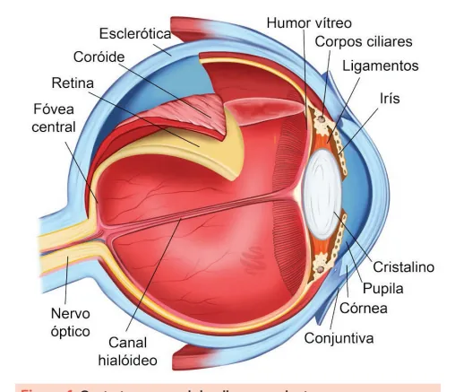

---

<!-- page:3 -->

| Ausência de percepção luminosa equivale a visão As principais causas de DPAR são neuropatia óptica, mais baixa possível. descolamento de retina, oclusão da artéria central da retina e neurite óptica.

Biomicroscopia (lâmpada de fenda) BAIXA VISÃO SEVERA (0,1)

## F P

## T O Z

## L P E D

## P E C F D 5

BAIXA VISÃO (0,5) E D F C Z P 6 F E L O P Z D 7 D E F P O T E C 8 VISÃO NORMAL (1,0) F E L O Q P Z D 9 P C T Z D E P C 10 C T P C Z C Z T D 11 Figura 2: Tabela de Snellen com letras, desenhos e símbolos.

## MOTILIDADE OCULAR

- Pede-se para o paciente seguir apenas com o olhar o dedo indicador do examinador;

- Avaliam-se as 9 posições do olhar: Primária: olhar reto para frente. Olhar horizontal: direita, esquerda; Olhar vertical: para cima, para baixo; Oblíquos: supraoblíquos (diagonal para cima) e infraoblíquos (diagonal para baixo), nos dois lados.

EXAME DO SEGMENTO ANTERIOR Pupila

- Observação geral das pupilas (simetria e formato): anisocoria?

- Reflexo fotomotor direto (via aferente);

- Reflexo fotomotor consensual (via eferente);

- Defeito pupilar aferente relativo (DPAR), por meio do teste da iluminação rápida alternada. Biomicroscopia (lâmpada de fenda)

- Avalia: pálpebras, conjuntiva, esclera, córnea, câmara anterior, cristalino e vítreo anterior;

- Permite gonioscopia para avaliar o ângulo da câmara anterior.

Aferição da pressão intraocular (PIO)

- Obtida com maior precisão a partir da tonometria de aplanação;

- Na ausência de equipamento específico, pode-se estimar a pressão por meio da tensão óculo-digital.

Figura 3: Tonômetro de aplanação de Goldmann acoplado à lâmpada de fenda. EXAME DO SEGMENTO POSTERIOR Fundo de olho

- Oftalmoscopia direta: visão central, fácil e com uso do oftalmoscópio portátil;

- Oftalmoscopia indireta: imagem invertida, campo mais amplo, uso de lente auxiliar.

Fundoscopia normal

- Sistematização do exame: Disco óptico: corado ou pálido? bordas nítidas ou borradas? escavação fisiológica ou aumentada? presença de hemorragias peridiscais? Vasos: calibre de artérias e veias, tortuosidade normal ou aumentada, cruzamentos arteriovenosos patológicos.

O diâmetro normal de uma veia retiniana é maior do que o de uma artéria retiniana, com uma relação aproximada de 3:2.

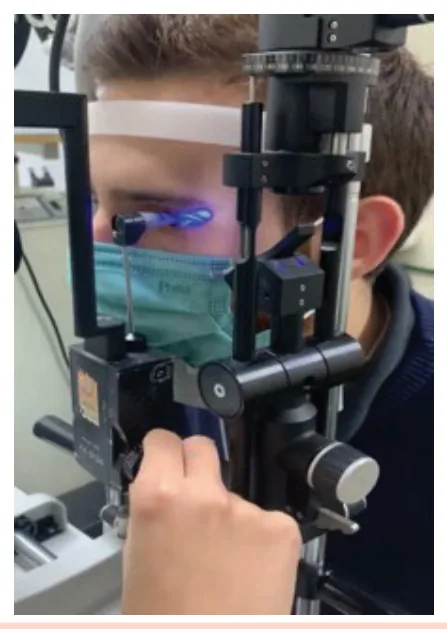

---

<!-- page:4 -->

| Mácula: coloração, presença de

- A catarata é reversível por meio de drusas, hemorragias. tratamento cirúrgico; Retina periférica: aplicada (aderida, sem áreas de

- O tratamento cirúrgico é o único tratamento possível;

descolamento)? roturas? neovascularização?

- A técnica cirúrgica mais usada é facoemulsificação com implante de lente intraocular;

Como identificar qual o olho através da fundoscopia?

- Nervo óptico do lado esquerdo = olho esquerdo.

- Nas provas de residência o foco da fundoscopia está em diferenciar fundo de olho normal, retinopatia diabética e hipertensiva.

- - - Figura 4: Representação esquemática do fundo do olho normal.

## DOENÇAS OFTALMOLÓGICAS

## COMUNS

- CEGUEIRA

- Causas de baixa de visão passíveis de prevenção: Catarata; Erro refracional; Glaucoma; Opacidade corneana; Retinopatia diabética.

- Catarata

- Principal causa de cegueira no mundo;

- Definida como a opacidade do cristalino;

- É não prevenível, já que faz parte do processo de envelhecimento; T

- Pode ser dividida em: cortical, nuclear e subcapsular;

- Algumas patologias aceleram sua formação e antecipam a idade de aparecimento: Trauma ocular (contuso ou penetrante); Doenças metabólicas, especialmente diabetes mellitus; Uso prolongado de corticoides (tópicos, orais ou inalatórios); Doenças inflamatórias intraoculares (ex.: uveítes); Cirurgias oculares prévias, como vitrectomia; Radiação (incluindo radioterapia ou exposição solar intensa); Doenças hereditárias/genéticas (ex.: Infecções congênitas (rubéola, toxoplasmose, CMV). com implante de lente intraocular;

distrofias, galactosemia);

- A indicação cirúrgica depende de perda visual, necessidades individuais e estilo de vida. Indicação absoluta: glaucoma facomórfico ou facolítico.

Figura 5: Catarata cortical, nuclear e subcapsular, respectivamente. Glaucoma

- Principal causa de cegueira em negros;

- Neuropatia óptica crônica e progressiva, irreversível;

- Fatores de risco: aumento da PIO, história familiar.

- Classificam-se em: Glaucoma primário de ângulo aberto (é o mais comum); Glaucoma primário de ângulo fechado; Glaucoma congênito; Glaucomas secundários.

- Tríade do glaucoma primário de ângulo aberto: É assintomático (apenas perda visual); Aumento da PIO; Alteração típica do nervo óptico (nervo escavado); Defeito de campo visual correspondente (escotoma em arco ou arqueado).

- Verificar Figura 6 na próxima página

- Tríade do glaucoma congênito: Blefaroespasmo (contração involuntária dos músculos orbiculares dos olhos); Epífora (lacrimejamento excessivo); Fotofobia.

Tratamento do glaucoma

- Reduzir a PIO: Redução da secreção de humor aquoso: Betabloqueadores; Inibidores da anidrase carbônica; Agonistas alfa-adrenérgicos (α2); Destruição do corpo ciliar (procedimentos mais invasivos). Aumento do escoamento (via trabecular ou uveoescleral): Pilocarpina; Análogos de prostaglandinas; Trabeculoplastia a laser; Agonistas alfa-adrenérgicos (α2). Aumento da drenagem (cirúrgico): Trabeculectomia: criação de um canal que permite o escoamento do humor aquoso para o espaço subconjuntival.

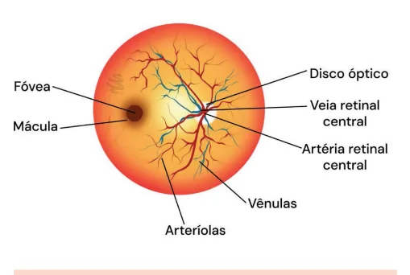

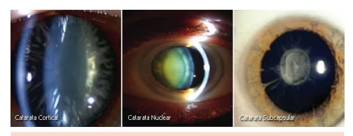

---

<!-- page:5 -->

Figura 6: Representação gráfica da perda de campo visual em arc

## DOENÇAS OFTALMOLÓGICAS NO

PRONTO SOCORRO Hiposfagma

- Hemorragia subconjuntival causada por traumas de intensidade variável que podem passar despercebidos pelo paciente; ou por formas de manobra de Valsalva

(p.ex.: tosse, vômito e constipação intestinal);

- Dificilmente está associado a condições sistêmicas, apesar de ser comum o paciente ser referenciado por suspeita de quadro hipertensivo;

- Por ter uma aparência por vezes dramática, o paciente procura atendimento imediatamente;

- Não cursa com diminuição da acuidade visual ou dor;

- Tratamento expectante: lubrificante e orientação.

Figura 7: Exemplos de hiposfagma. co associada ao glaucoma.

## CORPO ESTRANHO CORNEANO

- Sintomas: dor, sensação de corpo estranho, fotofobia, hiperemia conjuntival, lacrimejamento;

- O tratamento deve ser imediato, pelo risco de perfuração corneana;

s

- Ao exame: Avaliar acuidade visual: objetivo é eliminar possibilidade de lesão intraocular; Avaliar localização, profundidade e lesões associadas na lâmpada de fenda; Sempre everter pálpebras e inspecionar fórnices

(podem acumular corpos estranhos).

- Tratamento na ausência de evidência de perfuração corneana: Aplicar anestésico tópico; Remover corpo estranho com agulha de insulina dobrada; Remover o máximo possível do halo ferruginoso; Prescrever colírio antibiótico de amplo espectro e pomada oftalmológica reepitelizante; Orientar equipamento de proteção individual a depender da ocupação do paciente e avaliar o status vacinal do paciente.

Figura 8: Corpo estranho na córnea.

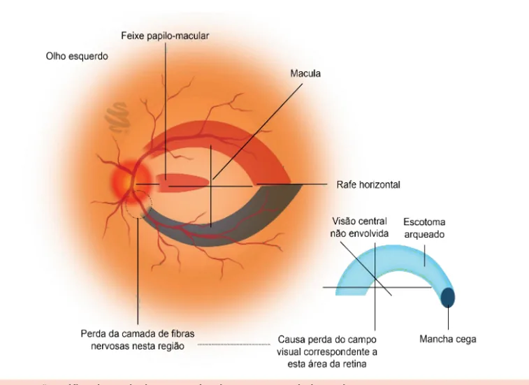

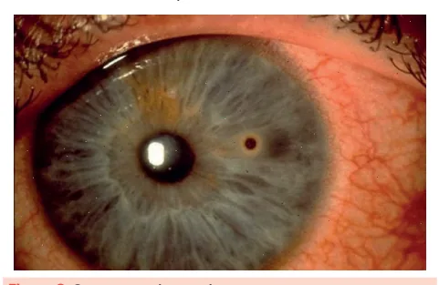

---

<!-- page:6 -->

TRAUMA OCULAR | Baixa acuidade visual (BAV);

- Mais comum em homens jovens de 20 a 40 anos | Defeito pupilar aferente relativo (DPAR);

(economicamente ativos); | Aumento da PIO;

- É uma das principais causas de cegueira unilateral | Evidências de oclusão vascular retiniana;

do mundo; | Edema de disco óptico. do mundo;

- Envolve lesões oculares diversas, incluindo o globo, anexos e nervo óptico, oscilando de lesões superficiais a perdas visuais irreversíveis;

- Classificação: Penetrante: apenas ferida de entrada; Perfurante: ferida de entrada e saída; Ruptura: trauma contuso de grande energia.

Figura 9: Classificação do trauma ocular. Trauma ocular penetrante com corpo estranho intraocular

- Atentar para o tipo de corpo estranho: magnéticos ou não, produtores de reação inflamatória leve ou grave, inertes ou não, puros ou impuros;

- Conduta: Curativo oclusivo não compressivo. Pode ser utilizado um “copinho de café”; Tomografia computadorizada de crânio e órbitas; Internação, jejum e repouso absoluto; Analgésicos e antieméticos (este a fim de evitar Valsalva); Antibiótico profilático: levofloxacino 500 mg intravenoso 1xd; Vacina antitetânica a depender do status vacinal; Reparo cirúrgico.

## HEMORRAGIA RETROBULBAR

- Sangramento intraconal (da artéria infraorbitária) tipicamente por trauma contuso;

- O sangramento dentro dessa cavidade restrita por paredes ósseas leva ao aumento da pressão intraorbitária;

- Isso resulta em síndrome compartimental, e, por consequência, neuropatia óptica isquêmica anterior. F

- Manifestações clínicas incluem: Proptose; Equimose; Tensão palpebral; Restrição da musculatura ocular extrínseca;

- | Edema de disco óptico.

- Diagnósticos diferenciais: celulite orbitária, enfisema orbitário, fratura em blow-out;

- Tratamento: Urgência oftalmológica! Descompressão por meio de cantotomia lateral e cantólise deve ser instituída rapidamente Pálpebra deverá afastar-se completamente do globo. Pode haver drenagem espontânea do sangue represado; Na maioria dos casos, ocorre cicatrização por segunda intenção.

(<90 minutos); Figura 10: Hemorragia retrobulbar à esquerda.

## QUEIMADURA OCULAR

- Pode ser necessária a avaliação da cirurgia geral em casos de queimaduras em outros segmentos corporais;

- Químicas: Bases induzem a saponificação e geram queimaduras mais graves que ácidos

(desnaturam proteínas).

- Térmicas: Queimaduras diretas do globo ocular são raras graças ao reflexo de fechamento palpebral; O mais comum são lesões palpebrais; Encaminhar ao oftalmologista se suspeita de corpo estranho ou lesão direta do globo.

- Tratamento: Deve ser instituído imediatamente; Descartar perfuração; Lavagem abundante com ringer lactato por 30-60 min (mínimo 2L) até pH normalizar; Anestésico tópico e limpeza dos fórnices.

No tratamento das queimaduras químicas, nunca se deve tentar neutralizar com outra solução de pH oposto em virtude de reação exotérmica!

## FECHAMENTO ANGULAR AGUDO PRIMÁRIO

- Glaucoma agudo de ângulo fechado;

- Fatores de risco: mulheres, asiáticas, >50 anos, ângulo estreito, câmara rasa, pequeno comprimento axial, hipermetropia;

- Sintomas: dor, BAV, visão de halos, náuseas;

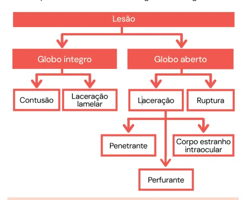

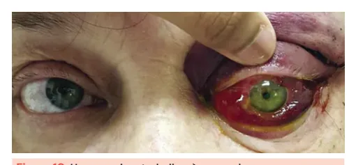

---

<!-- page:7 -->

- Sinais: PIO elevada, pupila média-midríase, hiperemia Observa-se hiperemia conjuntival difusa, secreção serosa conjuntival, edema corneano. e ausência de alterações pupilares.

- Tratamento: Temporário, no pronto socorro: agentes DESCOLAMENTO DE RETINA hiperosmóticos, colírios corticoides e hipotensores;

- Separação da retina neural do epitélio pigmentado hiperosmóticos, colírios corticoides e hipotensores; Definitivo: iridotomia bilateral.

Figura 11: Glaucoma agudo de ângulo fechado. Observa-se hiperemia conjuntival e midríase no olho esquerdo.

## CONJUNTIVITE

- Etiologia: infecciosa, alérgica, doenças reumatológicas

(ex.: artrite psoriásica, artrite reativa);

- As infecciosas comumente são virais ou bacterianas;

- Nas conjuntivites virais, o paciente precisa ser afastado de suas atividades e evitar contato domiciliar.

- Verificar Tabela1

Figura 12: Conjuntivite viral unilateral. Tabela 1: Diferenças entre conjuntivite viral e bacteriana.

Característica Conjuntivite Viral Início Geralmente unilateral Secreção Aquosa / serosa Hiperemia Leve a moderada Folículos Sim (principal achado da viral)

Sintomas Ardor, fotofobia leve Evolução Autolimitada (7–14 dias) Tratamento Sintomático - Separação da retina neural do epitélio pigmentado da retina.

- Etiologias: Regmatogênico: origina-se de ruptura na retina neurossensorial; Exsudativo; Tracional; Misto.

- Fatores de risco para descolamento regmatogênico: Alta miopia; Trauma ocular ou craniano; Descolamento de retina regmatogênico no olho contralateral; Pseudofacia ou afacia; Cirurgia intraocular prévia.

- O tratamento definitivo varia de acordo com o aspecto e complexidade do descolamento, incluindo: Retinopexia a laser; Retinopexia pneumática; Introflexão escleral; Vitrectomia da pars plana.

r. Figura 13: Descolamento de retina em campos superiores. Conjuntivite Bacteriana Frequentemente bilateral desde o início Purulenta ou mucopurulenta (espessa)

Mais intensa Pode ocorrer, mas papilas são mais comuns Sensação de areia, desconforto, olho colado ao acordar Pode piorar se não tratada Antibiótico tópico (ex.: ciprofloxacino 0,3%, tobramicina 0,3%)

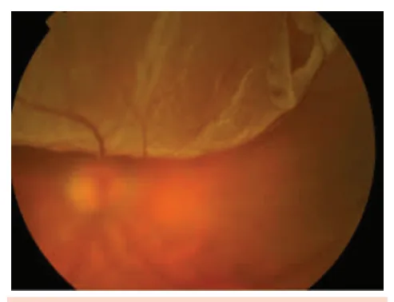

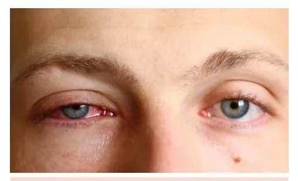

---

<!-- page:8 -->

OCLUSÃO DE ARTÉRIA CENTRAL DA RETINA Figura 2: Tabela de Snellen com letras, desenhos e símbolos.

- Sintomas: perda visual súbita (de conta-dedos a Acervo Medcof.

percepção luminosa), unilateral, indolor, podendo ser Figura 3: Tonômetro de aplanação de Goldmann acoplado à precedida por crises de amaurose fugaz; lâmpada de fenda.

- Sinais: retina pálida, opaca e edematosa, mácula em

- Sinais: retina pálida, opaca e edematosa, mácula em A cereja, visualização de êmbolos, DPAR.

- Etiologia: A Mais comumente êmbolos de colesterol advindos de placas ateroscleróticas da carótida.

- Tratamento: M Nenhum tratamento para restabelecer a circulação t q retiniana mostrou-se efetivo; Tenta-se mover o êmbolo se baixa acuidade visual de < 24h utilizando: Paracentese de câmara anterior; A Massagem ocular; Manitol. R Pela morbidade sistêmica, solicitar avaliação da b clínica médica.

d d r s v o Figura 14: Oclusão de artéria central da retina. c Observam-se áreas pálidas e a mácula em cereja. J t

## REFERÊNCIAS

Figura 1: Corte transversal do olho, com destaque para as camadas do bulbo ocular. O c Acervo Medcof.

o Acervo Medcof. Figura 4: Representação esquemática do fundo do olho normal. Acervo Medcof. Figura 5: Catarata cortical, nuclear e subcapsular, respectivamente.

MÉDICOS DE OLHOS. Catarata: o que é, sintomas, diagnóstico e tratamento. Disponível em: https://medicosdeolhos.com.br/catarata-oque-e-sintomas-diagnosticoe-tratamento/. Acesso em: 2 jul. 2025.

Figura 6: Representação gráfica da perda de campo visual em arco associada ao glaucoma. Acervo Medcof.

Figura 7: Exemplos de hiposfagma. RUBIN, Michel. Hiposfagma. Disponível em: https://drmichelrubin.com.

br/2014/08/01/hiposfagma/. Acesso em: 2 jul. 2025. Figura 8: Corpo estranho na córnea. RUBIN, Michel. Corpo estranho na córnea. Disponível em: https:// drmichelrubin.com.br/2014/07/31/corpo-estranho/. Acesso em: 2 jul. 2025.

Figura 9:: Classificação do trauma ocular. Adaptado de UNIVERSIDADE DE SÃO PAULO. Faculdade de Medicina.

Departamento de Oftalmologia. Manual de condutas de pronto-socorro de Oftalmologia. São Paulo: Atheneu, 2022.

Figura 10: Hemorragia retrobulbar à esquerda. ENTO KEY. Retrobulbar Hemorrhage. Disponível em: https://entokey.com/4retrobulbar-hemorrhage/. Acesso em: 2 jul. 2025.

Figura 11: Glaucoma agudo de ângulo fechado. HOLZGREN, H. Notfall: Diagnose, Therapie und Entlassung in vier Stunden.

MMW – Fortschritte der Medizin, v. 160, p. 36, 2018. DOI: 10.1007/S15006018-0530-0. Disponível em: https://link.springer.com/article/10.1007/ s15006-018-0530-0. Acesso em: 2 jul. 2025..

Figura 12: Conjuntivite viral unilateral. OPAS – ORGANIZAÇÃO PAN-AMERICANA DA SAÚDE. Conjuntivite viral, alérgica e bacteriana: sintomas e colírios. Disponível em: https:// opas.org.br/conjuntivite-viral-alergica-e-bacteriana-sintomas-ecolirios/#google_vignette. Acesso em: 2 jul. 2025.

Figura 13: Descolamento de retina em campos superiores. JACKSON, Timothy. Retinal Detachment. Disponível em: https:// timothyjackson.london/gps/retinal-detachment/. Acesso em: 2 jul. 2025.

Figura 14: Oclusão de artéria central da retina. EYE PHYSICIANS AND SURGEONS OF ONTARIO. Central Retinal Artery Occlusion. Vision Health – Eye Conditions – Retinal Diseases – Other Retinal Diseases – Retinal Artery Occlusions – Central Retinal Artery Occlusion. Disponível em: https://www.epso.ca/vision-health/eyeconditions/retinal-diseases/other-retinal-diseases/retinal-arteryocclusions/central-retinal-artery-occlusion/. Acesso em: 2 jul. 2025.

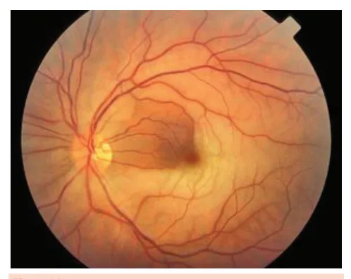
