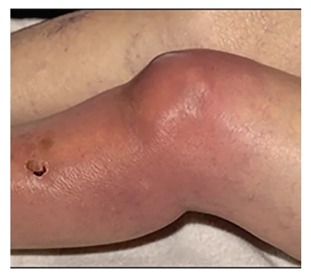
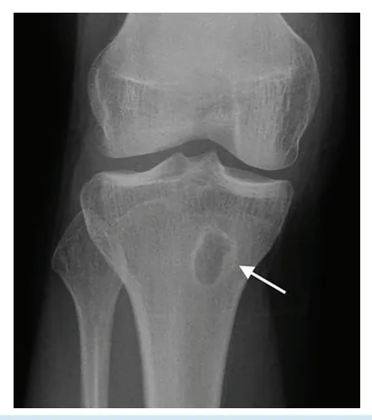
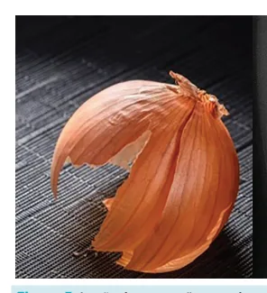
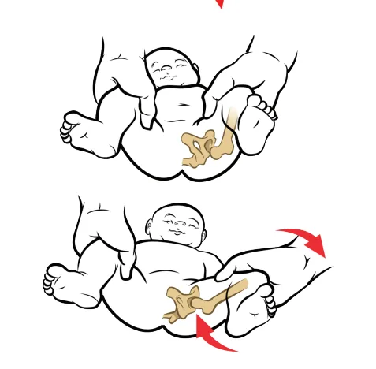
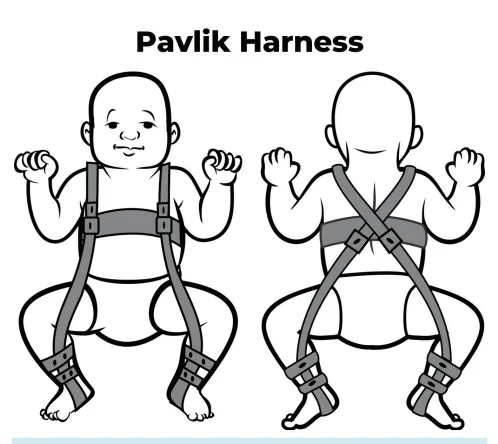
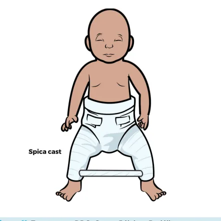

# Ortopedia Geral

<!-- page:1 -->

## Resumo de Mnemônicos e Direcionadores Clínicos

- **Dor Lombar** → TÊNIS (mnemônico de indicações de imagem);
- **Barlow e Ortolani** → manobras de rastreio para displasia do desenvolvimento do quadril (DDQ);
- **Monoartrite aguda no PS + febre** → Punção articular (investigação urgente);
- **Diagnóstico de DDQ** → USG até 6 meses de idade;
- **Artrite + Uretrite + Lesão de Pele** → Ceftriaxone (tríade sugestiva de artrite gonocócica);
- **Adolescente acima do peso com dor no quadril** → Epifisiolistese;
- **RX com "Casca de Cebola"** → Sarcoma de Ewing;
- **RX com "Raios de Sol"** → Osteossarcoma;
- **Dor Articular + IVAS** → Sinovite Transitória do quadril;
- **Dor noturna que melhora com AAS** → Osteoma Osteóide.

## Lombalgia

### Epidemiologia e Abordagem no PS

- Até 90% das pessoas experimentam pelo menos um episódio de lombalgia ao longo da vida;
- O papel do médico no pronto socorro (PS) é separar os casos de **lombalgia mecânica simples** (geralmente com resolução espontânea entre 3-14 dias) daqueles relacionados a doenças que necessitam de intervenção imediata;
- De maneira aguda, os exames de imagem não definem conduta e têm alta proporção de falsos positivos.

### Mnemônico TÊNIS — Indicações de Exame de Imagem na Lombalgia no PS

- **T** → **Trauma**: investigar lesão estrutural;
- **E** → **Equino**: pacientes com alterações neurológicas sensitivas ou motoras dos membros inferiores ou alterações esfincterianas, sobretudo **síndrome da cauda equina** (o melhor exame de investigação na urgência é a **ressonância nuclear magnética**);
- **N** → **Noturno**: dor com piora no período noturno;
- **I** → **Idade**: pacientes muito jovens ou **> 50 anos** (não esquecer **mieloma múltiplo** e **metástases na coluna**);
- **S** → **Secundário**: pacientes com doença de base conhecida, uso de corticoides ou imunossupressores.

*Figura 1: Monoartrite infecciosa.*

---

<!-- page:2 -->

## Monoartrites

### Epidemiologia e Abordagem

- Assim como a lombalgia, a monoartrite deve ser avaliada no PS de forma a identificar pacientes que necessitam de exame de imagem ou não.

### Artrite Inflamatória — Gota

**Características**
- Depósito de **cristais de urato monossódico**, sobretudo na **primeira articulação metatarsofalangeana**;
- Epidemiologia: homem, de meia idade, etilista, alto consumo de carne;
- É uma doença recorrente, inflamatória e progressiva.

*Figura 2: Diagnóstico diferencial entre artrite séptica e artrite inflamatória.*

### Artrite Séptica — Escolha da Antibioticoterapia

**Agentes mais comuns e epidemiologia associada**

| Agente | Associação/Indicação |
|---|---|
| **Staphylococcus aureus** | Mais comum, sem especificidade |
| **Salmonella** | Anemia falciforme, translocação bacteriana |
| **Pseudomonas** | Usuário de drogas IV |
| **Streptococcus B + Gram-negativos** | Recém-nascidos |
| **Haemophilus influenzae B** | Vacinação ausente |
| **Neisseria gonorrhoeae** | Jovem sexualmente ativo — **Tríade de Reiter**: artrite + uretrite + conjuntivite (quadro imunomediado reativo, tratável exclusivamente com **ceftriaxone**) |

## Osteomielite Hematogênica

### Conceito

- **Infecção óssea**, sobretudo na **região metafisária** (local de fluxo lento e turbilhonado), por disseminação bacteriana a partir de uma infecção de outro sítio;
- Ossos mais comumente acometidos: ver Figura 3 (porcentagem de frequência de acometimento).

### Investigação Laboratorial e Diagnóstico por Imagem

**Exames laboratoriais**
- **Leucocitose** e aumento de **VHS e PCR** — podem ser usados como marcadores de melhora;
- **Hemocultura** positiva em apenas 50% dos casos.

**Imagem — para diagnóstico precoce**
- Cintilografia;
- Ressonância nuclear magnética;
- **Confirmação diagnóstica**: feita por **biópsia**, que além disso permite a cultura do foco e orientação da antibioticoterapia, que deve ser realizada por **6-12 semanas**.
- Nos casos de **osteomielite crônica**, o **tratamento cirúrgico com desbridamento é essencial**.

*Figura 3: Porcentagem de frequência de acometimento da osteomielite.*

*Figura 4: Radiografia de joelho direito demonstrando osteomielite crônica em metáfise da tíbia proximal. Observe a área radioluscente, indicativa de sequestro ósseo (processo cronificado).*

## Tumores Ósseos

### Sarcoma de Ewing

**Características clínicas e radiológicas**
- Mimetiza um quadro infeccioso;
- **Epidemiologia**: crianças **< 10 anos**;
- **Radiografia**: lesão óssea com padrão em **"casca de cebola"** — depósito ósseo em camadas.

*Figura 5: Lesão óssea em "casca de cebola", característica do Sarcoma de Ewing.*

### Osteossarcoma

**Características clínicas e radiológicas**
- **Tumor ósseo primário mais comum**;
- **Epidemiologia**: jovens, predominância masculina, **> 10 anos**;
- **Radiografia**: **"Triângulo de Codman"** (crescimento e abaulamento periosteal) e **"raios de sol"**.

*Figura 6: Padrões radiológicos sugestivos de osteossarcoma. Triângulo de Codman, à esquerda, e raios de sol, à direita.*

---

<!-- page:3 -->

### Osteoma Osteóide

**Características clínicas e radiológicas**
- **Tumor benigno**, que cursa com **dor noturna que melhora com AAS ou anti-inflamatórios**;
- **Epidemiologia**: pacientes jovens;
- **Radiografia**: **formação de nidus** — área osteolítica circundada por depósito ósseo reacional denso.

*Figura 7: Formação de nidus à radiografia e à tomografia.*

## Ortopedia Pediátrica

### Displasia do Desenvolvimento do Quadril (DDQ)

**Conceito e Epidemiologia**
- Malformação congênita do quadril caracterizada por **subluxação** que leva ao **deslocamento progressivo da cabeça do fêmur do acetábulo**;
- Epidemiologia: estrogênio materno (afrouxa ligamentos), genética, fatores mecânicos;
- O diagnóstico depende da idade.

#### **0-6 meses**

**Rastreio e Manobras**
- Rastreio na maternidade pelas **manobras de Barlow e Ortolani**;
- **Manobra de Barlow**: abdução e força em direção posterior da cabeça do fêmur. Se positiva, há luxação da articulação indicando sua frouxidão, e o examinador sentirá um **"clique"**;
- **Manobra de Ortolani**: abdução do quadril, reduzindo a luxação provocada por Barlow;
- Exame de imagem de preferência: **USG** (os ossos ainda não estão calcificados e são de difícil visualização à radiografia).

**Tratamento**
- **Suspensório de Pavlik** (mantém o quadril em abdução).

*Figura 8: Suspensório de Pavlik.*

*Figura 9: Manobras de Barlow e Ortolani.*

#### **6-18 meses**

**Achados Clínicos**
- Tratamento precoce;
- O acetábulo já está bem formado e as manobras de Barlow e Ortolani tendem a ser negativas;
- Espera-se o **deslocamento cranial do fêmur**, com **encurtamento do membro**;
- **Sinal de Hart**: limitação à abdução do quadril;
- **Sinal de Galeazzi**: ao observar os membros inferiores em abdução, nota-se um joelho mais baixo que o outro.

**Diagnóstico e Tratamento**
- Diagnóstico: **radiografia**;
- Tratamento: **gesso pélvico-podálico**.

*Figura 10: Sinal de Galeazzi.*

---

<!-- page:4 -->

*Figura 11: Tratamento de DDQ com gesso pélvico-podálico.*

#### **> 18 meses**

**Achados e Tratamento**
- Objetivo: evitar sequelas;
- Clinicamente, é esperada a **marcha de Trendelemburg**;
- Tratamento: **cirúrgico**, por osteotomias ou prótese de quadril.

### Doença de Legg-Calvé-Perthes

**Conceito e Epidemiologia**
- **Osteonecrose idiopática da cabeça do fêmur**, levando à fragmentação e colabamento ósseo;
- O processo é autolimitado: ao retirar a carga do paciente, o reestabelecimento do fluxo sanguíneo leva à cessação da progressão e reversão da doença;
- **Epidemiologia**: masculino, **4-8 anos**, asiáticos.

### Epifisiolistese da Cabeça Femoral

**Conceito e Epidemiologia**
- **Escorregamento da cabeça femoral**;
- Ocorre sobretudo em pacientes na puberdade, entre **8-16 anos**, no período do estirão;
- Mais comum em negros com endocrinopatias; também em obesos baixos ou muito magros;
- **45% é bilateral**.

**Sinais Clínicos**
- **Sinal do obturador**: dor do quadril referida no joelho;
- **Sinal de Drehmann**: rotação externa do quadril à flexão do fêmur.

**Achados Radiológicos**
- **Linha de Klein**: linha que tangencia a borda superior do colo do fêmur, que deve cortar a cabeça femoral;
- A cabeça femoral abaixo dessa linha é chamada de **sinal de Trethowan** — patognomônico da doença.

**Tratamento**
- **Cirúrgico**: reposicionar a cabeça femoral nos casos agudos e fixar onde ela está nos casos crônicos para evitar progressão.

*Figura 12: Linha de Klein, normal à direita e epifisiolistese à esquerda.*

### Sinovite Transitória do Quadril

**Conceito e Clínica**
- **Quadro autoimune reativo** decorrente de infecção de vias aéreas superiores (IVAS) recentes;
- Mais comum no quadril;
- Mais frequente em pacientes **< 6 anos**, sendo um diagnóstico de exclusão;
- Apresentação: paciente **afebril**, com histórico de antecedente de IVAS, **sem bloqueio articular** ou outros achados notáveis.

## Referências

Figura 1: Monoartrite infecciosa. Fonte: Atumalia. The Lancet, 2017.

Figura 2 e 3: Ilustrações Acervo Medcof.

Figura 4: Radiografia de joelho direito demonstrando osteomielite crônica em metáfise de tíbia proximal. Observe a área radioluscente, indicativa de sequestro ósseo (processo cronificado). Fonte: radiopaedia.org

Figura 5: Lesão óssea em "casca de cebola", característica do Sarcoma de Ewing. Fonte: orthobullets.com

Figura 6: Padrões radiológicos sugestivos de osteossarcoma. Triângulo de Codman, à esquerda, e raios de sol, à direita. Fonte: orthobullets.com

Figura 7: Formação de nidus à radiografia e à tomografia. Fonte: orthobullets.com

Figura 8: Suspensório de Pavlik. Fonte: Acervo pessoal Medcof.

Figura 9: Manobras de Barlow e Ortolani. Fonte: Acervo pessoal Medcof.

Figura 10 e 11: Ilustrações Acervo Medcof.

Figura 12: Linha de Klein, normal à direita e epifisiolistese à esquerda. Fonte: radiopaedia.org

