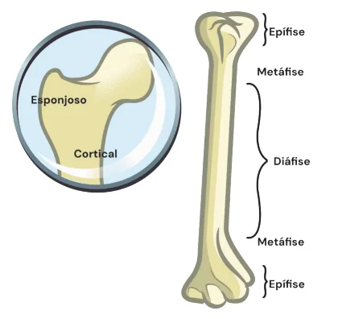
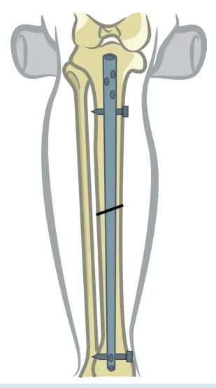
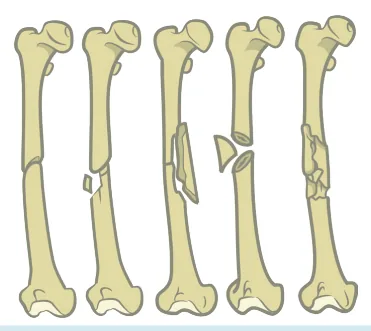
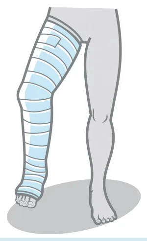

# Ortopedia - Traumatologia

<!-- page:1 -->

Ortopedia - Traumatologia ortopédica TRAUMATOLOGIA

- Fraturas Extra-articulares = Consolidação Indireta:

Estabilidade RELATIVA.

- Fraturas Articulares = Consolidação direta (SEM calo): Estabilidade ABSOLUTA .

Classificação de Gustilo TIPO I TIPO II Tamanho <1cm 1-10cm Cefalosporina de Contaminação Baixa 1ª ou 2ª geração Baixa Moderada Penicilina +- Metro

- Paciente estável e boas condições do membro = tratamento DEFINITIVO .

- Paciente Instável ou Lesão Complexa: Score de MESS : 2 a 6: Controle de Danos; 7+: Amputação.

## CONSIDERAÇÕES INICIAIS

- O tecido ósseo: O osso, em porção mais próxima à articulação, apresenta composição esponjosa, sendo menos denso; No corpo, o conteúdo tende a ser mais denso, predominantemente reticular. É chamada de porção cortical.

- As fraturas podem ocorrer em qualquer porção do osso; Epífise: porção mais próxima à articulação; Metáfise: região intermediária; Diáfise: corpo ósseo. - Fraturas Expostas = regra dos 5 A’s + Classificação de Gustilo & Anderson.

- ATLS + Antibiótico + Analgesia + é possível primária não é possível vascular onidazol

Alinhar + Antitetânica. & Anderson TIPO III A Cobertura >10cm Cobertura + Aminoglicosídeo C Reparo Alta

- Fratura de Ossos Longos + Alteração NC +Alteração Resp +- Petéquias = SEG.

- Trauma em Membros + DOR desproporcional + P***

Edema = SCA.

- Não esperar Ausência de Pulsos para tratar!

Figura 1: Estruturas do osso

---

<!-- page:2 -->

## CLASSIFICAÇÃO DAS FRATURAS

## QUANTO AO TIPO/PADRÃO

- Simples – traço único;

- Fraturas em cunha;

- Fraturas em cunha;

- Cominutiva – multifragmentadas; - mecanismos do trauma de maior energia.

- - Figura 2: Escala de gravidade

- QUANTO AO LOCAL DE ACOMETIMENTO:

- Extra-articular; Não acometem a superfície articular; São de menor complexidade; Requerem intervenção mais simples.

- Articular; C Apresentam traço em direção à articulação; São mais complexas, requerendo intervenção mais agressiva.

- Figura 3: tipos de fraturas

## CONSOLIDAÇÃO DAS FRATURAS

## FISIOPATOLOGIA

- Mediante uma fratura, ocorre o estímulo para formação de um novo tecido;

- Evolução da consolidação: Hematoma fraturário; Fase inflamatória; Calo cartilaginoso; presente cerca de 2 semanas após a fratura. Calo ósseo: após 6 - 8 semanas – considerada como fratura consolidada; Consolidação → Remodelamento, que pode durar meses. Figura 4: Fisiopatologia

## CONSOLIDAÇÃO INDIRETA/SECUNDÁRIA

- Existe um tecido intermediário entre o hematoma fraturário e o calo ósseo. O processo de consolidação é mantido através de uma estabilidade relativa, isto é, não há manipulação direta do foco de fratura;

- Nesse sentido, é garantido o mínimo de estabilidade para que as porções ósseas formam o calo cartilaginoso;

- Exemplo: “Tutor intramedular” – hastes intramedulares posicionadas de modo percutâneo, que promovem algum grau de micromovimento; Figura 5

- Fixadores externos – úteis para tratamento provisório;

sendo também utilizados com finalidade de tratamento definitivo da fratura. Figura 6

- Gesso: Redução funcional; correção do eixo, rotação e comprimento; síntese maleável. Figura 7

CONSIDERAÇÕES:

- Tipo de consolidação → Formação de um calo ósseo: Não realizar fixações em regiões articulares, ou em microcompartimentos, por promover desgaste, alterações funcionais ou comprometimento da cartilagem adjacente.

- Biomecanicamente, a presença do calo na região metafisária ou diafisária não interfere na capacidade funcional do membro.

Figura 5: Fixador interno

---

<!-- page:3 -->

Figura 8: Fratura consolidada

## FRATURA EXPOSTA

Figura 6: Fixador externo Figura 9: Fratura exposta. Figura 7: Gesso

## DEFINIÇÃO

## CONSOLIDAÇÃO DIRETA/PRIMÁRIA

- Contato entre a fratura e o meio externo:

- O processo de consolidação é mantido através exteriorização do osso ou contato do hematoma de uma estabilidade absoluta, isto é, o processo fraturário com o meio ambiente;

consolidativo ocorre sem a formação do calo ósseo.

- Condições requeridas: METAS TERAPÊUTICAS: Redução anatômica;

- Salvar a vida > salvar o membro > Compressão interfragmentária; recuperação funcional Síntese rígida.

- Regra dos 5 A’s:

- Para isso, é preciso uma intervenção cirúrgica; | ATLS; Compressão adequada entre os fragmentos + | Antibioticoterapia precoce (mesmo na suspeita); Não haja movimentação entre os | Anti-tetânica; Normalmente, faz-se uso de placas e parafusos. | Alinhar (garantir perfusão).

fragmentos ósseos. | Analgesia;

---

<!-- page:4 -->

## CLASSIFICAÇÃO DE GUSTILO & ANDERSON

OS 5 P’S DOR PARESTESIA PARESIA EDEMA OCINÍLC xD TIPO I TIPO II Tamanho <1cm 1-10cm Cefalosporina de Contaminação Baixa 1ª ou 2ª geração Baixa Moderada Penicilina +- Metronida Figura 10: Classificação de Gustilo & Anderson de fraturas expostas.

## TRATAMENTO OPERATÓRIO

- Gustilo & Anderson até tipo III A: pode ser feito tratamento definitivo na primeira cirurgia.

- Instabilidade clínica ou lesão grave de partes moles: controle de danos (curativo a vácuo, fixador externo, amputação).

- Score de MESS: auxílio na tomada de decisão quanto à amputação na fratura exposta: Vai de 2 a 14; Itens avaliados: gravidade da lesão, perfusão, Q choque, idade; 2-6: sem necessidade de amputação; 7 ou +: pode haver necessidade de amputação.

## SÍNDROME COMPARTIMENTAL

- DEFINIÇÕES:

- Isquemia do membro determinada por expansão de tecidos moles no compartimento envolvido por uma fáscia;

Figura 11: Os 5 P’s da síndrome compartimental aguda. TIPO III A Cobertura é possível >10cm Cobertura B primária não é possível + Aminoglicosídeo C Reparo vascular Alta azol

- Ocorre quando a diferença entre a pressão arterial diastólica (PAD) e a pressão do compartimento (PIC) é menor do que 30 mmHg, levando ao colapso de pequenos vasos;

- Mais comum em fraturas de tíbia e antebraço;

- Também ocorre em situações sem fratura como acidentes ofídicos, choques elétricos e esmagamentos.

QUADRO CLÍNICO:

- 5 P’s:

- Pain (dor desproporcional), parestesia, paresia, palidez, pulso ausente;

- Diagnóstico e tratamento realizados em até 6 horas evita sequelas irreversíveis;

- Tratamento cirúrgico inicial: dermatofascioepimisiotomia.

- Verificar Figura 11 .

## 11 12 1 10 2 9 3 8 4 7 6 5 PULSO PALIDEZ AUSENTE

---

<!-- page:5 -->

HIPOXEMIA 95% ALTERAÇÃO NC 60% PETÉQUIAS 33% 24-48h Figura 12: Síndrome da embolia gordurosa.

## SÍNDROME DA EMBOLIA

## GORDUROSA

## DEFINIÇÕES

- Embolia gordurosa ocorre em 95% das fraturas de ossos longos, mas a síndrome se manifesta na minoria dos casos

- Pode have;r embolia para qualquer órgão;

- Em geral 24-48h após o trauma;

- Principais sinais: hipoxemia, alteração de nível de consciência e petéquias.

- Verificar Figura 12 Fratura de

## OSSOS LONGOS

## DIAGNÓSTICO

- Clínico de exclusão: descartar reação transfusional, trauma de tórax com hipoxemia.

TRATAMENTO:

- Suporte;

- Fixação precoce da fratura - previne ocorrência da embolia gordurosa.

## REFERÊNCIAS

Todas as figuras = Acervo Medcof
