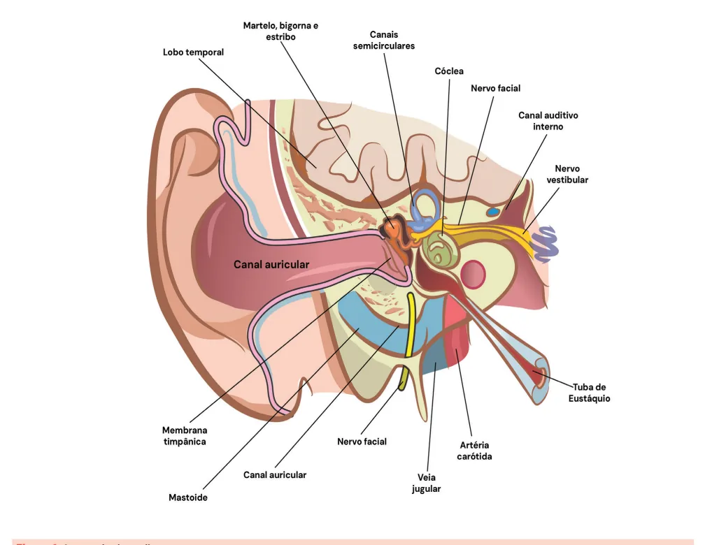
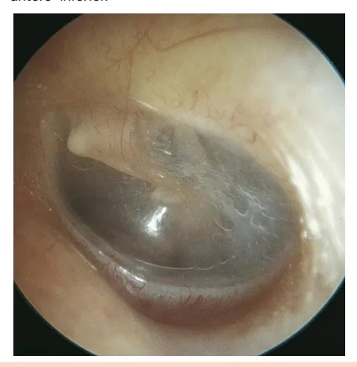
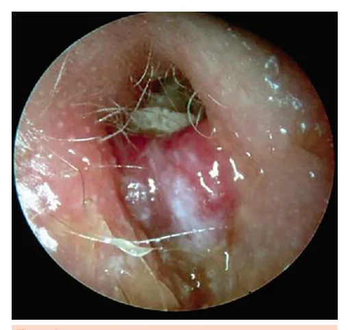
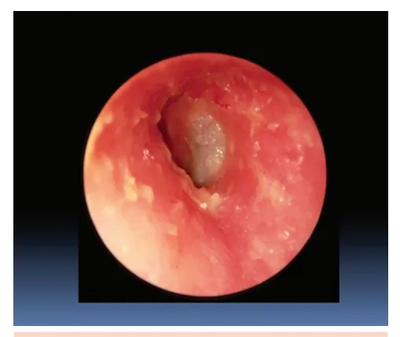
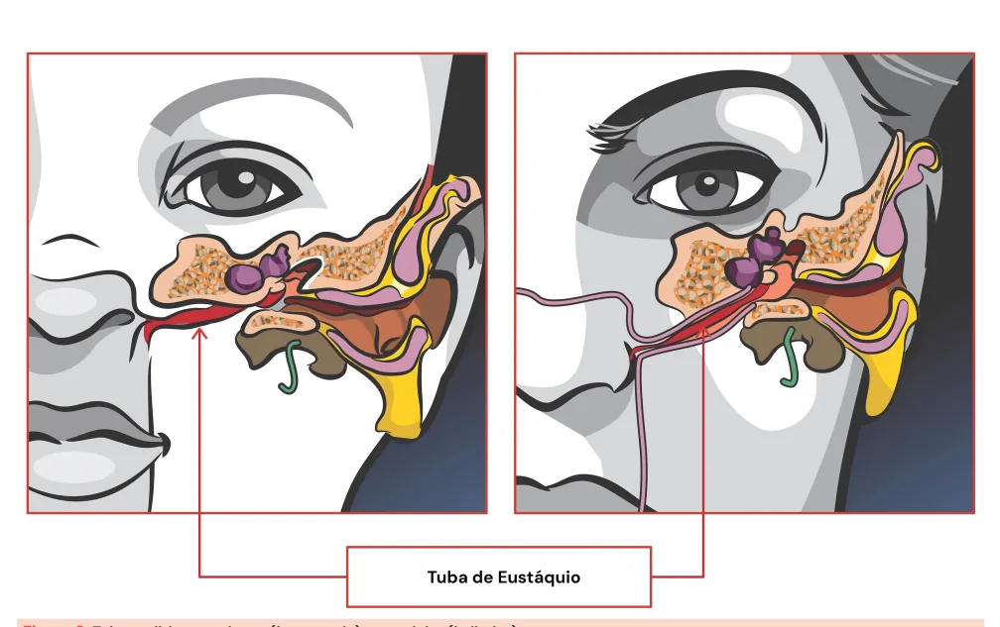
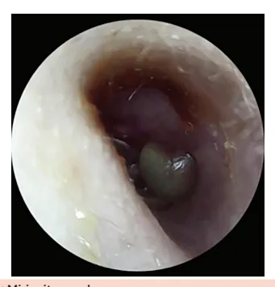
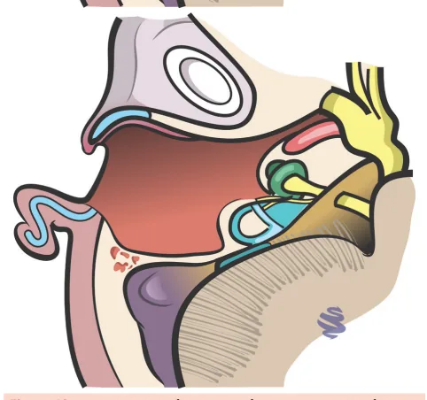
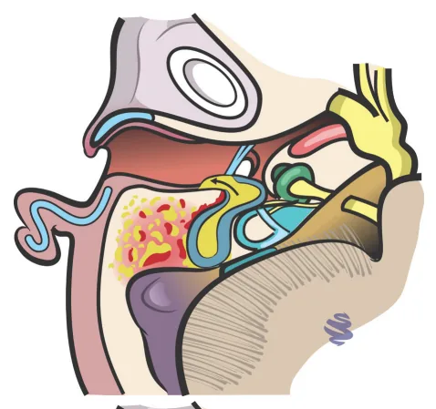
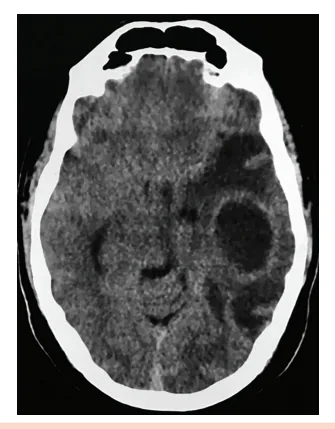

# Otologia I

<!-- page:1 -->

## Otologia — Anatomia

A orelha pode ser dividida, de modo geral, em **3 grandes compartimentos:**

- **Orelha externa:** pavilhão auricular + conduto auditivo externo (CAE);
- **Orelha média:** membrana timpânica + ossículos (martelo, bigorna, estribo) + tuba auditiva (conecta com rinofaringe);
- **Orelha interna:** cóclea (audição), canais semicirculares e vestíbulo (equilíbrio), nervo cocleovestibular (VIII).

**Mastoide:** pneumatizada, comunica-se com orelha média → via de complicações infecciosas.

**Membrana timpânica normal:** translúcida, cor perolada/acinzentada, com reflexo luminoso no quadrante ântero-inferior, sem abaulamentos/retrações.

*Figura 1: Anatomia da orelha.*

---

<!-- page:2 -->

## Membrana Timpânica

- A **função da membrana timpânica** é transmitir as ondas sonoras do ar para os ossículos do ouvido médio (martelo, bigorna e estribo);
- A **membrana se encontra íntegra e translúcida**. É possível observar a impressão do cabo do martelo na membrana e o reflexo luminoso no quadrante ântero-inferior.

*Figura 2: Membrana timpânica esquerda normal.*

### Mecanismo de Transmissão do Som

- **Orelha externa:** ressonância do som no conduto auditivo externo (CAE) até o tímpano;
- **Orelha média:** transmissão a partir do tímpano até cadeia ossicular;
- **Orelha interna:** conversão da energia mecânica do som em impulsos elétricos.

### Anatomia Detalhada

**Orelha média:**

- **Tuba auditiva** – estrutura que promove conexão com a rinofaringe. Em crianças, é mais curta e horizontalizada, o que favorece a progressão do vírus e das bactérias da rinofaringe para a orelha média;
- **Ossículos** – responsáveis pela transmissão da vibração mecânica da membrana timpânica para a orelha interna. Em respectiva ordem, de lateral para medial: **martelo - bigorna - estribo**.

*Figura 6: Tuba auditiva na criança (à esquerda) e no adulto (à direita).*

**Orelha interna:**

- **Cóclea** – responsável por converter a energia mecânica da vibração do som em um impulso elétrico que se direciona para o SNC através do nervo cocleovestibular/auditivo (VIII);
- **Canais semicirculares e vestíbulo** – compõem o labirinto, que é responsável por parte do equilíbrio;
- **Conduto auditivo interno** – contém o nervo facial (VII) e cocleovestibular/auditivo (VIII).

As estruturas da orelha média e da orelha interna são envoltas pelo osso temporal, um dos ossos que compõem a base do crânio. Uma das porções do osso temporal é a mastoide, região que, nos adultos, apresenta pneumatização importante. A orelha média se comunica com as células da mastoide, fato que é relevante para compreender a disseminação de processos infecciosos para essa região.

---

<!-- page:3 -->

## Otites Externas

### Otite Externa Difusa Aguda

- **Dermatite** de parte ou todo o conduto auditivo externo;
- **Agentes bacterianos:** Pseudomonas aeruginosa e Staphylococcus aureus;
- **História clínica:** associação com atividades aquáticas e trauma local (ex.: uso de cotonete, trauma digital).

**Manifestações clínicas**

- Dor;
- Hipoacusia;
- Prurido;
- Plenitude auricular;
- Ausência de sintomas sistêmicos.

**Exame físico**

- **Dor à palpação do trago** e à mobilização do pavilhão auricular.

**Otoscopia:**

- Eritema e edema de pele, incluindo espessamento da membrana timpânica;
- Secreção serosa ou purulenta;
- Restos epiteliais com obstrução total ou parcial do canal auditivo externo.

*Figura 3: Otite externa difusa aguda.*

**Tratamento**

- **Ciprofloxacino tópico**;
- **Limpeza do CAE** e proteção auricular.

### Otite Externa Maligna (Necrotizante)

- **Infecção invasiva e necrotizante do CAE**;
- **Pouco frequente**, acomete principalmente idosos, diabéticos e indivíduos imunossuprimidos;
- **Agentes bacterianos:** Pseudomonas aeruginosa.

**Exame físico**

- Otorreia, formação de tecido de granulação em CAE;
- Alteração dos pares cranianos;
- **Paralisia facial periférica** – pelo acometimento do NC VII.

*Figura 4: Otite externa maligna. Observa-se otorreia purulenta e formação de tecido de granulação em CAE.*

**Exames complementares**

- **Tomografia computadorizada** de ossos temporais e crânio com contraste — descartar outras complicações e avaliar sinais de erosão e remodelamento ósseo;
- **Ressonância magnética de encéfalo** — avaliação do acometimento de base do crânio/encéfalo;
- **Cintilografia com tecnécio (Tc-99)** — avalia a extensão do processo de osteomielite;
- **Cintilografia com gálio (Ga-67)** — para controle de cura (normaliza após erradicação do processo infeccioso).

**Tratamento**

- **Internação hospitalar** com antibioticoterapia endovenosa;
- **Antibiótico sistêmico antipseudomonas por 6 semanas** em média (ciprofloxacino, ceftazidima, piperacilina-tazobactam);
- **Antibioticoterapia tópica** (ciprofloxacino em gotas);
- **Limpeza diária do CAE**;
- **Controle dos fatores de imunossupressão** (ex.: no caso de diabéticos, controle glicêmico rigoroso).

### Miringite Aguda

- **Caracteriza-se pela formação de bolhas hemorrágicas** cobrindo a pele da membrana timpânica e do CAE;
- **Demonstra associação com IVAS** (infecção de vias aéreas superiores) prévia;
- **Mais comum** em crianças e adultos jovens;
- **Agente etiológico incerto:** Classicamente associada ao Mycoplasma pneumoniae, porém há evidência atual de infecção por outros agentes — Staphylococcus aureus e vírus respiratórios (influenza, VSR, adenovírus).

**Manifestações clínicas**

- **Dor intensa e súbita**, seguida por otorreia sanguinolenta;
- Apresenta curso autolimitado.

**Tratamento**

- **Analgesia**;
- **Paracentese das vesículas** para alívio álgico;
- **Antibioticoterapia:** macrolídeos, como azitromicina (grau de evidência questionável).

*Figura 5: Miringite aguda. Bolha hemorrágica localizada entre o CAE e a membrana timpânica.*

---

<!-- page:4 -->

## Otites Médias

### Otite Média Aguda (OMA)

- **Processo inflamatório agudo** (com evolução em **< 12 semanas**) da mucosa de revestimento da orelha média.

**Fatores de risco**

**Ambientais:**

- **IVAS:** pico de incidência em meses frios;
- **Crianças que frequentem creches/escola**;
- **Tabagismo passivo**;
- **Uso de chupeta**;
- **Curto período de aleitamento materno**;
- **Posição supina durante o aleitamento**.

**Hospedeiro:**

- **Predisposição genética**;
- **História familiar de OMA recorrente**;
- **Primeiro episódio antes dos 6 meses**;
- **Anormalidades craniofaciais** (ex.: síndrome de Down);
- **Fenda palatina não corrigida**.

**Agentes etiológicos**

**Vírus:** VSR, influenza, parainfluenza.

**Bactérias:**

- **Streptococcus pneumoniae** – **50%** (em redução);
- **Haemophilus influenzae não tipável** – **30%** (em ascensão);
- **Moraxella catarrhalis** – **12%**.

> **Obs.:** O uso da vacina conjugada antipneumocócica tem reduzido a OMA por S. pneumoniae. No entanto, a vacinação para Haemophilus tipo B **não reduz** a incidência da OMA!

**Manifestações clínicas**

- Quadro prévio de **IVAS**;
- **Febre alta > 38 °C**;
- **Otalgia**;
- **Irritabilidade**;
- **Hipoacusia**.

**Exame físico — Otoscopia:**

- **Abaulamento da membrana timpânica (E ~ 97%)**;
- **Membrana timpânica espessa, sem brilho, hiperemiada, hipervascularizada**;
- **Otorreia em CAE**;
- **Nível hidroaéreo**.

*Figura 7: Otite média aguda (OMA). Membrana timpânica espessa, edemaciada, sem brilho, hiperemiada e abaulada.*

> **Obs.:** A associação de OMA e conjuntivite é mais comum em crianças. É causada pelo Haemophilus influenzae.

**Tratamento**

- A **maioria das crianças** apresenta uma evolução favorável durante o episódio de OMA, com tendência a resolução espontânea;
- **Conduta:** antibioticoterapia x *watchful waiting* (observação cuidadosa).

**Watchful waiting:**

- **Observação de sintomas por 48-72 horas**, sem uso de antibioticoterapia;
- No entanto, para ser efetivo, é preciso garantir a reavaliação neste exato período de tempo.

**Antibioticoterapia tem indicação nos seguintes casos:**

- **< 6 meses de idade**;
- **Otorreia**;
- **Sinais de alarme:** sepse, otalgia > 48 horas, febre > 39 °C.

**Outro fator a considerar:** lateralidade da infecção:

| Idade | Bilateral | Unilateral |
|---|---|---|
| **6 meses a 2 anos** | Antibiótico ou watchful waiting | Antibiótico |
| **> 2 anos** | Antibiótico ou watchful waiting | Antibiótico ou watchful waiting |

**Esquema antibiótico:**

- **1ª escolha:** amoxicilina **50 mg/kg/dia**, por **7-10 dias**;
- **Se falha:** amoxicilina + clavulanato (**90 mg/kg/dia** — dose dobrada).

> **Lembre:** em caso de falha do tratamento, devemos pesquisar complicações. Se estiverem ausentes, considerar escalonamento para amoxicilina + clavulanato em dose dobrada.

### Otite Média Aguda Recorrente (OMAR)

- **Definição:** **≥ 4 episódios em OMA em 12 meses** ou **≥ 3 episódios em 6 meses**.

**Tratamento:**

- **Tubo de ventilação:** É um tratamento cirúrgico que permite a aspiração do conteúdo líquido de retenção na orelha média e o posicionamento do tubo de ventilação, que promove uma ventilação adequada da orelha média, evitando a estase de secreções;
- Reduz episódios de OMA e a necessidade de antibioticoterapia.

*Figura 8: Tubo de ventilação indicado na OMAR.*

---

<!-- page:5 -->

### Otite Média Crônica (OMC)

- **Caracterizada por um processo inflamatório crônico (> 12 semanas)** da mucosa de revestimento da orelha média.

**Pode ser classificada em:**

- **OMC simples**;
- **OMC supurativa**;
- **OMC colesteatomatosa**.

#### OMC Simples

- **Perfuração crônica da membrana timpânica com episódios intermitentes de otorreia**.

**Causas:**

- OMAs recorrentes com supuração;
- Trauma físico (agressão, barotrauma, corpo estranho).

**Quadro clínico:**

- **Hipoacusia**;
- **Otorreia intermitente**.

**Investigação adicional:**

- **Audiometria:** perda auditiva condutiva.

**Tratamento:**

- **Conservador:** proteção auricular e uso de aparelho auditivo, se necessário;
- **Cirúrgico:** timpanoplastia;
- **Em agudizações:** manejar como OMA.

*Figura 9: Otite média crônica simples, mostrando perfuração da membrana timpânica.*

#### OMC Supurativa

- **Agudizações frequentes**, com otorreia e otalgia associada;

**Manifestações clínicas:**

- **Hipoacusia** – pela perfuração timpânica e erosão da cadeia ossicular;
- **Otorreia recorrente, espessa** — com Pseudomonas, tratar com ciprofloxacino oral.

**Exame físico:**

- **Perfuração timpânica com edema de orelha média e otorreia**.

**Investigação:**

- **Audiometria + tomografia de ossos temporais** — velamento difuso da orelha e das células da mastoide, sem sinais significativos de erosão óssea.

**Tratamento:**

- **Limpeza frequente de orelha**;
- **Antibioticoterapia** tópica e via oral;
- **Cirurgia:** timpanomastoidectomia.

**Timpanomastoidectomia:**

- A timpanomastoidectomia é recomendada para casos de OMC supurativa;
- Se caracteriza por ser uma cirurgia com o objetivo de máxima preservação da audição;
- Nesta cirurgia, é realizado um broqueamento da mastoide através da região retroauricular, de forma a remover o máximo possível de tecido inflamatório das células da mastoide e da orelha média;
- Depois deste passo, é o momento de reconstruir o tímpano para garantir o melhor desempenho auditivo possível.

*Figura 10: Pré-operatório (primeira figura) e pós-operatório (segunda figura) de uma timpanomastoidectomia.*

#### OMC Colesteatomatosa

- **É uma lesão benigna de comportamento destrutivo**, caracterizada por tecido epidérmico escamoso e estratificado;
- **Em outras palavras, "pele crescendo onde não deveria"**;
- Na orelha média, este tecido apresenta um comportamento de crescimento progressivo que, além de comprimir estruturas adjacentes, promove uma intensa reação inflamatória local;
- O crescimento da lesão envolve progressivamente os ossículos da audição, tímpano, nervo facial, estruturas da orelha interna e até mesmo, em casos extremos, a base do crânio — tornando-se um importante foco de meningites e coleções intracranianas.

**Quadro clínico:**

- **História insidiosa, de anos de evolução**;
- **História prévia comum de OMAs de repetição nos primeiros anos**;
- **Otorreia purulenta constante, fétida** — "ninho de rato";
- **Hipoacusia**.

**Exame físico:**

- **Perfurações parciais ou totais da membrana timpânica**;
- **Massa esbranquiçada, compacta, com matriz lisa e brilhante**, lamelas de queratina;
- **Otorreia esverdeada/amarelada, fétida**.

**Investigação:**

- **Audiometria:** perda auditiva de padrão condutivo/misto importante;
- **Tomografia computadorizada de ossos temporais:** velamento difuso de orelha média e de células da mastoide, e osteíte e remodelamento ósseo importante.
- **Ressonância magnética de ossos temporais:** útil na avaliação de recidivas.

*Figura 11: OMC colesteatomatosa. Lesão esbranquiçada associada a erosão óssea na porção superior do conduto auditivo externo.*

*Figura 12: Tomografia de ossos temporais com OMC colesteatomatosa à direita. Há o aparecimento de massa com atenuação de partes moles na região da orelha média direita, com destruição/rarefação das estruturas ósseas ao seu redor.*

**Tratamento:**

- **Casos iniciais:** abordagens mais conservadoras, incluindo timpanomastoidectomia com *second-look* (segunda avaliação) programado;
- **Demais casos:** mastoidectomia radical.

**Mastoidectomia radical:**

- **Na mastoidectomia radical, a preservação da audição está em segundo plano**;
- **O mais importante** aqui é remover o máximo possível de lesão;
- Como o colesteatoma é uma lesão com alta chance de recidiva e seu sucesso cirúrgico depende de sua remoção completa, frequentemente precisamos sacrificar estruturas importantes para a audição;
- Portanto, após o broqueamento da mastoide, removemos a membrana timpânica, a parede óssea que corresponde à parede posterior do conduto auditivo externo, e partes dos ossículos da audição;
- Toda a orelha média e o conduto auditivo externo ficam comunicados por uma grande cavidade;
- Ainda há alguma transmissão de som através do osso temporal diretamente para a orelha interna, de forma que, a menos que a cóclea já tenha sido afetada pelo colesteatoma, o paciente ainda vai ter algum grau de audição após a cirurgia;
- Não é infrequente, contudo, que estes pacientes necessitem, no futuro, de prótese auditiva para reestabelecerem níveis auditivos que possibilitem o convívio social.

*Figura 13: Pré-operatório (à esquerda) e pós-operatório (à direita) de uma mastoidectomia radical.*

### Otite Média de Efusão (OME)

- **Caracterizada pela presença de fluido na orelha média**, sem sinais ou sintomas de infecção otológica;
- **Sinônimos:** otite média secretora, serosa, mucoide.

**Classificação — Quanto à duração:**

- **OME aguda:** < 3 semanas;
- **OME subaguda:** 3 – 12 semanas;
- **OME crônica:** > 12 semanas.

**Etiologia**

- **Mau funcionamento da tuba auditiva**, com dificuldade na drenagem de secreções:
  - Obstrução após quadro da OMA;
  - Hipertrofia de adenoide;
  - Neoplasia de nasofaringe;
  - Funcional após IVAS;
  - Sequela de radioterapia de cabeça e pescoço.

**Quadro clínico**

**Criança:**

- **Falta de atenção**;
- **Alterações comportamentais**;
- **Atraso na linguagem e fala**;
- **Aparelhos eletrônicos em volume excessivo**.

**Crianças mais velhas e adultos:**

- **Plenitude auricular**;
- **Sensação de corpo estranho no ouvido**;
- **Hipoacusia**.

**Exame físico**

- **Membrana opaca**;
- **Bolhas retrotimpânicas**;
- **Nível hidroaéreo**.

*Figura 14: Otite média de efusão com membrana opaca e bolhas retrotimpânicas.*

**Investigação**

- **Audiometria:**
  - **Indicação:** OME persistente por mais de **12 semanas**; suspeita de atraso na linguagem, problemas de aprendizado ou deficiência auditiva importante;
  - Mostra perda auditiva condutiva;
- **Timpanometria tipo B:**
  - Para efeito de provas de residência, uma "timpanometria tipo B" quase sempre sugere líquido retrotimpânico, achado compatível com a otite média de efusão e especialmente útil na avaliação de crianças nas quais a otoscopia deixa dúvidas quanto ao diagnóstico.

**Tratamento**

- **Resolução espontânea em até 12 semanas**, em **90%** dos casos;
- **Nos cenários de duração > 12 semanas** ou na presença de fatores de risco: considerar tubo de ventilação;
- **Fatores de risco:**
  - Deficiência visual/auditiva;
  - TEA;
  - Déficit intelectual;
  - Alterações craniofaciais.
- **Em caso de hipertrofia adenoideana:** considerar adenoidectomia.

---

<!-- page:6 -->

## Complicações de Otites

- **Complicações de OMA** são mais frequentes em crianças;
- **Complicações de OMC** são mais frequentes em crianças mais velhas e adultos.

### Complicações Extracranianas

- **Abscesso retroauricular:** desloca pavilhão; drenagem/mastoidectomia;
- **Abscesso cervical (Bezold):** abaulamento tímpano cervical profundo, dor no ECM; drenagem;
- **Paralisia facial periférica:** OMA (bom prognóstico) x OMC (pior); tratar causa;
- **Petrosite + Sd. Gradenigo:** otalgia + dor retroz-orbitária + paralisia VI;
- **Labirintite:** vertigem, hipoacusia profunda, sequelas.

#### Celulite/Abscesso Retroauricular

- **Extensão do processo infeccioso e inflamatório** da orelha média para o periósteo e/ou tecido subcutâneo retroauricular;
- **Caracteristicamente:** edema e hiperemia retroauricular com deslocamento anterior do pavilhão auditivo.

*Figura 15: Celulite e abscesso retroauricular à esquerda. A otoscopia da orelha esquerda mostra achados de OMA.*

*Figura 16: Tomografia de ossos temporais em paciente com abscesso retroauricular. Observa-se lesão hipoatenuante com halo periférico hiperatenuante, compatível com abscesso retroauricular em orelha esquerda.*

**Tratamento:**

- **Na OMA:** drenagem de abscesso por via percutânea + miringotomia;
- **Na OMC:** drenagem via mastoidectomia.

> **Miringotomia:** procedimento no qual realiza-se uma pequena perfuração na membrana timpânica no caso para drenar secreção purulenta. Pode ser realizado com anestesia local em adultos e pacientes colaborativos.

#### Abscesso Cervical

- **Complicação rara**;
- **Mais frequente em adultos**;
- **Quadro clínico insidioso**;
- **Disseminação do processo inflamatório** para a ponta da mastoide (em contato íntimo com a musculatura cervical).

**Abscesso de Bezold:**

- Percorre o trajeto do m. esternocleidomastoideo (ECM) e o m. digástrico;
- **Quadro clínico:**
  - Dor cervical;
  - Torcicolo;
  - Aumento do volume na inserção superior do ECM.

**Abscesso parafaríngeo:**

- Trajeto posterior ao músculo digástrico;
- **Quadro clínico:**
  - Dor cervical;
  - Dor à deglutição;
  - Trismo;
  - Abaulamento da parede faríngea lateral.

**Tratamento:** Drenagem cirúrgica cervical + mastoidectomia.

*Figura 17: Abscesso de Bezold.*

#### Paralisia Facial Periférica

- **Parte do nervo facial** tem como trajeto a orelha média. Desta forma, ele se torna suscetível a processos inflamatórios, infecciosos e traumáticos da orelha média.

**Na OMA:**

- Edema compressivo;
- Neurite tóxica;
- Deiscência espontânea do canal do facial.

**Na OMC por colesteatoma:**

- Erosão óssea do canal do facial e compressão do nervo pela lesão.

**Exame físico:**

- **Paralisia de andar inferior e superior da face**;
- **Sinal de Bell** (rotação superior do globo ocular quando paciente tentar fechar os olhos).

**Tratamento:**

- **OMA:** Apresenta bom prognóstico; corticoterapia; miringotomia para redução da compressão do nervo facial; se ausência de melhora em 2-3 semanas, mastoidectomia para drenagem.
- **OMC:** Tem pior prognóstico; indicação de cirurgia precoce.

#### Petrosite

- **Extensão do processo infeccioso** para o ápice petroso;
- O ápice petroso é uma das porções do osso temporal que abriga estruturas como a cóclea, labirinto, nervos facial e cocleovestibular, e está próximo de estruturas como a artéria carótida interna e o nervo abducente (VI par);
- Apesar de infecções desta região serem raras, podem desencadear achados semiológicos específicos, sendo que até metade dos pacientes com extensão do processo infeccioso para essa região se apresentam com a síndrome de Gradenigo.

**Síndrome de Gradenigo:**

- Otalgia;
- Dor retro-orbitária;
- Paralisia do abducente.

#### Labirintite

- É muito utilizada como sinônimo para tontura ou vertigem; contudo, a labirintite, na verdade, é definida como uma **disseminação inflamatória da orelha média e mastoide para a orelha interna**, dentro de um contexto infeccioso ou inflamatório agudo.

**Labirintite serosa:**

- Inflamação estéril;
- Apresenta-se com vertigem, zumbido e perda auditiva;
- Normalmente, não deixa sequelas.

**Labirintite supurativa:**

- Inflamação com exsudato;
- Há um processo inflamatório intenso, com fibrose e ossificação em fase cicatricial;
- **Quadro clínico:**
  - Vertigem intensa;
  - Náuseas e vômitos;
  - Perda auditiva profunda;
  - Frequentemente, os pacientes evoluem para sequelas: perda auditiva completa e arreflexia vestibular.

**Tratamento:** Sintomáticos e resolução do foco infeccioso.

#### Fístula Perilinfática

- **Complicação mais associada ao colesteatoma** (**7%** dos casos);
- Resulta de uma **erosão do labirinto ósseo**, com comunicação de canal semicircular com orelha média (mais frequente no canal semicircular lateral).

**Quadro clínico:**

- Vertigem inespecífica;
- Perda auditiva neurossensorial;
- **Fenômeno de Tullio:** vertigem à exposição aos ruídos externos;
- **Sinal de Hennebert:** nistagmo horizontal à compressão do conduto auditivo externo.

**Tratamento:** Exploração cirúrgica e correção da fístula.

---

<!-- page:7 -->

### Complicações Intracranianas

#### Meningite

- **É a complicação intracraniana mais frequente**;
- **Representa 90% dos casos em crianças**;
- **Na OMA**, os principais agentes etiológicos são: pneumococo, Haemophilus;
- **Na OMC**, geralmente o quadro é asséptico.

**Quadro clínico e exame físico:**

- **Cefaleia intensa holocraniana**;
- **Febre elevada**;
- **Queda do estado geral e do nível de consciência**;
- **Sinais meníngeos:** rigidez nucal, sinais de Kernig e Brudzinski;
- **Em recém-nascidos e crianças pequenas:** hipotonia cervical e abaulamento de fontanelas.

**Investigação inicial:**

- Tomografia de crânio e ossos temporais com contraste + coleta de líquor.

**Tratamento:**

- Internação hospitalar;
- Antibioticoterapia endovenosa;
- **Na OMA:** miringotomia para coleta de secreção para cultura e antibiograma;
- **Na OMC:** mastoidectomia.

#### Tromboflebite de Seio Sigmoide

- **Extensão ao seio sigmoide** com formação de trombos e oclusão parcial ou total;
- **Mais frequente** na OMC colesteatomatosa;
- **Tromboflebite supurada:** metástases sépticas extracranianas;
- **O principal agente envolvido** é o pneumococo (até **50%** dos casos).

**Quadro clínico:**

- **Febre**;
- **Dor**;
- **Abaulamento retroauricular**;
- **Sinais de hipertensão intracraniana**.

**Tratamento:** Cirúrgica (mastoidectomia); o uso de anticoagulação é controverso.

#### Coleções Intracranianas

- **São complicações de alta morbidade e mortalidade**;
- **Apresentam-se com** cefaleia persistente, otalgia, persistência da febre;
- **Ainda, é preciso atentar para:**
  - Sepse;
  - Cefaleia intensa;
  - Hipertensão intracraniana;
  - Sinais neurológicos focais;
  - Convulsões.

**Tipos:**

- **Abscesso epidural**;
- **Empiema subdural**;
- **Abscesso encefálico**.

**Tratamento:** Drenagem cirúrgica.

*Figura 18: Abscesso intracraniano complicando quadro de OMA.*

---

<!-- page:8 -->

## Achados Clássicos de Prova

- **Timpanometria tipo B** → líquido retrotimpânico (OME);
- **Colesteatoma** → massa esbranquiçada, otorreia fétida crônica, tomografia com erosão óssea;
- **Fenômeno de Tullio** → vertigem induzida por som (fístula perilinfática);
- **Sinal de Hennebert** → nistagmo com compressão do trago.

---

## Referências

**Figura 2:** Membrana timpânica esquerda normal. FLINT, Paul W.; HAUGHEY, Bruce H.; LUND, Valerie J. et al. Cummings Otolaryngology – Head and Neck Surgery. 5. ed. Philadelphia: Elsevier, 2021.

**Figura 3:** Otite externa difusa aguda. SANNA, Mario. Color Atlas of Otology: From Diagnosis to Surgery. 1st ed. New York: Thieme Medical Publishers, 1999.

**Figura 4:** Otite externa maligna. SANTOS, Cristina Oliveira Lopes de Macedo. Malignant external otitis – case report. Global Journal of Otolaryngology, v. 14, n. 3, p. 555889, 2018. DOI: 10.19080/GJO.2018.14.555889.

**Figura 5:** Miringite aguda. ABORL-CCF. Tratado de Otorrinolaringologia da ABORL-CCF. Rio de Janeiro: Elsevier, 2017.

**Figura 7:** Otite média aguda (OMA). ABORL-CCF. Tratado de Otorrinolaringologia da ABORL-CCF. Rio de Janeiro: Elsevier, 2018.

**Figura 9:** Otite média crônica simples, mostrando perfuração da membrana timpânica. ABORL-CCF. Tratado de Otorrinolaringologia da ABORL-CCF. Rio de Janeiro: Elsevier, 2018.

**Figura 11:** Otite média crônica colesteatomatosa. SANNA, Mario. Color Atlas of Otology: From Diagnosis to Surgery. 1. ed. New York: Thieme Medical Publishers, 1999.

**Figura 12:** Tomografia de ossos temporais com otite média colesteatomatosa à direita. RADIOPAEDIA. Acquired cholesteatoma. Disponível em: https://radiopaedia.org/articles/acquired-cholesteatoma?lang=us. Acesso em: 22 mar. 2023.

**Figura 14:** Otite média de efusão com membrana opaca e bolhas retrotimpânicas. STANFORD. Otologic Surgery Atlas. Disponível em: https://otosurgeryatlas.stanford.edu/otologic-surgery-atlas/. Acesso em: 24 mar. 2023.

**Figura 15:** Celulite e abscesso retroauricular à esquerda. Acervo Medcof.

**Figura 16:** Tomografia de ossos temporais em paciente com abscesso retroauricular. RADIOPAEDIA. Subperiosteal abscess of the mastoid. Disponível em: https://radiopaedia.org/articles/subperiosteal-abscess-of-the-mastoid?lang=us. Acesso em: 18 mar. 2023.

**Figura 17:** Abscesso de Bezold. BOK, Jan-Willem. Bijzondere KNO-infecties: Hands-on. Almere: Zorggroep Almere, 2019. Disponível em: https://www.zorggroep-almere.nl/content/uploads/Bijzondere-KNO-infecties-Hands-on-2019.pdf. Acesso em: 8 jul. 2025.

**Figura 18:** Abscesso intracraniano complicando quadro de OMA. ABORL-CCF. Tratado de Otorrinolaringologia da ABORL-CCF. São Paulo: Atheneu, 2017.

