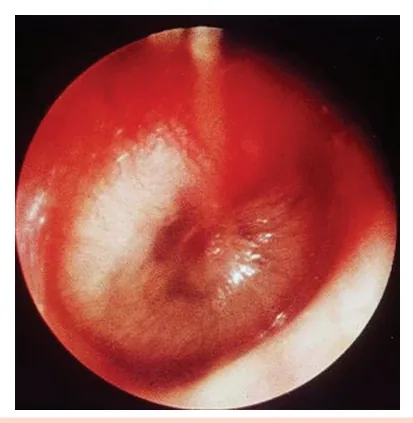
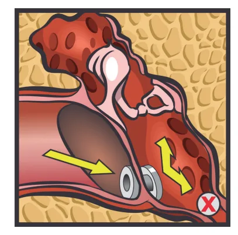
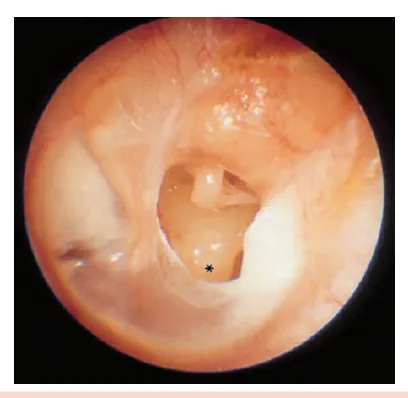
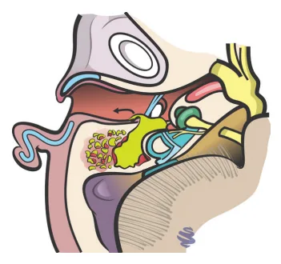
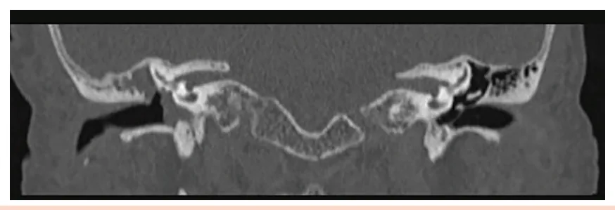
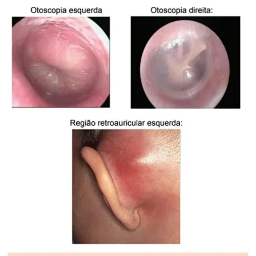
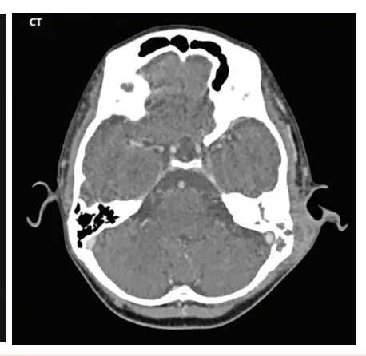

# Otologia I

<!-- page:1 -->

Otologia (CM) ANATOMIA Otite média crônica (OMC)

- Orelha externa: pavilhão auricular + conduto

- Simples: perfuração timpânica crônica + auditivo externo (CAE); otorreia intermitente;

- Orelha média: membrana timpânica + ossículos

- Supurativa: perfuração + otorreia frequente + erosão com rinofaringe);

(martelo, bigorna, estribo) + tuba auditiva (conecta ossicular. Tratamento: timpanomastoidectomia.

- Colesteatomatosa: tecido epidérmico destrutivo,

- Orelha interna: cóclea (audição), canais otorreia fétida (“ninho de rato”), risco intracraniano.

semicirculares e vestíbulo (equilíbrio), nervo Tratamento: mastoidectomia radical. cocleovestibular (VIII); Otite média com efusão (OME)

- Mastoide: pneumatizada, comunica-se com orelha

- Líquido sem infecção. Criança com atraso na fala, média → via de complicações infecciosas; hipoacusia. Membrana opaca, bolhas;

- Membrana timpânica normal: translúcida,

- Audiometria + timpanometria B. Tratamento:

cor perolada/acinzentada, com reflexo expectante até 12 semanas; tubo se persistente. luminoso no quadrante ântero-inferior, sem Complicações das otites abaulamentos/retrações.

- Extracranianas:

Otite externa difusa | Abscesso retroauricular: desloca pavilhão;

- Associada à água e traumas (cotonete). Agentes: drenagem/mastoidectomia.

Pseudomonas, S. aureus. | Abscesso cervical (Bezold): abaulamento

- Dor ao trago, prurido, otorreia; tímpano cervical profundo, dor no ECM; drenagem.

espesso, eritematoso. | Paralisia facial periférica: OMA (bom prognóstico)

- Tratamento: limpeza + ciprofloxacino tópico. x OMC (pior); tratar causa;

Otite externa maligna | Petrosite + Sd. Gradenigo (otalgia + dor retroz Idosos, diabéticos. Pseudomonas. Otalgia intensa + orbitária + paralisia VI);

otorreia + paralisia facial. | Labirintite: vertigem, hipoacusia

- Tratamento: internação + antibiótico profunda, sequelas.

intravenoso antipseudomonas por 6 semanas

- Intracranianas:

(ciprofloxacino, ceftazidima). | Meningite: febre, rigidez nucal, Miringite aguda fontanela abaulada;

- Bolhas hemorrágicas no tímpano/CAE. Associa- | Trombose seio sigmoide: febre + se a IVAS. abaulamento retroauricular;

- Dor súbita + otorreia sanguinolenta. Tratamento: | Abscessos (epidural, encefálico): cefaleia, sinais analgesia ± azitromicina. focais, convulsão.

Otite média aguda (OMA) Achados clássicos de prova

- Criança, IVAS prévia, otalgia + febre +

- Timpanometria tipo B → líquido abaulamento timpânico; retrotimpânico (OME).

- Agentes: S. pneumoniae (em queda), H. influenzae

- Colesteatoma → massa esbranquiçada, otorreia

(aumentando), Moraxella; fétida crônica, tomografia com erosão óssea.

- Watchful waiting: >2 anos, casos leves, reavaliar

- Fenômeno de Tullio → vertigem induzida por som em 48-72h; (fístula perilinfática).

- Antibiótico: Amoxicilina 50 mg/kg/dia. Se falha:

- Sinal de Hennebert → nistagmo com compressão amoxicilina + clavulanato (90 mg/kg/dia). do trago.

Otite média aguda recorrente (OMAR)

- Associação OMA + conjuntivite → H. influenzae.

- ≥3 episódios/6 meses ou ≥4/12 meses. Tratamento:

- Paralisia facial periférica → não poupa fronte tubo de ventilação. (acomete andar superior e inferior da face).

## ANATOMIA

- Orelha média: Tuba auditiva – estrutura que promove conexão grandes compartimentos: | Ossículos – responsáveis pela transmissão da

A orelha pode ser dividida, de modo geral, em 3 com a rinofaringe;

- Orelha externa: vibração mecânica da membrana timpânica para a Pavilhão auricular; orelha interna.Em respectiva ordem, de lateral para Conduto auditivo externo. medial: martelo - bigorna - estribo.

---

<!-- page:2 -->

Figura 1: Anatomia da orelha.

- Orelha interna:

- A membrana timpânica normal apresenta Cóclea – responsável por converter a energia coloração perolada ou acinzentada, translúcida, mecânica da vibração do som, em um impulso sem abaulamentos ou retrações, com mobilidade elétrico que se direciona para o SNC através do preservada e reflexo luminoso visível no quadrante nervo cocleovestibular/auditivo (VIII); ântero-inferior. Canais semicirculares e vestíbulo – compõem o labirinto, que é responsável por parte do equilíbrio; Conduto auditivo interno – contém o nervo facial

(VII) e cocleovestibular/auditivo (VIII).

- As estruturas da orelha média e da orelha interna são envoltas pelo osso temporal, um dos ossos que compõem a base do crânio. Uma das porções do osso temporal é a mastoide, região que, nos adultos, apresenta pneumatização importante.

- Verificar Figura 1

- A orelha média se comunica com as células da mastoide, fato que é relevante para compreender a disseminação de processos infecciosos para essa região.

## MEMBRANA TIMPÂNICA

- A função da membrana timpânica é transmitir as ondas sonoras do ar para os ossículos do ouvido Figura 2: Membrana timpânica esquerda normal.

médio (martelo, bigorna e estribo); A membrana se encontra íntegra e translúcida. É possível observar a impressão do cabo do martelo na membrana e o reflexo luminoso no quadrante ântero-inferior.

---

<!-- page:3 -->

MECANISMO DE TRANSMISSÃO DO SOM Manifestações clínicas

- Orelha externa: ressonância do som no conduto

- Otalgia insidiosa e refratária a analgésicos;

auditivo externo (CAE) até o tímpano;

- Otorreia fétida e purulenta;

- Orelha média: transmissão a partir do tímpano até

- Sinais sistêmicos geralmente ausentes, o que atrasa cadeia ossicular; diagnóstico correto.

cadeia ossicular;

- Orelha interna: conversão da energia mecânica do som em impulsos elétricos.

## OTITES EXTERNAS

## OTITE EXTERNA DIFUSA AGUDA

- Dermatite de parte, ou todo o conduto auditivo externo;

- Agentes bacterianos: Pseudomonas aeruginosa e

Staphylococcus aureus;

- História clínica: associação com atividades aquáticas e trauma local (ex.: uso de cotonete, trauma digital).

Manifestações clínicas

- Dor;

- Hipoacusia;

- Prurido;

- Plenitude auricular;

- Ausência de sintomas sistêmicos.

Exame físico

- Dor à palpação do tragus e à mobilização do pavilhão auricular.

- Otoscopia: Eritema e edema de pele, incluindo espessamento da membrana timpânica; Secreção serosa ou purulenta; Restos epiteliais com obstrução total ou parcial do canal auditivo externo.

Figura 3: Otite externa difusa aguda. Tratamento

- Ciprofloxacino tópico;

- Limpeza do CAE e proteção auricular.

## OTITE EXTERNA MALIGNA (NECROTIZANTE)

- Infecção invasiva e necrotizante do CAE;

- Pouco frequente, acomete principalmente idosos, diabéticos e indivíduos imunossuprimidos;

- Agentes bacterianos: Pseudomonas aeruginosa. diagnóstico correto.

m Exame físico

- Otorreia, formação de tecido de granulação em CAE;

- Alteração dos pares cranianos;

- Paralisia facial periférica – pelo acometimento do NC VII.

e Figura 4: Otite externa maligna. Observa-se otorreia purulenta e formação de tecido de granulação em CAE.

Exames complementares

- Tomografia computadorizada de ossos temporais e crânio com contraste: Descartar outras complicações e avaliar sinais de erosão e remodelamento ósseo das orelhas externa e média, achados bastante sugestivos de otite externa maligna;

- Outros exames podem ser utilizados em um segundo momento:

- Ressonância magnética de encéfalo, para avaliação do acometimento de base do crânio/encéfalo;

- Cintilografia com tecnécio-Tc99, avalia a extensão do processo de osteomielite;

- Cintilografia com gálio-Ga67, para controle de cura, uma vez que é um exame que normaliza após a erradicação do processo infeccioso.

Tratamento

- Internação hospitalar com antibioticoterapia endovenosa;

- Antibiótico sistêmico antipseudomonas por 6 semanas em média (ciprofloxacino, ceftazidima, piperacilina-tazobactam);

- Antibioticoterapia tópica (ciprofloxacino em gotas);

- Limpeza diária do CAE;

- Controle dos fatores de imunossupressão (ex.: no caso de diabéticos, controle glicêmico rigoroso).

---

<!-- page:4 -->

MIRINGITE AGUDA Tratamento

- Caracteriza-se pela formação de bolhas hemorrágicas

- Analgesia;

cobrindo a pele da membrana timpânica e do CAE;

- Paracentese das vesículas para alívio álgico;

- Demonstra associação com IVAS (infecção de vias

- Antibioticoterapia: macrolídeos, como azitromicina aéreas superiores) prévia; (grau de evidência questionável).

aéreas superiores) prévia;

- É mais comum em crianças e adultos jovens;

- Agente etiológico incerto: Classicamente associada ao Mycoplasma pneumoniae, porém, há evidência atual de infecção O por outros agentes, como Staphylococcus aureus e vírus respiratórios – influenza, vírus sincicial respiratório (VSR), adenovírus.

Manifestações clínicas F

- Dor intensa e súbita, seguida por otorreia sanguinolenta;

- Apresenta curso autolimitado.

- T f r

• Figura 5: Miringite aguda.

- Bolha hemorrágica localizada entre o CAE e a membrana timpânica.

Figura 6: Tuba auditiva na criança (à esquerda) e no adulto (à direita) (grau de evidência questionável).

## OTITES MÉDIAS

## OTITE MÉDIA AGUDA (OMA)

- Processo inflamatório agudo (com evolução em orelha média.

< 12 semanas) da mucosa de revestimento da Fatores de risco

- Ambientais: IVAS: pico de incidência em meses frios; Crianças que frequentem creches/escola; Tabagismo passivo; Uso de chupeta; Curto período de aleitamento materno; Posição supina durante o aleitamento.

- Hospedeiro: Predisposição genética; História familiar de OMA recorrente; Primeiro episódio antes dos 6 meses; Anormalidade craniofaciais (ex.: síndrome de Down); Fenda palatina não corrigida.

Tuba auditiva

- Em crianças, é mais curta e horizontalizada, o que favorece a progressão do vírus e das bactérias da rinofaringe para a orelha média.

- Verificar Figura 6

).

---

<!-- page:5 -->

Agentes etiológicos | No entanto, para ser efetivo, é preciso garantir a

- Vírus: VSR, influenza, parainfluenza. reavaliação neste exato período de tempo.

- Bactérias:

- Antibioticoterapia tem indicação nos seguintes casos: Streptococcus pneumoniae – 50% (em redução | < 6 meses de idade; Haemophilus influenzae não tipável – 30% (em ascensão nos últimos anos); Moraxella catarrhalis – 12%.

nos últimos anos); | Otorreia; nos últimos anos); O uso da vacina conjugada antipneumocócica tem reduzido a OMA por S. pneumoniae. No entanto, a vacinação para Haemophilus tipo B não reduz a incidência da OMA!

Manifestações clínicas

- Quadro prévio de IVAS;

- Febre alta > 38 °C;

- Otalgia;

- Irritabilidade;

- Hipoacusia.

Exame físico

- Otoscopia: Abaulamento da membrana timpânica (E ~ 97%); Membrana timpânica espessa, sem brilho, hiperemiada, hipervascularizada; Otorreia em CAE; Nível hidroaéreo.

Figura 7: Otite média aguda (OMA). Membrana timpânica espessa, edemaciada, sem brilho, hiperemiada e abaulada.

A associação de OMA e conjuntivite é mais comum em crianças. É causada pelo Haemophilus influenzae. Tratamento

- A maioria das crianças apresenta uma evolução favorável durante o episódio de OMA, com tendência a resolução espontânea;

- Conduta: antibioticoterapia x watchful waiting

(observação cuidados);

- Watchful waiting: Observação de sintomas por 48-72 horas, sem uso de antibioticoterapia; | Otorreia; Sinais de alarme: sepse, otalgia > 48 horas, febre > 39 °C.

- Outro fator que deve ser levado em consideração para decisão de antibioticoterapia ou watchful waiting é a lateralidade, conforme mostrado na Tabela 1.

Tabela 1: Conduta na OMA de acordo com a lateralidade da infecção. Idade Bilateral Unilateral 6 meses a Antibiótico ou Antibiótico 2 anos watchful waiting Antibiótico ou Antibiótico ou

> 2 anos watchful waiting watchful waiting

- Esquema antibiótico: 1° escolha: amoxicilina 50 mg/kg/dia, por 7-10 dias;

Lembre que, em caso de falha do tratamento, devemos pesquisar complicações. Se estiverem ausentes, considerar escalonamento para amoxicilina + clavulanato, em dose dobrada (90mg/kg/dia).

## OTITE MÉDIA AGUDA RECORRENTE (OMAR)

- Definição: 4 ou mais episódios em OMA em 12 meses; 3 ou mais episódios de OMA em 6 meses.

- Tratamento: Tubo de ventilação: É um tratamento cirúrgico que permite a aspiração do conteúdo líquido de retenção na orelha média e o posicionamento do tubo de ventilação, que, por sua vez, promove uma ventilação adequada da orelha média, evitando a estase de secreções na região; Reduz episódios de OMA e a necessidade de antibioticoterapia.

a Figura 8: Tubo de ventilação indicado na OMAR.

---

<!-- page:6 -->

## OTITE MÉDIA CRÔNICA (OMC)

- Tratamento:

- Caracterizada por um processo inflamatório crônico | Limpeza frequente de orelha;

(> 12 semanas) da mucosa de revestimento da | Antibioticoterapia tópica e via oral; orelha média. | Cirurgia: timpanomastoidectomia.

- Pode ser classificada em: Timpanomastoidectomia OMC simples, OMC supurativa e

- A timpanomastoidectomia é recomendada para casos

OMC colesteatomatosa. de OMC supurativa; OMC simples

- Se caracteriza por ser uma cirurgia com o objetivo de

- Perfuração crônica da membrana timpânica com máxima preservação da audição;

episódios intermitentes de otorreia.

- Nesta cirurgia, é realizado um broqueamento da

- Causas: mastoide através da região retroauricular, de forma a OMAs recorrentes com supuração; remover o máximo possível de tecido inflamatório das Trauma físico: agressão, barotrauma, células da mastoide e da orelha média;

corpo estranho.

- Depois deste passo, é o momento de reconstruir

- Quadro clínico: o tímpano para garantir o melhor desempenho Hipoacusia; auditivo possível. Otorreia intermitente.

- Investigação adicional: Audiometria: perda auditiva condutiva.

- Tratamento: Conservador: proteção auricular e uso de aparelho auditivo, se necessário; Cirúrgico: timpanoplastia. Em agudizações: manejar como OMA. Em alguns casos, deve-se considerar a cobertura para membrana timpânica. (segunda figura) de uma timpanomastoidectomia

Pseudomonas, com ciprofloxacino oral. Figura 9: Otite média crônica simples, mostrando perfuração da Figura 10: Pré-operatório (primeira figura) e pós-operatório OMC supurativa OMC colesteatomatosa

- As agudizações são frequentes, de otorreia com

- É uma lesão benigna de comportamento otalgia associada; destrutivo, caracterizada por tecido epidérmico

- Manifestações clínicas: escamoso e estratificado; Hipoacusia – pela perfuração timpânica e erosão

- Em outras palavras, “pele crescendo onde da cadeia ossicular; não deveria”. Otorreia recorrente, espessa.

- Na orelha média, este tecido apresenta um

- Exame físico: comportamento de crescimento progressivo que, Perfuração timpânica com edema de orelha além de comprimir estruturas adjacentes, promove média e otorreia. uma intensa reação inflamatória local. Desta forma, o

- Investigação: crescimento da lesão envolve progressivamente os Audiometria + tomografia de ossos temporais. ossículos da audição, tímpano, nervo facial, estruturas Velamento difuso da orelha e das células da da orelha interna e até mesmo, em casos extremos, a mastoide, sem sinais significativos de erosão óssea. base do crânio - tornando-se aí um importante foco de meningites e coleções intracranianas.

---

<!-- page:7 -->

Há o aparecimento de massa com atenuação de partes moles na região da orelha média direita, com destruição/ rarefação das estruturas ósseas ao seu redor.

- Tratamento: Casos iniciais: abordagens mais conservadoras, porção superior do conduto auditivo externo. Contudo, por ser uma lesão de lento crescimento, o colesteatoma inicial pode se com pequenas alterações.

Figura 11: OMC colesteatomatosa. Lesão esbranquiçada associada a erosão óssea na

- Quadro clínico: História insidiosa, de anos de evolução; História prévia comum de OMAs de repetição nos primeiros anos; Otorreia purulenta constante, fétida “ninho de rato”; Hipoacusia.

- Exame físico: Perfurações parciais ou totais da membrana timpânica; Massa esbranquiçada, compacta, com matriz lisa e brilhante, lamelas de queratina; Otorreia esverdeada/amarelada, fétida.

- Investigação: Audiometria: perda auditiva de padrão condutivo/ misto importante; Tomografia computadorizada de ossos temporais:

velamento difuso de orelha média e de células da mastoide, e osteíte e remodelamento ósseo importante.

| Ressonância magnética de ossos temporais: útil na avaliação de recidivas.

- Verificar Figura12 com second-look (segunda avaliação) programado mastoidectomia simples; Demais casos: mastoidectomia radical.

Figura 12: Tomografia de ossos temporais com OMC colesteatom | Casos iniciais: abordagens mais conservadoras, (exceção), incluindo timpanomastoidectomia e Mastoidectomia radical

- Na mastoidectomia radical, a preservação da audição está em segundo plano;

- O mais importante aqui é remover o máximo possível de lesão;

- Como o colesteatoma é uma lesão com alta chance de recidiva e seu sucesso cirúrgico depende de sua remoção completa, frequentemente precisamos sacrificar estruturas importantes para a audição;

- Portanto, após o broqueamento da mastoide, removemos a membrana timpânica, a parede óssea que corresponde à parede posterior do conduto auditivo externo, e partes dos ossículos da audição;

- Toda a orelha média e o conduto auditivo externo ficam comunicados por uma grande cavidade;

- Ainda há alguma transmissão de som através do osso temporal diretamente para a orelha interna, de forma que, a menos que a cóclea já tenha sido afetada pelo colesteatoma, o paciente ainda vai ter algum grau de audição após a cirurgia;

- Não é infrequente, no entanto, que estes pacientes necessitem, no futuro, de prótese auditiva para reestabelecerem níveis auditivos que possibilitem o convívio social.

- Verificar Figura 13 na próxima página

## OTITE MÉDIA DE EFUSÃO (OME)

- Caracterizada pela presença de fluido na orelha média, sem sinais ou sintomas de infecção otológica;

- Sinônimos: otite média secretora, serosa, mucoide.

Classificação

- Quanto à duração: OME aguda: < 3 semanas; OME subaguda: 3 – 12 semanas; OME crônica: > 12 semanas.

- Verificar Figura 13 na próxima página matosa à direita.

---

<!-- page:8 -->

- T

- - Figura 13: Pré-operatório (à esquerda) e pós-operatório (à direita) de uma mastoidectomia radical

.Etiologia

- Mau funcionamento da tuba auditiva, com dificuldade na drenagem de secreções: Obstrução após quadro da OMA, hipertrofia de adenoide, neoplasia de nasofaringe; Funcional após IVAS, sequela de radioterapia de cabeça e pescoço.

- Quadro clínico

- Criança: Falta de atenção; Alterações comportamentais; Atraso na linguagem e fala; E Aparelhos eletrônicos em volume excessivo.

- Crianças mais velhas e adultos: Plenitude auricular; Sensação de corpo estranho no ouvido; Hipoacusia.

- Exame físico

- Membrana opaca; I

- Bolhas retrotimpânicas;

- Nível hidroaéreo.

- Verificar Figura14

- Figura 14: Otite média de efusão com membrana opaca e bolhas retrotimpânicas.

Investigação

- Audiometria: Indicação: OME persistente por mais de 12 semanas; Mostra perda auditiva condutiva; Timpanometria tipo B.

suspeita de atraso na linguagem, problemas de aprendizado ou deficiência auditiva importante; Para efeito de provas de residência, uma “timpanometria tipo B” quase sempre sugere líquido retrotimpânico, achado compatível com a otite média de efusão e especialmente útil na avaliação de crianças nas quais a otoscopia deixa dúvidas quanto ao diagnóstico.

Tratamento

- Resolução espontânea em até 12 semanas, em 90% dos casos;

- Nos cenários de duração > 12 semanas ou na presença de fatores de risco: considerar tubo de ventilação;

- Fatores de risco: Deficiência visual/auditiva; TEA; Déficit intelectual; Alterações craniofaciais. Em caso de hipertrofia adenoideana considerar adenoidectomia.

## COMPLICAÇÕES DE OTITES

- Complicações de OMA são mais frequentes em crianças;

- Complicações de OMC são mais frequentes em crianças mais velhas e adultos.

## EXTRACRANIANAS

- Abscesso retroauricular;

- Abscesso cervical;

- Paralisia facial periférica;

- Petrosite;

- Labirintite.

## INTRACRANIANAS

- Meningite;

- Tromboflebite de seio sigmoide;

- Abscesso epidural;

- Empiema subdural;

---

<!-- page:9 -->

- Abscesso cerebral.

- Verificar Figura16

- Na suspeita ou confirmação de complicação de otite, Observa-se velamento difuso das células da mastoide a conduta será: esquerda, e uma pequena falha da camada cortical óssea Internação hospitalar; (imagem à esquerda). Sob contraste (imagem à direita), Antibioticoterapia endovenosa empírica; observa-se lesão hipoatenuante com halo periférico Antibioticoterapia endovenosa empírica; Tomografia computadorizada de ossos temporais e crânio com contraste.

## CELULITE/ABSCESSO RETROAURICULAR

- Extensão do processo infeccioso e inflamatório da orelha média para o periósteo e/ou tecido subcutâneo retroauricular;

- Caracteristicamente, apresenta edema e hiperemia retroauricular com deslocamento anterior do pavilhão auditivo.

Figura 15: Celulite e abscesso retroauricular à esquerda. A otoscopia da orelha esquerda mostra achados de OMA.

Figura 16: Tomografia de ossos temporais em paciente com absc observa-se lesão hipoatenuante com halo periférico hiperatenuante, compatível com abscesso retroauricular em orelha esquerda.

- Tratamento: Na OMA: drenagem de abscesso por via percutânea Miringotomia: procedimento no qual realizase uma pequena perfuração na membrana timpânica; no caso para drenar secreção purulenta. Pode ser realizado com anestesia local em adultos e pacientes colaborativos; Na OMC: drenagem via mastoidectomia.

/ mastoidectomia + miringotomia;

## ABSCESSO CERVICAL

- Complicação rara;

- Mais frequente em adultos;

- Quadro clínico insidioso;

- Disseminação do processo inflamatório para a ponta da mastoide (em contato íntimo com a musculatura cervical).

- Abscesso de Bezold: Percorre o trajeto do m.esternocleidomastoideo Quadro clínico: Dor cervical; Torcicolo; Aumento do volume na inserção superior do ECM.

(ECM) e o m. digástrico;

- Abscesso parafaríngeo: Trajeto posterior ao músculo digástrico; Quadro clínico: Dor cervical; Dor à deglutição; Trismo;

. | Abaulamento da parede faríngea lateral. cesso retroauricular.

---

<!-- page:10 -->

- Tratamento:

- Síndrome de Gradenigo: Drenagem cirúrgica cervical + mastoidectomia. | Otalgia; Dor retro-orbitária; Paralisia do abducente.

- - Figura 17: Abscesso de Bezold.

## PARALISIA FACIAL PERIFÉRICA

- Parte do nervo facial tem como trajeto a orelha média. Desta forma, ele se torna suscetível a processos inflamatórios, infecciosos e traumáticos da orelha média;

- Na OMA: Edema compressivo; Neurite tóxica; Deiscência espontânea do canal do facial.

- Na OMC por colesteatoma: Erosão óssea do canal do facial e compressão do nervo pela lesão. M

- Exame físico: Paralisia de andar inferior e superior da face; Sinal de Bell (rotação superior do globo ocular quando paciente tentar fechar os olhos).

- Tratamento: OMA: Apresenta bom prognóstico; Corticoterapia; Miringotomia, para redução da compressão do nervo facial; Se ausência de melhora em 2-3 semanas de evolução, mastoidectomia para drenagem. OMC: Tem pior prognóstico; Indicação de cirurgia precoce.

## PETROSITE

- Extensão do processo infeccioso para o ápice petroso;

- O ápice petroso é uma das porções do osso temporal que abriga estruturas como a cóclea, labirinto, nervos facial e cocleovestibular, e está próximo de estruturas como a artéria carótida interna e o nervo abducente

(VI par);

- Apesar de infecções desta região serem raras, podem T desencadear achados semiológicos específicos, sendo que até metade dos pacientes com extensão do processo infeccioso para essa região se apresentam com a síndrome de Gradenigo.

## LABIRINTITE

- É muito utilizada como sinônimo para tontura ou vertigem; Contudo, a labirintite, na verdade, é definida como uma disseminação inflamatória da orelha média e mastoide para a orelha interna, dentro de um contexto infeccioso ou inflamatório agudo;

- Labirintite serosa: Inflamação estéril; Apresenta-se com vertigem, zumbido e perda auditiva; Normalmente, não deixa sequelas.

- Labirintite supurativa: Inflamação com exsudato; Há um processo inflamatório intenso, com fibrose e ossificação em fase cicatricial;

- Quadro clínico: Vertigem intensa; Náuseas e vômitos; Perda auditiva profunda. Frequentemente, os pacientes evoluem para sequelas: perda auditiva completa e arreflexia vestibular.

- Tratamento: Sintomáticos e resolução do foco infeccioso.

## MENINGITE

- É a complicação intracraniana mais frequente;

- Representa 90% dos casos em crianças;

- Na OMA, os principais agentes etiológicos são:

pneumococo, Haemophilus;

- Na OMC, geralmente o quadro é asséptico;

- Quadro clínico e exame físico: Cefaleia intensa holocraniana; Febre elevada; Queda do estado geral e do nível de consciência; Sinais meníngeos rigidez nucal, sinais de Em recém-nascidos e crianças pequenas: hipotonia cervical e abaulamento de fontanelas.

Kernig e Brudzinski;

- Investigação inicial: Tomografia de crânio e ossos temporais com contraste + coleta de líquor.

- Tratamento: Internação hospitalar; Antibioticoterapia endovenosa; Na OMA: miringotomia para coleta de secreção para cultura e antibiograma; Na OMC: mastoidectomia.

## TROMBOFLEBITE DE SEIO SIGMOIDE

- Extensão ao seio sigmoide com formação de trombos e oclusão parcial ou total;

- Mais frequente na OMC colesteatomatosa;

- Tromboflebite supurada: metástases sépticas extracranianas;

---

<!-- page:11 -->

## REFERÊNCIAS

- O principal agente envolvido é o pneumococo (até

50% dos casos).

- Quadro clínico: Figura 2: Membrana timpânica esquerda normal. Febre; FLINT, Paul W.; HAUGHEY, Bruce H.; LUND, Valerie J. et al. Cummings Dor; Otolaryngology – Head and Neck Surgery. 5. ed. Philadelphia: Elsevier, 2021. Dor; Abaulamento retroauricular; Sinais de hipertensão intracraniana.

- Tratamento: Cirúrgica (mastoidectomia); O uso de anticoagulação é controverso.

## FÍSTULA PERILINFÁTICA

- Complicação mais associada ao colesteatoma (7% do casos);

- Resulta de uma erosão do labirinto ósseo, com comunicação de canal semicircular com orelha média

(mais frequente no canal semicircular lateral);

- Quadro clínico: Vertigem inespecífica; Perda auditiva neurossensorial; Fenômeno de Tullio: vertigem à exposição aos ruídos externos; Sinal de Hennebert: nistagmo horizontal à compressão do conduto auditivo externo;

- Tratamento: Exploração cirúrgica e correção da fístula.

## COLEÇÕES INTRACRANIANAS

- São complicações de alta morbidade e mortalidade;

- Apresentam-se com cefaleia persistente, otalgia, persistência da febre;

- Ainda, é preciso atentar para: Sepse; Cefaleia intensa; Hipertensão intracraniana; Sinais neurológicos focais; Convulsões.

- Tipos: Abscesso epidural; Empiema subdural; Abscesso encefálico.

- Tratamento - drenagem cirúrgica.

Figura 18: Abscesso intracraniano complicando quadro de OMA. Otolaryngology – Head and Neck Surgery. 5. ed. Philadelphia: Elsevier, 2021.

Figura 3: Otite externa difusa aguda. SANNA, Mario. Color Atlas of Otology: From Diagnosis to Surgery. 1st ed.

New York: Thieme Medical Publishers, 1999. Figura 4: Otite externa maligna. SANTOS, Cristina Oliveira Lopes de Macedo. Malignant external otitis – case report. Global Journal of Otolaryngology, v. 14, n. 3, p. 555889, 2018.

DOI: 10.19080/GJO.2018.14.555889. Figura 5: Miringite aguda. ABORL-CCF. Tratado de Otorrinolaringologia da ABORL-CCF. Rio de Janeiro: Elsevier, 2017.

Figura 7: Otite média aguda (OMA). ABORL-CCF. Tratado de Otorrinolaringologia da ABORL-CCF. Rio de Janeiro: Elsevier, 2018.

Figura 9: Otite média crônica simples, mostrando perfuração da membrana timpânica. ABORL-CCF. Tratado de Otorrinolaringologia da ABORL-CCF. Rio de Janeiro: Elsevier, 2018.

Figura 11: Otite média crônica colesteatomatosa. SANNA, Mario. Color Atlas of Otology: From Diagnosis to Surgery. 1. ed. New York: Thieme Medical Publishers, 1999.

Figura 12: Tomografia de ossos temporais com otite média colesteatomatosa à direita. RADIOPAEDIA. Acquired cholesteatoma. Disponível em: https://radiopaedia.

org/articles/acquired-cholesteatoma?lang=us. Acesso em: 22 mar. 2023. Figura 14: Otite média de efusão com membrana opaca e bolhas retrotimpânicas.

STANFORD. Otologic Surgery Atlas. Disponível em: https://otosurgeryatlas. stanford.edu/otologic-surgery-atlas/. Acesso em: 24 mar. 2023.

Figura 15: Celulite e abscesso retroauricular à esquerda. Acervo Medcof. Figura 16: Tomografia de ossos temporais em paciente com abscesso retroauricular.

RADIOPAEDIA. Subperiosteal abscess of the mastoid. Disponível em: https://radiopaedia.org/articles/subperiosteal-abscess-of-themastoid?lang=us. Acesso em: 18 mar. 2023.

Figura 17: Abscesso de Bezold. BOK, Jan-Willem. Bijzondere KNO-infecties: Hands-on. Almere: Zorggroep Almere, 2019. Disponível em: https://www.zorggroep-almere.nl/content/ uploads/Bijzondere-KNO-infecties-Hands-on-2019.pdf. Acesso em: 8 jul.

2025. Figura 18: Abscesso intracraniano complicando quadro de OMA. ABORL-CCF. Tratado de Otorrinolaringologia da ABORL-CCF. São Paulo:

Atheneu, 2017.

