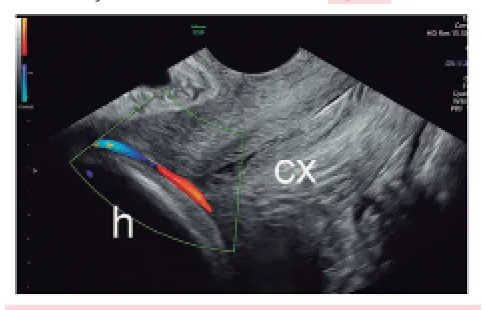
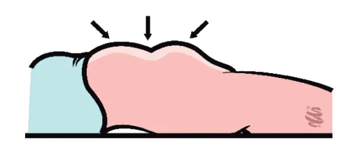

# Outros Sangramentos de Segunda Metade da Gestação

<!-- page:1 -->

## Outros Sangramentos de Segunda Metade da Gestação

**Tópicos**: rotura uterina; rotura de vasa prévia; rotura de seio marginal.

## Rotura Uterina

**Clínica:**

- **Iminência de rotura uterina**: sinais de Bandl e Frommel;
- **Sinais de rotura consumada**: subida da apresentação fetal ao toque vaginal, alívio da dor por interrupção das contrações, choque hemorrágico, ausência de batimentos cardiofetais (BCF).

**Conduta:**

- Iminência de rotura: cessar contrações e parto cesárea;
- Rotura: laparotomia exploradora.

## Definição

- É dada pela abrupta solução de continuidade de todas as camadas da parede uterina, incluindo a camada serosa superficial.

## Fatores de Risco

- Rotura em gestação anterior;
- Incisão miometrial prévia, especialmente nos casos com miomectomia;
- Uso de ocitocina, com fase ativa prolongada;
- Trauma abdominal (automobilístico, versão cefálica externa);
- Fraqueza intrínseca (Ehlers-Danlos tipo IV; malformação mülleriana);
- Parto obstruído (desproporção cefalopélvica), taquissistolia;
- Iatrogenia (manobra de Kristeller).

## Antes do Rompimento Uterino

- **Sinal de Bandl**: refere-se à presença de anel de constrição patológico → gera o "sinal da ampulheta";
- **Sinal de Frommel**: ligamento redondo retesado;
- Dor intensa em segmento inferior;
- Bradicardia fetal.

Figura 1: Útero em ampulheta.

## Rotura de Vasa Prévia

**Clínica:**

- Sangramento pós-amniotomia, indolor, de início súbito e com sofrimento fetal sustentado e grave;
- É o único sangramento de origem fetal.

## Rotura de Seio Marginal

**Clínica:**

- Sangramento periparto, em pequena quantidade, indolor, com ausência de sofrimento fetal agudo e tônus uterino normal.

## Após o Rompimento Uterino

- Subida da apresentação fetal ao toque vaginal;
- Alívio da dor por interrupção das contrações → choque hemorrágico;
- Ausência de batimentos cardiofetais (BCF);
- **Sinal de Laffont**: dor escapular (por irritação do nervo frênico);
- **Sinal de Cullen**: hematoma periumbilical.

## Conduta

- Se cessação das contrações uterinas → parto pela via mais rápida;
- Alto risco de histerectomia;
- Suporte hemodinâmico.

## Rotura de Vasa Prévia — Fisiopatologia

- Vasos fetais desprotegidos que passam sobre as membranas que estão sobre o colo do útero e sob a apresentação fetal;
- Acontece principalmente quando há: inserção marginal de cordão; placenta bilobada ou suscenturiada; inserção velamentosa de cordão.

Figura 2: Vasos fetais sobre o colo do útero. cx: colo do útero; h: cabeça fetal.

---

<!-- page:2 -->

## Manifestações Clínicas — Vasa Prévia

- Sangramento de início súbito, indolor;
- Normalmente, pode ocorrer após a amniotomia;
- Sofrimento fetal agudo sustentado e grave;
- A origem do sangramento é **fetal**!

## Quadro Clínico — Rotura de Seio Marginal

- Sangramento súbito periparto, sem outros sintomas associados;
- A origem do sangramento é **materna**!

## Diagnóstico (Vasa Prévia)

- Inspeção da placenta;
- Ultrassonografia com dopplerfluxometria.

## Conduta (Vasa Prévia)

- **Cesárea eletiva com 36 semanas**: quando houver diagnóstico precoce;
- **Cesárea de emergência**: caso o diagnóstico seja dado durante o trabalho de parto, com sofrimento fetal.

## Rotura de Seio Marginal

- É a rotura da periferia do espaço interviloso (seio marginal);
- A origem do sangramento é **materna**!
- O diagnóstico é dado através da histopatologia.

**Conduta:**

- Vigilância clínica;
- Monitorização materno-fetal.

## Referências

Figura 2: Vasos fetais sobre o colo do útero. Oyelese, Y.; Javinani, A.; Shamshirsaz, A. A. Vasa Previa. Obstetrics and Gynecology, v. 142, n. 3, p. 503-518, set. 2023. doi: 10.1097/AOG.0000000000005287.
