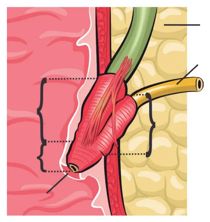
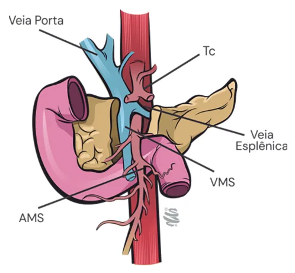
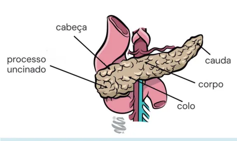
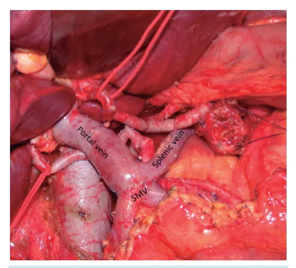
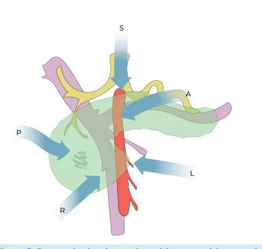
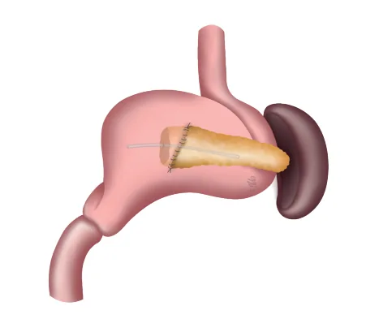
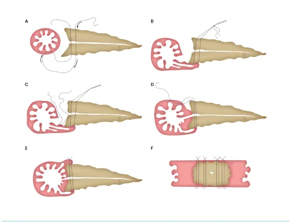
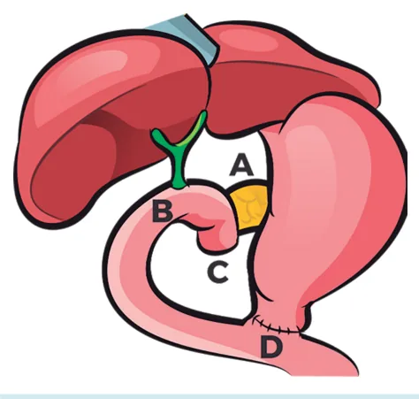
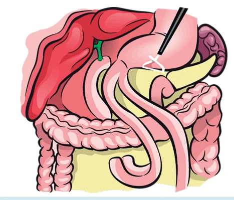

# Pâncreas e Vias Biliares Adenocarcinoma de Pâncreas

<!-- page:1 -->

## PÂNCREAS E VIAS BILIARES

## ADENOCARCINOMA DE PÂNCREAS

Pâncreas e via biliares Tumores periampulares

- Adenocarcinoma Ductal: > 90% dos Tumores malignos do pâncreas exócrino;

- Demais 10%: Mucinosos, mistos ou ACINAR; <1% dos tumores do pâncreas; Aumento de enzimas pancreáticas (Paniculite, poliartralgia e eosinofilia);

- Maior parte dos pacientes diagnosticados com doença irressecável ou metastática;

- Dos ressecados: menos de 30% obtém sobrevida irregularid avançado

Sem contato arterial / sem contat Ressecável Envolvimento venoso > 180º grau Borderline Envolvimento venoso < 180 Abaulamento Localmente Impossibilidade d Envolvimento (irressecável)

- Tumores borderline são submetidos à QT neoadjuvante com finalidade de diminuir riscos de ressecção marginal (R1);

- O principal esquema indicado para neoadjuvância é o FOLFIRINOX;

- As principais complicações relacionadas ao tratamento cirúrgico do câncer de pâncreas são:

## SÍNDROME COLESTÁTICA/

## ICTERÍCIA OBSTRUTIVA

- Dilatação das vias biliares intra e extra-hepáticas;

- Aumento de bilirrubina direta;

- ICTERÍCIA OBSTRUTIVA → PRINCIPAL

## ACHADO CLÍNICO

| Icterícia; | Acolia fecal; | Colúria; | Prurido. tardia livre de doença;

- 70% localizados na cabeça pancreática;

- Estadiamento: TC T/A/P COM CONTRASTE (Permite avaliar relação com estruturas vasculares); CA 19.9 - Importância PROGNÓSTICA (sobretudo quando muito aumentado) Não se faz biópsia se tumor ressecável! Biópsia (EUS ou percutânea) se diagnóstico duvidoso, neoadjuvância, Irressecabilidade ou metástase a distância;

to venoso OU contato venoso ≤ 180° sem Cirurgia dade de contorno us, com possibilidade de reconstrução;

0º com irregularidade de parede; Biópsia o arterial < 180 graus de reconstrução venosa Biópsia o arterial > 180º graus | Gastroparesia;

| Fístula pancreática; | Infecção de sítio cirúrgico; | Pseudoaneurismas arteriais (Menos incidente porém potencialmente MUITO grave!).

Figura 1: Nessa região pode haver quatro tipos histológicos de neoplasias (adenocarcinoma de pâncreas, de duodeno, tumor de papila duodenal, colangiocarcinoma de colédoco distal).

Ampola da Vater: confluência do colédoco distal com o ducto pancreático principal (Wirsung) e a segunda porção duodenal.

---

<!-- page:2 -->

## EXAMES DE IMAGEM

- USG (normalmente é o primeiro exame): Achado de dilatação das Vias biliares intra e extra-hepáticas;

Normalmente é o primeiro exame;

- TC / RM abdome com colangiorressonância;

- TC / RM abdome com colangiorressonância;

- EDA com visão lateral;

- EcoEndoscopia;

## QUANDO SUSPEITAR DE NEOPLASIA?

- Idade maior que 60 anos (geralmente);

- Sinais sistêmicos: Anemia; Emagrecimento; Inapetência;

- Sinal de Courvoisier-Terrier → palpação da vesícula biliar hiperdistendida e indolor.

## CÂNCER DE PÂNCREAS

- EPIDEMIOLOGIA

- Adenocarcinoma Ductal → >90% dos Tumores do pâncreas exócrino;

- Os outros 10% são tumores mucinosos, misto

(adenoescamoso) ou acinar (veremos adiante);

- 4ª Causa de morte por câncer nos EUA

(homens e mulheres). ADENOCARCINOMA DUCTAL

- Tumor periampular mais comum (~70%);

- Prognóstico ruim; Sobrevida global em 5 anos 20-25% entre pacientes operados e 10-12% em não-operados;

- Localização: 70% → cabeça e processo uncinado; 20% → corpo; 10% → cauda.

Tabela 1: Apresentação de sintomas de câncer de pâncreas D

- Apresentação de sintomas Frequência (%)

Icterícia 75 Perda de peso 51

- Dor abdominal 39

Náusea/vômito 13

- Prurido 11 gastrointestinal

Febre 3 Sangramento * Dor abdominal normalmente de difícil controle. Figura 2: Câncer de pâncreas

## ADENOCARCINOMA ACINAR (ACC)

- Raro (< 1% de todas as neoplasias primárias do pâncreas), prognóstico relativamente melhor que o ductal;

- Pode ocorrer elevação de enzimas pancreáticas no plasma (valores por vezes superiores a cinco dígitos), pois acomete a parte exócrina do pâncreas;

- Paniculite Pancreática: inflamação do tecido subcutâneo formando nódulos podendo ser confundido com eritema nodoso. Pode ocorrer em cerca de 15% dos pacientes com ACC; Quando o tema é cobrado em prova, frequentemente menciona caso de paciente com paniculite (inflamação da gordura do subcutâneo ocorrido em decorrência da secreção das enzimas pancreáticas no plasma, ocasionando deposição no subcutâneo);

- Poliartralgia e Eosinofilia.

## ESTADIAMENTO DO ADENOCARCINOMA

## DUCTAL

- TC TAP (tórax, abdome e pelve com contraste) → Método de escolha para o estadiamento e determinação de ressecabilidade Trifásico, cortes finos, reconstruções multiplanares (MPR); Não vê carcinomatose peritoneal muito bem.

Sensibilidade ~ 85%;

- RM: Reservada para pacientes com disfunção renal Benefício potencial para pacientes com nódulos inferiores a 2 cm ou para investigação de metástase hepática;

(contraste iodado na TC) ou alergia:

- Marcadores tumorais: CA 19.9 (Sensibilidade 79%, Especificidade 82%) câncer de pâncreas; não é câncer-específico (a própria colestase pode justificar o seu aumento);

→ Frequentemente expresso em pacientes com tem valor prognóstico (sobretudo quando muito aumentado);

| CEA: nem todos cânceres de pâncreas expressa CEA.

---

<!-- page:3 -->

- Não realizar biópsia se o tumor é ressecável;

- EcoEDA + PAAF: Diagnóstico duvidoso (pseudotumor inflamatório, pancreatite autoimune, etc); Neoadjuvância; Neoadjuvância; Irressecabilidade ou metástase à distância

(indicação de QT paliativa).

- Laparoscopia para estadiamento: Indicada para suspeita de carcinomatose ou metástases hepáticas pequenas, não adequadamente caracterizáveis por imagem). Indicações mais bem-aceitas: Tumores maiores que 4 cm;

Algumas instituições eventualmente a padronizam como rotina. (particularmente à esquerda da veia porta – corpo e cauda)

| Ascite; | Linfonodos regionais notadamente aumentados aos exames de imagem; | CA19.9 muito elevado (> 1000 U/l);

| Lesões hepáticas ou peritoneais pequenas e incaracterísticas aos exames de imagem.

## ESTAVDIAMENTO TNM

- T1 → ≤2 cm;

- T2 → >2 cm;

- T3 → extensão além do pâncreas sem envolvimento arterial;

- T4 → envolvimento arterial (tronco celíaco / AMS Artéria Mesentérica Superior).

## REVISÃO DE ANATOMIA PARA MELHOR COMPREENSÃO DO TRATAMENTO CIRÚRGICO

- Estruturas vasculares: Veia Mesentérica Superior (VMS) → passa posterior ao colo do pâncreas. Veia Esplênica → passa paralelamente ao sentido do corpo do pâncreas. Veia porta → confluência da veia mesentérica superior e veia esplênica. Tronco Celíaco (TC) → ramos: Artéria gástrica esquerda; Artéria esplênica; Artéria hepática comum. Artéria Mesentérica Superior (AMS).

Figura 3: Pâncreas: órgão alongado. Cabeça → região mais proximal. Processo uncinado → relação com a segunda porção duodenal. Colo → relação com a veia e a artéria mesentérica superior (AMS). Corpo e Cauda → regiões mais distais; Figura 4: Estrutura vascular CRITÉRIOS DE RESSECABILIDADE Tabela 2: Critérios De Ressecabilidade Sem acometimento Ressecável de ramos arteriais ou Cirurgia venosos* Envolvimento venoso > 180º graus, com possibilidade de reconstrução;

Envolvimento Borderline venoso < 180º Biópsia com irregularidade de parede; Abaulamento arterial < 180 graus Impossibilidade de reconstrução venosa Localmente Envolvimento arterial Biópsia avançado (irressecável) > 180º graus O que é, por definição, ressecável borderline?

Alto risco para ressecção com margens positivas (R1 ou R2) (Definição anatômica) Alta suspeição para doença metastática – Marcador muito elevado ou imagem extrapancreática indeterminada (Definição biológica)

Paciente de baixa performance e alto risco de morbi-mortalidade (Definição condicional)

---

<!-- page:4 -->

CONDUTA Lesões Borderline: Lesões Ressecáveis

- EcoEndoscopia + PAAF;

- Cirurgia + Quimioterapia Adjuvante;

- Drenagem da via biliar por CPRE, com prótese

- Não drenar via biliar se não houver indicação; idealmente metálica;

- Critérios para Drenagem da via biliar:

- Quimioterapia neoadjuvante;

- Critérios para Drenagem da via biliar: Colangite; Complicações sistêmicas (Insuficiência renal aguda Atraso para cirurgia; Hiperbilirrubinemia isolada não é critério para drenagem!

/ Coagulopatia grave); L

- T

- - Figura 5: B - Envolvimento venoso pelo tumor. C Ressecção segmentar.

- A

- - Figura 6: Confluência da VMS reconstruída em rafia com a veia esplênica, pós-GDP.

Figura 7: Exame de imagem de pâncreas e vias biliares - Quimioterapia neoadjuvante;

- Cirurgia se boa resposta ou estabilidade do tumor e boa performance do paciente.

Lesões localmente avançadas/ irressecável:

- QT paliativa;

- Drenagem da via biliar por CPRE (idealmente prótese metálica);

- Metástase → prótese metálica + QT paliativa.

Sobrevida limitada.

## TRATAMENTO SISTÊMICO

- Obrigatório num contexto de tratamento curativo, seja neoadjuvante ou adjuvante;

- Para QT neoadjuvante (com ou sem RT; Mais comumente sem) → esquemas: FOLFIRINOX / mFOLFIRINOX (combinação de drogas); Gemcitabina + nab-Paclitaxel;

- Para QT Adjuvante: Preferencialmente FOLFIRINOX (melhor performance) ou Gemcitabina + Capecitabina

(pior performance);

## TRATAMENTO CIRÚRGICO - CABEÇA

- Gastroduodenopancreatectomia (Cirurgia de Whipple).

Artery-First Approach:

- Identificação e isolamento da AMS antes de qualquer passo irreversível (controle vascular como primeiro grande passo da cirurgia)

- Seis possíveis formas de abordar a AMS: Posterior Medial Posterior Esquerdo (“Left Posterior”) Inferior (supra e inframesocólico) Superior

- A mais utilizada é a via posterior: manobra de Kocher ampla até a aorta retropancreática.

Figura 8: Formas de abordagem da artéria mesentérica superior.

---

<!-- page:5 -->

Figura 9: Manobra de Kocher ampla.. Anastomose pancreática

- O “Calcanhar de Aquiles” da Duodenopancreatectomia;

- Pode ser feita com o delgado (pancreatojejunal estômago (pancreatogástrica);

/ mais comumente realizada) ou com o

- Telescopagem (dunking) ou Ducto-mucosa; Técnica ducto-mucosa mais comumente realizada:

Blumgart (Grobmyer et al, 2009); Figuras 10 e 11: Reconstrução com o jejuno (acima) e com o estômago (abaixo). Figura 12: Dunking.

; Figura 13: Anastomose Ducto-mucosa. Figura 14: Anastomose Ducto-mucosa com técnica de Blumgart.

- Stent no Wirsung ou Drenagem Externa do Wirsung pode ser utilizada para prevenir fístula ou diminuir sua morbidade;

Figura 15: Stent no Wirsung com Drenagem Externa

---

<!-- page:6 -->

Reconstrução da GDP O conceito de “mesopâncreas”

- Técnica de escolha varia de acordo com a preferência Plexos nervosos, tecido linfático e conjuntivo do cirurgião; Conceito recente mas que tem como único Reconstrução em alça única (mais propósito: DIMINUIR A INCIDÊNCIA DE MARGENS feita atualmente); EXÍGUAS E COINCIDENTES feita atualmente); Reconstrução em dupla alça.

- Figura 16: Reconstrução da GDP j

( Figura 17: Reconstrução em alça dupla. Linfadenectomia

- A linfadenectomia sempre foi um tema muito debatido pois muitos favoreciam dissecções estendidas como forma de aumentar a radicalidade cirúrgica.

- ENTRETANTO:

- Não aumenta a sobrevida global

- Riscos adicionais intraoperatórios (morbidade cirúrgica) e tardios (diarreia crônica, dificuldades para manutenção de peso corporal)

- CALMA: O nome e número das cadeias não é habitualmente cobrado! Apenas a topografia. Na GDP: Sufra e infrapilóricos, A. Hepática (8a), Lig. Na Pancreatectomia corpo-caudal: Hilo esplênico

Hepatoduodenal (e hilo hepático), arco duodenal e cabeça pancreática (17) e AMS proximal (14) (+ baço), A. esplênica e infrapancreático EXÍGUAS E COINCIDENTES

## TRATAMENTO CIRÚRGICO - CORPO E CAUDA

- RAMPS (Radical Antegrade Racional: Garantir melhor margem radial e melhor linfadenectomia Planos de ressecção: Folheto anterior à Gerota, esquerda OU Com adrenalectomia esquerda)

Modular PancreatoSplenectomy) Ressecção da Gerota (Preservando Adrenal

- DP-CAR (Distal Pancreatectomy with Celiac Artery Tumores de corpo pancreático com invasão do Artéria hepática própria “vascularizável” pela Casos MUITO selecionados Revascularização (próteses ou enxertos arteriais) Riscos: Isquemia hepática Isquemia gástrica juntamente à cirurgia)

Resection) ou Appleby Tronco Celíaco Gastroduodenal (Pancreatoduodenal inferior) (muitas vezes é realizada gastrectomia total Figuras 18 e 19: Cirurgia de Appleby.

---

<!-- page:7 -->

COMPLICAÇÕES PÓS-OPERATÓRIAS | Fístula pancreática → fator de risco; | Sangramento pode ser intraluminal ou extraluminal;

Tabela 3: Complicações Pós-Operatórias | Diagnóstico: angioTC de abdome; | Tratamento: primariamente ENDOVASCULAR.

Complicações Frequência (%) | Cirurgia apenas se instabilidade (alta mortalidade). Complicações Frequência (%)

Esvaziamento gástrico 14-30% retardado (gastroparesia) Fístula do pâncreas 12-20% Infecção da ferida 7% Abscesso intra-abdominal 6% Eventos cardíacos 3% Fístula biliar 2% Reoperação geral 3%

- Algumas bibliografias divergem quanto a incidência das complicações.

- Fístula pancreática (Amilase no dreno 3x superior ao LSN); Tipo A (hoje chamamos de extravasamento bioquímico): Assintomático; Tipo B: Assintomático com dreno > 3 semanas ou Sintomática → solicitar “iBagem” para verificar coleções não drenadas pelo dreno sentinela, por exemplo. Avaliar necessidade de manutenção do dreno ou nova drenagem. Tipo C: Catastrofe / “Cevera” / Choque / Cirurgia;

Exemplos: dreno não contempla, abertura de anastomose, fístula que causa erosão de gastroduodenal;

- Fístula da anastomose biliodigestiva: Rara (< 5%).

- Fístula da anastomose gastrojejunal (mais raro ainda);

- Pseudoaneurisma arterial (esplênica ou gastroduodenal): Na GDP gastroduodenal, na corpo-caudal esplênica; Complicação rara, porém grave; | Cirurgia apenas se instabilidade (alta mortalidade).

- Gastroparesia: Elevada incidência; Associação com sepse / coleções pós operatórias e fístula pancreática; Sem diferenças entre preservação pilórica (GDP vs. DPT); Reconstrução antecólica é favorecida à transmesocólica; Enteroanastomose a Braun pode ser considerada na DPT; Nutrição enteral/parenteral, fracionamento de dieta e procinéticos são medidas gerais adotadas quando a mesma ocorre.

- Sangramento

- Infecção

## REFERÊNCIAS

Figura 5: B - Envolvimento venoso pelo tumor. C Ressecção segmentar. Acervo pessoal - Medcof Figura 6: Confluência da VMS reconstruída em rafia com a veia esplênica, pós-GDP.

Acervo pessoal - Medcof Figura 7: Exame de imagem de pâncreas e vias biliares Gaillard F, Sattar A, radiology2 u, et al. Pancreatic ductal adenocarcinoma.

Reference article, Radiopaedia.org (Accessed on 09 Jun 2025). ;
