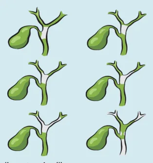
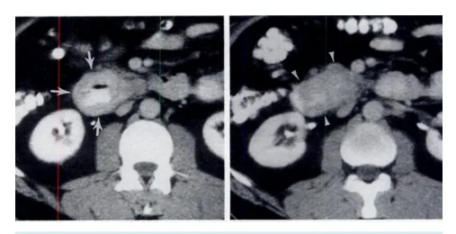
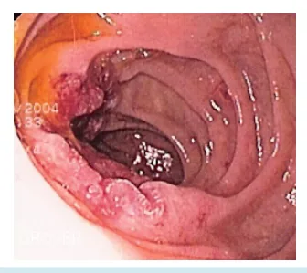
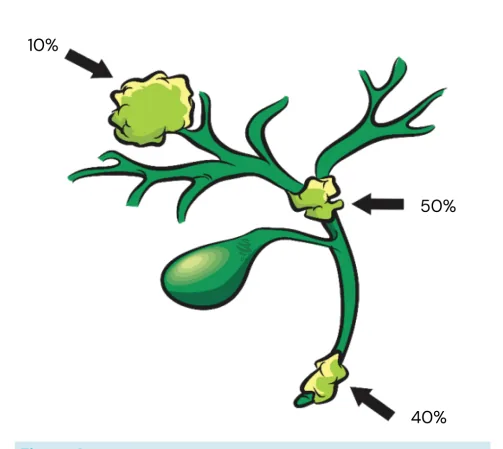
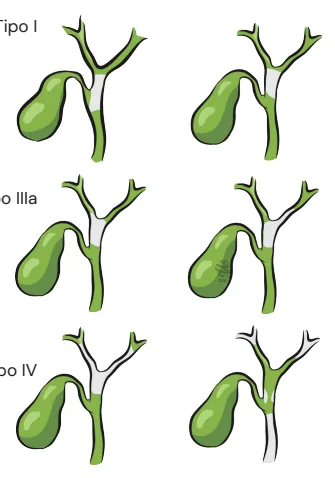
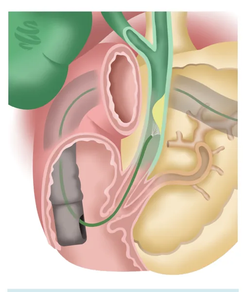
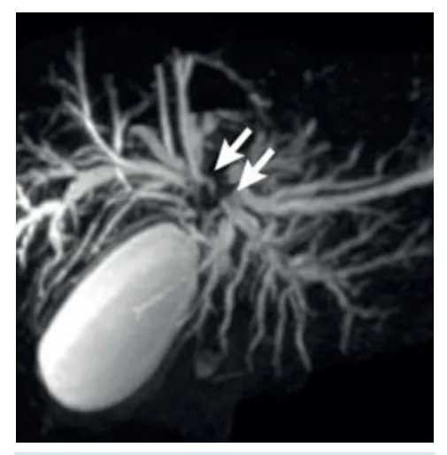
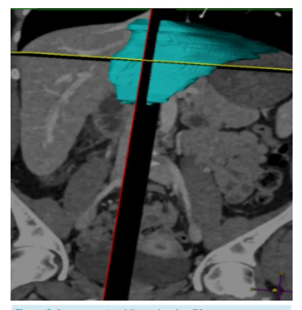
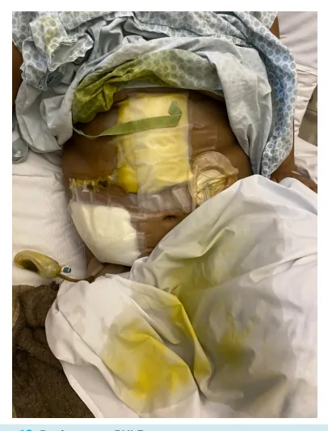
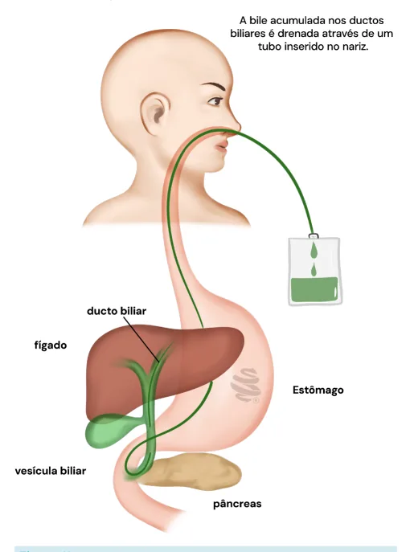

# Pâncreas e Vias Biliares Outros Tumores Periampulares

<!-- page:1 -->

## PÂNCREAS E VIAS BILIARES: OUTROS

## TUMORES PERIAMPULARES

Pâncreas e vias Biliares

## Tumor de Papila

- Mais infrequente entre os tumores periampulares;

- Quadro clínico: Síndrome Colestática, PORÉM: Sintomas mais precoces; Icterícia flutuante; HDA;

- Diagnóstico: EDA (+ visão lateral), TC T/A/P;

- Tratamento: GDP/DPT.

Tumor de Duodeno

- Melhor prognóstico dentre os

- Classificação de Bismuth-Corlette: 1º - Adenocarcinoma; | Tipo III – Ressecção da via biliar extra- 2º - TNE; hepática, hepatectomia do lobo acometido + 3º - GIST / Tumores mesenquimais; caudectomia + linfadenectomia

tumores periampulares; | Tipo I e II – Ressecção da via biliar extraz Tipos histológicos: hepática + linfadenectomia

- Associação com PAF, Von Recklinghausen, Doença | Tipo IV – Ressecção da via biliar extra-hepática, de Crohn, Doença Celíaca etc; hepatectomia extensa (trissetorectomias,

- Diagnóstico: EDA / Estadiamento: TC T/A/P; geralmente) + caudadectomia + linfadenectomia

- Tratamento: GDP/DPT, Gastroenteroanastomose | Irressecável – Tx?

(se irressecável);

- IMPORTANTE: Critérios de Spigelman auxiliam definição quanto a GDP profilática em pacientes com PAF e polipose duodenal (nº de pólipos, tamanho, histologia e grau de displasia).

Colangiocarcinoma

- Tumores do epitélio de revestimento dos ductos biliares;

- Prognóstico muito ruim, com sobrevidas de aproximadamente 10% em 12 meses (5-20% em cinco anos dependendo da fonte);

- Confluência Biliar: Tumores de Klatskin; Classificação de Bismuth-Corlette é o tema mais cobrado em concursos;

- Procedimentos Auxiliares:

- Ressecabilidade dos tumores peri-hilares é | Drenagem Biliar: Feita num contexto de prédiretamente dependente de dois fatores: operatório (icterícia aumenta MUITO o risco Envolvimento vascular; de falência hepática pós-hepatectomia) Fígado remanescente adequado; ou paliação;

- Maioria irressecável ao diagnóstico. | Embolização de Veia Porta (± Deprivação

- Localização: Venosa): Intuito de AUMENTAR REMANESCENTE; 10% intrahepáticos;

- Principais fatores associados com 50% peri-hilares; mortalidade perioperatória: 40% distais; | INFECÇÃO (colangite, principalmente); Ressecção vascular.

- Sintomas mais precoces;

- HDA (hemorragia digestiva alta).

- Raro.

## DIAGNÓSTICO

## QUADRO CLÍNICO

- Endoscopia com visão lateral → melhor exame

- Icterícia obstrutiva; para diagnóstico; Icterícia Flutuante (pode melhorar e piorar por

- Colangiorressonância → útil para diagnóstico necrose da papila); diferencial de tumor do colédoco distal;

---

<!-- page:2 -->

- TC TAP (tórax, abdome e pelve). TRATAMENTO

- GDP;

- Gastrojejunoanastomose (paliativo);

- Duodenectomia com preservação de papila: Discutida como alternativa em lesões que pré-maligna);

Figura 1: Tumor de papila duodenal DIAGNÓSTICO DIFERENCIAL: Adenoma (lesão

## TRATAMENTO

- GDP (melhor prognóstico que o adenocarcinoma);

- Alternativa → Ampulectomia endoscópica. Tratamento possível para o adenoma de papila ou para a lesão não invasiva à endoscopia com magnificação; Indicação controversa (risco de recorrência, estenose da junção biliopancreática, complicações associadas ao procedimento): Pode ser feito de forma convencional (cirúrgica transduodenal) ou endoscópica.

## TUMORES DE DUODENO

- Raro;

- Melhor prognóstico entre periampulares.

## TIPOS HISTOLÓGICOS

- 1º: Adenocarcinoma (mais comum)

- 2º: Tumores neuroendócrinos

- 3º: GIST / Leiomiossarcomas.

## FATORES DE RISCO

- PAF (polipose adenomatosa familiar);

- Síndromes de Lynch;

- Neurofibromatose tipo 1 (Von Recklinghausen);

- Doenças de Crohn e celíaca.

- Icterícia obstrutiva;

- Sintomas obstrutivos TGI;

- Emagrecimento.

## LOCALIZAÇÃO

- Periampular (mais frequente);

- Supra-ampulares;

- Infra-ampulares (Até o Treitz). | Discutida como alternativa em lesões que preservem a Ampola de Vater; Estudos se limitam a séries de casos, e portanto, é conduta de exceção.

Figura 2: Tumores de Duodeno Figura 3: Tumores de Duodeno

## POLIPOSE DUODENAL NA PAF

- Critérios de Spigelman: Avaliam risco de progressão para câncer e podem indicar duodenopancreatectomia profilática (estágio IV).

Tabela 1: Critérios de Spigelman Escore Fator 1 ponto 2 pontos 3 pontos Número de 1-4 5-20 > 20 pólipos Tamanho do 1-4 5-10 > 10 pólipo (mm)

TúbuloHistologia Tubular Viloso Viloso Displasia Baixo grau - Alto grau

---

<!-- page:3 -->

- Interpretação: CLASSIFICAÇÃO DE BISMUTH-CORLETTE Sem pólipos - Estágio 0

- Tipo I → próximo à confluência, porém com a 1-4 pontos - Estágio I confluência livre; 5 e 6 pontos - Estágio II

- Tipo II → acomete confluência (klatskin); 7 e 8 pontos - Estágio III

- Tipo IIIa → confluência + ducto hepático direito; 7 e 8 pontos - Estágio III 9-12 pontos - Estágio IV

## COLANGIOCARCINOMA

## CONCEITOS

- Surge onde tem epitélio de revestimento de ducto biliar:

- Classificação: Intra-hepático → 10% dos casos; 2° tumor primário do fígado mais frequente (depois do CHC); Confluência biliar (tumor de Klatskin) → 50% dos casos; Distal (periampulares) → Colédoco em toda sua extensão (incluindo próximo à papila) → 40% dos casos;

- Sobrevida global em 1 ano: aproximadamente 10%.

Figura 4: Colangiocarcinoma FATORES DE RISCO

- Colangite esclerosante primária (principal) –

6-20% risco;

- Cistos de colédoco;

- Litíase intrahepática;

- Cirrose (viral, NAFLD);

- Síndrome de Lynch;

- Papilomatose biliar múltipla.

## SINAIS E SINTOMAS

- Icterícia obstrutiva progressiva: (prurido, icterícia, acolia fecal, colúria) → 90%;

- Síndrome consumptiva;

- Dor abdominal;

- Intrahepáticos: Oligo/Assintomáticos. - Tipo IIIa → confluência + ducto hepático direito;

- Tipo IIIb → confluência + ducto hepático esquerdo;

- Tipo IV → confluência + ambos ductos hepáticos;

- Tipo V → multifocal.

Tipo I Tipo II - Klatskin Tipo IIIa Tipo IIIb D.V Tipo IV Tipo V Figura 5: Classificação de Bismuth-Corlette.

## ESTADIAMENTO

- Exames: conforme LOCALIZAÇÃO;

- USG abdome → Exame de “triagem”, mas com pouco valor diagnóstico; Dilatação de vias Biliares (intrahepática segmentar ou com interrupção da confluência, ou intra e extrahepática - distal); Ausência de cálculos motiva a realização de

## MAIS EXAMES

- Colangiorressonância; Muito mais acurada para determinar topografia da obstrução biliar e envolvimento ductal;

- Tomografia: Importante para avaliação do envolvimento vascular; Avaliação quanto há suspeita de metástase a distância;

- EcoEDA / Ultrassonografia endoscópica (EUS): Tumores do colédoco distal no qual a colangioRM é inconclusiva Pode ser associada à CPRE quando há indicação de drenagem endoscópica da via biliar;

- Marcadores tumorais (CA 19.9 e CEA): São solicitados mas devem ser interpretados com ressalvas; Muitas vezes não são expressos pelo tumor, e seu valor negativo não exclui diagnóstico; CA 19.9 não é marcador câncer específico e pode estar elevado pura e simplesmente pela obstrução do trato biliar;

---

<!-- page:4 -->

| Seu valor passa a ter grande significado prognóstico quando MUITO ELEVADO → Levanta suspeição de doença metastática;

Diagnóstico presumivelmente radiológico, visto que Diagnóstico presumivelmente radiológico, visto que citologia/histologia são FREQUENTEMENTE negativos:

Solução possível (para casos irressecáveis): Colangioscopia (SpyGlass® e novas plataformas similares)

a a

- C

- Figura 6: Colangioscopia

- LEMBRAR DE COLANGIOCARCINOMA SE DILATAÇÃO

DA VIA BILIAR SEM CÁLCULOS!!!

- - Figura 7: Colangiorressonânia de vias biliares.

Setas: local de obstrução do tumor Figura 8: Colangiografia por CPRE: alternativa para coleta de biópsia, por exemplo.

CPRE é pouco terapêutica quando há obstruções altas devido a necessidade de cateter longo para drenagem, pouco disponível.

Para diagnóstico é ideal fazer via menos invasiva (necessidade de anestesia geral, papilotomia endoscópica, risco de pancreatite).

## ESTADIAMENTO TNM (AJCC, 8ª ED)

Importante: como o colangiocarcinoma pode ocorrer em toda a árvore biliar, o estadiamento TNM não acaba sendo cobrado em prova;

- Então o que eu preciso saber? Critérios de ressecabilidade (para o Klatskin).

## CRITÉRIOS DE RESSECABILIDADE (PARA O

## KLATSKIN)

- O tumor deve ser ressecado juntamente à árvore biliar envolvida e o hemifígado envolvido com margens adequadas;

- O fígado remanescente deve ser adequado às demandas do indivíduo e preservar de forma intacta: Inflow arterial e portal Drenagem biliar de ressecabilidade!

A invasão vascular é geralmente o principal limitador

## E QUANDO É IRRESSECÁVEL? (FALANDO DO

- Fatores do Paciente: Condições clínicas desfavoráveis, cirrose com hipertensão portal;

- Fatores locais: Envolvimento bilateral de ductos biliares até ramificações secundárias; Envolvimento circunferencial / oclusão da veia porta; Envolvimento circunferencial de ramo portal com atrofia do lobo hepático contralateral; Envolvimento ductal até ramos secundários com atrofia do lobo contralateral;

- Fatores distantes: Linfonodos para além do ligamento hepatoduodenal; Metástases à distância.

---

<!-- page:5 -->

TRATAMENTO CIRÚRGICO | Cirurgia complexa concomitante à hepatectomia (hepatoduodenopancreatectomia, por exemplo);

Tabela 2: Tratamento do Colangiocarcinoma | Qualquer hepatectomia maior em pacientes com doença crônica ou fígado lesado (por QT, esteatose, Local do Melhor estratégia cirúrgica colestase etc);

ColanLgoioccaal rdcoin oma Melhor estratégia cirúrgica Hepatectomia + linfadenectomia do hilo hepático

- Não há indicação de hepatectomias regradas intrahepáticos.

Tumores (contanto que se atinja margem negativa)

- Envolvimento linfonodal para além do hilo hepático pode ser considerado contraindicação à cirurgia.

- I e II - ressecção da via biliar extra hepática (com congelação de margens) hepaticojejunostomia em Y de Roux.

+ linfadenectomia +

- III - Hepatectomia (com ressecção de toda a via biliar envolvida) + linfadenectomia

+ hepaticojejunostomia em Y Tumores perihilares de Roux; (Klatskin)

- IV - Ressecções complexas vezes inclusive envolvendo reconstruções vasculares da porta e da bifurcação)

(trissegmentectomias), por (quando há envolvimento

- (apenas em centros especializados quaternários).

- Frequentemente os tipos diagnóstico!

III e IV são irressecáveis ao Duodenopancreatectomia Tumores distais (procedimento de Whipple)/

## GDP

Considerações - Tumor de Klatskin

- Elevado índice de margens comprometidas: Extensão microscópica invasiva (intramural e não invasiva (superficial) → A operação do Klatskin deve ocorrer em serviço que disponha de Congelação; Margens recomendadas: 1 a 2 cm (raramente é possível obtê-las);

- Necessidade de hepatectomias extensas: Todos os procedimentos envolvem ressecção do caudado (S1), permitindo completa exposição do hilo hepático; Hemi-hepatectomias (D ou E) a trissegmentectomias para Bismuth III e IV;

- Embolização de Veia Porta: atualmente incorporada enquanto procedimento pré operatório para grande parte dos casos; Remanescente hepático ≤ 30% (algumas literaturas consideram 40%); Reconstrução tridimensional com volumetria hepática e de vascularização (portografia) através de CT/RM; Necessária bilirrubina total < 2mg/dL; colestase etc);

Figura 9: Reconstrução tridimensional na TC Drenagem biliar pré-operatória

- Colangite (Kanai, 1996);

- Alívio da icterícia e recuperação da capacidade funcional do fígado;

- Prevenção de Post Hepatectomy Liver Failure (PHLF) Tipo A: clinicamente bem + alteração laboratorial. Tipo B: piora clínica, piora da função renal, oligúria, ascite, porém sem necessidade de UTI. Tipo C: Possível desenvolver encefalopatia, coma, edema cerebral;

Figura 10: Paciente em PHLF

---

<!-- page:6 -->

- Transhepática percutânea (DTPH):

- Demais indicações: ainda sob estudo clínico. Risco não desprezível de “semear” metástases

- Tratamento Paliativo no seu trajeto; | 1ª Linha: Cisplatina (CDDP) + Gemcitabina Menos colangite / pancreatite; | 2ª Linha: FOLFOX Espoliação de água / eletrólitos. | Inibidores de Checkpoint: Durvalumab aumento do Espoliação de água / eletrólitos.

- Endoscópica (CPRE): Mais “fisiológica”, porém maior risco de insucesso e de colangite, obstrução de prótese etc;

- Drenagem Nasobiliar: Baixa morbidade, pouco usado em nosso meio; Maior força em países asiáticos; E No Blumgart 6th Ed. Primeira linha;

- - R e d c

Figura 11: Catéter nasal para a via biliar TRATAMENTO ONCOLÓGICO a

- Neoadjuvância: Ainda somente em contexto de clinical trial; G

- Tratamento adjuvante: QT baseada em a fluoropirimidinas (capecitabina – 1ª escolha); De maneira geral, os colangiocarcinomas a respondem mal à QT; São bons respondedores à RT (entretanto, as A doses requeridas são tóxicas ao fígado normal e estruturas adjacentes); A

Categoria 2A (deve ser considerada). G

- Métodos mais precisos como alternativa para doença irressecável ou com margem comprometida pós ressecção; | Inibidores de Checkpoint: Durvalumab aumento do tempo global de sobrevida Desenvolvimento de Classificação Molecular e possíveis novos alvos terapêuticos: FGFR2,

IDH1, HER2 E O PAPEL DO TRANSPLANTE?

- NCCN: paciente com tumores irressecáveis com: ≤ 3cm em diâmetro radial; Sem metástases intra/extra-hepáticas; Sem doença linfonodal mensurável;

- Podem ser considerados para Transplante hepático;

- Mayo Clinic: Protocolo bem estruturado (final da década de 1980); Tratamento neoadjuvante (QT+RT) → Tx; Bons resultados!

- Brasil: Protocolo em fase de implementação/aprovação; Critérios de inclusão bastante restritos e todos os pacientes listáveis deverão ser aprovados em câmara técnica nacional; Videolaparoscopia diagnóstica com biópsias linfonodais (8a, 8p. 12a, 12p) é MANDATÓRIA previamente à inclusão em lista.

## REFERÊNCIAS

Figura 1: Tumor de papila duodenal Adenocarcinoma de papila duodenal maior. Disponível em https:// endoscopiaterapeutica.net/pt/atlas-imagem/adenocarcinoma-de-papiladuodenal-maior/. Acesso em 08 de junho de 2025.

Figura 2: Tumores de Duodeno. Duodenal cancer. Disponível em https://en.m.wikipedia.org/wiki/Duodenal_ cancer. Acesso em 08 de junho de 2025.

Figura 3: Tumores de Duodeno. Mudgal P, Niknejad M, Yap J, et al. Duodenal adenocarcinoma. Reference article, Radiopaedia.org (Accessed on 09 Jun 2025).

Figura 7: Colangiorressonância de vias biliares. Gaillard F, Knipe H, Silverstone L, et al. Cholangiocarcinoma. Reference article, Radiopaedia.org (Accessed on 09 Jun 2025).

Figura 8: Colangiografia por CPRE: Gaillard F, Knipe H, Silverstone L, et al. Cholangiocarcinoma. Reference article, Radiopaedia.org (Accessed on 09 Jun 2025).

Figura 9: Reconstrução tridimensional na TC Acervo pessoal - Medcof Figura 10: Paciente em PHLF. Acervo pessoal - Medcof

