# Pâncreas e Vias Biliares Pancreatite Crônica

<!-- page:1 -->

## PÂNCREAS E VIAS BILIARES

## PANCREATITE CRÔNICA

Principais causas:

- ALCOOLISMO (tabagismo POTENCIALIZA o risco)

- Idiopático (causas muitas vezes não determinadas)

Demais fatores:

- Hereditários

- Mutações não-hereditárias

- Malformações (pâncreas divisum)

- Obstruções ductais (IPMN, pós traumático, pós cirúrgico)

- Autoimune

Quadro clínico:

- Dor (80%)

- Insuficiência pancreática: exócrina (diarreia, esteatorreia, desnutrição) e endócrina

(diabetes pancreatogênico) Diagnóstico: IMAGEM

- TC: Mais disponível Menor sensibilidade Não invasivo

- RM (+ colangioRM): Menos acessível Não invasivo Mais caro

- EUS: Melhor acurácia Caro, menos acessível e invasivo

## RECORDANDO O BÁSICO

EMBRIOLOGIA, ANATOMIA E FISIOLOGIA:

- Pâncreas é formado como anexo ao tubo digestivo. Ventral → cabeça do pâncreas e processo uncinado. Ducto da porção ventral se funde biliar Broto dorsal brotos ventral e dorsal do pâncreas se aproximam e fusi

Broto dorsal e broto ventral se fundem após rotação do tubo digestivo. Rot Vesícula Brotos ventral Figura 1: Em roxo: precursor de hepatócitos e fígado. Em verde fu D.V Tratamento:

- Antes de mais nada: CESSAR A CAUSA

- Avaliação/acompanhamento nutricional

- Analgesia escalonada

- Tratamento da insuficiência pancreática

- Cirurgia: melhor desfecho no controle da DOR Se tiver ducto dilatado: PANCREATOJEJUNOSTOMIA Se não tiver ducto dilatado:

ressecção pancreática

- Endoscopia: É alternativa, mas de menor eficácia a longo prazo. Tem boa fundamentação para tratar complicações! Primeira linha no tratamento dos pseudocistos sintomáticos Primeira linha no tratamento intervencionista da ascite pancreática / derrame pleural pancreático com ducto de porção dorsal formando ducto de Wirsung. Uma parcela do ducto do broto dorsal se oblitera obliteração do ducto de santorini com drenagem ineficaz para papila duodenal menor levando a quadros de pancreatite de repetição.

(ducto de santorini) - pâncreas divisum não tem tação Porção dorsal Porçao ventral ionam após a rotação do broto ventral ao redor do intestino utura via biliar extra hepática.

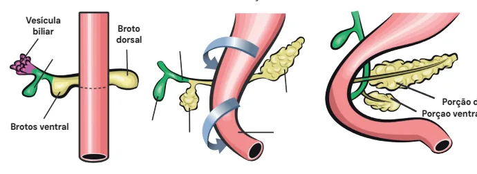

---

<!-- page:2 -->

## ESTRUTURAS ANATÔMICAS

- Cabeça do pâncreas: em contato com a segunda porção duodenal.

Cabeça

- Processo uncinado: porção mais inferior e medial da cabeça do pâncreas que tem contato com os vasos cabeça do pâncreas que tem contato com os vasos mesentéricos superiores;

- Colo;

- Corpo;

- Cauda.

- Verificar Figura 2

- Verificar Figura 3

- Veia mesentérica superior (VMS), veia esplênica curtos, recebe veia mesentérica inferior). Artéria mesentérica superior. Tronco celíaco (TC) se divide em artéria hepática comum, artéria gástrica esquerda e artéria esplênica.

(drena baço, cauda e corpo pancreático, gástrico

## FUNÇÃO EXÓCRINA DO PÂNCREAS

- Estímulos: secretina e colecistocinina (CCK).

- Pâncreas sofre estímulos hormonais (colecistoquinina, secretina) sinalizando chegada de alimentos no tubo digestivo, ativando proenzimas: Amilase pancreática - quebra macro carboidratos Lipase pancreática - auxilia na digestão das gorduras junto com bile Outros: tripsinogênio, quimiotripsinogênio, prócarboxipeptidase, pró-elastase, inibidor da tripsina (SPINK1)

- Todas pró-enzimas não são ativadas dentro do pâncreas em atividade normal. São ativadas pelas enteroquinases ao cair no tubo digestivo.

- Verificar Figura 4

- SPINK1: inativa enzimas enquanto estão dentro do pâncreas. Quando possui alteração genética que leva a seu defeito de ação, leva a ativação de pró-enzimas dentro do pâncreas.

Secretina CCK Ácinos:

- Amilase

- Lipase

- Tripsinogêni

- Quimiotripsi

- Pró-carboxi

- Pró-elastase

- Inibidor da t

Figura 4: Pâncreas Normal Cauda Corpo Processo Colo Uncinado Figura 2: Anatomia TC Veia Esplênica

## VMS

## AMS

Figura 3: Imagem com pâncreas seccionado.

- Amilase

- Lipase

- Tripsina io - Quimiotripsina inogênio - Carboxipeptidase ipeptidase - Elastase e tripsina (SPINK)

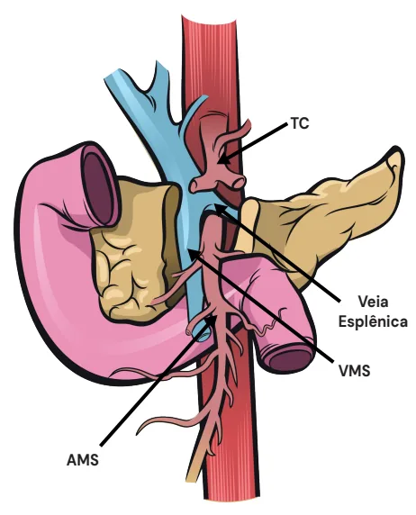

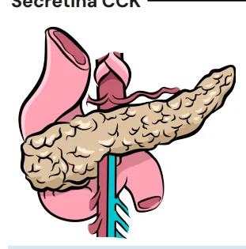

---

<!-- page:3 -->

## PÂNCREAS NORMAL ETIOLOGIA

- Envolvimento de fatores ambientais e fatores genéticos; Fatores genéticos podem ou não ser hereditários;

- A maioria dos pacientes tem mais de uma

Figura 5: Microscopia de um pâncreas normal

- Microscopia de um pâncreas normal. Presença de ácinos pancreáticos na periferia com formação de ductos das glândulas exócrinas. Ilhotas de langerhans, células endócrinas com produção de hormônios pancreáticos (insulina, glucagon, somatostatina).

## INTRODUÇÃO

- Definição: inflamação persistente que leva à substituição progressiva do parênquima normal por fibrose;

- Manifesta-se por: Dor abdominal crônica (principal sintoma); Disfunção glandular (endócrina e/ou exócrina)

(mais tardio);

- Epidemiologia (EUA): Incidência: 5 a 12 / 100.000 hab;

Prevalência: 50 / 100.000 hab;

- Histologia: Perda de ácinos e ilhotas com substituição por fibrose podendo formar focos de calcificação intra pancreáticos (característico de pancreatite alcoólica).

- Verificar Figura 6 etiologia envolvida;

Figura 6: Atrofia progressiva do parênquima pancreático. Seta: fo - A maioria dos pacientes tem mais de uma

- Causas podem ser elencadas utilizando-se dois acrônimos:

TIGAR-O: Tóxico-Metabólico; Idiopático; Genético; Autoimune; Recorrente; Obstrutiva. MANNHEIM: Múltiplos; Álcool; Nicotina; Nutricionais;

Hereditária; Efferent Pancreatic Duct (ex. Pâncreas divisum, ou pâncreas anular); Imunológico; Metabólico.

## PRINCIPAIS CAUSAS

1º lugar: Álcool (42-77% dos casos)

- Ação sinérgica do cigarro junto ao álcool, de forma dose-dependente;

- Menos de 5% dos alcoolistas, isoladamente, desenvolvem pancreatite crônica.

2º lugar: Idiopático (28% a 80%):

- Genes envolvidos com a pancreatite idiopática: 50% (SPINK1, CFTR): Mutações não hereditárias SPINK1 (gene inibidor da triPISCINA); CFTR (Cystic Fibrosis Transmembrane Receptorreceptor transmembrana de troca de íons associado a viscosidade da secreção de glândulas exócrinas). 1% (PRSS1 - hereditariedade). Padrão de herança autossômica dominante. Atividade anormal (aumentada) da tripsina, favorecendo inflamação crônica).

(mais prevalentes)

- Quando considerar causas genéticas? Pancreatite crônica juvenil (< 35 anos); Pancreatite crônica de etiologia desconhecida e histórico familiar positivo.

a oco de calcificação.

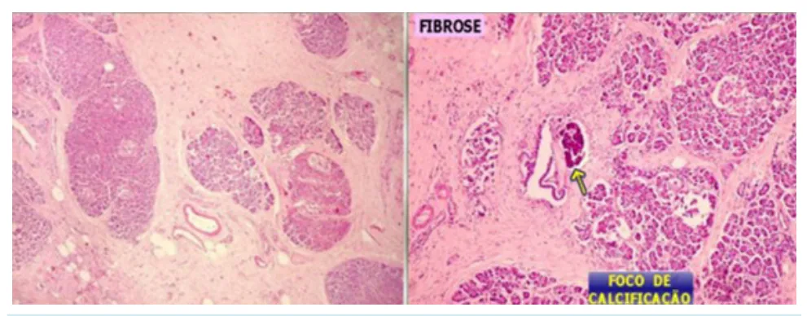

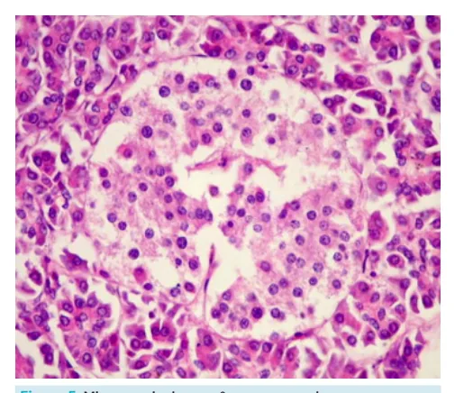

---

<!-- page:4 -->

Manejo: Aconselhamento familiar x consideração para DIAGNÓSTICO medidas mais radicais (pancreatectomia total com

- Exame de imagem: fundamental para o diagnóstico;

autotransplante de ilhotas).

- 1ª linha → Tomografia Computadorizada (TC) de

Abdome Superior com Contraste Endovenoso (EV): MANIFESTAÇÕES CLÍNICAS | Amplamente acessível, baixo custo, MANIFESTAÇÕES CLÍNICAS Dor Abdominal:

- Presente em aproximadamente 80% dos pacientes;

- Não guarda relação com a extensão da doença.

- Aguda: Processo inflamatório (ativação de mastócitos, citocinas pró-inflamatórias e estímulo de nociceptores);

- Crônica: Aumento na pressão ductal (estenose / cálculos) das enzimas dentro dos ductos pancreáticos; Dor neuropática (estímulo nociceptivo repetitivo leva ao aumento da sensibilização – seja ela central ou periférica – à dor: hiperalgesia e alodínia).

→ dificuldade da excreção pancreática e ativação Alteração do padrão de dor ou associação com outros sintomas podem refletir presença de complicações (massa inflamatória em cabeça pancreática, pseudocisto, evolução para câncer de pâncreas etc).

Insuficiência Pancreática:

- Exócrina: Esteatorreia - não digestão adequada de gorduras, causando aumento de gordura nas fezes aproximadamente 90%): Deficiência de vitaminas lipossolúveis (A, D, E, K); Confere maior risco de: Osteoporose (23% dos casos); Osteopenia (40% dos casos); 3x mais chance de fratura. Emagrecimento / Sarcopenia.

(associada à perda avançada de função acinar, em

- Endócrina: Diabetes Mellitus (pancreatogênico): Sensibilidade periférica à insulina preservada, porém não há massa suficiente de células beta-pancreáticas; Não é recomendada restrição calórica; Hipoglicemiantes orais: recomendados se resistência insulínica ou capacidade secretória de insulina preservada; Insulinização como primeira linha.

Figura 7: Pancreatografia por RNM com cálculo calcificado dentro do pâncreas (seta amarela) com dilatação do ducto de Wirsung (em azul) com dificuldade de secreção, ativação enzimática dentro do pâncreas com dor crônica pior às alimentações. | Amplamente acessível, baixo custo, não invasiva e alta sensibilidade para calcificações e complicações;

| Desvantagem: visualização sub-ótima do DPP (ducto pancreático principal ou ducto de wirsung) e baixa sensibilidade para doença inicial.

Figura 8: TC de abdome com contraste EV com pouco parênquima e focos de calcificação de parênquima com cálculo calcificado levando a dilatação do ducto de Wirsung (achados protótipos da pancreatite crônica).

- 2ª Linha → Ressonância Magnética (RM) de Abdome Maior acurácia para ducto (visualiza dilatações, estenoses e ductos secundários) e parênquima; Possibilidade de realizar RM com estímulo EV de secretina (avaliação quantitativa), que possibilita ver em tempo real o enchimento do ducto de wirsung; Menos disponível e de alto custo.

Superior com Colangiorressonância: Figura 9: RNM corte axial ponderado em T2 (canal medular, vesícula e estômago em branco) wirsung tortuoso, substituição do parênquima pancreático por fibrose e dilatação do ducto principal.

- 3ª Linha → Ultrassom Endoscópico (EUS): Exame preferencial para a pancreatite aguda recorrente de causa inexplicada (35% evoluem para pancreatite crônica)

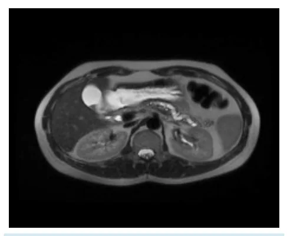

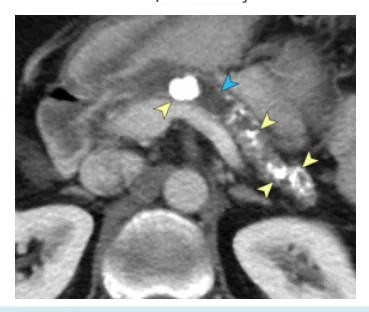

---

<!-- page:5 -->

| Avalia critérios do parênquima (lobularidade, | Indireto: Dosagem de atividade de quimotripsina cistos, focos hiperecóicos no parênquima e fecal ou elastase pancreática fecal (< 100 mcg/g)

cordões hiperecogênicos, que correspondem

- Avaliação de distúrbios carenciais, anemia, diabetes e a calcificação ou cicatrizes) e do ductais outras complicações potencialmente relacionadas à cálculos, ecogenicidade das paredes ductais e ductos secundários). Mais invasivo, operador dependente e requer sedação; Útil para doença extremamente precoce.

(dilatação, irregularidade, calcificações ou pancreatite crônica; (dilatação, irregularidade, calcificações ou Critérios de Rosemont

1. Focos hiperecoicos ou bandas

2. Lobularidade com “faveolamento” / “favo de mel”

3. Margem hiperecoica do Wirsung

4. Ductos secundários dilatados

Diagnóstico: pelo menos DOIS dos 4 critérios, incluindo obrigatoriamente (1) ou (2). Figura 10: Asterisco: calcificação ductal (área hiperecogênica);

Cabeça de seta: DPP dilatado; seta: focos hiperecogênicos com sombra acústica. CPRE → pouco espaço para diagnóstico, mais utilizada para tratamento (retirada de cálculos, colocação de stents para estenoses, papilotomia duodenal menor nos casos de pâncreas divisum).

Laboratório

- Amilase e lipase são úteis para diagnóstico de pancreatite aguda, mas não para a pancreatite crônica.

- Laboratório deixou de ter função diagnóstica para ter função estadiadora / coadjuvante.

- Avaliação da função exócrina: Direto: Teste de secretina (sob estímulo / avalia o pH intraduodenal / caro, invasivo e pouco recomendado) pancreatite crônica;

- Avaliação de gordura fecal (teste de Sudam) → 7g/dia. Perdeu espaço com aumento da disponibilidade dos exames de imagem.

TRATAMENTO CLÍNICO:

- Cessar fatores de risco (abstinência alcoólica, cessação do tabagismo e remoção das demais causas, se identificáveis);

- Avaliação nutricional: Rastreio de desnutrição / sarcopenia; Tratamento de distúrbios carenciais;

- Analgesia escalonada (AINEs, antiespasmódicos, opioides fracos e adjuvantes para dor neuropática);

- Trial de enzimas pancreáticas;

- Tratamento do diabetes pancreatogênico;

- Controle de dor IRREGULAR a despeito de analgesia e cessação de fatores de risco? Há obstrução ductal por cálculos/estenose? Avaliar tratamento INTERVENCIONISTA; Cochrane, 2015 → superioridade da Cirurgia sobre a Endoscopia no controle da dor; Intervenção cirúrgica precoce pode auxiliar na preservação da função pancreática.

Tratamento Endoscópico

- Na endoscopia, pode ser realizada: Papilotomia, dilatação e extração de cálculos com balão / basket (até 5 mm) Dilatação de estenoses ductais Mais recente: pancreatoscopia e litotripsia

(próteses em paralelo) (eletro-hidráulica ou laser)

## TRATAMENTO CIRÚRGICO

Ducto pancreático principal dilatado (> ou = 7mm)

- Derivações pancreato-jejunais. Pancreatojejunostomia latero-lateral.

- Puestow e Gillesby (1957): Primeira descrição técnica; Pancreatectomia distal e esplenectomia com anastomose pancreato-jejunal latero-lateral.

Figura 11: Técnica de Puestow

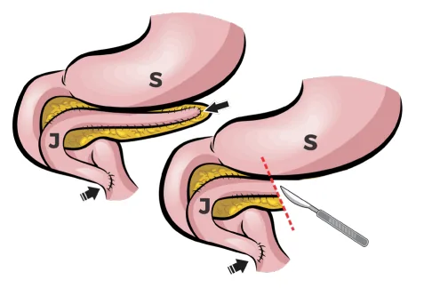

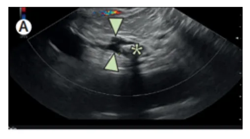

---

<!-- page:6 -->

- Partington e Rochelle (1960):

- Frey (1987): Técnica mais próxima da utilizada atualmente. | Ressecção segmentar da cabeça do pâncreas; Melhor controle álgico (?).

Melhor recomendação quando NÃO HÁ LESÃO / MASSA INFLAMATÓRIA NA CABEÇA Opção nos casos de DPP dilatado + massa NÃO HÁ LESÃO / MASSA INFLAMATÓRIA NA CABEÇA DO PÂNCREAS!

Figura 12: Esquematização da técnica de Partington-Rochelle p a i Figura 13: e 14 Setas brancas (wirsung aberto na transversal)

Seta preta (anastomose pancreatojejunal). Opção nos casos de DPP dilatado + massa inflamatória na cabeça do pâncreas.

Pâncreas Duodeno Cálculos pancreáticos Anastomose pancreatojejunal Figura 15: Cirurgia de Frey com ressecção segmentar da cabeça do pâncreas com incorporação à anastomose

- Alternativa: ressecção da cabeça pancreática com preservação duodenal (Cirurgia de Beger) Pode ser utilizada tanto em ductos dilatados quanto não-dilatados;

Figura 16: Cirurgia de Beger parte da cabeça do pâncreas foi ressecada com incorporação por anastomose em corpo e cabeça de pâncreas junto com coledoco intrapancreático fazendo uma derivação em Y de Roux.

Ducto pancreático principal (DPP) <7mm:

- Ressecção pancreática.

- Doença predominantemente na cauda pancreática: Pancreatectomia distal;

- Doença predominante na cabeça pancreática: Gastroduodenopancreatectomia (GDP); Duodenopancreatectomia (DPT). Ressecção da cabeça pancreática com preservação duodenal (Beger).

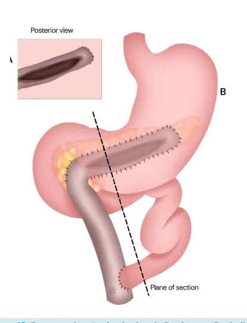

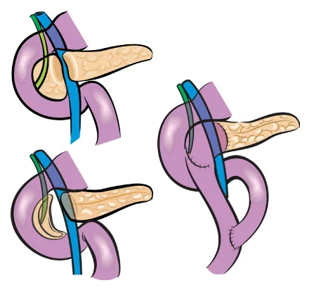

---

<!-- page:7 -->

Figura 17: Ressecção da cabeça do pâncreas com pâncreas com reconstrução com pancreatojejunal no corpo, biliodigestivo ou gastrojejunoestomia ou duodenojejunoestomia.

Condições especiais

- Doença disseminada SEM dilatação ductal: Neurólise / Bloqueio de plexo celíaco (eficácia de curto prazo) Pancreatectomia total: conduta de exceção

- Suspeita de MALIGNIDADE: Ressecção em caráter oncológico + linfadenectomia

## COMPLICAÇÕES

- Pseudocistos: Aproximadamente 10% dos pacientes apresentam, maioria assintomáticos; Associação com piora da dor, gastroparesia, obstrução biliar, fistulização (para vísceras adjacentes ou vasos sanguíneos); Primeira linha: drenagem endoscópica; Falha: cirurgia (cistojejunostomia ou cistogastrostomia).

Figuras 18 e 19: Pseudocistos

- Ascite pancreática/derrame pleural: Fistulização livre do DPP para cavidade peritoneal ou pleural; Grave; Tratamento: dieta com triglicerídeos de cadeia média, jejum + NPP, octreotide, papilotomia com stent pancreático; Derrame pleural → decorticação!! Figura 20: Ascite pancreática.

- Trombose da Veia Esplênica: Hipertensão portal segmentar. Varizes de fundo gástrico.

Figura 21: Trombose da veia esplênica ocasionando hipertensão portal segmentar. Processo inflamatório crônico do pâncreas pode levar a obstruções e tromboses segmentares da veia esplênica levando à hipertensão da veia esplênica e dos vasos gástricos breves com drenagem a anômala venosa (que vai para ázigos ou gástrica direta, levando a varizes de fundo gástrico sem varizes esofágicas).

- Pseudoaneurisma de artéria esplênica/gastroduodenal: Fistulização vascular para pseudocisto; Pode gerar sangramento contido, livre para cavidade ou para o tubo digestivo Geralmente quadros graves manejados por radiologia intervencionista através de embolização;

(hemossucus pancreticus); Figura 22: Hemossucus pancreaticus.

- Estenose da Via Biliar distal Icterícia obstrutiva associada a processo inflamatório envolvendo colédoco distal

- Surgimento de Câncer Perda ponderal, piora do padrão de dor deve levantar suspeita! Diagnóstico diferencial pode ser difícil Estudo inicial através de ecoendoscopia e biópsia; Caso inconclusivo, recomenda-se cirurgia com radicalidade oncológica.

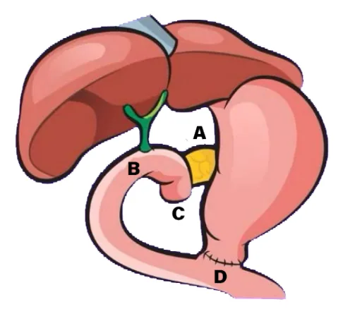

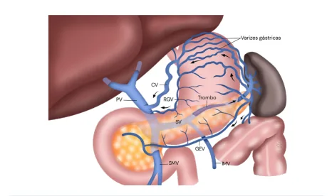

---

<!-- page:8 -->

BONUS - GROOVE PANCREATITIS Figura 8: TC de abdome com contraste EV com pouco

- Tipo de pancreatite crônica que envolve a parênquima e focos de calcificação de parênquima com cálculo porção cefálica do pâncreas e o processo calcificado levando a dilatação do ducto de Wirsung (achados inflamatório acomete o duodeno por contiguidade protótipos da pancreatite crônica).

(sulco pancreatoduodenal); (sulco pancreatoduodenal); S

- Mais frequentemente: homens, 5ª-6ª década de vida, P j história de alcoolismo e tabagismo;

- Variedade de sintomas: dor epigástrica, perda ponderal, vômitos, icterícia (se envolvimento da via biliar);

- Frequentemente pode se confundir (ou mascarar) o câncer de pâncreas (principal A diagnóstico diferencial); C o

- Pacientes refratários ao tratamento conservador ou sem possibilidade de afastar possibilidades de câncer: DPT/GDP. B h

## REFERÊNCIAS

Figura 5: Microscopia de um pâncreas normal. A Retirado do Site Didático de Anatomia Patológica da FCM-UNICAMP, em Dezembro de 2022. URL: https://anatpat.unicamp.br/lamfig14.html Figura 6: Atrofia progressiva do parênquima pancreático. Seta:

foco de calcificação. Retirado do Site Didático de Anatomia Patológica da FCM-UNICAMP, em K Dezembro de 2022. URL: https://anatpat.unicamp.br/lamfig14.html ( Figura 7: Pancreatografia por RNM com cálculo calcificado dentro do pâncreas (seta amarela) com dilatação do ducto O de Wirsung (em azul) com dificuldade de secreção, ativação enzimática dentro do pâncreas com dor crônica pior às alimentações.

Singh VK, Yadav D, Garg PK. Diagnosis and Management of Chronic Pancreatitis: A Review. JAMA. 2019;322(24):2422–2434. doi:10.1001/ jama.2019.19411 Singh VK, Yadav D, Garg PK. Diagnosis and Management of Chronic Pancreatitis: A Review. JAMA. 2019;322(24):2422–2434. doi:10.1001/ jama.2019.19411 Figura 9: RNM corte axial ponderado em T2 (canal medular, vesícula e estômago em branco) wirsung tortuoso, substituição do parênquima pancreático por fibrose e dilatação do ducto principal.

Abdelmonem H, Chronic pancreatitis with pancreatic duct stones. Case study, Radiopaedia.org (Accessed on 19 Dec 2022) https://doi.

org/10.53347/rID-73793 Figura 10: Asterisco: calcificação ductal (área hiperecogênica); Beyer, Georg et al. Chronic pancreatitis. The Lancet, 2020. DOI:https:// https://doi.org/10.1016/S0140-6736(20)31318-0’ Figuras 13 e 14: Setas brancas (wirsung aberto na transversal)

Seta preta (anastomose pancreato-jejunal). Acervo pessoal do autor. Figuras 18 e 19: Pseudocistos Gaillard F, Walizai T, Bell D, et al. Pancreatic pseudocyst. Reference article, Radiopaedia.org (Accessed on 02 Jun 2025)

Figura 20: Ascite pancreática. Keshavamurthy J, Pancreatic ascites. Case study, Radiopaedia.org (Accessed on 02 Jun 2025)

Figura 22: Hemossucus pancreaticus. Okamoto H, Fujii H. Haemosuccus Pancreaticus in Chronic Pancreatitis — Diagnosis and Treatment [Internet]. Acute and Chronic Pancreatitis. InTech;

2015. Available from: http://dx.doi.org/10.5772/58952
