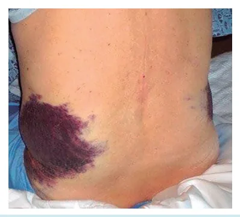
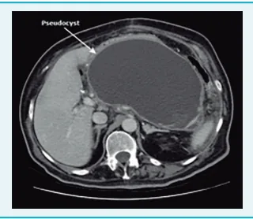

# Pancreatite Aguda

<!-- page:1 -->

## ABDOME AGUDO INFLAMATÓRIO PANCREATITE AGUDA PANCREATITE AGU

Principais causas

- 1o = Litíase;

- 2o = Alcoolismo.

## DIAGNÓSTICO

1. Quadro clínico

- Dor abdominal em faixa;

- Irradiando para o dorso;

- Prece maometana;

- Náuseas e vômitos.

2. Exames laboratoriais

- Amilase Pico precoce, meia vida menor; Menos específico (03x o valor).

- Lipase Pico tardio, meia vida maior; Mais específico.

3. Exame de imagem

- Não é necessário no início;

## INTRODUÇÃO

- Possui incidência anual de 4 a 35 casos/100.000 na população geral: 20% dos casos são graves.

- Nos casos leves, a mortalidade é baixa (1,5%) / Casos graves, alta (17%).

## FISIOPATOLOGIA

- Ativação de enzimas pancreáticas intratecidual microcirculação → Liberação de mediadores inflamatórios → Inflamação sistêmica.

→ Autolesão pancreática → Causa lesão na

## CAUSAS DE PANCREATITE AGUDA

- Litíase Biliar – principal causa;

- Álcool – segunda principal causa;

- Outras: Mecânicas: lama biliar, tumor, divertículos, áscaris; Tóxicas: etanol, metanol, organofosforado, veneno de escorpião; Metabólicas: hipertrigliceridemia, hipercalcemia; Medicamentosa: metronidazol, azatioprina, sulfa, tiazídicos; Infecciosa: vírus, bacteriana, fúngica, parasitas; Trauma; Pâncreas divisum; Pós-CPRE; Vasculares; Genéticas. UDA

- TC - estimar gravidade / dx diferencial;

- USG para identificar etiologia.

2 de 3 → confirma! CLASSIFICAÇÃO

- Leve Sem disfunção orgânica; Sem complicação local; A mais comum.

- Moderada Disfunção orgânica < 48 horas; Complicação local.

- Grave Disfunção orgânica persistente.

## TRATAMENTO

- Hidratação + Analgesia + Jejum;

- Antibióticos - Não.

## 1. QUADRO CLÍNICO TÍPICO

- Dor abdominal em faixa;

- Irradiando para dorso;

- Prece maometana;

- Náuseas e vômitos.

## 2. EXAMES LABORATORIAIS

- Amilase: Pico precoce, meia-vida menor; É menos específico – precisamos de uma amilase

3x o LSN para suspeitarmos de pancreatite aguda.

- Lipase: Pico tardio, meia-vida maior; É mais específico.

## 3. EXAMES DE IMAGEM

- Não é necessário no início;

- Pode-se fazer TC para estimar gravidade/ diagnóstico diferencial;

- USG para identificar etiologia.

Se o paciente possuir 2 critérios positivos dos 3, já confirmo pancreatite aguda!!!

## DETALHES

Pancreatite aguda grave (necro-hemorrágica retroperitoneal):

- Sinal de Fox: equimose na bolsa escrotal;

- Sinal de Cullen;

- Sinal de Grey-Turner.

---

<!-- page:2 -->

| G – Glicose; | A - Age; | L - LDH;

- Figura 1: Sinal de Cullen (equimose periumbilical).

- B

- - - - A

- B

- Figura 2: Sinal de Grey-Turner (equimose em flancos).

## CLASSIFICAÇÃO

- Leve: Sem disfunção orgânica; Sem complicação local; A mais comum.

- Moderada: Disfunção orgânica < 48h; Complicação local.

- Grave: Disfunção orgânica persistente.

## ESCORES DE PROGNÓSTICO

## RANSON

- Pouco específico, pouco usado, não muda conduta.

- Na admissão: L - Leucócitos; E – Enzima – TGO; F - Fluídos; E – Excesso de base; C - Cálcio; H - Hematócrito; O – Oxigênio (PaO2); U – Ureia.

Hidratação + analg Pancreatite Aguda Monitorização Estra Figura 3. - Após 48 h:

- Se o paciente tiver > 3 pontos no Ranson ele tem um pior prognóstico.

## BISAP

- BUN < 25 (ureia);

- Rebaixamento do nível de consciência;

- SIRS;

- Idade > 60;

- Derrame pleural.

## APACHE – II

- Avalia 12 itens, idade, comorbidades;

- > 8 = grave.

## BALTHAZAR

- Escore tomográfico, feito para avaliar complicações da pancreatite aguda;

- Tomografia é feita depois de 48h se o paciente evolui com pancreatite aguda grave;

- Quanto mais necrose e inflamação, mais grave e mais alta a morbimortalidade.

OBS: lembrar que o contraste não chega na necrose.

## TRATAMENTO INICIAL

- Hidratação: Feita com ringer lactato; Hidratação adequada, avaliando sempre diurese, hematócrito e função renal.

- Analgesia: Analgésicos potentes + sintomáticos.

- Jejum;

- Devemos ainda: Monitorar; Classificar; Descobrir a etiologia.

gesia + jejum Leve: tratar causa base e alta atificação Moderada e Grave: Semi/ UTI TC em 48 horas *07 dias* (avaliar complicações )

---

<!-- page:3 -->

Tabela 1: Necrose encapsulada (WON). Coleção madura Heterogênea, com encapsulada densidades líquida Necrose com necrose e sólidas com encapsulada pancreática e/ou parede definida.

(WON) peripancreática. Completamente Ocorre após 4 encapsulada. Intra o semanas. extra pancreática Tabela 2: Pseudocisto pancreático.

Coleção encapsulada Bem definido, redon de líquido ou oval. Densidad Pseudocisto com parede homogênea de líqui pancreático inflamatória bem Completamente definida, sem encapsulado.

necrose. Ocorre após 4 semanas

## TRATAMENTO CONFORME

GRAVIDADE Pancreatite aguda leve:

- Retorno da dieta precoce;

- Tratar causa base → Causa biliar = operar vesícula na mesma internação.

Pancreatite aguda grave ou moderada:

- UTI, suporte intensivo, nutrição, profilaxias e observar evolução;

- Monitorizar complicações;

- Considerar dieta enteral em casos graves;

- Antibioticoterapia apenas em necrose infectada - Meropenem.

## PRINCIPAIS COMPLICAÇÕES

- Pancreatite aguda intersticial edematosa;

- Coleção peripancreática aguda com líquido

## homogêneo difuso

| Tratamento = Observação e suporte.

- Coleção necrótica aguda com líquido

| Tratamento = Observação e suporte.

- Walled–off necrosis (coleção heterogênea bem delimitada), após 04 semanas: Observação ou drenagem percutânea.

- Verificar Tabela 1 .

- Pseudocisto: Coleção encapsulada homogênea; Parede inflamatória bem definida; Ausência de necrose; 4 semanas após quadro inicial; m as ou a ndo de ido. Drenagem se sintomas; Derivação definitiva com TGI é melhor; Pode puncionar por rádio-intervenção.

e

- Verificar Tabela 2 .

## NECROSE PANCREÁTICA = STEP-UP-APPROACH

- Operar pancreatite aguda na fase aguda = mortalidade de 97%;

- Tratamento por etapas é o melhor:

1. Suporte clínico intensivo

2. Drenagem de coleções por rádio intervenção

3. + Drenos, endoscopia

4. VLP retroperitoneal

- Última → Necrosectomia aberta (melhor após

04 semanas)

- Detalhe = Coleção infectada → melhor RI

## QUANDO OPERAR A VESÍCULA?

## SEMPRE!! →

- Casos leves → Operar na mesma internação;

- Casos moderados/graves → Após resolução total

(6 semanas);

- Em casos de cálculo impactados no colédoco → Se possível colecistectomia tardia; Primeiro deve-se tratar a pancreatite; Após melhora, CPRE, tira-se o cálculo e opera-se a vesícula.

Muito raro → CPRE!

- Só não posso esperar se o paciente apresentar colangite = (CPRE na urgência);

- Se não operar a vesícula → A pancreatite vai voltar e ele vai morrer.

---

<!-- page:4 -->

## REFERÊNCIAS

Tabela 1 - Imagem: Necrose encapsulada (WON). Elgendy A, Bell D, Di Muzio B, et al. Walled-off pancreatic necrosis.

Reference article, Radiopaedia.org (Accessed on 27 Jul 2025). Figura 1: Sinal de Cullen (equimose periumbilical).

Fonte: https://pt.wikipedia.org/wiki/Sinal_de_Cullen. Tabela 2 - Imagem: Pseudocisto pancreático. Figura 2: Sinal de Grey-Turner (equimose em flancos). Gaillard F, Walizai T, Bell D, et al. Pancreatic pseudocyst. Reference article, Radiopaedia.org (Accessed on 27 Jul 2025).

Fonte: https://medizzy.com/feed/29777240
