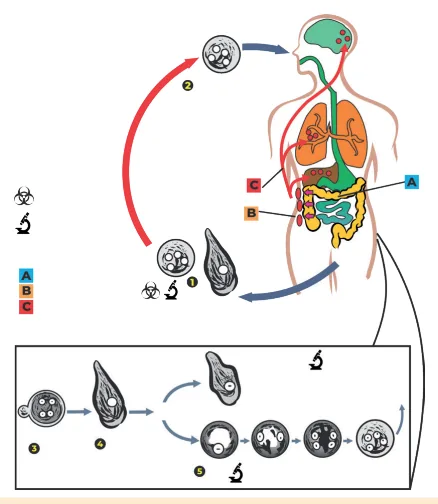
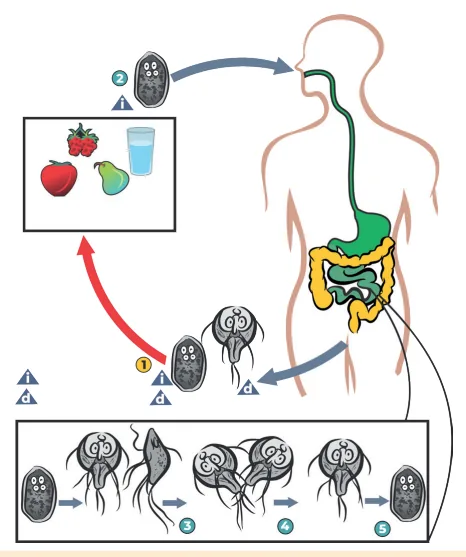
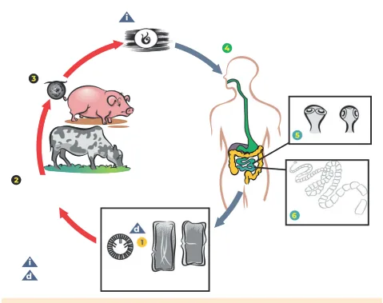
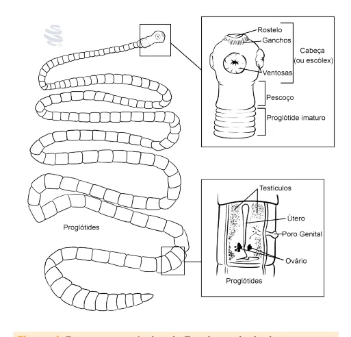
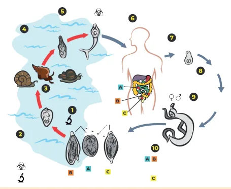
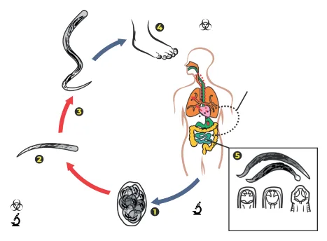
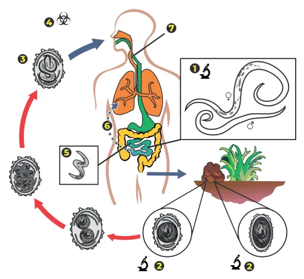
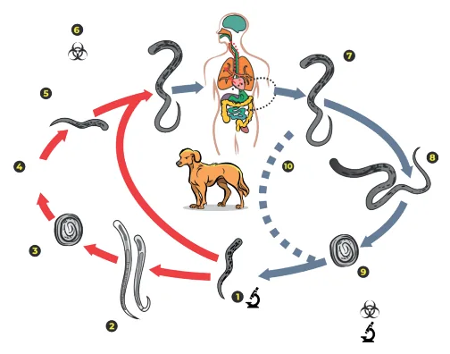
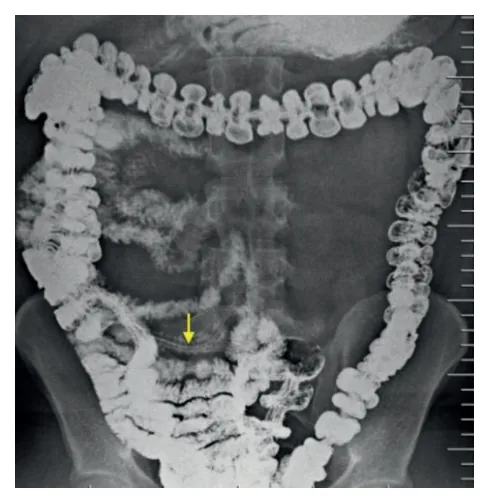
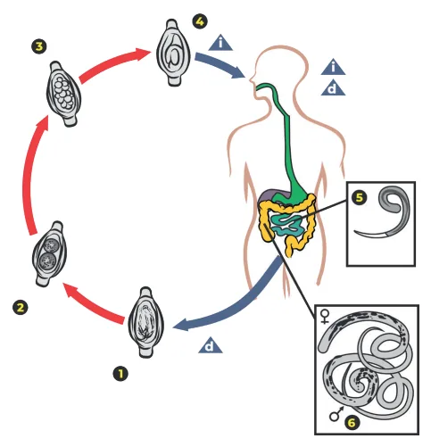

# Parasitoses Intestinais

<!-- page:1 -->

## Agentes

**Protozoários:**

- *Entamoeba histolytica/dispar*
- *Giardia lamblia*

**Platelmintos:**

- *Taenia solium*, *Taenia saginata*
- *Schistosoma mansoni*

**Nematelmintos:**

- *Ancylostoma duodenale* / *Necator americanus*
- *Strongyloides stercoralis*
- *Ascaris lumbricoides*
- *Enterobius vermicularis*
- *Trichuris trichiura*

## Modo de Transmissão

**Fecal-oral:**

- *Entamoeba histolytica/dispar*
- *Giardia lamblia*
- *Ascaris lumbricoides*
- *Schistosoma mansoni*
- *Enterobius vermicularis*
- *Trichuris trichiura*

**Penetração na pele:**

- *Ancylostoma duodenale* / *Necator americanus*
- *Strongyloides stercoralis*

**Consumo de carne** (larva/cisticerco):

- *Taenia solium*, *Taenia saginata*

## Quadro Clínico — Visão Geral

- Maioria assintomática.
- **Síndrome de Löeffler**: *Necator americanus*, *Ancylostoma duodenale*, *Strongyloides stercoralis*, *Ascaris lumbricoides* (*Toxocara canis*).
- **Amebíase**: disenteria, ameboma / abscesso hepático.
- **Giardíase**: síndrome disabsortiva.
- **Teníase**: neurocisticercose.
- **Esquistossomose**: febre aguda (Katayama) 3 a 7 semanas após a infecção e forma crônica 6 meses após (hepatoesplênica).
- **Ancilostomíase**: anemia por adesão à mucosa intestinal.
- **Estrongiloidíase**: hiperinfecção (disseminação) em imunossuprimidos.
- **Ascaridíase**: obstrução intestinal.
- **Enterobíase**: prurido anal noturno.
- **Tricuríase**: disenteria/colite → prolapso retal.

## Diagnóstico — Visão Geral

- **Fezes**: avaliação microscópica — quantitativa (**Kato-Katz** para ovos de *Schistosoma*), qualitativa (**Lutz**, **Hoffman/Pons/Janner**, **MIFC/Coprotest + Faust** para cistos de protozoários, **Rugai** para larvas de helmintos).
- Avaliação macroscópica: tênia (vermes adultos ou proglotes).

## Tratamento — Visão Geral

**Albendazol** (uma vez ao dia):

- *Ancylostoma duodenale*
- *Ascaris lumbricoides*
- *Enterobius vermicularis* (alternativa: pamoato de pirvínio)

**Antiparasitários específicos (três vezes ao dia):**

- *Trichuris trichiura*
- *Taenia solium*, *Taenia saginata* (praziquantel)
- *Strongyloides stercoralis* (ivermectina)

**Cinco vezes ao dia:**

- *Giardia lamblia* (secnidazol, metronidazol)

**Outros antiparasitários:**

- *Entamoeba histolytica/dispar* → secnidazol ou metronidazol.
- *Schistosoma mansoni* → praziquantel.
- **Nitazoxanida**: amplo espectro (sem ação apenas contra *Schistosoma mansoni*).

---

<!-- page:2 -->

## Introdução

### Epidemiologia

- Presentes em todo o mundo.
- Estima-se **1,2 bilhão** de pessoas infectadas por *Ascaris lumbricoides*.
- Estima-se **800 milhões** de pessoas infectadas por *Trichuris trichiura*.
- Mais de **700 milhões** de pessoas infectadas por *Ancylostoma* e *Necator*.

> ⚠️ Amostras múltiplas aumentam a sensibilidade do exame, devido à eliminação não homogênea dos parasitas — padrão de **3 amostras em dias alternados**.

### Classificação dos Agentes

- **Helmintos**: seres pluricelulares, macroscópicos. Ciclo: ovo → larva → verme adulto.
  - **Platelmintos** (mais achatados): *Schistosoma mansoni*; *Taenia solium*; *Taenia saginata*.
  - **Nematelmintos**: *Ascaris lumbricoides*; *Ancylostoma duodenale*/*Necator americanus*; *Enterobius vermicularis*; *Strongyloides stercoralis*; *Trichuris trichiura*.
- **Protozoários**: seres unicelulares, fazem divisão binária. Ciclo de vida: cisto → trofozoíto → cisto. *Entamoeba histolytica/dispar*; *Giardia lamblia*.

### Diagnóstico: Exame Parasitológico de Fezes (EPF/PPF)

- **Avaliação macroscópica**: consistência e odor, presença de elementos anormais (muco ou sangue) e de vermes adultos ou partes deles (proglotes da *Taenia*).
- **Avaliação microscópica**: visualização de trofozoítos, cistos e oocistos dos protozoários, bem como ovos e larvas dos helmintos.
- **Quantitativo** — contagem de ovos para avaliar carga parasitária:
  - **Kato-Katz**: clarificação pela glicerina e coloração pelo verde-malaquita ou azul de toluidina, de ovos de *Schistosoma mansoni* e *Ascaris lumbricoides*, para contagem na microscopia.
- **Qualitativo** — demonstração da presença dos parasitas (número de parasitas em geral é pequeno, assim realizam-se processos de enriquecimento/concentração e coloração):
  - **Sedimentação espontânea (Lutz)**: ovos de helmintos (ovos inférteis de *A. lumbricoides* e *S. mansoni*); cistos de protozoários e oocistos maiores de *Isospora belli*.
  - **Centrifugação (MIFC/Coprotest)**: ovos e larvas de helmintos; cistos e oocistos de protozoários.
  - **Centrífugo-flutuação (Faust)**: ovos leves de helmintos; cistos e oocistos de protozoários.
  - **Rugai ou Baermann**: método de escolha para *Strongyloides*.
  - **Hoffman, Pons e Janner**: ovos pesados e larvas de helmintos (migração ativa das larvas).

## Amebíase

**Agentes:**

- *Entamoeba histolytica* — virulenta e invasiva.
- *Entamoeba dispar* (baixa patogenicidade), *Entamoeba coli*, *Entamoeba hartmanni*, *Entamoeba moshkovskii*, *Endolimax nana* (não patogênicas).

- Mais de **10%** da população mundial infectada por alguma forma de ameba.
- O reservatório é o homem. Localiza-se no cólon.

**Ciclo de vida:**

1. Cistos e trofozoítos liberados nas fezes.
2. Ingesta de cistos por água, alimentos e mãos contaminadas.
3. Trofozoítos são liberados no intestino delgado (ID) e migram para o intestino grosso (IG).
4. Trofozoítos podem: permanecer no lúmen → encistamento → cistos nas fezes; invadir a mucosa intestinal → doença intestinal; invadir vasos sanguíneos → doença extraintestinal.

*Figura 1: Ciclo de vida da Entamoeba*

**Quadro clínico:**

- Assintomática, com formas clínicas variáveis.
- **Amebíase intestinal**:
  - Disenteria: febre, distensão abdominal, flatulência, cólica, disenteria com mais de 10 evacuações mucossanguinolentas por dia, tenesmo.
  - Ameboma: formação de granuloma na mucosa do ceco, cólon ascendente ou anorretal, com edema e estreitamento do lúmen. Alterna momentos de diarreia e constipação intestinal.

---

<!-- page:3 -->

- **Amebíase extraintestinal**: abscesso hepático, em geral único e no lobo direito; pode ocorrer abscesso em pulmão, pericárdio e sistema nervoso central (SNC).

**Diagnóstico:**

- Identificação de cistos ou trofozoítos no exame direto das fezes, aspirados, raspados ou biópsias.
- Ultrassonografia (USG) e tomografia (TC) são úteis para diagnóstico de abscesso amebiano.
- Anticorpos séricos podem auxiliar.

**Tratamento:**

- Secnidazol, metronidazol, tinidazol ou nitazoxanida.
- Nas formas graves — amebíase intestinal intensa e extraintestinal — primeira escolha é o **metronidazol**.

## Giardíase

**Agentes:**

- *Giardia lamblia* e *Giardia duodenalis*.

- Dissemina por água não potável; fecal-oral (água contaminada). Surtos são comuns (creches). Endêmica em muitos países, com prevalência em crianças ao redor de **30%**.
- O homem é seu principal reservatório. Animais de estimação são fontes potenciais.
- Atinge duodeno e jejuno.

**Ciclo de vida:**

1. Cistos e trofozoítos liberados nas fezes.
2. Ingesta de cistos em água, alimentos, mãos e fômites.
3. Libera trofozoítos no ID.
4. Retornam ao estágio de cistos no IG.

*Figura 2: Ciclo de vida da Giardia*

**Quadro clínico:**

- Maioria assintomática.
- Faz atapetamento da mucosa duodenal — atrofia de vilos, má absorção de açúcares e gorduras. Assemelha-se à doença celíaca (esteatorreia ou constipação).
- Diarreia aguda ou crônica, leve ou grave.

**Diagnóstico:**

- Identificação de cistos ou trofozoítos no exame direto das fezes, ou identificação de trofozoítos em fluidos ou biópsia duodenal.
- É intermitente nas fezes — coletar 3 amostras de fezes em 1 semana.

**Tratamento:**

- Principal indicação se sintomática, especialmente se imunodeprimido.
- Secnidazol, metronidazol, tinidazol, nitazoxanida e furazolidona.
- Albendazol por 5 dias.
- Exames de controle de cura: PPF com 7, 14 e 21 dias após tratamento.

## Teníase

**Agentes:**

- *Taenia solium* — forma adulta; hospedeiro intermediário = porco.
- *Taenia saginata* — forma adulta; hospedeiro intermediário = boi.

- O homem é o hospedeiro definitivo.
- Relacionada à falta de saneamento básico e ao consumo de carne mal cozida (larva).
- Localiza-se no ID.
- A larva é conhecida como cisticerco; quando ingerida pelo homem, causa a **teníase**.
- Quando ocorre a ingestão do ovo, há a **cisticercose** — o homem deixa de ser hospedeiro definitivo e se torna hospedeiro intermediário.

**Ciclo de vida:**

1. Ovos ou proglotes grávidas liberados nas fezes e no ambiente.
2. Suínos/bovinos alimentam-se e adquirem os ovos.
3. Ovos invadem a parede intestinal e migram para o músculo estriado.
4. Humano consome carne suína/bovina crua ou mal cozida.
5. Cisticerco desenvolve-se em tênia adulta e fica na parede do ID.

*Figura 3: Ciclo de vida da teníase (Taenia solium - porco / Taenia saginata - boi)*

---

<!-- page:4 -->

*Figura 4: Estrutura anatômica da Taenia — a principal característica é o escólex e as proglotes.*

**Quadro clínico:**

- Sintomas gastrointestinais e sistêmicos inespecíficos.
- **Cisticercose**: depende do órgão envolvido, sendo mais grave em SNC — convulsões, hidrocefalia, hipertensão intracraniana, acidente vascular encefálico (AVE).

**Diagnóstico:**

- Em geral clínico, com eliminação de proglotes nas fezes, visíveis a olho nu.
- **Neurocisticercose**: necessária TC e/ou ressonância nuclear magnética (RNM) de crânio.
- Líquido cefalorraquidiano (LCR) com pleocitose e eosinofilorraquia.
- Positividade da reação clássica de Weinberg (reação de fixação do complemento) ou métodos ELISA e de imunofluorescência no LCR e no soro.

**Tratamento:**

- Escolha: **praziquantel 5 a 10 mg/kg, dose única**.
- Albendazol 400 mg/dia por 3 dias.
- Alternativa: niclosamida.
- **Cisticercose**: praziquantel por 21 dias + dexametasona, para reduzir a resposta inflamatória consequente à morte dos cisticercos.

## Esquistossomose

**Agente:**

- *Schistosoma mansoni*.

- Presente em diversos países, sendo endêmica no Brasil.
- O homem é o reservatório principal, mas pode acometer marsupiais, roedores e primatas.
- O hospedeiro intermediário principal no Brasil é o caramujo do gênero *Biomphalaria*: *B. glabrata*, *B. tenagophila* e *B. straminea*.
- Parasitam vasos sanguíneos, especialmente mesentéricos.

**Ciclo de vida:**

1. Ovos com miracídios eliminados nas fezes na água; miracídios penetram no caramujo, que após 1 mês libera centenas de cercárias.
2. Cercárias penetram a pele humana.
3. Migram para pulmões, coração e fígado, onde se desenvolvem, saindo maduros pelo sistema porta.
4. Vermes adultos migram para veias mesentéricas inferiores (que drenam o IG), onde depositam ovos nas pequenas vênulas, que são movidos progressivamente em direção ao lúmen do intestino e eliminados nas fezes.

*Figura 5: Ciclo de vida do Schistosoma mansoni*

**Quadro clínico:**

- Assintomática.
- Dermatite urticariforme, erupção papular, prurido, até 5 dias após exposição.
- **Forma aguda (Febre de Katayama)**: após 3-6 semanas da infecção — febre alta, calafrios, sudorese noturna, anorexia, dor abdominal, diarreia, vômitos; hepatomegalia, polimicrolinfadenopatia e dermatite; duração de até 8 semanas.
- **Forma crônica**: até 6 meses após a infecção:
  - Intestinal: diarreia de repetição, com dor ou desconforto abdominal.
  - Hepatoesplênica: hepatoesplenomegalia, hipertensão portal com formação de varizes esofagianas.
  - Pulmonar: endarterite granulomatosa, que pode levar a hipertensão pulmonar e ao cor pulmonale.
  - SNC: grande alvo é a medula espinhal, causando mielite transversa.
  - Glomerulonefrite: imunocomplexos nos vasos renais.

**Diagnóstico:**

- Exame parasitológico de fezes, método de Kato-Katz.
- Biópsia de mucosa retal.
- Sorologia — fase aguda.

**Tratamento:**

- Escolha: praziquantel.
- Outra opção: oxamniquina.
- Recomenda-se controle de cura pelo parasitológico de fezes, com contagem de ovos mensalmente nos primeiros seis meses.

---

<!-- page:5 -->

## Enterobacteriose Septicêmica Prolongada

- Coinfecção *Salmonella* spp. + *Schistosoma mansoni*.
- *Salmonella* enteroinvasiva entra na circulação sistêmica e se fixa ao tegumento do *Schistosoma* adulto presente na vasculatura mesentérica, por meio de fímbrias (FimH). Essa interação faz com que a bactéria consiga escapar da terapia antibiótica sistêmica.
- Oviposição no sistema porta pré-sinusoidal leva à intensa resposta imune, com translocação bacteriana sucessiva, sem toxemia → septicemia prolongada.
- **Mecanismo fisiopatológico**: redução de IFN-γ por macrófagos pela cronicidade da esquistossomose; redução da fagocitose macrofágica e redução da atividade bactericida de polimorfonucleares.
- **Quadro clínico**: febre; perda de peso; fadiga; esplenomegalia; bacteremia crônica não toxêmica; esquistossomose hepatoesplênica.
- **Tratamento**: praziquantel + antibiótico.

## Ancilostomíase

**Agentes** (nematoides da família Ancylostomidae):

- *Ancylostoma duodenale*
- *Necator americanus*

- Predomina em áreas rurais, sem saneamento básico, e em populações com o hábito de andar descalças.
- O reservatório é o homem. Localiza-se no ID (duodeno e jejuno).

**Ciclo de vida:**

1. Ovos liberados nas fezes, eclodem e liberam larvas.
2. Larva torna-se infectante e penetra a pele humana.
3. Ciclo pulmonar (**Ciclo de Loss**) — pneumonite/hemorragia; dor epigástrica, diarreia, anorexia, náuseas e vômitos.
4. Larvas seguem para o ID e aderem à mucosa intestinal, causando enterite: gera anemia ferropriva em crianças.

*Figura 6: Ciclo de vida do Ancylostoma*

**Quadro pulmonar — Síndrome de Löeffler:**

- Broncoespasmo, hemoptise, pneumonite; eosinofilia importante (pneumonite eosinofílica).
- Agentes da síndrome de Löeffler: *Necator americanus*, *Ascaris lumbricoides*, *Strongyloides stercoralis*, *Ancylostoma duodenale*, *Toxocara canis*.

**Diagnóstico:**

- PPF — ovos de baixo peso.

**Tratamento:**

- Albendazol 400 mg dose única.
- Mebendazol 100 mg 2x/dia por 3 dias.
- Necessidade de controle de cura: PPF sucessivos após tratamento — 7, 14 e 21 dias.

## Estrongiloidíase

**Agente:**

- *Strongyloides stercoralis*.

- Endêmica em regiões tropicais e subtropicais.
- Hospedeiros naturais incluem homens, primatas e cães.
- Localiza-se no ID (duodeno e jejuno).

**Ciclo de vida:**

1. Larva rabditiforme excretada nas fezes ou no solo. Segue dois caminhos: torna-se larva filarioide, ou larva de vida livre → larva filarioide.
2. Larva filarioide penetra a pele humana.
3. Ciclo pulmonar.
4. Deglutição → ID → vermes adultos.
5. Fêmea produz ovos que eclodem em larvas rabditoides, excretadas nas fezes.
6. Larvas rabditoides tornam-se filarioides no intestino ou na região anal (autoinfecção anal/perianal, penetrando novamente a pele), penetrando a parede do intestino grosso e disseminando-se para outros órgãos, ou penetrando na mucosa.

---

<!-- page:6 -->

- Ovos eclodem → larvas.
- Larvas penetram a parede do ID e migram para circulação porta/sistêmica.
- Alcançam pulmão/árvore brônquica e são deglutidas, retornando ao ID.

*Figura 7: Ciclo de vida do Strongyloides stercoralis*

**Outras formas de transmissão:**

- Fecal-oral.
- Alimentos e água contaminados.
- Fezes.
- Atividade sexual (relação anal).
- Autoinfestação — doença crônica; hiperinfecção em imunossuprimidos (uso de imunossupressores, infecção por HTLV).

**Quadro clínico:**

- Assintomático.
- Dermatite no local da penetração da larva.
- Diarreia, dor epigástrica, náuseas, perda de peso.
- Envolvimento pulmonar.
- **Hiperinfecção**: disseminação para vários órgãos, bacteremia por ruptura da mucosa intestinal; sepse por gram-negativos entéricos.

**Diagnóstico:**

- Encontro das larvas em fezes ou fluido duodenal.

**Tratamento:**

- **Ivermectina 200 mcg/kg dose única** (droga de escolha em algumas literaturas).
- Albendazol e tiabendazol.
- Imunodeprimidos: ivermectina + albendazol por tempo prolongado.

## Ascaridíase

**Agente:**

- *Ascaris lumbricoides*.

- O reservatório é o homem.
- Adquirido pela ingestão de ovos infectantes de solo, água ou alimentos contaminados.
- Prevalente em locais com condições de saneamento precárias.
- É a parasitose com maior prevalência no Brasil e no mundo.

**Ciclo de vida:**

1. Vermes adultos no ID; ovos eliminados nas fezes.
2. Ingestão dos ovos infectantes.
3. No ID: fêmeas fecundadas podem produzir cerca de **200 mil ovos por dia**, que podem permanecer viáveis e infectantes durante anos. Duração média de vida dos parasitas adultos é de 12 meses.

*Figura 8: Ciclo de vida do Ascaris lumbricoides*

*Figura 9: Ovos e larvas do Ascaris lumbricoides — (a) ovo infértil / (b) ovo fértil / (c) ovo embrionado com larva em seu interior / (d) verme adulto.*

**Quadro clínico:**

- Assintomático.
- Dor abdominal, diarreia, náuseas e anorexia.
- Na infestação pode ocorrer obstrução intestinal, de via biliar e de ducto pancreático.
- Em virtude do ciclo pulmonar da larva, podem ocorrer manifestações pulmonares.

**Diagnóstico:**

- Ovos no PPF.
- Radiografia contrastada para avaliar "bolo de áscaris".

---

<!-- page:7 -->

- Método de Graham — fita gomada.
- Método de Hall — swab anal.

*Figura 10: Fluoroscopia mostrando área linear translúcida sugestiva da presença de Ascaris.*

**Tratamento:**

- Albendazol 400 mg dose única.
- Mebendazol 100 mg 2x/dia por 3 dias — repete pois não é larvicida.
- Alternativa: levamisol.
- Obstrução intestinal: jejum, passagem de sonda nasogástrica e deixar aberta, óleo mineral, hidratação.

> ⚠️ Piperazina não é mais utilizada.

## Enterobíase

**Agente:**

- *Enterobius vermicularis* (oxiuríase).

- Helmintíase mais comum na infância.
- Afeta vários membros da mesma família.
- Independe de condições socioeconômicas.
- O reservatório é o homem.
- Localiza-se no intestino grosso (ceco e reto), causando prurido anal.

**Ciclo de vida:**

1. Ovos na região perianal.
2. Ovos ingeridos por autoinfecção.
3. Ovos eclodem e liberam larvas no ID.
4. Verme adulto no ceco.
5. Fêmea migra para a região anal.
6. Liberação de ovos na região anal (noturno).

*Ver Figura 11.*

**Quadro clínico:**

- Assintomático.
- Prurido retal noturno: irritabilidade, sono intranquilo, infecção secundária e pontos hemorrágicos perianais.
- Distensão e dor abdominal (cólicas).
- Tenesmo.
- Vulvovaginite.

**Diagnóstico:**

- Clínico.

**Tratamento:**

- Mebendazol por 3 dias.
- Albendazol dose única.

## Tricuríase

**Agente:**

- *Trichuris trichiura*.

- Ocorre em regiões tropicais.
- Infecção por ingestão de ovos embrionados encontrados no solo, alimentos e mãos contaminados.
- Localiza-se em ID, cólon e ceco.

**Ciclo de vida:**

1. Ovos não embrionados nas fezes.
2. No solo, desenvolvem-se.
3. Ingestão dos ovos (mão ou alimento contaminado).
4. Ovos eclodem no ID e liberam larvas.
5. Adultos no ceco e cólon ascendente.

*Figura 11: Ciclo de vida do Enterobius vermicularis · Figura 12: Ciclo de vida do Trichuris trichiura*

---

<!-- page:8 -->

**Quadro clínico:**

- Duas síndromes clínicas principais:
  - **Disenteria**: verme adulto adere e lesa a mucosa, mudando de posição diversas vezes ao dia, gerando perda de sangue — diarreia grave com sangue e muco, anemia, retardo de crescimento e desenvolvimento.
  - **Colite**: manifestação crônica, doença inflamatória intestinal-like, causa desnutrição e baixa estatura.
- Prolapso retal.

**Diagnóstico:**

- Ovos no PPF.

**Tratamento:**

- Albendazol 400 mg dose única; se moderado/grave: 3 dias.
- Alternativa: mebendazol.

## Referências

- Figura 1: Ciclo de vida da Entamoeba — adaptado de "the Centers for Disease Control and Prevention, Global Health, Division of Parasitic Diseases and Malaria."
- Figura 2: Ciclo de vida da Giardia — adaptado de "the Centers for Disease Control and Prevention, Global Health, Division of Parasitic Diseases and Malaria."
- Figura 3: Ciclo de vida da teníase (Taenia solium - porco / Taenia saginata - boi) — adaptado de "the Centers for Disease Control and Prevention, Global Health, Division of Parasitic Diseases and Malaria."
- Figura 5: Ciclo de vida do Schistosoma mansoni — adaptado de "the Centers for Disease Control and Prevention, Global Health, Division of Parasitic Diseases and Malaria."
- Figura 6: Ciclo de vida do Ancylostoma — adaptado de "the Centers for Disease Control and Prevention, Global Health, Division of Parasitic Diseases and Malaria."
- Figura 7: Ciclo de vida do Strongyloides stercoralis — adaptado de "the Centers for Disease Control and Prevention, Global Health, Division of Parasitic Diseases and Malaria."
- Figura 8: Ciclo de vida do Ascaris lumbricoides — adaptado de "the Centers for Disease Control and Prevention, Global Health, Division of Parasitic Diseases and Malaria."
- Figura 9: Ovos e larvas do Ascaris lumbricoides (a) Ovo infértil / (b) Ovo fértil / (c) Ovo embrionado - larva em seu interior / (d) Verme adulto. Fonte: fotos a, b e c — arquivo pessoal Dr. Helder Cavalcanti Fortes, Grupo Análises Clínicas Brasil (ACB); foto d — arquivo pessoal Professor Stefan Geiger, UFMG.
- Figura 10: Fluoroscopia mostrando área linear translúcida sugestiva da presença de Ascaris. SHETTY, Aditya. Case courtesy of Aditya Shetty, Radiopaedia.org, rID: 28757. Disponível em: https://radiopaedia.org/cases/28757. Acesso em: 22 abr. 2025.
- Figura 11: Ciclo de vida do Enterobius vermicularis — adaptado de "the Centers for Disease Control and Prevention, Global Health, Division of Parasitic Diseases and Malaria."
- Figura 12: Ciclo de vida do Trichuris trichiura — adaptado de "the Centers for Disease Control and Prevention, Global Health, Division of Parasitic Diseases and Malaria."
