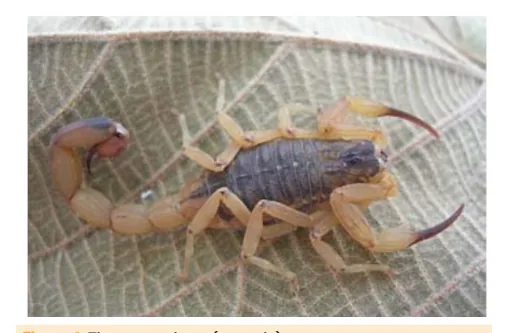

# Peçonhentos, Raiva e Tétano

<!-- page:1 -->

Acidente com Animal Peçonhento (PED) Raiva e Tétano (PED)

## ESCORPIONISMO

- Leve (dor e parestesia local): observar

- Moderado (Dor local intensa + ≥1: náuseas, vômitos, sudorese, sialorreia discreta, agitação e taquicardia)

2 a 3 ampolas

## OFIDISMO

Acidente Acidente Botrópico Ação do Proteolítica: Edema local, bolhas e ne veneno Coagulante; Hemorrágico.

ARANEÍSMO: LOXOCELES Característica:

- Dor em queimação, lesões hemorrágicas focais, mescladas com áreas pálidas de isquemia (placa marmórea) e necrose.

## TIPO DE EXPOSIÇÃO

## CONTATO INDIRETO

- Tocar/ dar de comer;

- Lambedura de pele íntegra;

- Contato em pele íntegra com secreções ou excreções de animal, ainda que raivoso ou de caso humano.

## LEVE

- Mordedura ou arranhadura superficial no tronco ou nos membros, exceto em mãos e pés;

- Lambedura de lesões superficiais.

GRAVE:

- Mordedura ou arranhadura nas mucosas, no segmento cefálico, nas mãos ou nos pés;

múltiplas ou extensas; profunda; causada por mamífero silvestre.

- Lambedura de lesões profundas ou de mucosas;

## ANIMAIS PEÇONHENTOS

- Agravo de notificação compulsória.

- Acidente de maior prevalência no meio urbano;

- A maioria dos casos tem evolução benigna, porém, na população pediátrica, há risco de manifestação de maior gravidade.

- Espécies de importância médica: Tityus serrulatus (amarelo) – acidentes de maior gravidade T. bahiensis e T. stigmurus. - Grave (forma moderada + ≥1: vômitos profusos e incoercíveis, sudorese profusa, sialorreia intensa, choque): 4 a 6 ampolas.

): prostração, convulsão, coma, bradicardia, IC, EAP e Acidente Crotálico Neurotóxica; Miotóxica: rabdomiólise; LRAecrose;

principal complicação e causa de óbito; Coagulante. PROFILAXIA DA RAIVA HUMANA:

- Para todos os casos: lavar com água e sabão.

Cão ou gato NÃO Cão ou gato PASSÍVEL

## PASSÍVEL DE

## DE OBSERVAÇÃO por

OBSERVAÇÃO por 10 10 dias e SEM SINAIS dias ou COM SINAIS sugestivos de raiva sugestivos de raiva NÃO INDICAR NÃO INDICAR PROFILAXIA. PROFILAXIA.

Observar o animal por por 10 dias → se morrer, desaparecer

## VACINA

ou sinais de raiva, indicar

Observar o animal por por 10 dias → se morrer, desaparecer ou VACINA + SORO (SAR apresentar sinais ou IGHAR).

de raiva, indicar VACINA + SORO Figura 1: Tityus serrulatus (amarelo).

---

<!-- page:2 -->

- O veneno age nos canais de sódio

- Exames laboratoriais:

produzindo despolarização e liberação de | Tempo de coagulação (TC): alargado; catecolaminas e acetilcolina; | Hemograma: leucocitose, desvio à

- A dor local é um sintoma constante e outras esquerda, plaquetopenia;

manifestações clínicas podem ocorrer, definindo a | CPK e LDH: elevados; manifestações clínicas podem ocorrer, definindo a gravidade e necessidade de soroterapia.

| O soro pode ser soro antiescorpiônico (SAEEs) ou soro antiaracnídico (SAAr).

- Dentre as apresentações de maior gravidade, devemos nos atentar à ocorrência do choque cardiogênico.

Tabela 1: Classificação e Conduta no Acidente Escorpiônico Classificação Clínica Soro Não é necessária.

Leve Dor e parestesia local. Manter em observação por 6-12h Dor local intensa associada a ≥1 manifestações:

2 a 3 ampolas Moderado náuseas, vômitos, EV sudorese, sialorreia discreta, agitação e taquicardia. Forma moderada + ≥1 : vômitos profusos e incoercíveis, sudorese profusa, sialorreia intensa, 4 a 6 ampolas Grave * prostração, convulsão, EV s coma, bradicardia, insuficiência cardíaca, edema agudo de pulmão e choque.

- ACIDENTES OFÍDICOS

- Principais serpentes associadas a acidentes na infância: Gênero Bothrops (jararaca): aproximadamente 75% dos casos; Gênero Crotalus (cascavel): aproximadamente 10% dos casos; Gênero Lachesis (surucucu): raro; Gênero Micrurus (coral): raro.

- Acidente Botrópico (Jararaca)

- Ações do veneno: Proteolítica: Edema local, bolhas e necrose; Coagulante: coagulopatia de consumo, principalmente fator X e protrombina, semelhante à coagulação intravascular disseminada (CIVD); Hemorrágica: hemorragias alterando a membrana basal e função das plaquetas.

- | CPK e LDH: elevados; Urina 1, eletrólitos, uréia e creatinina evidenciando leucocitúria, hematúria.

Lesão Renal Aguda (LRA), proteinúria,

- Tratamento: soroterapia em todos, diferenciando a dose de acordo com a gravidade clínica. Se TC permanecer alterado por 24 h após soro, é indicada dose adicional de 2 ampolas de antiveneno.

Tabela 2: Classificação e Conduta no Acidente Botrópico Clínica e Leve Moderado Grave tratamento Intensa/ grave;

Local: dor, Critério isolado Ausente/ edema e Evidente suficiente para discreto equimose classificar como grave.

Sistêmico: hemorragia grave, Ausente Ausente Presente choque, anúria Tempo de Normal ou Normal ou Normal ou coagulação alterado alterado alterado Soroterapia intravenosa* 2-4 4-8 12 (ampolas)

*SAB = soro antibotrópico; SABC = soro antibotrópico-crotálico; SABL = soro antibotrópico-laquético.

Acidente Crotálico (Cascavel)

- Apresenta guizo/chocalho na cauda;

- Ações do veneno: Neurotóxica: paralisias musculares, causando a fácies miastênica; Miotóxicas: rabdomiólise, que pode evoluir para um quadro de LRA, principal complicação e causa de óbito; Coagulante: incoagulabilidade sanguínea, porém sem alterações das plaquetas e com rara manifestação hemorrágica.

- Pouca manifestação local (diferencia do botrópico).

- Laboratoriais: TC: pode estar alterado; Hemograma: leucocitose, desvio à esquerda; CPK, LDH, aldolase, AST: elevados; Urina 1, eletrólitos, ureia e creatinina: LRA, proteinúria, leucocitúria, hematúria (mioglobina lida como Hb). Insuficiência renal por necrose tubular aguda (NTA):

complicação mais grave, ocorrendo, geralmente, nas primeiras 48 horas.

- Tratamento de acordo com a gravidade:

---

<!-- page:3 -->

Tabela 3: Classificação e Conduta no Acidente Crotálico

- Forma cutâneo-visceral (hemolítica): Rara;

Clínica e | Inclui manifestações sistêmicas precoces com Leve Moderado Grave tratamento hemólise intravascular, como anemia, icterícia, hemoglobinúria e CIVD;

Fácies Ausente/ Discreta/ miastênica/ Evidente tardia evidente visão turva Ausente ou Mialgia Discreta Intensa discreta Tempo de Normal ou Normal ou Normal ou coagulação alterado alterado alterado Oligúria ou Ausente/ Ausente Ausente anúria presente Soroterapia intravenosa* 5 10 20 (ampolas)

*SAB = soro antibotrópico; SABC = soro antibotrópico-crotálico; SABL = soro antibotrópico-laquético.

Acidentes Laquético (Surucucu)

- Proteólise, sangramento e ativação colinérgica (o que diferencia do Botrópico):

- Náuseas, vômitos, cólica abdominal, diarreia e hipotensão.

- Tratamento específico: SABL 5-20 ampolas.

Acidente Elapídico (Coral)

- Veneno ação neurotóxica (ação neurológica pura);

- Pouca manifestação local.

## ARANEÍSMO

- Gêneros de importância médica: Phoneutria - armadeira; Loxosceles - aranha-marrom (normalmente não ataca humanos).

Figura 2: A. Loxosceles, B. Phoneutria, C. Latrodectus. Loxocélico

- Não atacam;

- Picada quase sempre indolor e imperceptível;

- Forma cutânea (mais branda) → instalação lenta e progressiva, em 3 fases: Incaracterística: Bolha de conteúdo seroso, edema, calor e rubor, com ou sem dor em queimação; Sugestiva: Enduração, bolha, equimoses e dor em queimação; Característica: Dor em queimação, lesões hemorrágicas focais, mescladas com áreas pálidas de isquemia (placa marmórea) e necrose; Geralmente o diagnóstico é feito nesta oportunidade. hemoglobinúria e CIVD; Os casos graves podem evoluir com LRA.

- Soro antiloxoscélico (SALox)/ SAAr nos casos moderados-graves: Lesão sugestiva e manifestações sistêmicas associadas.

Phoneutria

- Classificação de acordo com a gravidade clínica.

- Clínica e tratamento semelhantes a acidente escorpiônico.

Tabela 4: Classificação e Conduta no Acidente por Phoneutria Clínica e Leve Moderado Grave tratamento Diaforese, Dor local sialorreia, intensa + Dor local; vômitos sudorese e/ Pode haver frequentes, Clínica ou vômitos agitação e hipertonia e/ou taquicardia. muscular, agitação e/ priapismo, ou HA.

EAP, choque. Soroterapia intravenosa

- 2-4 5-10 com SAAr

(Ampolas)

## PROFILAXIA DA RAIVA HUMANA

Vacina

- Quatro doses, nos dias 0, 3, 7 e 14; por via intradérmica ou IM. Via intradérmica: 0,2 mL, volume deve ser dividido em 2 aplicações de 0,1 mL em cada e administradas em dois sítios distintos, independente da apresentação da vacina. O local de aplicação é na inserção do músculo deltoide ou no antebraço. Via intramuscular: dose total de 0,5 mL ou 1 mL todo o volume do frasco. O local de aplicação é no músculo deltoide ou vasto lateral da coxa em crianças menores de 2 anos. Não aplicar no glúteo.

(dependendo do laboratório produtor). Administrar , Soro - Soro antirrábico (SAR) ou Imunoglobulina humana antirrábica (IGHAR)

- Deve ser administrado no dia 0;

- Caso não esteja disponível, aplicar mais rápido possível até o 7° dia após a aplicação da 1° dose de vacina. Após esse prazo, é contraindicado.

- Infiltrar o volume total indicado, ou o máximo possível, dentro ou ao redor da(s) lesão(ões).

- Se não for possível, aplicar o restante por via IM, respeitando o volume máximo de cada grupo muscular mais próximo da lesão.

- Soro antirrábico: 40 UI/kg de peso.

- Imunoglobulina humana antirrábica: 20 UI/kg de peso.

---

<!-- page:4 -->

Tabela 5: Profilaxia de Raiva Humana

## ANIMAL AGRESSOR

Cão ou Mamíferos Cão ou Cão ou gato gato NÃO PASSÍVEL DE PASSÍVEL D OBSERVAÇÃO OBSERVAÇÃ TIPO DE EXPOSIÇÃO por 10 dias e SEM por 10 dias SINAIS sugestivos COM SINAIS de raiva. sugestivos d raiva.

CONTATO INDIRETO:

- Tocar/ dar de comer;

- Lambedura de pele

- Lavar com

- Lavar com água íntegra; água e e sabão;

- Contato em pele íntegra sabão;

- NÃO INDICAR com secreções ou

- NÃO INDI excreções de animal, PROFILAX ainda que raivoso ou de caso humano.

PROFILAXIA.

- Lavar com água e sabão;

- NÃO INICIAR

PROFILAXIA:

Observar o

- Lavar com

- Mordedura ou animal por por água e arranhadura superficial no tronco ou nos e saudável,

10 dias → vivo sabão;

- INICIAR membros, exceto em encerrar o PROFILAX mãos e pés;

caso. Se morrer, VACINA (0

- Lambedura de lesões desaparecer 7 e 14) superficiais.

ou apresentar sinais de raiva, indicar VACINA (0, 3, 7 e 14).

## GRAVE

- Mordedura ou

- Lavar com água arranhadura nas e sabão;

mucosas, no segmento

- NÃO INICIAR cefálico, nas mãos ou nos pés;

PROFILAXIA: Observar o

- Lavar com

- Mordedura ou animal por por água e arranhadura múltiplas ou extensas, em qualquer e saudável,

10 dias → vivo sabão;

- INICIAR região do corpo;

encerrar o PROFILAX

- Mordedura ou caso. Se morrer, VACINA ( arranhadura profunda, desaparecer 3, 7 e 14) mesmo que puntiforme;

ou apresentar SORO (SA

- Lambedura de lesões sinais de raiva, ou IGHAR profundas ou de indicar VACINA mucosas, mesmo que intactas;

(0, 3, 7 e 14) e 14) e SORO

- Mordedura ou arranhadura causada por mamífero silvestre.

(SAR ou IGHAR)

## REFERÊNCIAS

Figura 1: Tityus serrulatus (amarelo). a Manual de Controle de Escorpiões. Brasília, DF: Ministério da Saúde, D

2009. 72 p. Disponível em: bvsms.saude.gov.br. Acesso em: 30 jun. 2025.

diversitasjournal.com.br+4 Mamíferos domésticos DE de interesse Mamíferos ÃO econômico silvestres Morcegos ou (bovídeos, (raposa, S equídeos, macaco, sagui).

de caprinos, suínos e ovinos).

- Lavar com água e m

- Lavar com sabão;

- Lavar com água e

- INICIAR água e sabão;

sabão; PROFILAXIA:

- NÃO INDICAR

## ICAR

- NÃO INDICAR * Vacina

PROFILAXIA. XIA. PROFILAXIA. (0,3,7,14) e SORO (SAR ou IGHAR).

- Lavar com

- Lavar com m água e água e

- Lavar com sabão; sabão;

água e sabão;

- INICIAR

- INICIAR

- INICIAR

PROFILAXIA: PROFILAXIA: PROFILAXIA: XIA: VACINA (0, 3, VACINA (0, 3, VACINA (0, 3, 0, 3, 7, 14) e SORO 7, 14) e SORO 7 e 14)

(SAR ou (SAR ou IGHAR) IGHAR) m

- Lavar com

- Lavar com

- Lavar com água e água e água e sabão;

sabão; sabão;

- INICIAR

- INICIAR

- INICIAR e 3, 7 e 14) e 3, 7 e 14) e ou IGHAR).

PROFILAXIA: XIA: PROFILAXIA: PROFILAXIA: VACINA (0, (0, VACINA (0, VACINA (0, 3, 7 e 14) e SORO (SAR AR SORO (SAR SORO (SAR R). ou IGHAR). ou IGHAR).

Figura 2: A. Loxosceles, B. Phoneutria, C. Latrodectus. BRASIL. Ministério da Saúde. Secretaria de Vigilância em Saúde. Boletim Epidemiológico Vol. 53, nº 31: Panorama dos acidentes causados por aranhas no Brasil, de 2017 a 2021. Brasília, DF: Ministério da Saúde, 2022.

Disponível em: gov.br. Acesso em: 30 jun. 2025.
