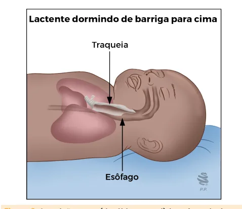
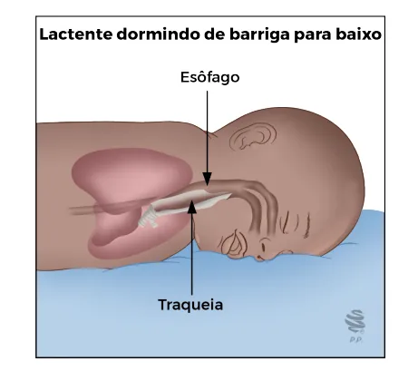
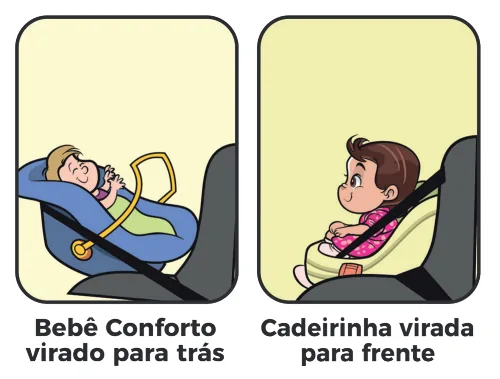
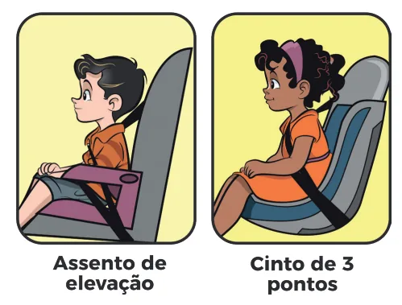

# Pediatria Geral

<!-- page:1 -->

**Pediatria Geral (PED)** — resumo inicial:

- **Pele do recém-nascido (RN)**: não retirar o vérnix; 1º banho após 24h; coto umbilical: manter limpo e seco, higiene com álcool ou clorexidina se houver risco de infecção.
- **Escovação de dentes**: a partir do aparecimento do primeiro dente, 2x/dia, pasta com flúor.
- **Segurança do sono**: bebês devem dormir de barriga para cima, em superfície firme, sem inclinação, sem acessórios, de preferência em cama separada no mesmo quarto dos pais até 6-12 meses.

> ⚠️ Tabela reconstruída a partir de OCR — confira contra a fonte original.

**Tempo de sono recomendado (incluso cochilo)**:

| Idade | Sono recomendado |
|---|---|
| 4 - 12 meses | 12 a 16 h/dia |
| 1 - 2 anos | 11 a 14 h/dia |
| 3 - 5 anos | 10 a 13 h/dia |
| 6 - 12 anos | 9 a 12 h/dia |
| 13 - 18 anos | 8 a 10 h/dia |

**Tempo de tela recomendado**:

| Idade | Tempo de tela |
|---|---|
| 0 - 2 anos | Zero (nem passivo) |
| 2 - 5 anos | 1 h/dia |
| 6 - 10 anos | 1-2 h/dia |
| 11 - 18 anos | 2-3 h/dia |

- **Segurança no trânsito**: <1 ano: bebê conforto virado para trás; 1-4 anos: cadeirinha virada para frente; a partir de 4 anos até 1,45m de altura: assento de elevação.
- **Dor recorrente em membros** ("dor de crescimento"): exame físico normal, sem outros sintomas.

## Consultas e Cuidados com o RN

### Frequência de Consultas

**Ministério da Saúde**:
- 1ª semana de vida;
- 1 mês de vida;
- A cada 2 meses: 2, 4 e 6 meses de idade;
- A cada 3 meses: 9 e 12 meses de idade;
- A cada 6 meses: 18 e 24 meses de idade;
- A partir dos 2 anos: anual.

**Sociedade Brasileira de Pediatria (SBP)**:
- Consulta pediátrica pré-natal (3º trimestre);
- 1ª semana;
- Mensal até 6 meses;
- Trimestral: 9, 12, 15, 18 meses;
- Semestral: 24 a 48 meses (4 anos);
- A partir dos 5 anos: anual.

### Consulta Pediátrica Pré-natal

A partir do **terceiro trimestre** gestacional.

**Papel do pediatra na consulta pré-natal**:
- Vínculo;
- Anamnese: história obstétrica, história familiar, saúde da gestante (idade, sorologias, vícios, consanguinidade);
- Vacinação da gestante (Influenza, COVID, dTpa, Hepatite B);
- Nutrição e suplementação da gestante: avaliar suplementação de **ferro, vitamina B12, vitamina D, DHA, ácido fólico**;
- Parto normal e **aleitamento materno exclusivo (AME)**: benefícios do parto normal e do AME até o 6º mês de vida.

## Cuidados com a Pele do RN

- **Não retirar o vérnix**.
- **Banho**: primeiro banho após 24 horas (mínimo de 6h), por imersão, 1x/dia ou 2-3x/semana, utilizar sabonete *syndet*.
- **Coto umbilical**: manter limpo e seco. Higiene com álcool 70% ou clorexidina se houver fatores de risco para infecção (ex.: parto domiciliar, clampeamento não estéril, alta mortalidade neonatal).
- **Área das fraldas**: higiene com algodão e água, creme de barreira em fina camada conforme necessidade, troca frequente.
- **Eliminações**:
  - Diurese: normalmente nas primeiras 24h. Pode conter cristais de urato.
  - Evacuação: mecônio até 3-4 dias, seguido por fezes de transição.

---

<!-- page:2 -->

## Higiene Oral

- Iniciar a escovação assim que surgirem os primeiros dentes de leite (mínimo 2x/dia — manhã e noite, se possível depois das refeições).
- Escova infantil (cerdas macias).
- **Creme dental com flúor**: 1.000 ppm.
  - Crianças que não conseguem cuspir (< 4 anos): um grão cru de arroz.
  - Crianças que conseguem cuspir (a partir de 4 anos): um grão de ervilha.
- **Fio dental**: se houver dentes muito juntos, 1x/dia.
- **Erupção dos dentes de leite**: inicia no 2º semestre, com incisivos centrais inferiores e superiores.
- **Troca para dentes permanentes**: inicia aos 6-8 anos.
- Cuidadores devem realizar a escovação até cerca de 7-8 anos.
- **Chupeta**: sempre evitar!
- Se for usar mamadeira: bico ortodôntico, sempre supervisionado.

## Síndrome da Morte Súbita do Lactente (SMSL)

### Definição e Incidência

- **Definição**: morte súbita e inesperada de uma criança com menos de um ano de idade, durante o sono, que não pode ser explicada após a avaliação pós-morte, incluindo autópsia, história clínica e social completa e avaliação da cena de morte.
- **Pico de incidência**: 2-4 meses, mais frequente em meninos.

### Fatores de Risco

- Dormir em posição prona ou lateral;
- Cama compartilhada;
- Tabagismo (pré-natal e pós-natal);
- Pais com doença mental ou abuso de substâncias;
- Sexo masculino, pobreza;
- Prematuridade, baixo peso (BP) ao nascer ou pequeno para a idade gestacional (PIG);
- Superaquecimento.

### Fatores Protetores

- **Dormir em decúbito dorsal** (barriga para cima);
- Superfície firme para dormir, sem inclinação e sem acessórios;
- Dormir em cama separada, mas no mesmo quarto dos pais, até os 6-12 meses de vida;
- **Aleitamento materno**.

Figura 2: A posição prona (decúbito ventral) é um fator de risco para SMSL, pois facilita a aspiração caso haja refluxo. A posição supina (decúbito dorsal) é um fator protetor.

## Segurança do Sono em <1 Ano

1. **Dormir de barriga para cima** (supina): iniciar de barriga para cima até 1 ano. Depois que aprende a rolar, não precisa mais reposicionar.
2. **Berço com superfície rígida e não inclinada**: colchão bem ajustado, sem sobra de espaço, lençol preso ao colchão.
3. **Berço no quarto dos pais pelo menos até 6 meses**: próximo à cama dos pais, de preferência até 12 meses. Não compartilhar a cama ou demais superfícies.
4. **Aleitamento materno**: protege contra SMSL. Amamentar à noite na cama, depois devolver o bebê ao berço. Não amamentar no sofá ou poltrona — aumenta o risco de SMSL.
5. **Acessórios e roupas**: não devem ser utilizados travesseiros, almofadas, rolinhos, ninhos, protetor de berço, coberta. Se necessário, colocar mais roupa no bebê.
6. **Evitar exposição ao tabaco** e demais substâncias psicoativas desde a gestação e após o nascimento.
7. **Evitar superaquecimento**: normalmente colocar uma camada a mais de roupa que o cuidador, evitar touca.

---

<!-- page:3 -->

## Higiene do Sono

- Rotina diurna que ajude a proporcionar uma boa noite de sono;
- Regularidade de horários para dormir e acordar (inclusive em final de semana);
- Ritual/rotina de sono (banho, massagem, atividades tranquilas, exercícios de relaxamento, desligar luzes);
- Ambiente físico adequado para o sono: temperatura, luminosidade e silêncio;
- Evitar uso de telas pelo menos 1 hora antes do horário de dormir;
- Encorajar a criança a adormecer na própria cama/berço e no seu quarto;
- Objetos de transição (como bonecas, fraldas de pano, cobertores) podem ser utilizados para crianças pequenas;
- Evitar bebidas (chocolate, café, refrigerante) e medicações que sejam estimulantes perto do horário de dormir.

**Tabela 1: Horas de sono esperadas por idade** (incluso cochilo)

| Idade | Horas/dia |
|---|---|
| 4-12 meses | 12 a 16 horas |
| 1-2 anos | 11 a 14 horas |
| 3-5 anos | 10 a 13 horas |
| 6-12 anos | 9 a 12 horas |
| 13-18 anos | 8 a 10 horas |

## Atividade Física e Uso de Telas

### Atividade Física

- **0-2 anos**: manter o bebê ativo (segurar, puxar, empurrar, ficar de pé, engatinhar). <1 ano: 30 minutos/dia, com tempo de "barriguinha para baixo" supervisionado. >1 ano: 180 minutos/dia. Atividades: ficar de pé, movimentar-se, rolar, brincar, saltar, pular e correr.
- **3-5 anos**: recomendação de 180 minutos/dia, com pelo menos 60 minutos de atividade moderada ou vigorosa. Atividades: andar de bicicleta, brincar na água, jogos de bola, jogos de perseguição; atividades físicas estruturadas: natação, dança, artes marciais.
- **6-19 anos**: recomendação de 60 minutos/dia de atividade física moderada ou vigorosa. Pedalar, nadar, brincar em playground, correr, saltar, atividades em grupo.

### Uso de Telas

- Sempre com supervisão (conteúdo adequado à idade);
- Nunca virar a noite;
- Evitar ter acesso a tela no quarto, de preferência em local comum;
- Desconectar 1-2h antes de dormir;
- Não utilizar telas durante as refeições.

**Tabela 2: Tempo de tela máximo por idade**

| Idade | Tempo de tela |
|---|---|
| 0 - 2 anos | Zero (nem passivo) |
| 2 - 5 anos | 1 hora |
| 6 - 10 anos | 1 - 2 horas |
| 11 - 18 anos | 2 - 3 horas |

## Riscos da Era Digital

- Atraso no desenvolvimento;
- Dependência;
- Problemas de saúde mental: irritabilidade, ansiedade, depressão, TDAH;
- Transtornos do sono;
- Sobrepeso e obesidade;
- Sedentarismo;
- Bullying e cyberbullying;
- Transtornos da imagem corporal e da autoestima, anorexia e bulimia;
- Riscos da sexualidade, nudez, sexting, sextorsão, abuso sexual;

---

<!-- page:4 -->

- Comportamentos autolesivos, risco de suicídio, aumento da violência;
- Problemas visuais e auditivos;
- Transtornos posturais e músculo-esqueléticos;
- Uso de substâncias.

## Fotoproteção e Uso de Repelentes

### Exposição Solar e Fotoproteção

- **Não é recomendado banho de sol!**
- Se exposição ao sol: medidas de fotoproteção!
- Preferir horário antes das 10h e após as 16h.
- **<6 meses**: evitar exposição direta ao sol; proteção mecânica (roupa, chapéu, guarda-sol).
- **Entre 6 meses e 2 anos**: filtros inorgânicos/físicos.
- **A partir de 2 anos**: filtros químicos infantis.

### Repelentes

- Ideal é proteção mecânica (roupas compridas, telas de proteção);
- Há repelentes disponíveis a partir de 2 meses de vida (depende do produto, sempre ler a bula);
- **Entre 2-6 meses**: usar apenas se muito necessário e raramente;
- **6-12 meses**: 1x/dia;
- **Maiores de 1 ano**: 2x/dia;
- **Maiores de 12 anos**: 2-3x/dia.

## Prevenção de Acidentes

**Acidentes**: principal causa de morte de crianças de 1 a 14 anos no Brasil.

- Prever risco de acordo com a faixa etária;
- Quedas, afogamento, queimaduras, choque elétrico, atropelamento, acidente de trânsito, engasgo, aspiração/sufocação, intoxicação.

### 0-4 Meses

**Queimaduras**:
- Banho: primeiro água fria, depois quente, testar no antebraço (~36°C);
- Mamadeira: não esquentar no micro-ondas;
- Não cozinhar com o bebê no colo.

**Trauma por impacto e quedas**:
- Mobile e outros objetos soltos;
- Bebê conforto com cinto.

**Afogamento**:
- Cuidado no banho.

**Aspiração e sufocação**:
- Não usar colares;
- Não deixar o bebê mamando sozinho na mamadeira;
- Segurança do sono.

**Choques elétricos**:
- Proteger as tomadas.

- Cuidado com exposição ao sol.

### 5-12 Meses

**Quedas**:
- Cuidado com trocador, cama;
- Preferir brincar no chão protegido;
- Berço com grade;
- Nunca usar andador;
- Proteger as tomadas;
- Não deixar fio solto ou desencapado.

**Afogamento**:
- Lavanderia com portão;
- Locais com água sempre acompanhado por adulto;
- Piscina: barreira com cerca de 150 cm de altura e portão travado.

**Outros**:
- Brinquedos seguros;
- Manter fora de alcance produtos de limpeza, medicamentos;
- Cuidado com animais.

### 1-4 Anos

**Quedas**:
- Telas em janela;
- Sempre supervisionada por adulto.

**Outros**:
- Manter fora de alcance produtos de limpeza, medicamentos.

### 5-11 Anos

**Quedas**:
- Supervisão nas brincadeiras;
- Equipamento de proteção (capacete, joelheira) se bicicleta, skate.

**Atropelamentos e acidentes com veículos automotores**:
- Não andar na rua sozinho antes de 12 anos;
- Assento de elevação, cinto de segurança.

**Afogamentos**:
- Supervisão.

## Segurança no Transporte em Veículos

- **Bebê conforto**: até 1 ano ou até ultrapassar o limite de peso do fabricante, posicionado de costas para o painel do carro, com leve inclinação.
- **Cadeirinha de segurança**: crianças entre 1 e 4 anos, posicionada de frente para o painel do carro.
- **Assento de elevação ou "booster"**: de 4 a 7 anos e meio ou até 145 cm de altura, com cinto de 3 pontos, voltado para a frente do veículo.
- **Cinto de segurança de três pontos**: a partir de 7 anos e meio ou altura maior que 145 cm.
- **Banco dianteiro**: a partir dos 10 anos ou 145 cm, com cinto de 3 pontos.
- **Moto**: a partir de 10 anos.

*Ver Figura 3 na próxima página.*

---

<!-- page:5 -->

Figura 3: Exemplos dos dispositivos de retenção para transporte veicular.

## Dor Recorrente em Membros ("Dor de Crescimento")

- Queixa frequente em pediatria;
- Normalmente no fim do dia ou noturna;
- Entre 3-12 anos;
- **Diagnóstico de exclusão** (anamnese + exame físico excluindo fatores de risco);
- História familiar em parente de primeiro grau: frequente;
- **Manejo**: tranquilizar a família, massagem, calor local, analgésicos;
- **Localização**: dor normalmente bilateral em membros inferiores (MMII) — coxa, canelas, panturrilhas e fossa poplítea;
- **Horário**: fim de tarde e à noite. Não está presente pela manhã. Períodos assintomáticos. Sem relação com atividade física. Há pelo menos 3 meses;
- **Gravidade**: pode acordar à noite. Melhora com massagem e/ou analgésico, não piora com o passar do tempo;
- **Exame físico**: normal.

**Sinais de alerta para causas orgânicas** — investigar!
- Claudicação durante o dia ou dor que interfere nas atividades diárias;
- Dor articular presente pela manhã ou artrite;
- Unilateral ou localizada persistente;
- Dor acompanhada por febre, hepatoesplenomegalia, linfadenomegalia, assimetria muscular, lesões cutâneas, úlceras orais;
- **Investigação**: hemograma, proteína C reativa (PCR) ou velocidade de hemossedimentação (VHS); exames de imagem conforme suspeita.

## Desfralde

- Inicia com os sinais de prontidão (em geral entre 24-36 meses) até o momento em que a fralda deixa de ser necessária e é retirada por completo.
- Alguns sinais de prontidão a serem avaliados aos 24 meses:
  - Saber puxar as roupas para cima e para baixo;
  - Possuir vocabulário simples referente ao treinamento esfincteriano;
  - Usar palavras, expressões faciais ou movimentos que indicam a necessidade de urinar ou evacuar;
  - Mostrar interesse em outras pessoas que estejam usando o banheiro;
  - Ficar seco por duas horas ou mais durante o dia;
  - Dizer que está "fazendo xixi" no momento da micção, em geral nos banhos.
- **Treinamento esfincteriano (TE)**: abordagem orientada pela criança. Iniciar em todos os ambientes, com as mesmas orientações.
- Se houver recusa para o TE, fazer pausa de um a três meses. Permite retomar confiança e cooperação entre pais e filhos.
- **Tentativas repetidas malsucedidas**: crianças com 36 meses ou mais que não apresentam sinais de prontidão; ou 48 meses ou mais sem terem concluído o TE diurno. Avaliar o relacionamento da criança com os pais, descartar anormalidades físicas e/ou de desenvolvimento.

## Referências

Figura 1: Evacuação meconial. BELLYBABY. O mecônio: causas, sintomas e tratamento. Bellybaby, 2025. Disponível em: https://bellybaby.es/el-meconio-causas-sintomas-ytratamiento/. Acesso em: 17 mar. 2025.

Figura 2: A posição prona (decúbito ventral) é um fator de risco para SMSL, pois facilita a aspiração caso haja refluxo. A posição supina (decúbito dorsal) é um fator protetor. Adaptada de MOON, Rachel Y.; CARLIN, Rebecca F.; HAND, Ivan. Sleep-Related Infant Deaths: Updated 2022 Recommendations for Reducing Infant Deaths in the Sleep Environment. Pediatrics, v. 150, n. 1, e2022057990, 2022. DOI: 10.xxxx/peds.2022-057990.

Figura 3: Exemplos dos dispositivos de retenção para transporte veicular. Adaptada de BRASIL. Ministério da Infraestrutura. Lei da Cadeirinha: é falsa a informação sobre alterações nas regras para transporte de crianças. Governo do Brasil, 2025. Disponível em: https://www.gov.br/transportes/pt-br/assuntos/noticias/2025/02/lei-da-cadeirinha-e-falsa-a-informacao-sobre-alteracoes-nas-regras-para-transporte-de-criancas. Acesso em: 17 mar. 2025.

