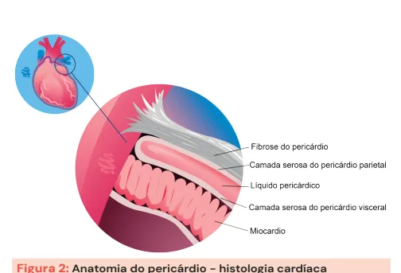
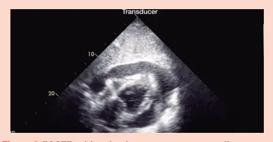
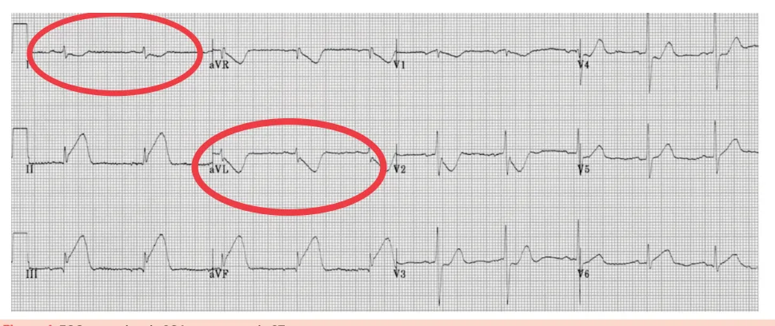
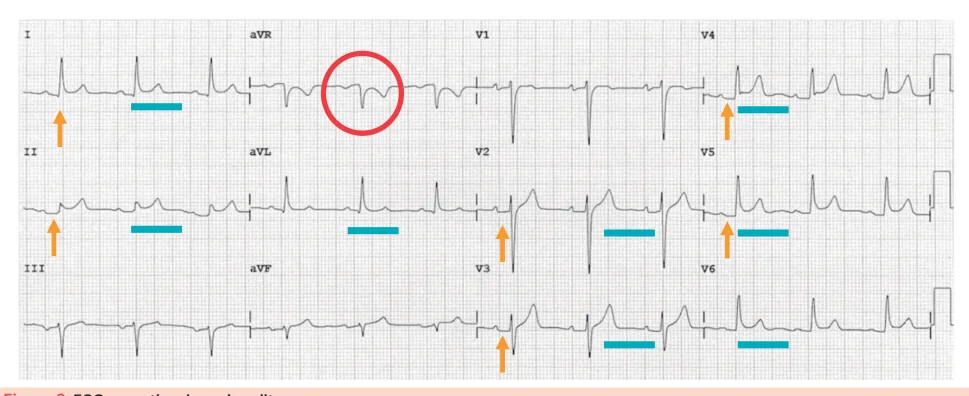
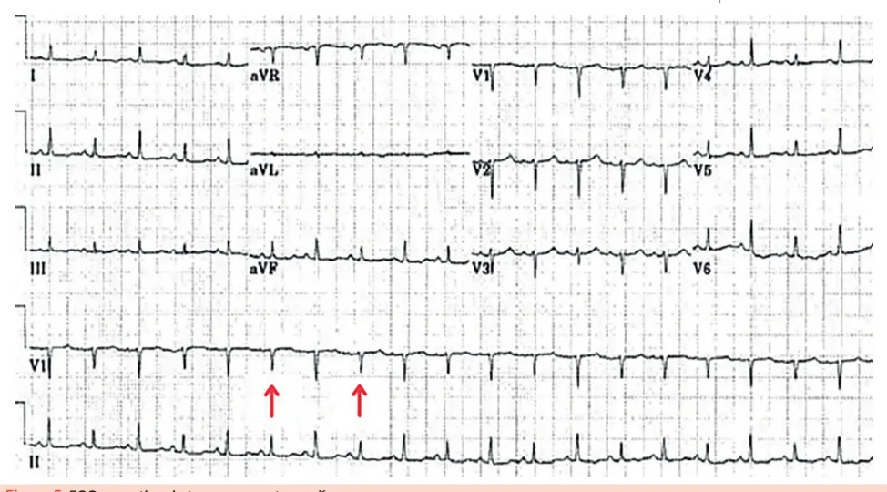
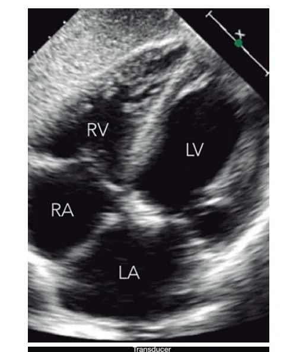
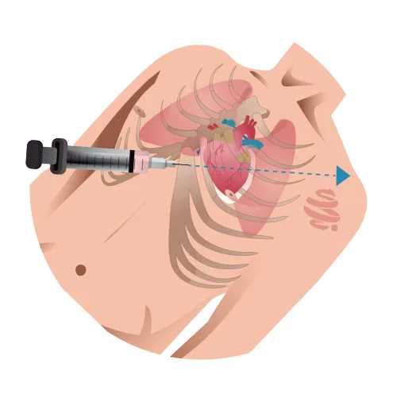

# Pericardite e Miocardite

<!-- page:1 -->

Miocardite e Pericardite (CM) PERICARDITE: M

- Idiopático na maioria dos casos.

- Dor torácica em jovem + alterações sugestivas no ECG: Supra de ST difuso Infra de PR Imagem oposta em AVR - por vezes em V1 - infra de ST e supra de PR

- Troponina NEGATIVA.

- Tratamento: AINE + colchicina.

- Corticoide em alguns casos (quando relacionado a doença autoimune).

Tamponamento cardíaco:

- Líquido no pericárdio com redução de débito cardíaco por compressão do VD.

- ECOTT: Colabamento do AD e VD (especialmente) na diástole.

- Verificar Figura 1

- Tríade de Beck (hipotensão, turgência jugular, abafamento de bulhas) + pulso paradoxal.

- Tratamento: pericardiocentese (emergência).

## PERICARDITE E MIOPERICARDITE

- ENTENDENDO A ANATOMIA DO PERICÁRDIO

- Muito inervado = dor significativa.

- Composto por: Pericárdio fibroso. Q Pericárdio seroso - dividido em: camada parietal/ camada visceral.

- E

- - Figura 2: Anatomia do pericárdio - histologia cardíaca

## PERICARDITE

- PERICARDITE = sinais e sintomas resultantes da inflamação do pericárdio.

- 80% dos casos são idiopáticos, com presumida maioria etiologia viral. Sorologias virais NÃO são feitas de rotina, pois não alteram a conduta e tem correlação incerta.

- Miocardite:

- Clínica parecida com a da pericardite, porém com troponina POSITIVA.

- Quadro clínico pode variar entre de dor torácica e taquicardia leve a choque cardiogênico.

- Tratamento de suporte na maioria dos casos.

- Se choque cardiogênico: indicação de biópsia endomiocárdica para descartar infecção e avaliar etiologias em que o tratamento imunossupressor possa ter benefício (corticoide +- azatioprina).

Figura 1: ECOTT evidenciando tamponamento cardíaco com colabamento de AD e VD.

- 20% dos casos são por outras causas (investigáveis):

doenças reumatológicas, tuberculose, pós infarto transmural imediato e tardio (Sd. Dressler), neoplasia, entre outros.

## QUADRO CLÍNICO

- Dor torácica (> 90% dos casos): Dor pleurítica = piora com expiração profunda. Pode irradiar para o trapézio. Pode causar soluço devido à inervação do nervo frênico próxima ao pericárdio. Aliviada com inclinação do corpo para frente. Piora com decúbito.

## EXAME FÍSICO

- Atrito pericárdico: som áspero (arranhadura/ranger).

## EXAMES COMPLEMENTARES

- PCR (elevada em 80% dos casos).

- Troponina (diferencial com miocardite).

- ECG.

- Ponderar se é válido realizar investigação reumatológica em mulheres jovens.

## ELETROCARDIOGRAMA

- Supra de ST difuso (traços azuis na imagem).

- Infra de segmento PR difuso (setas laranjas na imagem).

- Imagem correspondente oposta em avR, às vezes V1

(circulada na imagem), ou seja, infra de ST e supra de PR.

- Verificar Figura 3 na próxima página

---

<!-- page:2 -->

Figura 3: ECG sugestivo de pericardite. Supra de ST difuso (traços azuis), infra de segmento PR Imagem em espelho (além de aVR e V1), supra de DIII > DII, difuso (setas laranjas) e imagem correspondente oposta supra “horizontal” ou “triste”.

em aVR, por vezes também visualizada em V1 (circulada em vermelho). TRATAMENTO Pericardite idiopática DIAGNÓSTICO

- Associar AINE + colchicina: ibuprofeno 600mg VO 8/8h

- Dois dos quatro abaixo: por 10-14d + colchicina 0,5mg VO 1x/d ou 12/12h. Dor típica.

- Pacientes com > 70kg se beneficiam mais da Atrito pericárdico. colchicina 12/12h. Alterações eletrocardiográficas típicas.

- Manter colchicina por 3 meses para Derrame pericárdico novo ou piora do prevenir recorrência.

derrame prévio.

- Corticoides - usados apenas em casos selecionados,

ECG da pericardite vs ECG da SCA com supra de ST como doenças auto-imunes ou pericardite recorrente,

- Na SCA com supra de ST além de contraindicações às outras terapêuticas. Imagem em espelho (além de avR e V1).

## TAMPONAMENTO CARDÍACO

| Supra em DIII > DII (comum em etiologias isquêmicas). | Supra horizontal ou “triste” (concavidade

- Compressão das câmaras cardíacas devido ao para baixo). acúmulo de líquido no pericárdio, causando aumento

- Na prova: paciente mais velho (> 50 anos) + fatores da pressão intrapericárdica.

de risco. | Causa redução do enchimento ventricular com

- Lembre-se: na pericardite, geralmente as provas consequente choque e aumento da pressão trazem pacientes jovens sem fatores de risco. venosa central.

- Verificar Figura 4

Figura 4: ECG sugestivo de SCA com supra de ST

---

<!-- page:3 -->

Figura 5: ECG sugestivo de tamponamento cardíaco

- Não é muito comum nas pericardites idiopáticas.

Ocorre mais em pericardites por tuberculose ou neoplasia.

- Dispneia + dor torácica.

- Taquicardia sinusal - forma de compensar a redução do débito cardíaco.

- Tríade de Beck → hipotensão + turgência jugular + abafamento de bulhas: não está presente em todos os casos, apenas na minoria, mas costuma cair bastante em provas!

- Pulso paradoxal - redução da pressão sistólica > 10 mmHg na inspiração.

- Alternância elétrica e baixa voltagem (setas).

- Taquicardia sinusal.

- Verificar Figura 5 taquicardia sinusal.

Alternância elétrica e baixa voltagem (setas vermelhas) e

- Verificar Figura 6 e o de um paciente com tamponamento cardíaco segunda imagem.

Comparação entre um ecocardiograma normal (acima) (abaixo). As câmaras direitas estão colabadas na

## DIAGNÓSTICO

- Clínica sugestiva associada ao ecocardiograma alterado.

## TRATAMENTO

- Drenagem pericárdica por pericardiocentese: Não é recomendado que seja feita às cegas. É preferível que seja guiada por USG e, se possível, realizada por um cirurgião. Figura 6: Ecocardiograma no tamponamento cardíaco

- Verificar Figura 7 na próxima página

---

<!-- page:4 -->

## MIOCARDITE

- Inflamação do miocárdio, caracterizada pelo aumento de troponina.

- Pode ou não estar associada a pericardite.

Figura 7: Pericardiocentese.

## MENSAGENS FINAIS

Tabela 1:: Take-Home Message Pericardite Tam Dor torácica em jovem + alterações Líquido no per sugestivas no ECG.

de débito card Troponina NEGATIVA. Tríade de Bec Tratamento: AINE + colchicina.

Corticoide em alguns casos.

## REFERÊNCIAS

Figura 1:: ECOTT evidenciando tamponamento cardíaco com colabamento de AD e VD. JAMA Network Figura 3:: ECG sugestivo de pericardite litfl.com/pericarditis-ecg-library/ - Pode ou não estar associada a pericardite.

- Muito variável.

- Pródromo viral + febre + taquicardia OU choque cardiogênico.

- Taquicardia sinusal.

- Alterações inespecíficas da repolarização.

- Se associada à pericardite, tem as alterações comuns, como supra difuso, infra de PR, entre outras.

Como saber se o paciente tem apenas pericardite ou também miocardite associada? → Dosar troponina, que só se eleva na presença de miocardite.

- Expectante na maioria dos casos, principalmente se o paciente não estiver em choque.

- Na presença de choque cardiogênico, realizamos tratamento de suporte, como drogas vasoativas, balão intra-aórtico, entre outros.

mponamento Miocardite Clínica parecida com a da ricárdio com redução pericardite, porém com troponina díaco por compressão.

POSITIVA. ck e pulso paradoxal. Tratamento de suporte na maioria : pericardiocentese. dos casos. Figura 4:: ECG sugestivo de SCA com supra de ST Litfl. Disponível em litfl.com/ Figura 5:: ECG sugestivo de tamponamento cardíaco Litfl.com/ecg-findings-in-massive-pericardial-effusion/ Figura 6:: Ecocardiograma no tamponamento cardíaco JAMA Network

