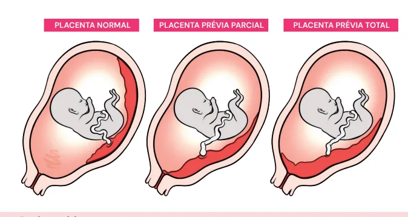
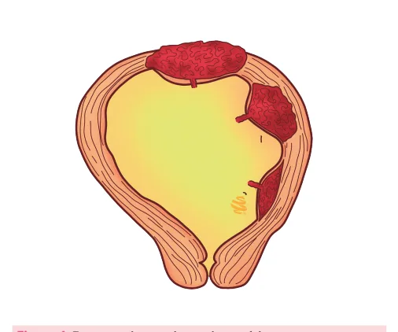
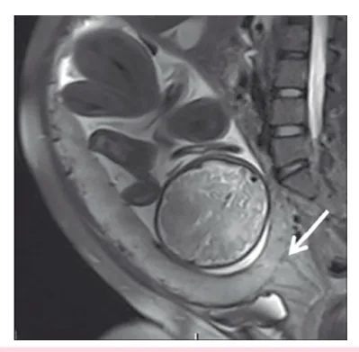
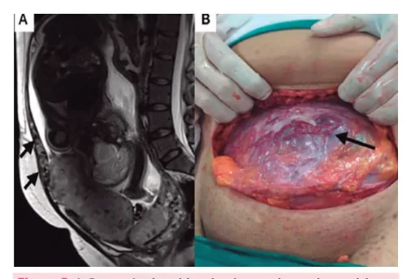

# Placenta Prévia

<!-- page:1 -->

## Resumo

**Definição:**

- A presença de tecido placentário que recobre ou está muito próximo ao orifício interno do colo após 28 semanas de gestação.

**Clínica:**

- Sangramento vaginal indolor, progressivo, recorrente, de aspecto vermelho-vivo, sem sofrimento fetal e com tônus uterino normal.

**Fatores de risco:**

- Multiparidade, número de cesáreas prévias, idade > 35 anos, gemelaridade, curetagens uterinas prévias, antecedente de placenta prévia e tabagismo.

**Diagnóstico:**

- Clínica + ultrassonografia (não fazer toque vaginal).

## Definição

- A presença de tecido placentário que recobre ou está muito próximo ao orifício interno do colo após 28 semanas de gestação.

## Classificação

- **Placenta prévia**: recobre total ou parcialmente o orifício interno do colo (anteriormente chamada de placenta prévia centro-total ou centro-parcial).
- **Placenta de inserção baixa**: a borda placentária se insere no segmento inferior do útero, localizando-se até 2 cm do orifício interno do colo.

- Verificar Figura 1.

Figura 1: Tipos de inserção placentária.

**Conduta:**

- Programação de cesárea entre 36 semanas e 36 semanas e 6 dias;
- Se placenta de inserção baixa, pode-se tentar parto vaginal.

## Acretismo Placentário

**Definição:**

- **Acreta**: invade superficialmente o miométrio;
- **Increta**: quando invade o miométrio por completo;
- **Percreta**: quando invade a serosa, podendo invadir estruturas adjacentes.

**Clínica:**

- Placenta prévia que não sangra;
- Retenção placentária após o parto.

**Conduta:**

- Histerectomia com a placenta "in loco", programada para a 36ª semana de gestação.

## Fatores de Risco (Placenta Prévia)

- Multiparidade;
- Número de cesáreas prévias;
- Idade > 35 anos;
- Gemelaridade;
- Curetagens uterinas prévias;
- Antecedente de placenta prévia;
- Tabagismo.

> A presença de placenta prévia aumenta muito o risco de hemorragias anteparto, intraparto e pós-parto.

## Fisiopatologia

**Por que ocorre?**

- Fator que leve à decidualização deficiente, fazendo com que o embrião procure outros locais para oxigenação;
- Fator que interfira no processo de nidação, tornando-a mais tardia e mais baixa.

---

<!-- page:2 -->

## Por Que 28 Semanas?

- Processo da "migração placentária": diferença de crescimento entre os segmentos uterinos superior e inferior;
- O segmento uterino inferior pode aumentar de 0,5 cm com 20 semanas para mais de 5 cm no termo.

## Quadro Clínico

- Sangramento vaginal progressivo e recorrente;
- Vermelho-vivo;
- Indolor, mas pode desencadear contrações;
- Tônus uterino normal;
- Ausência de sofrimento fetal.

> O sangramento pode ser intenso e provocar instabilidade materna.

## Diagnóstico

- Clínica compatível;
- Ultrassonografia (USG) transvaginal;
- Ressonância Nuclear Magnética (RNM): principalmente para casos duvidosos e de placentas posteriores.

> Não realizar toque vaginal diante da suspeita ou confirmação de placenta prévia.

Figura 2: Ultrassonografia transvaginal exibindo placenta atingindo e ultrapassando o orifício interno do colo do útero.

Figura 3: Ressonância magnética evidenciando placenta prévia.

## Conduta

**Orientações:**

- Se sangrar, procurar atendimento médico;
- Evitar atividade física intensa;
- Abstinência sexual.

**Manejo:**

- Sangramento = internação!
- Acessos venosos, monitorização materna;
- Exames laboratoriais: tipagem sanguínea, hemograma, função renal, coagulograma;
- Ter reserva de concentrado de hemácias;
- Programar corticoterapia;
- Imunoglobulina anti-D se houver sangramento e a gestante tiver tipagem Rh negativo.

## Conduta Obstétrica

- Programação de cesárea entre 36 semanas e 36 semanas + 6 dias, evitando que entre em trabalho de parto;
- Se inserção baixa, pode-se tentar parto vaginal;
- No intraoperatório, deve-se evitar a incisão transplacentária.

> Em casos de placenta prévia, é importante ter cuidado, pois pode vir associada a acretismo placentário.

## Acretismo Placentário

- Aderência anormal da placenta ao miométrio.

**Classificação:**

- **Acreta**: invade superficialmente o miométrio;
- **Increta**: quando invade o miométrio por completo;
- **Percreta**: quando invade a serosa, podendo invadir estruturas adjacentes.

Figura 4: Espectro do acretismo placentário.

**Fatores de Risco:**

- Cesárea anterior: principal;
- Curetagem uterina;
- Miomectomia;
- Videohisteroscopia;
- Idade > 35 anos;
- Multiparidade.

---

<!-- page:3 -->

## Quadro Clínico (Acretismo Placentário)

- Placenta prévia que não sangra (ou sangra pouco);
- Retenção placentária após o parto.

## Diagnóstico

- USG transvaginal ou RNM (especialmente na placenta posterior).

Figura 5: A: Ressonância evidenciando acretismo placentário (setas). B: Aspecto intraoperatório do acretismo placentário.

## Conduta

- Histerectomia com placenta in loco, programada para a 36ª semana de gestação. Não se deve tentar a dequitação;
- Reserva de hemoconcentrados: alta probabilidade de sangramento intraoperatório intenso (em média 2,5 L); transfusão maciça de hemocomponentes é frequente;
- Alto risco de lesão de bexiga e/ou ureter: ideal acompanhamento de urologista.

**Cuidados no Planejamento Cirúrgico:**

- Acesso venoso periférico calibroso;
- Considerar radiologia intervencionista;
- Reserva de leito de UTI;
- Reserva de hemocomponentes;
- Histerotomia fúndica;
- Histerectomia com placenta in situ: não tentar dequitação;
- Sonda vesical de demora nº 18;
- Termo de Consentimento Livre e Esclarecido.

## Manejo do Espectro da Placenta Acreta (EPA) - FEBRASGO

- Toda gestante com cirurgia uterina prévia e placenta de implantação anterior baixa deve realizar avaliação ultrassonográfica entre 18 e 24 semanas de gestação;
- O parto de pacientes estáveis com EPA deve ocorrer entre 34 semanas e 35 semanas e 6 dias;
- O EPA, nas suas variedades prévia increta e percreta, pode ser tratado por meio da exérese segmentar uteroplacentária, seguida de restauração da anatomia uterina, ou da histerectomia;
- Se, diante do diagnóstico de surpresa do EPA, as condições cirúrgicas ideais não estiverem presentes, o ato cirúrgico deve se restringir à histerotomia e extração fetal fora da área uterina invadida, seguidas de histerorrafia com a placenta in situ e laparorrafia.

> A reabordagem cirúrgica definitiva deve ser realizada dentro de uma a duas semanas.

## Referências

Figura 2: Ultrassonografia transvaginal exibindo placenta atingindo e ultrapassando orifício interno do colo do útero. Disponível em: WEERAKKODY, Y.; CAMPOS, A.; YAP, J.; et al. Vasa previa. Radiopaedia.org, 2025. Disponível em: https://doi.org/10.53347/rID-13131.

Figura 3: AGOSTINI, Thais Coura Figueiredo et al. Desordem de adesão placentária: sinais na ressonância magnética e proposta de laudo estruturado. Radiologia Brasileira, v. 53, p. 329-336, 2020.

Figura 5: A: AGOSTINI, Thais Coura Figueiredo et al. Desordem de adesão placentária: sinais na ressonância magnética e proposta de laudo estruturado. Radiologia Brasileira, v. 53, p. 329-336, 2020.

