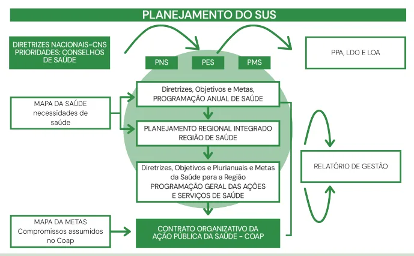
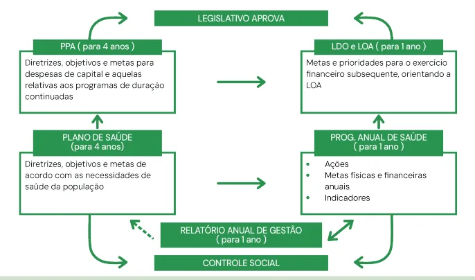
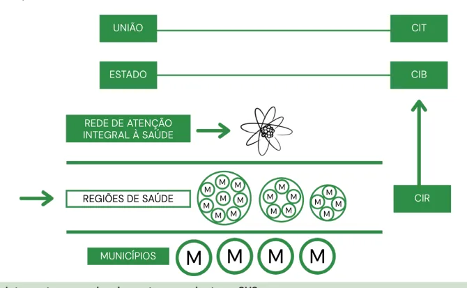

# Planejamento em Saúde

<!-- page:1 -->

## Saúde Pública — Legislação do SUS

### Decreto nº 7.508/2011 — Principais Definições e Instrumentos

- **Decreto nº 7.508/2011**: regulamenta a Lei nº 8.080/90, visando superar a fragmentação via governança regional.
- **Região de Saúde**: espaço geográfico funcional de municípios limítrofes, criado para garantir escala e escopo na oferta integral de serviços de saúde.
- **Redes de Atenção à Saúde (RAS)**: organização de serviços de saúde articulados de forma coordenada e contínua, com a **Atenção Primária como centro de comunicação**.
- **Portas de Entrada**: pontos de acesso preferenciais e ordenados (Atenção Primária, Urgência/Emergência, Atenção Psicossocial, Serviços Especiais) para organizar o fluxo e evitar "peregrinação" do usuário.
- **Mapa da Saúde**: ferramenta de planejamento que "fotografa" a realidade sanitária e capacidade instalada (pública e privada) para identificar vazios assistenciais e guiar investimentos.
- **COAP** (Contrato Organizativo de Ação Pública da Saúde): principal instrumento de governança.

## Considerações Iniciais

O Decreto nº 7.508/2011 representa um marco regulatório fundamental para o Sistema Único de Saúde (SUS), buscando dar materialidade e operacionalidade aos princípios da Lei nº 8.080/90, especialmente no que tange à organização de uma **governança regional, cooperativa e integrada**.

## Contexto Histórico e Normativo Precedente

- **Pacto pela Saúde (2006)** — Portaria nº 399/GM/MS: esforço para redefinir as responsabilidades dos entes. Embora tenha introduzido o "Termo de Compromisso de Gestão", este era um instrumento de adesão voluntária, com baixo poder de sanção, dificultando a efetivação da regionalização na prática. Era um "pacto de intenções".

- **Portaria nº 4.279/2010**: atuou como precursor conceitual, estabelecendo diretrizes para a organização das Redes de Atenção à Saúde (RAS), mas sua implementação ainda dependia de uma estrutura de governança regional mais clara para articular diferentes pontos de atenção.

- **Sinergia com a Lei nº 12.466/2011**: logo após o decreto, essa lei alterou a Lei nº 8.080/90, conferindo força legal às Comissões Intergestores e instituindo o COAP. Essa alteração foi crucial, pois transformou a governança cooperativa de uma recomendação em uma exigência legal com força de contrato jurídico, formalizando responsabilidades (sanitárias, financeiras) dos entes federativos na Região de Saúde, tornando a cooperação uma obrigação legal.

- **Comissões Intergestores**: fóruns de pactuação entre gestores, com destaque para a **CIR (Comissão Intergestores Regional)**, "locus" da governança regional para decisões diárias.

- **RENASES, RENAME e PCDT**: instrumentos que definem o que o SUS deve ofertar (serviços), quais medicamentos são essenciais e como as doenças devem ser tratadas (protocolos), conferindo concretude e transparência ao direito à saúde.

### Instrumentos de Planejamento em Saúde

- Plano de Saúde (PS)
- Programação Anual de Saúde (PAS)
- Relatório Anual de Gestão (RAG)
- Relatórios Quadrimestrais

### Instrumentos Orçamentários

- Plano Plurianual (PPA)
- Lei de Diretrizes Orçamentárias (LDO)
- Lei Orçamentária Anual (LOA)

---

<!-- page:2 -->

## Decreto nº 7.508/2011

### Organização do SUS

O SUS é organizado de forma **regionalizada e hierarquizada**, com as ações e serviços estruturados na forma de Redes de Atenção à Saúde.

### Regiões de Saúde

Define-se como um "**espaço geográfico contínuo**" constituído por agrupamentos de municípios limítrofes, delimitado a partir de identidades culturais, econômicas, sociais e de redes de comunicação e infraestrutura de transportes compartilhados. A finalidade é integrar a organização, o planejamento e a execução de ações e serviços de saúde.

- A criação da Região de Saúde representa uma **mudança de paradigma**.
- **Responsabilidade sanitária compartilhada**: um município sozinho pode não ter escala (população suficiente para justificar um hospital) nem escopo (capacidade de ofertar todos os serviços), mas a Região de Saúde, em conjunto, pode alcançar ambos, otimizando recursos e garantindo a integralidade.
- **São instituídas pelo Estado**, em articulação com os municípios, respeitadas as diretrizes gerais pactuadas na Comissão Intergestores Tripartite (CIT).
- Podem ser formadas **Regiões de Saúde interestaduais**, compostas por municípios limítrofes.
- **São consideradas referências para as transferências de recursos**.
- A equipe da APS é responsável por acompanhar longitudinalmente o cuidado do usuário, promovendo vínculo e integralidade.

*Ver Figura 1.*

### Ações e Serviços Obrigatórios das Regiões de Saúde

Para ser considerada uma Região de Saúde, é obrigatório conter, no mínimo:

- Atenção primária
- Urgência e emergência
- Atenção psicossocial
- Atenção ambulatorial especializada e hospitalar
- Vigilância em saúde

## Hierarquização e Redes de Atenção à Saúde

- A **Rede de Atenção à Saúde (RAS)** é o conjunto de ações e serviços de saúde articulados em níveis de atenção, em ordem ascendente de acordo com a densidade tecnológica dos serviços.
- A **Atenção Primária à Saúde (APS)** ordena o acesso a todas as redes, atuando como **coordenadora do cuidado** e **centro de comunicação das redes**.
- A **Unidade Básica de Saúde (UBS)** deve ser a referência principal do cidadão para o cuidado integral em saúde.
- **Encaminhamentos** para outros níveis de atenção devem ocorrer de forma qualificada, com critérios clínicos e responsabilidade da equipe da APS.
- O **retorno do usuário à APS** após atendimento em outro ponto da rede deve ser garantido, assegurando a continuidade do cuidado.

> ⚠️ Esquema de Redes de Atenção (RT1, RT2, RT3, RT4 — componentes secundários/terciários, pontos de atenção à saúde, população, sistemas de apoio como registro eletrônico, transporte em saúde, diagnóstico/terapêutica, assistência farmacêutica, teleassistência e sistemas de informação) não pôde ser reconstruído com segurança do OCR original — tabela/figura muito fragmentada.

*Figura 1: Estrutura operacional da Rede de Atenção à Saúde.*

## Portas de Entrada do SUS

São estritamente definidas como os serviços de:

- **Atenção primária**
- **Atenção de urgência e emergência**
- **Atenção psicossocial**
- **Serviços especiais de acesso aberto**

> ⚠️ **Atenção**: os serviços de atenção hospitalar e ambulatorial especializados, embora obrigatórios na Região de Saúde, **não são portas de entrada**. O acesso a eles deve ser feito por meio de referenciamento.

- A população indígena conta com regramentos diferenciados de acesso.

## Instrumentos de Planejamento da Saúde

- O **processo de planejamento da saúde é ascendente e integrado**, do nível local ao federal, ouvidos os respectivos Conselhos de Saúde.
- É **obrigatório para os entes públicos** e **indutor de políticas para a iniciativa privada**.
- Deve considerar os serviços e as ações prestados pela iniciativa privada, que deverão compor os Mapas da Saúde.
- O **planejamento estadual deve ser regionalizado**, a partir das necessidades dos municípios.

---

<!-- page:3 -->

## Mapa da Saúde

**Instrumento de diagnóstico territorial** que descreve, de forma georreferenciada, tanto os principais problemas de saúde da população quanto os recursos assistenciais disponíveis (insumos, infraestrutura, recursos humanos e financeiros).

- **Desdobra temporalmente** as metas do Plano de Saúde para o exercício em curso.
- **Define ações concretas**, com previsão de problemas e insumos necessários.
- **Integra-se diretamente** com a LDO e a LOA, permitindo a execução orçamentária do planejamento em saúde.
- **Objetivo**: subsidiar o planejamento regionalizado e pactuações intergestores, oferecendo uma leitura abrangente da realidade sanitária local.
- **Viabiliza o monitoramento em tempo real** do cumprimento das metas pactuadas.
- **Extrapola os limites do SUS**, incorporando a capacidade instalada da rede privada (hospitais, clínicas e laboratórios), essencial para identificar:
  - **Vazios assistenciais**: áreas e segmentos populacionais desprovidos de oferta adequada de serviços, a despeito da demanda identificada.
  - **Redundâncias na oferta**: sobreposição de serviços públicos em territórios já amplamente cobertos pela iniciativa privada, permitindo melhor alocação dos recursos públicos.
  - **Base para regionalização e pactuação**: subsidia negociações interfederativas, delineando responsabilidades entre municípios e estados no âmbito das Regiões de Saúde.
  - **Subsídio para o planejamento**: serve como fundamento técnico e situacional para a elaboração dos instrumentos de gestão do SUS.
- **Base legal**: Lei Complementar nº 141/2012.

## Plano de Saúde

**Instrumento normativo e estratégico de médio prazo** (vigência quadrienal) que orienta a atuação da gestão do SUS em cada esfera governamental (municipal, estadual e federal). É elaborado com base na análise situacional proveniente do Mapa da Saúde e estabelece prioridades, objetivos, metas e indicadores para o período de gestão.

**Estrutura mínima:**

- **Diretrizes**: orientações gerais que norteiam a ação governamental. Ex.: "Fortalecer a atenção integral à saúde da mulher".
- **Objetivos**: propósitos específicos a serem alcançados. Ex.: "Reduzir a mortalidade por câncer do colo uterino".
- **Metas**: expressões quantitativas e temporais dos objetivos. Ex.: "Elevar a cobertura do exame citopatológico de 60% para 80% até o final do quadriênio".
- **Indicadores**: parâmetros mensuráveis utilizados para monitorar o alcance das metas. Ex.: "Percentual de mulheres de 25 a 64 anos com exame preventivo atualizado".

O Plano de Saúde deve manter coerência com os programas governamentais, assegurando a integração intersetorial e a inserção da saúde na agenda estratégica do governo.

## Programação Anual de Saúde (PAS)

**Instrumento tático-operacional** que traduz, para o período anual, os compromissos estabelecidos no Plano de Saúde. Articula o planejamento em saúde à execução orçamentária, detalhando as ações, metas anuais e os recursos financeiros previstos para sua realização.

## Relatórios Detalhados Quadrimestrais de Avaliação (RDQA)

**Instrumento periódico de acompanhamento** da gestão do SUS.

- Apresentados a cada quatro meses por cada ente federativo.
- Devem ser apresentados em audiência pública no Legislativo e submetidos à apreciação do Conselho de Saúde.
- **Avaliam**: a execução do Plano de Saúde e do orçamento.
- **Permitem** ajustes na gestão ao longo do ano.

## Relatório Anual de Gestão (RAG)

**Instrumento de monitoramento, avaliação e prestação de contas** da execução da PAS. É elaborado anualmente e apresentado ao respectivo Conselho de Saúde, como expressão do princípio da **accountability** e do controle social sobre a gestão do SUS.

**Objetivos principais:**

- Avaliar o cumprimento das metas e ações previstas na PAS.
- Analisar a execução orçamentária e financeira em comparação com o planejamento.
- Identificar os resultados alcançados nos indicadores de saúde.
- Registrar dificuldades, avanços e lições aprendidas, servindo de subsídio para correções de rota nos ciclos seguintes.

## Instrumentos Orçamentários

### Plano Plurianual (PPA)

- **Planejamento de médio prazo** (quatro anos).
- Define diretrizes, objetivos e metas dos instrumentos de planejamento governamental, assegurando a integração intersetorial e a inserção da saúde na agenda estratégica do governo.

### Lei de Diretrizes Orçamentárias (LDO)

- Lei anual que orienta a elaboração da LOA.
- Define metas fiscais, prioridades e regras para o exercício seguinte.
- Ponte entre o PPA e a LOA.

### Lei Orçamentária Anual (LOA)

- Estima receitas e fixa despesas para o exercício financeiro.
- Expressa onde e como os recursos públicos serão aplicados.

*Ver Figura 2: Integração entre o planejamento e orçamento no SUS.*

*Ver Figura 3: Resumo do Planejamento no SUS.*

---

<!-- page:4 -->

## Articulação Interfederativa

- **Essência da governança**: esse é o coração da governança proposta pelo decreto, criando mecanismos formais para a cooperação e superando a fragmentação do SUS. A cooperação interfederativa torna-se uma obrigação legal.
- **Instrumento principal**: o **COAP** (Contrato Organizativo de Ação Pública da Saúde).

### Comissões Intergestores (Fóruns de Pactuação)

- **CIT** (Comissão Intergestores Tripartite): esfera de pactuação nacional entre **União**, **CONASS** (Conselho Nacional de Secretários de Saúde) e **CONASEMS** (Conselho Nacional de Secretarias Municipais de Saúde). Define diretrizes nacionais.
- **CIB** (Comissão Intergestores Bipartite): esfera de pactuação estadual entre o Estado e **COSEMS** (Conselho de Secretarias Municipais de Saúde) do respectivo estado. Adapta diretrizes nacionais à realidade estadual.
- **CIR** (Comissão Intergestores Regional): formaliza o espaço de governança no âmbito da Região de Saúde. É o "**locus** da governança regional", onde as decisões do dia a dia são tomadas. A CIR substitui os antigos "Colegiados de Gestão Regional", conferindo-lhes formato robusto e papel definido na pactuação do rol de ações, serviços e responsabilidades dentro da região. É fundamental para a organização e oferta integral de serviços na região.

*Figura 4: Comissões Intergestoras no Planejamento ascendente no SUS.*

---

<!-- page:5 -->

## COAP — Contrato Organizativo da Ação Pública da Saúde (Principal Instrumento de Governança no SUS)

- **É um acordo jurídico de colaboração interfederativa**, firmado entre União, estados e todos os municípios de uma mesma Região de Saúde.
- **Objetivo**: organizar e integrar a Rede de Atenção à Saúde (RAS), estabelecendo de forma clara as **responsabilidades sanitárias, financeiras e administrativas de cada ente**.
- **Representa a transformação** da cooperação em obrigação legal, com metas, indicadores e compromissos firmados entre os gestores.
- **Cada Região de Saúde** deve ter um **único COAP**, construído a partir da integração dos Planos de Saúde dos entes federativos.
- As regras de elaboração e os fluxos do COAP são pactuados na Comissão Intergestores Tripartite (CIT), e sua implementação cabe à Secretaria Estadual de Saúde (SES).
- O **Sistema Nacional de Auditoria (SNA)** é responsável por fiscalizar o cumprimento do contrato, garantindo que os compromissos sejam de fato executados.
- Os compromissos assumidos devem constar **obrigatoriamente** no Relatório de Gestão anual de cada ente.
- A **humanização** no atendimento ao usuário é um critério central para definição das metas de saúde previstas no COAP.
- **Em essência**, o COAP é o coração da governança regional, pois fortalece a cooperação entre os entes, supera a fragmentação do SUS e assegura a integralidade da atenção à saúde dentro das Regiões.

### Integralidade do Cuidado

O acesso deve começar pelas portas de entrada do SUS e ser garantido de forma contínua e integrada dentro da Rede de Atenção à Saúde (RAS), utilizando todos os recursos disponíveis na Região de Saúde.

## Qualificação da Assistência — Concretização do Direito à Saúde

O decreto detalha o direito à assistência à saúde com base concreta e normativa, indo além da simples previsão constitucional.

### RENASES (Relação Nacional de Ações e Serviços de Saúde)

- **Lista tudo que o SUS deve ofertar**: consultas, exames, internações, cirurgias etc.
- **Confere transparência** ao direito do cidadão e clareza ao gestor sobre as obrigações do sistema.

### RENAME (Relação Nacional de Medicamentos Essenciais)

- **Define os medicamentos padronizados** para o SUS, com base em eficácia, segurança e custo-efetividade.
- É acompanhada pelo **Formulário Terapêutico Nacional (FTN)**, que orienta a prescrição com respaldo técnico.

### PCDT (Protocolos Clínicos e Diretrizes Terapêuticas)

- **Documentos baseados em evidência científica** que padronizam diagnósticos e tratamentos.
- **Garantem**: segurança ao paciente, equidade no cuidado e uso racional de tecnologias, especialmente as de alto custo.

#### Atualizações Normativas (Decreto nº 11.161/2022)

- **Determina** que RENAME e PCDT sejam atualizados a cada dois anos ou sempre que surgirem novas evidências científicas.
- **Agiliza** a incorporação de tecnologias, alinhando-se às decisões da CONITEC.

### Impacto dos Instrumentos na Gestão do SUS

- **Esses três instrumentos** (RENASES, RENAME, PCDT) traduzem o princípio da integralidade em uma lista clara de direitos e deveres.
- **Segurança jurídica**: para o usuário, que sabe o que pode exigir; para o gestor, que sabe o que precisa ofertar.
- **Reduz a judicialização** ao estabelecer um referencial técnico e normativo daquilo que o SUS deve garantir.

---

<!-- page:6 -->

## Desafios para a Operacionalização

- **Subfinanciamento crônico**: compromete a estruturação da RAS e o cumprimento de metas.
- **Desigualdades regionais**: a diversidade do território brasileiro impõe desafios distintos a cada Região de Saúde.
- **Descontinuidade administrativa**: a rotatividade de gestores e a cultura de baixa cooperação federativa dificultam a consolidação de pactos duradouros como o COAP.

## Referências

- Figura 1: Estrutura Operacional da Rede de Atenção à Saúde. Fonte: MENDES, Eugênio Vilaça. As redes de atenção à saúde. Brasília: Conselho Nacional de Secretários de Saúde (CONASS), 2011.
- Figura 2: Integração entre o planejamento e orçamento no SUS. Fonte: CONASS – Conselho Nacional de Secretários de Saúde; CONASEMS – Conselho Nacional de Secretarias Municipais de Saúde. Manual do Gestor Municipal do SUS. Brasília: CONASEMS, 2021. Disponível em: https://www.conasems.org.br/wp-content/uploads/2021/02/manual_do_gestor_2021_F02-1.pdf
- Figura 3: Resumo do Planejamento no SUS. Fonte: CONASS – Conselho Nacional de Secretários de Saúde. Planejamento Regional Integrado. Disponível em: https://www.conass.org.br/guiainformacao/planejamento-regional-integrado/planejamento-sus/
- Figura 4: Comissões Intergestoras no Planejamento ascendente no SUS. Fonte: BRASIL. Ministério da Saúde. Regionalização, Contrato Organizativo da Ação Pública da Saúde e Consórcios Públicos. Encontro Nacional com Novos Prefeitos e Prefeitas, Brasília/DF, 29 jan. 2013.
