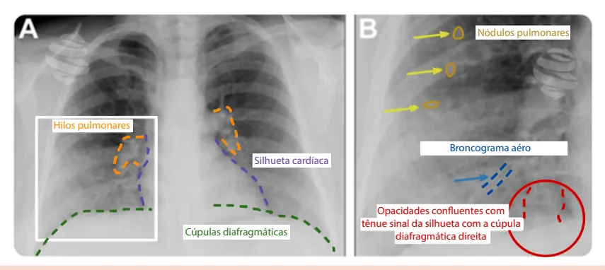
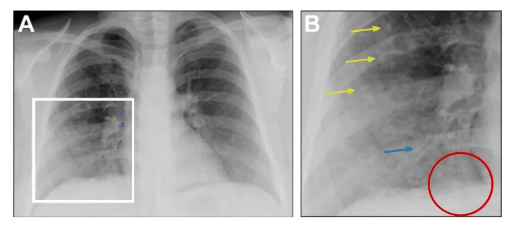
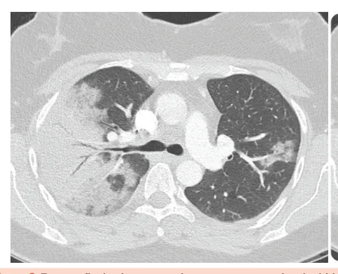
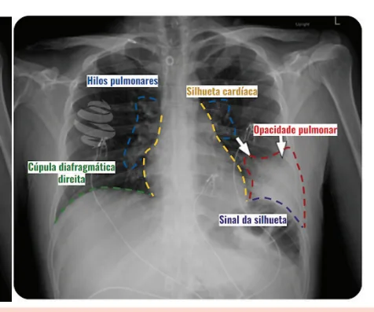
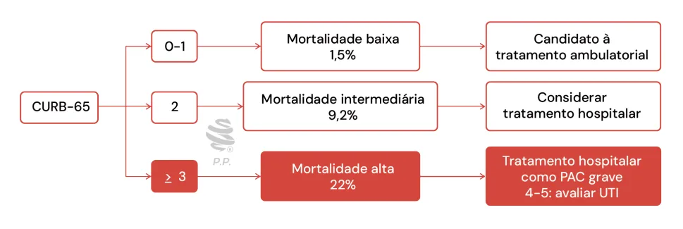
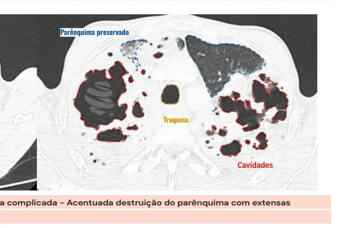
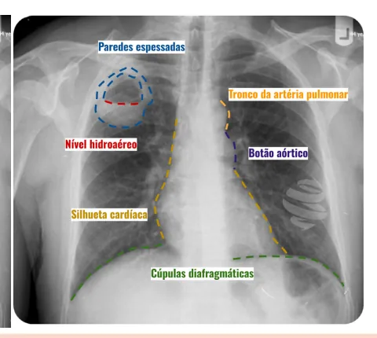

# Pneumonia Adquirida na Comunidade

<!-- page:1 -->

## PNEUMONIA ADQUIRIDA

## NA COMUNIDADE

Pneumonia Adquirida na Comunidade PAC (CM) INTRODUÇÃO

- Definição: doença pulmonar inflamatória que acomete bronquíolos e alvéolos, pode ser causada por bactérias, vírus e fungos.

- Principais agentes: típicos (pneumococo), atípicos, vírus

- Clínica: tosse + outros sintomas respiratórios + sintomas sistêmicos Clínica Exame Físico Infiltrado radiográfico novo

## DIAGNÓSTICO TRATAMENTO

- Avaliar o CURB-65: Confusão mental; Ureia > 50 mg/dL; Frequência Respiratória > 30 irpm; (Blood pressure) PAS < 90 mmHg ou PAD < Idade (years) ≥ 65 anos.

60 mmHg;

- 0-1 → candidato a tratamento ambulatorial

- 2 → considerar tratamento hospitalar

- ≥ 3 → tratamento hospitalar como PAC grave 4-5 → avaliar UTI

## DEFINIÇÕES

- Doença pulmonar inflamatória que acomete bronquíolos e alvéolos.

- Pode ser causada por bactérias, vírus, fungos e mais raramente micobactérias.

- Pneumonia adquirida na comunidade: adquirida fora do ambiente hospitalar ou em até 48 horas da admissão hospitalar Pneumonia hospitalar (ou nosocomial): ≥ 48 horas após admissão hospitalar Pneumonia associada à ventilação mecânica: ≥ 48 horas após IOT Pneumonia associada a assistência a saúde: não incluído nos últimos guidelines

## PRINCIPAIS AGENTES

## TÍPICOS

- Streptococcus pneumoniae (Pneumococo);

- Haemophilus influenzae;

- Moraxella catarrhalis;

- Staphylococcus aureus;

- Bactérias aérobias gram negativas;

- Estreptococos grupo A;

- Anaeróbios (cavidade oral). Terapia antimicrobiana

- Sem comorbidades, sem uso recente de sem contraindicações ou história de alergia, monoterapia com: Amoxicilina Amoxicilina + Clavulanato Macrolídeo

ATB, sem fator de risco para resistência,

- Com comorbidades, com uso recente de ATB, com fator de risco para resistência: ß-lactâmico + macrolídeo Moxifloxacino ou levofloxacino ou gemifloxacino

- Com indicação de internação hospitalar em enfermaria: Cefalosporinas de terceira geração (ceftriaxona ou cefotaxima) + macrolídeo; Ampicilina/sulbactam + macrolídeo; Cefalosporinas de terceira geração (ceftriaxona ou cefotaxima) ou amoxicilina com clavulanato; Levofloxacino ou moxifloxacino ou gemifloxacino em monoterapia.

- Com indicação de internação em UTI: Evitar monoterapia → combinação de terapias endovenosas.

## ATÍPICOS

- Legionella spp;

- Mycoplasma pneumoniae;

- Chlamydophila pneumoniae;

- Chlamydia psittaci;

- Coxiella burnetti.

## OUTROS

- Vírus

- MRSA: pneumonia necrosante de rápida evolução. MRSA-CA: pacientes jovens, lesões de pele, esportes de contato, drogas injetáveis; Principal fator de risco: colonização ou infecção prévia; Outros fatores de risco: uso recente de ATB,

Influenza e empiema.

- Pseudomonas aeruginosa: causa incomum de PAC.

- Principal fator de risco: colonização ou infecção prévia;

- Também pode acometer pacientes com doença estrutural pulmonar, hospitalização recente e uso de ATB.

## QUADRO CLÍNICO

- Variável: quadros leve até muito graves – sepse / choque séptico.

---

<!-- page:2 -->

## DIAGNÓSTICO

- Pulmonar: Doença aguda do trato respiratório inferior; Tosse;

- Envolve quadro clínico, exame físico e infiltrado Expectoração; radiográfico novo. Dispneia; Dispneia; Dor torácica pleurítica. I

- Sistêmico R Febre; Sudorese / Calafrios; Cefaleia; Mialgias / artralgias; Prostração; Delirium.

## EXAME FÍSICO

- Expansibilidade torácica reduzida;

- Frêmito toraco-vocal aumentado;

- Submacicez ou macicez à percussão;

- Estertores crepitantes;

- Broncofonia aumentada.

- Taquipneia;

- Desconforto respiratório;

- Hipotensão, taquicardia, rebaixamento do nível de consciência em casos graves.

Hilos pulmonares Silhueta cardí Cúpulas diafragmáticas Figura 1: Radiografia de tórax de paciente com pneumonia adquirida n mais evidente na região medial, inclusive com tênue sinal da silhueta ( se ainda pequenos nódulos pulmonares e aparente espessamento pa INFILTRADO RADIOGRÁFICO NOVO RX de tórax

- Parte da tríade propedêutica inicial

- AP + Perfil: diagnóstico, prognóstico e evolução da pneumonia: Diagnósticos diferenciais: abscesso, tuberculose, massa; Avaliação de extensão: multilobar ou derrame pleural.

- Não deve ser utilizado para supor agente etiológico;

- Não deve ser usado para avaliação de cura: Melhora radiográfica ocorre em 4 semanas (média).

- Verificar Figura 1 íaca tênue sinal da silhueta com a cúpula diafragmática direita na comunidade - Observa-se opacide na base pulmonar direita,

Nódulos pulmonares Broncograma aéro Opacidades confluentes com (perda da definição) com a cúpula diafragmática direita. Notamarietal brônquico.

---

<!-- page:3 -->

Figura 2: Radiografia de tórax de paciente com pneumonia adquirida na comunidade - Opacidade pulmonar no campo pulmonar inferior esquerdo determinando sinal da silhueta com a cúpula diafragmática esquerda e obliteração do seio costofrênico deste lado.

Figura 3: Tomografia de tórax em paciente com pneumonia adquirida na comunidade Presença de consolidação extensa associada a broncograma aéreo.

Figura 4: Tomografia de tórax de paciente com pneumonia adquirida na comunidade Presença de broncograma aéreo TC de tórax | Casos de dúvida diagnóstica: obesos,

- Método mais sensível para avaliação do acometimento imunossuprimidos, com alterações do parênquima: radiológicas prévias; Custo e radiação são limitantes. | Detecção de complicações, como empiema; Não deve ser realizada de rotina. | Avaliação de diagnósticos diferenciais.

- Indicado principalmente para:

- Verificar Figura 3

---

<!-- page:4 -->

## OUTROS EXAMES COMPLEMENTARES CLASSIFICAÇÃO

- Exames laboratoriais Mais comum: leucocitose com desvio à esquerda; ESCORES DE GRAVIDADE Aumento de ureia / creatinina: pior prognóstico.

- Após diagnóstico = avaliação quanto à

- PCR e procalcitonina gravidade a doença PAC é uma condição com intensa | Auxiliam no prognóstico; Não devem ser usados de forma isolada para | Auxiliam na escolha do(s) antimicrobiano(s).

resposta inflamatória; | Guiam decisão do local de tratamento; decisões terapêuticas, devem ser interpretados em

- Quais? meio ao contexto clínico do paciente. | PSI-PORT;

Investigação etiológica? | CURB-65 / CRB-65;

- Realizar em casos graves e/ou não respondedores à | ATS/IDSA 2007; Cultura de escarro e/ou traqueal PSI-PORT Hemoculturas

terapia empírica inicial. | SMART-COP.

- Mortalidade em 30 dias Testes para vírus respiratórios

- Subestima em pacientes jovens e sem comorbidades; Testes moleculares z + acurácia;

- Teste antígeno urinário para Pneumococo; z + difícil para calcular – ferramentas específicas.

- Teste molecular para Legionella spp.

- Verificar Tabela 1

Tabela 1: Ítens avaliados no escore PSI-PORT para avaliação de mortalidade em 30 dias na PAC

## PSI-PORT+

Idade + idade FR ≥ 30 +20 Sexo feminino -10 PAS < 90 mmHg +20 Casa de repouso +10 Temp < 35 ou > 39,9 oC +15 Neoplasia +30 FC ≥ 125 bpm +10 Doença hepática +20 pH < 7,35 +30 IC +10 Ureia > 50 mg/dL +30 Doença cerebrovascular +10 Sódio < 130 mg/dL +20 Doença renal +10 Glicemia ≥ 250 mg/dL +10 Doença pleural +10 PaO2 < 60 mmHg +10 Alteração do nível de +20 Hematócrito < 30% +10 consciência Tabela 2: Escore PSI-PORT para avaliação de mortalidade em 30 dias na PAC

Classe Pontos Mortalidade % Local l - 0,1 Ambulatório ll ≤ 70 0,6 Ambulatório Ambulatório ou lll 71-90 2,8 internação breve lV 91-130 8,2 Internação V > 130 29,2 Internação

---

<!-- page:5 -->

Figura 5: Mortalidade e conduta segundo valores do CURB-65 CURB-65: | Macrolídeo

- Variáveis das quais deriva seu nome (em inglês): | ATS/IDSA (2007): Doxiciclina monoterapia Confusão mental; como opção Ureia > 50 mg/dL;

- Em caso de alergia a penicilina Frequência Respiratória > 30 irpm; | Cefalosporina 3ª geração + macrolídeo (Blood pressure) PAS < 90 mmHg ou PAD < ou + doxiciclina

60 mmHg;

- Com comorbidades, com uso recente de ATB, com Idade (years) ≥ 65 anos. fator de risco para resistência:

- Simplicidade, aplicabilidade, facilidade | ß-lactâmico + macrolídeo

- Não inclui avaliação de comorbidades | Moxifloxacino ou levofloxacino ou gemifloxacino

- Verificar Figura 5

- Com indicação de internação hospitalar

CRB-65: em enfermaria:

- Versão sem ureia; | Cefalosporinas de terceira geração (ceftriaxona ou

- Pode ser utilizada em locais com pouca cefotaxima) + macrolídeo;

disponibilidade de recursos laboratoriais ou na | Ampicilina/sulbactam + macrolídeo; atenção primária; | Cefalosporinas de terceira geração (ceftriaxona ou

- O escore é o fator preponderante para internação, cefotaxima) ou amoxicilina com clavulanato; Viabilidade do uso de medicação via oral; em monoterapia. Comorbidades associadas;

mas outros fatores devem ser levados em conta como: | Levofloxacino ou moxifloxacino ou gemifloxacino

- Com indicação de internação em UTI, sem fatores Fatores psicossociais; de risco: Condições socioeconômicas; | Evitar monoterapia → combinação de SpO2 < 92%. terapias endovenosas. Cefalosporinas de terceira geração (ceftriaxona ou

## TRATAMENTO

cefotaxima) + macrolídeo | Ampicilina/sulbactam + macrolídeo TEMPO DE TRATAMENTO | Cefalosporinas de terceira geração (ceftriaxona ou

- Sempre baseada na resposta clínica do paciente; cefotaxima) + quinolona respiratória

- Em geral: mínimo 5 dias;

- Suspender quando 48 horas afebril; PAC HOSPITALAR EM SITUAÇÕES ESPECIAIS

- Manter por 7 dias nos casos moderados; MRSA

- Pacientes com doenças estruturais ou casos graves →

- Choque séptico;

estendido 14 dias.

- IRpA com ventilação mecânica;

- Procalcitonina: pode ser usada para auxiliar na decisão

- Cocos gram positivos em amostra de escarro;

de suspender.

- Colonização prévia;

- ATB IV < 3 meses;

## TERAPIA ANTIMICROBIANA

- Pneumonia necrotizante;

- Levar em conta o local de aquisição, fatores de risco

- Empiema;

individuais e doenças associadas, além dos escores

- Fatores de risco para colonização:

de gravidade. | DRC dialítica;

- Sem comorbidades, sem uso recente de ATB, sem | HSH;

fator de risco para resistência, sem contraindicações | Privação de liberdade; ou história de alergia, monoterapia com: | Uso de drogas injetáveis;

| Amoxicilina | Esportes de contato. | Amoxicilina + Clavulanato

---

<!-- page:6 -->

Pseudomonas | PAC grave com necessidade de

- Bacilo gram negativo em amostra de escarro; ventilação mecânica;

- Colonização prévia; | PAC grave com hipoxemia grave (PaO2/FiO2 < 300).

- Infecção prévia;

- CAPE-COD: hidrocortisona 200mg 4 – 7 dias

- ATB IV < 3 meses;

## COMPLICAÇÕES

- Doença estrutural pulmonar;

- DPOC com exacerbações frequentes.

Pneumonia Aspirativa

- Sepse / choque séptico;

- Preocupação sobre o papel dos anaeróbios;

- Derrame pleural parapneumônico Indicado cobrir se presença de abscesso, paciente | Não complicado;

etilista ou com dentes em péssimo estado de | Complicado, com necessidade de conservação, presença de escarro pútrido ou drenagem torácica.

pneumonia necrotizante.

- Infecção loculada

- Tratamento domiciliar: amoxicilina + clavulanato; | Empiema;

- Tratamento hospitalar: ceftriaxona + clindamicina; | Pneumonia necrotizante; Opções: metronidazol, piperacilina-tazobactam | Abscesso pulmonar.

- Verificar Figura 6

## CORTICOIDE SISTÊMICO

- Redução da resposta inflamatória e do dano alveolar, da síndrome do desconforto respiratório agudo e morte; indicado nas seguintes situações:

Figura 6: Radiografia de tórax de paciente com abscesso pulmonar (imagem de paredes espessadas e nível hidroaéreo no campo pulmonar superior direito.

(cid:31)(cid:30)(cid:29)(cid:28)(cid:27)(cid:30)(cid:27)(cid:26)(cid:25) Figura 7: Tomografia de tórax de paciente com pneumonia complicada - Acentuada destruição do parênquima com extensas cavidades.

---

<!-- page:7 -->

## REFERÊNCIAS

Figura 4: Tomografia de tórax de paciente com pneumonia adquirida na comunidade Figura 1: Radiografia de tórax de paciente com pneumonia Presença de broncograma aéreo adquirida na comunidade Radiopaedia.com Figura 6:

Radiographic Imaging of Community-Acquired Pneumonia: A Case-Based Review. Infect Dis Clin N Am 2024 Pulmonary Infection. Clin Chest Med 2024 Figura 2: Radiografia de tórax de paciente com pneumonia adquirida na comunidade Radiographic Imaging of Community-Acquired Pneumonia: A Case-Based Review. Infect Dis Clin N Am 2024 Pulmonary Infection. Clin Chest Med 2024 Figura 3: Tomografia de tórax em paciente com pneumonia adquirida na comunidade Presença de consolidação extensa associada a broncograma aéreo Radiopaedia.com Figura 6: Radiografia de tórax de paciente com abscesso pulmonar Radiopaedia.com Figura 7: Tomografia de tórax de paciente com pneumonia complicada Radiopaedia.com
