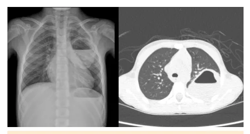

# Pneumonias

<!-- page:1 -->

> ⚠️ Este material teve páginas de duas colunas com texto intercalado; o conteúdo abaixo foi reorganizado por assunto usando o contexto clínico. Confira contra a fonte original em caso de dúvida.

## Pneumonia Comunitária — Resumo

### Critérios de Gravidade (AIDPI x OMS)

> ⚠️ Tabela reconstruída a partir de OCR — confira contra a fonte original.

| Classificação | Critérios |
|---|---|
| **AIDPI — Pneumonia** | Taquipneia |
| **AIDPI — Pneumonia grave** | Taquipneia com tiragem subcostal ou estridor em repouso |
| **OMS-2013 — Pneumonia** | Tosse ou dificuldade para respirar com SpO2 < 90% ou cianose central |
| **OMS-2013 — Pneumonia grave** | Gemência, tiragem torácica grave |
| **OMS-2013 — Pneumonia com sinais gerais de perigo** | Impossibilidade de mamar ou ingerir líquidos, letargia ou rebaixamento do nível de consciência, convulsões |

> **Atenção**: OMS não considera que a tiragem subcostal seja um indicador de hospitalização, mas o AIDPI e a SBP ainda trazem essa recomendação em seus documentos.

- **Pneumonia complicada**: PAC associada a derrame parapneumônico ou abscesso pulmonar. **Empiema**: presença macroscópica de pus, gram positivo na bacterioscopia, glicose < 40 mg/dL, proteína > 30 g/L, LDH ≥ 1000, pH < 7,2.

### Etiologia

- Crianças < 5 anos: lembrar da etiologia viral, Pneumococo / *S. aureus*;
- Pneumonia afebril do lactente: *Chlamydia trachomatis*;
- Pneumonia atípica (> 5 anos): *Mycoplasma pneumoniae*, *Chlamydophila pneumoniae*.

### Tratamento por Gravidade

> ⚠️ Tabela reconstruída a partir de OCR — confira contra a fonte original.

| Gravidade | Ambulatorial | Grave | Muito Grave | Necrosante |
|---|---|---|---|---|
| Esquema | Amoxicilina 50 mg/kg/dia OU Penicilina cristalina | Ceftriaxona OU Cefotaxima; se suspeita de MRSA associar Vancomicina | Ceftriaxona OU Cefotaxima + Vancomicina + Azitromicina | Ceftriaxona OU Cefotaxima OU Cefepime + Vancomicina; avaliar abordagem cirúrgica |
| Abordagem cirúrgica | — | Considerar drenagem pleural simples se empiema | Toracocentese (linezolida/clindamicina) | Se área de necrose extensa: VTCA ou toracoscopia |
| Observações | Pneumonia em < 2 meses: Ampicilina + aminoglicosídeo | Suspeita de M. pneumoniae ou C. pneumoniae: associar macrolídeo ou levofloxacino | — | — |

> **Atenção**: tratamento preconizado pela SBP. Apesar da divisão em casos graves e muito graves, a SBP não caracteriza quais são os critérios utilizados para cada uma dessas classificações.

### Critérios de Internação

- Menores de 3 meses;
- Hipoxemia (< 92%);
- Desidratação ou baixa ingesta hídrica;
- Desconforto respiratório moderado ou importante;
- Toxemia;
- Doença de base que contribui com gravidade (ex.: cardiopatia, broncodisplasia);
- Presença de complicação (derrame, empiema, pneumonia necrosante, abscesso);
- Refratariedade às medidas iniciais e falta de resposta terapêutica em 48 a 72h.

### Prevenção

- Imunização — Hib (Pentavalente) / Pneumocócica.

---

<!-- page:2 -->

## Introdução

- Principal causa de morbimortalidade em crianças no mundo todo;
- Causa mais comum de morte em criança < 5 anos.

**Definição de pneumonia complicada**: pneumonia associada a derrame parapneumônico (DPP), empiema pleural (EP), pneumonia necrosante ou abscesso pulmonar.

## Fatores de Risco

- Desnutrição;
- Baixa idade;
- Comorbidades;
- Baixo peso ao nascer;
- Pneumonias prévias;
- Ausência de aleitamento materno;
- Vacinação incompleta;
- Infecções virais respiratórias.

> **Lembrar**: taquipneia varia com a faixa etária!
> - < 2 meses: FR ≥ 60 irpm
> - 2-11 meses completos: FR ≥ 50 irpm
> - 1-4 anos completos: FR ≥ 40 irpm
> - > 5 anos: FR ≥ 20 irpm

## Quadro Clínico

- FR alterada: sinal de maior **SENSIBILIDADE**!
- Tosse;
- Presença de sinais de desconforto respiratório;
- Pode apresentar: febre alta ou hipotermia, recusa ao seio materno/alimentação, alterações de nível de consciência e irritabilidade. Menos característico, mas pode ter sibilância ou estridor associado.

## Critérios de Gravidade

- **Grave**: derrame pleural em que apenas ATB não é suficiente para o tratamento (pH baixo — pH < 7, maior risco de septação / glicose baixa e DHL elevado);
- **Muito grave**: choque, necessidade de VM, admissão em UTI.

**Outras definições de pneumonia grave:**
- **AIDPI**: presença de tiragem ou estridor em repouso;
- **OMS**: tosse ou dificuldade para respirar com SpO2 < 90% ou cianose central; cansaço respiratório grave (gemência, tiragem torácica muito grave); pneumonia com sinais gerais de perigo (impossibilidade de mamar ou ingerir líquidos, letargia ou rebaixamento do nível de consciência, convulsões).
- **Atenção**: OMS não considera que a tiragem subcostal seja um indicador de hospitalização, mas o AIDPI e a SBP ainda trazem essa recomendação em seus documentos.

## Complicações

**Sistêmicas**
- Sepse, choque séptico, embolização infecciosa, falência de múltiplos órgãos, PARDS (síndrome do desconforto respiratório agudo pediátrico), coagulação intravascular disseminada (CIVD), óbito.

**Derrame pleural**: é a manifestação mais comum da PAC complicada. 3 estágios: exsudativo (simples), fibrinopurulento (complicado) e a fase de organização. EP é usado genericamente para descrever estágio avançado de DPP.

**Características de um empiema**: pus; identificação da bactéria no Gram; glicose < 40 mg/dL; proteína > 30 g/L; pH < 7,2; LDH ≥ 1.000 (lesão do parênquima).

**Pneumonia necrosante**: antibioticoterapia (ATB) há pelo menos 72h e sem melhora → procurar locais extrapulmonares de infecção como pele e partes moles ou músculo-esquelético. Podem deteriorar muito rápido para choque séptico, insuficiência de múltiplos órgãos e insuficiência respiratória hipoxêmica. Principais agentes: pneumococo, *Staphylococcus aureus* e *Streptococcus pyogenes*.

**Abscesso pulmonar**: parede espessada + nível hidroaéreo.

Figura 1: Raio-X e TC de tórax demonstrando abscesso pulmonar.

## Diagnóstico

### Anamnese Detalhada e Exame Físico

- Nos casos de insuficiência respiratória, deve-se lembrar de diagnósticos diferenciais como bronquiolite viral aguda (BVA) e asma (sibilância na pneumonia não é comum);
- Quadro clínico compatível é suficiente.

### Laboratório

- **Hemograma**: pouco específico, em geral apresenta-se com leucocitose, mas sem diferenciar etiologia bacteriana x viral;
- **Provas inflamatórias**: podem auxiliar no acompanhamento, mas não diferenciam etiologia bacteriana x viral. Pró-calcitonina (PCT) não deve ser realizada de rotina.

---

<!-- page:3 -->

- **PCT < 0,25 ng/mL** = baixa probabilidade de PAC bacteriana ou PAC de menor gravidade → alto valor preditivo negativo para pneumonia pneumocócica.
- **Hemocultura (HMC)**: realizar na indicação de internação. Difícil isolamento, mais facilmente identificado em líquido pleural.
- Realizar pesquisa viral em secreção respiratória sempre que possível.
- **Testes sorológicos**: pode ser útil para *M. pneumoniae*, *C. pneumoniae* e Pneumococo, mas títulos pareados (fase aguda e convalescença) → diagnóstico retrospectivo.
- **Líquido pleural**, como coloração de Gram, cultura e outros testes de detecção como PCR, são úteis no estabelecimento do agente etiológico. Líquido pleural oferece o melhor rendimento.

### Imagem

- **Radiografia de tórax**: não deve ser realizada de rotina para o diagnóstico em crianças sem sinais de gravidade e sem necessidade de internação. Realizar se: dúvida diagnóstica (se normal, não exclui a doença); hipoxemia; desconforto e sinais de gravidade; ausência de resposta ao tratamento em 48-72h; paciente hospitalizado → realizar PA e perfil, para diagnóstico de complicações. Não deve ser utilizado como controle após o tratamento.
- **Ultrassonografia (USG) pulmonar**: tem um baixo custo e não possui radiação.
- **Tomografia (TC) de tórax**: apenas se suspeita de complicações.

## Etiologia

### Vírus

- Os vírus são os principais agentes (90% até 1 ano / 50% em escolares);
- Maior incidência: vírus sincicial respiratório (VSR);
- Outros: influenza, parainfluenza, adenovírus, rinovírus, metapneumovírus, bocavírus, SARS-CoV-2.

### Bactérias

- Costumam ser mais graves;
- **Pneumococo** é o principal agente — importante!
- Outras: estreptococos do grupo A; *S. aureus*; *H. influenzae*; *M. catarrhalis*;
- Pensar em *S. aureus* se descrição de porta de entrada, lesão de pele etc.;
- **Pneumonias atípicas**: *Mycoplasma pneumoniae* é o agente mais importante (10-40% das PAC e 15-18% das internações por PAC).

### Etiologia por Faixa Etária

> ⚠️ Tabela reconstruída a partir de OCR — confira contra a fonte original.

| Faixa Etária | Principais Agentes |
|---|---|
| **Período neonatal** | Estreptococos do grupo B: clínica de sepse precoce, pneumonia grave, bilateral, difusa. Enterobactérias também são agentes importantes: *E. coli*; *Klebsiella sp*; *Proteus sp* → infecção nosocomial, geralmente > 7 dias de vida. *Listeria monocytogenes*: sepse neonatal precoce. Citomegalovírus (CMV): outros sinais de infecção congênita. |
| **1 a 3 meses** | VSR: pico nos 2-7 meses; rinorreia, sibilância e apresenta sazonalidade. Parainfluenza: semelhante ao VSR em crianças maiores. *Chlamydia trachomatis*: infecção genital materna, causando quadro afebril, subagudo, com infiltrado intersticial. *Streptococcus pneumoniae*: causa mais comum de pneumonia bacteriana. *S. aureus*: frequentemente mais grave e complicada, sendo um agente relacionado a pneumatoceles, abscesso e derrame pleural. *Bordetella pertussis*: pensar em quadros mais graves → cianose, vômitos, tosse em salvas, guincho respiratório. |
| **4 meses – 5 anos** | Adenovírus, rinovírus → ainda são a causa mais frequente nessa faixa etária. *S. pneumoniae*: causa mais comum de pneumonia bacteriana. *S. aureus* para diagnóstico de complicações. *H. influenzae* tipo B: em desaparecimento devido ao uso da vacina. O *H. influenzae* não tipável é pouco frequente em PAC, podendo acometer imunodeprimidos. Vírus respiratórios: VSR, parainfluenza, influenza. |
| **5-15 anos** | *S. pneumoniae*: causa mais comum de pneumonia bacteriana. *M. pneumoniae*: crianças mais velhas desse grupo, causa frequente com apresentação radiológica variável. *C. pneumoniae*: crianças mais velhas e adolescentes. *M. tuberculosis*: maior incidência na adolescência e na gravidez; avaliar a exposição a paciente bacilífero, se há ausência de resposta ao tratamento para os agentes comuns. |

> **Atenção**: pacientes com HIV, lembrar de infecção por *Pneumocystis jirovecii*!

## Prevenção — Vacinação

- **SUS – PNI – Antipneumocócica 10**: após a implantação da PCV10 na rede pública em 2010, houve aumento de colonização nasofaríngea por sorotipos de pneumococo não contidos na vacina.
- Lembrar que há pneumo 13 e pneumo 23 na rede pública para situações especiais nos CRIEs. Na rede privada, disponível: pneumo 13, pneumo 15 e pneumo 20.
- **SUS – PNI – Vacina anti-*Haemophilus influenzae* B**: implantada no Brasil em 1999, gerou grande diminuição dos casos de PAC por este agente.

---

<!-- page:4 -->

## Tempo de Antibioticoterapia

- Duração na pneumonia não complicada: **5 a 7 dias**;
- Duração na pneumonia complicada: **3 a 4 semanas**;
- Reavaliar em 48-72 horas.

## Falha Terapêutica

- Derrame / empiema pleural, pneumonia necrosante e abscesso pulmonar;
- Outros agentes não cobertos: vírus, bactérias atípicas, primeira manifestação de tuberculose;
- Não cumprimento do tratamento com ATB proposto: dose, intervalo e tempo;
- Doença de base: imunossupressão, fibrose cística, asma, desnutrição, bronquiectasias não relacionadas à fibrose cística;
- Ocorrência de quadros diferenciais: aspiração de corpo estranho, malformações pulmonares (ex.: sequestro pulmonar), hérnia diafragmática.

## Tratamento de Acordo com a SBP

- **Antibioticoterapia empírica**: amoxicilina → primeira opção para tratamento ambulatorial;
- **Pneumonia sem tiragem subcostal**: tratamento ambulatorial com amoxicilina oral **50 mg/kg/dia**, duas a três vezes ao dia por 7 dias;
- **Pneumonia em < 2 meses**: ampicilina **150-200 mg/kg/dia** de 6/6h + aminoglicosídeo (amicacina 15 mg/kg/dia de 12/12h);
- **Derrame pleural e bom estado geral**: penicilina cristalina **200.000-250.000 UI/kg/dia**, de 6/6h ou 4/4h, OU ampicilina; avaliar abordagem cirúrgica (toracocentese ou drenagem pleural simples);
- **Grave**: ceftriaxona **50-100 mg/kg/dia** de 12/12h ou cefotaxima **150 mg/kg/dia** de 8/8h ou 6/6h; na suspeita de MRSA, associar vancomicina 40-60 mg/kg/dia, de 6/6h ou 8/8h. Opção: na suspeita de MRSA, pode-se deixar terapia única com ceftarolina;
- **Muito grave**: ceftriaxona ou cefotaxima + vancomicina + azitromicina **10 mg/kg/dia** nos dois primeiros dias, seguida de **5 mg/kg/dia** nos dias seguintes;
- **Necrosante**: ceftriaxona ou cefotaxima ou cefepime **150 mg/kg/dia** de 8/8h + vancomicina + avaliar abordagem cirúrgica (drenagem de tórax simples, se empiema; videotoracoscopia ou toracoscopia, se necrose extensa).

> **Atenção**: tratamento descrito é o preconizado pela SBP, diretriz mais atualizada no Brasil. Apesar da divisão em casos graves e muito graves, a SBP não caracteriza quais são os critérios utilizados para cada uma dessas classificações. Portanto, essa divisão em gravidade para direcionar tratamento é feita pela SBP e **NÃO** se refere à divisão clínica de critérios de gravidade feita pela OMS.

## Realmente Ainda Há Espaço para Penicilina no Tratamento da Pneumonia por Pneumococo?

- **SIREVA** (Sistema de Redes de Vigilância dos Agentes Responsáveis por Pneumonias e Meningites Bacterianas) monitora os sorotipos de pneumococo associados à doença pneumocócica invasiva. Através dele, notamos o sucesso da implementação dos subtipos vacinais, mas predomínio de doença pneumocócica causada por sorotipos não incluídos na vacina Pneumo 10, desde 2010, no PNI. Há controle de outros sorotipos não incluídos na vacina do PNI, principalmente 19A, 6C e 3.
- Por meio desse monitoramento, além de sabermos dessa substituição de sorotipos, é possível avaliar perfil de sensibilidade. Considera-se, pelo método padrão utilizado atualmente no Brasil (BrCAST), as seguintes concentrações inibitórias mínimas (CIM) para penicilina:
  - CIM ≤ 0,06 mg/mL = suscetível;
  - CIM 0,125 a 2 mg/mL = suscetível, aumentando exposição em gravidade;
  - CIM ≥ 4 mg/mL = resistente.

**Tabela 1: Diferentes vacinas antipneumocócicas disponíveis no Brasil**

> ⚠️ Tabela reconstruída a partir de OCR — confira contra a fonte original.

| Vacina | Sorotipos incluídos |
|---|---|
| **VPC10** | 1, 4, 5, 6B, 7F, 9V, 14, 18C, 19F, 23F |
| **VPC13** | VPC10 + 3, 6A, 19A |
| **VPC15** | VPC13 + 22F, 33F |
| **VPC20** | VPC15 + 8, 10A, 11A, 12F, 15B |

**Legenda**: diferentes formulações da vacina pneumocócica conjugada disponíveis no Brasil com os respectivos sorotipos incluídos em cada uma delas. Lembrando que no PNI está disponível a pneumocócica 10 (VPC10) e nos centros de referência de imunobiológicos especiais (CRIE) está disponível a pneumocócica 13 (VPC13), indicada para situações específicas. Além disso, há a pneumocócica 23 disponível nos CRIEs, também indicada para situações específicas, porém é vacina de outra plataforma, polissacarídica (as demais são conjugadas). Abordaremos mais detalhes na aula de vacinação.

---

<!-- page:5 -->

- Pelo perfil do SIREVA, em 2024, encontrou-se, para crianças < 5 anos, **33,3%** de cepas de pneumococo resistentes à penicilina, ou seja, CIM ≥ 4 mg/mL. O que nos leva a questionar o uso da penicilina para tratamento de doença pneumocócica invasiva **NÃO MENÍNGEA**;
- Apesar disso, por estudos de farmacocinética, sabe-se que apenas cepas com CIM ≥ 8 mg/mL são, de fato, resistentes nas doenças invasivas por pneumococo (não meníngeas);
- Portanto, nas cepas de pneumococo, mesmo com CIM até 4 mg/mL, pode-se usar penicilina em **doses elevadas**, com sucesso, no tratamento de pneumonia não grave.

## Critérios de Internação

- Menores de 3 meses;
- Hipoxemia (< 92%);
- Desidratação ou baixa ingesta líquida via oral;
- Desconforto respiratório moderado ou grave;
- Toxemia/Sepse;
- Doença de base que contribui com gravidade (cardiopatia, broncodisplasia);
- Presença de complicações (derrame, empiema, necrotizante, abscesso);
- Refratariedade às medidas iniciais e falta de resposta terapêutica em 48 a 72h.

## Pneumonia Atípica

- **Idade**: crianças > 5 anos;
- **Agente etiológico**: *Mycoplasma pneumoniae*, *Chlamydia pneumoniae*;
- **Quadro clínico**: arrastado (evolução varia de 7 a 21 dias, podendo se estender); mal-estar, cefaleia, odinofagia; tosse seca à tosse produtiva; tosse mais intensa nas duas primeiras semanas de doença; sintomas são mais importantes que os sinais clínicos ao exame físico; manifestações extrarrespiratórias: artralgia, lesões de pele;
- Pode-se utilizar para diagnóstico sorologia específica para *Mycoplasma pneumoniae* e para *Chlamydia pneumoniae* (ambas IgM e IgG);
- **Raio-X**: infiltrados peri-hilares ou reticulonodulares localizados, consolidação lobar ou segmentar;
- **Tratamento**: macrolídeo — azitromicina **10 mg/kg/dia** uma vez ao dia no primeiro dia e **5 mg/kg/dia** uma vez ao dia por 4 dias; claritromicina **15 mg/kg/dia**, em duas doses diárias, por 10 dias.

## Pneumonia Afebril do Lactente

- **Agentes**: *C. trachomatis*; *U. urealyticum*; outros: *Mycoplasma hominis*/CMV;
- **Quadro clínico**: ocorre entre 2 semanas e 3-4 meses de vida; nascidas de parto vaginal de mães contaminadas; história de conjuntivite associada; quadro respiratório arrastado de tosse frequente, podendo ou não gerar taquidispneia + afebril/subfebril; pode também simular o primeiro quadro viral das crianças;
- **Exames complementares**: hemograma — eosinofilia; radiografia — infiltrados peri-hilares ou reticulonodulares localizados, consolidação lobar ou segmentar;
- **Tratamento**: macrolídeos.

## Referências

Figura 1: Raio-X e TC de tórax demonstrando abscesso pulmonar. Acervo próprio.
