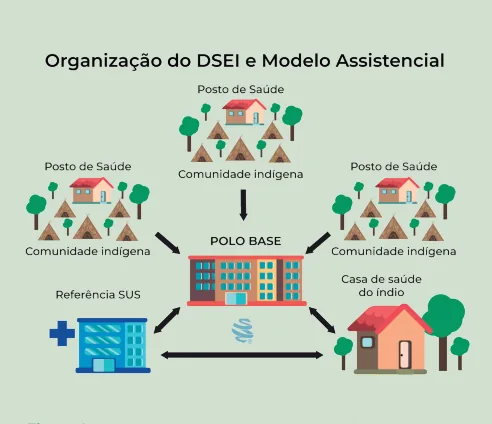
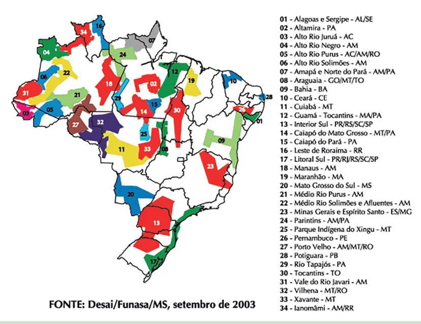

# Políticas Públicas de Saúde I - Populações Especiais

<!-- page:1 -->

## POLÍTICAS PÚBLICAS DE SAÚDE I

## POPULAÇÕES ESPECIAIS

Politicas Específicas de Saúde em Populações Vulneráveis; SAÚDE INDÍGENA (SASISUS) – LEI Nº 9.836/1999 Política Nacional de Atenção à Saúde dos Povos Indígenas (PNASPI)

- Atenção integral respeitando a cultura e práticas tradicionais.

- Organização por DSEI e Pólos-Base.

- Equipes multidisciplinares com AIS.

- Articulação com o SUS (APS, média e alta complexidade).

- Controle social: CLSI, CONDISI, FPCONDISI.

- DSEI: Distritos Sanitários Especiais Indígenas

- Pólos-Base: Referência das comunidades dentro dos DSEI. Tipo I: localizados nas comunidades indígenas. Tipo II: urbanos, vinculados à rede municipal.

- CASAI: Apoio logístico e acolhimento em tratamentos fora da aldeia.

Figura 1: Subsistema de Atenção à Saúde Indígena. SAÚDE DA POPULAÇÃO NEGRA – PNSIPN (PORTARIA 992/2009)

Marca Política: Reconhecimento do racismo como determinante social das desigualdades em saúde. Objetivo Geral: Promover a saúde integral da população negra, priorizando a redução das desigualdades étnico-raciais, o combate ao racismo e discriminação nas instituições e serviços do SUS.

Diretrizes Principais:

- Inclusão do tema nas formações em saúde.

- Fortalecimento do Movimento Negro no controle social e valorização de saberes populares e de matriz africana.

- Monitoramento com recorte étnico-racial.

- Educação popular e comunicação antirracista. - Produção e uso de dados com o quesito cor.

Autodeclaração de Raça/Cor: Critério oficial no SUS; pode ser feita por familiares em casos de óbito, RN ou impossibilidade do usuário.

Eixos Prioritários:

- Redução de desigualdades em:

- Mortalidade materna e infantil; Violência letal;

Doença falciforme, tuberculose, HIV/Aids, hanseníase; Câncer de mama e colo do útero; Transtornos mentais e uso de substâncias

- Atenção à saúde da mulher negra (gestação, climatério, aborto).

- Redes de cuidado para mulheres negras em situação de violência.

- Ações específicas para populações quilombolas.

Controle Social:

- Participação do Movimento Negro nos Conselhos de Saúde.

- Monitoramento da equidade nas políticas públicas.

## SAÚDE DA POPULAÇÃO LGBT: PORTARIA

MS Nº 2.836/2011

- Visa garantir saúde integral, combater discriminação e reduzir desigualdades de identidade de gênero e orientação sexual no SUS.

Marca: Reconhecimento da discriminação e exclusão como determinantes sociais da saúde da população LGBTQIA+, com foco na equidade e integralidade.

Eixos Estratégicos:

1. Acesso integral à saúde com uso do nome social.

2. Promoção e vigilância com inclusão de gênero/

sexualidade nos sistemas de informação.

3. Educação permanente e popular antidiscriminatória.

4. Monitoramento com indicadores específicos.

Conceitos-chave:

- Sexo biológico ≠ identidade de gênero ≠ orientação sexual.

- Sexo biológico: Conjunto de características anatômicas, fisiológicas e cromossômicas atribuídas no nascimento (ex: genitália externa, cariótipo, padrão hormonal).

- Identidade de gênero: Vivência e identificação de gênero, podendo ou não corresponder ao sexo atribuído ao nascer (ex: cis, trans, não-binárie).

- Expressão de gênero: Modo como a pessoa se apresenta e é percebida socialmente;

não determina identidade de gênero nem orientação sexual.

- Orientação sexual/afetiva: Atração afetiva, sexual e/ou romântica por pessoas de um ou mais gêneros

(ex: hetero, homo, bi, pan, entre outros.).

- Intersexo: Pessoas cujas características

---

<!-- page:2 -->

sexuais (anatômicas, hormonais ou cromossômicas)

- Acompanhamento multiprofissional.

não se enquadram nas definições binárias de

- Hormonização: a partir de 18 anos.

masculino ou feminino.

- Cirurgias de afirmação de gênero: a partir de

- Nome social: Designação pela qual a pessoa trans 21 anos.

se identifica e deve ser respeitada em todos os

- Projeto Terapêutico Singular (PTS) obrigatório.

se identifica e deve ser respeitada em todos os registros, atendimentos e documentos do SUS, T independentemente do registro civil. C Processo Transexualizador no SUS:

- Garantir cuidado integral a travestis e transexuais no SUS: ambulatorial, hormonal e cirúrgico, com respeito à autonomia e identidade de gênero.

ASPECTOS ATRIBUÍDO Construções sociais sobre gênero D.V Figura 2: Principais definições em gênero e sexualidade SAÚDE INDÍGENA (LEI SÉRGIO P AROUCA) D Estabelece o Subsistema de Atenção à Saúde Indígena (SasiSUS) no âmbito do SUS.

## FUNDAMENTOS LEGAIS

- Lei nº 9.836/1999: Acrescenta dispositivos à Lei nº

8.080/1990, criando o Subsistema de Atenção à Saúde Indígena (SasiSUS), componente do SUS.

- Decreto nº 7.336/2010: Cria a Secretaria Especial de

Saúde Indígena (SESAI), vinculada ao Ministério da Saúde, como órgão gestor do SasiSUS.

- Portaria nº 755/2012: Dispõe sobre o controle social no SasiSUS.

- Lei nº 14.021/2020: dispõe sobre medidas emergenciais e temporárias de proteção social voltadas ao enfrentamento da Covid-19 em territórios indígenas, quilombolas, de pescadores artesanais e demais povos e comunidades tradicionais. - Projeto Terapêutico Singular (PTS) obrigatório.

Tema de atualizações recorrentes em Resoluções do Conselho Federal de Medicina

- Resolução nº 1.955/2010

- Resolução nº 2.265/2019

- Resolução nº 2.427/2025 possível função reprodutiva

OS À SEXUALIDADE Gênero designado ao nascimento Gênero (identidade/experiência) Sexo de registro civil Praticas sexuais Desejo Sexual Atração Orientação Afetiva Sentimento Romântica Relacionamento Características do corpo Genitália Ovário, testículo, útero e orgãos com Cromossomos Dependentes de hormônios Expressão de gênero Papéis sociais de gênero Estrutura de relacionamento(s)

Desejo reprodutivo/Reprodução Família/Parentalidade

## POLÍTICA NACIONAL DE ATENÇÃO À SAÚDE

## DOS POVOS INDÍGENAS (PNASPI)

- Instituída pela Portaria GM/MS nº 254/2002.

- Propósito: Garantir atenção integral à saúde dos povos indígenas, respeitando suas culturas, conhecimentos tradicionais e diversidade social e geográfica.

- Diretrizes: Organização dos serviços em DSEI e Pólos-Base. Formação de recursos humanos com enfoque intercultural. Monitoramento contínuo das ações de saúde indígena. Articulação com sistemas tradicionais de saúde. Uso racional de medicamentos. Ações específicas para situações emergenciais e vulnerabilidades. Ética em pesquisas e ações de saúde em comunidades indígenas. Promoção de ambientes saudáveis. Controle social e participação indígena em todas as etapas.

---

<!-- page:3 -->

Financiamento

- Atenção nas Aldeias: prestada diretamente pelos AIS,

- Responsabilidade principal da União. com apoio periódico das equipes multidisciplinares.

- Pode contar com complementação de Estados, Pólos-Base

Municípios e parcerias internacionais.

- Primeira referência para os Agentes Indígenas de

- Recursos adicionais em emergências e calamidades. Saúde (AIS).

- A União instituirá mecanismo de financiamento

- Para cada DSEI, podemos ter várias comunidades específico para os Estados, o Distrito Federal e os Indígenas; e várias comunidades de um mesmo DSEI atenção secundária e terciária fora dos territórios | Tipo I: Dentro das comunidades indígenas.

Municípios, sempre que houver necessidade de podem ter como referência um Polo Base indígenas. (Incluído pela Lei no 14.021, de 2020); | Tipo II: Em áreas urbanas, vinculados à rede municipal de saúde.

Dever-se-á obrigatoriamente levar em consideração

- Função: Resolver a maioria dos agravos à a realidade local e as especificidades da cultura dos saúde na APS, atuando em conjunto com as povos indígenas e o modelo a ser adotado para a equipes multidisciplinares.

atenção à saúde indígena, que se deve pautar por uma

- As demandas que não forem atendidas no grau abordagem diferenciada e global, contemplando os de resolutividade dos Pólos-Base deverão ser aspectos de assistência à saúde, saneamento básico, referenciadas para a rede de serviços do SUS, de nutrição, habitação, meio ambiente, demarcação de acordo com a realidade de cada Distrito Sanitário terras, educação sanitária e integração institucional. Especial Indígena

CASAI: Casa de Apoio à Saúde Indígena Princípios do SASISUS

- Estrutura de apoio para indígenas que precisam de

- Financiamento integral pela União, com tratamento fora da aldeia.

complementação quando aplicável.

- Funções:

- Abordagem intercultural e diferenciada, valorizando | Acolhimento de pacientes e acompanhantes.

sistemas tradicionais de saúde indígena. | Apoio logístico para consultas,

- Integração com os três níveis de atenção do SUS exames e internações.

(primária, secundária e terciária). | Assistência de enfermagem 24h, educação em

- Organização baseada em Distritos Sanitários Especiais saúde e atividades de integração cultural.

Indígenas (DSEI). Controle Social

- Descentralização, regionalização, hierarquização e

- CLSI (Conselhos Locais de Saúde Indígena):

controle social participativo. característica permanente e consultiva e é composto Distritos Sanitários Especiais Indígenas (DSEI) por representantes indígenas, com competência de

- Modelo de organização de serviços de saúde para manifestar e acompanhar as ações e os serviços de territórios etno-culturais, com base populacional, atenção à Saúde Indígena e determinantes ambientais geográfica e administrativa. nas comunidades.

- Critérios de delimitação:

- Cada Distrito Sanitário Especial Indígena (DSEI): tem População, área geográfica e perfil epidemiológico. um Conselho Distrital de Saúde Indígena (CONDISI) Relações sociais, vias de acesso e distribuição responsável por fiscalizar, debater e apresentar demográfica tradicional. políticas para o fortalecimento da saúde em suas

- Atuação: regiões. São órgãos colegiados de caráter permanente Rede de atenção primária dentro das e deliberativo e tem composição paritária em terras indígenas. relação aos usuários, ou seja, cinquenta por cento de Articulação com a rede regional do SUS para média representantes dos usuários, eleitos pelas respectivas e alta densidade tecnológica. comunidades indígenas da área de abrangência de 34 DSEI no Brasil (abrangendo todas as regiões). cada (DSEI/SESAI/ MS). São 34 CONDSI ao todo, um

- Cada DSEI executa ações de atenção primária e por DSEI.

vigilância em saúde para a população indígena do

- Fórum de Presidentes de Conselhos Distritais de território correspondente. Saúde Indígena (FPCONDISI): Com caráter consultivo,

- Equipes Multidisciplinares: médicos, enfermeiros, o Fórum de Presidentes dos Conselhos Distritais de odontólogos, auxiliares de enfermagem e agentes Saúde Indígena (FPCONDISI), assessora a SESAI em indígenas de saúde (AIS). relação à Política Nacional de Atenção à Saúde dos

- Apoio Técnico: antropólogos, educadores, Povos Indígenas (PNASPI), no âmbito do Subsistema engenheiros sanitaristas e outros especialistas. de Atenção à Saúde Indígena do Sistema Único de

- Critérios de Dimensionamento: número Saúde (SasiSUS).

de habitantes, dispersão populacional, perfil Secretaria Especial de Saúde Indígena (SESAI) epidemiológico e necessidades específicas de

- Órgão do Ministério da Saúde responsável pela gestão controle de endemias. do SasiSUS.

---

<!-- page:4 -->

## COORDENA AÇÕES, FINANCIA E SUPERVISIONA OS DSEI, GARANTINDO LOGÍSTICA

## ESTRUTURA E ARTICULAÇÃO INTERSETORIAL

Figura 3: Distribuição dos 34 DSEI no Território Brasileiro.

## SAÚDE DA POPULAÇÃO NEGRA

- Monitoramento e avaliação das ações de combate ao racismo institucional e redução das

- Política Nacional de Saúde Integral da População desigualdades raciais.

Negra (PNSIPN)

- Processos de informação e comunicação que Instituída pela Portaria no 992/2009 do Ministério desconstruam estigmas, valorizem a identidade negra da Saúde e reduzam vulnerabilidades.

## MARCA DA PNSIPN RACISMO INSTITUCIONAL

- Reconhecimento do racismo, das desigualdades

- Definido como o conjunto de práticas, normas étnico-raciais e do racismo institucional como e comportamentos discriminatórios que, determinantes sociais da saúde, com foco na intencionalmente ou não, colocam pessoas negras em promoção da equidade em saúde. desvantagem no acesso aos serviços de saúde.

- Manifesta-se por meio de omissões, estereótipos,

OBJETIVO GERAL desumanização, atendimento diferenciado e barreiras

- Promover a saúde integral da população negra, de acesso.

priorizando a redução das desigualdades étnicoraciais, o combate ao racismo e à discriminação AUTODECLARAÇÃO DE RAÇA/COR institucional nos serviços do SUS.

- O SUS adota o critério da autodeclaração (Portaria

MS nº 344/2017), em que o(a) usuário(a) define DIRETRIZES GERAIS sua raça/cor.

- Inclusão do tema racismo e saúde da população

- Em casos de recém-nascidos, óbitos ou negra na formação e educação permanente de impossibilidade por parte do usuário, a declaração é trabalhadores da saúde. feita por familiares ou responsáveis.

- Fortalecimento do Movimento Social Negro nas

- A autodeclaração remete à percepção de cada um instâncias de controle social do SUS. em relação à sua raça/cor, o que implica considerar

- Produção e disseminação de conhecimento científico não somente seus traços físicos, mas também à e tecnológico sobre saúde da população negra. origem étnico-racial, aos aspectos socioculturais e à

- Valorização e reconhecimento de saberes e práticas construção subjetiva do sujeito.

populares, incluindo aqueles preservados por religiões de matriz africana.

---

<!-- page:5 -->

## ALGUMAS ESTRATÉGIAS DE GESTÃO

- Garantir a inclusão da PNSIPN no Plano Estadual de

- Ações afirmativas e metas específicas para combate Saúde e no PPA setorial.

ao racismo institucional.

- Implantar instâncias estaduais de promoção da equidade.

- Redução das disparidades étnico-raciais nas

- Apoiar a implantação de instâncias municipais.

condições de saúde e nos agravos, considerando as

- Incluir a política na educação permanente necessidades locorregionais, sobretudo na: de profissionais. Mortalidade materna e infantil.

- Estabelecer indicadores de Violência letal. monitoramento e avaliação. Doença falciforme,

- Promover ações intersetoriais e articulação com Tuberculose, organizações governamentais e não-governamentais. HIV/Aids, Municipal Hanseníase.

- Implementar a PNSIPN no âmbito municipal. Câncer de colo uterino e mama.

- Definir e gerir recursos, pactuados na CIB. Transtornos mentais

- Coordenar, monitorar e avaliar ações locais.

- Qualificação da atenção à saúde da mulher negra

- Garantir a inclusão da PNSIPN no Plano Municipal de

(gestação, climatério, abortamento). Saúde e no PPA.

- Redes integradas para mulheres negras em situação

- Identificar necessidades da população negra de violência (sexual, doméstica, intrafamiliar). do município.

- Estabelecimento de metas específicas para a melhoria

- Implantar instâncias locais de promoção da equidade.

dos indicadores de saúde da população negra, com

- Estabelecer indicadores e mecanismos especial atenção para as populações quilombolas de monitoramento.

- Fortalecimento da atenção à saúde mental, em

- Promover educação permanente de trabalhadores especial aqueles com transtornos decorrentes do uso de saúde.

de álcool e outras droga

- Incentivar controle social e participação popular.

- Inclusão do quesito cor nos instrumentos de coleta de

- Apoiar ações de educação popular e comunicação dados nos sistemas de informação do SUS; sobre saúde da população negra.

- Educação permanente em saúde, comunicação e Controle Social educação popular antirracista.

- A PNSIPN reforça a participação popular e o controle social como instrumentos fundamentais:

RESPONSABILIDADES DAS ESFERAS DE | Conselhos de Saúde (municipais, estaduais e GESTÃO nacional) com representação do movimento negro.

Federal | Monitoramento das políticas públicas para garantia

- Implementar a PNSIPN em âmbito nacional. da equidade.

- Definir e gerir recursos orçamentários e financeiros,

## SAÚDE DA POPULAÇÃO

pactuados na CIT.

- Incluir a política no Plano Nacional de Saúde e no LGBTQIAPN+

PPA setorial.

- Coordenar, monitorar e avaliar a política em CONCEITOS-CHAVE nível nacional.

- Sexo biológico: Características anatômicas,

- Garantir a inclusão do quesito cor nos sistemas de fisiológicas e cromossômicas atribuídas no informação do SUS. nascimento (genitália externa, cariótipo, padrão

- Prestar cooperação técnica e financeira a Estados, hormonal). Pode incluir variações intersexo.

DF e Municípios.

- Identidade de gênero: Vivência interna e individual

- Apoiar a criação de instâncias de promoção da de gênero, que pode ou não corresponder ao sexo de equidade em saúde da população negra. nascimento (ex.: mulher, homem, pessoa não binária).

- Incluir a política na formação profissional e educação

- Orientação sexual: Direção do desejo afetivo e/ permanente de trabalhadores da saúde. ou sexual (heterossexual, homossexual, bissexual,

- Estabelecer indicadores e instrumentos de avaliação. pansexual etc.).

- Fortalecer a gestão participativa e o controle social.

- Importância clínica: Confundir esses conceitos gera

- Apoiar educação popular em saúde e produção de falhas no cuidado, estigmas e abandono dos serviços conhecimento sobre racismo. de saúde.

Estadual

- Sexualidade: “Um aspecto central do bem- estar

- Apoiar a implementação da política em articulação humano, que envolve sexo, identidade de gênero, com o nível federal. papéis de gênero, orientação sexual, erotismo, prazer,

- Definir e gerir recursos financeiros, pactuados na CIB. intimidade e reprodução. A sexualidade é expressa e

- Coordenar, monitorar e avaliar a política no experienciada em pensamentos, fantasias, desejos, âmbito estadual. crenças, atitudes, valores, comportamentos, práticas, papéis e/ou relacionamentos” (OMS).

---

<!-- page:6 -->

LGBTQIA+ Pessoas Intersexo

- Representa pessoas que não são cisgêneras,

- Pessoas cujas características corporais (genitália, heterossexuais, endossexo (pessoa que não é cromossomos, órgãos reprodutivos) não seguem o intersexo) e alossexuais (pessoas que sentem atração padrão binário macho-fêmea.

sexual por outras pessoas).

- Pontos-chave:

- Acrônimo: | Evitar termos como “hermafrodita” ou “pseudo- L: Lésbicas. hermafrodita” (estigmatizantes). G: Gays. | Intersexualidade não é uma condição patológica (a B: Bissexuais. maioria das pessoas é saudável). T: Transgênero (homens trans, mulheres trans, | Cirurgias precoces sem finalidade funcional são travestis, pessoas não binárias). consideradas mutilação e devem ser evitadas. Q: Queer. | Podem identificar-se com qualquer gênero (cis I: Intersexo. ou trans). A: Assexuais. Queer, Crossdressing e Drag +: Outras identidades e orientações, como

- Queer: Identidade que questiona normas de gênero e pansexualidade e polissexualidade. sexualidade, abrangendo múltiplas vivências.

Identidade de Gênero

- Crossdresser (CD): Pessoa que usa roupas associadas

- Vivência interna e individual de gênero, a outro gênero por bem-estar ou expressão pessoal, autodeterminada, que pode ou não coincidir com o geralmente em contextos específicos.

sexo atribuído ao nascer.

- Drag queen/king: Performance artística de

- Cisgênero (cis): Pessoa que se reconhece com o estereótipos de gênero, sem ligação obrigatória com gênero designado ao nascimento. identidade de gênero ou orientação sexual.

- Transgênero (trans): Pessoa que não se identifica Práticas Sexuais com o gênero designado ao nascer.

- Definição: Qualquer atividade que envolva prazer sexual, Mulheres trans/travestis: Designadas como com ou sem contato genital, individual ou coletiva.

homens ao nascer, mas se reconhecem como

- Não confundir prática sexual com orientação sexual.

mulheres/travestis. Sempre usar artigos e Nome social pronomes femininos.

- Designação pela qual a pessoa trans se identifica e é Homens trans: Designados como mulheres ao socialmente reconhecida nascer, mas se reconhecem como homens

- Aquele escolhido pela própria pessoa,

- Não binário: Pessoas que não se identificam independentemente do seu registro civil.

exclusivamente como homem ou mulher.

- O nome civil não deve ser tornado público. Exemplos de identidades: gênero-fluído, agênero

- O nome civil pode ser retificado.

Expressão de Gênero

- Gênero e nome social devem ser respeitados em todo

- Como a pessoa se apresenta e é o âmbito do Sistema Único de Saúde (SUS) – desde percebida socialmente a recepção ao consultório até qualquer documento

- Observação: Não define orientação sexual ou emitido pelo serviço de saúde, como receitas, exames identidade de gênero. e no cartão do SUS.

Orientação Sexual, Afetiva e Romântica Abordagem de Sexualidade nas Consultas - Comunicação

- Direção do desejo afetivo, erótico e/ou sexual (ou Clínica: Habilidades romântico) de uma pessoa.

- Abordar sexualidade melhora os desfechos de saúde e

- Conceitos mais comuns: a satisfação das pessoas. Homossexual: Atração por pessoas do

- As pessoas desejam conversar sobre sua sexualidade mesmo gênero. na consulta, mas raramente o fazem antes de o Heterossexual: Atração por pessoas de profissional perguntar.

gênero diferente.

- É essencial usar pronomes de acordo com a Bissexual: Atração por mais de um gênero. identidade de gênero e deixar explícito que toda Pansexual: Atração por pessoas a diversidade sexual e de gênero será acolhida independentemente do gênero. sem julgamento. Polissexual: Atração por alguns gêneros, mas

- Uma estratégia possível é o uso de termos não todos. neutros e inclusivos. Assexual: Ausência ou pouca atração sexual (pode

- Termos objetivos, simples e adequados ao contexto haver atração romântica, sensorial etc.). cultural facilitam a abordagem de temas delicados

- Termos técnicos em saúde: como práticas e comportamentos sexuais. HSH (Homem que faz sexo com homem).

- Profissionais de saúde não devem fazer suposições MSM (Mulher que faz sexo com mulher). e nem presumir a orientação sexual, a identidade de

Usados em políticas de prevenção de ISTs gênero e o desejo reprodutivo das pessoas que atendem.

- Evitar o pressuposto de cisheterossexualidade:

tratando as pessoas como se fossem cisgênero e heterossexuais.

---

<!-- page:7 -->

- Naturalizar a abordagem da sexualidade.

- Atenção Especializada e Processo Transexualizador:

- Quando identificado algum sinal de constrangimento: Garante o acesso ao processo transexualizador Pode-se informar que aquelas perguntas são feitas no SUS, a redução de riscos e danos relacionados a todas as pessoas, além da possibilidade de ao uso de hormônios e medicamentos, além do interrupção da conversa sobre o tema. aperfeiçoamento das tecnologias voltadas às

- Utilizar o atributo da APS de longitudinalidade demandas de travestis e transexuais

- Usar o MCCP

- Prevenção e Cuidado Integral: Contempla ações para

Termos relacionados à vivência trans reduzir morbidade e mortalidade, garantir atenção

- Aquendar: Ato de esconder o pênis tracionando-o à saúde de adolescentes e idosos LGBT, fortalecer o para trás, junto do escroto, fixando-os com fita cuidado em ISTs/HIV/Aids, hepatites virais, prevenção adesiva ou roupa íntima para esse fim (entre de cânceres ginecológicos e de próstata, e assegurar outras técnicas); direitos sexuais e reprodutivos

- Binder: Faixa compressiva utilizada para esconder o

- Combate ao Preconceito e Promoção da Inclusão:

volume mamário. Utilizado com o objetivo de tornar Busca eliminar discriminação nos serviços de saúde, as mamas menos visíveis e a silhueta com uma leitura assegurar o uso do nome social, promover o respeito, social masculina; fortalecer a participação social da população LGBT

- Packer: Prótese externa em formato de pênis e saco e combater problemas relacionados à saúde mental, escroto. Utilizado com objetivo de conferir volume autoestima e exclusão genital sob a roupa, urinar em pé (através de um canal

- Educação Permanente e Produção de interno) e/ou penetração. Conhecimento: Prevê a inclusão do tema das discriminações nos processos de educação

## POLÍTICA NACIONAL DE SAÚDE

permanente de trabalhadores da saúde e o fomento

## INTEGRAL DE LÉSBICAS, GAYS, a estudos e pesquisas voltadas às necessidades

BISSEXUAIS, TRAVESTIS E da população LGBT Diretrizes

## TRANSEXUAIS

I. Respeito aos direitos humanos de lésbicas, gays, bissexuais, travestis e transexuais, contribuindo

- Instituída pela Portaria nº 2.836, de 1º de para a eliminação do estigma e da discriminação dezembro de 2011 decorrentes das homofobias, como a lesbofobia,

Marca da Política gayfobia, bifobia e transfobia, consideradas na O reconhecimento dos efeitos da discriminação e da determinação social de sofrimento e de doença;

exclusão no processo de saúde-doença da população II. Contribuição para a promoção da cidadania e da LGBT. Suas diretrizes e seus objetivos estão, portanto, inclusão da população LGBT por meio da articulação voltados para mudanças na determinação social com as diversas políticas sociais, de educação, da saúde, com vistas à redução das desigualdades trabalho, segurança;

relacionadas à saúde destes grupos sociais. III. Inclusão da diversidade populacional nos processos Objetivo Geral de formulação, implementação de outras políticas e

- Promover a saúde integral de lésbicas, gays, programas voltados para grupos específicos no SUS, bissexuais, travestis e transexuais, eliminando a envolvendo orientação sexual, identidade de gênero, discriminação e o preconceito institucional, bem ciclos de vida, raça-etnia e território;

como contribuindo para a redução das desigualdades IV. Eliminação das homofobias e demais formas de e a consolidação do SUS como sistema universal, discriminação que geram a violência contra a integral e equitativo. população LGBT no âmbito do SUS, contribuindo para Objetivos Específicos as mudanças na sociedade em geral;

- A Política apresenta 24 objetivos específicos, que V. Implementação de ações, serviços e procedimentos se organizam em torno de eixos fundamentais para no SUS, com vistas ao alívio do sofrimento, dor garantir a equidade, combater a discriminação e e adoecimento relacionados aos aspectos de promover a saúde integral dessa população. inadequação de identidade, corporal e psíquica

Alguns dos grandes temas dos objetivos específicos, de relativos às pessoas transexuais e travestis;

maneira ampla, são: VI. Difusão das informações pertinentes ao acesso,

- Gestão e Equidade no SUS: Envolve a criação de à qualidade da atenção e às ações para o mecanismos de gestão para alcançar maior equidade, enfrentamento da discriminação, em todos os níveis com atenção especial às especificidades de raça, de gestão do SUS;

cor, etnia e território, além da ampliação do acesso VII. Inclusão da temática da orientação sexual e e da qualificação da rede de serviços de saúde para identidade de gênero de lésbicas, gays, bissexuais, atender à população LGBT travestis e transexuais nos processos de educação

- Informação, Monitoramento e Avaliação: Trata da permanente desenvolvidos pelo SUS, incluindo coleta, análise e divulgação de dados sobre a saúde os trabalhadores da saúde, os integrantes dos formulação de políticas baseadas em evidências

LGBT, permitindo o monitoramento de indicadores e a Conselhos de Saúde e as lideranças sociais;

---

<!-- page:8 -->

VIII. Produção de conhecimentos científicos e orientação sexual e identidade de gênero), qualificação tecnológicos visando à melhoria da condição de e difusão de informações e indicadores, e estratégias saúde da população LGBT; de vigilância e prevenção da violência IX. Fortalecimento da representação do movimento

- Eixo 3: Educação permanente e educação social organizado da população LGBT nos Conselhos popular em saúde com foco na população LGBT:

de Saúde, Conferências e demais instâncias de Visa garantir educação em saúde para gestores, participação social. profissionais, conselheiros e lideranças sociais sobre Responsabilidades e Atribuições o enfrentamento às discriminações e especificidades

- Ministério da Saúde: Apoia técnica e politicamente, em saúde LGBT conduz pactuações na CIT, distribui a Carta dos

- Eixo 4: Monitoramento e avaliação das ações de estratégias para direitos reprodutivos, articula ações propostas, com indicadores de morbimortalidade e para adolescentes LGBT e populações em situação acesso à atenção integral carcerária/violência, elabora protocolos clínicos inclui quesitos de orientação sexual e identidade de

Direitos dos Usuários (garantindo nome social), define saúde para a população LGBT: Baseado nas ações (hormônios, próteses, mastectomia, histerectomia), PROCESSO TRANSEXUALIZADOR NO SUS

- Instituição: Portaria nº 1.707/2008 → atualizada pela gênero em sistemas de informação e prontuários, Portaria nº 2.803/2013.

fomenta pesquisas e apoia movimentos sociais

- Objetivo: Redefinir, ampliar e regulamentar o

- Secretarias Estaduais de Saúde: Definem estratégias cuidado integral a pessoas travestis e transexuais e planos de ação estaduais, conduzem pactuações no SUS, garantindo o direito à saúde, à autonomia na CIB, coordenam e avaliam a implementação, e à identidade de gênero, com foco em ações promovem a inclusão da política nos planos estaduais ambulatoriais, hormonais e cirúrgicas.

e PPAs, incentivam espaços de equidade, e promovem

- Ações contempladas:

ações intersetoriais e educativas | Acompanhamento multiprofissional.

- Secretarias Municipais de Saúde: Implementam a | Hormonização (a partir de 18 anos).

política no município, identificam necessidades de | Cirurgias de afirmação de gênero (a partir de saúde locais, incluem a política nos planos municipais 21 anos).

e PPAs setoriais, estabelecem monitoramento e | Projeto Terapêutico Singular (PTS). avaliação, articulam com outros setores sociais, Diretrizes do CFM e implantam práticas educativas para melhorar a

- Resolução nº 2.265/2019 (inicialmente revogada visibilidade e o respeito a LGBT pela Resolução nº 2.427/2025):

- Distrito Federal: Possui os mesmos direitos e | Bloqueio puberal: A partir do estágio Tanner II, obrigações de Estados e Municípios com consentimento.

Estruturada em quatro eixos estratégicos | Hormonização: A partir de 16 anos.

- Eixo 1: Acesso da população LGBT à Atenção Integral | Cirurgia de afirmação de gênero: A partir de 18 anos.

à Saúde: Foca em mecanismos gerenciais para

- Resolução nº 2.427/2025:

equidade, informação, comunicação, intersetorialidade, | Bloqueio puberal: Vedado. participação social, uso do nome social e qualificação | Hormonioterapia: Apenas a partir de 18 anos.

de profissionais e serviços, incluindo saúde mental | Cirurgias: A partir de 18 anos (21 anos quando

- Eixo 2: Ações de Promoção e Vigilância em Saúde houver risco de esterilização) para a população LGBT: Abrange o aperfeiçoamento

- Verificar Tabela 1 dos instrumentos de vigilância em saúde (incluindo

Tabela 1: Procedimento de Afirmação de Gênero segundo critérios do SUS e do CFM. SUS (Portaria nº Procedimento CFM nº 2.265/2019 CFM nº 2.427/2025 2.803/2013)

A partir do estágio Tanner II, com acompanhamento Bloqueio Puberal Não normatizado multiprofissional, aprovação Vedado em qualquer idade ética e consentimento do adolescente e responsáveis A partir de 16 anos, com PTS, Hormonização A partir de 18 anos consentimento do adolescente Apenas a partir de 18 anos (Hormonioterapia)

e responsáveis A partir de 18 anos. Vedado Cirurgia de Afirmação A partir de 18 anos, com antes dos 21 (vinte e um)

de Gênero (sem A partir de 21 anos critérios clínicos e psicológicos anos de idade quando esterilização) definidos as cirurgias implicarem potencial efeito esterilizador

---

<!-- page:9 -->

## REFERÊNCIAS

- Atenção: A Resolução nº 2.427/2025 foi suspensa pela as normas anteriores (CFM nº 2.265/2019) Figura 1: Subsistema de Atenção à Saúde Indígena.

Justiça Federal dia 25 de julho de 2025, restaurando Motivação da suspensão: Embasado em BRASIL. Lei nº 9.836, de 23 de setembro de 1999.

- Vício formal: Resolução foi elaborada sem debate

- Vício formal: Resolução foi elaborada sem debate com sociedade civil, especialistas de diversas áreas processo participativo, diferentemente da Resolução anterior (CFM 2.265/2019).

(psicologia, serviço social, sociologia, etc.) e sem

- Vício material: A norma previa ações consideradas como violação da privacidade, intimidade e dignidade humana.

Os critérios acerca do Processo de Afirmação de Gênero, ainda amplamente conhecido como “Processo Transexualizador”, estão em intensa disputa em 2025. Deve haver atenção contínua com atualizações recorrentes Figura 2: Principais definições em gênero e sexualidade Adaptado de TAVARES, Leonardo Ferreira Galvão. SAÚDE LGBTQIA+:

PRÁTICAS DE CUIDADO TRANSDISCIPLINAR. Revista Brasileira de Sexualidade Humana, v. 34, p. 1152-1152, 2023.

Figura 3: Distribuição dos 34 DSEI no Território Brasileiro. Desai/Funasa/ MS Tabela 1: Procedimento de Afirmação de Gênero segundo critérios do SUS e do CFM.

Adaptado de: BRASIL. Ministério da Saúde. Portaria nº 2.803, de 19 de novembro de 2013. Redefine e amplia o Processo Transexualizador no Sistema Único de Saúde (SUS). Diário Oficial da União, Brasília, DF, 20 nov.

2013. Seção 1. CONSELHO FEDERAL DE MEDICINA (Brasil). Resolução CFM

n° 2.265, de 20 de setembro de 2019. Dispõe sobre o cuidado médico à pessoa com incongruência de gênero. Diário Oficial da União, Brasília, DF, 9 jan. 2020. Seção I, p. 96. CONSELHO FEDERAL DE MEDICINA (Brasil).

Resolução CFM n° 2.427, de 8 de abril de 2025. Dispõe sobre critérios éticos para o cuidado médico da pessoa com incongruência de gênero.

Diário Oficial da União, Brasília, DF, 15 abr. 2025. Seção I.
