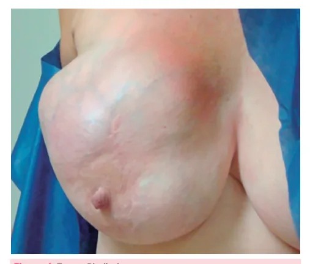
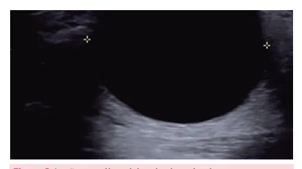
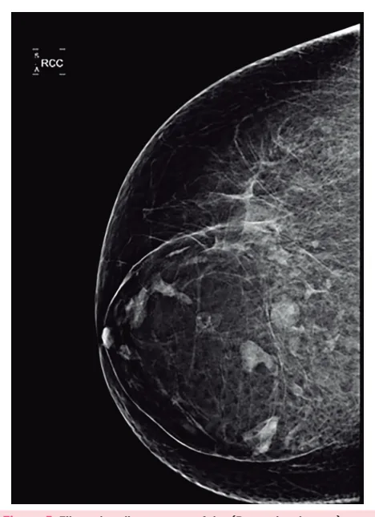

# Principais sintomas na Mastologia

<!-- page:1 -->

## PRINCIPAIS SINTOMAS EM

## MASTOLOGIA

Afecções benignas das mamas NÓDULOS

- Se houver fluxo papilar suspeito → a cirurgia está

- Cistos - podem ser simples x complexos: indicada para ressecção do ducto acometido ou Cistos simples não palpáveis → dos ductos principais. PAAF → indicar na minoria dos casos, pedir

tranquilizar a paciente; PAPILOMAS INTRADUCTAIS

- Pode ser central ou periférico - se tiver atipias citologia só casos suspeitos em que houver aumenta risco câncer de mama;

conteúdo hemorrágico ou recidiva.

- O quadro clínico típico é o achado de fluxo

- Fibroadenoma - tem como diagnóstico diferencial papilar sanguinolento;

o Tumor Phyllodes;

- Tratamento: excisão cirúrgica se houver atipias ou Tumor benigno mais comum da mama; lesão remanescente. Nódulo circunscrito, regular, fibroelástico MASTALGIA superfície lisa ou lobulada, geralmente estabiliza

- Pode ser clínica ou acíclica;

entre < 2-3 cm de diâmetro;

- Pode ser mamária ou extramamária; Tratamento: na maioria dos casos é apenas

- Tem baixa correlação com câncer de mama.

acompanhamento clínico. Alterações funcionais benignas da mama (AFBM)

- Tumor Phyllodes - pode ser benigno, borderline

- Caracterizadas pela mastalgia cíclica, ou maligno: espessamento e nódulos palpáveis; Acomete mulheres entre 40-50 anos, pode ter

- Comum no menacme (entre 25 e 45 anos);

crescimento contínuo e rápido;

- A ultrassonografia pode mostrar cistos. Tratamento é feito com exérese cirúrgica Mastite puerperal com margem;

- Deve-se manter a amamentação e/ou ordenha Complicações: recorrência local e das mamas;

metástase (raro).

- Tratar com antimicrobiano: Cefalexina 500mg via

FLUXO PAPILAR oral por 6/6h 7-14 dias;

- Considerado suspeito se: unilateral, uniductal,

- Se houver abscesso, está indicada a drenagem.

espontâneo, hemorrágico, sero-hemorrágico ou cristalino, associado a nódulo, pessoas idosas ou do sexo masculino;

- Solicitar MMG, USG e RNM de mama para investigar lesões concomitantes;

## NÓDULO

- A maioria dos nódulos mamários são benignos, porém

- As causas mais comuns de nódulos palpáveis são os é importante descartar malignidade; cistos e fibroadenomas.

50% Fibroadenoma Cistos 40% Câncer 30% 20% 10% 0% 5 10 15 20 25 30 35 40 45 50 55 60 65 70 Idade (anos)

Figura 1: Causas mais comuns de nódulos mamários de acordo com a idade.

---

<!-- page:2 -->

- Em pacientes mais jovens, de até 25-30 anos, há Características maior incidência de fibroadenoma;

- Circunscrito;

- Entre 30-50 anos, são cistos são a maioria;

- Regular;

- A partir dos 40 anos, no entanto, o risco de câncer

- Fibroelástico;

aumenta progressivamente.

- Superfície lisa ou lobulada;

aumenta progressivamente.

- CISTO

- Podem ser simples (benignos) ou complexos (interior com vegetações ou debris);

- Os simples costumam ser benignos. T

Tratamento

- Em caso de cistos simples não palpáveis, deve-se tranquilizar a paciente;

- Os cistos simples, quando muito grandes, podem causar incômodo à paciente, podendo-se lançar mão nesses casos da punção aspirativa por agulha fina melhorar o sintoma da paciente: Nestes casos, só se encaminha para análise L citológica o conteúdo retirado daqueles casos suspeitos, como quando há saída de conteúdo hemorrágico ou em caso de recidiva em curto espaço de tempo. Se durante a punção o cisto se esvazia completamente e há saída de conteúdo citrino, não há necessidade de citologia.

(PAAF) com objetivo de esvaziar o conteúdo do cisto e

- Figura 2: Lesão anecóica, típica de cisto simples.

## FIBROADENOMA

- Tumor benigno mais comum da mama;

- Podem alterar de tamanho conforme a fase do ciclo menstrual;

- Pode aumentar na gestação e amamentação;

- Pode diminuir na menopausa;

- Não eleva o risco para câncer de mama.

- Figura 3: Fibroadenoma.

- Superfície lisa ou lobulada;

- Geralmente estabiliza em < 2-3 cm;

- Quando as características do fibroadenoma diferem das citadas acima, é importante descartar a presença de tumor Phyllodes.

Tratamento

- O tratamento na maioria dos casos é apenas acompanhamento clínico;

- Pode-se optar pela exérese cirúrgica se: Tamanho > 2-3 cm (descartar tumor Phyllodes); Sintomático; Alterações radiológicas suspeitas; Considerar em casos de alto risco familiar e cancerofobia (medo de ser câncer).

Lesões fibroepiteliais

- O fibroadenoma faz parte de um grupo das lesões fibroepiteliais, sendo que apresenta menor número de mitoses e menor celularidade do estroma;

- Outra lesão fibroepitelial é o Tumor Phyllodes, que é mais proliferativo, com mais mitoses e celularidade do estroma, sendo parte dos diagnósticos diferenciais do fibroadenoma;

- O Tumor Phyllodes pode ser dividido entre benigno, borderline e maligno: Ocorre mais em mulheres entre 40-50 anos; É raro, representando 0,3-0,9% dos tumores de mama; Pode ter crescimento contínuo e rápido; Tratamento: exérese cirúrgica com margem; Complicações: recorrência local e metástase (raro, por disseminação hematogênica).

Figura 4: Tumor Phyllodes.

## ALTERAÇÕES FUNCIONAIS BENIGNAS DA

## MAMA (AFBM)

Quadro clínico:

- Dor, geralmente no quadrante supero-lateral (QSL);

- Espessamento, nódulos palpáveis;

- Sintomas cíclicos, melhoram após a menstruação.

---

<!-- page:3 -->

Faixa etária: ANAMNESE DA PACIENTE COM FLUXO

- 25-45 anos (menacme); PAPILAR

- No USG é frequente o achado de cistos mamários;

- Idade;

- Conduta: seguimento, sintomáticos e uso de sutiã

- Questionar manipulação excessiva do mamilo;

com boa sustentação da mama para controle

- Patologia mamária;

com boa sustentação da mama para controle de sintomas.

## HAMARTOMA OU FIBROADENOLIPOMA

- Benigno e pouco frequente;

- Caracterizado por uma area de tecido mamário normal encapsulado (“Breast in a breast”);

- Conduta: seguimento.

Figura 5: Fibroadenolipoma com efeito (Breast in a breast) na mamografia.

## FLUXO PAPILAR

- Exteriorização do fluxo pela papila fora do ciclo gravídico-puerperal;

- 90-95% de origem benigna;

- Mais comum durante o menacme, porém, quando ocorre em idosas, o risco de malignidade aumenta;

- Secreção láctea (galactorreia) x não láctea (telorreia).

## FLUXO PAPILAR FISIOLÓGICO

- O fluxo papilar fisiológico pode ocorrer em até 2/3 das mulheres não lactantes, apresentando pequena quantidade de secreção, principalmente após estímulo excessivo do mamilo;

- Não está associado a patologias malignas;

- Não há terapêutica específica, além de orientações;

## FLUXO PAPILAR PATOLÓGICO

- Associado a lesões proliferativas ou carcinoma. - Patologia mamária;

- Uso de anticoncepcionais ou terapia hormonal;

- Uso de medicamentos.

## EXAME FÍSICO

- Unilateral ou Bilateral;

- Uniductal ou Multiductal;

- Espontâneo ou Provocado;

- Aspecto → pode ser lácteo, purulento, multicolorido, esverdeado, marrom, cristalino, seroso ou hemorrágico;

- Ponto de gatilho: local que ao ser comprimido causa saída do fluxo pela papila.

## QUANDO INVESTIGAR UM FLUXO PAPILAR

## SUSPEITO?

- Unilateral;

- Uniductal;

- Espontâneo;

- Hemorrágico, sero-hemorrágico ou cristalino;

- Associado a nódulo;

- Pacientes idosas;

- Sexo masculino.

A presença de 1 característica acima já define o fluxo papilar como suspeito.

## DIAGNÓSTICO

- No diagnóstico de fluxo papilar não há benefício na coleta de citologia do fluxo papilar;

- Solicitar para afastar lesões concomitantes: MMG → Se paciente com idade superior a 40 anos, sempre realizar MMG; Porém, a sensibilidade é baixa (26%); USG → Sensibilidade de 63%; RNM → Sensibilidade de 90%; Solicitar se MMG/USG não permitirem o diagnóstico.

Derrame papilar espontâneo Exame físico suspeito (unilateral, uniductal, hemorrágico, cristalino, seroso, sero-hemorrágico, seroaquoso, associado a nódulo, idosas, sexo masculino)

Sim Não Mamografia ou Tranquilização ultrassonografia alteradas Sim RNM alterada Investigar conforme Cirurgia a anormalidade Figura 6: Fluxograma na investigação do fluxo papilar.

---

<!-- page:4 -->

## MASTALGIA

## TRATAMENTO

- Fluxo papilar suspeito → cirurgia está indicada;

- Comum: acomete 60-70% das mulheres;

- Exames de imagem identificaram causa → segue com

- Principalmente em idade reprodutiva;

tratamento específico;

- Gera angústia e ansiedade, por medo do câncer de

- Sem causa identificada: mama, porém a correlação entre mastalgia e câncer Desejo de amamentar → Ressecção do ducto acometido; de mama é baixa, aproximadamente < 2%; Sem desejo de amamentar e pós-menopausa →

- A causa não é totalmente conhecida, porém, componente psicológico (stress);

Ressecção dos ductos principais. postula-se haver um fator hormonal, assim como um PAPILOMA INTRADUCTAL

- Pode ser dividida em:

- Lesão do epitélio do ducto mamário, podendo ser | Clínica (relação com ciclo menstrual) ou acíclica central (próximo à papila) ou periférico; (sem relação com ciclo menstrual);

- Pode ser central ou periférico: | Mamária ou extramamária. Central: Lesão no ducto principal, geralmente na RRA; DOR MAMÁRIA ACÍCLICA Periférico: Ocorre nos ductos periféricos. Causas

Quadro clínico

- Ectasia Ductal;

- Fluxo papilar sanguinolento;

- Hipertrofia mamária;

- Exames de Imagem podem evidenciar: nódulo,

- Macrocistos;

cisto complexo, ducto com conteúdo sólido ou

- Trauma;

ducto dilatado;

- Síndrome de Mondor (tromboflebite superficial das

- Quando apresenta células atípicas, está associado a veias da parede torácica).

uma elevação do risco de câncer de mama. Tratamento DOR EXTRA-MAMÁRIA

- Com atipias: Excisão cirúrgica; Causas

- Sem atipias: Controverso, porém geralmente

- Síndrome de Tietze (costocondrite esternal);

recomenda excisão se houver lesão remanescente

- Herpes-zóster;

após a biópsia.

- Angina;

- Relação ao TGI (ex: DRGE, colecistite);

## GALACTORREIA

- Musculoesqueléticas;

- Saída de secreção láctea pela papila;

- Bursite escapular;

- Ocasionada por fatores não mamários, como o

- Neurite intercostal;

aumento da prolactina (PRL);

- Verificar Tabela 3 na próxima página.

- Causa mais comum: medicamentos supressores da dopamina;

- Verificar Tabelas 1 e 2 .

Tabela 1: Medicamentos que podem aumentar a prolactina.

## CLASSE FARMACOLÓGICA MEDICAMENTO

Estrogênios, anticoncepcionais Hormônios orais, hormônios tireoidianos Risperidona, clomipramina, nortriptilina, inibidores da Psicotrópicos recaptação de serotonina, fenotiazina, antidepressivos tricíclicos, opióides, codeína, heroína, cocaína, sulpirida.

Antieméticos Metoclopramida, domperidona Anti-hipertensivos Verapamil, metildopa, reserpina Tabela 2: Condições não medicamentosas que podem causar galactorreia.

## ORIGEM PATOLOGIA

Prolactinomas, acromegalia, craniofaringioma, encefalite, Lesões no SNC tumor hipofisário, transecção cirúrgica, trauma hipofisário.

Neurite por herpes-zóster, toracotomia, mastectomia, Lesões em parede torácica queimaduras, dermatites e traumatismos.

Insuficiência renal crônica, doença de Addison, doença de Doenças sistêmicas Cushing, hipotireoidismo primário, diabetes, hepatopatias.

Produção ectópica Carcinoma broncogênico, hipernefroma. Anovulação, coito, dilatação e curetagem, estimulação mamária, histerectomia, Outros DIU, pseudociese, cirurgias de pescoço.

---

<!-- page:5 -->

Tabela 3: Mastalgia de causa medicamentosa. Medicamentos que podem causar mastalgia: Medicamentos hormonais (estrogênio, progesterona, clomifeno, ciproterona).

Antidepressivos, ansiolíticos, antipsicóticos ( Anti-hipertensivos/cardíacos (es Adaptado de Tratado de Ginecologia da Febrasgo TRATAMENTO DA MASTALGIA Não medicamentoso

- Orientação da paciente;

- Uso de sutiã adequado (com alças largas, sem aro, com boa sustentação mamária).

Medicamentoso

- Analgésico, como AINE, inclusive podendo ser tópico;

- Antidepressivos ou ansiolíticos se houver componente psicológico importante;

- Tamoxifeno, reservado para os casos mais extremos.

## MASTITE

## MASTITE PUERPERAL

- A principal forma de mastite é a puerperal;

- Ocorre pela transmissão pelo neonato de bactérias da flora oral durante a sucção, facilitada pelas fissuras na papila;

- Pode ser associada a más condições de higiene local, porém não é obrigatório, podendo ocorrer em pacientes com higiene adequada;

- Principais agentes envolvidos: Staphylococcus aureus,

Staphylococcus epidermidis, Streptococcus sp. Quadro Clínico

- Hiperemia da mama;

- Febre;

- Mama túrgida;

- Abscesso mamário.

Tratamento

- Manter a amamentação se possível;

- Ordenha das mamas;

- Antibioticoterapia com Cefalexina 500mg VO de 6/6h por 7-14 dias;

- Se abscesso, realizar drenagem (cirúrgica ou percutânea com agulha) e internação para antibioticoterapia endovenosa. (sertralina, venlafaxina, amitriptilina, haloperidol).

spironolactona, metildopa, digoxina). Outras causas de mastites infecciosas

- Abscesso subareolar crônico recidivante;

- Mastite tuberculosa;

- Mastite por micobactérias;

- Mastite viral – herpes simples ou herpes-zóster;

- Mastite luética.

## MASTITES NÃO INFECCIOSAS

- Mastite periductal;

- Mastite granulomatosa idiopática;

- Sarcoidose mamária.

## REFERÊNCIAS

Figura 1: Causas mais comuns de nódulos mamários de acordo com a idade. TRATADO de Ginecologia FEBRASGO. Fernandes, Cesar Eduardo; Silva de Sá, Marcos Felipe (editores); Mariani Neto, Corintio (coordenação). 1. ed.

Rio de Janeiro: Elsevier, 2019. Figura 2: Lesão anecóica, típica de cisto simples. ATLAS of breast cancer early detection. Disponível em: https://screening.

iarc.fr/atlasbreastdetail.php?Index=091&e=. Figura 3: Fibroadenoma. Acervo de imagens Medcof. Figura 4: Tumor Phyllodes.

DE SOUZA, J. A. et al. Phyllodes tumor of the breast: case report. Revista da Associação Médica Brasileira, v. 57, n. 5, p. 495-497, set. 2011.

Figura 5: Fibroadenolipoma com efeito (Breast in a breast) na mamografia. NIKNEJAD, M. T. Breast within a breast sign - hamartoma. Radiology Case.

Disponível em: https://radiopaedia.org/cases/breastwithin-a-breast-signhamartoma?lang=us. Figura 6: Fluxograma na investigação do fluxo papilar.

Adaptado de TRATADO de Ginecologia FEBRASGO. Fernandes, Cesar Eduardo; Silva de Sá, Marcos Felipe (editores); Mariani Neto, Corintio (coordenação). 1. ed. Rio de Janeiro: Elsevier, 2019.
