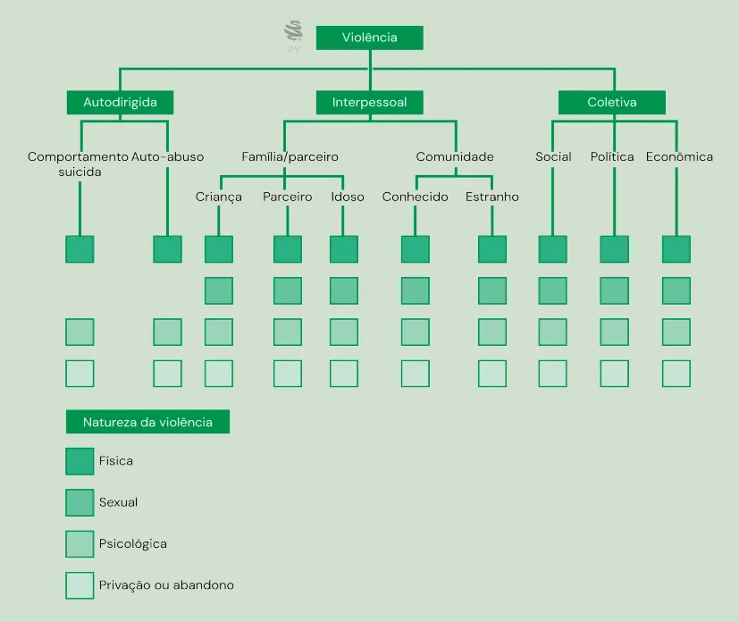

# Problemas, Políticas e Sistemas de Saúde

<!-- page:1 -->

## Saúde Pública — SUS História do SUS

### Vulnerabilidade

**Vulnerabilidade** refere-se à **maior suscetibilidade de indivíduos e comunidades a um adoecimento ou agravo** e, de modo inseparável, menor disponibilidade de recursos de todas as ordens para sua proteção.

- Antecede ao risco: determina os diferentes riscos de se infectar, adoecer e morrer;
- Sua análise envolve três dimensões: individual, social e programática/institucional (ênfase na instituição e na qualidade e efetividade dos serviços disponíveis);
- **Vulnerabilização**: processo histórico, político e social de produção da vulnerabilidade, marcado pela negação de direitos, exclusão das políticas públicas e perpetuação das desigualdades — implica ação estrutural que coloca sujeitos e territórios em condição de desproteção.

### Dimensões da Vulnerabilidade

#### Dimensão Individual

Refere-se às informações que a pessoa tem sobre o problema e à capacidade de operá-las na construção de práticas protetoras integradas ao cotidiano — é o comportamento particular dos indivíduos frente ao processo de saúde-doença.

**Elementos**: informação, valores, crenças, afetos, pulsões; cotidianidade; relações afetivas; relações familiares; redes sociais.

#### Dimensão Social

Relativo à obtenção de informações e ao poder de influir social e politicamente para alcançar livre expressão, segurança e proteção.

**Elementos**: condições de vida e trabalho; cultura; situação econômica; ambiente; relações de gênero, de classe e entre gerações; acesso a trabalho, educação, moradia, lazer; tradições culturais; estigma e discriminação.

#### Dimensão Programática

Pertinente à qualidade e ao funcionamento efetivo dos programas de controle e serviços.

**Elementos**: acesso a serviços; existência e sustentação de programas; qualidade da atenção; mecanismos de avaliação e retro-alimentação; políticas e capacidades técnicas; investimento público; planejamento e avaliação; controle e participação social; integralidade e equidade; acesso e aceitação.

**Tabela 1**: Vulnerabilidade em Saúde: Dimensões e Fatores Determinantes.

| Dimensão | Elementos/Fatores |
|---|---|
| **Individual** | Cotidianidade; relações afetivas; relações familiares; redes sociais |
| **Social** | Acesso a trabalho, educação, moradia, lazer; tradições culturais; relações de gênero, raça/etnia, geração e classe; estigma e discriminação |
| **Programática** | Políticas e capacidades técnicas; investimento público; planejamento e avaliação; controle e participação social; integralidade e equidade; acesso e aceitação |

### Modelos Assistenciais

**Formas de organização dos serviços de saúde**:

- **Fragmentado**: serviços isolados, sem coordenação;
- **Redes de Atenção à Saúde (RAS)**: integração coordenada dos serviços.

**Modelos assistenciais**:

- **Hegemônicos**: Sanitarista, Médico-assistencial privatista;
- **Alternativos**: ESF/APS, Promoção da saúde e vigilância.

### Componentes de um Sistema de Saúde

- População;
- Infraestrutura;
- Organização dos serviços de saúde;
- Modelo assistencial (ênfase na qualidade e efetividade);
- Financiamento;
- Gestão ou governança, regulação.

*Figura 1: Violência — Tipos, Agentes e Naturezas segundo a OMS.*

---

<!-- page:2 -->

## Análise de Situação de Saúde

### Análise da Situação de Saúde — Conceitos

É um **processo analítico-sintético** que permite caracterizar, medir e explicar o perfil de saúde-doença de uma população, incluindo os danos ou problemas de saúde e seus determinantes sociais.

**Objetivo**: facilitar a identificação de necessidades, prioridades e possibilidades de intervenções em saúde, bem como viabilizar a avaliação do impacto trazido pelas intervenções feitas.

### Dimensões da Realidade na Análise de Situação de Saúde

#### Necessidades

São representadas pelas **condições que possibilitam gozar saúde** ou um dado modo de viver a vida — são as condições que, uma vez atendidas, possibilitam ao ser humano sobreviver na natureza ou no ambiente. São as necessidades que fazem com que os sujeitos busquem as ações e os serviços de saúde, gerando assim as demandas ao sistema.

#### Problemas

**Representam a diferença entre a realidade observada e a norma socialmente construída.** Podem ser de dois tipos:

- **Problemas do estado de saúde da população**: danos (doença, acidente, carência, riscos, vulnerabilidade);
- **Problemas do sistema de serviços**: relacionados à qualidade e acesso aos cuidados.

**Problema de saúde** é a representação social de necessidades derivadas de condições de vida e formuladas a partir da discrepância entre a realidade vivida e a desejada ou idealizada. Todo problema expressa uma necessidade e se define por incorporar em sua formulação a demanda de solução.

#### Determinantes

**Explicam a determinação social do processo saúde-doença** e são identificados por meio de estudos epidemiológicos e sociais.

### Conceitos Importantes

#### Risco

**Probabilidade de ocorrência de um evento adverso de saúde** (doença, agravo ou morte) em um grupo populacional, durante um tempo definido. É uma medida quantitativa expressa por indicadores como risco relativo e risco atribuível.

#### Vulnerabilidade

Conjunto de aspectos individuais e coletivos relacionados à **maior suscetibilidade de indivíduos e comunidades a um adoecimento ou agravo** e, de modo inseparável, menor disponibilidade de recursos de todas as ordens para sua proteção.

### Lei Maria da Penha — Tipos de Violência Doméstica e Familiar

De acordo com a Lei Maria da Penha, existem cinco tipos:

#### Violência Física

Envolve **agressões como empurrões, tapas, socos, chutes, queimaduras, estrangulamento**, ou qualquer ato que provoque dor ou lesão física, mesmo sem deixar marcas visíveis.

#### Violência Psicológica

Consiste em qualquer **comportamento que cause dano emocional**, diminuição da autoestima ou que vise controlar ações, comportamentos, crenças e decisões. Inclui ameaças, humilhações, manipulação, isolamento, chantagens, insultos, constrangimentos, vigilância constante ou ridicularização.

#### Violência Moral

Relaciona-se à **violação da honra e imagem**. Acontece por meio de:
- Calúnias (atribuir falsamente um crime);
- Difamações (manchar a reputação);
- Injúrias (ofensas à dignidade ou decoro).

#### Violência Sexual

**Qualquer ação que constranja a mulher** a presenciar, manter ou participar de relação sexual não desejada, por meio de ameaça, coação, uso da força ou aproveitamento de situações de vulnerabilidade. Inclui estupro, impedimento ao uso de métodos contraceptivos, forçar práticas sexuais indesejadas ou exposição à pornografia.

#### Violência Patrimonial

É a **retenção, subtração, destruição ou controle de objetos, documentos, bens, valores e recursos da mulher**. Pode incluir rasgar roupas, esconder documentos pessoais, controlar o dinheiro, impedir que trabalhe, destruir utensílios ou acessar sem consentimento contas bancárias ou digitais.

---

<!-- page:3 -->

## Política e Sistemas de Saúde

### Política de Saúde

**Conjunto de atividades voltadas para a solução dos problemas de saúde.** Representa a resposta organizada da sociedade, especialmente por meio do Estado, aos problemas de saúde.

### Sistema de Saúde / Sistema de Serviços de Saúde

**Conjunto dos elementos interligados** que expressam, determinam e condicionam o estado de saúde dos indivíduos e populações — operacionalizam a política de saúde.

**Componentes fundamentais**:
- Definição de políticas específicas;
- Sustentabilidade institucional e material das políticas;
- Articulação multissetorial das ações;
- Atividades intersetoriais;
- Equidade e integralidade;
- Abordagem multidisciplinar;
- Integração entre prevenção, promoção e assistência;
- Planejamento e avaliação das políticas;
- Participação social no planejamento e avaliação;
- Recursos humanos e materiais;
- Governabilidade e controle social;
- Organização do setor saúde;
- Acesso e qualidade dos serviços;
- Enfoques interdisciplinares;
- Preparo técnico-científico dos profissionais;
- Compromisso e responsabilidade profissional;
- Respeito, proteção e promoção de direitos humanos;
- Participação comunitária na gestão;
- Planejamento, supervisão e avaliação dos serviços;
- Responsabilidade social e jurídica.

*Figura 2: Mudança nos modelos de atenção.*

### Formas de Organização de um Sistema de Saúde

#### Sistema Fragmentado (Pirâmide)

- **Forma de organização**: hierarquia isolada;
- **Coordenação da atenção**: inexistente;
- **Comunicação entre componentes**: inexistente;
- **Foco**: unidades de pronto atendimento nas condições agudas;
- **População**: voltado para indivíduos;
- **Ênfase das intervenções**: curativas e reabilitadoras, sem estratificação de riscos;
- **Modelo de atenção**: fragmentado por ponto de atendimento;
- **Ênfase do cuidado**: centrado nos profissionais, especialmente médicos;
- **Conhecimento e ação**: clínicas especializadas.

#### Rede de Atenção à Saúde (RAS)

- **Forma de organização**: coordenação;
- **Coordenação da atenção**: presente e efetiva;
- **Comunicação entre componentes**: integrada;
- **Foco**: condições agudas e crônicas com estratificação de riscos;
- **População**: adscrita e com responsabilidade da rede;
- **Ênfase das intervenções**: promocional, preventiva, curativa, cuidadora e paliativa — atuando sobre determinantes sociais da saúde;
- **Modelo de atenção**: integrada, com estratificação de riscos;
- **Ênfase do cuidado**: multiprofissional e pessoas usuárias com ênfase no autocuidado apoiado;
- **Conhecimento e ação**: partilhada por equipes multiprofissionais e pessoas usuárias.

### Modelo de Atenção ou Prestação de Serviços

**Modo de intervenção** que, ao combinar técnicas e tecnologias e organizar meios de trabalho nos serviços de saúde, visa à resolução de problemas individuais e coletivos de saúde de determinada população.

---

<!-- page:4 -->

### Modelos de Atenção à Saúde Hegemônicos

#### Modelo Médico-Assistencial Privatista

- **Sujeito**: médico com especialização e complementaridade de outros profissionais (paramédicos, auxiliares);
- **Objeto**: doença (patologia);
- **Modo de transmissão**: pacientes (clínica, cirurgia).

#### Modelo Sanitarista

- **Sujeito**: profissionais sanitários;
- **Objeto**: fatores de risco;
- **Modo de transmissão**: campanhas sanitárias, programas especiais, vigilância sanitária.

### Modelos de Atenção à Saúde Alternativos

#### Medicina Preventiva, Familiar e Comunitária

- **Racionalidades**: modelo médico com demanda;
- **Ênfase**: necessidades e campanhas sanitárias.

#### Sanitarista — Programas Especiais

- **Vigilância sanitária e epidemiológica**;
- **Ações programáticas em saúde**.

#### Vigilância em Saúde

- **Ênfase**: vigilância epidemiológica;
- **Ações**: vigilância da saúde.

#### Promoção da Saúde / Determinantes Sociais de Saúde

- **Ênfase**: abordagem integrada e determinantes sociais.

#### Estratégia Saúde da Família (ESF) / Atenção Primária à Saúde (APS)

- **Características**: acolhimento; clínica ampliada; humanização; distritalização;
- **Ênfase**: promoção da saúde e determinantes sociais de saúde.

#### Ofertas Organizadas / Ações Programáticas de Saúde

- **Ênfase**: linhas do cuidado;
- **Abordagem**: atenção colaborativa realizada por equipes multiprofissionais.

### Meios de Trabalho e Formas de Organização

- **Tecnologia**: sistema de vigilância epidemiológica e sanitária;
- **Rede de serviços**: atenção básica, média complexidade, alta complexidade;
- **Referência**: sistema logístico eficaz;
- **Sujeito corresponsável**: agente corresponsável pela própria saúde;
- **Acolhimento**: linhas do cuidado e ações programáticas em saúde.

## Referências

Figura 1: KRUG, E. G. et. al. World report on violence and health. Geneva: World Health Organization, 2020.

Figura 2: Mudança nos modelos de atenção. MENDES, Eugênio Vilaça. As redes de atenção à saúde. Ciência & Saúde Coletiva, v. 15, p. 2297–2305, 2010.

**Tabela 1**: Vulnerabilidade em Saúde: Dimensões e Fatores Determinantes. RODRIGUES, Natália Oliveira; NERI, Anita Liberalesso. Vulnerabilidade social, individual e programática em idosos da comunidade: dados do estudo FIBRA, Campinas, SP, Brasil. Ciência & Saúde Coletiva, v. 17, n. 8, p. 2129–2139, 2012.

**Tabela 2**: Aspectos a serem considerados nas três dimensões da análise de vulnerabilidade. Adaptado de Ayres et al., 2006.

**Tabela 3**: Formas de Organização de um Sistema de Saúde — As redes de atenção à saúde / Eugênio Vilaça Mendes. Brasília: Organização Pan-Americana da Saúde, 2011. 549 p.: il.

**Tabela 4 e 5**: Modelos de Atenção à Saúde Alternativos. Adaptado de Políticas e Sistema de Saúde no Brasil. 2 ed. rev e amp / organizado por Lígia Giovanella, Sarah Escorel, Lenaura de Vasconcelos Costa Lobato et al. Rio de Janeiro: Editora Fiocruz, 2012.
