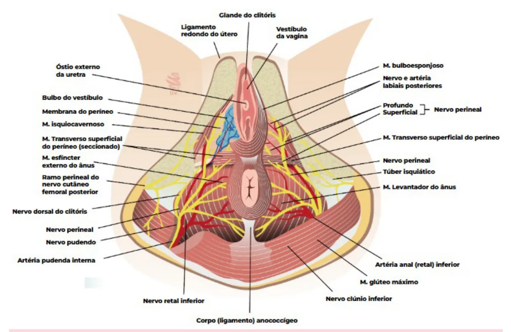
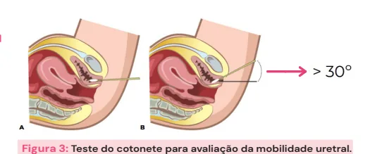

# Propedêutica em Uroginecologia

<!-- page:1 -->

- Anamnese: base da propedêutica;

- Incontinência urinária mista;

- Deve-se sempre detalhar o tempo de duração

- Sensibilidade vesical reduzida ou ausente;

dos sintomas, a ordem em que surgiram,

- Perda urinária insensível: não precedida de as comorbidades, antecedentes cirúrgicos, desejo miccional;

hábitos e medicamentos;

- Dor durante o enchimento vesical.

- Comorbidades e cirurgias realizadas: FASE DE ESVAZIAMENTO (MICÇÃO) Cirurgia abdominal/pélvica ou traumas;

- Número de micções ao dia/intervalo entre Doenças neurológicas/ Tosse as micções;

crônica / Constipação;

- Sensação de esvaziamento incompleto ou Limitação de mobilidade. jato fraco;

- Antecedentes ginecológicos e obstétricos:

- Gotejamento pós-miccional ou Via de parto/ Tempo do período expulsivo/ Peso micção entrecortada;

do RN/ Houve laceração de trajeto → sutura

- Exame físico direcionado: Atividade sexual. da uretra no esforço maior do que 30º,

foi realizada? | Teste de esforço, Teste do Cotonete (angulação

- Hábitos e vícios: Atividade física / Tabagismo/Etilismo; Teste do absorvente (Pad Tast) e avaliação

- Medicamentos em uso: Diuréticos/ neurológica perineal: (reflexo bulbo-cavernoso e

Antidepressivos/ Sedativos; reflexo anocutâneo).

## QUEIXAS URINÁRIAS - FASE DE ENCHIMENTO QUEIXAS DE PROLAPSO - SENSAÇÃO DE BOLA

## VESICAL NA VAGINA

- Urgência: é a queixa de um desejo súbito de urinar,

- Queixa de peso na vagina;

o que é difícil de postergar;

- Dificuldade de urinar/evacuar pela presença do

- Incontinência urinária por urgência; prolapso com necessidade de redução do mesmo;

- Noctúria: acordar para urinar durante o período de

- Úlceras na mucosa/sangramento/corrimento ou sono principal; disfunções sexuais;

- Enurese: queixa de perda urinária intermitente e

- O exame físico com manobra de esforço é o insensível que ocorre durante o período de sono; principal para detectar as distopias em que se

- Incontinência urinária de esforço: perda com avalia o grau máximo do prolapso.

aumento da pressão intra- abdominal;

## ANAMNESE

Hábitos e vícios

- Atividade física;

- Não se esquecer da anamnese completa;

- Tabagismo; Identificação;

- Etilismo. Queixa e duração; História da moléstia atual; DISFUNÇÕES URINÁRIAS Comorbidades e cirurgias realizadas; Bexiga Medicamentos em uso;

- Órgão de armazenamento de urina; Antecedentes ginecológicos e obstétricos;

- Capacidade de acomodar alterações de Hábitos e vícios; volume (complacência); Antecedentes familiares.

- Capacidade de coordenar o esvaziamento com condições

Comorbidades e cirurgias prévias externas: liberação voluntária da micção quando há

- Cirurgia abdominal ou pélvica; condições socialmente aceitáveis para a mesma.

- Traumas; Enchimento vesical

- Doenças neurológicas/ Tosse crônica / Constipação;

- Sensibilidade → Como avaliar?

- Limitação de mobilidade.

- Intervalo entre as micções: urina de quantas em

Medicamentos em uso quantas horas?

- Diuréticos;

- Quando sente vontade de urinar, consegue esperar e ir

- Antidepressivos e sedativos. tranquilamente ao banheiro?

Antecedentes ginecológicos e obstétricos

- Chega a perder urina antes de chegar ao banheiro?

- Via de parto/ Tempo do período expulsivo/ Peso do

- Acorda à noite por causa da vontade de urinar?

RN/ Houve laceração de trajeto → sutura foi realizada? Quantas vezes?

- Atividade sexual.

- Tem dor supra-púbica quando a bexiga está cheia?

Urina para aliviar a dor?

---

<!-- page:2 -->

Sintomas de armazenamento Tabela 1: Principais disfunções urinárias

- Sensibilidade normal: o indivíduo está consciente do enchimento da bexiga e a sensibilidade aumenta até DISFUNÇÕES URINÁRIAS um forte desejo para urinar;

- Urgência: é a queixa de um desejo súbito de urinar, o ENCHIMENTO ESVAZIAMENTO

- Urgência: é a queixa de um desejo súbito de urinar, o que é difícil de postergar;

- Incontinência por urgência: é a queixa de perda involuntária de urina associada à urgência;

- Noctúria: é a queixa de acordar para urinar durante o período de sono principal;

- Enurese: queixa de incontinência intermitente que ocorre durante períodos de sono.

Enchimento vesical

- Esforço: Quando se realiza esforço, há perda concomitante de urina? Qual tipo de esforço (tosse, espirro, pular, caminhar rápido no plano, subir escada, carregar sacolas)? Grande: Tossir, espirrar, pular corda, fazer polichinelo; Moderado: Descer escada, dar risada, correr/trotar; Pequeno: Mudança de decúbito (ex. levantar da cadeira), caminhar rápido no plano;

- Incontinência urinária de esforço é a queixa de perda involuntária por esforço, ou por espirro ou por tosse; Relacionado ao aumento da pressão intraabdominal, e não necessariamente a se a paciente fica cansada ou tem dificuldade de realizá-lo.

- Incontinência urinária mista: é a queixa de perda involuntária associada à urgência e também a esforço, espirro ou tosse;

- Incontinência urinária contínua: queixa de perda involuntária contínua de urina;

- Queixa da fase de enchimento: Urgência; Incontinência urinária por urgência; Noctúria e enurese; Incontinência urinária de esforço ou mista; Sensibilidade vesical reduzida ou ausente; Perda urinária insensível; Dor.

Esvaziamento vesical

- Hesitação: queixa de atraso no início da micção;

- Jato fraco: queixa de um jato urinário mais fraco em comparação ao desempenho prévio do paciente ou em comparação com outros indivíduos;

- Micção entrecortada: é o termo utilizado quando o indivíduo descreve um jato de urina que para e recomeça em uma ou mais ocasiões durante a micção;

- Esforço para urinar: queixa de necessidade de fazer esforço intenso (por meio de contração abdominal, S manter ou melhorar o jato urinário;

Valsalva ou pressão suprapúbica) para começar,

- Gotejamento terminal: é o termo utilizado quando um indivíduo descreve uma fase final da micção prolongada, na qual o fluxo se torna reduzido a pingos ou gotejamento;

- Sensação de esvaziamento incompleto: queixa de que a bexiga, após a micção, não parece estar vazia.

- ENCHIMENTO ESVAZIAMENTO urinar reduzida ou ausente incompleto

Urgência Hesitação Noctúria Micção entrecortada Enurese Jato Fraco Incontinência por urgência Gotejamento Esforço / Pressão para Incontinência por esforço Incontinência mista Sensibilidade vesical Sensação de esvaziamento Perda urinária Dor

## PROLAPSOS VAGINAIS

- A sensibilidade da região vaginal advém principalmente do nervo pudendo, a partir da ramificação dos nervos perineais: A porção do 1/3 distal é mais inervada;

- Torna-se uma queixa mediante o relato de sensibilidade vaginal; Sensação de “bola na vagina”; Sensação de “peso na vagina”; Em geral, a paciente descreve ter sentido um abaulamento ao se higienizar → prolapso de ⅓ proximal ou médio.

Nervo pudendo Ramo Perineal Ramo Dorsal do clitóris Figura 1: Inervação pélvica pelo nervo pudendo. SIntomas que podem estar associados

- Obstrução para a micção e/ou para a evacuação;

- Perguntar se precisa reduzir o prolapso para urinar/evacuar;

- Lesões na mucosa da região prolapsada;

- Secreção/sangramento;

- Disfunções sexuais;

- Dor;

- Vergonha.

---

<!-- page:3 -->

Figura 2: Anatomia pélvica

## EXAME FÍSICO

- Exame físico geral;

- Exame ginecológico; Inspeção; Exame especular; Toque vaginal.

- Atentar-se para as hipóteses diagnósticas levantadas Figura 3: Teste do cotonete para avaliação da mobilidade uretral.

a partir da realização da anamnese. Teste de Marshall-Bonney INSPEÇÃO

- Pede-se para a paciente tossir enquanto o examinador

- Observação: posiciona 1 ou 2 dedos no interior da vagina para Períneo/virilha com sinais de dermatite amoniacal; elevar a uretra (teste de Marshall-Bonney): a Conteúdo líquido no intróito vaginal; incontinência de esforço que é corrigida por esta Trofismo; manobra pode responder a uma cirurgia. Abaulamento em canal vaginal (prolapso visível ao repouso).

Avaliação neurológica

- Reflexo Bulbocavernoso: estímulo em um dos lábios maiores, lateralmente ao clitóris → ambos os lábios se contraem;

- Reflexo anocutâneo: toque da pele peri-anal → contração do esfíncter externo; Figura 4: Teste de Marshall-Bonney

- Também integrado nas raízes sacrais.

- Verificar Figura 2 “Pad Test”

- É útil para avaliar a queixa de incontinência de esforço;

Avaliação da perda urinária

- Absorvente seco com peso aferido;

- Visualização de perda urinária sincrônica à manobra

- Paciente ingere 500 ml de água;

de esforço (tosse e valsalva);

- Fica em repouso por 15 minutos, e depois realiza

- Teste do Cotonete (Q-Tip test): atividades habituais (subir e descer escada, sentar- Avalia o excesso de mobilidade da uretra durante o se e se levantar, tossir, agachar, correr no lugar) aumento da pressão abdominal. por 1 hora;

---

<!-- page:4 -->

- Absorvente é novamente pesado: Perda de até 1 g: insignificantes; 1,1 g a 9,9 g: leves; 10 a 49,9 g: moderadas; 50 g ou mais: severas.

Exame especular e toque vaginal bimanual

- POP-Q → Pelvic Organ Prolapse Quantification.

## EXAMES COMPLEMENTARES

- Incontinência urinária → sempre excluir infecção urinária: Urina tipo 1; Urocultura.

- Imagem (TC/USG) de rins e vias urinárias;

- Ressonância magnética de pelve;

- Cistoscopia;

- Estudo Urodinâmico.
