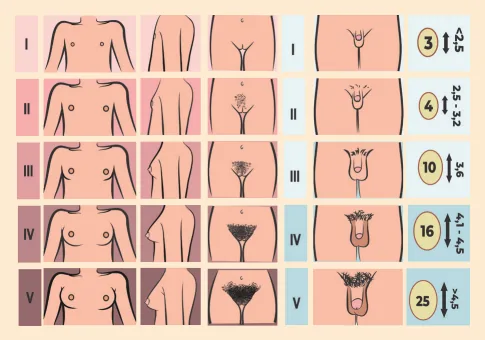

# Puberdade

<!-- page:1 -->

## PUBERDADE (PED)

## Puberdade normal

- Entre 8 e 13 anos nas meninas, começa com telarca (M2).

- Entre 9 e 14 anos nos meninos, começa com aumento testicular ≥4mL (G2).

Figura 1:Estadiamento puberal em meninas e meninos

Hipotálamo GnRh Meninas: 8-13 anos Hipófise Meninos: 9-14 anos LH FSH Testículo Ovário Testosterona Estrógeno progesterona Figura 2: Eixo hipotálamo-hipófise-gonadal O hormônio GnRH estimula os gonadotrofos hipofisários a produzirem LH e FSH, e estes estimulam as gônadas a produzirem esteróides sexuais.

FISIOLOGIA PUBERAL Regulação hormonal

- A produção de GnRH ocorre de forma pulsátil no hipotálamo;

- O GnRH estimula os gonadotrofos na hipófise a produzirem FSH e LH (gonadotrofinas);

- LH e FSH estimulam as gônadas (testículo e ovário);

- A produção de testosterona (no testículo) e estrógeno Inibe a produção do LH e do FSH na hipófise; Inibe a produção de GnRh no hipotálamo.

(no ovário) promovem feedback negativo; M1: mamilo infantil / M2: telarca / M3: tecido mamário ao redor da aréola / M4 sinal do duplo contorno / M5:

mama adulta G1: testículos <4cm³ / G2: testículos >4cm³ / G3: crescimento do pênis em comprimento / G4: crescimento do pênis em espessura / G5:

genital adulto. Puberdade precoce

- Central (eixo ativado) Tratamento: bloqueio com aGnRH

- Periférica (outra fonte) Gônadas? Adrenal? Exógena?

Puberdade atrasada (Hipogonadismo)

- Hipergonadotrófico (eixo ativado, gônada falhou);

- Hipogonadotrófico (eixo falhou): orgânico, funcional;

- Atraso constitucional de crescimento e puberdade (benigno);

- Tratamento: reposição hormonal.

- Idade fisiológica: Meninas ativam o eixo entre 8 e 13 anos de idade; Meninos ativam o eixo entre 9 e 14 anos de idade.

- Antes da idade mínima: puberdade precoce;

- Após a idade máxima: atraso puberal.

## AVALIAÇÃO DA PUBERDADE

Para avaliação da puberdade, utiliza-se o estadiamento de Tanner (observe a Figura 1).

## TANNER

Meninas - Mama (M1 a M5)

- M1: mama impúbere;

- M2: broto mamário apenas atrás do mamilo;

- M3: tecido mamário ao redor de aréola;

- M4: sinal de duplo contorno, em perfil (destaque da aréola em relação ao restante da mama);

- M5: mama adulta.

Meninos - Genital (G1 a G5)

- G1: volume testicular de aparência infantil, sem estímulo hormonal;

- G2: aumento do volume testicular (> 4 mL) – avaliado pelo orquidômetro;

- G3: crescimento do pênis, em comprimento;

- G4: crescimento do pênis, em espessura, bem como demarcação da glande;

- G5: genitália adulta.

---

<!-- page:2 -->

## PUBERDADE X CRESCIMENTO

Pilificação (meninos e meninas) - P1 a P5

- P1: sem pilificação;

Tanner x Crescimento

- P2: a pilificação esparsa, fina;

- P3: o pelo demonstra ganho espessura, adquire 10 G3 PVC (G4) caráter encaracolado;

PVC (M3) caráter encaracolado;

- P4: a pilificação alcança áreas maiores;

- P5: padrão adulto de pilificação; Nas mulheres, surge o “triângulo invertido”; Nos homens, a pilificação atinge toda a área púbica.

## EFEITOS DA PUBERDADE

Meninas

- Estrógeno (origem: granulosa): Aumento de mamas, útero e ovários; Aceleração do crescimento; Avanço da idade óssea.

- Andrógenos (origem: adrenais, teca); Pelos; Odor axilar; Acne.

Marcos puberais importantes nas meninas 1º - Telarca (M2) = broto mamário;

- 2º - Pubarca (variável) – evento independente da puberdade;

3º - Estirão (M3): velocidade de crescimento de 8-12 cm/ano; 4º - Menarca (M4): em geral, o tempo entre a telarca e a menarca é de 2 - 2,5 anos.

Menino

- Testosterona e andrógenos (testículos e adrenal); Desenvolvimento genital; Pelos faciais; Mudança vocal; Odor axilar; É Acne; Aceleração do crescimento.

- Estrógenos (aromatização periférica); G Ginecomastia puberal; Avanço da idade óssea.

- Eventos puberais importantes nos meninos ano (G4);

1º - Gonadarca – testículo ≥ 4 mL (G2); 2º - Crescimento do pênis e pubarca; 3º - Estirão: velocidade de crescimento 10-14 cm/ P

- 4º - Pêlos faciais e voz adulta (G4-5).

- D

- - - - larutattse otnemicserc ed edadicoleV

)ona/mc( Voz adulta (G5) 8 M2 Menarca (M4) 2 Meninas Meninos 7 8 9 10 11 12 13 14 15 16 17 18 Idade (anos)

Figura 3: Gráfico correlacionando a velocidade de crescimento e o estadiamento puberal em meninas (linha tracejada) e meninos (linha contínua).

- Meninas Aceleram o crescimento em M2, têm pico do estirão em M3 e desaceleram em M4. Aceleração precoce e menos intensa, estatura final menor.

- Meninos Aceleram o crescimento em G3, têm pico do estirão em G4 e desaceleram em G5. Pico de crescimento mais tardio e intenso, estatura final maior.

## ADRENARCA

É a maturação do córtex da adrenal.

- Na zona reticular, ocorre produção de androstenediona e DHEA-S (andrógenos).

Gera mudanças em meninos e meninas:

- Pelos pubianos e axilares (pubarca);

- Odor axilar;

- Acne;

A adrenarca é independente da gonadarca! PUBARCA PRECOCE

- Pubarca precoce: quando <8 anos em meninas e <9 anos em meninos;

- Pubarca precoce pode ser variante normal do desenvolvimento, mas é diagnóstico de exclusão!

Diagnósticos diferenciais

- Adrenarca precoce;

- Tumores adrenais;

- Hiperplasia adrenal congênita forma não clássica;

- Exposição exógena a andrógenos;

- Outros tumores virilizantes.

Quando a pubarca decorre de adrenarca, não há outros sinais de puberdade (mamas e testículos não aumentam).

---

<!-- page:3 -->

## PUBERDADE PRECOCE

Avaliação Na consulta

- Anamnese detalhada: história familiar, exposição Puberdade de início em:

aos andrógenos;

- Meninas <8 anos;

- Exame físico: classificação de Tanner;

- Meninos <9 anos.

- Exame físico: classificação de Tanner;

- Velocidade de crescimento.

Exames complementares

- DHEAs (principal marcador de tumor adrenal);

- 17-hidroxiprogesterona (principal marcador de hiperplasia adrenal);

- Androstenediona;

- Testosterona;

- RX para idade óssea;

- USG (de acordo com a suspeita).

## GINECOMASTIA

Proliferação de tecido mamário no menino. FISIOLÓGICA Neonatal

- Ocorre por exposição intrauterina a estrógenos em

60-90% dos meninos;

- Pode ser assimétrica, pode ter galactorreia;

- A maioria resolve em 4-8 semanas, mas pode durar até um ano.

Puberal

- Acomete até dos meninos;

- Desbalanço entre ação androgênica e estrogênica no tecido mamário;

⅔

- Pico com 12-14 anos, com estágio 3-4 de tanner e volume testicular de ~10mL;

- Bilateral em ~60% dos casos.

PATOLÓGICA Etiologias

- Drogas e medicações (estrógeno exógeno, espironolactona, esteróides anabolizantes, álcool e maconha);

- Hipogonadismo (ex: síndrome de Klinefelter);

- Tumores (testiculares, adrenais);

- Distúrbios endócrinos (hipotireoidismo, prolactinoma);

- Doenças crônicas (renal, hepática).

Sinais de alerta para causas patológicas

- Ocorre fora do período neonatal ou puberal;

- Demonstra rápida progressão;

- Aumento ≥ 4 cm;

- Persistência por mais de 1-2 anos;

- Virilização rápida ou precoce.

## TRATAMENTO

- Puberal benigna → tranquilizar e observar; Regressão espontânea ocorre em alguns meses, raramente persiste por mais de 2 anos.

- Se optar por tratar: tamoxifeno é primeira escolha;

- Se mama excessiva ou transtornos psicológicos → remover cirurgicamente (preferencialmente no final da puberdade).

- Meninos <9 anos.

## PUBERDADE PRECOCE CENTRAL

- Ativação do eixo hipotálamo-hipófise-gônadas antes do momento adequado;

- Igual à puberdade normal → mesma sequência de eventos.

Causas

- Idiopática (90% meninas e 60% meninos);

- Lesão em SNC;

- Hamartoma hipotalâmico: crises gelásticas;

- Encefalite, abscesso, hidrocefalia;

- Síndromes genéticas (ex: neurofibromatose).

Investigação Sempre pedir ressonância magnética de hipófise em

- Meninos;

- Meninas <6 anos;

- Qualquer paciente com sintomas neurológicos.

Análogos de GnRH (ex: leuprorelina);

- Altera a pulsatilidade da liberação das gonadotrofinas, inativando o eixo.

PUBERDADE PRECOCE PERIFÉRICA Eixo hipotálamo-hipófise-gônadas inativo! Os esteróides sexuais são provenientes de

- Gônadas (sem estímulo do LH/FSH) Ovários: cistos, tumores de granulosa, Testículos: tumores de leydig ou germinativas, testotoxicose.

McCune-Albright;

- Adrenais Hiperplasia adrenal congênita; Tumores.

- Fonte exógena Cremes e pomadas com hormônios.

Meninos com sinais de puberdade mas sem aumento de volume testicular: pensar em puberdade precoce periférica.

- Afastar exposição exógena;

- Se tumores, tratamento específico;

- Bloqueio do eixo não é realizado, pois o eixo não está ativado.

---

<!-- page:4 -->

## PUBERDADE ATRASADA ATRASO CONSTITUCIONAL DO CRESCIMENTO

## E PUBERDADE

Ausência de sinais de puberdade em Paciente atrasado, mas sem patologias que justifiquem

- Meninas >13 anos;

- Idade óssea atrasada;

- Meninos >14 anos.

- Baixa estatura durante infância, mas estatura final

- Meninos >14 anos.

- Características:

- Faltam os efeitos dos hormônios sexuais; Útero, ovário e mamas nas meninas, ou testículos nos meninos pequenos.

- Idade óssea atrasada; T

## HIPOGONADISMO HIPOGONADOTRÓFICO

- Etiologia central

- Funcional: desnutrição, anorexia, atletas, T doença crônica;

- Orgânico: síndrome de Kallmann, tumores, radioterapia em SNC, traumatismo cranioencefálico.

Características:

- LH e FSH insuficientes, baixos; R

- Estradiol ou testosterona baixos.

HIPOGONADISMO HIPERGONADOTRÓFICO R Etiologia periférica

- Klinefelter (47,XXY);

- Turner (45,X);

- Quimioterapia gonadotóxica;

- Radioterapia de pelve; R

- Infecções (orquite); D a

- Autoimune. P

Características:

- LH e FSH elevados;

- Estradiol ou testosterona baixos.

- Baixa estatura durante infância, mas estatura final próxima do alvo;

- Velocidade de crescimento normal;

- Padrão familiar semelhante.

TRATAMENTO Reposição de esteróides sexuais:

- Meninas: estrogênio e progesterona;

- Meninos: testosterona.

Tratamento específico de acordo com a causa de base.

## REFERÊNCIAS

Figura 1:: Estadiamento puberal em meninas e meninos Referência: Autoral Medcof. Figura 2:: Eixo hipotálamo-hipófise-gonadal Referência: Autoral Medcof.

Figura 3: Gráfico correlacionando a velocidade de crescimento e o estadiamento puberal em meninas (linha tracejada) e meninos (linha contínua).

Referência: Adaptado de SOCIEDADE BRASILEIRA DE PEDIATRIA. Departamento de Nutrologia. Avaliação nutricional da criança e do adolescente: Manual de Orientação. São Paulo: Sociedade Brasileira de Pediatria, 2009.
